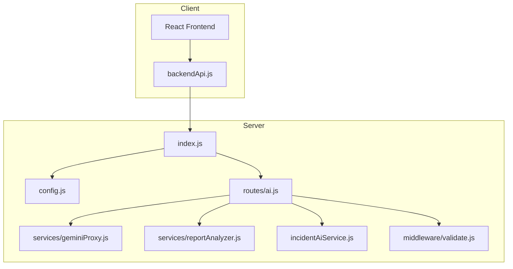
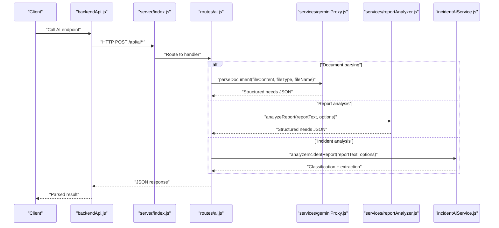
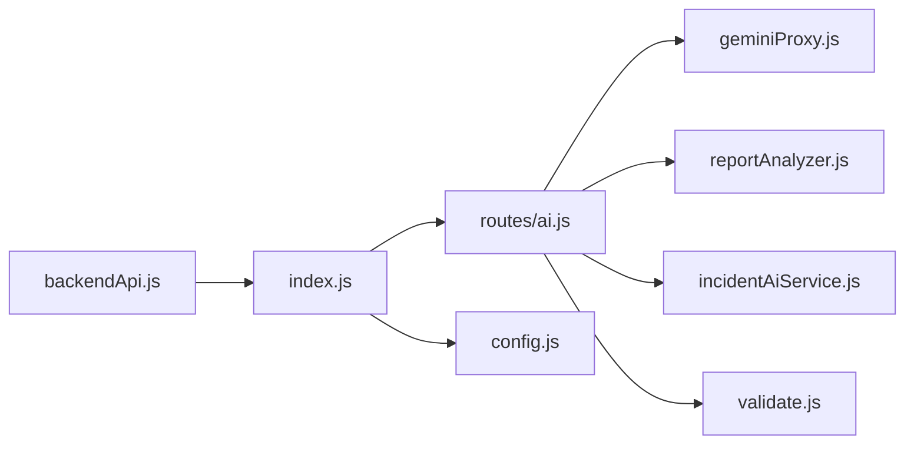

# AI Processing Endpoints

<cite>
**Referenced Files in This Document**
- [server/index.js](file://server/index.js)
- [server/config.js](file://server/config.js)
- [server/routes/ai.js](file://server/routes/ai.js)
- [server/services/geminiProxy.js](file://server/services/geminiProxy.js)
- [server/services/reportAnalyzer.js](file://server/services/reportAnalyzer.js)
- [server/incidentAiService.js](file://server/incidentAiService.js)
- [server/middleware/validate.js](file://server/middleware/validate.js)
- [src/services/backendApi.js](file://src/services/backendApi.js)
- [src/services/gemini.js](file://src/services/gemini.js)
- [src/services/incidentAI.js](file://src/services/incidentAI.js)
- [implementation_plan.md](file://implementation_plan.md)
</cite>

## Table of Contents
1. [Introduction](#introduction)
2. [Project Structure](#project-structure)
3. [Core Components](#core-components)
4. [Architecture Overview](#architecture-overview)
5. [Detailed Component Analysis](#detailed-component-analysis)
6. [Dependency Analysis](#dependency-analysis)
7. [Performance Considerations](#performance-considerations)
8. [Troubleshooting Guide](#troubleshooting-guide)
9. [Conclusion](#conclusion)

## Introduction
This document provides comprehensive API documentation for AI processing endpoints integrated with Gemini and other AI services. It covers:
- Document upload handling and secure proxying to Gemini
- Incident analysis workflows with automated classification and structured extraction
- Natural language processing and summarization for reports
- Request/response schemas, supported formats, size limits, and preprocessing requirements
- Rate limiting, timeouts, and error handling strategies
- Integration patterns with external AI services and fallback mechanisms

## Project Structure
The AI processing layer is implemented in the server module with routes delegating to dedicated services. Client-side wrappers ensure sensitive API keys remain on the backend.

**Diagram sources**
- [server/index.js:1-118](file://server/index.js#L1-L118)
- [server/config.js:1-35](file://server/config.js#L1-L35)
- [server/routes/ai.js:1-348](file://server/routes/ai.js#L1-L348)
- [server/services/geminiProxy.js:1-104](file://server/services/geminiProxy.js#L1-L104)
- [server/services/reportAnalyzer.js:1-665](file://server/services/reportAnalyzer.js#L1-L665)
- [server/incidentAiService.js:1-189](file://server/incidentAiService.js#L1-L189)
- [server/middleware/validate.js:1-80](file://server/middleware/validate.js#L1-L80)
- [src/services/backendApi.js:1-164](file://src/services/backendApi.js#L1-L164)

**Section sources**
- [server/index.js:1-118](file://server/index.js#L1-L118)
- [server/config.js:1-35](file://server/config.js#L1-L35)
- [server/routes/ai.js:1-348](file://server/routes/ai.js#L1-L348)

## Core Components
- AI Routes: Expose endpoints for document parsing, incident analysis, chat, match explanation, and report analysis.
- Gemini Proxy: Securely parses documents and surveys via Gemini, enforcing JSON output and safe prompts.
- Report Analyzer: Extracts structured needs from NGO reports using LLM with keyword-based fallback.
- Incident AI Service: Classifies incidents, extracts location/urgency/resource needs, and normalizes outputs with fallback heuristics.
- Validation and Rate Limiting: Input sanitization/validation and strict rate limits for AI endpoints.

**Section sources**
- [server/routes/ai.js:21-348](file://server/routes/ai.js#L21-L348)
- [server/services/geminiProxy.js:1-104](file://server/services/geminiProxy.js#L1-L104)
- [server/services/reportAnalyzer.js:1-665](file://server/services/reportAnalyzer.js#L1-L665)
- [server/incidentAiService.js:1-189](file://server/incidentAiService.js#L1-L189)
- [server/middleware/validate.js:1-80](file://server/middleware/validate.js#L1-L80)
- [server/index.js:49-76](file://server/index.js#L49-L76)

## Architecture Overview
The AI endpoints are protected behind authentication and rate limiting. Requests are sanitized and validated before being forwarded to AI services. Gemini is accessed server-side to avoid exposing API keys in the client.

**Diagram sources**
- [src/services/backendApi.js:84-126](file://src/services/backendApi.js#L84-L126)
- [server/index.js:49-76](file://server/index.js#L49-L76)
- [server/routes/ai.js:21-348](file://server/routes/ai.js#L21-L348)
- [server/services/geminiProxy.js:53-103](file://server/services/geminiProxy.js#L53-L103)
- [server/services/reportAnalyzer.js:595-626](file://server/services/reportAnalyzer.js#L595-L626)
- [server/incidentAiService.js:170-188](file://server/incidentAiService.js#L170-L188)

## Detailed Component Analysis

### Endpoint Catalog and Specifications

#### POST /api/ai/parse-document
- Purpose: Securely parse uploaded documents or images into structured community needs.
- Authentication: Required
- Body Schema:
  - fileContent: string (required; raw text or base64-encoded binary)
  - fileType: string (optional; MIME type or "text")
  - fileName: string (optional; up to 256 characters)
- Response: Structured needs object (see “Response Schemas” below)
- Notes:
  - Supports text, PDF, JPEG, PNG.
  - Enforces JSON output via system prompt and cleans returned JSON.
  - Body size limit: 10 MB for AI routes.

**Section sources**
- [server/routes/ai.js:21-50](file://server/routes/ai.js#L21-L50)
- [server/services/geminiProxy.js:53-103](file://server/services/geminiProxy.js#L53-L103)
- [server/index.js:70-71](file://server/index.js#L70-L71)

#### POST /api/ai/incident-analyze
- Purpose: Analyze incident report text and return structured classification and extraction.
- Authentication: Required
- Body Schema:
  - reportText: string (required; up to 50000 characters)
  - provider: string (optional; "gemini" | "openai" | "auto")
  - context: object (optional; free-form)
- Response: Classification and extraction payload (see “Response Schemas” below)
- Fallback: If configured provider fails, attempts alternate provider; otherwise returns heuristic output.

**Section sources**
- [server/routes/ai.js:52-76](file://server/routes/ai.js#L52-L76)
- [server/incidentAiService.js:170-188](file://server/incidentAiService.js#L170-L188)

#### POST /api/ai/chat
- Purpose: Natural language processing for operations assistant; returns classification and actionable response.
- Authentication: Required
- Body Schema:
  - message: string (required; non-empty)
  - mode: string (optional; "responder" | "coordinator" | "citizen")
  - context: object (optional; supports emergencyMode, riskScore, aiSnapshot)
- Response: Structured payload with classification, details, and response text.
- Provider: Gemini only; requires API key configured.

**Section sources**
- [server/routes/ai.js:78-178](file://server/routes/ai.js#L78-L178)

#### POST /api/ai/explain-match
- Purpose: Explain why a volunteer is a good or poor fit for a task.
- Authentication: Required
- Body Schema:
  - volunteer: object (required; includes name, skills, distanceKm, tasks, rating, matchScore, available)
  - task: object (required; includes title/category, location/region, requiredSkills, priority, affectedPeople)
- Response: Plain-text explanation string.
- Provider: Gemini only; requires API key configured.

**Section sources**
- [server/routes/ai.js:180-260](file://server/routes/ai.js#L180-L260)

#### POST /api/ai/analyze-report
- Purpose: Extract structured community needs from a single NGO report.
- Authentication: Required
- Body Schema:
  - reportText: string (required; up to 50000 characters)
  - useLLM: boolean (optional; default true if Gemini configured)
- Response: Structured needs object (see “Response Schemas” below)
- Fallback: Keyword-based extraction if LLM unavailable.

**Section sources**
- [server/routes/ai.js:262-290](file://server/routes/ai.js#L262-L290)
- [server/services/reportAnalyzer.js:595-626](file://server/services/reportAnalyzer.js#L595-L626)

#### POST /api/ai/analyze-reports-batch
- Purpose: Batch-process multiple reports concurrently.
- Authentication: Required
- Body Schema:
  - reports: array (required; items must be {id: string, text: string})
- Constraints:
  - Array length ≤ 50
  - Each item must include id and text
- Response: Aggregated results with counts and per-item outcomes.
- Fallback: Each item processed independently; failures recorded per item.

**Section sources**
- [server/routes/ai.js:292-345](file://server/routes/ai.js#L292-L345)
- [server/services/reportAnalyzer.js:634-659](file://server/services/reportAnalyzer.js#L634-L659)

### Response Schemas

#### Document Parsing Response (parse-document)
- Fields:
  - village: string
  - region: string
  - totalRecords: integer
  - summary: string
  - needs: array of objects with:
    - category: string
    - priority: "urgent" | "medium" | "low"
    - volunteersNeeded: integer
    - description: string
    - affectedPeople: integer
    - deadline: string (ISO date)
  - aiInsights: array of strings

**Section sources**
- [server/services/geminiProxy.js:9-39](file://server/services/geminiProxy.js#L9-L39)

#### Incident Analysis Response (incident-analyze)
- Fields:
  - classification: object with
    - category: "flood" | "medical" | "fire" | "earthquake" | "landslide" | "food" | "shelter" | "other"
    - severityScore: integer (1–10)
  - extraction: object with
    - location: string or null
    - urgencyLevel: "critical" | "high" | "medium" | "low"
    - resourceNeeded: string
  - summary: string
  - riskScore: integer (1–10)
  - tags: array of strings (≤6)

**Section sources**
- [server/incidentAiService.js:90-115](file://server/incidentAiService.js#L90-L115)
- [server/incidentAiService.js:16-44](file://server/incidentAiService.js#L16-L44)

#### Chat Response (chat)
- Fields:
  - classification: "emergency" | "resource_request" | "report" | "other"
  - details: object with
    - location: string or null
    - urgency: "critical" | "high" | "medium" | "low" | "unknown"
    - type: string
  - response: string

**Section sources**
- [server/routes/ai.js:100-109](file://server/routes/ai.js#L100-L109)

#### Match Explanation Response (explain-match)
- Fields:
  - explanation: string (plain text)

**Section sources**
- [server/routes/ai.js:216-218](file://server/routes/ai.js#L216-L218)

#### Report Analysis Response (analyze-report)
- Fields:
  - location: string
  - urgency_level: "low" | "medium" | "high"
  - needs: array of strings (detected categories)
  - classified_needs: array of objects with
    - type: string
    - priority: "high" | "medium" | "low"
  - affected_people_estimate: integer
  - summary: string (2–3 sentences)
  - confidence_score: number (0–1)
  - _reasoning: object with explanations for each field
  - _extraction_method: "llm" | "keyword_fallback"

**Section sources**
- [server/services/reportAnalyzer.js:404-469](file://server/services/reportAnalyzer.js#L404-L469)
- [server/services/reportAnalyzer.js:484-536](file://server/services/reportAnalyzer.js#L484-L536)

### Supported File Formats and Preprocessing
- Document parsing supports:
  - Text/plain
  - Application/pdf
  - Image/jpeg
  - Image/png
- Preprocessing:
  - Client-side helpers convert files to text or base64.
  - Server enforces JSON output and cleans returned JSON.
  - Validation middleware sanitizes inputs and enforces schema constraints.

**Section sources**
- [server/services/geminiProxy.js:67-77](file://server/services/geminiProxy.js#L67-L77)
- [src/services/gemini.js:15-31](file://src/services/gemini.js#L15-L31)
- [server/middleware/validate.js:11-41](file://server/middleware/validate.js#L11-L41)

### Rate Limiting and Timeouts
- Global rate limiting:
  - Window: 15 minutes
  - Max requests: 100 per IP
- AI-specific rate limiting:
  - Window: 15 minutes
  - Max requests: 20 per IP
- Body size limits:
  - Global: 1 MB
  - AI routes: 10 MB
- Timeouts:
  - Gemini calls are subject to upstream service timeouts; errors are surfaced with HTTP 502/500 responses.

**Section sources**
- [server/index.js:49-76](file://server/index.js#L49-L76)
- [server/config.js:21-24](file://server/config.js#L21-L24)

### Error Handling Strategies
- Validation errors: HTTP 400 with details
- Authentication/authorization: HTTP 401 (handled by middleware)
- Provider errors: HTTP 502 for Gemini failures; HTTP 500 for internal errors
- Fallback mechanisms:
  - Incident analysis: Attempts alternate provider or heuristic fallback
  - Report analysis: Falls back to keyword extraction if LLM fails
  - Document parsing: Throws descriptive errors for invalid JSON or API errors

**Section sources**
- [server/routes/ai.js:42-48](file://server/routes/ai.js#L42-L48)
- [server/routes/ai.js:69-74](file://server/routes/ai.js#L69-L74)
- [server/routes/ai.js:155-158](file://server/routes/ai.js#L155-L158)
- [server/incidentAiService.js:179-188](file://server/incidentAiService.js#L179-L188)
- [server/services/reportAnalyzer.js:618-622](file://server/services/reportAnalyzer.js#L618-L622)
- [server/services/geminiProxy.js:89-92](file://server/services/geminiProxy.js#L89-L92)

### Integration Patterns and Security
- Client-to-server integration:
  - Client uses backendApi wrapper to call AI endpoints.
  - API key remains on the server; client only sends file content and metadata.
- Provider selection:
  - Incident analysis supports "gemini", "openai", or "auto".
  - Report analysis uses Gemini LLM with keyword fallback.
- CORS and headers:
  - Strict CORS origin configuration and secure headers enforced.

**Section sources**
- [src/services/backendApi.js:84-126](file://src/services/backendApi.js#L84-L126)
- [src/services/gemini.js:11-13](file://src/services/gemini.js#L11-L13)
- [server/incidentAiService.js:170-178](file://server/incidentAiService.js#L170-L178)
- [server/index.js:37-43](file://server/index.js#L37-L43)

## Dependency Analysis

**Diagram sources**
- [src/services/backendApi.js:1-164](file://src/services/backendApi.js#L1-L164)
- [server/index.js:1-118](file://server/index.js#L1-L118)
- [server/routes/ai.js:1-348](file://server/routes/ai.js#L1-L348)
- [server/services/geminiProxy.js:1-104](file://server/services/geminiProxy.js#L1-L104)
- [server/services/reportAnalyzer.js:1-665](file://server/services/reportAnalyzer.js#L1-L665)
- [server/incidentAiService.js:1-189](file://server/incidentAiService.js#L1-L189)
- [server/middleware/validate.js:1-80](file://server/middleware/validate.js#L1-L80)
- [server/config.js:1-35](file://server/config.js#L1-L35)

**Section sources**
- [server/routes/ai.js:1-9](file://server/routes/ai.js#L1-L9)
- [server/services/geminiProxy.js:7](file://server/services/geminiProxy.js#L7)
- [server/services/reportAnalyzer.js:6](file://server/services/reportAnalyzer.js#L6)
- [server/incidentAiService.js:3-6](file://server/incidentAiService.js#L3-L6)

## Performance Considerations
- Rate limiting prevents abuse of expensive AI operations.
- Body size limits protect server resources for file uploads.
- Batch report analysis enables throughput scaling while preserving per-request reliability.
- Fallback mechanisms ensure continuity when upstream providers fail.

[No sources needed since this section provides general guidance]

## Troubleshooting Guide
- Missing API key:
  - Symptom: HTTP 500 with “Server is missing GEMINI_API_KEY.”
  - Resolution: Set GEMINI_API_KEY in environment.
- Validation failures:
  - Symptom: HTTP 400 with validation errors.
  - Resolution: Ensure required fields and types match schemas.
- Rate limit exceeded:
  - Symptom: HTTP 429 with rate limit messages.
  - Resolution: Reduce request frequency or adjust limits via environment.
- Gemini request failures:
  - Symptom: HTTP 502 with provider error details.
  - Resolution: Retry after cooldown; verify provider credentials and quotas.
- Unexpected JSON from provider:
  - Symptom: Parse errors during response processing.
  - Resolution: Confirm provider returns strict JSON; server cleans returned text.

**Section sources**
- [server/routes/ai.js:92-94](file://server/routes/ai.js#L92-L94)
- [server/middleware/validate.js:48-62](file://server/middleware/validate.js#L48-L62)
- [server/index.js:50-68](file://server/index.js#L50-L68)
- [server/routes/ai.js:155-158](file://server/routes/ai.js#L155-L158)
- [server/services/geminiProxy.js:98-102](file://server/services/geminiProxy.js#L98-L102)

## Conclusion
The AI processing endpoints provide a secure, validated, and resilient interface to Gemini and other AI services. They support document parsing, incident classification, report analysis, and match explanations with strong fallbacks and rate controls. Clients interact exclusively through the backend, ensuring API key protection and consistent behavior across environments.