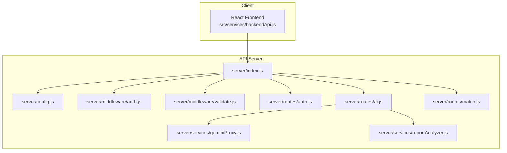
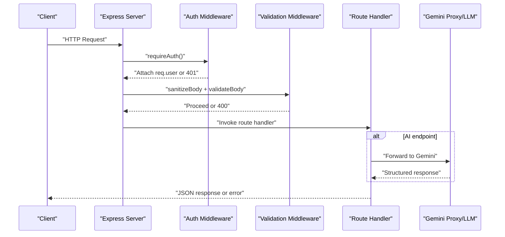
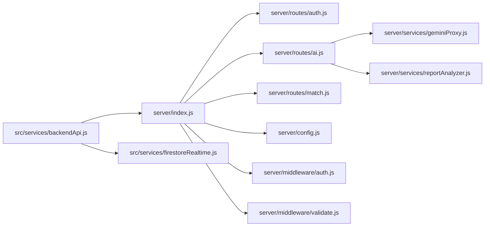

# API Documentation

<cite>
**Referenced Files in This Document**
- [server/index.js](file://server/index.js)
- [server/config.js](file://server/config.js)
- [server/middleware/auth.js](file://server/middleware/auth.js)
- [server/middleware/validate.js](file://server/middleware/validate.js)
- [server/routes/auth.js](file://server/routes/auth.js)
- [server/routes/ai.js](file://server/routes/ai.js)
- [server/routes/match.js](file://server/routes/match.js)
- [server/services/geminiProxy.js](file://server/services/geminiProxy.js)
- [server/services/reportAnalyzer.js](file://server/services/reportAnalyzer.js)
- [src/services/backendApi.js](file://src/services/backendApi.js)
- [src/services/firestoreRealtime.js](file://src/services/firestoreRealtime.js)
- [server/test/api-test-report.http](file://server/test/api-test-report.http)
- [server/test/quick-test.js](file://server/test/quick-test.js)
</cite>

## Table of Contents
1. [Introduction](#introduction)
2. [Project Structure](#project-structure)
3. [Core Components](#core-components)
4. [Architecture Overview](#architecture-overview)
5. [Detailed Component Analysis](#detailed-component-analysis)
6. [Dependency Analysis](#dependency-analysis)
7. [Performance Considerations](#performance-considerations)
8. [Troubleshooting Guide](#troubleshooting-guide)
9. [Conclusion](#conclusion)
10. [Appendices](#appendices)

## Introduction
This document provides comprehensive API documentation for the NeedLink platform’s backend REST endpoints and service integrations. It covers:
- Authentication endpoints (login, register)
- AI processing endpoints (document parsing, incident analysis, report analysis, batch report analysis, chat, match explanation)
- Volunteer matching endpoints (ranking and recommendation)
- Authentication methods, request/response schemas, error handling, and rate limiting
- Integration with the Gemini AI proxy service
- API versioning and backward compatibility
- Webhook and real-time data streaming considerations
- Client implementation guidelines and performance optimization tips

## Project Structure
The API server is implemented with Express and organized into modular routes and services. The frontend integrates with the backend via a thin HTTP client wrapper.

**Diagram sources**
- [server/index.js:1-118](file://server/index.js#L1-L118)
- [server/config.js:1-35](file://server/config.js#L1-L35)
- [server/middleware/auth.js:1-49](file://server/middleware/auth.js#L1-L49)
- [server/middleware/validate.js:1-80](file://server/middleware/validate.js#L1-L80)
- [server/routes/auth.js:1-83](file://server/routes/auth.js#L1-L83)
- [server/routes/ai.js:1-348](file://server/routes/ai.js#L1-L348)
- [server/routes/match.js:1-120](file://server/routes/match.js#L1-L120)
- [server/services/geminiProxy.js:1-104](file://server/services/geminiProxy.js#L1-L104)
- [server/services/reportAnalyzer.js:1-527](file://server/services/reportAnalyzer.js#L1-L527)
- [src/services/backendApi.js:1-164](file://src/services/backendApi.js#L1-L164)

**Section sources**
- [server/index.js:1-118](file://server/index.js#L1-L118)
- [server/config.js:1-35](file://server/config.js#L1-L35)

## Core Components
- Authentication middleware: Validates JWT tokens from Authorization headers and attaches user info to requests.
- Validation middleware: Sanitizes and validates request bodies against defined schemas.
- Routes: Expose endpoints for auth, AI, and matching.
- Services: Implement AI proxies and report analysis logic.
- Client wrapper: Provides typed methods for backend endpoints and manages JWT persistence.

**Section sources**
- [server/middleware/auth.js:14-48](file://server/middleware/auth.js#L14-L48)
- [server/middleware/validate.js:36-80](file://server/middleware/validate.js#L36-L80)
- [src/services/backendApi.js:33-163](file://src/services/backendApi.js#L33-L163)

## Architecture Overview
The server enforces secure headers, logs requests, applies CORS, and rate limits. Authentication is mandatory for protected endpoints. AI endpoints proxy requests to Gemini and enforce stricter rate limits. Matching endpoints leverage caching for performance.

**Diagram sources**
- [server/index.js:28-101](file://server/index.js#L28-L101)
- [server/middleware/auth.js:14-48](file://server/middleware/auth.js#L14-L48)
- [server/middleware/validate.js:36-80](file://server/middleware/validate.js#L36-L80)
- [server/routes/ai.js:30-178](file://server/routes/ai.js#L30-L178)

## Detailed Component Analysis

### Authentication Endpoints
- POST /api/auth/login
  - Purpose: Authenticate and return a JWT token.
  - Headers: Content-Type: application/json
  - Body: { email, password }
  - Responses:
    - 200 OK: { token, account: { email, name, type } }
    - 400 Bad Request: Missing fields
    - 401 Unauthorized: Invalid credentials
  - Notes: Demo accounts are embedded; in production, replace with database/Firebase Admin verification.

- POST /api/auth/register
  - Purpose: Register a new account and return a JWT token.
  - Body: { email, password, name, type }
  - Responses:
    - 201 Created: { token, account }
    - 400 Bad Request: Missing required fields
    - 409 Conflict: Email already exists

**Section sources**
- [server/routes/auth.js:28-80](file://server/routes/auth.js#L28-L80)

### AI Processing Endpoints
- POST /api/ai/parse-document
  - Purpose: Securely parse documents via Gemini proxy (supports text and image/pdf).
  - Auth: Required
  - Body: { fileContent, fileType?, fileName? }
  - Responses:
    - 200 OK: Structured community needs object
    - 400 Bad Request: Validation errors
    - 502 Bad Gateway: Gemini upstream failure
    - 500 Internal Server Error: Server misconfiguration
  - Notes: Enforces 10MB body limit at route level.

- POST /api/ai/incident-analyze
  - Purpose: Analyze incident reports using configured provider.
  - Auth: Required
  - Body: { reportText, provider?, context? }
  - Responses:
    - 200 OK: Analysis result
    - 400 Bad Request: Missing reportText
    - 500 Internal Server Error: Provider failure

- POST /api/ai/chat
  - Purpose: Operational assistant chat with classification and actionable response.
  - Auth: Required
  - Body: { message, mode?, context? }
  - Responses:
    - 200 OK: { classification, details, response }
    - 400 Bad Request: Missing message
    - 500 Internal Server Error: Missing API key
    - 502 Bad Gateway: Gemini upstream failure

- POST /api/ai/explain-match
  - Purpose: Natural-language explanation of volunteer-task match quality.
  - Auth: Required
  - Body: { volunteer, task }
  - Responses:
    - 200 OK: { explanation }
    - 500 Internal Server Error: Missing API key
    - 502 Bad Gateway: Gemini upstream failure

- POST /api/ai/analyze-report
  - Purpose: Extract structured needs from unstructured NGO reports.
  - Auth: Required
  - Body: { reportText, useLLM? }
  - Responses:
    - 200 OK: Structured needs object (fallback to keyword extraction if LLM fails)
    - 400 Bad Request: Validation errors
    - 500 Internal Server Error: Extraction failure

- POST /api/ai/analyze-reports-batch
  - Purpose: Batch process multiple reports.
  - Auth: Required
  - Body: { reports: [{ id, text }] }
  - Constraints: Up to 50 reports; each must have id and text
  - Responses:
    - 200 OK: { total, successful, failed, results[] }
    - 400 Bad Request: Invalid payload or limits exceeded
    - 500 Internal Server Error: Batch processing failure

**Section sources**
- [server/routes/ai.js:21-345](file://server/routes/ai.js#L21-L345)
- [server/services/geminiProxy.js:53-103](file://server/services/geminiProxy.js#L53-L103)
- [server/services/reportAnalyzer.js:457-521](file://server/services/reportAnalyzer.js#L457-L521)

### Volunteer Matching Endpoints
- POST /api/match
  - Purpose: Rank volunteers for a single task with caching.
  - Auth: Required
  - Body: { task, volunteers[], useCache? }
  - Responses:
    - 200 OK: { ranked[], fromCache, cacheStats }
    - 500 Internal Server Error: Matching computation failure

- POST /api/match/recommend
  - Purpose: Generate recommendations for multiple tasks.
  - Auth: Required
  - Body: { tasks[], volunteers[], autoAssign? }
  - Responses:
    - 200 OK: { recommendations }
    - 500 Internal Server Error: Recommendation generation failure

- GET /api/match/cache-stats
  - Purpose: Monitor cache performance.
  - Auth: Required
  - Responses:
    - 200 OK: Cache stats object
    - 500 Internal Server Error: Cache failure

**Section sources**
- [server/routes/match.js:23-117](file://server/routes/match.js#L23-L117)

### Authentication Methods
- JWT Bearer tokens in Authorization header: Bearer <token>
- Token signing and verification use a configurable secret and expiry window.
- Production note: Replace with Firebase Admin verifyIdToken if migrating to Firebase Authentication.

**Section sources**
- [server/middleware/auth.js:14-48](file://server/middleware/auth.js#L14-L48)
- [server/config.js:17-19](file://server/config.js#L17-L19)

### Request/Response Schemas
- Authentication
  - Login: { email: string, password: string }
  - Register: { email: string, password: string, name: string, type?: string }
- AI
  - parse-document: { fileContent: string, fileType?: string, fileName?: string }
  - incident-analyze: { reportText: string, provider?: string, context?: object }
  - chat: { message: string, mode?: string, context?: object }
  - explain-match: { volunteer: object, task: object }
  - analyze-report: { reportText: string, useLLM?: boolean }
  - analyze-reports-batch: { reports: [{ id: string, text: string }] }
- Matching
  - match: { task: object, volunteers: object[], useCache?: boolean }
  - recommend: { tasks: object[], volunteers: object[], autoAssign?: boolean }

**Section sources**
- [server/routes/auth.js:34-80](file://server/routes/auth.js#L34-L80)
- [server/routes/ai.js:25-345](file://server/routes/ai.js#L25-L345)
- [server/routes/match.js:28-105](file://server/routes/match.js#L28-L105)

### Error Handling Strategies
- Authentication failures return 401 with contextual messages.
- Validation failures return 400 with details.
- AI endpoints return 502 for upstream Gemini failures and 500 for server misconfiguration.
- General 500 errors include stack traces in non-production environments.
- 404 Not Found for unknown endpoints.

**Section sources**
- [server/middleware/auth.js:17-36](file://server/middleware/auth.js#L17-L36)
- [server/middleware/validate.js:57-61](file://server/middleware/validate.js#L57-L61)
- [server/routes/ai.js:42-48](file://server/routes/ai.js#L42-L48)
- [server/index.js:94-101](file://server/index.js#L94-L101)
- [server/index.js:89-92](file://server/index.js#L89-L92)

### Rate Limiting Policies
- Global rate limiter: Window and max configurable via environment variables.
- Stricter AI rate limiter: Separate window and max for /api/ai/.
- Body size limits: 1MB default; 10MB for AI routes.

**Section sources**
- [server/index.js:50-71](file://server/index.js#L50-L71)
- [server/config.js:21-24](file://server/config.js#L21-L24)

### Gemini AI Proxy Integration
- The server acts as a secure proxy for Gemini, preventing API keys from leaking to clients.
- Supports structured JSON extraction prompts and fallbacks to keyword-based extraction when LLM is unavailable.
- Configurable model and API key via environment variables.

**Section sources**
- [server/services/geminiProxy.js:53-103](file://server/services/geminiProxy.js#L53-L103)
- [server/services/reportAnalyzer.js:403-446](file://server/services/reportAnalyzer.js#L403-L446)
- [server/config.js:11-15](file://server/config.js#L11-L15)

### API Versioning and Backward Compatibility
- Health endpoint exposes version: 1.0.0.
- Current routes maintain stable payloads; validation middleware ensures minimal breaking changes.
- Recommendations:
  - Introduce Accept-Version header for future major versions.
  - Keep deprecated endpoints for a deprecation period with warnings.

**Section sources**
- [server/index.js:79-87](file://server/index.js#L79-L87)

### Webhooks and Real-Time Streaming
- Real-time subscriptions to Firestore collections are handled client-side via onSnapshot listeners.
- Backend does not expose webhooks; use client-side Firestore listeners for real-time updates.

**Section sources**
- [src/services/firestoreRealtime.js:61-116](file://src/services/firestoreRealtime.js#L61-L116)

### Client Implementation Guidelines
- Use the backend API wrapper to manage tokens and typed requests.
- Persist tokens in sessionStorage for session lifetime.
- Apply exponential backoff for retrying transient 5xx and 502 responses.
- Respect rate limits; implement client-side throttling for AI endpoints.

**Section sources**
- [src/services/backendApi.js:33-163](file://src/services/backendApi.js#L33-L163)

## Dependency Analysis

**Diagram sources**
- [server/index.js:22-24](file://server/index.js#L22-L24)
- [server/routes/ai.js:4-7](file://server/routes/ai.js#L4-L7)
- [server/services/geminiProxy.js:7](file://server/services/geminiProxy.js#L7)
- [server/services/reportAnalyzer.js:6](file://server/services/reportAnalyzer.js#L6)
- [src/services/backendApi.js:33-54](file://src/services/backendApi.js#L33-L54)
- [src/services/firestoreRealtime.js:1-17](file://src/services/firestoreRealtime.js#L1-L17)

**Section sources**
- [server/index.js:22-24](file://server/index.js#L22-L24)
- [server/routes/ai.js:4-7](file://server/routes/ai.js#L4-L7)

## Performance Considerations
- Enable caching for matching results to reduce computation overhead.
- Use batch endpoints for multiple reports to minimize round trips.
- Apply client-side exponential backoff for transient failures.
- Monitor cache stats endpoint to tune cache TTL and size.

**Section sources**
- [server/routes/match.js:11-21](file://server/routes/match.js#L11-L21)
- [server/routes/match.js:108-117](file://server/routes/match.js#L108-L117)

## Troubleshooting Guide
- Authentication failures: Verify Authorization header format and token validity.
- Validation errors: Ensure required fields conform to schema and size limits.
- AI failures: Confirm GEMINI_API_KEY is configured and upstream is reachable.
- Rate limit exceeded: Reduce request frequency or adjust server-side limits.
- Health checks: Use /api/health to confirm server status and Gemini configuration.

**Section sources**
- [server/middleware/auth.js:17-36](file://server/middleware/auth.js#L17-L36)
- [server/middleware/validate.js:57-61](file://server/middleware/validate.js#L57-L61)
- [server/routes/ai.js:92-94](file://server/routes/ai.js#L92-L94)
- [server/index.js:50-71](file://server/index.js#L50-L71)
- [server/index.js:79-87](file://server/index.js#L79-L87)

## Conclusion
The API provides a secure, validated, and rate-limited interface for authentication, AI processing, and volunteer matching. It integrates with Gemini securely and offers real-time capabilities through client-side Firestore listeners. Follow the guidelines to implement robust clients and optimize performance.

## Appendices

### Endpoint Reference Summary
- Authentication
  - POST /api/auth/login
  - POST /api/auth/register
- AI
  - POST /api/ai/parse-document
  - POST /api/ai/incident-analyze
  - POST /api/ai/chat
  - POST /api/ai/explain-match
  - POST /api/ai/analyze-report
  - POST /api/ai/analyze-reports-batch
- Matching
  - POST /api/match
  - POST /api/match/recommend
  - GET /api/match/cache-stats
- Monitoring
  - GET /api/health

**Section sources**
- [server/index.js:74-87](file://server/index.js#L74-L87)

### Example Requests and Responses
- Login
  - Request: POST /api/auth/login with { email, password }
  - Response: { token, account }
- Report Analysis
  - Request: POST /api/ai/analyze-report with { reportText, useLLM? }
  - Response: Structured needs object
- Batch Analysis
  - Request: POST /api/ai/analyze-reports-batch with { reports[] }
  - Response: { total, successful, failed, results[] }

**Section sources**
- [server/test/api-test-report.http:8-83](file://server/test/api-test-report.http#L8-L83)
- [server/test/quick-test.js:10-86](file://server/test/quick-test.js#L10-L86)