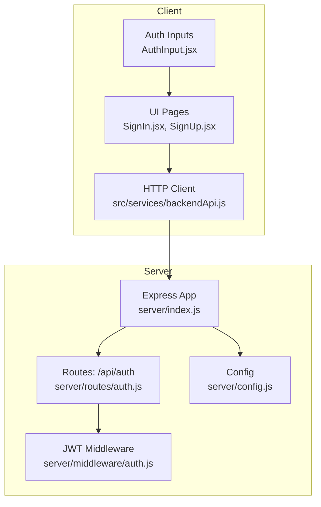
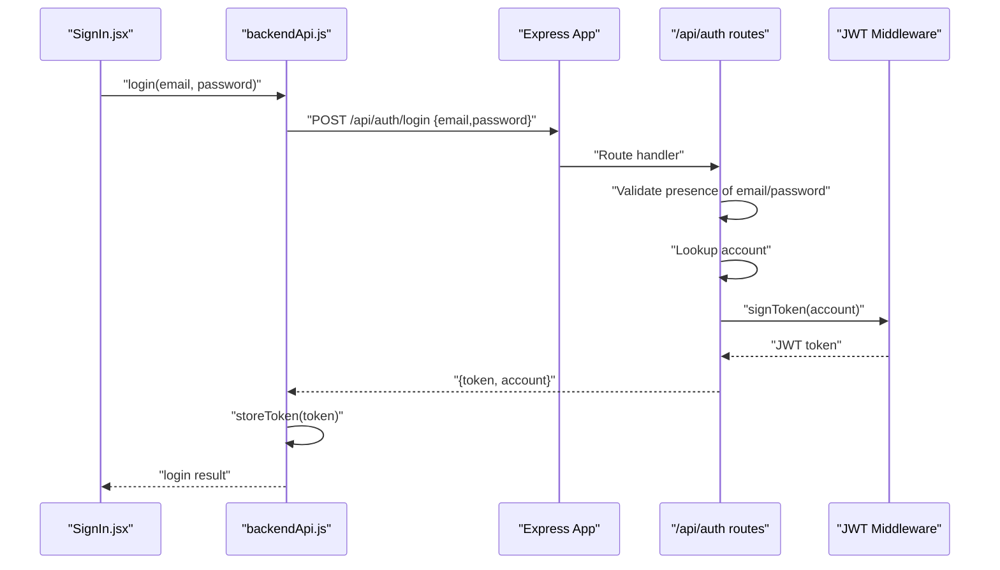
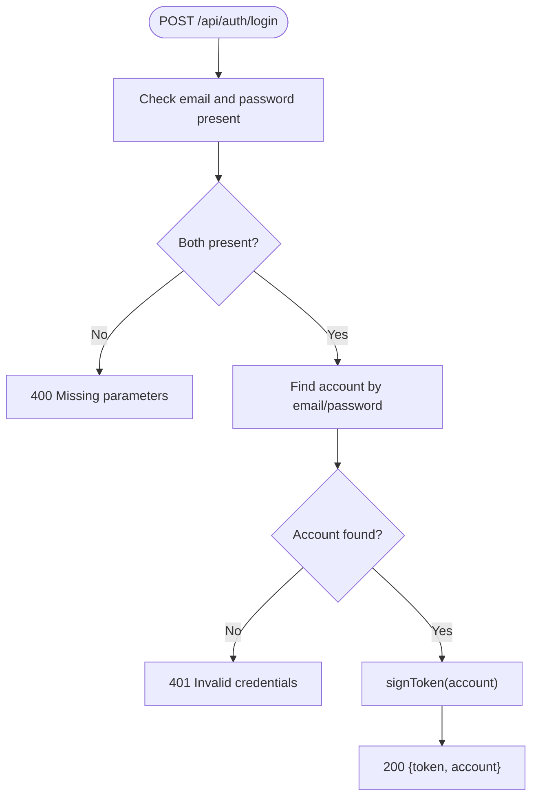
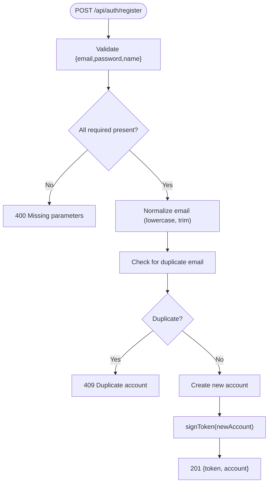
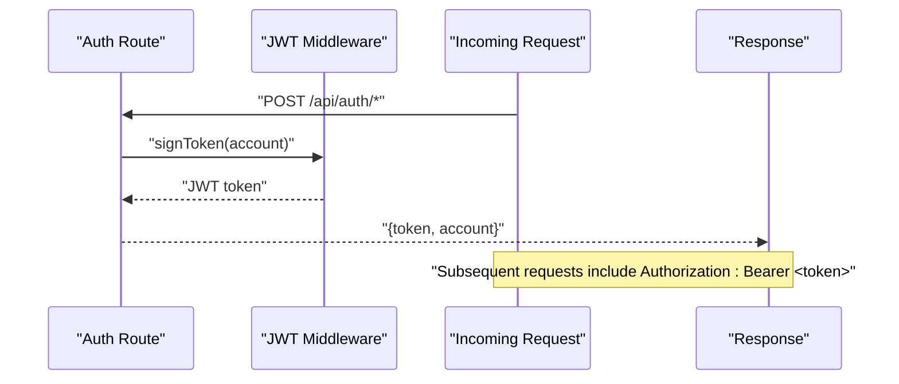
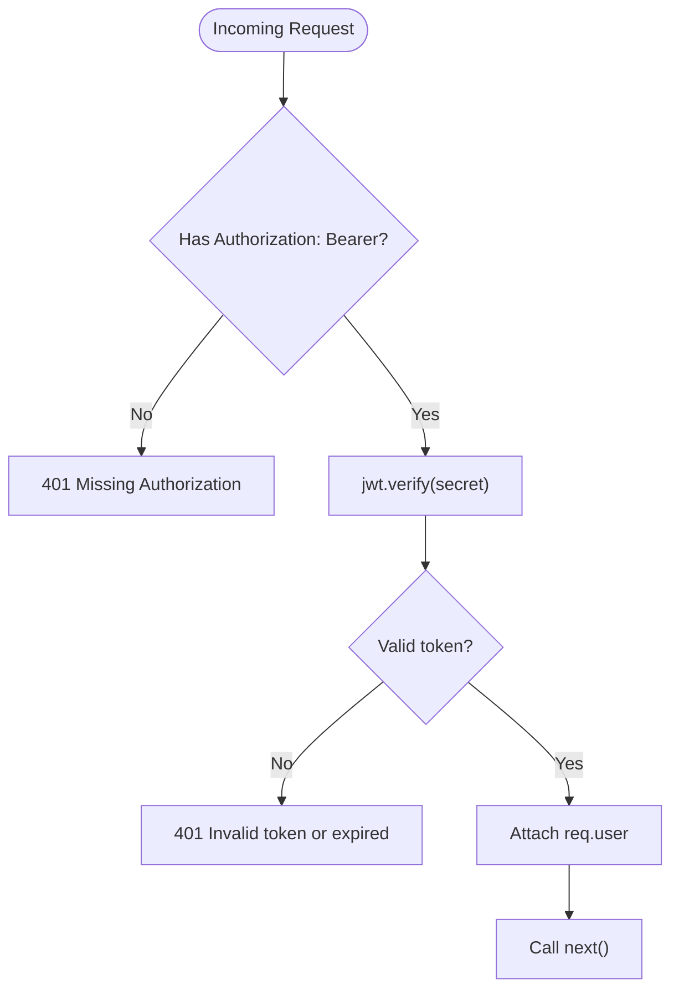
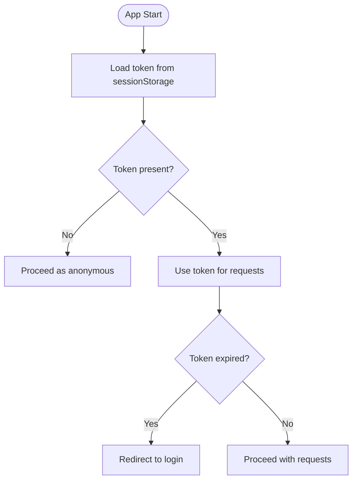
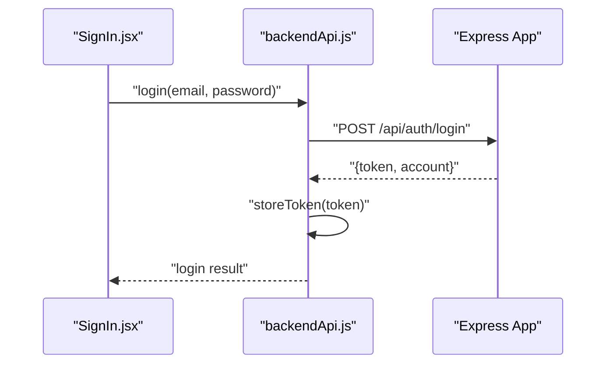
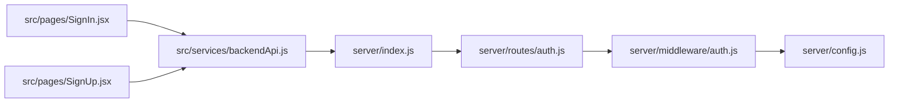

# Authentication Endpoints

<cite>
**Referenced Files in This Document**
- [server/index.js](file://server/index.js)
- [server/config.js](file://server/config.js)
- [server/routes/auth.js](file://server/routes/auth.js)
- [server/middleware/auth.js](file://server/middleware/auth.js)
- [server/middleware/validate.js](file://server/middleware/validate.js)
- [src/services/backendApi.js](file://src/services/backendApi.js)
- [src/pages/SignIn.jsx](file://src/pages/SignIn.jsx)
- [src/pages/SignUp.jsx](file://src/services/api.js)
- [src/components/AuthInput.jsx](file://src/components/AuthInput.jsx)
</cite>

## Table of Contents
1. [Introduction](#introduction)
2. [Project Structure](#project-structure)
3. [Core Components](#core-components)
4. [Architecture Overview](#architecture-overview)
5. [Detailed Component Analysis](#detailed-component-analysis)
6. [Dependency Analysis](#dependency-analysis)
7. [Performance Considerations](#performance-considerations)
8. [Troubleshooting Guide](#troubleshooting-guide)
9. [Conclusion](#conclusion)
10. [Appendices](#appendices)

## Introduction
This document provides comprehensive API documentation for the authentication endpoints, focusing on:
- POST /api/auth/login with request body schema {email, password} and response format {token, account}
- POST /api/auth/register with registration requirements and validation rules
- JWT token generation, expiration handling, and security considerations
- Authentication middleware usage patterns, token refresh mechanisms, and session management
- Error responses for invalid credentials, duplicate accounts, and missing parameters
- Client-side implementation examples showing proper authentication flow, token storage, and protected route access

## Project Structure
The authentication system spans both the server (Express) and the client (React) applications:
- Server exposes authentication routes and middleware for JWT verification and signing
- Client integrates with a thin HTTP client that manages tokens and protected requests

**Diagram sources**
- [server/index.js:104-117](file://server/index.js#L104-L117)
- [server/routes/auth.js:1-83](file://server/routes/auth.js#L1-L83)
- [server/middleware/auth.js:14-48](file://server/middleware/auth.js#L14-L48)
- [server/config.js:17-19](file://server/config.js#L17-L19)
- [src/services/backendApi.js:33-82](file://src/services/backendApi.js#L33-L82)
- [src/pages/SignIn.jsx:14-22](file://src/pages/SignIn.jsx#L14-L22)
- [src/pages/SignUp.jsx:26-44](file://src/pages/SignUp.jsx#L26-L44)
- [src/components/AuthInput.jsx:3-14](file://src/components/AuthInput.jsx#L3-L14)

**Section sources**
- [server/index.js:74-76](file://server/index.js#L74-L76)
- [server/config.js:17-19](file://server/config.js#L17-L19)
- [src/services/backendApi.js:17-18](file://src/services/backendApi.js#L17-L18)

## Core Components
- Authentication routes: login and register endpoints
- JWT middleware: token verification and signing
- Client HTTP service: token persistence and Authorization header injection
- Client UI pages: form handling and demo account usage

Key responsibilities:
- Login validates credentials and returns a signed JWT plus account info
- Register validates required fields, checks uniqueness, persists a new account, and returns a JWT
- JWT middleware enforces Authorization: Bearer token requirement and verifies tokens
- Client stores the JWT in sessionStorage and attaches it to all authenticated requests

**Section sources**
- [server/routes/auth.js:28-80](file://server/routes/auth.js#L28-L80)
- [server/middleware/auth.js:14-48](file://server/middleware/auth.js#L14-L48)
- [src/services/backendApi.js:19-77](file://src/services/backendApi.js#L19-L77)

## Architecture Overview
The authentication flow connects client UI, HTTP client, server routes, and JWT middleware.

**Diagram sources**
- [src/pages/SignIn.jsx:14-22](file://src/pages/SignIn.jsx#L14-L22)
- [src/services/backendApi.js:63-71](file://src/services/backendApi.js#L63-L71)
- [server/index.js:74](file://server/index.js#L74)
- [server/routes/auth.js:34-52](file://server/routes/auth.js#L34-L52)
- [server/middleware/auth.js:42-48](file://server/middleware/auth.js#L42-L48)

## Detailed Component Analysis

### POST /api/auth/login
- Purpose: Authenticate a user with email and password
- Request body schema: {email, password}
- Response format: {token, account}
  - token: JWT string
  - account: {email, name, type}

Behavior:
- Validates presence of email and password
- Looks up the account among built-in and dynamically registered accounts
- Generates a JWT with configured expiration
- Returns token and account details

Error responses:
- 400 Bad Request: Missing email or password
- 401 Unauthorized: Invalid credentials

**Diagram sources**
- [server/routes/auth.js:34-52](file://server/routes/auth.js#L34-L52)

**Section sources**
- [server/routes/auth.js:28-52](file://server/routes/auth.js#L28-L52)

### POST /api/auth/register
- Purpose: Create a new account and log in immediately
- Request body schema: {email, password, name, type}
- Response format: {token, account}
  - token: JWT string
  - account: {email, name, type}

Behavior:
- Validates presence of email, password, and name
- Normalizes email to lowercase and trims whitespace
- Checks for duplicate email across built-in and dynamic accounts
- Creates a new account with optional type (defaults to a predefined type if omitted)
- Persists the new account in memory
- Generates a JWT and returns it with account details

Error responses:
- 400 Bad Request: Missing required fields
- 409 Conflict: Duplicate email

**Diagram sources**
- [server/routes/auth.js:60-80](file://server/routes/auth.js#L60-L80)

**Section sources**
- [server/routes/auth.js:54-80](file://server/routes/auth.js#L54-L80)

### JWT Token Generation and Expiration
- Token signing: Uses HS256 with a secret from configuration
- Expiration: Configurable via environment variable
- Verification: Middleware extracts Authorization: Bearer header, verifies signature, and attaches decoded payload to request

**Diagram sources**
- [server/middleware/auth.js:14-48](file://server/middleware/auth.js#L14-L48)
- [server/config.js:17-19](file://server/config.js#L17-L19)

**Section sources**
- [server/middleware/auth.js:42-48](file://server/middleware/auth.js#L42-L48)
- [server/config.js:17-19](file://server/config.js#L17-L19)

### Authentication Middleware Usage Patterns
- requireAuth: Enforces Bearer token presence and validity
- Attaches decoded payload (email, name, type) to req.user for downstream handlers
- Returns 401 with hints for missing/invalid tokens

**Diagram sources**
- [server/middleware/auth.js:14-37](file://server/middleware/auth.js#L14-L37)

**Section sources**
- [server/middleware/auth.js:14-37](file://server/middleware/auth.js#L14-L37)

### Token Refresh Mechanisms and Session Management
- Current implementation does not include a dedicated token refresh endpoint
- Token lifetime is controlled by configuration; clients should re-authenticate after expiration
- Client stores the JWT in sessionStorage for the current browser tab session

**Diagram sources**
- [src/services/backendApi.js:19-31](file://src/services/backendApi.js#L19-L31)
- [server/middleware/auth.js:30-36](file://server/middleware/auth.js#L30-L36)

**Section sources**
- [src/services/backendApi.js:19-31](file://src/services/backendApi.js#L19-L31)
- [server/middleware/auth.js:30-36](file://server/middleware/auth.js#L30-L36)

### Client-Side Implementation Examples
- Login flow: Collects email/password, calls backend login, stores token, and signals successful login
- Registration flow: Validates form fields, normalizes email, calls backend register, stores token, and signals completion
- Protected requests: All backendApi methods automatically attach Authorization: Bearer header when a token is present

**Diagram sources**
- [src/pages/SignIn.jsx:14-22](file://src/pages/SignIn.jsx#L14-L22)
- [src/services/backendApi.js:63-71](file://src/services/backendApi.js#L63-L71)

**Section sources**
- [src/pages/SignIn.jsx:14-22](file://src/pages/SignIn.jsx#L14-L22)
- [src/pages/SignUp.jsx:26-44](file://src/pages/SignUp.jsx#L26-L44)
- [src/services/backendApi.js:33-82](file://src/services/backendApi.js#L33-L82)

## Dependency Analysis
- server/index.js mounts the auth router and applies global middleware (security headers, CORS, rate limiting)
- server/routes/auth.js depends on server/middleware/auth.js for JWT signing and on server/config.js for secrets/expiry
- src/services/backendApi.js depends on environment variables for API base URL and manages token lifecycle
- Client UI pages depend on backendApi for authentication operations

**Diagram sources**
- [server/index.js:74-76](file://server/index.js#L74-L76)
- [server/routes/auth.js:2,42](file://server/routes/auth.js#L2,L42)
- [server/middleware/auth.js:1,42](file://server/middleware/auth.js#L1,L42)
- [server/config.js:17-19](file://server/config.js#L17-L19)
- [src/services/backendApi.js:17,33](file://src/services/backendApi.js#L17,L33)

**Section sources**
- [server/index.js:28-76](file://server/index.js#L28-L76)
- [server/routes/auth.js:2,42](file://server/routes/auth.js#L2,L42)
- [server/middleware/auth.js:1,42](file://server/middleware/auth.js#L1,L42)
- [server/config.js:17-19](file://server/config.js#L17-L19)
- [src/services/backendApi.js:17,33](file://src/services/backendApi.js#L17,L33)

## Performance Considerations
- Rate limiting is applied to the /api/ path to mitigate abuse; AI endpoints have stricter limits
- JWT verification is lightweight; avoid excessive token issuance and ensure appropriate expiry
- Client-side token storage in sessionStorage avoids unnecessary network overhead for subsequent requests

[No sources needed since this section provides general guidance]

## Troubleshooting Guide
Common issues and resolutions:
- Missing Authorization header: Ensure Authorization: Bearer <token> is included for protected endpoints
- Invalid or expired token: Re-authenticate to obtain a new token
- Missing parameters in login/register: Provide all required fields (email, password, name for register)
- Duplicate email during registration: Use a different email address
- Backend unreachable: Verify API base URL and network connectivity

**Section sources**
- [server/middleware/auth.js:17-36](file://server/middleware/auth.js#L17-L36)
- [server/routes/auth.js:37-44](file://server/routes/auth.js#L37-L44)
- [server/routes/auth.js:63-70](file://server/routes/auth.js#L63-L70)
- [src/services/backendApi.js:33-54](file://src/services/backendApi.js#L33-L54)

## Conclusion
The authentication system provides a straightforward login and registration flow secured by JWT. The server enforces token-based authentication, while the client manages token persistence and protected requests. For production, consider migrating to a managed identity provider and implementing token refresh and robust error handling.

[No sources needed since this section summarizes without analyzing specific files]

## Appendices

### API Definitions

- POST /api/auth/login
  - Request: {email, password}
  - Success: 200 {token, account}
  - Errors: 400 (missing parameters), 401 (invalid credentials)

- POST /api/auth/register
  - Request: {email, password, name, type?}
  - Success: 201 {token, account}
  - Errors: 400 (missing parameters), 409 (duplicate email)

- Protected endpoints
  - Require Authorization: Bearer <token>
  - Errors: 401 (missing/invalid/expired token)

**Section sources**
- [server/routes/auth.js:28-80](file://server/routes/auth.js#L28-L80)
- [server/middleware/auth.js:14-37](file://server/middleware/auth.js#L14-L37)
- [src/services/backendApi.js:33-82](file://src/services/backendApi.js#L33-L82)