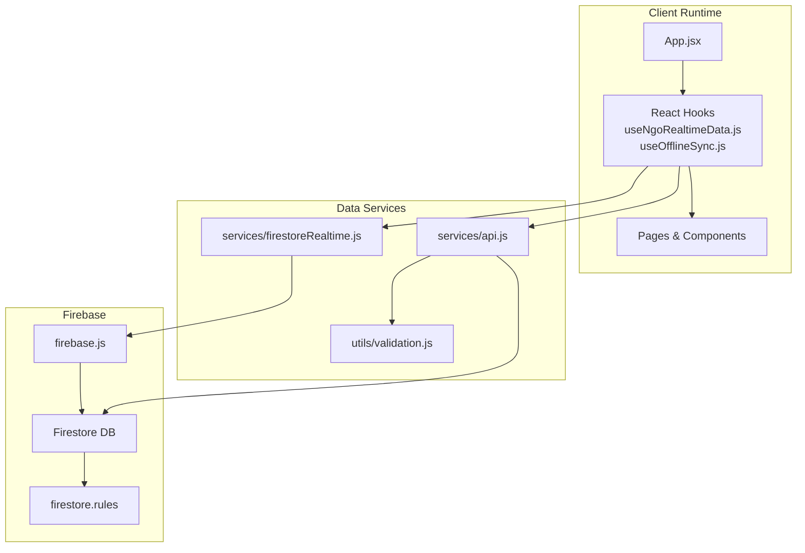
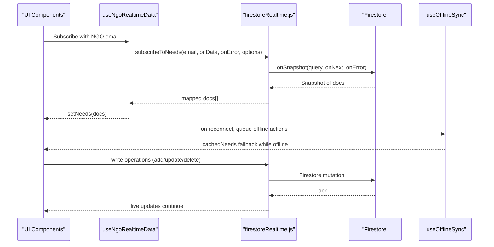
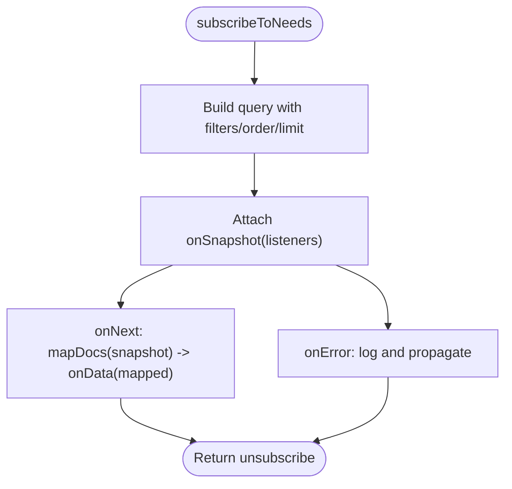
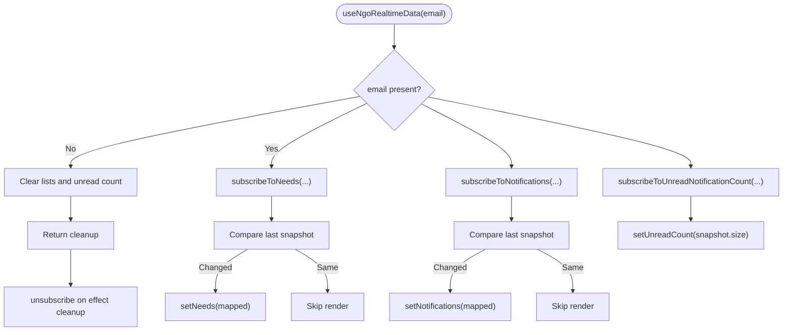
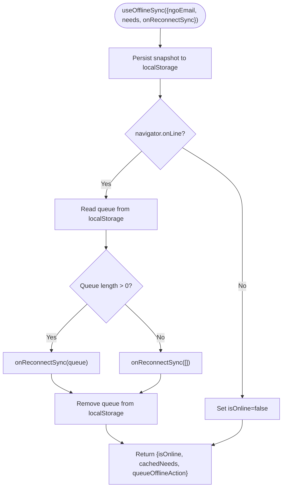
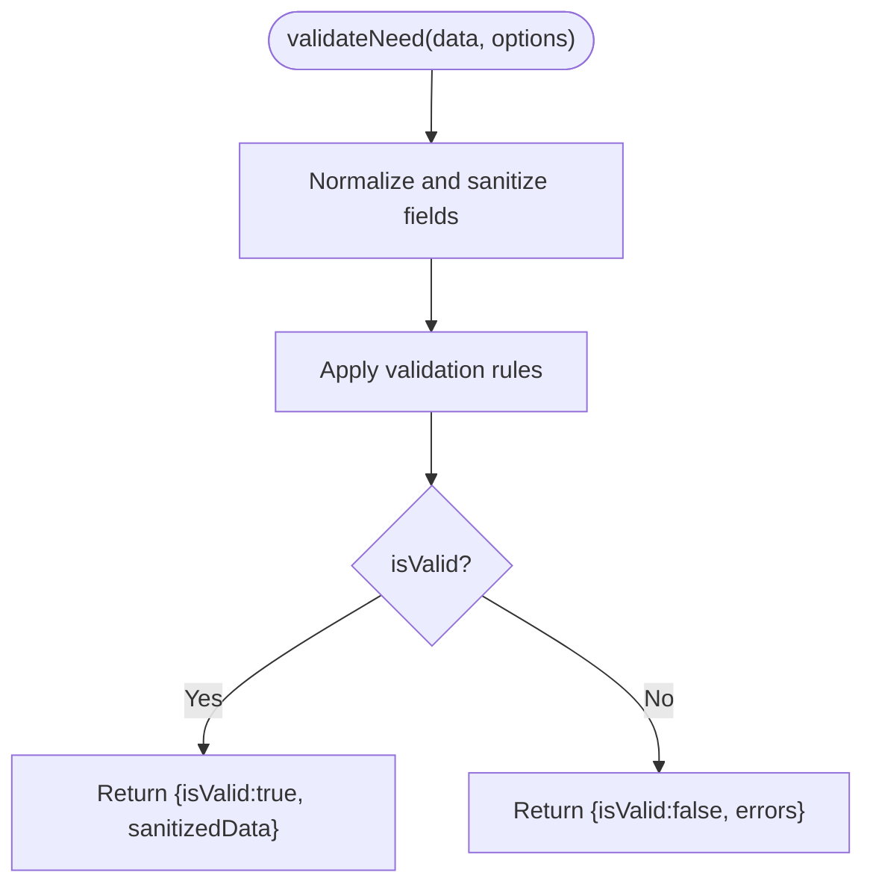
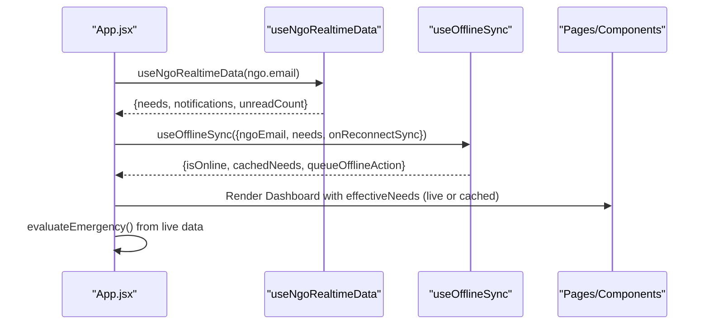
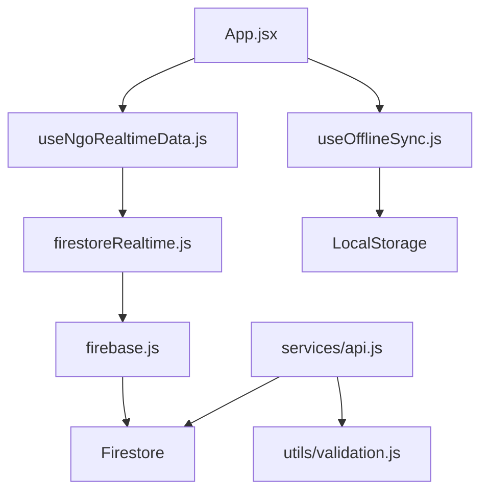

# Real-time Data Integration

<cite>
**Referenced Files in This Document**
- [src/services/firestoreRealtime.js](file://src/services/firestoreRealtime.js)
- [src/hooks/useNgoRealtimeData.js](file://src/hooks/useNgoRealtimeData.js)
- [src/hooks/useOfflineSync.js](file://src/hooks/useOfflineSync.js)
- [src/firebase.js](file://src/firebase.js)
- [src/services/api.js](file://src/services/api.js)
- [src/App.jsx](file://src/App.jsx)
- [src/utils/validation.js](file://src/utils/validation.js)
- [firestore.rules](file://firestore.rules)
- [README.md](file://README.md)
</cite>

## Table of Contents
1. [Introduction](#introduction)
2. [Project Structure](#project-structure)
3. [Core Components](#core-components)
4. [Architecture Overview](#architecture-overview)
5. [Detailed Component Analysis](#detailed-component-analysis)
6. [Dependency Analysis](#dependency-analysis)
7. [Performance Considerations](#performance-considerations)
8. [Troubleshooting Guide](#troubleshooting-guide)
9. [Conclusion](#conclusion)
10. [Appendices](#appendices)

## Introduction
This document explains the real-time data integration architecture for the application, focusing on Firebase Firestore integration patterns, real-time synchronization, offline-first behavior, and reactive UI updates. It covers subscription management, data streaming, validation and sanitization, caching strategies, and graceful degradation during connectivity issues. It also outlines client-side patterns for consuming real-time data and managing local state.

## Project Structure
The real-time integration spans several layers:
- Firebase initialization and Firestore service wiring
- Real-time subscriptions and queries for needs, resources, and notifications
- React hooks for subscribing and caching data
- Local offline cache and reconnection sync
- Validation and sanitization for data writes
- UI orchestration that reacts to live data and offline state



**Diagram sources**
- [src/App.jsx:1-285](file://src/App.jsx#L1-L285)
- [src/hooks/useNgoRealtimeData.js:1-83](file://src/hooks/useNgoRealtimeData.js#L1-L83)
- [src/hooks/useOfflineSync.js:1-72](file://src/hooks/useOfflineSync.js#L1-L72)
- [src/services/api.js:1-599](file://src/services/api.js#L1-L599)
- [src/services/firestoreRealtime.js:1-212](file://src/services/firestoreRealtime.js#L1-L212)
- [src/utils/validation.js:1-123](file://src/utils/validation.js#L1-L123)
- [src/firebase.js:1-35](file://src/firebase.js#L1-L35)
- [firestore.rules:1-18](file://firestore.rules#L1-L18)

**Section sources**
- [src/App.jsx:1-285](file://src/App.jsx#L1-L285)
- [src/services/firestoreRealtime.js:1-212](file://src/services/firestoreRealtime.js#L1-L212)
- [src/hooks/useNgoRealtimeData.js:1-83](file://src/hooks/useNgoRealtimeData.js#L1-L83)
- [src/hooks/useOfflineSync.js:1-72](file://src/hooks/useOfflineSync.js#L1-L72)
- [src/firebase.js:1-35](file://src/firebase.js#L1-L35)
- [firestore.rules:1-18](file://firestore.rules#L1-L18)

## Core Components
- Real-time subscriptions: Firestore onSnapshot listeners for needs, resources, and notifications
- Offline-first cache: LocalStorage snapshots and action queues for offline operation
- Validation pipeline: Sanitization and validation for incoming data before Firestore writes
- UI orchestration: React hooks and App-level logic to merge live and cached data

Key responsibilities:
- Real-time subscriptions: subscribeToNeeds, subscribeToResources, subscribeToNotifications, subscribeToUnreadNotificationCount
- Offline cache: useOfflineSync manages online/offline state, snapshot caching, and queued actions
- Validation: validateNeed and validateVolunteer enforce safe, normalized payloads
- UI integration: useNgoRealtimeData exposes live lists and unread counts; App merges live and cached data

**Section sources**
- [src/services/firestoreRealtime.js:61-130](file://src/services/firestoreRealtime.js#L61-L130)
- [src/hooks/useNgoRealtimeData.js:26-82](file://src/hooks/useNgoRealtimeData.js#L26-L82)
- [src/hooks/useOfflineSync.js:13-71](file://src/hooks/useOfflineSync.js#L13-L71)
- [src/utils/validation.js:30-80](file://src/utils/validation.js#L30-L80)

## Architecture Overview
The system uses Firestore’s real-time capabilities to stream updates to the UI, while maintaining a resilient offline experience. Authentication ties requests to a specific NGO account, and Firestore security rules enforce per-account isolation.



**Diagram sources**
- [src/hooks/useNgoRealtimeData.js:33-72](file://src/hooks/useNgoRealtimeData.js#L33-L72)
- [src/services/firestoreRealtime.js:61-103](file://src/services/firestoreRealtime.js#L61-L103)
- [src/hooks/useOfflineSync.js:26-50](file://src/hooks/useOfflineSync.js#L26-L50)

## Detailed Component Analysis

### Real-time Subscriptions and Queries
- Subscription functions wrap Firestore onSnapshot with query builders for needs, resources, and notifications.
- Query builders support pagination, ordering, filtering, and cursor-based pagination for notifications.
- Listeners return unsubscribe handlers to clean up subscriptions.



**Diagram sources**
- [src/services/firestoreRealtime.js:29-73](file://src/services/firestoreRealtime.js#L29-L73)

**Section sources**
- [src/services/firestoreRealtime.js:29-103](file://src/services/firestoreRealtime.js#L29-L103)

### React Hook for Real-time Data
- useNgoRealtimeData sets up subscriptions for needs, notifications, and unread counts.
- Uses a fingerprint comparison to avoid unnecessary renders when data has not changed meaningfully.
- Returns memoized state for downstream UI.



**Diagram sources**
- [src/hooks/useNgoRealtimeData.js:26-82](file://src/hooks/useNgoRealtimeData.js#L26-L82)

**Section sources**
- [src/hooks/useNgoRealtimeData.js:26-82](file://src/hooks/useNgoRealtimeData.js#L26-L82)

### Offline-first Cache and Reconnection
- useOfflineSync persists a recent snapshot to LocalStorage keyed by NGO email.
- Tracks online/offline state and drains an action queue on reconnect.
- Provides a cachedNeeds getter for rendering while offline.



**Diagram sources**
- [src/hooks/useOfflineSync.js:13-71](file://src/hooks/useOfflineSync.js#L13-L71)

**Section sources**
- [src/hooks/useOfflineSync.js:13-71](file://src/hooks/useOfflineSync.js#L13-L71)

### Data Validation and Sanitization
- validateNeed enforces field constraints, normalizes inputs, and strips potentially unsafe content.
- Used before writing to Firestore to prevent malformed or unsafe data.



**Diagram sources**
- [src/utils/validation.js:30-80](file://src/utils/validation.js#L30-L80)

**Section sources**
- [src/utils/validation.js:30-80](file://src/utils/validation.js#L30-L80)

### UI Orchestration and Reactive Updates
- App.jsx composes live data from useNgoRealtimeData with offline cache from useOfflineSync.
- Merges liveNeeds with cachedNeeds to ensure continuity during offline periods.
- Evaluates emergency state reactively from live data and notifications.



**Diagram sources**
- [src/App.jsx:62-135](file://src/App.jsx#L62-L135)
- [src/hooks/useNgoRealtimeData.js:26-82](file://src/hooks/useNgoRealtimeData.js#L26-L82)
- [src/hooks/useOfflineSync.js:13-71](file://src/hooks/useOfflineSync.js#L13-L71)

**Section sources**
- [src/App.jsx:62-135](file://src/App.jsx#L62-L135)

### Firestore Integration and Security
- Firebase initialized with Firestore and Auth; Firestore DB exported for use.
- Firestore rules restrict access to authenticated users whose email matches the account path.

```mermaid
graph LR
Auth["Firebase Auth"] --> Rules["Firestore Rules"]
Rules --> Allow["Allow read/write for authenticated NGO owner"]
DB["Firestore DB"] <- --> Rules
```

**Diagram sources**
- [src/firebase.js:10-27](file://src/firebase.js#L10-L27)
- [firestore.rules:9-16](file://firestore.rules#L9-L16)

**Section sources**
- [src/firebase.js:10-27](file://src/firebase.js#L10-L27)
- [firestore.rules:1-18](file://firestore.rules#L1-L18)

## Dependency Analysis
- Real-time subscriptions depend on Firestore onSnapshot and query builders.
- React hooks encapsulate subscription lifecycle and state updates.
- Offline cache depends on LocalStorage and browser online/offline events.
- Validation is a pure function invoked before Firestore writes.
- UI depends on hooks for live data and on App-level logic for offline merging.



**Diagram sources**
- [src/services/firestoreRealtime.js:1-16](file://src/services/firestoreRealtime.js#L1-L16)
- [src/firebase.js:10-27](file://src/firebase.js#L10-L27)
- [src/hooks/useNgoRealtimeData.js:1-6](file://src/hooks/useNgoRealtimeData.js#L1-L6)
- [src/hooks/useOfflineSync.js:1-1](file://src/hooks/useOfflineSync.js#L1-L1)
- [src/services/api.js:1-5](file://src/services/api.js#L1-L5)
- [src/utils/validation.js:1-1](file://src/utils/validation.js#L1-L1)
- [src/App.jsx:62-135](file://src/App.jsx#L62-L135)

**Section sources**
- [src/services/firestoreRealtime.js:1-16](file://src/services/firestoreRealtime.js#L1-L16)
- [src/hooks/useNgoRealtimeData.js:1-6](file://src/hooks/useNgoRealtimeData.js#L1-L6)
- [src/hooks/useOfflineSync.js:1-1](file://src/hooks/useOfflineSync.js#L1-L1)
- [src/services/api.js:1-5](file://src/services/api.js#L1-L5)
- [src/utils/validation.js:1-1](file://src/utils/validation.js#L1-L1)
- [src/App.jsx:62-135](file://src/App.jsx#L62-L135)

## Performance Considerations
- Pagination and limits: Query builders apply pageSize and limit to constrain result sizes for needs and resources.
- Cursor-based pagination: Notifications support startAfter for efficient continuation loading.
- Ordering: Queries order by timestamps or updatedAt to ensure consistent pagination.
- Render deduplication: useNgoRealtimeData compares fingerprints to avoid redundant renders.
- Caching: Local snapshot reduces UI thrash during reconnect; queue avoids lost mutations.
- Validation cost: Validation runs before writes to minimize error retries and improve throughput.

[No sources needed since this section provides general guidance]

## Troubleshooting Guide
Common issues and remedies:
- Authentication mismatch: Ensure the logged-in user’s email matches the NGO path; Firestore rules deny access otherwise.
- No data despite valid credentials: Verify onSnapshot listeners are attached and not immediately disposed; check for early returns when email is missing.
- Offline mode not restoring data: Confirm LocalStorage keys include the NGO email and that cachedNeeds is used when live list is empty.
- Excessive re-renders: Use the fingerprint comparison in useNgoRealtimeData to stabilize lists.
- Write failures: validateNeed must pass before Firestore writes; inspect returned errors for invalid fields.

**Section sources**
- [firestore.rules:9-16](file://firestore.rules#L9-L16)
- [src/hooks/useNgoRealtimeData.js:33-72](file://src/hooks/useNgoRealtimeData.js#L33-L72)
- [src/hooks/useOfflineSync.js:13-71](file://src/hooks/useOfflineSync.js#L13-L71)
- [src/utils/validation.js:30-80](file://src/utils/validation.js#L30-L80)

## Conclusion
The application integrates Firebase Firestore for real-time updates, React hooks for subscription lifecycle and state, and an offline-first cache for resilience. Validation ensures data integrity, while UI composition merges live and cached data to maintain responsiveness. Together, these patterns deliver a robust, reactive, and offline-capable real-time data experience.

[No sources needed since this section summarizes without analyzing specific files]

## Appendices

### API Patterns for Real-time Notifications and Live Updates
- Notifications unread count: subscribeToUnreadNotificationCount streams size changes.
- Paginated notifications: getNotificationsPage supports page size and cursor-based retrieval.
- Live updates: onSnapshot listeners for needs and notifications feed UI state.

**Section sources**
- [src/services/firestoreRealtime.js:105-130](file://src/services/firestoreRealtime.js#L105-L130)
- [src/services/firestoreRealtime.js:118-130](file://src/services/firestoreRealtime.js#L118-L130)

### Conflict Resolution Strategies
- Server timestamps: serverTimestamp applied on writes to align ordering across clients.
- Optimistic updates: UI can optimistically update state while pending server acks; Firestore onSnapshot reconciles eventual consistency.
- Offline queue: useOfflineSync queues actions and replays them on reconnect to reconcile divergent states.

**Section sources**
- [src/services/firestoreRealtime.js:14, 162-163:14-163](file://src/services/firestoreRealtime.js#L14-L163)
- [src/hooks/useOfflineSync.js:30-40](file://src/hooks/useOfflineSync.js#L30-L40)

### Reactive Data Binding and State Synchronization
- useNgoRealtimeData exposes needs, notifications, and unreadCount as React state.
- App.jsx merges live and cached data to keep UI responsive during network transitions.
- useEffect-driven evaluation keeps emergency state and AI insights synchronized with live data.

**Section sources**
- [src/hooks/useNgoRealtimeData.js:26-82](file://src/hooks/useNgoRealtimeData.js#L26-L82)
- [src/App.jsx:62-135](file://src/App.jsx#L62-L135)

### Client-side Implementation Patterns
- Subscription management: attach onSnapshot in useEffect, return unsubscribe in cleanup.
- Offline-first: persist snapshot, track online/offline, queue actions, and drain on reconnect.
- Validation: run before writes to prevent invalid data and XSS-like content.

**Section sources**
- [src/services/firestoreRealtime.js:61-103](file://src/services/firestoreRealtime.js#L61-L103)
- [src/hooks/useOfflineSync.js:13-71](file://src/hooks/useOfflineSync.js#L13-L71)
- [src/utils/validation.js:30-80](file://src/utils/validation.js#L30-L80)