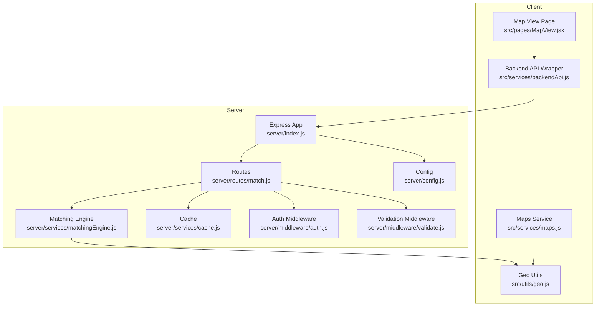
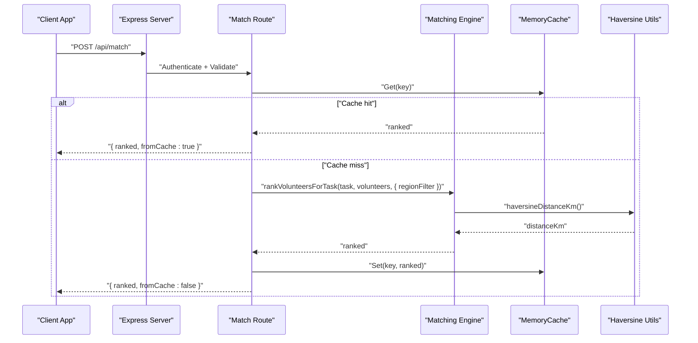
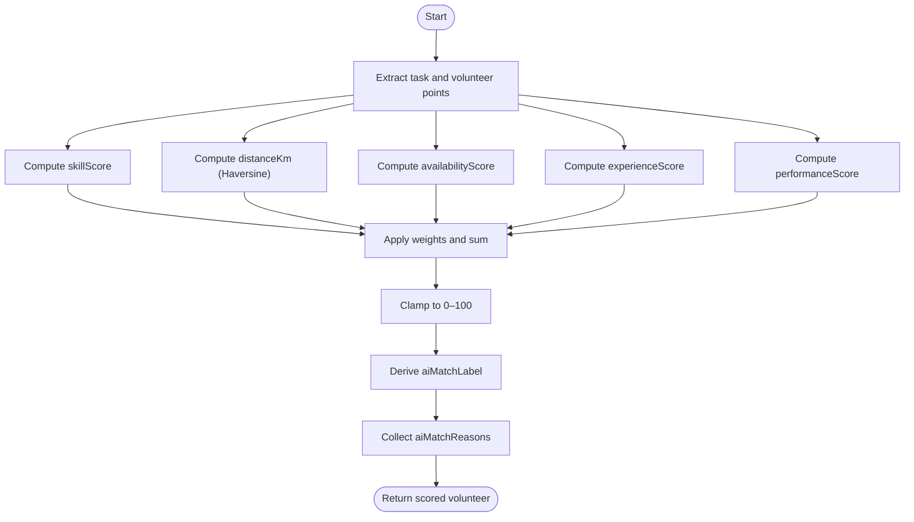
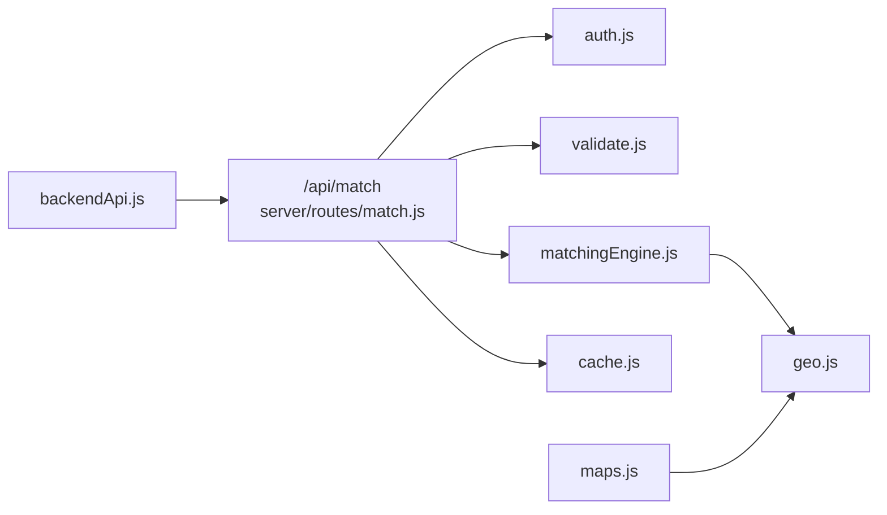

# Volunteer Matching Endpoints

<cite>
**Referenced Files in This Document**
- [server/index.js](file://server/index.js)
- [server/routes/match.js](file://server/routes/match.js)
- [server/services/matchingEngine.js](file://server/services/matchingEngine.js)
- [server/services/cache.js](file://server/services/cache.js)
- [server/middleware/auth.js](file://server/middleware/auth.js)
- [server/middleware/validate.js](file://server/middleware/validate.js)
- [server/config.js](file://server/config.js)
- [src/engine/matchingEngine.js](file://src/engine/matchingEngine.js)
- [src/utils/geo.js](file://src/utils/geo.js)
- [src/services/maps.js](file://src/services/maps.js)
- [src/services/backendApi.js](file://src/services/backendApi.js)
- [src/pages/MapView.jsx](file://src/pages/MapView.jsx)
</cite>

## Table of Contents
1. [Introduction](#introduction)
2. [Project Structure](#project-structure)
3. [Core Components](#core-components)
4. [Architecture Overview](#architecture-overview)
5. [Detailed Component Analysis](#detailed-component-analysis)
6. [Dependency Analysis](#dependency-analysis)
7. [Performance Considerations](#performance-considerations)
8. [Troubleshooting Guide](#troubleshooting-guide)
9. [Conclusion](#conclusion)
10. [Appendices](#appendices)

## Introduction
This document provides comprehensive API documentation for the volunteer matching endpoints. It covers automatic volunteer assignment algorithms, proximity-based matching, and skill-based filtering. It details endpoint specifications for finding suitable volunteers, calculating distances, and scoring systems. It also documents request parameters for location coordinates, required skills, availability windows, and emergency priority levels, along with response schemas for matched volunteer lists, distance calculations, and assignment recommendations. Real-time matching scenarios, performance optimization techniques, and integration with geographic data services are included.

## Project Structure
The volunteer matching system spans both server and client layers:
- Server exposes REST endpoints under /api/match for ranking and recommendation.
- Matching logic runs on the server to keep scoring weights and algorithms consistent and to enable future enhancements.
- Client-side components integrate with backend APIs to present ranked volunteers and explanations.

**Diagram sources**
- [server/index.js:16-118](file://server/index.js#L16-L118)
- [server/routes/match.js:1-120](file://server/routes/match.js#L1-L120)
- [server/services/matchingEngine.js:1-212](file://server/services/matchingEngine.js#L1-L212)
- [server/services/cache.js:10-66](file://server/services/cache.js#L10-L66)
- [server/middleware/auth.js:14-49](file://server/middleware/auth.js#L14-L49)
- [server/middleware/validate.js:48-80](file://server/middleware/validate.js#L48-L80)
- [server/config.js:8-35](file://server/config.js#L8-L35)
- [src/services/backendApi.js:117-139](file://src/services/backendApi.js#L117-L139)
- [src/pages/MapView.jsx:457-486](file://src/pages/MapView.jsx#L457-L486)
- [src/utils/geo.js:1-37](file://src/utils/geo.js#L1-L37)
- [src/services/maps.js:1-80](file://src/services/maps.js#L1-L80)

**Section sources**
- [server/index.js:16-118](file://server/index.js#L16-L118)
- [server/routes/match.js:1-120](file://server/routes/match.js#L1-L120)

## Core Components
- Matching Engine: Computes match scores using skill alignment, proximity, availability, experience, and performance metrics. Supports region-based pre-filtering and Haversine distance calculation.
- Cache: In-memory cache with TTL and LRU eviction to reduce recomputation for identical task/volunteer sets.
- Validation and Sanitization: Ensures request bodies conform to expected shapes and cleans inputs.
- Authentication: Validates JWT tokens for protected endpoints.
- Distance Utilities: Provides Haversine distance calculation and offline fallbacks for travel time estimation.

**Section sources**
- [server/services/matchingEngine.js:14-212](file://server/services/matchingEngine.js#L14-L212)
- [server/services/cache.js:10-66](file://server/services/cache.js#L10-L66)
- [server/middleware/validate.js:48-80](file://server/middleware/validate.js#L48-L80)
- [server/middleware/auth.js:14-49](file://server/middleware/auth.js#L14-L49)
- [src/utils/geo.js:15-37](file://src/utils/geo.js#L15-L37)

## Architecture Overview
The matching pipeline integrates client requests with server-side scoring and caching.

**Diagram sources**
- [server/routes/match.js:33-77](file://server/routes/match.js#L33-L77)
- [server/services/matchingEngine.js:166-182](file://server/services/matchingEngine.js#L166-L182)
- [server/services/cache.js:20-44](file://server/services/cache.js#L20-L44)
- [src/utils/geo.js:15-29](file://src/utils/geo.js#L15-L29)

## Detailed Component Analysis

### Endpoint: POST /api/match
Purpose: Rank volunteers for a single task based on skills, proximity, availability, experience, and performance.

- Authentication: Required (Bearer token).
- Request Body:
  - task: object (required)
    - id: string
    - category: string
    - requiredSkills: string[]
    - region: string
    - location: { lat: number, lng: number } or { location: { lat: number, lng: number } }
    - volunteers: number (optional, used for recommendation sizing)
    - assigned: number (optional, used for recommendation sizing)
  - volunteers: array of volunteer objects (required)
    - id: string
    - name: string
    - skill: string
    - skills: string[]
    - status: string ("busy", "soon", or available)
    - available: boolean
    - tasks: number (completed tasks)
    - rating: number (0–5)
    - location: { lat: number, lng: number } or { location: { lat: number, lng: number } }
    - region: string (optional)
  - useCache: boolean (optional, default true)
- Response:
  - ranked: array of ranked volunteers with scoring metadata
  - fromCache: boolean
  - cacheStats: { size, maxSize, ttlMs, hits, misses, hitRate }
- Behavior:
  - Generates a stable cache key from task id/category and sorted volunteer ids.
  - Uses regionFilter to pre-filter volunteers when provided.
  - Returns cached results if available; otherwise computes and caches.

Response Schema (ranked items):
- id, name, matchScore (0–100), assignmentScore (0–1), skillScore (0–1)
- distanceKm: number or null
- aiMatchLabel: string ("Perfect Match", "Strong Match", "Moderate Match", "Low Match")
- aiMatchReasons: array of strings indicating factors affecting match quality
- explanation: array of human-readable reasons for the score

**Section sources**
- [server/routes/match.js:23-77](file://server/routes/match.js#L23-L77)
- [server/services/matchingEngine.js:166-182](file://server/services/matchingEngine.js#L166-L182)
- [server/services/matchingEngine.js:140-157](file://server/services/matchingEngine.js#L140-L157)
- [server/services/cache.js:52-64](file://server/services/cache.js#L52-L64)

### Endpoint: POST /api/match/recommend
Purpose: Generate recommendations for multiple tasks, optionally auto-assigning the top candidate.

- Authentication: Required (Bearer token).
- Request Body:
  - tasks: array of task objects (required)
  - volunteers: array of volunteer objects (required)
  - autoAssign: boolean (optional, default false)
- Response:
  - recommendations: array of recommendation objects
    - taskId: string
    - autoAssigned: boolean
    - assignedVolunteerId: string|null
    - rankedVolunteers: top 5 ranked volunteers with id, name, matchScore, distanceKm, explanation
    - recommendedAssignees: ids of available volunteers up to slots based on task.volunteers - task.assigned
    - recommendationSummary: human-readable summary

Recommendation Logic:
- Calculates ranked volunteers per task.
- Filters available volunteers for recommendedAssignees.
- Determines slots as min(3, max(1, task.volunteers - task.assigned)).

**Section sources**
- [server/routes/match.js:79-106](file://server/routes/match.js#L79-L106)
- [server/services/matchingEngine.js:187-211](file://server/services/matchingEngine.js#L187-L211)

### Endpoint: GET /api/match/cache-stats
Purpose: Monitor cache performance.

- Authentication: Required (Bearer token).
- Response:
  - { size, maxSize, ttlMs, hits, misses, hitRate }

**Section sources**
- [server/routes/match.js:108-117](file://server/routes/match.js#L108-L117)
- [server/services/cache.js:52-64](file://server/services/cache.js#L52-L64)

### Scoring System and Algorithms
- Weights:
  - skill: 0.4
  - distance: 0.25
  - availability: 0.15
  - experience: 0.1
  - performance: 0.1
- Distance Calculation:
  - Haversine formula implemented internally for robustness.
  - distanceScore derived from distanceKm thresholds.
- Availability Score:
  - Busy: 30
  - Soon: 70
  - Available: 100
- Experience Score:
  - Completed tasks > 50: 100
  - ≥ 20: 80
  - ≥ 5: 60
  - < 5: 40
- Performance Score:
  - Normalized rating (0–5) scaled to 0–100.
- Skill Score:
  - Token-normalized required vs volunteer skills.
  - Fuzzy matching across tokens; normalized by required skills count.
- Region Filter:
  - Pre-filters volunteers by region to reduce computation on large datasets.

**Diagram sources**
- [server/services/matchingEngine.js:110-157](file://server/services/matchingEngine.js#L110-L157)
- [src/utils/geo.js:15-29](file://src/utils/geo.js#L15-L29)

**Section sources**
- [server/services/matchingEngine.js:34-157](file://server/services/matchingEngine.js#L34-L157)
- [src/engine/matchingEngine.js:3-147](file://src/engine/matchingEngine.js#L3-L147)

### Proximity-Based Matching and Distance Calculation
- Haversine Implementation:
  - Earth radius constant and radian conversion helpers.
  - Distance computed in kilometers; invalid coordinates yield Infinity.
- Offline Travel Time Estimation:
  - When Google Maps API key is not configured, estimates duration based on straight-line distance and average speed.
  - Caches results to avoid repeated computations.

Integration Notes:
- The server’s matching engine uses an internal Haversine implementation to compute distances.
- Client-side travel time estimation is handled separately via src/services/maps.js for UI features.

**Section sources**
- [src/utils/geo.js:15-37](file://src/utils/geo.js#L15-L37)
- [server/services/matchingEngine.js:20-30](file://server/services/matchingEngine.js#L20-L30)
- [src/services/maps.js:37-80](file://src/services/maps.js#L37-L80)

### Skill-Based Filtering
- Token normalization removes punctuation and extra whitespace, converts to lowercase, and splits into tokens.
- Required skills are derived either from task.requiredSkills or inferred from task.category.
- Skill matching considers exact equality, substring inclusion, or mutual inclusion between tokens.

**Section sources**
- [server/services/matchingEngine.js:47-99](file://server/services/matchingEngine.js#L47-L99)
- [src/engine/matchingEngine.js:18-79](file://src/engine/matchingEngine.js#L18-L79)

### Automatic Volunteer Assignment
- Auto-assignment:
  - Enabled when autoAssign=true in POST /api/match/recommend.
  - Assigns the top-ranked available volunteer if one exists.
- Recommendation Slots:
  - Up to 3 slots or based on task.volunteers - task.assigned, whichever is smaller and at least 1.

**Section sources**
- [server/routes/match.js:88-106](file://server/routes/match.js#L88-L106)
- [server/services/matchingEngine.js:187-211](file://server/services/matchingEngine.js#L187-L211)

### Real-Time Matching Scenarios
- Live Ranking:
  - Client calls POST /api/match with current task and volunteer pool.
  - Server returns ranked results with explanations and distance metrics.
- Recommendations:
  - Client sends multiple tasks and volunteers to POST /api/match/recommend for batch recommendations.
  - Server returns top candidates and recommended assignees.
- Explanation:
  - Client can request AI-driven explanations via POST /api/ai/explain-match for a specific volunteer-task pair.

**Section sources**
- [src/services/backendApi.js:134-139](file://src/services/backendApi.js#L134-L139)
- [src/pages/MapView.jsx:457-486](file://src/pages/MapView.jsx#L457-L486)
- [server/routes/match.js:79-106](file://server/routes/match.js#L79-L106)

## Dependency Analysis
- Route depends on:
  - Authentication middleware for bearer token verification.
  - Validation middleware for request body shape checks.
  - Matching engine for scoring and ranking.
  - Cache for result caching.
- Matching engine depends on:
  - Haversine utilities for distance calculation.
  - Internal normalization and scoring helpers.
- Client integrates:
  - Backend API wrapper to call /api/match and /api/match/recommend.
  - Maps service for travel time estimation in UI.

**Diagram sources**
- [server/routes/match.js:1-120](file://server/routes/match.js#L1-L120)
- [server/middleware/auth.js:14-49](file://server/middleware/auth.js#L14-L49)
- [server/middleware/validate.js:48-80](file://server/middleware/validate.js#L48-L80)
- [server/services/matchingEngine.js:1-212](file://server/services/matchingEngine.js#L1-L212)
- [server/services/cache.js:10-66](file://server/services/cache.js#L10-L66)
- [src/utils/geo.js:1-37](file://src/utils/geo.js#L1-L37)
- [src/services/backendApi.js:117-139](file://src/services/backendApi.js#L117-L139)
- [src/services/maps.js:1-80](file://src/services/maps.js#L1-L80)

**Section sources**
- [server/routes/match.js:1-120](file://server/routes/match.js#L1-L120)
- [server/services/matchingEngine.js:1-212](file://server/services/matchingEngine.js#L1-L212)
- [src/utils/geo.js:1-37](file://src/utils/geo.js#L1-L37)
- [src/services/backendApi.js:117-139](file://src/services/backendApi.js#L117-L139)
- [src/services/maps.js:1-80](file://src/services/maps.js#L1-L80)

## Performance Considerations
- Caching:
  - Stable cache keys derived from task id, category, and sorted volunteer ids.
  - TTL and max size configurable via environment variables.
  - Cache statistics endpoint for monitoring.
- Pre-filtering:
  - Region-based filtering reduces dataset size before scoring.
- Weighted Scoring:
  - Computationally lightweight; avoids heavy ML models in client.
- Rate Limiting:
  - Global and stricter limits for AI endpoints to protect resources.
- Offline Fallback:
  - Haversine-based travel time estimation when external APIs are unavailable.

**Section sources**
- [server/routes/match.js:17-21](file://server/routes/match.js#L17-L21)
- [server/services/cache.js:10-66](file://server/services/cache.js#L10-L66)
- [server/config.js:29-32](file://server/config.js#L29-L32)
- [server/services/matchingEngine.js:169-177](file://server/services/matchingEngine.js#L169-L177)
- [server/index.js:50-72](file://server/index.js#L50-L72)
- [src/services/maps.js:41-79](file://src/services/maps.js#L41-L79)

## Troubleshooting Guide
- Authentication Failures:
  - Ensure Authorization: Bearer <token> header is present and valid.
- Validation Errors:
  - Verify task and volunteers are objects and volunteers is an array.
- Cache Issues:
  - Use GET /api/match/cache-stats to inspect cache hit rate and size.
- Distance Calculation Problems:
  - Confirm lat/lng values are finite numbers within valid ranges.
- Recommendations Not Auto-Assigned:
  - Check autoAssign flag and verify top-ranked volunteer availability.

**Section sources**
- [server/middleware/auth.js:14-49](file://server/middleware/auth.js#L14-L49)
- [server/middleware/validate.js:48-80](file://server/middleware/validate.js#L48-L80)
- [server/routes/match.js:108-117](file://server/routes/match.js#L108-L117)
- [src/utils/geo.js:7-13](file://src/utils/geo.js#L7-L13)
- [server/routes/match.js:88-106](file://server/routes/match.js#L88-L106)

## Conclusion
The volunteer matching endpoints provide a robust, scalable solution for ranking and recommending volunteers based on skills, proximity, availability, experience, and performance. The server-side implementation ensures consistent scoring and caching, while the client integrates seamlessly to present ranked results and explanations. Geographic utilities and offline fallbacks enhance reliability, and rate limiting protects resources during high load.

## Appendices

### API Reference Summary
- POST /api/match
  - Body: { task, volunteers[], useCache? }
  - Response: { ranked[], fromCache, cacheStats }
- POST /api/match/recommend
  - Body: { tasks[], volunteers[], autoAssign? }
  - Response: { recommendations[] }
- GET /api/match/cache-stats
  - Response: { size, maxSize, ttlMs, hits, misses, hitRate }

### Example Matching Criteria
- Skills: requiredSkills array or inferred from category tokens.
- Proximity: Haversine distance in kilometers; distanceScore thresholds apply.
- Availability: status "busy" yields lower score; "soon" moderate; available highest.
- Experience: completed tasks count mapped to discrete tiers.
- Performance: rating normalized to percentage.

### Integration Notes
- Geographic Data Services:
  - Server uses internal Haversine implementation for distance.
  - Client-side maps service offers offline fallback for travel time estimation.
- Environment Variables:
  - MATCH_CACHE_TTL_MS, MATCH_CACHE_MAX_SIZE for cache tuning.
  - JWT_SECRET, CORS_ORIGIN for security and cross-origin policies.

**Section sources**
- [server/routes/match.js:23-117](file://server/routes/match.js#L23-L117)
- [server/services/matchingEngine.js:166-211](file://server/services/matchingEngine.js#L166-L211)
- [src/services/maps.js:37-80](file://src/services/maps.js#L37-L80)
- [server/config.js:29-32](file://server/config.js#L29-L32)
- [server/middleware/auth.js:14-49](file://server/middleware/auth.js#L14-L49)