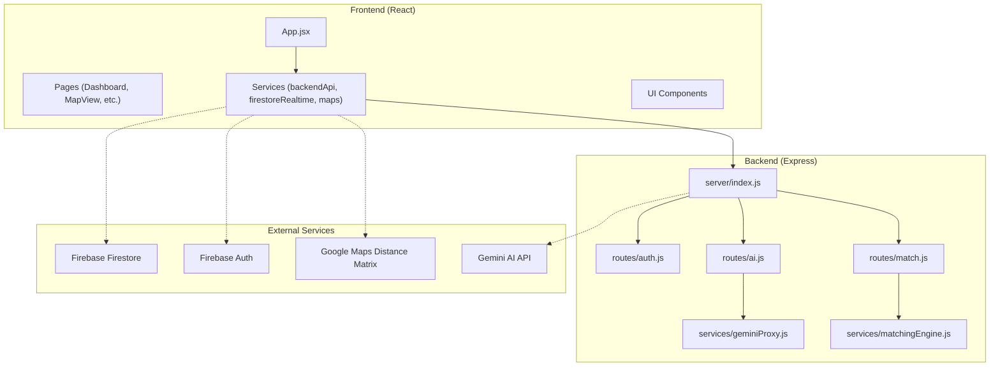
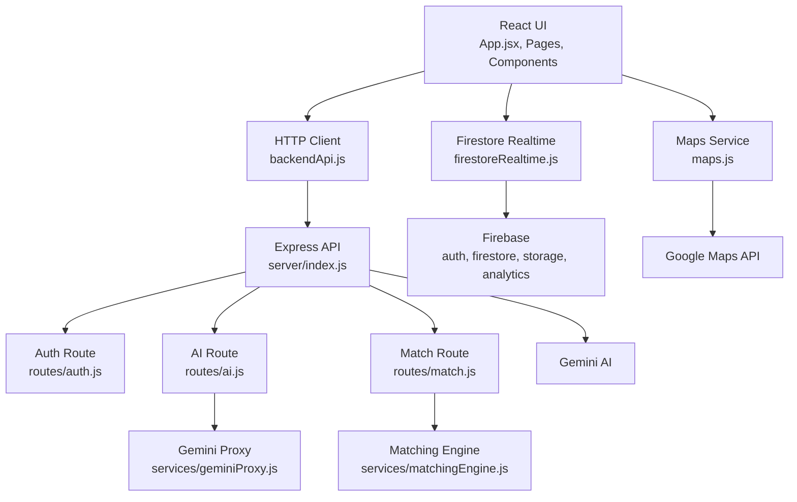
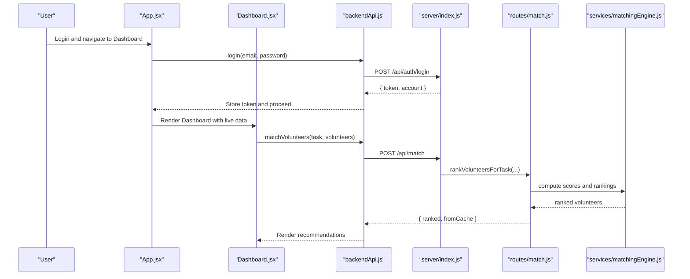
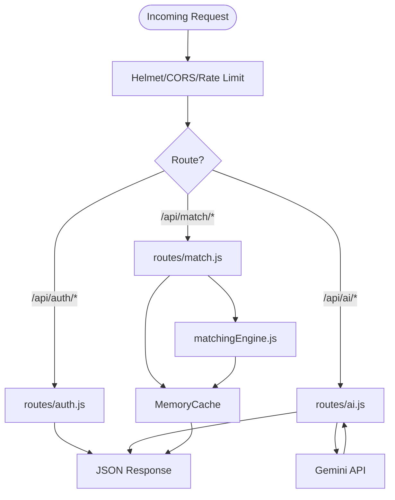
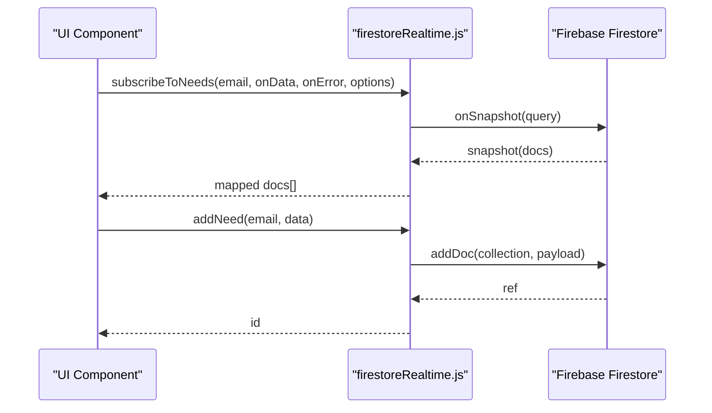
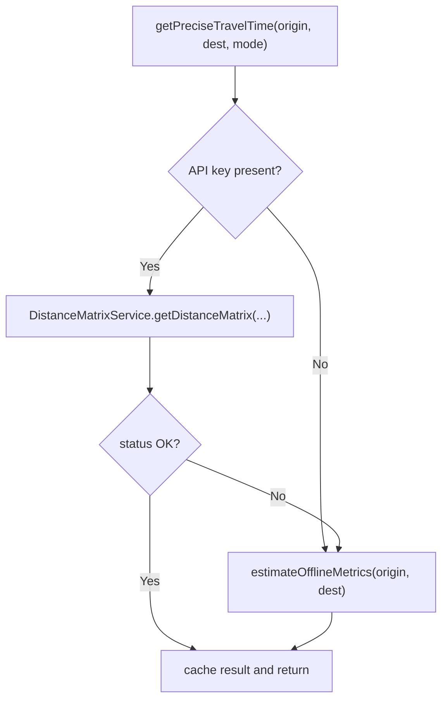
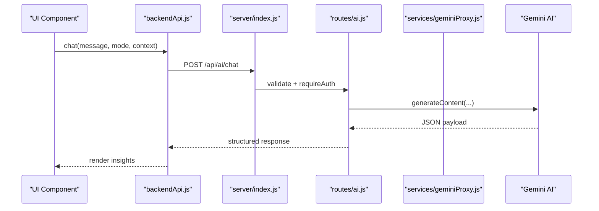
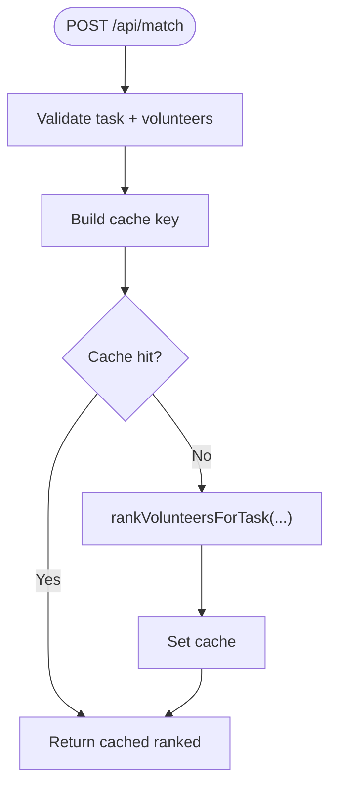
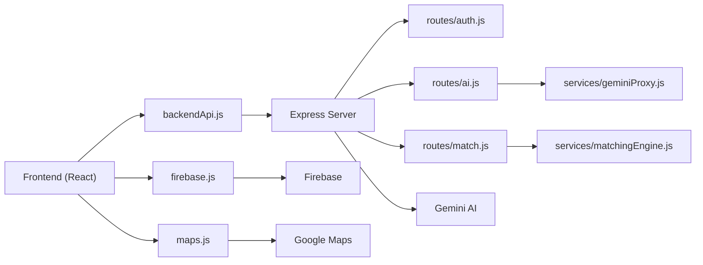
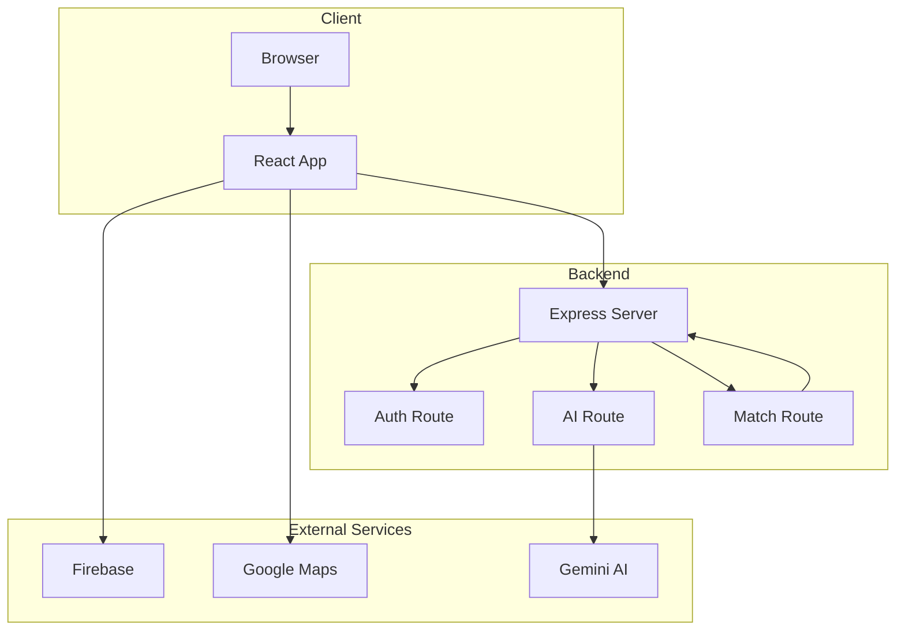

# Architecture Overview

<cite>
**Referenced Files in This Document**
- [README.md](file://README.md)
- [package.json](file://package.json)
- [server/package.json](file://server/package.json)
- [src/firebase.js](file://src/firebase.js)
- [server/index.js](file://server/index.js)
- [server/routes/auth.js](file://server/routes/auth.js)
- [server/routes/ai.js](file://server/routes/ai.js)
- [server/routes/match.js](file://server/routes/match.js)
- [server/services/geminiProxy.js](file://server/services/geminiProxy.js)
- [server/services/matchingEngine.js](file://server/services/matchingEngine.js)
- [src/services/backendApi.js](file://src/services/backendApi.js)
- [src/services/firestoreRealtime.js](file://src/services/firestoreRealtime.js)
- [src/services/maps.js](file://src/services/maps.js)
- [src/App.jsx](file://src/App.jsx)
- [src/pages/Dashboard.jsx](file://src/pages/Dashboard.jsx)
</cite>

## Table of Contents
1. [Introduction](#introduction)
2. [Project Structure](#project-structure)
3. [Core Components](#core-components)
4. [Architecture Overview](#architecture-overview)
5. [Detailed Component Analysis](#detailed-component-analysis)
6. [Dependency Analysis](#dependency-analysis)
7. [Performance Considerations](#performance-considerations)
8. [Troubleshooting Guide](#troubleshooting-guide)
9. [Conclusion](#conclusion)
10. [Appendices](#appendices)

## Introduction
This document presents the architectural design of the Echo5 platform, a full-stack system integrating a React frontend, an Express backend, Firebase for real-time data and identity, and Google Maps for geospatial operations. The backend proxies access to Gemini AI services while enforcing authentication, rate limiting, and validation. The frontend consumes a thin HTTP client to call backend endpoints and subscribes to Firebase for real-time updates. Cross-cutting concerns include authentication, real-time synchronization, caching, and performance optimization.

## Project Structure
The repository follows a split architecture:
- Frontend (React + Vite): resides under src/ and public/
- Backend (Express): resides under server/

Key characteristics:
- Frontend dependencies include Firebase client SDK, Google Maps JS API loader, Leaflet, Recharts, Tailwind, and React ecosystem packages.
- Backend dependencies include Express, Helmet, CORS, Morgan, rate limiting, and JWT utilities.
- The backend exposes REST endpoints for authentication, AI operations, and matching; the frontend communicates via a typed HTTP client.

**Diagram sources**
- [server/index.js:1-118](file://server/index.js#L1-L118)
- [server/routes/auth.js:1-83](file://server/routes/auth.js#L1-L83)
- [server/routes/ai.js:1-348](file://server/routes/ai.js#L1-L348)
- [server/routes/match.js:1-120](file://server/routes/match.js#L1-L120)
- [server/services/geminiProxy.js:1-104](file://server/services/geminiProxy.js#L1-L104)
- [server/services/matchingEngine.js:1-212](file://server/services/matchingEngine.js#L1-L212)
- [src/services/backendApi.js:1-164](file://src/services/backendApi.js#L1-L164)
- [src/services/firestoreRealtime.js:1-212](file://src/services/firestoreRealtime.js#L1-L212)
- [src/services/maps.js:1-80](file://src/services/maps.js#L1-L80)
- [src/firebase.js:1-35](file://src/firebase.js#L1-L35)

**Section sources**
- [README.md:1-17](file://README.md#L1-L17)
- [package.json:12-29](file://package.json#L12-L29)
- [server/package.json:9-16](file://server/package.json#L9-L16)

## Core Components
- Frontend HTTP client: Thin wrapper around fetch with JWT persistence and typed methods for backend endpoints.
- Firebase integration: Real-time listeners and CRUD operations for incidents, resources, and notifications; initialized auth/db/storage/analytics.
- Google Maps integration: Distance matrix service with offline fallback using Haversine distance.
- Backend API server: Express server with Helmet, CORS, rate limiting, logging, and modular routes.
- AI service proxy: Secure proxy to Gemini for document parsing and chat; validates inputs and sanitizes bodies.
- Matching engine: Server-side volunteer-task matching with caching and scoring heuristics.

**Section sources**
- [src/services/backendApi.js:1-164](file://src/services/backendApi.js#L1-L164)
- [src/services/firestoreRealtime.js:1-212](file://src/services/firestoreRealtime.js#L1-L212)
- [src/services/maps.js:1-80](file://src/services/maps.js#L1-L80)
- [server/index.js:1-118](file://server/index.js#L1-L118)
- [server/routes/ai.js:1-348](file://server/routes/ai.js#L1-L348)
- [server/services/geminiProxy.js:1-104](file://server/services/geminiProxy.js#L1-L104)
- [server/routes/match.js:1-120](file://server/routes/match.js#L1-L120)
- [server/services/matchingEngine.js:1-212](file://server/services/matchingEngine.js#L1-L212)

## Architecture Overview
The system adheres to a layered, service-oriented design:
- Presentation layer: React components and pages orchestrated by App.jsx.
- Application layer: Pages and components orchestrate data fetching, real-time subscriptions, and user actions.
- Service layer: Typed HTTP client, Firestore real-time subscriptions, and geospatial helpers.
- Domain services: Backend routes encapsulate business logic; matching and AI services are isolated.
- External integrations: Firebase for identity and real-time data; Google Maps for travel metrics; Gemini for AI.

**Diagram sources**
- [src/App.jsx:1-285](file://src/App.jsx#L1-L285)
- [src/services/backendApi.js:1-164](file://src/services/backendApi.js#L1-L164)
- [src/services/firestoreRealtime.js:1-212](file://src/services/firestoreRealtime.js#L1-L212)
- [src/services/maps.js:1-80](file://src/services/maps.js#L1-L80)
- [server/index.js:1-118](file://server/index.js#L1-L118)
- [server/routes/auth.js:1-83](file://server/routes/auth.js#L1-L83)
- [server/routes/ai.js:1-348](file://server/routes/ai.js#L1-L348)
- [server/routes/match.js:1-120](file://server/routes/match.js#L1-L120)
- [server/services/geminiProxy.js:1-104](file://server/services/geminiProxy.js#L1-L104)
- [server/services/matchingEngine.js:1-212](file://server/services/matchingEngine.js#L1-L212)
- [src/firebase.js:1-35](file://src/firebase.js#L1-L35)

## Detailed Component Analysis

### Frontend Orchestration and Pages
- App.jsx orchestrates navigation, authentication state, real-time data, offline sync, and AI insights. It composes pages and UI overlays and manages emergency mode and smart mode toggles.
- Dashboard.jsx renders live stats, charts, and actionable insights derived from real-time data and AI logic.

**Diagram sources**
- [src/App.jsx:166-193](file://src/App.jsx#L166-L193)
- [src/pages/Dashboard.jsx:58-83](file://src/pages/Dashboard.jsx#L58-L83)
- [src/services/backendApi.js:63-71](file://src/services/backendApi.js#L63-L71)
- [server/index.js:74-76](file://server/index.js#L74-L76)
- [server/routes/match.js:33-76](file://server/routes/match.js#L33-L76)
- [server/services/matchingEngine.js:166-182](file://server/services/matchingEngine.js#L166-L182)

**Section sources**
- [src/App.jsx:29-285](file://src/App.jsx#L29-L285)
- [src/pages/Dashboard.jsx:58-83](file://src/pages/Dashboard.jsx#L58-L83)

### Backend API and Security
- server/index.js configures Helmet, CORS, logging, global and AI-specific rate limits, and mounts routes for auth, AI, and matching.
- routes/auth.js provides login and registration endpoints with JWT issuance and basic validation.
- routes/ai.js enforces authentication, sanitizes/validates payloads, and proxies to Gemini for document parsing and chat; also supports incident analysis and match explanations.
- routes/match.js requires auth, validates inputs, and delegates to the matching engine with in-memory caching.

**Diagram sources**
- [server/index.js:28-101](file://server/index.js#L28-L101)
- [server/routes/auth.js:34-52](file://server/routes/auth.js#L34-L52)
- [server/routes/ai.js:30-50](file://server/routes/ai.js#L30-L50)
- [server/routes/match.js:33-76](file://server/routes/match.js#L33-L76)
- [server/services/matchingEngine.js:166-182](file://server/services/matchingEngine.js#L166-L182)

**Section sources**
- [server/index.js:1-118](file://server/index.js#L1-L118)
- [server/routes/auth.js:1-83](file://server/routes/auth.js#L1-L83)
- [server/routes/ai.js:1-348](file://server/routes/ai.js#L1-L348)
- [server/routes/match.js:1-120](file://server/routes/match.js#L1-L120)

### Real-Time Synchronization with Firebase
- src/services/firestoreRealtime.js provides typed subscriptions for incidents, resources, and notifications, with pagination and unread counters.
- src/firebase.js initializes Firebase Auth, Firestore, Storage, and Analytics, exposing auth and db handles for the rest of the app.

**Diagram sources**
- [src/services/firestoreRealtime.js:61-73](file://src/services/firestoreRealtime.js#L61-L73)
- [src/services/firestoreRealtime.js:132-156](file://src/services/firestoreRealtime.js#L132-L156)
- [src/firebase.js:23-30](file://src/firebase.js#L23-L30)

**Section sources**
- [src/services/firestoreRealtime.js:1-212](file://src/services/firestoreRealtime.js#L1-L212)
- [src/firebase.js:1-35](file://src/firebase.js#L1-L35)

### Geospatial and Travel Metrics
- src/services/maps.js wraps Google Maps Distance Matrix API with a fallback to Haversine-based estimates when the API key is not configured. It caches results to reduce repeated network calls.

**Diagram sources**
- [src/services/maps.js:37-79](file://src/services/maps.js#L37-L79)

**Section sources**
- [src/services/maps.js:1-80](file://src/services/maps.js#L1-L80)

### AI Service Integration
- server/routes/ai.js defines endpoints for document parsing, incident analysis, chat, and match explanations. It validates inputs, enforces auth, and calls either the Gemini proxy or internal analyzers.
- server/services/geminiProxy.js encapsulates Gemini API calls with strict JSON extraction and error handling, ensuring the API key remains server-side.

**Diagram sources**
- [src/services/backendApi.js:110-115](file://src/services/backendApi.js#L110-L115)
- [server/index.js:74-76](file://server/index.js#L74-L76)
- [server/routes/ai.js:81-178](file://server/routes/ai.js#L81-L178)
- [server/services/geminiProxy.js:53-103](file://server/services/geminiProxy.js#L53-L103)

**Section sources**
- [server/routes/ai.js:1-348](file://server/routes/ai.js#L1-L348)
- [server/services/geminiProxy.js:1-104](file://server/services/geminiProxy.js#L1-L104)

### Matching Engine and Caching
- server/routes/match.js validates inputs, computes cache keys, checks memory cache, and invokes server-side matching.
- server/services/matchingEngine.js implements scoring weights for skills, distance, availability, experience, and performance, with region filtering and Haversine distance calculation.

**Diagram sources**
- [server/routes/match.js:33-76](file://server/routes/match.js#L33-L76)
- [server/services/matchingEngine.js:166-182](file://server/services/matchingEngine.js#L166-L182)

**Section sources**
- [server/routes/match.js:1-120](file://server/routes/match.js#L1-L120)
- [server/services/matchingEngine.js:1-212](file://server/services/matchingEngine.js#L1-L212)

## Dependency Analysis
- Frontend depends on:
  - Firebase client SDK for auth and Firestore
  - Google Maps JS API loader and Distance Matrix service
  - Local HTTP client for backend communication
- Backend depends on:
  - Express for routing and middleware
  - Helmet, CORS, Morgan, rate limiters for security and observability
  - Gemini API for AI operations
  - Internal matching and reporting services

**Diagram sources**
- [src/services/backendApi.js:1-164](file://src/services/backendApi.js#L1-L164)
- [server/index.js:1-118](file://server/index.js#L1-L118)
- [server/routes/auth.js:1-83](file://server/routes/auth.js#L1-L83)
- [server/routes/ai.js:1-348](file://server/routes/ai.js#L1-L348)
- [server/routes/match.js:1-120](file://server/routes/match.js#L1-L120)
- [server/services/geminiProxy.js:1-104](file://server/services/geminiProxy.js#L1-L104)
- [server/services/matchingEngine.js:1-212](file://server/services/matchingEngine.js#L1-L212)
- [src/firebase.js:1-35](file://src/firebase.js#L1-L35)
- [src/services/maps.js:1-80](file://src/services/maps.js#L1-L80)

**Section sources**
- [package.json:12-29](file://package.json#L12-L29)
- [server/package.json:9-16](file://server/package.json#L9-L16)

## Performance Considerations
- Caching: The matching route uses an in-memory cache keyed by task and volunteer IDs to avoid recomputation.
- Rate limiting: Global and AI-specific rate limits protect backend resources; body size limits accommodate file uploads.
- Real-time updates: Firestore onSnapshot minimizes bandwidth and latency for live data.
- Offline fallback: Maps service falls back to Haversine-based estimates when the Google Maps API key is unavailable.
- Client-side token persistence: Session storage avoids re-authentication across page reloads while maintaining session boundaries.

[No sources needed since this section provides general guidance]

## Troubleshooting Guide
- Authentication failures: Verify JWT token presence and validity; confirm backend login endpoint returns token and account info.
- AI proxy errors: Ensure GEMINI_API_KEY is configured; inspect Gemini API responses and error payloads.
- Real-time subscription errors: Confirm Firebase initialization and listener callbacks capture and log errors.
- Maps API issues: Check API key configuration; fallback logic will estimate metrics using Haversine distance.
- Health checks: Use the /api/health endpoint to verify server uptime and Gemini configuration status.

**Section sources**
- [src/services/backendApi.js:45-54](file://src/services/backendApi.js#L45-L54)
- [server/routes/ai.js:92-94](file://server/routes/ai.js#L92-L94)
- [src/services/firestoreRealtime.js:68-71](file://src/services/firestoreRealtime.js#L68-L71)
- [src/services/maps.js:41-46](file://src/services/maps.js#L41-L46)
- [server/index.js:79-87](file://server/index.js#L79-L87)

## Conclusion
Echo5’s architecture cleanly separates frontend concerns from backend services, with Firebase enabling real-time collaboration and Google Maps supporting logistics. The backend centralizes AI and matching logic behind secure, validated endpoints, while the frontend remains responsive and resilient through caching, offline fallbacks, and typed HTTP interactions. This design supports scalability via horizontal scaling of the Express server, caching strategies, and modular service boundaries.

[No sources needed since this section summarizes without analyzing specific files]

## Appendices

### System Context Diagram

[No sources needed since this diagram shows conceptual workflow, not actual code structure]