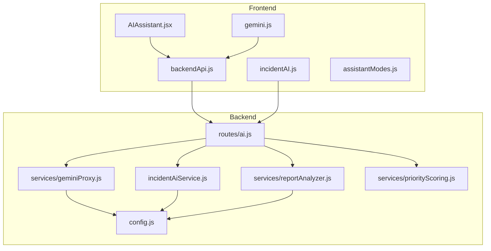
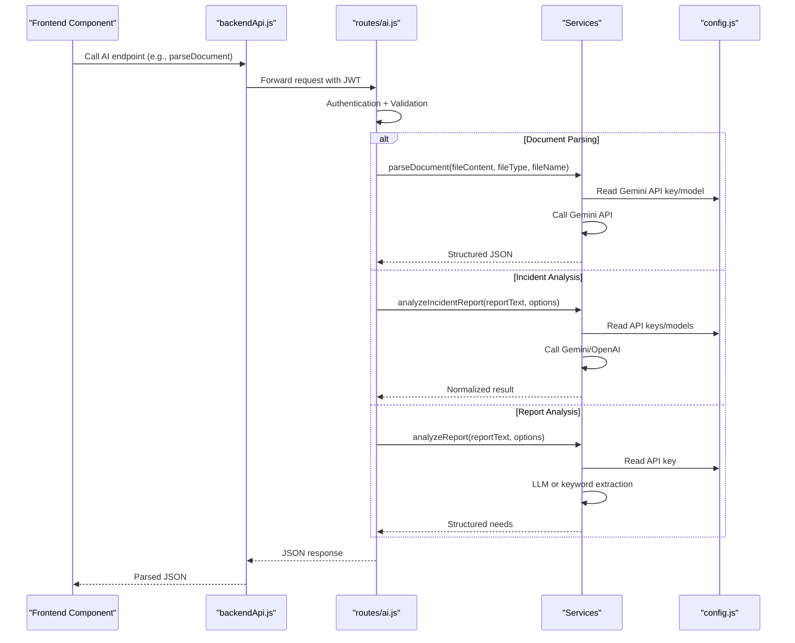
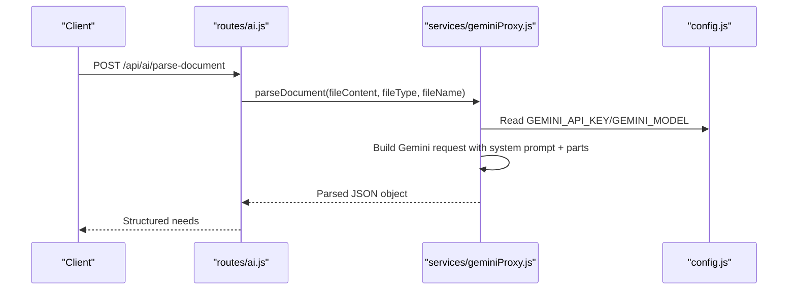
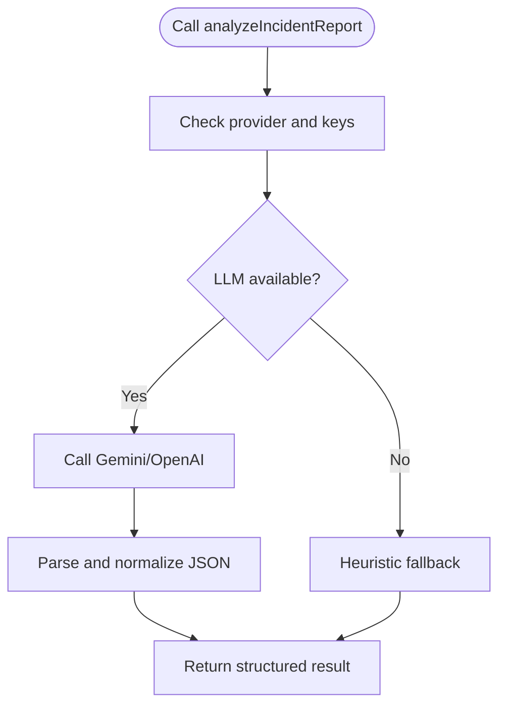
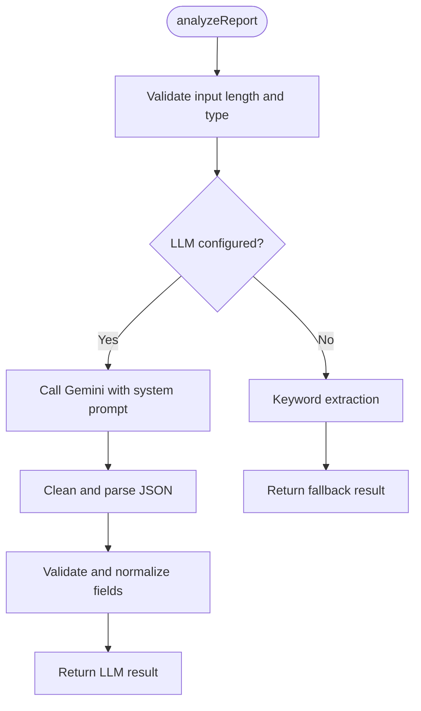
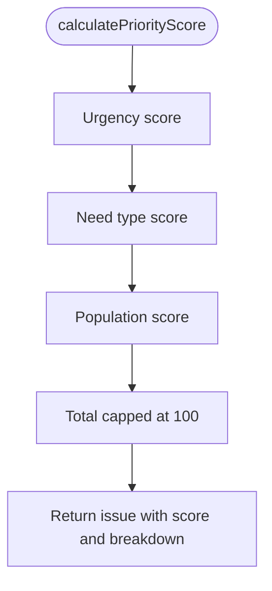
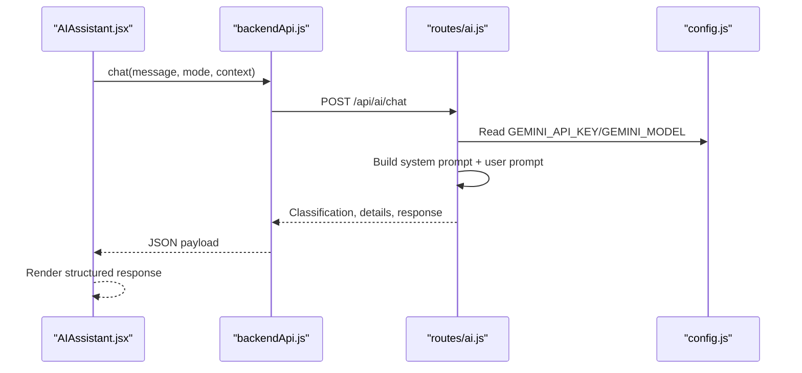
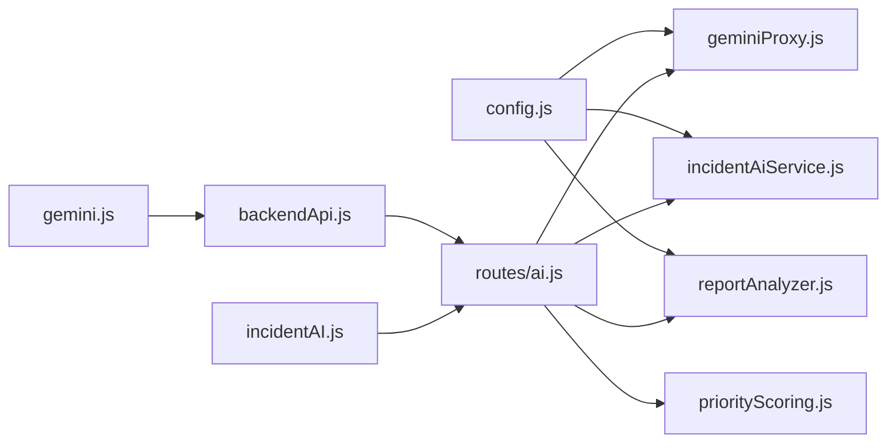

# AI Processing Endpoints

<cite>
**Referenced Files in This Document**
- [ai.js](file://server/routes/ai.js)
- [geminiProxy.js](file://server/services/geminiProxy.js)
- [incidentAiService.js](file://server/incidentAiService.js)
- [reportAnalyzer.js](file://server/services/reportAnalyzer.js)
- [priorityScoring.js](file://server/services/priorityScoring.js)
- [config.js](file://server/config.js)
- [backendApi.js](file://src/services/backendApi.js)
- [gemini.js](file://src/services/gemini.js)
- [incidentAI.js](file://src/services/incidentAI.js)
- [AIAssistant.jsx](file://src/components/AIAssistant.jsx)
- [assistantModes.js](file://src/services/assistantModes.js)
</cite>

## Table of Contents
1. [Introduction](#introduction)
2. [Project Structure](#project-structure)
3. [Core Components](#core-components)
4. [Architecture Overview](#architecture-overview)
5. [Detailed Component Analysis](#detailed-component-analysis)
6. [Dependency Analysis](#dependency-analysis)
7. [Performance Considerations](#performance-considerations)
8. [Troubleshooting Guide](#troubleshooting-guide)
9. [Conclusion](#conclusion)

## Introduction
This document provides comprehensive API documentation for AI processing endpoints focused on document analysis, incident processing, and AI-powered insights. It covers the integration with Gemini API, endpoint routing, request preprocessing, response handling, supported formats, processing capabilities, and error handling patterns. It also includes request/response schemas, examples of AI-generated insights, and integration patterns with frontend AI assistant components.

## Project Structure
The AI processing functionality spans both the backend Express routes and multiple services, with frontend integration through thin client services and UI components.

**Diagram sources**
- [ai.js:1-421](file://server/routes/ai.js#L1-L421)
- [geminiProxy.js:1-104](file://server/services/geminiProxy.js#L1-L104)
- [incidentAiService.js:1-189](file://server/incidentAiService.js#L1-L189)
- [reportAnalyzer.js:1-646](file://server/services/reportAnalyzer.js#L1-L646)
- [priorityScoring.js:1-321](file://server/services/priorityScoring.js#L1-L321)
- [config.js:1-35](file://server/config.js#L1-L35)
- [backendApi.js:1-164](file://src/services/backendApi.js#L1-L164)
- [gemini.js:1-38](file://src/services/gemini.js#L1-L38)
- [incidentAI.js:1-24](file://src/services/incidentAI.js#L1-L24)
- [AIAssistant.jsx:1-311](file://src/components/AIAssistant.jsx#L1-L311)
- [assistantModes.js:1-36](file://src/services/assistantModes.js#L1-L36)

**Section sources**
- [ai.js:1-421](file://server/routes/ai.js#L1-L421)
- [config.js:1-35](file://server/config.js#L1-L35)

## Core Components
- AI Routes: Exposes endpoints for document parsing, incident analysis, chat, match explanation, report analysis, batch report analysis, priority scoring, and ranking.
- Gemini Proxy: Secure backend proxy for document parsing that never exposes the API key to the client.
- Incident AI Service: Multi-provider incident analysis with Gemini/OpenAI and deterministic fallback.
- Report Analyzer: Structured extraction from NGO reports with LLM-first and keyword-fallback strategies.
- Priority Scoring: Numerical scoring and ranking of issues with configurable weights.
- Frontend Services: Client-side wrappers around backend endpoints and assistant modes.

**Section sources**
- [ai.js:22-421](file://server/routes/ai.js#L22-L421)
- [geminiProxy.js:1-104](file://server/services/geminiProxy.js#L1-L104)
- [incidentAiService.js:1-189](file://server/incidentAiService.js#L1-L189)
- [reportAnalyzer.js:1-646](file://server/services/reportAnalyzer.js#L1-L646)
- [priorityScoring.js:1-321](file://server/services/priorityScoring.js#L1-L321)
- [backendApi.js:56-164](file://src/services/backendApi.js#L56-L164)
- [gemini.js:1-38](file://src/services/gemini.js#L1-L38)
- [incidentAI.js:1-24](file://src/services/incidentAI.js#L1-L24)
- [AIAssistant.jsx:1-311](file://src/components/AIAssistant.jsx#L1-L311)
- [assistantModes.js:1-36](file://src/services/assistantModes.js#L1-L36)

## Architecture Overview
The AI endpoints are protected by authentication middleware and leverage a centralized configuration for AI providers. Requests are preprocessed (sanitized and validated), then routed to appropriate services. Responses are normalized and returned to clients. Frontend components integrate via typed client services.

**Diagram sources**
- [ai.js:31-51](file://server/routes/ai.js#L31-L51)
- [ai.js:56-77](file://server/routes/ai.js#L56-L77)
- [ai.js:263-291](file://server/routes/ai.js#L263-L291)
- [geminiProxy.js:53-103](file://server/services/geminiProxy.js#L53-L103)
- [incidentAiService.js:170-188](file://server/incidentAiService.js#L170-L188)
- [reportAnalyzer.js:576-607](file://server/services/reportAnalyzer.js#L576-L607)
- [config.js:11-15](file://server/config.js#L11-L15)
- [backendApi.js:90-95](file://src/services/backendApi.js#L90-L95)

## Detailed Component Analysis

### Endpoint Catalog and Routing
- POST /api/ai/parse-document
  - Purpose: Secure document parsing via Gemini proxy.
  - Auth: Required.
  - Body Schema: fileContent (required), fileType (default "text"), fileName (optional).
  - Response: Structured community needs object.
  - Error Handling: 502 on Gemini failures; 500 on server misconfiguration.

- POST /api/ai/incident-analyze
  - Purpose: Analyze incident reports with multi-provider support.
  - Auth: Required.
  - Body Schema: reportText (required), provider ("gemini"|"openai"|"auto"), context (optional).
  - Response: Normalized classification, extraction, summary, risk score, tags.
  - Error Handling: 400 for invalid input; 500 for processing failures.

- POST /api/ai/chat
  - Purpose: Operations assistant chat with mode-specific instructions.
  - Auth: Required.
  - Body Schema: message (required), mode ("responder"|"coordinator"|"citizen"), context (emergencyMode, riskScore, aiSnapshot).
  - Response: classification, details (location, urgency, type), response.
  - Error Handling: 400 for missing message; 500 for server errors; 502 for Gemini failures.

- POST /api/ai/explain-match
  - Purpose: Natural language explanation of volunteer-task match quality.
  - Auth: Required.
  - Body Schema: volunteer (object), task (object).
  - Response: explanation (string).
  - Error Handling: 500 for processing failures; 502 for Gemini failures.

- POST /api/ai/analyze-report
  - Purpose: Extract structured needs from a single report.
  - Auth: Required.
  - Body Schema: reportText (required, max 50000 chars), useLLM (optional).
  - Response: location, urgency_level, needs (type: string, priority: "high"|"medium"|"low"), affected_people_estimate, summary, confidence_score, _extraction_method.
  - Error Handling: 400 for invalid input; 500 for processing failures.

- POST /api/ai/analyze-reports-batch
  - Purpose: Batch process multiple reports.
  - Auth: Required.
  - Body Schema: reports (array of {id, text}), max 50 per batch.
  - Response: total, successful, failed, results (array of {id, result, error}).
  - Error Handling: 400 for invalid input; 500 for processing failures.

- POST /api/ai/priority-score
  - Purpose: Calculate numerical priority score for a single issue.
  - Auth: Required.
  - Body Schema: issue (object with urgency_level, affected_people_estimate, needs).
  - Response: priority_score (0-100), priority_category, breakdown.
  - Error Handling: 500 for processing failures.

- POST /api/ai/priority-rank
  - Purpose: Rank multiple issues by priority.
  - Auth: Required.
  - Body Schema: issues (array), topN (optional), includeBreakdown (optional).
  - Response: total, returned, issues (sorted with scores).
  - Error Handling: 500 for processing failures.

**Section sources**
- [ai.js:22-51](file://server/routes/ai.js#L22-L51)
- [ai.js:53-77](file://server/routes/ai.js#L53-L77)
- [ai.js:79-179](file://server/routes/ai.js#L79-L179)
- [ai.js:181-261](file://server/routes/ai.js#L181-L261)
- [ai.js:263-291](file://server/routes/ai.js#L263-L291)
- [ai.js:293-346](file://server/routes/ai.js#L293-L346)
- [ai.js:348-380](file://server/routes/ai.js#L348-L380)
- [ai.js:382-418](file://server/routes/ai.js#L382-L418)

### Gemini Integration and Proxy
- Secure Proxy: The backend proxies document parsing to Gemini, ensuring the API key remains server-side.
- Supported File Types: text, image/jpeg, image/png, application/pdf (via inlineData).
- Request Preprocessing: System prompts, file name context, and structured JSON expectations.
- Response Handling: Cleans and parses JSON; throws on invalid responses.

**Diagram sources**
- [ai.js:31-51](file://server/routes/ai.js#L31-L51)
- [geminiProxy.js:53-103](file://server/services/geminiProxy.js#L53-L103)
- [config.js:11-15](file://server/config.js#L11-L15)

**Section sources**
- [geminiProxy.js:1-104](file://server/services/geminiProxy.js#L1-L104)
- [ai.js:31-51](file://server/routes/ai.js#L31-L51)

### Incident Analysis Service
- Multi-Provider Support: Gemini and OpenAI with automatic fallback.
- Deterministic Fallback: Heuristic analysis ensures resilience when LLMs fail.
- Normalization: Standardized fields for classification, extraction, risk, and tags.

**Diagram sources**
- [incidentAiService.js:170-188](file://server/incidentAiService.js#L170-L188)

**Section sources**
- [incidentAiService.js:1-189](file://server/incidentAiService.js#L1-L189)
- [ai.js:56-77](file://server/routes/ai.js#L56-L77)

### Report Analyzer Service
- LLM-First Strategy: Uses Gemini with strict JSON schema and reasoning.
- Keyword-Fallback: Pattern-based extraction for location, urgency, needs, and affected people.
- Confidence Scoring: Quantifies extraction reliability.
- Batch Processing: Efficiently handles arrays of reports with per-result error tracking.

**Diagram sources**
- [reportAnalyzer.js:522-565](file://server/services/reportAnalyzer.js#L522-L565)
- [reportAnalyzer.js:379-397](file://server/services/reportAnalyzer.js#L379-L397)

**Section sources**
- [reportAnalyzer.js:1-646](file://server/services/reportAnalyzer.js#L1-L646)
- [ai.js:263-291](file://server/routes/ai.js#L263-L291)
- [ai.js:293-346](file://server/routes/ai.js#L293-L346)

### Priority Scoring and Ranking
- Scoring Functionality: Urgency weights, need-type weights, population thresholds.
- Ranking: Sorts by priority score, affected people, and presence of medical needs.
- Category Mapping: Converts numeric scores to categories (critical/high/medium/low/minimal).

**Diagram sources**
- [priorityScoring.js:137-172](file://server/services/priorityScoring.js#L137-L172)

**Section sources**
- [priorityScoring.js:1-321](file://server/services/priorityScoring.js#L1-L321)
- [ai.js:348-380](file://server/routes/ai.js#L348-L380)
- [ai.js:382-418](file://server/routes/ai.js#L382-L418)

### Frontend Integration Patterns
- Client-Side Wrappers:
  - backendApi.js: Typed methods for AI endpoints with JWT handling.
  - gemini.js: Client-side file reading utilities and proxy to backend parse-document.
  - incidentAI.js: Thin wrapper for incident analysis endpoint.
- Assistant Modes: Mode-aware prompts and fallback guidance for chat.
- UI Components: AIAssistant.jsx integrates with chat endpoint and displays structured outputs.

**Diagram sources**
- [AIAssistant.jsx:30-79](file://src/components/AIAssistant.jsx#L30-L79)
- [backendApi.js:110-115](file://src/services/backendApi.js#L110-L115)
- [ai.js:79-179](file://server/routes/ai.js#L79-L179)
- [config.js:11-15](file://server/config.js#L11-L15)

**Section sources**
- [backendApi.js:56-164](file://src/services/backendApi.js#L56-L164)
- [gemini.js:1-38](file://src/services/gemini.js#L1-L38)
- [incidentAI.js:1-24](file://src/services/incidentAI.js#L1-L24)
- [AIAssistant.jsx:1-311](file://src/components/AIAssistant.jsx#L1-L311)
- [assistantModes.js:1-36](file://src/services/assistantModes.js#L1-L36)

## Dependency Analysis
- Configuration: Centralized provider credentials and model names.
- Authentication: All AI endpoints require JWT via requireAuth middleware.
- Validation: Body sanitization and schema validation for each endpoint.
- External Dependencies: Gemini API and optional OpenAI API.

**Diagram sources**
- [config.js:11-15](file://server/config.js#L11-L15)
- [geminiProxy.js:1-104](file://server/services/geminiProxy.js#L1-L104)
- [incidentAiService.js:1-189](file://server/incidentAiService.js#L1-L189)
- [reportAnalyzer.js:1-646](file://server/services/reportAnalyzer.js#L1-L646)
- [priorityScoring.js:1-321](file://server/services/priorityScoring.js#L1-L321)
- [ai.js:1-421](file://server/routes/ai.js#L1-L421)
- [backendApi.js:1-164](file://src/services/backendApi.js#L1-L164)
- [gemini.js:1-38](file://src/services/gemini.js#L1-L38)
- [incidentAI.js:1-24](file://src/services/incidentAI.js#L1-L24)

**Section sources**
- [config.js:1-35](file://server/config.js#L1-L35)
- [ai.js:1-421](file://server/routes/ai.js#L1-L421)

## Performance Considerations
- Rate Limiting: Separate AI rate limit configuration for stricter quotas.
- Token Management: JWT stored in session storage for seamless client requests.
- Batch Processing: Report analyzer supports batch operations to reduce overhead.
- Model Configurations: Temperature and maxOutputTokens tuned for deterministic outputs.

[No sources needed since this section provides general guidance]

## Troubleshooting Guide
Common error scenarios and handling:
- Unsupported Formats: Document parsing supports text, JPEG, PNG, PDF. Ensure fileType matches supported MIME types.
- Processing Failures: Gemini/OpenAI failures return 502 with error details; check API keys and quotas.
- API Quota Limits: Insufficient credits or blocked requests cause Gemini failures; verify billing and quotas.
- Validation Errors: Missing or invalid fields trigger 400 responses; review request schemas.
- Authentication: Missing or invalid JWT leads to unauthorized responses; ensure proper login flow.

**Section sources**
- [geminiProxy.js:67-78](file://server/services/geminiProxy.js#L67-L78)
- [ai.js:43-49](file://server/routes/ai.js#L43-L49)
- [ai.js:156-159](file://server/routes/ai.js#L156-L159)
- [reportAnalyzer.js:522-553](file://server/services/reportAnalyzer.js#L522-L553)
- [backendApi.js:45-51](file://src/services/backendApi.js#L45-L51)

## Conclusion
The AI processing endpoints provide a robust, secure, and extensible foundation for document analysis, incident classification, and priority-driven insights. By centralizing provider credentials, enforcing validation, and offering deterministic fallbacks, the system maintains reliability while enabling powerful AI-driven workflows integrated seamlessly with frontend components.