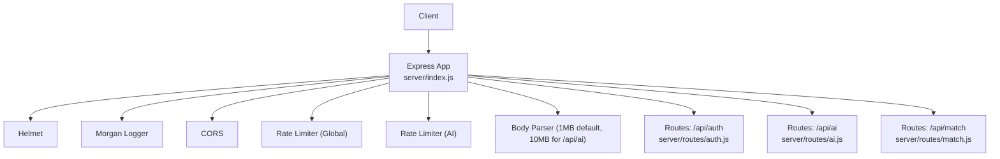
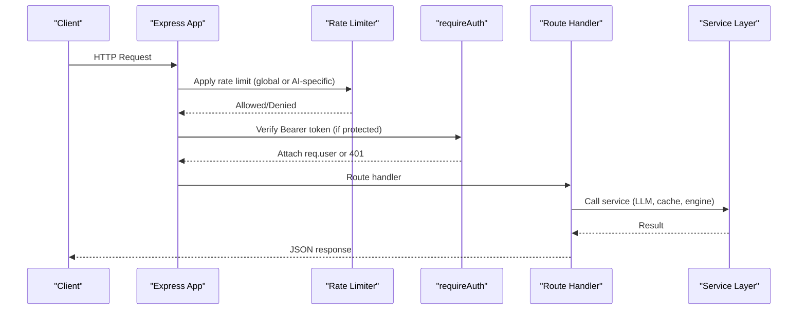
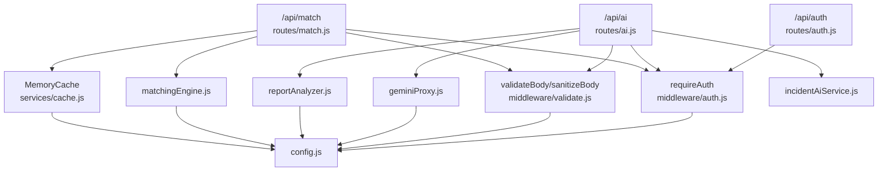

# API Endpoints

<cite>
**Referenced Files in This Document**
- [index.js](file://server/index.js)
- [auth.js](file://server/routes/auth.js)
- [ai.js](file://server/routes/ai.js)
- [match.js](file://server/routes/match.js)
- [auth-middleware.js](file://server/middleware/auth.js)
- [validate-middleware.js](file://server/middleware/validate.js)
- [config.js](file://server/config.js)
- [geminiProxy.js](file://server/services/geminiProxy.js)
- [reportAnalyzer.js](file://server/services/reportAnalyzer.js)
- [matchingEngine.js](file://server/services/matchingEngine.js)
- [incidentAiService.js](file://server/incidentAiService.js)
- [cache.js](file://server/services/cache.js)
- [api-test-report.http](file://server/test/api-test-report.http)
</cite>

## Table of Contents
1. [Introduction](#introduction)
2. [Project Structure](#project-structure)
3. [Core Components](#core-components)
4. [Architecture Overview](#architecture-overview)
5. [Detailed Component Analysis](#detailed-component-analysis)
6. [Dependency Analysis](#dependency-analysis)
7. [Performance Considerations](#performance-considerations)
8. [Troubleshooting Guide](#troubleshooting-guide)
9. [Conclusion](#conclusion)
10. [Appendices](#appendices)

## Introduction
This document provides comprehensive API documentation for the NeedLink API server. It covers authentication endpoints, AI processing endpoints (document parsing, incident analysis, chat, report analysis, batch report analysis, and match explanation), and volunteer matching endpoints. For each endpoint, you will find HTTP methods, URL patterns, request/response schemas, authentication requirements, error responses, validation rules, and example requests/responses. It also explains the routing structure, path/query/body parameters, API versioning strategy, status codes, response formatting standards, rate limiting, security considerations, and integration patterns.

## Project Structure
The API server is implemented using Express.js and organized by feature-based routes:
- Authentication: /api/auth/*
- AI: /api/ai/*
- Matching: /api/match/*
- Health: /api/health

Security middleware includes Helmet, CORS, request logging, global and AI-specific rate limits, and JWT-based authentication enforced via middleware.

**Diagram sources**
- [index.js:16-118](file://server/index.js#L16-L118)

**Section sources**
- [index.js:16-118](file://server/index.js#L16-L118)

## Core Components
- Authentication middleware enforces Bearer tokens and attaches user info to requests.
- Validation middleware sanitizes and validates request bodies according to defined schemas.
- AI routes proxy document parsing and chat via Gemini/OpenAI and analyze reports with LLM fallback.
- Matching routes compute volunteer-task rankings and generate recommendations with caching.
- Health endpoint exposes server status and configuration health.

**Section sources**
- [auth-middleware.js:14-48](file://server/middleware/auth.js#L14-L48)
- [validate-middleware.js:36-80](file://server/middleware/validate.js#L36-L80)
- [geminiProxy.js:53-103](file://server/services/geminiProxy.js#L53-L103)
- [reportAnalyzer.js:595-626](file://server/services/reportAnalyzer.js#L595-L626)
- [matchingEngine.js:166-211](file://server/services/matchingEngine.js#L166-L211)
- [index.js:79-87](file://server/index.js#L79-L87)

## Architecture Overview
The server applies layered middleware and routes requests to feature-specific routers. Authentication is mandatory for AI and matching endpoints. AI endpoints use Gemini/OpenAI for advanced processing and include strict rate limiting. Matching endpoints leverage a memory cache to optimize repeated computations.

**Diagram sources**
- [index.js:50-76](file://server/index.js#L50-L76)
- [auth-middleware.js:14-48](file://server/middleware/auth.js#L14-L48)
- [ai.js:30-178](file://server/routes/ai.js#L30-L178)
- [match.js:33-76](file://server/routes/match.js#L33-L76)

## Detailed Component Analysis

### Authentication Endpoints
- Base Path: /api/auth
- Authentication: Not required for login/register; required for protected routes under /api/ai and /api/match.

1) POST /api/auth/login
- Description: Authenticate with email/password and receive a JWT token.
- Authentication: None
- Request Body:
  - email: string, required
  - password: string, required
- Response:
  - token: string
  - account: { email: string, name: string, type: string }
- Errors:
  - 400 Bad Request: Missing email or password
  - 401 Unauthorized: Invalid credentials
- Example Request:
  - POST /api/auth/login
  - Headers: Content-Type: application/json
  - Body: { "email": "...", "password": "..." }
- Example Response:
  - 200 OK { "token": "...", "account": { "email": "...", "name": "...", "type": "..." } }

2) POST /api/auth/register
- Description: Register a new account and receive a JWT token.
- Authentication: None
- Request Body:
  - email: string, required
  - password: string, required
  - name: string, required
  - type: string, optional (defaults to "Relief NGO")
- Response:
  - token: string
  - account: { email: string, name: string, type: string }
- Errors:
  - 400 Bad Request: Missing required fields
  - 409 Conflict: Email already exists
  - 201 Created: New account created
- Example Request:
  - POST /api/auth/register
  - Headers: Content-Type: application/json
  - Body: { "email": "...", "password": "...", "name": "...", "type": "..." }
- Example Response:
  - 201 Created { "token": "...", "account": { "email": "...", "name": "...", "type": "..." } }

Security Notes:
- Tokens are signed with a configurable secret and expire after a configurable duration.
- In production, replace in-memory demo accounts with database-backed verification.

**Section sources**
- [auth.js:34-80](file://server/routes/auth.js#L34-L80)
- [auth-middleware.js:42-48](file://server/middleware/auth.js#L42-L48)

### AI Processing Endpoints
- Base Path: /api/ai
- Authentication: Required (Bearer token)
- Body Size Limits:
  - Default: 1 MB
  - AI routes: 10 MB (file uploads/base64)
- Rate Limiting:
  - Global: configurable window and max
  - AI: stricter max for expensive operations

1) POST /api/ai/parse-document
- Description: Parse document content (text or image/PDF) into structured community needs via Gemini.
- Authentication: Required
- Request Body:
  - fileContent: string, required (raw text or base64)
  - fileType: string, optional (e.g., text, image/jpeg, image/png, application/pdf)
  - fileName: string, optional (<= 256 chars)
- Response: Structured needs object (see service for schema)
- Errors:
  - 400 Bad Request: Validation failures
  - 502 Bad Gateway: Gemini upstream failure
  - 500 Internal Server Error: Missing API key or unexpected error
- Example Request:
  - POST /api/ai/parse-document
  - Headers: Content-Type: application/json, Authorization: Bearer <token>
  - Body: { "fileContent": "...", "fileType": "text", "fileName": "survey.txt" }
- Example Response:
  - 200 OK { "village": "...", "region": "...", "needs": [...], "aiInsights": [...] }

2) POST /api/ai/incident-analyze
- Description: Analyze incident report text into structured classification, extraction, and risk metrics.
- Authentication: Required
- Request Body:
  - reportText: string, required (non-empty)
  - provider: string, optional ("gemini" | "openai" | "auto")
  - context: object, optional
- Response: { classification, extraction, summary, riskScore, tags }
- Errors:
  - 400 Bad Request: Missing reportText
  - 500 Internal Server Error: Provider failure or missing API key
- Example Request:
  - POST /api/ai/incident-analyze
  - Headers: Content-Type: application/json, Authorization: Bearer <token>
  - Body: { "reportText": "...", "provider": "gemini" }

3) POST /api/ai/chat
- Description: Natural language chat with an NGO operations assistant; returns classification, details, and response.
- Authentication: Required
- Request Body:
  - message: string, required (non-empty)
  - mode: string, optional ("responder" | "coordinator" | "citizen")
  - context: object, optional (e.g., emergencyMode, riskScore, aiSnapshot)
- Response: { classification, details: { location, urgency, type }, response: string }
- Errors:
  - 400 Bad Request: Missing message
  - 500 Internal Server Error: Missing API key
  - 502 Bad Gateway: Gemini upstream failure
- Example Request:
  - POST /api/ai/chat
  - Headers: Content-Type: application/json, Authorization: Bearer <token>
  - Body: { "message": "...", "mode": "coordinator", "context": {} }

4) POST /api/ai/explain-match
- Description: AI-generated explanation for why a volunteer matches or does not match a task.
- Authentication: Required
- Request Body:
  - volunteer: object, required (fields include name, skills, distanceKm, tasks, rating, available, matchScore)
  - task: object, required (fields include title, category, location, region, priority, affectedPeople, requiredSkills)
- Response: { explanation: string }
- Errors:
  - 400 Bad Request: Missing/invalid volunteer/task
  - 500 Internal Server Error: Missing API key
  - 502 Bad Gateway: Gemini upstream failure
- Example Request:
  - POST /api/ai/explain-match
  - Headers: Content-Type: application/json, Authorization: Bearer <token>
  - Body: { "volunteer": {...}, "task": {...} }

5) POST /api/ai/analyze-report
- Description: Extract structured needs from a single NGO report; uses LLM with keyword fallback.
- Authentication: Required
- Request Body:
  - reportText: string, required (<= 50000 chars)
  - useLLM: boolean, optional (force keyword fallback if false or API key missing)
- Response: Structured needs object (location, urgency_level, needs, classified_needs, affected_people_estimate, summary, confidence_score, _reasoning, _extraction_method)
- Errors:
  - 400 Bad Request: Validation failures
  - 500 Internal Server Error: LLM/API error and fallback failure
- Example Request:
  - POST /api/ai/analyze-report
  - Headers: Content-Type: application/json, Authorization: Bearer <token>
  - Body: { "reportText": "...", "useLLM": true }

6) POST /api/ai/analyze-reports-batch
- Description: Batch process multiple reports; returns per-item results with counts.
- Authentication: Required
- Request Body:
  - reports: array, required (<= 50 items)
    - Each item: { id: string, text: string }
- Response: { total, successful, failed, results: [{ id, result, error }] }
- Errors:
  - 400 Bad Request: Invalid or empty reports array, item validation failures
  - 500 Internal Server Error: Unexpected error
- Example Request:
  - POST /api/ai/analyze-reports-batch
  - Headers: Content-Type: application/json, Authorization: Bearer <token>
  - Body: { "reports": [{ "id": "...", "text": "..." }] }

Validation Rules:
- Body sanitization removes XSS vectors and control characters.
- Schema-based validation ensures required fields and types.

**Section sources**
- [ai.js:30-178](file://server/routes/ai.js#L30-L178)
- [ai.js:25-50](file://server/routes/ai.js#L25-L50)
- [ai.js:266-290](file://server/routes/ai.js#L266-L290)
- [ai.js:296-345](file://server/routes/ai.js#L296-L345)
- [validate-middleware.js:36-80](file://server/middleware/validate.js#L36-L80)
- [geminiProxy.js:53-103](file://server/services/geminiProxy.js#L53-L103)
- [reportAnalyzer.js:595-626](file://server/services/reportAnalyzer.js#L595-L626)
- [incidentAiService.js:170-188](file://server/incidentAiService.js#L170-L188)

### Volunteer Matching Endpoints
- Base Path: /api/match
- Authentication: Required
- Cache: In-memory cache with TTL and max size; exposed via GET /api/match/cache-stats

1) POST /
- Description: Rank volunteers for a single task; optionally use cache.
- Authentication: Required
- Request Body:
  - task: object, required (supports id, category, region, requiredSkills, location, etc.)
  - volunteers: array, required (volunteer objects)
  - useCache: boolean, optional (default true)
- Response: { ranked: [...], fromCache: boolean, cacheStats: {...} }
- Errors:
  - 500 Internal Server Error: Computation failure
- Example Request:
  - POST /api/match
  - Headers: Content-Type: application/json, Authorization: Bearer <token>
  - Body: { "task": {...}, "volunteers": [...], "useCache": true }

2) POST /recommend
- Description: Generate recommendations for multiple tasks.
- Authentication: Required
- Request Body:
  - tasks: array, required
  - volunteers: array, required
  - autoAssign: boolean, optional (default false)
- Response: { recommendations: [...] }
- Errors:
  - 500 Internal Server Error: Generation failure
- Example Request:
  - POST /api/match/recommend
  - Headers: Content-Type: application/json, Authorization: Bearer <token>
  - Body: { "tasks": [...], "volunteers": [...], "autoAssign": false }

3) GET /cache-stats
- Description: Retrieve cache statistics for monitoring.
- Authentication: Required
- Response: Cache stats object
- Example Request:
  - GET /api/match/cache-stats
  - Headers: Authorization: Bearer <token>

Validation Rules:
- Body sanitization and schema validation applied for POST /.

**Section sources**
- [match.js:33-76](file://server/routes/match.js#L33-L76)
- [match.js:82-105](file://server/routes/match.js#L82-L105)
- [match.js:111-117](file://server/routes/match.js#L111-L117)
- [validate-middleware.js:48-62](file://server/middleware/validate.js#L48-L62)
- [cache.js:10-65](file://server/services/cache.js#L10-L65)
- [matchingEngine.js:166-211](file://server/services/matchingEngine.js#L166-L211)

### Additional Endpoints
- GET /api/health
  - Description: Liveness and server status.
  - Authentication: Not required.
  - Response: { status, uptime, timestamp, geminiConfigured, version }.

**Section sources**
- [index.js:79-87](file://server/index.js#L79-L87)

## Dependency Analysis
The following diagram shows key dependencies among routes, middleware, and services.

**Diagram sources**
- [auth.js:1-83](file://server/routes/auth.js#L1-L83)
- [ai.js:1-348](file://server/routes/ai.js#L1-L348)
- [match.js:1-120](file://server/routes/match.js#L1-L120)
- [auth-middleware.js:14-48](file://server/middleware/auth.js#L14-L48)
- [validate-middleware.js:36-80](file://server/middleware/validate.js#L36-L80)
- [config.js:8-35](file://server/config.js#L8-L35)
- [geminiProxy.js:53-103](file://server/services/geminiProxy.js#L53-L103)
- [reportAnalyzer.js:595-626](file://server/services/reportAnalyzer.js#L595-L626)
- [matchingEngine.js:166-211](file://server/services/matchingEngine.js#L166-L211)
- [cache.js:10-65](file://server/services/cache.js#L10-L65)
- [incidentAiService.js:170-188](file://server/incidentAiService.js#L170-L188)

**Section sources**
- [index.js:22-24](file://server/index.js#L22-L24)
- [config.js:8-35](file://server/config.js#L8-L35)

## Performance Considerations
- Rate Limiting:
  - Global: configurable window and max requests.
  - AI: stricter max to protect expensive LLM calls.
- Body Size Limits:
  - Default: 1 MB; AI routes increase to 10 MB for file uploads.
- Caching:
  - Matching results cached with TTL and eviction; monitor via cache-stats endpoint.
- LLM Costs and Latency:
  - Prefer keyword fallback when LLM is unavailable or disabled.
- Recommendations:
  - Auto-assign reduces manual intervention; tune based on workload.

[No sources needed since this section provides general guidance]

## Troubleshooting Guide
Common Issues and Resolutions:
- Authentication Failures:
  - Missing or malformed Authorization header: ensure Bearer <token>.
  - Expired token: require user to log in again.
- Validation Errors:
  - Missing required fields or wrong types: review schema and sanitize rules.
- LLM/API Failures:
  - Missing API keys: configure environment variables.
  - Upstream errors: check Gemini/OpenAI status and retry.
- Rate Limit Exceeded:
  - Reduce request frequency or adjust server configuration.
- Cache Misses:
  - Expected for new task/volunteer combinations; monitor cache-stats.

**Section sources**
- [auth-middleware.js:17-36](file://server/middleware/auth.js#L17-L36)
- [validate-middleware.js:48-62](file://server/middleware/validate.js#L48-L62)
- [index.js:50-71](file://server/index.js#L50-L71)
- [match.js:111-117](file://server/routes/match.js#L111-L117)

## Conclusion
The NeedLink API provides a secure, validated, and rate-limited interface for authentication, AI-driven analysis, and volunteer matching. By following the documented endpoints, schemas, and security practices, integrators can reliably connect clients to backend services while maintaining performance and observability.

[No sources needed since this section summarizes without analyzing specific files]

## Appendices

### API Versioning Strategy
- Current server version is exposed in the health endpoint.
- No explicit path-based versioning observed; consider adding /api/v1/ prefixes in future iterations.

**Section sources**
- [index.js:80-86](file://server/index.js#L80-L86)

### Status Codes and Response Formatting Standards
- Standard HTTP status codes are used consistently.
- Responses are JSON objects; error responses include an error field and details when applicable.
- Health endpoint includes a version field for compatibility checks.

**Section sources**
- [index.js:89-101](file://server/index.js#L89-L101)
- [auth.js:37-44](file://server/routes/auth.js#L37-L44)
- [ai.js:44-47](file://server/routes/ai.js#L44-L47)
- [ai.js:69-74](file://server/routes/ai.js#L69-L74)
- [match.js:70-75](file://server/routes/match.js#L70-L75)

### Rate Limiting Per Endpoint
- Global rate limiter applies to /api/ routes.
- Stricter AI rate limiter applies to /api/ai/ routes.
- Adjust window and max via environment variables.

**Section sources**
- [index.js:50-71](file://server/index.js#L50-L71)
- [config.js:21-24](file://server/config.js#L21-L24)

### Security Considerations
- Helmet hardens headers; CORS allows configured origin with credentials.
- JWT-based authentication for protected endpoints.
- Input sanitization and schema validation reduce injection risks.
- API keys are managed via environment variables; never expose to clients.

**Section sources**
- [index.js:28-43](file://server/index.js#L28-L43)
- [auth-middleware.js:14-36](file://server/middleware/auth.js#L14-L36)
- [validate-middleware.js:11-41](file://server/middleware/validate.js#L11-L41)
- [config.js:12-19](file://server/config.js#L12-L19)

### Integration Patterns
- Obtain a token via /api/auth/login or /api/auth/register.
- Use Authorization: Bearer <token> for all protected endpoints.
- For document parsing, send base64-encoded content with appropriate fileType.
- For report analysis, include reportText and optional useLLM flag.
- For matching, submit task and volunteers arrays; optionally enable autoAssign.

**Section sources**
- [api-test-report.http:8-84](file://server/test/api-test-report.http#L8-L84)
- [auth.js:34-80](file://server/routes/auth.js#L34-L80)
- [ai.js:30-178](file://server/routes/ai.js#L30-L178)
- [match.js:33-105](file://server/routes/match.js#L33-L105)