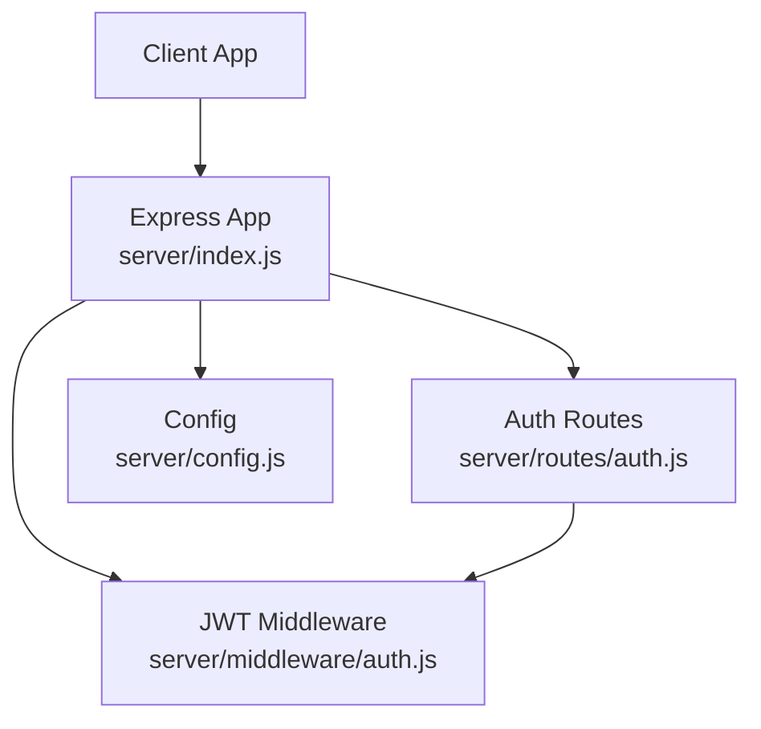
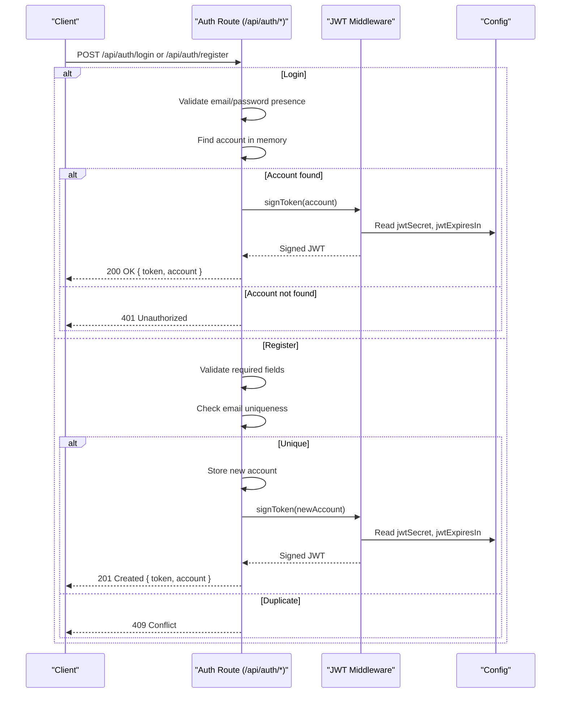
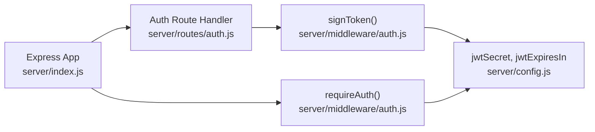

# Authentication Endpoints

<cite>
**Referenced Files in This Document**
- [auth.js](file://server/routes/auth.js)
- [auth.js](file://server/middleware/auth.js)
- [index.js](file://server/index.js)
- [config.js](file://server/config.js)
- [api-test-report.http](file://server/test/api-test-report.http)
</cite>

## Table of Contents
1. [Introduction](#introduction)
2. [Project Structure](#project-structure)
3. [Core Components](#core-components)
4. [Architecture Overview](#architecture-overview)
5. [Detailed Component Analysis](#detailed-component-analysis)
6. [Dependency Analysis](#dependency-analysis)
7. [Performance Considerations](#performance-considerations)
8. [Troubleshooting Guide](#troubleshooting-guide)
9. [Conclusion](#conclusion)

## Introduction
This document provides detailed API documentation for the authentication endpoints used by the NeedLink platform. It covers:
- POST /api/auth/login: email/password authentication, account validation, and JWT token generation
- POST /api/auth/register: NGO account creation, required fields, duplicate email validation, and JWT token creation

It specifies request/response schemas, authentication requirements, error handling, example requests/responses, status codes, and security considerations for token-based authentication.

## Project Structure
The authentication endpoints are implemented in the server module and integrated into the Express application. The routing and middleware are organized as follows:
- Routes: server/routes/auth.js
- Authentication middleware: server/middleware/auth.js
- Application bootstrap: server/index.js
- Configuration: server/config.js
- Example tests: server/test/api-test-report.http

**Diagram sources**
- [index.js:16-120](file://server/index.js#L16-L120)
- [auth.js:1-83](file://server/routes/auth.js#L1-L83)
- [auth.js:1-49](file://server/middleware/auth.js#L1-L49)
- [config.js:1-35](file://server/config.js#L1-L35)

**Section sources**
- [index.js:16-120](file://server/index.js#L16-L120)
- [auth.js:1-83](file://server/routes/auth.js#L1-L83)
- [auth.js:1-49](file://server/middleware/auth.js#L1-L49)
- [config.js:1-35](file://server/config.js#L1-L35)

## Core Components
- Authentication routes:
  - POST /api/auth/login: Validates credentials and returns a JWT token and account info
  - POST /api/auth/register: Creates a new NGO account and returns a JWT token and account info
- JWT middleware:
  - requireAuth: verifies Authorization: Bearer <token> and decodes the payload
  - signToken: generates a signed JWT with expiration from configuration

Key behaviors:
- Login validates presence of email and password, matches against in-memory accounts, and signs a JWT
- Registration validates required fields, ensures uniqueness of email, stores the new account, and signs a JWT
- JWT middleware enforces Bearer token presence, verifies signature, and attaches decoded user to the request

**Section sources**
- [auth.js:28-80](file://server/routes/auth.js#L28-L80)
- [auth.js:14-48](file://server/middleware/auth.js#L14-L48)
- [config.js:17-19](file://server/config.js#L17-L19)

## Architecture Overview
The authentication flow integrates route handlers with JWT middleware and configuration-driven token signing.

**Diagram sources**
- [auth.js:28-80](file://server/routes/auth.js#L28-L80)
- [auth.js:42-48](file://server/middleware/auth.js#L42-L48)
- [config.js:17-19](file://server/config.js#L17-L19)

## Detailed Component Analysis

### POST /api/auth/login
Purpose:
- Authenticate an NGO user via email and password
- Return a JWT token and account details

Request
- Method: POST
- Path: /api/auth/login
- Headers: Content-Type: application/json
- Body (JSON):
  - email: string (required)
  - password: string (required)

Response
- 200 OK
  - token: string (JWT)
  - account: object
    - email: string
    - name: string
    - type: string
- 400 Bad Request
  - error: string (missing email or password)
- 401 Unauthorized
  - error: string (invalid credentials)

Behavior
- Validates presence of email and password
- Searches for a matching account in memory (including dynamically registered accounts)
- On success, signs a JWT with issuer claims (email, name, type) and returns it plus account info
- On failure, returns appropriate error status

Example request
- POST /api/auth/login
- Content-Type: application/json
- Body:
  - email: "test@example.com"
  - password: "password123"

Example response (success)
- Status: 200
- Body:
  - token: "eyJhb..."
  - account:
    - email: "test@example.com"
    - name: "Test NGO"
    - type: "Relief NGO"

Security considerations
- Token is signed with a secret from configuration and expires after a configured period
- Clients must store tokens securely and send Authorization: Bearer <token> for protected routes

**Section sources**
- [auth.js:28-52](file://server/routes/auth.js#L28-L52)
- [auth.js:42-48](file://server/middleware/auth.js#L42-L48)
- [config.js:17-19](file://server/config.js#L17-L19)
- [api-test-report.http:7-16](file://server/test/api-test-report.http#L7-L16)

### POST /api/auth/register
Purpose:
- Create a new NGO account
- Return a JWT token and account details

Request
- Method: POST
- Path: /api/auth/register
- Headers: Content-Type: application/json
- Body (JSON):
  - email: string (required)
  - password: string (required)
  - name: string (required)
  - type: string (optional; defaults to "Relief NGO")

Response
- 201 Created
  - token: string (JWT)
  - account: object
    - email: string
    - name: string
    - type: string
- 400 Bad Request
  - error: string (missing required fields)
- 409 Conflict
  - error: string (email already exists)

Behavior
- Validates presence of email, password, and name
- Ensures email uniqueness across built-in and dynamically registered accounts
- Stores the new account with normalized email (lowercase, trimmed)
- Generates and returns a JWT for the new account

Example request
- POST /api/auth/register
- Content-Type: application/json
- Body:
  - email: "ngo@example.org"
  - password: "securePass123"
  - name: "Example Relief NGO"
  - type: "Health NGO"

Example response (success)
- Status: 201
- Body:
  - token: "eyJhb..."
  - account:
    - email: "ngo@example.org"
    - name: "Example Relief NGO"
    - type: "Health NGO"

Security considerations
- Enforce strong password policies at the client or upstream gateways
- Treat tokens as sensitive data; rotate tokens periodically and invalidate on logout

**Section sources**
- [auth.js:54-80](file://server/routes/auth.js#L54-L80)
- [auth.js:42-48](file://server/middleware/auth.js#L42-L48)
- [config.js:17-19](file://server/config.js#L17-L19)

## Dependency Analysis
Authentication depends on:
- JWT signing middleware for token issuance
- Configuration for secret and expiration
- Express application for routing and middleware integration

**Diagram sources**
- [auth.js:1-83](file://server/routes/auth.js#L1-L83)
- [auth.js:14-48](file://server/middleware/auth.js#L14-L48)
- [config.js:17-19](file://server/config.js#L17-L19)
- [index.js:16-120](file://server/index.js#L16-L120)

**Section sources**
- [auth.js:1-83](file://server/routes/auth.js#L1-L83)
- [auth.js:14-48](file://server/middleware/auth.js#L14-L48)
- [config.js:17-19](file://server/config.js#L17-L19)
- [index.js:16-120](file://server/index.js#L16-L120)

## Performance Considerations
- Token generation is lightweight; avoid excessive re-signing
- Keep the number of stored accounts reasonable for fast in-memory lookup
- Consider moving to a persistent store (e.g., Firebase) for production-scale account management
- Apply rate limiting to authentication endpoints to mitigate brute-force attempts

## Troubleshooting Guide
Common issues and resolutions:
- 400 Bad Request on login/register
  - Cause: Missing required fields (email, password, name)
  - Resolution: Ensure all required fields are present in the request body
- 401 Unauthorized on login
  - Cause: Invalid email or password
  - Resolution: Verify credentials; ensure email casing differences are handled consistently
- 409 Conflict on register
  - Cause: Email already exists
  - Resolution: Prompt user to choose another email or log in
- 401 Unauthorized on protected routes
  - Cause: Missing or invalid Authorization header
  - Resolution: Include Authorization: Bearer <token> with a valid, unexpired token

Operational tips:
- Use the health endpoint to verify server availability before testing authentication
- Validate JWT configuration (secret and expiration) in the environment

**Section sources**
- [auth.js:37-44](file://server/routes/auth.js#L37-L44)
- [auth.js:63-70](file://server/routes/auth.js#L63-L70)
- [auth.js:14-36](file://server/middleware/auth.js#L14-L36)
- [index.js:79-87](file://server/index.js#L79-L87)

## Conclusion
The authentication endpoints provide a straightforward, token-based mechanism for NGO users to log in and register. They enforce required fields, validate credentials, and issue short-lived JWTs. For production, integrate with a secure identity provider and persist accounts in a database while keeping the JWT secret and expiration configurable.