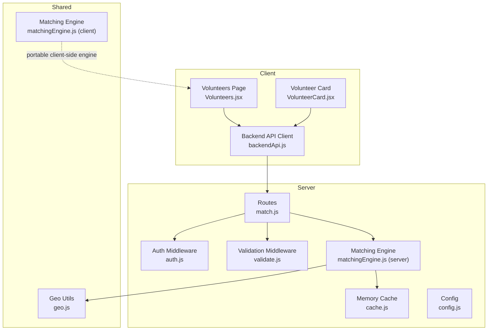
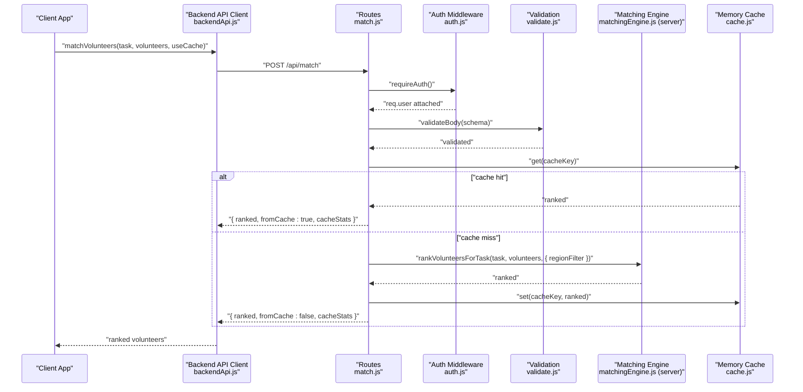
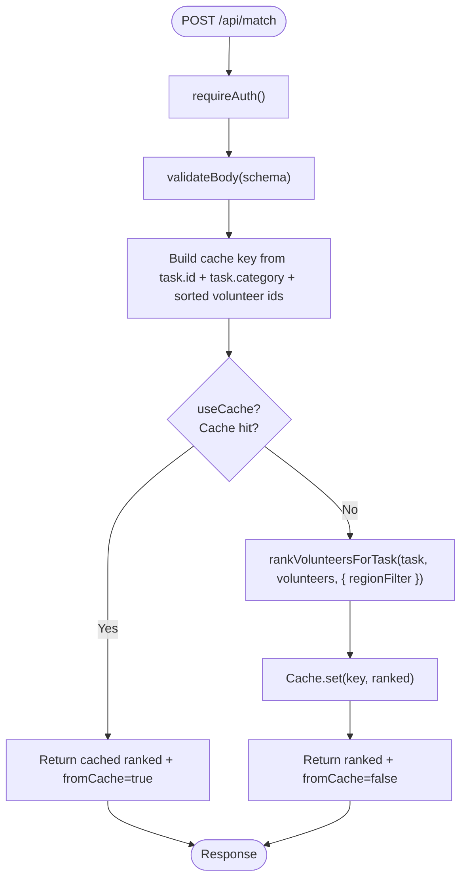
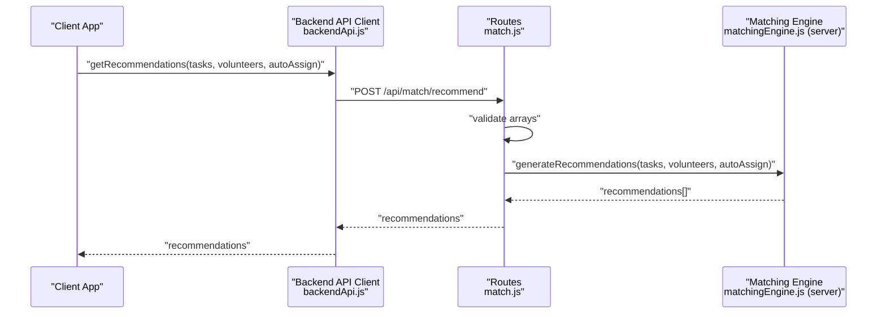
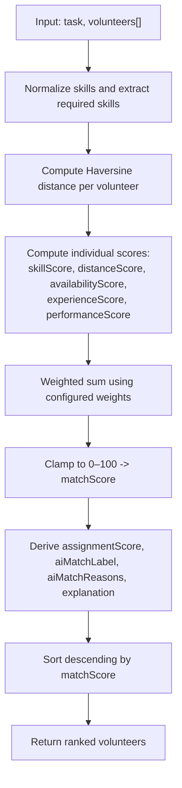
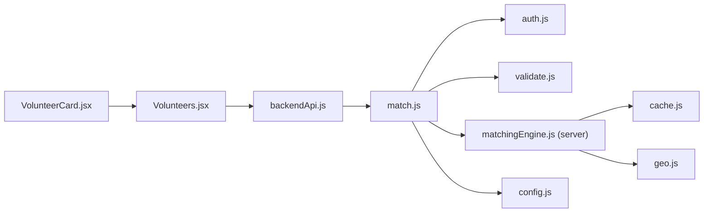

# Volunteer Matching Endpoints

<cite>
**Referenced Files in This Document**
- [match.js](file://server/routes/match.js)
- [matchingEngine.js](file://server/services/matchingEngine.js)
- [matchingEngine.js](file://src/engine/matchingEngine.js)
- [matchingEngine.js](file://src/services/intelligence/matchingEngine.js)
- [geo.js](file://src/utils/geo.js)
- [validate.js](file://server/middleware/validate.js)
- [auth.js](file://server/middleware/auth.js)
- [config.js](file://server/config.js)
- [cache.js](file://server/services/cache.js)
- [backendApi.js](file://src/services/backendApi.js)
- [VolunteerCard.jsx](file://src/components/volunteers/VolunteerCard.jsx)
- [Volunteers.jsx](file://src/pages/Volunteers.jsx)
- [Tasks.jsx](file://src/pages/Tasks.jsx)
- [api-test-report.http](file://server/test/api-test-report.http)
</cite>

## Table of Contents
1. [Introduction](#introduction)
2. [Project Structure](#project-structure)
3. [Core Components](#core-components)
4. [Architecture Overview](#architecture-overview)
5. [Detailed Component Analysis](#detailed-component-analysis)
6. [Dependency Analysis](#dependency-analysis)
7. [Performance Considerations](#performance-considerations)
8. [Troubleshooting Guide](#troubleshooting-guide)
9. [Conclusion](#conclusion)
10. [Appendices](#appendices)

## Introduction
This document provides comprehensive API documentation for the volunteer matching endpoints that power automatic volunteer assignment and proximity-based matching. It explains the matching algorithm integration, including distance calculations, skill matching, and availability checks. It specifies request parameters for location-based matching, skill filters, and priority assignments, and documents response schemas for matched volunteers, ranking scores, and assignment recommendations. It also covers the matching engine service integration, performance characteristics, optimization strategies, and practical examples of matching scenarios and integration patterns with the volunteer management system.

## Project Structure
The matching functionality spans both the server and the client:
- Server exposes two primary endpoints under /api/match:
  - POST /api/match: ranks volunteers for a single task
  - POST /api/match/recommend: generates batch recommendations for multiple tasks
- The server-side matching engine computes weighted scores using distance, skills, availability, experience, and performance.
- Client-side integration uses a thin HTTP client to call the server endpoints and renders ranked volunteers with AI explanations and assignment recommendations.

**Diagram sources**
- [match.js:1-120](file://server/routes/match.js#L1-L120)
- [matchingEngine.js:1-212](file://server/services/matchingEngine.js#L1-L212)
- [cache.js:1-66](file://server/services/cache.js#L1-L66)
- [geo.js:1-37](file://src/utils/geo.js#L1-L37)
- [backendApi.js:128-149](file://src/services/backendApi.js#L128-L149)
- [VolunteerCard.jsx:16-30](file://src/components/volunteers/VolunteerCard.jsx#L16-L30)
- [Volunteers.jsx:24-95](file://src/pages/Volunteers.jsx#L24-L95)

**Section sources**
- [match.js:1-120](file://server/routes/match.js#L1-L120)
- [matchingEngine.js:1-212](file://server/services/matchingEngine.js#L1-L212)
- [backendApi.js:128-149](file://src/services/backendApi.js#L128-L149)

## Core Components
- Matching Routes
  - POST /api/match: Accepts a task and a list of volunteers, optionally with useCache flag. Returns ranked volunteers with match scores and cache stats.
  - POST /api/match/recommend: Accepts tasks and volunteers, optionally with autoAssign flag. Returns recommendations per task including top matches and recommended assignees.
  - GET /api/match/cache-stats: Returns cache hit rate and statistics for monitoring.
- Matching Engine (Server)
  - Computes weighted scores using normalized skill overlap, Haversine distance, availability, experience, and performance.
  - Supports region pre-filtering to reduce computation on large datasets.
  - Caches results keyed by task ID, category, and volunteer IDs.
- Validation and Authentication
  - Sanitization and schema validation for request bodies.
  - JWT-based authentication middleware enforcing Authorization: Bearer <token>.
- Client Integration
  - Thin HTTP client wraps server endpoints for matching and recommendations.
  - Frontend pages consume recommendations and render AI explanations and assignment options.

**Section sources**
- [match.js:23-106](file://server/routes/match.js#L23-L106)
- [matchingEngine.js:166-211](file://server/services/matchingEngine.js#L166-L211)
- [validate.js:48-62](file://server/middleware/validate.js#L48-L62)
- [auth.js:14-37](file://server/middleware/auth.js#L14-L37)
- [backendApi.js:134-149](file://src/services/backendApi.js#L134-L149)

## Architecture Overview
The matching pipeline integrates client and server components:
- Client requests recommendations or ranks volunteers for a task.
- Server validates inputs, optionally checks cache, runs the matching engine, and returns results.
- Client renders ranked volunteers with explanations and supports manual or auto-assignment.

**Diagram sources**
- [backendApi.js:134-139](file://src/services/backendApi.js#L134-L139)
- [match.js:33-77](file://server/routes/match.js#L33-L77)
- [matchingEngine.js:166-182](file://server/services/matchingEngine.js#L166-L182)
- [cache.js:21-44](file://server/services/cache.js#L21-L44)

## Detailed Component Analysis

### Endpoint: POST /api/match
- Purpose: Rank volunteers for a single task.
- Authentication: Required (Bearer token).
- Request Body
  - task: object (required)
    - Example fields: id, category, requiredSkills, location or lat/lng, region
  - volunteers: array of volunteer objects (required)
    - Example fields: id, name, skill, skills, location or lat/lng, status, available, tasks, rating, region
  - useCache: boolean (optional, default true)
- Response
  - ranked: array of volunteer objects with additional fields
    - matchScore: number (0–100)
    - assignmentScore: number (0–1)
    - skillScore: number (0–1)
    - distanceKm: number|null
    - aiMatchLabel: string
    - aiMatchReasons: string[]
    - explanation: string[]
  - fromCache: boolean
  - cacheStats: object (size, maxSize, ttlMs, hits, misses, hitRate)
- Error Responses
  - 400: Validation failed
  - 401: Authentication required or invalid token
  - 500: Matching computation failed

**Diagram sources**
- [match.js:33-77](file://server/routes/match.js#L33-L77)
- [matchingEngine.js:166-182](file://server/services/matchingEngine.js#L166-L182)
- [cache.js:21-44](file://server/services/cache.js#L21-L44)

**Section sources**
- [match.js:23-77](file://server/routes/match.js#L23-L77)
- [matchingEngine.js:166-182](file://server/services/matchingEngine.js#L166-L182)
- [cache.js:21-44](file://server/services/cache.js#L21-L44)

### Endpoint: POST /api/match/recommend
- Purpose: Generate recommendations for multiple tasks.
- Authentication: Required (Bearer token).
- Request Body
  - tasks: array of task objects (required)
  - volunteers: array of volunteer objects (required)
  - autoAssign: boolean (optional, default false)
- Response
  - recommendations: array of recommendation objects
    - taskId: string
    - autoAssigned: boolean
    - assignedVolunteerId: string|null
    - rankedVolunteers: array of top-ranked volunteers (up to 5)
      - id, name, matchScore, distanceKm, explanation
    - recommendedAssignees: array of volunteer IDs (up to slots)
    - recommendationSummary: string summary
- Error Responses
  - 400: tasks and volunteers arrays are required
  - 401: Authentication required or invalid token
  - 500: Recommendation generation failed

**Diagram sources**
- [backendApi.js:144-149](file://src/services/backendApi.js#L144-L149)
- [match.js:82-105](file://server/routes/match.js#L82-L105)
- [matchingEngine.js:187-211](file://server/services/matchingEngine.js#L187-L211)

**Section sources**
- [match.js:79-106](file://server/routes/match.js#L79-L106)
- [matchingEngine.js:187-211](file://server/services/matchingEngine.js#L187-L211)
- [backendApi.js:144-149](file://src/services/backendApi.js#L144-L149)

### Endpoint: GET /api/match/cache-stats
- Purpose: Monitor cache performance.
- Authentication: Required (Bearer token).
- Response
  - size, maxSize, ttlMs, hits, misses, hitRate

**Section sources**
- [match.js:108-117](file://server/routes/match.js#L108-L117)
- [cache.js:53-64](file://server/services/cache.js#L53-L64)

### Matching Algorithm Integration
- Distance Calculation
  - Haversine formula implemented in both server and shared utilities.
  - Distance-based score buckets: very close, close, moderate, far.
- Skill Matching
  - Token normalization and fuzzy overlap between required skills and volunteer skills.
  - If no required skills are specified, category tokens are used as required skills.
- Availability Checking
  - Scores vary by status (busy, soon, available).
- Experience and Performance
  - Experience score increases with completed tasks.
  - Performance score normalized by rating.
- Weighted Scoring
  - Weights: skill, distance, availability, experience, performance.
  - Final matchScore is clamped to 0–100; assignmentScore is matchScore scaled to 0–1.
- Region Pre-filtering
  - When task.region is present, volunteers are pre-filtered by matching region to reduce computation.

**Diagram sources**
- [matchingEngine.js:110-157](file://server/services/matchingEngine.js#L110-L157)
- [matchingEngine.js:90-99](file://server/services/matchingEngine.js#L90-L99)
- [matchingEngine.js:64-88](file://server/services/matchingEngine.js#L64-L88)
- [matchingEngine.js:166-182](file://server/services/matchingEngine.js#L166-L182)

**Section sources**
- [matchingEngine.js:14-30](file://server/services/matchingEngine.js#L14-L30)
- [matchingEngine.js:90-157](file://server/services/matchingEngine.js#L90-L157)
- [matchingEngine.js:166-182](file://server/services/matchingEngine.js#L166-L182)
- [geo.js:15-29](file://src/utils/geo.js#L15-L29)

### Request Parameters and Validation
- Schema for POST /api/match
  - task: object (required)
  - volunteers: array (required)
  - useCache: boolean (optional)
- Schema for POST /api/match/recommend
  - tasks: array (required)
  - volunteers: array (required)
  - autoAssign: boolean (optional)
- Validation Rules
  - sanitizeBody: strips XSS vectors and control characters
  - validateBody: enforces object/array types for task and volunteers

**Section sources**
- [match.js:28-31](file://server/routes/match.js#L28-L31)
- [validate.js:36-62](file://server/middleware/validate.js#L36-L62)

### Response Schemas
- POST /api/match
  - ranked: array of volunteer objects with:
    - matchScore, assignmentScore, skillScore, distanceKm, aiMatchLabel, aiMatchReasons, explanation
  - fromCache: boolean
  - cacheStats: object
- POST /api/match/recommend
  - recommendations: array of objects with:
    - taskId, autoAssigned, assignedVolunteerId, rankedVolunteers[], recommendedAssignees[], recommendationSummary

**Section sources**
- [match.js:64-68](file://server/routes/match.js#L64-L68)
- [match.js:97](file://server/routes/match.js#L97)
- [matchingEngine.js:194-210](file://server/services/matchingEngine.js#L194-L210)

### Client Integration Patterns
- Backend API Client
  - matchVolunteers(task, volunteers, useCache): calls POST /api/match
  - getRecommendations(tasks, volunteers, autoAssign): calls POST /api/match/recommend
  - getCacheStats(): calls GET /api/match/cache-stats
- Frontend Pages
  - Volunteers page loads tasks and volunteers, selects a task, and requests recommendations.
  - Renders volunteer cards with AI match label, reasons, and assignment controls.
  - Supports manual assignment and optional auto-assignment based on recommendations.

**Section sources**
- [backendApi.js:134-149](file://src/services/backendApi.js#L134-L149)
- [Volunteers.jsx:24-95](file://src/pages/Volunteers.jsx#L24-L95)
- [VolunteerCard.jsx:16-30](file://src/components/volunteers/VolunteerCard.jsx#L16-L30)

## Dependency Analysis
- Server Dependencies
  - Express router depends on auth and validation middleware.
  - Matching engine depends on geo utilities and cache service.
  - Config provides cache TTL and size.
- Client Dependencies
  - Volunteers page consumes backend API client and renders recommendations.
  - Volunteer card displays AI explanations and match metrics.

**Diagram sources**
- [match.js:1-120](file://server/routes/match.js#L1-L120)
- [matchingEngine.js:1-212](file://server/services/matchingEngine.js#L1-L212)
- [cache.js:1-66](file://server/services/cache.js#L1-L66)
- [geo.js:1-37](file://src/utils/geo.js#L1-L37)
- [config.js:29-32](file://server/config.js#L29-L32)
- [backendApi.js:128-149](file://src/services/backendApi.js#L128-L149)
- [Volunteers.jsx:24-95](file://src/pages/Volunteers.jsx#L24-L95)
- [VolunteerCard.jsx:16-30](file://src/components/volunteers/VolunteerCard.jsx#L16-L30)

**Section sources**
- [match.js:1-120](file://server/routes/match.js#L1-L120)
- [matchingEngine.js:1-212](file://server/services/matchingEngine.js#L1-L212)
- [backendApi.js:128-149](file://src/services/backendApi.js#L128-L149)

## Performance Considerations
- Caching
  - In-memory cache with TTL and LRU eviction reduces recomputation for identical task+volunteer sets.
  - Cache key derived from task ID, category, and sorted volunteer IDs.
  - Monitor cache hit rate via GET /api/match/cache-stats.
- Pre-filtering
  - Region-based pre-filtering reduces dataset size before scoring.
- Algorithm Complexity
  - O(N) scoring per volunteer plus O(N log N) sorting; region pre-filtering can reduce N.
- Recommendations
  - Batch recommendations compute rankings per task; limit top-N for display and assignment.
- Client-Side Notes
  - Client-side matching engine exists for portability but server-side engine is authoritative for production.

**Section sources**
- [cache.js:10-66](file://server/services/cache.js#L10-L66)
- [matchingEngine.js:169-177](file://server/services/matchingEngine.js#L169-L177)
- [match.js:108-117](file://server/routes/match.js#L108-L117)

## Troubleshooting Guide
- Authentication Issues
  - Ensure Authorization: Bearer <token> header is present and valid.
  - Verify JWT secret and expiration settings.
- Validation Errors
  - Confirm task and volunteers are objects/arrays respectively.
  - Sanitized inputs are stripped of XSS vectors and control characters.
- Cache Problems
  - Use GET /api/match/cache-stats to check hit rate and size.
  - Adjust MATCH_CACHE_TTL_MS and MATCH_CACHE_MAX_SIZE via environment variables.
- Distance and Location
  - Missing or invalid coordinates yield conservative distance estimates.
  - Ensure volunteer and task locations include finite lat/lng values.
- Recommendation Failures
  - Verify tasks and volunteers arrays are provided.
  - Check server logs for error messages.

**Section sources**
- [auth.js:14-37](file://server/middleware/auth.js#L14-L37)
- [validate.js:48-62](file://server/middleware/validate.js#L48-L62)
- [match.js:108-117](file://server/routes/match.js#L108-L117)
- [geo.js:7-13](file://src/utils/geo.js#L7-L13)

## Conclusion
The volunteer matching endpoints provide a robust, cache-backed solution for proximity-based and skill-aware volunteer assignment. The server-side matching engine ensures consistent scoring and performance, while the client integrates seamlessly to render actionable insights and facilitate manual or auto-assignment. Proper configuration of caching, validation, and authentication guarantees reliable operation at scale.

## Appendices

### API Definitions
- POST /api/match
  - Headers: Authorization: Bearer <token>, Content-Type: application/json
  - Body: { task: object, volunteers: array, useCache?: boolean }
  - Response: { ranked: array, fromCache: boolean, cacheStats: object }
- POST /api/match/recommend
  - Headers: Authorization: Bearer <token>, Content-Type: application/json
  - Body: { tasks: array, volunteers: array, autoAssign?: boolean }
  - Response: { recommendations: array }
- GET /api/match/cache-stats
  - Headers: Authorization: Bearer <token>
  - Response: { size, maxSize, ttlMs, hits, misses, hitRate }

**Section sources**
- [match.js:23-106](file://server/routes/match.js#L23-L106)

### Example Matching Scenarios
- Single Task Ranking
  - Request: POST /api/match with a task and a list of volunteers.
  - Response: ranked volunteers with matchScore, explanation, and aiMatchReasons.
- Batch Recommendations
  - Request: POST /api/match/recommend with tasks and volunteers.
  - Response: recommendations per task including rankedVolunteers and recommendedAssignees.
- Auto-Assignment
  - Request: POST /api/match/recommend with autoAssign=true.
  - Response: autoAssigned and assignedVolunteerId for top candidates.

**Section sources**
- [matchingEngine.js:187-211](file://server/services/matchingEngine.js#L187-L211)
- [backendApi.js:144-149](file://src/services/backendApi.js#L144-L149)

### Integration Patterns with Volunteer Management
- Load Tasks and Volunteers
  - Fetch active tasks and volunteers, select a task, and request recommendations.
- Render AI Explanations
  - Display aiMatchLabel, aiMatchReasons, and explanation for transparency.
- Manual vs Auto Assignment
  - Manual assignment updates availability and task counts.
  - Auto-assignment deploys top-available volunteers based on recommendations.

**Section sources**
- [Volunteers.jsx:24-95](file://src/pages/Volunteers.jsx#L24-L95)
- [VolunteerCard.jsx:16-30](file://src/components/volunteers/VolunteerCard.jsx#L16-L30)
- [Tasks.jsx:332-357](file://src/pages/Tasks.jsx#L332-L357)