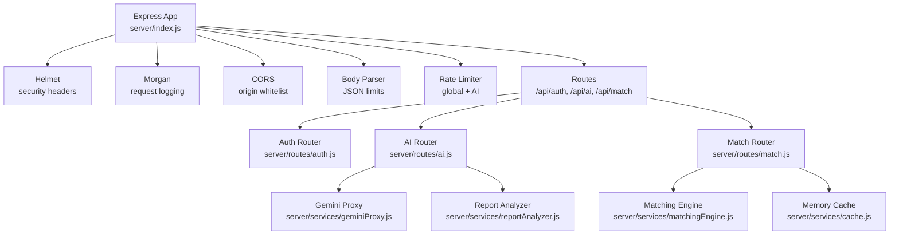
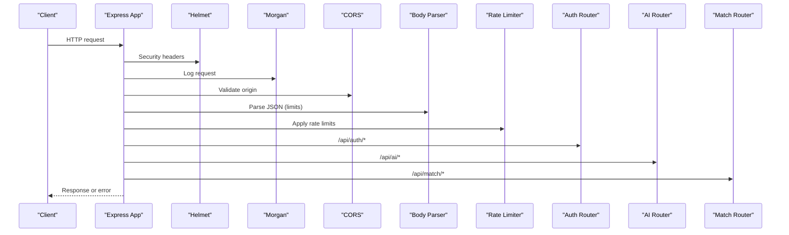
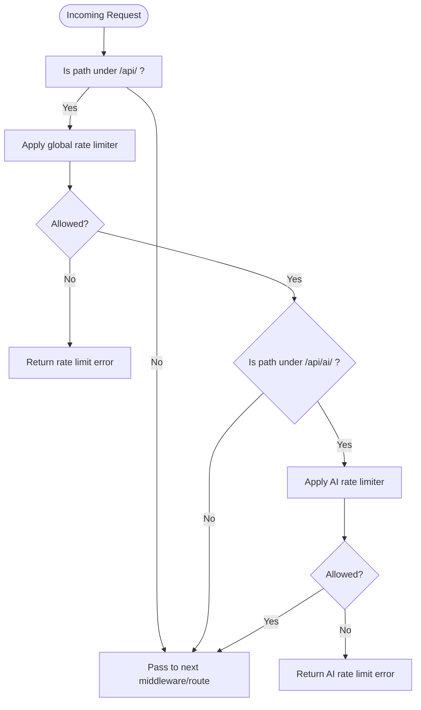
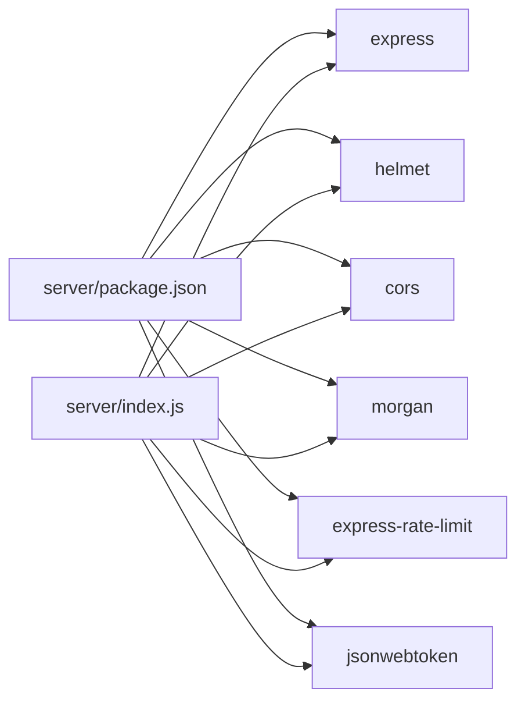

# API Server Setup

<cite>
**Referenced Files in This Document**
- [server/index.js](file://server/index.js)
- [server/config.js](file://server/config.js)
- [server/package.json](file://server/package.json)
- [server/middleware/auth.js](file://server/middleware/auth.js)
- [server/middleware/validate.js](file://server/middleware/validate.js)
- [server/routes/auth.js](file://server/routes/auth.js)
- [server/routes/ai.js](file://server/routes/ai.js)
- [server/routes/match.js](file://server/routes/match.js)
- [server/services/geminiProxy.js](file://server/services/geminiProxy.js)
- [server/services/reportAnalyzer.js](file://server/services/reportAnalyzer.js)
- [server/services/matchingEngine.js](file://server/services/matchingEngine.js)
- [server/services/cache.js](file://server/services/cache.js)
- [server/incidentAiService.js](file://server/incidentAiService.js)
</cite>

## Table of Contents
1. [Introduction](#introduction)
2. [Project Structure](#project-structure)
3. [Core Components](#core-components)
4. [Architecture Overview](#architecture-overview)
5. [Detailed Component Analysis](#detailed-component-analysis)
6. [Dependency Analysis](#dependency-analysis)
7. [Performance Considerations](#performance-considerations)
8. [Troubleshooting Guide](#troubleshooting-guide)
9. [Conclusion](#conclusion)
10. [Appendices](#appendices)

## Introduction
This document explains the Express.js API server setup and configuration. It covers server initialization, middleware stack, security headers with Helmet, request logging with Morgan, CORS configuration, body parsing, rate limiting (global and AI-specific), health checks, error handling, environment variable management, port configuration, and startup logging. It also addresses production deployment considerations and security best practices.

## Project Structure
The server is organized around a modular Express application with dedicated folders for middleware, routes, and services. Configuration is centralized in a single config module that reads from environment variables. The server exposes public and protected endpoints under /api.

**Diagram sources**
- [server/index.js:16-118](file://server/index.js#L16-L118)
- [server/routes/auth.js:1-83](file://server/routes/auth.js#L1-L83)
- [server/routes/ai.js:1-348](file://server/routes/ai.js#L1-L348)
- [server/routes/match.js:1-120](file://server/routes/match.js#L1-L120)
- [server/services/geminiProxy.js:1-104](file://server/services/geminiProxy.js#L1-L104)
- [server/services/reportAnalyzer.js:1-542](file://server/services/reportAnalyzer.js#L1-L542)
- [server/services/matchingEngine.js:1-212](file://server/services/matchingEngine.js#L1-L212)
- [server/services/cache.js:1-66](file://server/services/cache.js#L1-L66)

**Section sources**
- [server/index.js:16-118](file://server/index.js#L16-L118)
- [server/package.json:1-18](file://server/package.json#L1-L18)

## Core Components
- Server initialization and middleware stack: Helmet, Morgan, CORS, body parsing, rate limiting, routes, health check, 404 fallback, and global error handler.
- Environment-driven configuration for ports, AI providers, JWT, rate limits, CORS origin, and cache tuning.
- Route modules for authentication, AI endpoints, and matching engine with shared middleware for auth and input validation.
- Supporting services for Gemini proxy, report analysis, matching engine, and in-memory cache.

**Section sources**
- [server/index.js:16-118](file://server/index.js#L16-L118)
- [server/config.js:1-35](file://server/config.js#L1-L35)
- [server/package.json:1-18](file://server/package.json#L1-L18)

## Architecture Overview
The server follows a layered architecture:
- Entry point initializes Express and mounts middleware and routes.
- Middleware enforces security, logging, CORS, body parsing, and rate limiting.
- Routes delegate to service modules for business logic.
- Services encapsulate external integrations (Gemini) and internal algorithms (matching, reporting).

**Diagram sources**
- [server/index.js:28-118](file://server/index.js#L28-L118)
- [server/routes/auth.js:1-83](file://server/routes/auth.js#L1-L83)
- [server/routes/ai.js:1-348](file://server/routes/ai.js#L1-L348)
- [server/routes/match.js:1-120](file://server/routes/match.js#L1-L120)

## Detailed Component Analysis

### Server Initialization and Middleware Stack
- Security headers: Helmet is mounted globally to apply secure defaults.
- Request logging: Morgan logs combined format including date, method, URL, status, response time, and remote address.
- CORS: Origin whitelist, credentials, allowed methods, and headers are configured from environment.
- Body parsing: Global JSON limit; AI routes increase limit for file uploads.
- Rate limiting: Global limiter applies to /api/; AI limiter applies to /api/ai/ with stricter max.
- Routes: Mount auth, AI, and match routers under /api.
- Health check: GET /api/health returns status, uptime, timestamp, Gemini configuration, and version.
- 404 fallback: Any unmatched /api/* returns a not-found error.
- Global error handler: Logs fatal errors and returns JSON with stack in non-production environments.

**Section sources**
- [server/index.js:28-118](file://server/index.js#L28-L118)

### Security Headers with Helmet
Helmet is used to set multiple security-related headers to mitigate common vulnerabilities (e.g., XSS, clickjacking, MIME sniffing). It is mounted before other middleware to ensure headers are applied consistently.

**Section sources**
- [server/index.js:29-31](file://server/index.js#L29-L31)

### Request Logging with Morgan
Morgan logs requests in a combined format that includes ISO date, HTTP method, URL, status code, response time, and remote address. This aids in monitoring and debugging.

**Section sources**
- [server/index.js:34-35](file://server/index.js#L34-L35)

### CORS Configuration
CORS is configured with:
- origin: Read from environment variable.
- credentials: Enabled.
- methods: GET, POST, PUT, DELETE, OPTIONS.
- allowedHeaders: Content-Type, Authorization.

**Section sources**
- [server/index.js:38-43](file://server/index.js#L38-L43)
- [server/config.js:27](file://server/config.js#L27)

### Body Parsing Setup
- Global JSON limit: 1 MB.
- AI routes: Increase limit to 10 MB for file uploads.

**Section sources**
- [server/index.js:47](file://server/index.js#L47)
- [server/index.js:71](file://server/index.js#L71)

### Rate Limiting Strategy
- Global limiter:
  - Window: Read from environment (default 15 minutes).
  - Max requests: Read from environment (default 100).
  - Headers: Standard headers enabled, legacy disabled.
  - Message: Human-readable error.
  - Key generator: Uses IP or forwarded-for header.
- AI limiter:
  - Same window as global.
  - Max requests: Read from environment (default 20).
  - Stricter enforcement for expensive AI operations.

**Diagram sources**
- [server/index.js:50-68](file://server/index.js#L50-L68)
- [server/config.js:22-24](file://server/config.js#L22-L24)

**Section sources**
- [server/index.js:50-68](file://server/index.js#L50-L68)
- [server/config.js:22-24](file://server/config.js#L22-L24)

### Health Check Endpoint
GET /api/health returns:
- status: ok
- uptime: seconds since process started
- timestamp: ISO string
- geminiConfigured: boolean based on API key presence
- version: server version

Startup logs print the health endpoint and example endpoints, plus Gemini configuration status.

**Section sources**
- [server/index.js:79-87](file://server/index.js#L79-L87)
- [server/index.js:104-117](file://server/index.js#L104-L117)

### Error Handling Patterns
- 404 fallback: Any unmatched /api/* returns a not-found error.
- Global error handler: Logs fatal errors and returns JSON; in non-production, includes stack trace.

**Section sources**
- [server/index.js:89-101](file://server/index.js#L89-L101)

### Environment Variable Management and Port Configuration
- PORT: Defaults to 8787 if not set.
- AI providers: GEMINI_API_KEY, GEMINI_MODEL, OPENAI_API_KEY, OPENAI_MODEL.
- Auth: JWT_SECRET, JWT_EXPIRES_IN.
- Rate limits: RATE_LIMIT_WINDOW_MS, RATE_LIMIT_MAX, AI_RATE_LIMIT_MAX.
- CORS: CORS_ORIGIN.
- Cache: MATCH_CACHE_TTL_MS, MATCH_CACHE_MAX_SIZE.

**Section sources**
- [server/config.js:9-32](file://server/config.js#L9-L32)

### Startup Logging
On startup, the server logs:
- Running URL and port.
- Available endpoints.
- Gemini configuration status.

**Section sources**
- [server/index.js:104-117](file://server/index.js#L104-L117)

### Authentication Middleware
- requireAuth validates Authorization: Bearer <token>.
- On success, attaches decoded JWT payload to req.user.
- On failure, returns 401 with appropriate messages.
- signToken generates signed JWT with configured secret and expiry.

**Section sources**
- [server/middleware/auth.js:14-48](file://server/middleware/auth.js#L14-L48)

### Input Validation Middleware
- sanitizeBody: Deep sanitization of request bodies to remove XSS vectors and control characters.
- validateBody(schema): Validates fields against reusable validators (required, isString, isArray, isObject).

**Section sources**
- [server/middleware/validate.js:36-80](file://server/middleware/validate.js#L36-L80)

### Authentication Routes (/api/auth)
- POST /api/auth/login: Validates credentials and returns signed token and account info.
- POST /api/auth/register: Creates a new account and returns token.

**Section sources**
- [server/routes/auth.js:34-80](file://server/routes/auth.js#L34-L80)

### AI Routes (/api/ai)
- POST /api/ai/parse-document: Secure proxy to Gemini for document parsing; requires auth; 10 MB body limit.
- POST /api/ai/incident-analyze: Analyzes incident reports; supports provider selection.
- POST /api/ai/chat: Generates structured response using Gemini; requires GEMINI_API_KEY.
- POST /api/ai/explain-match: Natural-language explanation of volunteer-task match quality.
- POST /api/ai/analyze-report: Extracts structured needs from reports; supports LLM or keyword fallback.
- POST /api/ai/analyze-reports-batch: Batch processing with validation and limits.

**Section sources**
- [server/routes/ai.js:30-345](file://server/routes/ai.js#L30-L345)

### Matching Engine Routes (/api/match)
- POST /api/match/: ranks volunteers for a task; caches results; supports region filtering.
- POST /api/match/recommend: batch recommendations for multiple tasks.
- GET /api/match/cache-stats: returns cache metrics.

**Section sources**
- [server/routes/match.js:33-117](file://server/routes/match.js#L33-L117)

### Supporting Services

#### Gemini Proxy
- parseDocument: Calls Gemini with system prompt and file content; returns structured needs; throws on missing API key.

**Section sources**
- [server/services/geminiProxy.js:53-103](file://server/services/geminiProxy.js#L53-L103)

#### Report Analyzer
- analyzeReport: Attempts LLM extraction; falls back to keyword-based extraction; validates and normalizes results.
- analyzeReportsBatch: Processes multiple reports concurrently with error handling.

**Section sources**
- [server/services/reportAnalyzer.js:472-536](file://server/services/reportAnalyzer.js#L472-L536)

#### Matching Engine
- rankVolunteersForTask: Scores volunteers using skill, distance, availability, experience, and performance; supports region filtering.
- generateRecommendations: Produces recommendations for multiple tasks.

**Section sources**
- [server/services/matchingEngine.js:166-211](file://server/services/matchingEngine.js#L166-L211)

#### Memory Cache
- MemoryCache: LRU cache with TTL eviction; tracks hits/misses; exposes stats for monitoring.

**Section sources**
- [server/services/cache.js:10-65](file://server/services/cache.js#L10-L65)

#### Incident AI Service
- analyzeIncidentReport: Multi-provider analysis with fallback heuristics; cleans JSON payloads and normalizes results.

**Section sources**
- [server/incidentAiService.js:170-188](file://server/incidentAiService.js#L170-L188)

## Dependency Analysis
The server depends on:
- express, helmet, cors, morgan, express-rate-limit, jsonwebtoken.

**Diagram sources**
- [server/package.json:9-16](file://server/package.json#L9-L16)
- [server/index.js:16-24](file://server/index.js#L16-L24)

**Section sources**
- [server/package.json:1-18](file://server/package.json#L1-L18)
- [server/index.js:16-24](file://server/index.js#L16-L24)

## Performance Considerations
- Rate limiting: Use strict AI limits to protect expensive operations; tune windows and max values per environment.
- Body size limits: Keep global limits reasonable; increase selectively for AI routes.
- Caching: Use MemoryCache for match results; monitor hit rates; consider Redis for production scale.
- Algorithmic efficiency: Region filtering reduces compute for large volunteer pools.
- Logging overhead: Morgan combined format is informative but can be adjusted for high-throughput environments.

[No sources needed since this section provides general guidance]

## Troubleshooting Guide
- Health check fails or returns not ok: Verify server startup logs and environment configuration.
- Authentication errors: Ensure Authorization header includes a valid Bearer token; confirm JWT secret and expiration.
- Rate limit exceeded: Adjust RATE_LIMIT_MAX or AI_RATE_LIMIT_MAX; review windowMs; consider per-user keys.
- CORS errors: Confirm CORS_ORIGIN matches the client origin; ensure credentials are enabled when needed.
- AI endpoints failing: Verify GEMINI_API_KEY is set; check model name and quota.
- 404 endpoints: Confirm route paths and that middleware order is correct.

**Section sources**
- [server/index.js:79-101](file://server/index.js#L79-L101)
- [server/middleware/auth.js:14-37](file://server/middleware/auth.js#L14-L37)
- [server/config.js:22-24](file://server/config.js#L22-L24)
- [server/config.js:12-15](file://server/config.js#L12-L15)

## Conclusion
The server is configured as a production-grade Express application with robust middleware, security headers, logging, CORS, body parsing, and rate limiting. It exposes clear API endpoints for authentication, AI capabilities, and matching, backed by modular services and caching. Proper environment management and careful tuning of rate limits and body sizes ensure reliability and performance.

[No sources needed since this section summarizes without analyzing specific files]

## Appendices

### Environment Variables Reference
- PORT: Server port (default 8787)
- GEMINI_API_KEY: Gemini API key
- GEMINI_MODEL: Gemini model name
- OPENAI_API_KEY: OpenAI API key
- OPENAI_MODEL: OpenAI model name
- JWT_SECRET: Secret for signing JWT tokens
- JWT_EXPIRES_IN: Token expiry (default 8h)
- RATE_LIMIT_WINDOW_MS: Rate limit window in milliseconds (default 15 minutes)
- RATE_LIMIT_MAX: Global rate limit max (default 100)
- AI_RATE_LIMIT_MAX: AI-specific rate limit max (default 20)
- CORS_ORIGIN: Allowed origin for CORS (default http://localhost:5173)
- MATCH_CACHE_TTL_MS: Cache TTL in milliseconds (default 5 minutes)
- MATCH_CACHE_MAX_SIZE: Maximum cache entries (default 500)

**Section sources**
- [server/config.js:9-32](file://server/config.js#L9-L32)