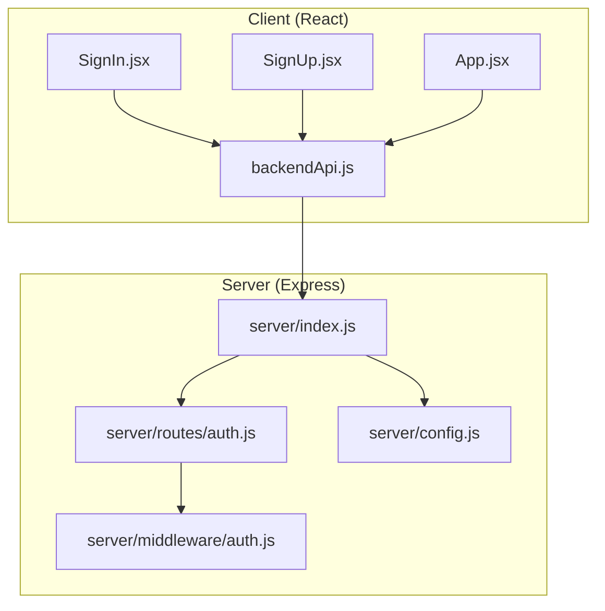
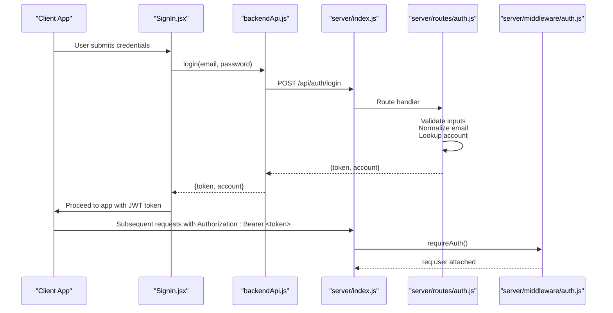
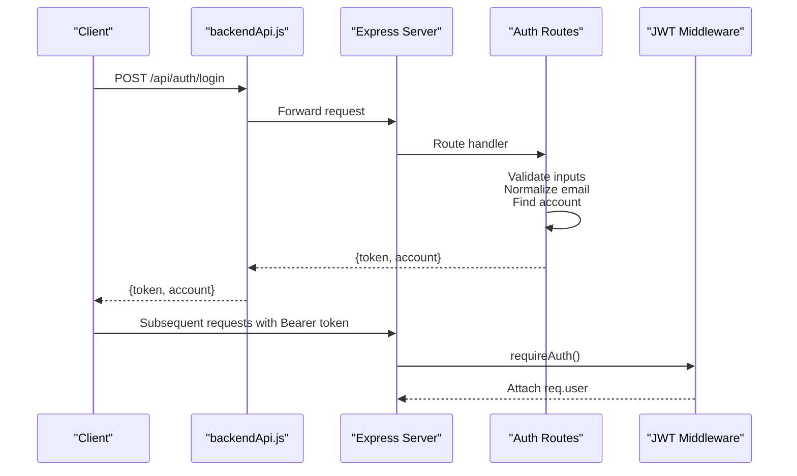
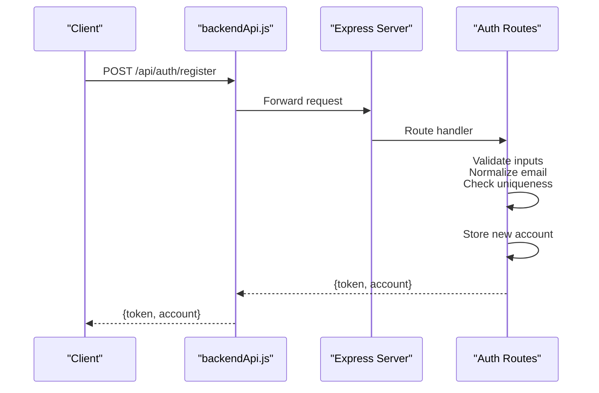
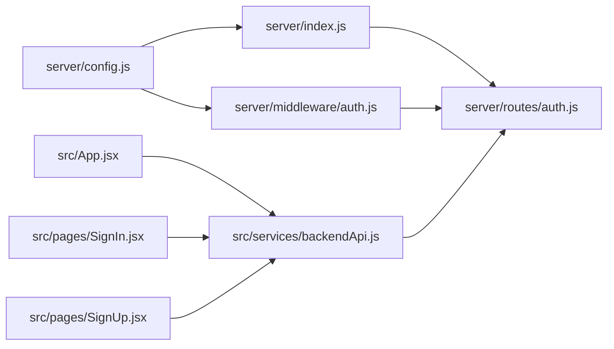

# Authentication Routes

<cite>
**Referenced Files in This Document**
- [server/index.js](file://server/index.js)
- [server/config.js](file://server/config.js)
- [server/routes/auth.js](file://server/routes/auth.js)
- [server/middleware/auth.js](file://server/middleware/auth.js)
- [server/middleware/validate.js](file://server/middleware/validate.js)
- [src/services/backendApi.js](file://src/services/backendApi.js)
- [src/App.jsx](file://src/App.jsx)
- [src/pages/SignIn.jsx](file://src/pages/SignIn.jsx)
- [src/pages/SignUp.jsx](file://src/pages/SignUp.jsx)
- [src/services/api.js](file://src/services/api.js)
- [server/test/api-test-report.http](file://server/test/api-test-report.http)
</cite>

## Table of Contents
1. [Introduction](#introduction)
2. [Project Structure](#project-structure)
3. [Core Components](#core-components)
4. [Architecture Overview](#architecture-overview)
5. [Detailed Component Analysis](#detailed-component-analysis)
6. [Dependency Analysis](#dependency-analysis)
7. [Performance Considerations](#performance-considerations)
8. [Troubleshooting Guide](#troubleshooting-guide)
9. [Conclusion](#conclusion)
10. [Appendices](#appendices)

## Introduction
This document provides comprehensive documentation for the authentication API endpoints powering the NeedLink AI platform. It covers:
- Login and registration routes, including request/response schemas, validation, and error handling
- The demo account system and dynamic account registration mechanism
- Account lookup logic, email normalization, and security considerations for credential storage
- Practical examples of API requests and responses, error scenarios, and integration patterns
- The temporary nature of demo accounts and migration path to production database integration

## Project Structure
The authentication system spans the server (Express) and the client (React). The server exposes two primary endpoints under /api/auth, protected by JWT middleware and rate limits. The client integrates with the backend via a thin HTTP client and orchestrates login/registration flows.

**Diagram sources**
- [server/index.js:1-118](file://server/index.js#L1-L118)
- [server/routes/auth.js:1-83](file://server/routes/auth.js#L1-L83)
- [server/middleware/auth.js:1-49](file://server/middleware/auth.js#L1-L49)
- [server/config.js:1-35](file://server/config.js#L1-L35)
- [src/services/backendApi.js:1-164](file://src/services/backendApi.js#L1-L164)
- [src/pages/SignIn.jsx:1-178](file://src/pages/SignIn.jsx#L1-L178)
- [src/pages/SignUp.jsx:1-194](file://src/pages/SignUp.jsx#L1-L194)
- [src/App.jsx:166-180](file://src/App.jsx#L166-L180)

**Section sources**
- [server/index.js:1-118](file://server/index.js#L1-L118)
- [server/routes/auth.js:1-83](file://server/routes/auth.js#L1-L83)
- [server/middleware/auth.js:1-49](file://server/middleware/auth.js#L1-L49)
- [server/config.js:1-35](file://server/config.js#L1-L35)
- [src/services/backendApi.js:1-164](file://src/services/backendApi.js#L1-L164)
- [src/pages/SignIn.jsx:1-178](file://src/pages/SignIn.jsx#L1-L178)
- [src/pages/SignUp.jsx:1-194](file://src/pages/SignUp.jsx#L1-L194)
- [src/App.jsx:166-180](file://src/App.jsx#L166-L180)

## Core Components
- Authentication routes (/api/auth/login, /api/auth/register): In-memory demo accounts and dynamic registration
- JWT middleware: Token verification and signing for protected endpoints
- Client backend API: Thin HTTP client managing tokens and calling server endpoints
- Frontend login/registration pages: Orchestrate flows and integrate with backend

Key responsibilities:
- Route handlers validate inputs, normalize emails, and manage in-memory accounts
- JWT middleware enforces Authorization: Bearer tokens for protected routes
- Client stores JWT in session storage and injects Authorization headers

**Section sources**
- [server/routes/auth.js:28-80](file://server/routes/auth.js#L28-L80)
- [server/middleware/auth.js:14-48](file://server/middleware/auth.js#L14-L48)
- [src/services/backendApi.js:56-82](file://src/services/backendApi.js#L56-L82)
- [src/pages/SignIn.jsx:14-22](file://src/pages/SignIn.jsx#L14-L22)
- [src/pages/SignUp.jsx:26-44](file://src/pages/SignUp.jsx#L26-L44)

## Architecture Overview
The authentication flow connects the React frontend to the Express backend. The server applies security middleware, rate limits, and JWT enforcement. The client manages tokens and invokes backend endpoints.

**Diagram sources**
- [src/pages/SignIn.jsx:14-22](file://src/pages/SignIn.jsx#L14-L22)
- [src/services/backendApi.js:63-71](file://src/services/backendApi.js#L63-L71)
- [server/index.js:74-76](file://server/index.js#L74-L76)
- [server/routes/auth.js:34-52](file://server/routes/auth.js#L34-L52)
- [server/middleware/auth.js:14-37](file://server/middleware/auth.js#L14-L37)

## Detailed Component Analysis

### Authentication Routes: POST /api/auth/login
Purpose:
- Authenticate users with email/password and return a signed JWT and account metadata

Request schema:
- Content-Type: application/json
- Body: { email: string, password: string }

Response schema:
- 200 OK: { token: string, account: { email: string, name: string, type: string } }
- 400 Bad Request: { error: string } when missing fields
- 401 Unauthorized: { error: string } when credentials invalid

Behavior:
- Validates presence of email and password
- Normalizes email to lowercase and trims whitespace
- Searches in-memory demo accounts and dynamically registered accounts
- Signs JWT with server secret and expiration policy

Security considerations:
- Credentials are stored in memory without hashing
- JWT secret and expiration are configurable via environment variables
- Rate limiting applies to /api/auth endpoints

Example request:
- POST /api/auth/login
- Body: { "email": "ngo@needlink.org", "password": "ngo123" }

Example successful response:
- 200 OK
- Body: { "token": "<JWT>", "account": { "email": "ngo@needlink.org", "name": "NeedLink Foundation", "type": "Relief NGO" } }

Example error responses:
- 400 Bad Request: { "error": "Email and password are required." }
- 401 Unauthorized: { "error": "Invalid email or password." }

**Section sources**
- [server/routes/auth.js:28-52](file://server/routes/auth.js#L28-L52)
- [server/config.js:17-19](file://server/config.js#L17-L19)
- [server/index.js:49-68](file://server/index.js#L49-L68)

### Authentication Routes: POST /api/auth/register
Purpose:
- Dynamically register new accounts and return a JWT and account metadata

Request schema:
- Content-Type: application/json
- Body: { email: string, password: string, name: string, type?: string }

Response schema:
- 201 Created: { token: string, account: { email: string, name: string, type: string } }
- 400 Bad Request: { error: string } when required fields missing
- 409 Conflict: { error: string } when email already exists

Behavior:
- Validates presence of email, password, and name
- Normalizes email to lowercase and trims whitespace
- Checks uniqueness across demo and dynamic accounts
- Stores new account in memory and signs JWT

Security considerations:
- Same in-memory storage without hashing
- Client-side persistence of accounts via localStorage for demo UX

Example request:
- POST /api/auth/register
- Body: { "email": "contact@myngo.org", "password": "securePass!", "name": "My NGO", "type": "Relief NGO" }

Example successful response:
- 201 Created
- Body: { "token": "<JWT>", "account": { "email": "contact@myngo.org", "name": "My NGO", "type": "Relief NGO" } }

Example error responses:
- 400 Bad Request: { "error": "Email, password, and name are required." }
- 409 Conflict: { "error": "An account with this email already exists." }

**Section sources**
- [server/routes/auth.js:54-80](file://server/routes/auth.js#L54-L80)
- [src/services/api.js:587-598](file://src/services/api.js#L587-L598)

### JWT Authentication Middleware
Purpose:
- Verify Authorization: Bearer <token> headers and attach decoded user payload to req.user

Behavior:
- Extracts token from Authorization header
- Verifies JWT using server secret and expiration policy
- Attaches { email, name, type, iat, exp } to req.user on success
- Returns 401 for missing/invalid/expired tokens

Security considerations:
- Token verification uses server secret from environment
- Expiration enforced by signing logic

Integration:
- Applied to protected routes via requireAuth()

**Section sources**
- [server/middleware/auth.js:14-48](file://server/middleware/auth.js#L14-L48)
- [server/config.js:17-19](file://server/config.js#L17-L19)

### Client-Side Integration
Frontend login flow:
- SignIn.jsx triggers backendApi.login(email, password)
- On success, token is stored and used for subsequent requests
- App.jsx orchestrates navigation and token lifecycle

Frontend registration flow:
- SignUp.jsx validates form locally, normalizes email, and calls backendApi.login after registration
- Dynamic accounts persist in memory for demo

**Section sources**
- [src/pages/SignIn.jsx:14-22](file://src/pages/SignIn.jsx#L14-L22)
- [src/pages/SignUp.jsx:26-44](file://src/pages/SignUp.jsx#L26-L44)
- [src/services/backendApi.js:63-71](file://src/services/backendApi.js#L63-L71)
- [src/App.jsx:166-180](file://src/App.jsx#L166-L180)

### Demo Accounts and Dynamic Registration
Demo accounts:
- Hardcoded in-memory list for demonstration
- Mirrored on the client for convenience

Dynamic registration:
- New accounts appended to in-memory registry
- Persisted in client localStorage for continuity across reloads

Account lookup logic:
- Email normalization: trim, lowercase
- Search order: demo accounts + dynamically registered accounts

Temporary nature:
- Accounts are not persisted to a database
- Suitable for demos and local development only

Migration path:
- Replace in-memory arrays with database-backed lookups
- Hash passwords before storage
- Integrate with Firebase Authentication or similar managed identity service

**Section sources**
- [server/routes/auth.js:11-26](file://server/routes/auth.js#L11-L26)
- [src/services/api.js:567-598](file://src/services/api.js#L567-L598)

### Email Normalization and Validation
Server-side:
- Login route normalizes email before lookup
- Registration route normalizes email before uniqueness check

Client-side:
- Registration page normalizes email before submission
- Additional client-side validation ensures uniqueness and format

Note: The server’s validateBody middleware is available but not applied to auth routes in this codebase.

**Section sources**
- [server/routes/auth.js:67-72](file://server/routes/auth.js#L67-L72)
- [src/pages/SignUp.jsx:33-40](file://src/pages/SignUp.jsx#L33-L40)
- [src/services/api.js:592-598](file://src/services/api.js#L592-L598)

### API Workflow Diagrams

#### Login Flow

**Diagram sources**
- [src/services/backendApi.js:63-71](file://src/services/backendApi.js#L63-L71)
- [server/routes/auth.js:34-52](file://server/routes/auth.js#L34-L52)
- [server/middleware/auth.js:14-37](file://server/middleware/auth.js#L14-L37)

#### Registration Flow

**Diagram sources**
- [src/services/backendApi.js:63-71](file://src/services/backendApi.js#L63-L71)
- [server/routes/auth.js:60-80](file://server/routes/auth.js#L60-L80)

## Dependency Analysis
Authentication depends on:
- JWT signing/verification for token lifecycle
- Environment-configured secrets and expiration
- Rate limiting for abuse prevention
- Client token storage and injection

**Diagram sources**
- [server/config.js:17-19](file://server/config.js#L17-L19)
- [server/middleware/auth.js:42-48](file://server/middleware/auth.js#L42-L48)
- [server/index.js:74-76](file://server/index.js#L74-L76)
- [server/routes/auth.js:1-83](file://server/routes/auth.js#L1-L83)
- [src/services/backendApi.js:56-82](file://src/services/backendApi.js#L56-L82)
- [src/App.jsx:166-180](file://src/App.jsx#L166-L180)
- [src/pages/SignIn.jsx:14-22](file://src/pages/SignIn.jsx#L14-L22)
- [src/pages/SignUp.jsx:26-44](file://src/pages/SignUp.jsx#L26-L44)

**Section sources**
- [server/config.js:17-19](file://server/config.js#L17-L19)
- [server/index.js:49-68](file://server/index.js#L49-L68)
- [server/routes/auth.js:1-83](file://server/routes/auth.js#L1-L83)
- [src/services/backendApi.js:56-82](file://src/services/backendApi.js#L56-L82)

## Performance Considerations
- In-memory account lookup is O(n) across demo + dynamic accounts; consider indexing by normalized email for larger datasets
- JWT signing/verification overhead is minimal; ensure secrets are strong and rotated
- Rate limiting protects endpoints from brute-force attempts
- Client-side token caching reduces redundant logins

## Troubleshooting Guide
Common issues and resolutions:
- 400 Bad Request on login/register: Ensure email, password, and name are provided
- 401 Unauthorized on login: Verify credentials match demo accounts or dynamically registered entries
- 409 Conflict on registration: Change email to a unique value
- 401 Unauthorized on protected routes: Confirm Authorization: Bearer <token> header is present and valid
- Token expired: Re-authenticate to obtain a new token

Operational checks:
- Health endpoint: GET /api/health to verify server status
- Example tests: Use the included HTTP test file to validate flows

**Section sources**
- [server/routes/auth.js:34-80](file://server/routes/auth.js#L34-L80)
- [server/middleware/auth.js:14-37](file://server/middleware/auth.js#L14-L37)
- [server/index.js:79-87](file://server/index.js#L79-L87)
- [server/test/api-test-report.http:7-15](file://server/test/api-test-report.http#L7-L15)

## Conclusion
The authentication system provides a clear, minimal implementation for demo and development environments. It demonstrates JWT-based authentication, in-memory account management, and client integration. For production, replace in-memory storage with a secure database, hash credentials, and integrate with a managed identity solution. Apply robust validation, rate limiting, and environment-driven configuration to ensure security and scalability.

## Appendices

### API Definitions

- POST /api/auth/login
  - Request: { email, password }
  - Responses:
    - 200: { token, account: { email, name, type } }
    - 400: { error }
    - 401: { error }

- POST /api/auth/register
  - Request: { email, password, name, type? }
  - Responses:
    - 201: { token, account: { email, name, type } }
    - 400: { error }
    - 409: { error }

- GET /api/health
  - Public endpoint for liveness checks

**Section sources**
- [server/routes/auth.js:28-80](file://server/routes/auth.js#L28-L80)
- [server/index.js:79-87](file://server/index.js#L79-L87)

### Practical Examples

- Successful login
  - Request: POST /api/auth/login with { "email": "ngo@needlink.org", "password": "ngo123" }
  - Response: 200 with token and account

- Registration
  - Request: POST /api/auth/register with { "email": "contact@myngo.org", "password": "securePass!", "name": "My NGO", "type": "Relief NGO" }
  - Response: 201 with token and account

- Protected request
  - Include Authorization: Bearer <token> header for subsequent requests

- Example test harness
  - Use the included HTTP test file to run login and AI analysis flows

**Section sources**
- [server/test/api-test-report.http:7-15](file://server/test/api-test-report.http#L7-L15)
- [src/services/backendApi.js:63-71](file://src/services/backendApi.js#L63-L71)