# Authentication System

<cite>
**Referenced Files in This Document**
- [auth.js](file://server/middleware/auth.js)
- [validate.js](file://server/middleware/validate.js)
- [auth.js](file://server/routes/auth.js)
- [ai.js](file://server/routes/ai.js)
- [match.js](file://server/routes/match.js)
- [index.js](file://server/index.js)
- [config.js](file://server/config.js)
- [backendApi.js](file://src/services/backendApi.js)
- [App.jsx](file://src/App.jsx)
- [SignIn.jsx](file://src/pages/SignIn.jsx)
- [SignUp.jsx](file://src/pages/SignUp.jsx)
- [api.js](file://src/services/api.js)
- [firestore.rules](file://firestore.rules)
</cite>

## Table of Contents
1. [Introduction](#introduction)
2. [Project Structure](#project-structure)
3. [Core Components](#core-components)
4. [Architecture Overview](#architecture-overview)
5. [Detailed Component Analysis](#detailed-component-analysis)
6. [Dependency Analysis](#dependency-analysis)
7. [Performance Considerations](#performance-considerations)
8. [Troubleshooting Guide](#troubleshooting-guide)
9. [Conclusion](#conclusion)

## Introduction
This document explains the authentication and authorization system powering the NeedLink portal. It covers JWT-based authentication, user registration and login flows, session management, middleware protection, input validation, and security measures. It also details token usage patterns, logout functionality, and how the system enforces access control across protected routes.

## Project Structure
The authentication system spans the server (Express) and the client (React). The server exposes authentication endpoints, applies middleware to protect routes, and manages configuration. The client handles login/logout, stores tokens securely, and forwards tokens to the backend.

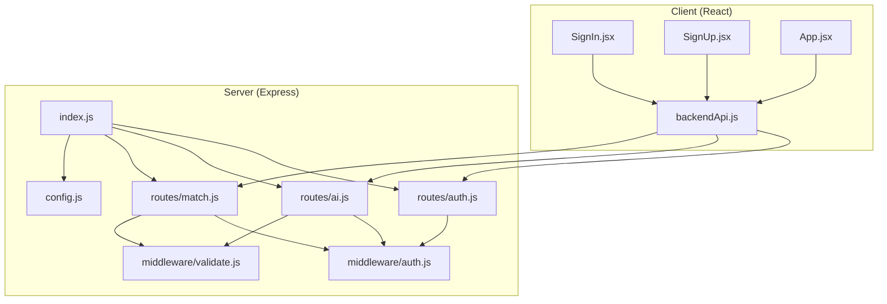

**Diagram sources**
- [index.js:1-118](file://server/index.js#L1-L118)
- [auth.js:1-83](file://server/routes/auth.js#L1-L83)
- [ai.js:1-348](file://server/routes/ai.js#L1-L348)
- [match.js:1-120](file://server/routes/match.js#L1-L120)
- [auth.js:1-49](file://server/middleware/auth.js#L1-L49)
- [validate.js:1-80](file://server/middleware/validate.js#L1-L80)
- [config.js:1-35](file://server/config.js#L1-L35)
- [backendApi.js:1-164](file://src/services/backendApi.js#L1-L164)
- [App.jsx:166-193](file://src/App.jsx#L166-L193)

**Section sources**
- [index.js:1-118](file://server/index.js#L1-L118)
- [auth.js:1-83](file://server/routes/auth.js#L1-L83)
- [ai.js:1-348](file://server/routes/ai.js#L1-L348)
- [match.js:1-120](file://server/routes/match.js#L1-L120)
- [auth.js:1-49](file://server/middleware/auth.js#L1-L49)
- [validate.js:1-80](file://server/middleware/validate.js#L1-L80)
- [config.js:1-35](file://server/config.js#L1-L35)
- [backendApi.js:1-164](file://src/services/backendApi.js#L1-L164)
- [App.jsx:166-193](file://src/App.jsx#L166-L193)

## Core Components
- JWT authentication middleware: validates Authorization headers and decodes tokens.
- Token signing utility: creates signed JWTs with expiration.
- Authentication routes: login and register endpoints returning tokens.
- Input validation middleware: sanitizes and validates request bodies.
- Client token manager: persists tokens in sessionStorage and attaches them to requests.
- Route protection: requireAuth applied to protected endpoints.

Key behaviors:
- Tokens are attached to outgoing requests via Authorization: Bearer headers.
- Protected routes enforce authentication and attach decoded user info to req.user.
- Validation middleware sanitizes input and enforces schema-based validation.

**Section sources**
- [auth.js:14-48](file://server/middleware/auth.js#L14-L48)
- [auth.js:34-80](file://server/routes/auth.js#L34-L80)
- [validate.js:36-80](file://server/middleware/validate.js#L36-L80)
- [backendApi.js:33-54](file://src/services/backendApi.js#L33-L54)

## Architecture Overview
The system uses bearer token authentication. On login, the client receives a JWT and stores it. Subsequent requests include the token in the Authorization header. Server middleware verifies the token and attaches user claims to the request. Protected routes use these claims for access control.

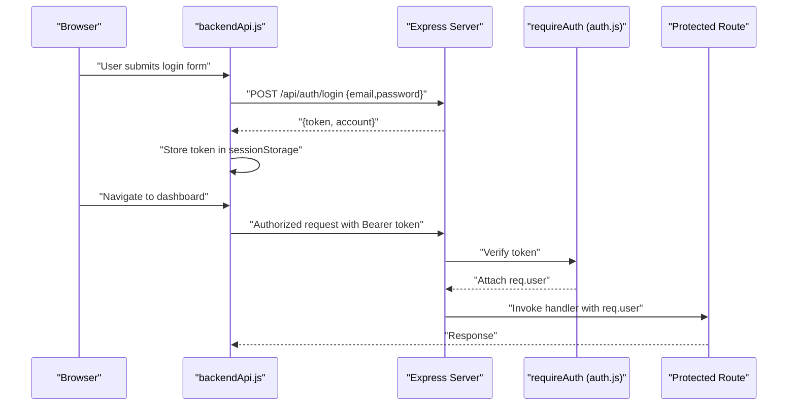

**Diagram sources**
- [auth.js:34-52](file://server/routes/auth.js#L34-L52)
- [auth.js:14-37](file://server/middleware/auth.js#L14-L37)
- [backendApi.js:33-71](file://src/services/backendApi.js#L33-L71)
- [ai.js:30-50](file://server/routes/ai.js#L30-L50)

**Section sources**
- [auth.js:34-52](file://server/routes/auth.js#L34-L52)
- [auth.js:14-37](file://server/middleware/auth.js#L14-L37)
- [backendApi.js:33-71](file://src/services/backendApi.js#L33-L71)
- [ai.js:30-50](file://server/routes/ai.js#L30-L50)

## Detailed Component Analysis

### JWT Authentication Middleware
The middleware validates the Authorization header and verifies the JWT signature. On success, it attaches decoded user claims to req.user. On failure, it returns appropriate 401 responses.

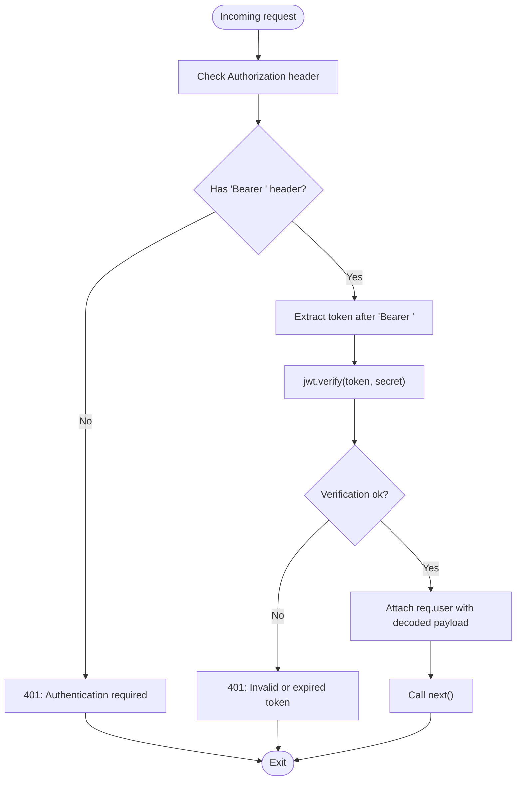

**Diagram sources**
- [auth.js:14-37](file://server/middleware/auth.js#L14-L37)

**Section sources**
- [auth.js:14-37](file://server/middleware/auth.js#L14-L37)

### Token Signing Utility
The signing function creates a JWT containing user identity and sets an expiration. Expiration is configurable via environment variables.

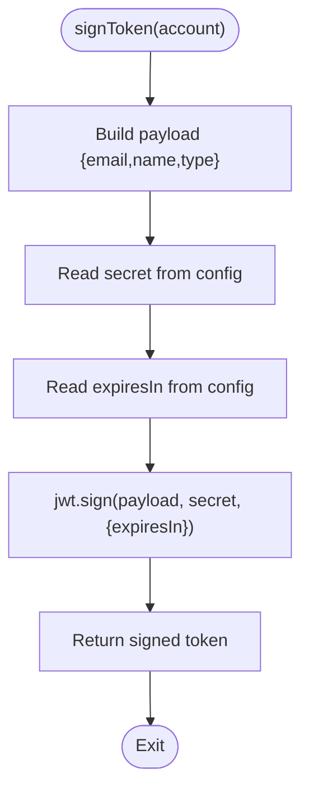

**Diagram sources**
- [auth.js:42-48](file://server/middleware/auth.js#L42-L48)
- [config.js:17-19](file://server/config.js#L17-L19)

**Section sources**
- [auth.js:42-48](file://server/middleware/auth.js#L42-L48)
- [config.js:17-19](file://server/config.js#L17-L19)

### Authentication Routes: Login and Registration
- Login: Validates presence of email/password, finds matching account, signs token, returns token and account.
- Register: Validates required fields, ensures unique email, creates account, signs token, returns token and account.

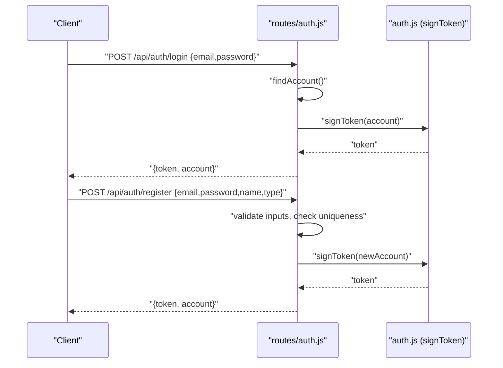

**Diagram sources**
- [auth.js:34-80](file://server/routes/auth.js#L34-L80)
- [auth.js:42-48](file://server/middleware/auth.js#L42-L48)

**Section sources**
- [auth.js:34-80](file://server/routes/auth.js#L34-L80)
- [auth.js:42-48](file://server/middleware/auth.js#L42-L48)

### Protected Routes and Middleware Usage
- AI routes (/api/ai/*): requireAuth, plus input sanitization and schema validation.
- Matching routes (/api/match/*): requireAuth, plus input sanitization and schema validation.
- Cache stats endpoint: requiresAuth for monitoring.

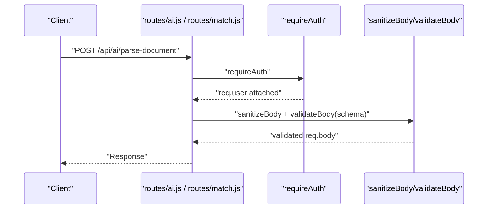

**Diagram sources**
- [ai.js:30-50](file://server/routes/ai.js#L30-L50)
- [match.js:33-76](file://server/routes/match.js#L33-L76)
- [auth.js:14-37](file://server/middleware/auth.js#L14-L37)
- [validate.js:36-62](file://server/middleware/validate.js#L36-L62)

**Section sources**
- [ai.js:30-50](file://server/routes/ai.js#L30-L50)
- [match.js:33-76](file://server/routes/match.js#L33-L76)
- [validate.js:36-62](file://server/middleware/validate.js#L36-L62)

### Input Validation and Sanitization
- Sanitization removes common XSS vectors and control characters, trims strings, and recursively sanitizes nested objects.
- Validation factory enforces a schema: each field is validated by a validator function; on failure, returns structured errors.

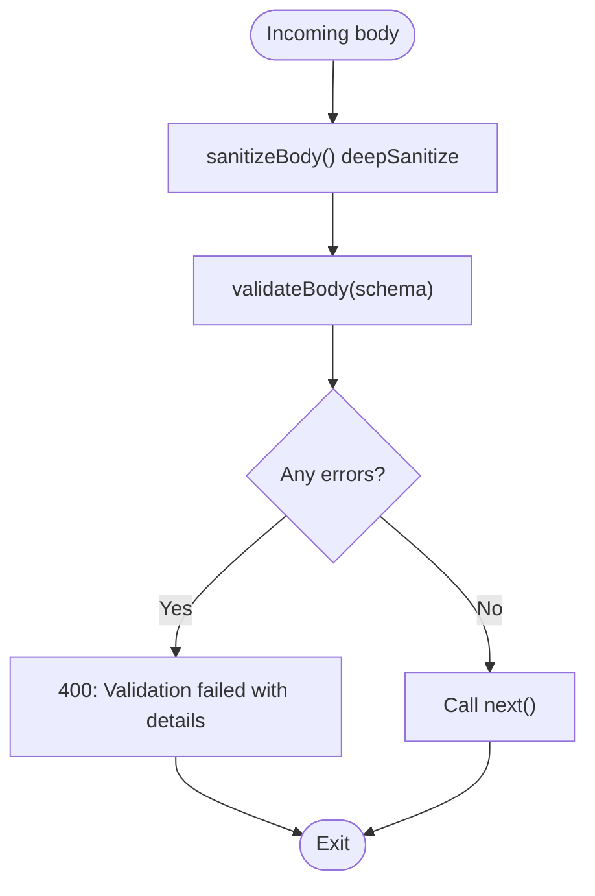

**Diagram sources**
- [validate.js:11-62](file://server/middleware/validate.js#L11-L62)

**Section sources**
- [validate.js:11-62](file://server/middleware/validate.js#L11-L62)

### Client-Side Session Management
- Token persistence: sessionStorage under a fixed key.
- Request augmentation: automatically adds Authorization: Bearer header when a token exists.
- Login: calls backend login, stores token, and proceeds to dashboard.
- Logout: clears stored token and resets state.

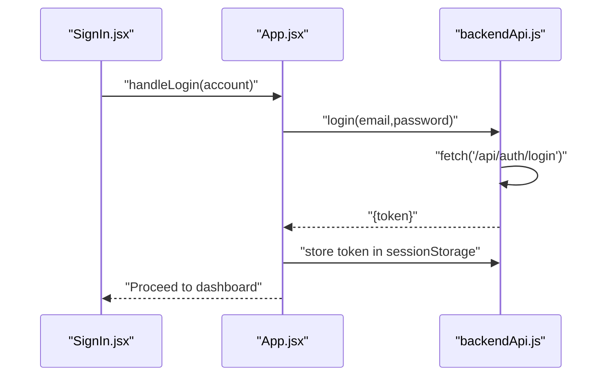

**Diagram sources**
- [SignIn.jsx:14-22](file://src/pages/SignIn.jsx#L14-L22)
- [App.jsx:166-180](file://src/App.jsx#L166-L180)
- [backendApi.js:33-71](file://src/services/backendApi.js#L33-L71)

**Section sources**
- [backendApi.js:19-82](file://src/services/backendApi.js#L19-L82)
- [App.jsx:166-193](file://src/App.jsx#L166-L193)
- [SignIn.jsx:14-22](file://src/pages/SignIn.jsx#L14-L22)

### Access Control Patterns and Roles
- User roles are embedded in the JWT payload (e.g., Relief NGO, Health NGO, Disaster Relief, Super Admin).
- Role enforcement is not implemented in middleware; routes rely on authentication only.
- For role-based access control, add role checks in middleware or route handlers.

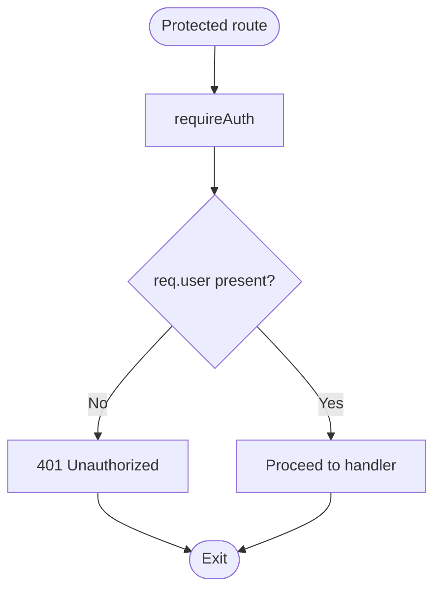

**Diagram sources**
- [auth.js:14-37](file://server/middleware/auth.js#L14-L37)

**Section sources**
- [auth.js:14-37](file://server/middleware/auth.js#L14-L37)

### Token Refresh Strategies
- No built-in refresh mechanism exists. Tokens are signed with an expiration and must be re-issued upon login.
- Recommendation: implement short-lived access tokens with a separate long-lived refresh token stored securely (e.g., httpOnly cookie) to minimize exposure.

[No sources needed since this section provides general guidance]

### Logout Functionality
- Client logout clears the stored token and resets application state.
- Backend does not maintain a blacklist; logout is effective only for the current session.

**Section sources**
- [backendApi.js:73-82](file://src/services/backendApi.js#L73-L82)
- [App.jsx:182-193](file://src/App.jsx#L182-L193)

### Security Measures
- Helmet: sets secure headers to mitigate common web vulnerabilities.
- CORS: restricts origins and methods, enabling credentials.
- Rate limiting: global and stricter limits for AI endpoints.
- Input sanitization and validation: reduces injection risks.
- Environment-driven configuration: secrets and tunables from process.env.
- Firestore rules: enforce per-user isolation and authentication.

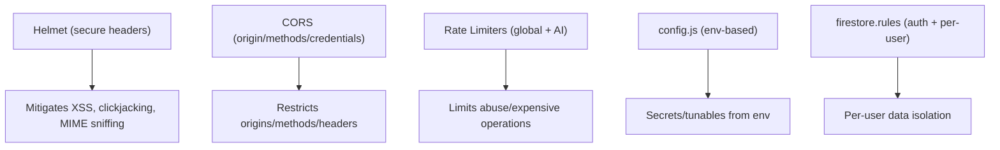

**Diagram sources**
- [index.js:28-71](file://server/index.js#L28-L71)
- [config.js:1-35](file://server/config.js#L1-L35)
- [firestore.rules:1-18](file://firestore.rules#L1-L18)

**Section sources**
- [index.js:28-71](file://server/index.js#L28-L71)
- [config.js:1-35](file://server/config.js#L1-L35)
- [firestore.rules:1-18](file://firestore.rules#L1-L18)

## Dependency Analysis
The authentication system composes several modules with clear boundaries:

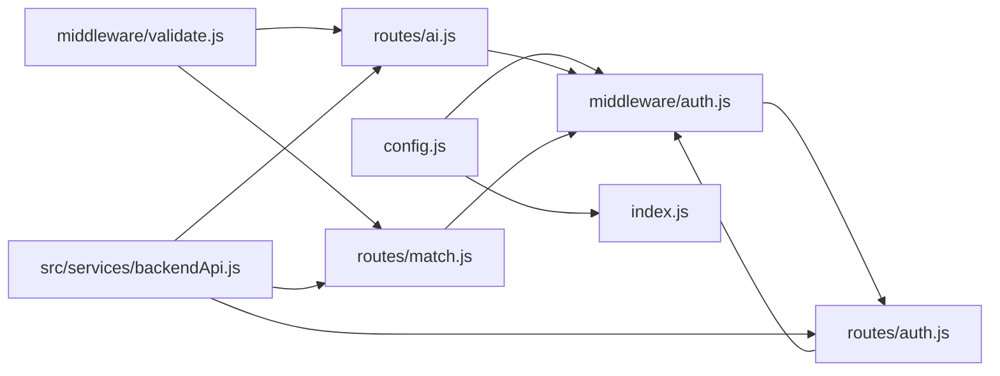

**Diagram sources**
- [config.js:1-35](file://server/config.js#L1-L35)
- [auth.js:1-49](file://server/middleware/auth.js#L1-L49)
- [auth.js:1-83](file://server/routes/auth.js#L1-L83)
- [validate.js:1-80](file://server/middleware/validate.js#L1-L80)
- [ai.js:1-348](file://server/routes/ai.js#L1-L348)
- [match.js:1-120](file://server/routes/match.js#L1-L120)
- [index.js:1-118](file://server/index.js#L1-L118)
- [backendApi.js:1-164](file://src/services/backendApi.js#L1-L164)

**Section sources**
- [index.js:1-118](file://server/index.js#L1-L118)
- [auth.js:1-49](file://server/middleware/auth.js#L1-L49)
- [auth.js:1-83](file://server/routes/auth.js#L1-L83)
- [validate.js:1-80](file://server/middleware/validate.js#L1-L80)
- [ai.js:1-348](file://server/routes/ai.js#L1-L348)
- [match.js:1-120](file://server/routes/match.js#L1-L120)
- [backendApi.js:1-164](file://src/services/backendApi.js#L1-L164)

## Performance Considerations
- Token verification is lightweight; keep jwtSecret strong and avoid excessive middleware overhead.
- Use rate limits judiciously to protect expensive endpoints (AI routes).
- Consider caching validated user claims per request to reduce repeated decoding work.

[No sources needed since this section provides general guidance]

## Troubleshooting Guide
Common issues and resolutions:
- 401 Authentication required: ensure Authorization header includes Bearer token.
- 401 Invalid or expired token: re-authenticate to obtain a new token.
- 400 Validation failed: review request body against schema; ensure sanitized inputs meet constraints.
- 404 Endpoint not found: verify endpoint path and that routes are mounted under /api/.

Operational checks:
- Confirm JWT secret and expiration are set via environment variables.
- Verify CORS origin and credentials configuration.
- Ensure rate limit thresholds are appropriate for workload.

**Section sources**
- [auth.js:17-36](file://server/middleware/auth.js#L17-L36)
- [validate.js:48-62](file://server/middleware/validate.js#L48-L62)
- [index.js:49-92](file://server/index.js#L49-L92)
- [config.js:17-27](file://server/config.js#L17-L27)

## Conclusion
The authentication system provides a robust foundation with JWT-based bearer tokens, middleware-driven protection, and client-side token management. While role-based access control is not currently enforced, the architecture supports easy extension. Security is strengthened by Helmet, CORS, rate limiting, input sanitization, and environment-driven configuration. For production hardening, consider implementing token refresh, secure storage for refresh tokens, and explicit role checks.