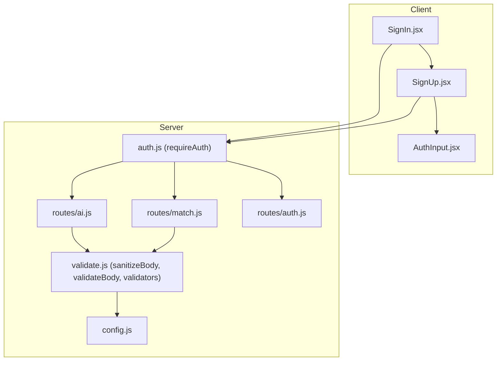
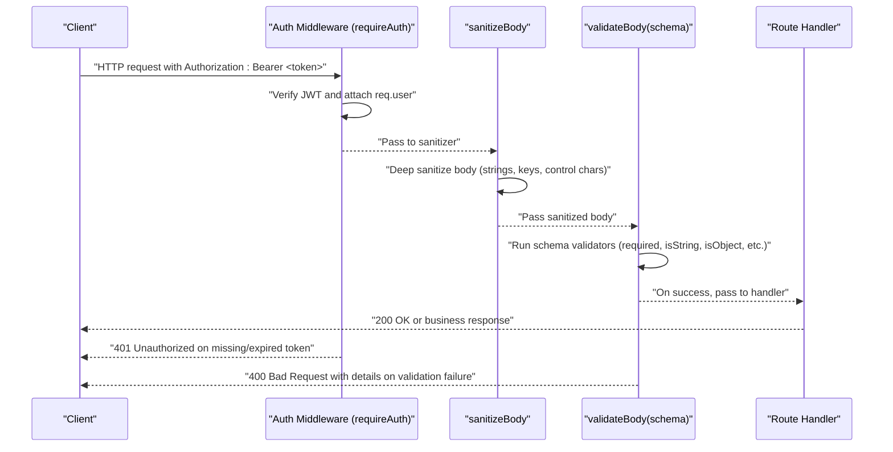
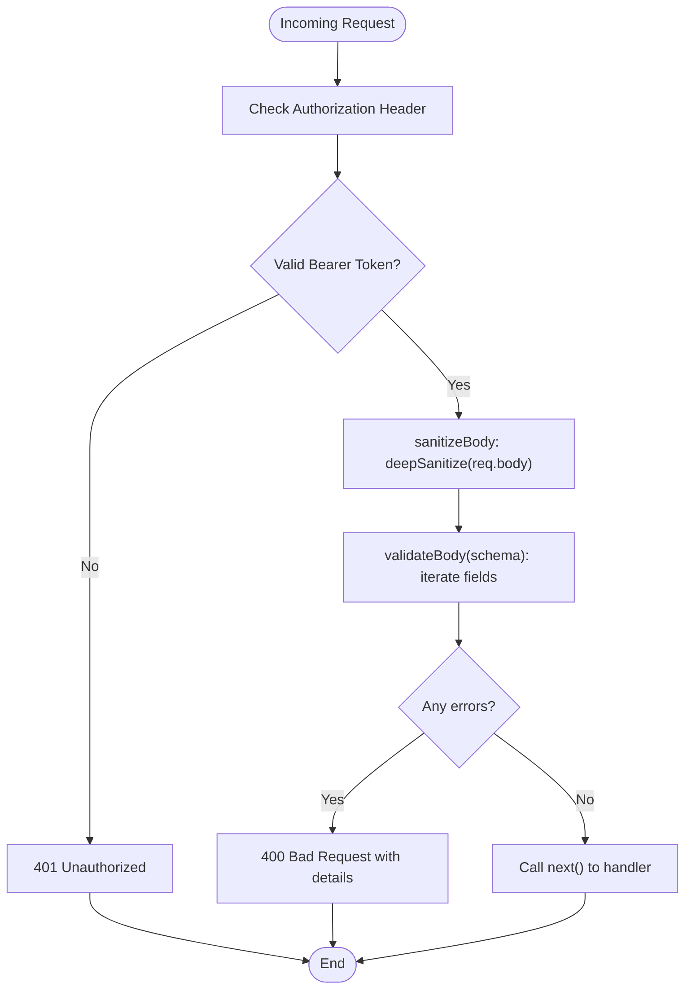
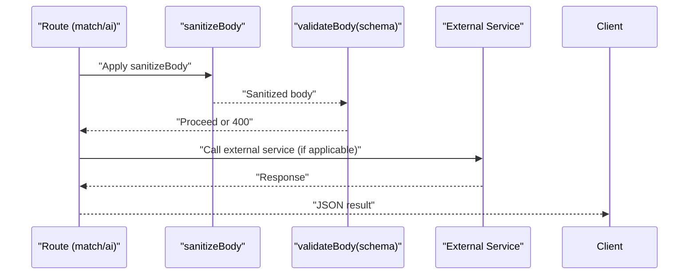
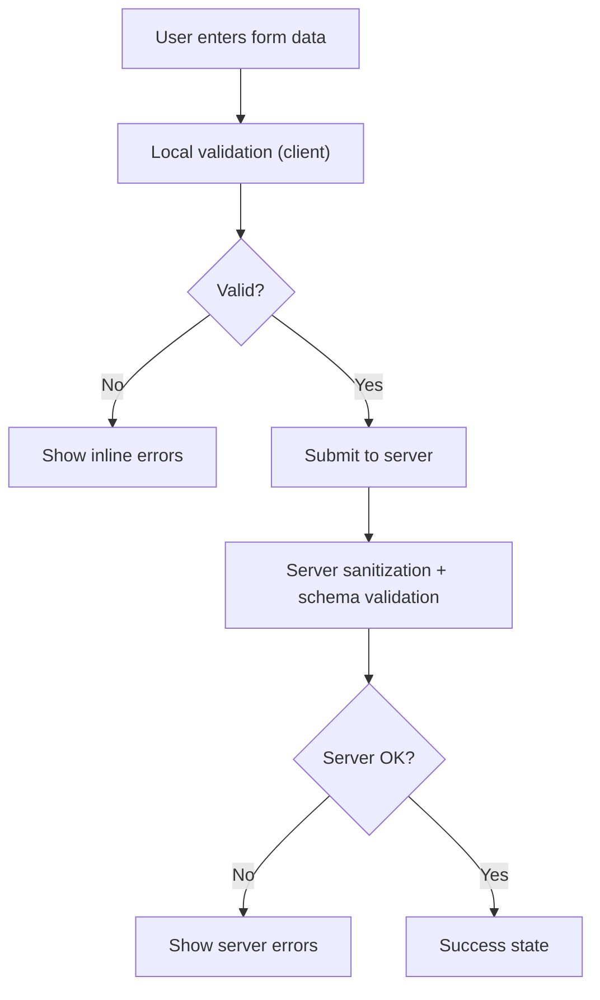
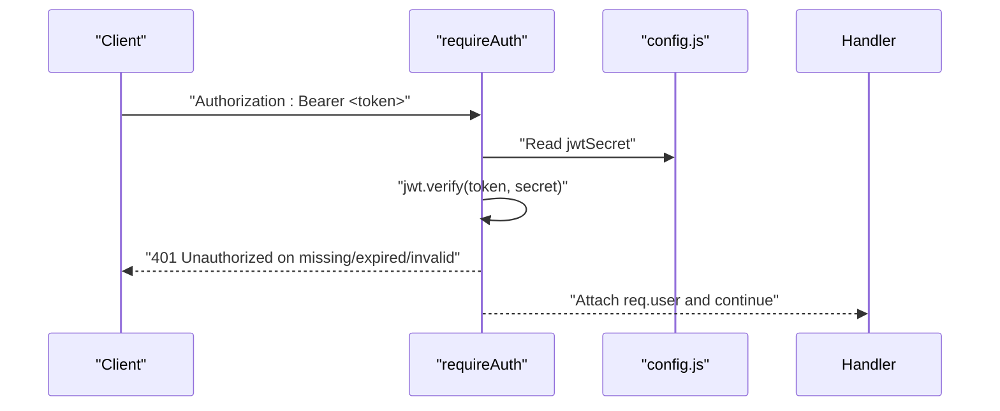
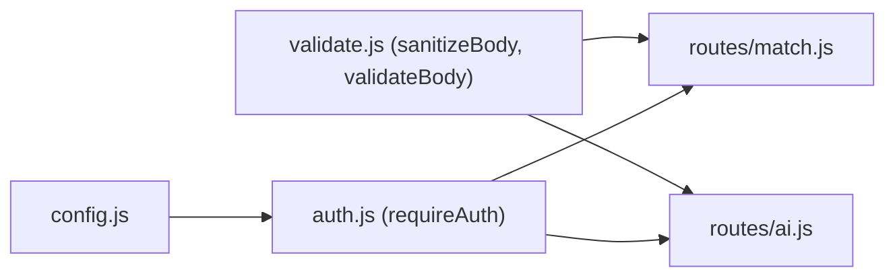

# Input Validation System

<cite>
**Referenced Files in This Document**
- [validate.js](file://server/middleware/validate.js)
- [validation.js](file://src/utils/validation.js)
- [auth.js](file://server/middleware/auth.js)
- [auth.js](file://server/routes/auth.js)
- [match.js](file://server/routes/match.js)
- [ai.js](file://server/routes/ai.js)
- [config.js](file://server/config.js)
- [SignIn.jsx](file://src/pages/SignIn.jsx)
- [SignUp.jsx](file://src/pages/SignUp.jsx)
- [AuthInput.jsx](file://src/components/AuthInput.jsx)
</cite>

## Table of Contents
1. [Introduction](#introduction)
2. [Project Structure](#project-structure)
3. [Core Components](#core-components)
4. [Architecture Overview](#architecture-overview)
5. [Detailed Component Analysis](#detailed-component-analysis)
6. [Dependency Analysis](#dependency-analysis)
7. [Performance Considerations](#performance-considerations)
8. [Troubleshooting Guide](#troubleshooting-guide)
9. [Conclusion](#conclusion)

## Introduction
This document explains the input validation middleware and form validation system used across the server and client. It covers validation rules, sanitization processes, error handling, middleware usage patterns, custom validators, integration with authentication flows, and security measures against injection attacks. It also provides examples of validation scenarios, common patterns, and troubleshooting tips, with emphasis on how validation relates to authentication security.

## Project Structure
The validation system spans two layers:
- Server middleware and route-level validation: lightweight middleware and reusable validators enforce strict input checks and automatic sanitization before business logic runs.
- Client-side form validation: React components validate user input locally to improve UX and reduce unnecessary server requests.

**Diagram sources**
- [auth.js:14-37](file://server/middleware/auth.js#L14-L37)
- [validate.js:36-62](file://server/middleware/validate.js#L36-L62)
- [ai.js:1-421](file://server/routes/ai.js#L1-L421)
- [match.js:1-120](file://server/routes/match.js#L1-L120)
- [auth.js:1-83](file://server/routes/auth.js#L1-L83)
- [config.js:1-35](file://server/config.js#L1-L35)

**Section sources**
- [validate.js:1-80](file://server/middleware/validate.js#L1-L80)
- [validation.js:1-123](file://src/utils/validation.js#L1-L123)
- [auth.js:1-49](file://server/middleware/auth.js#L1-L49)
- [auth.js:1-83](file://server/routes/auth.js#L1-L83)
- [match.js:1-120](file://server/routes/match.js#L1-L120)
- [ai.js:1-421](file://server/routes/ai.js#L1-L421)
- [config.js:1-35](file://server/config.js#L1-L35)
- [SignIn.jsx:1-178](file://src/pages/SignIn.jsx#L1-L178)
- [SignUp.jsx:1-194](file://src/pages/SignUp.jsx#L1-L194)
- [AuthInput.jsx:1-27](file://src/components/AuthInput.jsx#L1-L27)

## Core Components
- Server middleware validation:
  - Automatic sanitization of request bodies to remove XSS vectors and control characters.
  - Schema-driven validation with reusable validators for required fields, strings, arrays, and objects.
  - Structured 400 responses with grouped validation errors.
- Route-level enforcement:
  - Routes apply authentication followed by sanitization and schema validation before invoking business logic.
- Client-side form validation:
  - Local validation improves UX and reduces server load by catching obvious errors early.
- Authentication integration:
  - All protected routes require a valid JWT; validation occurs after authentication to ensure only authorized, sanitized inputs reach business logic.

**Section sources**
- [validate.js:11-62](file://server/middleware/validate.js#L11-L62)
- [match.js:28-37](file://server/routes/match.js#L28-L37)
- [ai.js:26-35](file://server/routes/ai.js#L26-L35)
- [auth.js:14-37](file://server/middleware/auth.js#L14-L37)
- [SignIn.jsx:14-22](file://src/pages/SignIn.jsx#L14-L22)
- [SignUp.jsx:15-24](file://src/pages/SignUp.jsx#L15-L24)

## Architecture Overview
The validation pipeline ensures secure, predictable inputs for all authenticated endpoints.

**Diagram sources**
- [auth.js:14-37](file://server/middleware/auth.js#L14-L37)
- [validate.js:36-62](file://server/middleware/validate.js#L36-L62)
- [match.js:33-37](file://server/routes/match.js#L33-L37)

## Detailed Component Analysis

### Server Middleware Validation
The middleware provides:
- Deep sanitization of request bodies to mitigate XSS and control character risks.
- A flexible validator factory that accepts a schema mapping field names to validator functions returning true or an error message.
- Reusable validators for required fields, strings with length limits, arrays, and objects.

**Diagram sources**
- [auth.js:14-37](file://server/middleware/auth.js#L14-L37)
- [validate.js:36-62](file://server/middleware/validate.js#L36-L62)

**Section sources**
- [validate.js:11-80](file://server/middleware/validate.js#L11-L80)

### Reusable Validators
Common validators:
- required(label): Ensures a non-empty trimmed value.
- isString(label, maxLen): Enforces string type and optional length cap.
- isArray(label): Ensures an array.
- isObject(label): Ensures a plain object.

These are used in route schemas to define strict input contracts.

**Section sources**
- [validate.js:66-80](file://server/middleware/validate.js#L66-L80)

### Route-Level Validation Patterns
- Match service:
  - Enforces presence of task object and volunteers array.
  - Applies sanitization and schema validation before ranking volunteers.
- AI services:
  - Enforce presence and type constraints for document parsing and report analysis.
  - Apply sanitization and schema validation before calling external AI APIs.

**Diagram sources**
- [match.js:33-37](file://server/routes/match.js#L33-L37)
- [ai.js:31-35](file://server/routes/ai.js#L31-L35)

**Section sources**
- [match.js:28-37](file://server/routes/match.js#L28-L37)
- [ai.js:26-35](file://server/routes/ai.js#L26-L35)

### Client-Side Form Validation
- SignIn page:
  - Prevents submission with empty credentials and simulates account lookup.
- SignUp page:
  - Validates name, organization, email format, uniqueness, password length, and confirmation match.
  - Uses local state to display inline errors and adjust UI feedback.

**Diagram sources**
- [SignIn.jsx:14-22](file://src/pages/SignIn.jsx#L14-L22)
- [SignUp.jsx:15-24](file://src/pages/SignUp.jsx#L15-L24)

**Section sources**
- [SignIn.jsx:14-22](file://src/pages/SignIn.jsx#L14-L22)
- [SignUp.jsx:15-24](file://src/pages/SignUp.jsx#L15-L24)
- [AuthInput.jsx:3-13](file://src/components/AuthInput.jsx#L3-L13)

### Authentication Integration
- requireAuth verifies the Authorization header and decodes the JWT.
- On success, req.user is attached for downstream handlers.
- On failure, appropriate 401 responses are returned with hints or token-expired messages.

**Diagram sources**
- [auth.js:14-37](file://server/middleware/auth.js#L14-L37)
- [config.js:17-19](file://server/config.js#L17-L19)

**Section sources**
- [auth.js:14-37](file://server/middleware/auth.js#L14-L37)
- [auth.js:34-52](file://server/routes/auth.js#L34-L52)
- [config.js:17-19](file://server/config.js#L17-L19)

### Security Measures and Injection Prevention
- XSS mitigation:
  - Automatic stripping of angle brackets, backticks, and control characters during sanitization.
  - Trimming of whitespace to prevent subtle bypasses.
- Input normalization:
  - Emails normalized to lowercase and trimmed.
  - Text fields truncated to configured maximum lengths.
- Strict typing and bounds:
  - Validators enforce types and numeric ranges for coordinates and counts.
- Authentication-first policy:
  - All protected routes require a valid JWT before any validation logic executes.

**Section sources**
- [validate.js:11-17](file://server/middleware/validate.js#L11-L17)
- [validate.js:66-80](file://server/middleware/validate.js#L66-L80)
- [validation.js:8-24](file://src/utils/validation.js#L8-L24)
- [validation.js:30-80](file://src/utils/validation.js#L30-L80)
- [validation.js:82-122](file://src/utils/validation.js#L82-L122)

## Dependency Analysis
- Route dependencies:
  - match.js depends on auth middleware and validate middleware to protect and validate inputs.
  - ai.js similarly applies sanitization and schema validation for AI endpoints.
- Validator reuse:
  - Reusable validators are imported and composed into route-specific schemas.
- Configuration:
  - JWT secret and expiration are loaded from environment variables via config.js.

**Diagram sources**
- [config.js:17-19](file://server/config.js#L17-L19)
- [auth.js:14-37](file://server/middleware/auth.js#L14-L37)
- [validate.js:36-62](file://server/middleware/validate.js#L36-L62)
- [match.js:33-37](file://server/routes/match.js#L33-L37)
- [ai.js:31-35](file://server/routes/ai.js#L31-L35)

**Section sources**
- [match.js:1-120](file://server/routes/match.js#L1-L120)
- [ai.js:1-421](file://server/routes/ai.js#L1-L421)
- [validate.js:1-80](file://server/middleware/validate.js#L1-L80)
- [auth.js:1-49](file://server/middleware/auth.js#L1-L49)
- [config.js:1-35](file://server/config.js#L1-L35)

## Performance Considerations
- Middleware order matters: authentication should precede validation to avoid validating unauthorized requests.
- Prefer schema-based validation for predictable throughput and clear error reporting.
- Keep validator functions pure and fast; avoid heavy computations inside validators.
- Use caching judiciously for expensive operations (already present in match service) to reduce repeated work.

## Troubleshooting Guide
Common validation issues and resolutions:
- 400 Bad Request with details:
  - Indicates schema mismatch or failed validator. Review the details object to identify offending fields and update client payloads accordingly.
- 401 Unauthorized:
  - Missing or invalid Authorization header. Ensure the client sends Authorization: Bearer <token> and that the token is not expired.
- Unexpected trimming or truncation:
  - Inputs are sanitized and truncated by design. Adjust client expectations to accommodate trimmed and capped values.
- Numeric range errors:
  - Latitude/longitude and integer fields have strict bounds. Verify numeric inputs fall within allowed ranges before sending requests.
- Authentication token problems:
  - Expired tokens produce a specific message; re-authenticate. Invalid tokens indicate tampering or wrong secret.

**Section sources**
- [validate.js:48-62](file://server/middleware/validate.js#L48-L62)
- [auth.js:17-36](file://server/middleware/auth.js#L17-L36)
- [validation.js:49-60](file://src/utils/validation.js#L49-L60)
- [validation.js:97-99](file://src/utils/validation.js#L97-L99)

## Conclusion
The input validation system combines robust server middleware sanitization and schema-driven validation with client-side UX-focused checks. By enforcing strict typing, trimming, and normalization, and by requiring valid authentication before processing, the system mitigates injection risks and ensures predictable, secure data flow. Adhering to the documented patterns and troubleshooting steps will help maintain reliability and security across the platform.