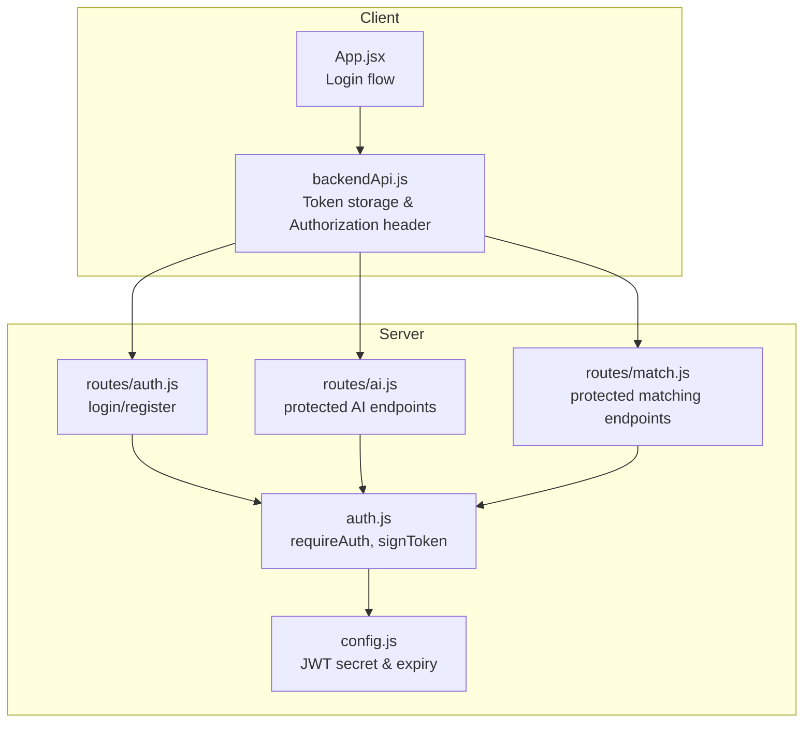
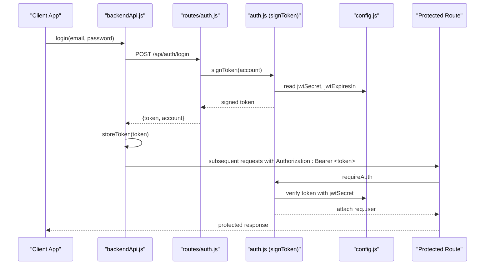
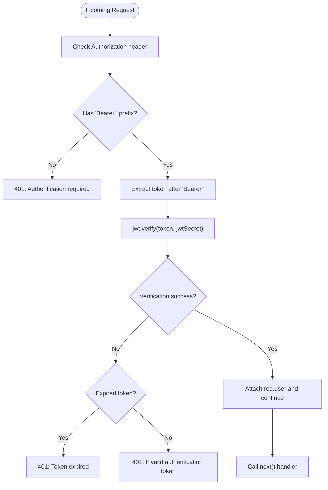
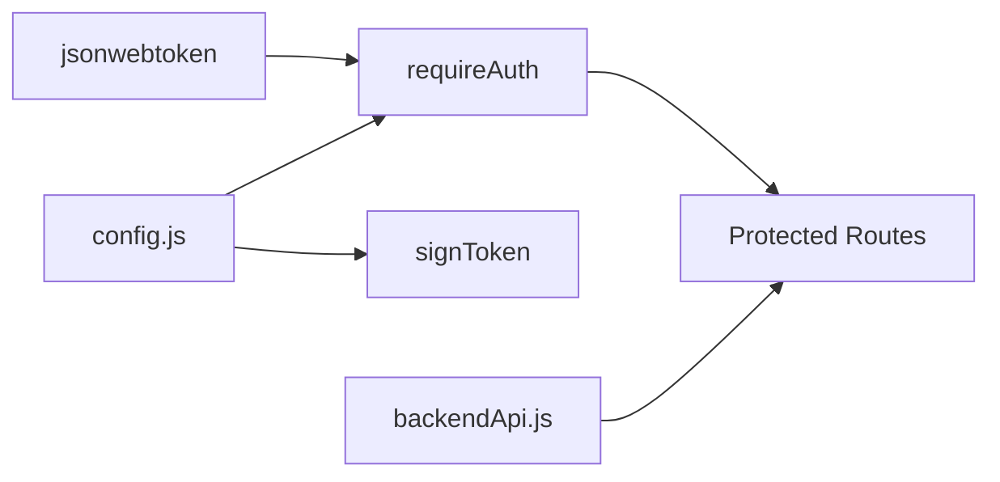

# JWT Authentication Middleware

<cite>
**Referenced Files in This Document**
- [auth.js](file://server/middleware/auth.js)
- [config.js](file://server/config.js)
- [auth.js](file://server/routes/auth.js)
- [ai.js](file://server/route/ai.js)
- [match.js](file://server/route/match.js)
- [backendApi.js](file://src/services/backendApi.js)
- [App.jsx](file://src/App.jsx)
</cite>

## Table of Contents
1. [Introduction](#introduction)
2. [Project Structure](#project-structure)
3. [Core Components](#core-components)
4. [Architecture Overview](#architecture-overview)
5. [Detailed Component Analysis](#detailed-component-analysis)
6. [Dependency Analysis](#dependency-analysis)
7. [Performance Considerations](#performance-considerations)
8. [Troubleshooting Guide](#troubleshooting-guide)
9. [Conclusion](#conclusion)

## Introduction
This document explains the JWT authentication middleware implementation used to protect server routes. It covers token signing and verification, payload structure, middleware usage patterns, token extraction from requests, route protection strategies, expiration handling, and secure storage practices. It also includes examples of protected route implementation, error handling scenarios, and security best practices.

## Project Structure
The authentication system spans three layers:
- Middleware: JWT verification and token signing
- Routes: Protected endpoints that require authentication
- Client service: Token storage and Authorization header injection

**Diagram sources**
- [auth.js](file://server/middleware/auth.js)
- [config.js](file://server/config.js)
- [auth.js](file://server/routes/auth.js)
- [ai.js](file://server/route/ai.js)
- [match.js](file://server/route/match.js)
- [backendApi.js](file://src/services/backendApi.js)
- [App.jsx](file://src/App.jsx)

**Section sources**
- [auth.js](file://server/middleware/auth.js)
- [config.js](file://server/config.js)
- [auth.js](file://server/routes/auth.js)
- [ai.js](file://server/route/ai.js)
- [match.js](file://server/route/match.js)
- [backendApi.js](file://src/services/backendApi.js)
- [App.jsx](file://src/App.jsx)

## Core Components
- JWT middleware: Validates Authorization header and decodes the token
- Token signer: Creates signed JWTs with a configurable expiry
- Config: Centralizes JWT secret and expiry settings
- Protected routes: Apply middleware to enforce authentication
- Client service: Stores token and injects Authorization header

**Section sources**
- [auth.js](file://server/middleware/auth.js)
- [config.js](file://server/config.js)
- [auth.js](file://server/routes/auth.js)
- [ai.js](file://server/route/ai.js)
- [match.js](file://server/route/match.js)
- [backendApi.js](file://src/services/backendApi.js)

## Architecture Overview
The authentication flow integrates client-side token storage with server-side middleware verification and protected routes.

**Diagram sources**
- [auth.js](file://server/middleware/auth.js)
- [config.js](file://server/config.js)
- [auth.js](file://server/routes/auth.js)
- [ai.js](file://server/route/ai.js)
- [match.js](file://server/route/match.js)
- [backendApi.js](file://src/services/backendApi.js)

## Detailed Component Analysis

### JWT Middleware: requireAuth
Purpose:
- Extracts the Authorization header
- Ensures it starts with "Bearer "
- Verifies the JWT using the configured secret
- Attaches decoded payload to req.user for downstream handlers
- Returns 401 with appropriate messages for missing or invalid tokens

Key behaviors:
- Rejects missing or malformed Authorization headers
- Strips "Bearer " prefix before verification
- Distinguishes expired vs invalid tokens
- Attaches { email, name, type, iat, exp } to req.user

Usage pattern:
- Import requireAuth from the middleware module
- Apply as middleware on routes requiring authentication

Security considerations:
- Uses a shared secret configured via environment variables
- Enforces strict header format to prevent trivial bypasses

**Section sources**
- [auth.js](file://server/middleware/auth.js)

### Token Signing: signToken
Purpose:
- Generates a signed JWT for a given account object
- Payload includes email, name, and type
- Applies configured expiry (e.g., hours)

Implementation highlights:
- Reads jwtSecret and jwtExpiresIn from config
- Returns a compact JWT suitable for Authorization headers

Integration:
- Used by login and registration routes to produce tokens
- Consumed by client service to persist tokens

**Section sources**
- [auth.js](file://server/middleware/auth.js)
- [config.js](file://server/config.js)

### Configuration: JWT Secret and Expiry
Centralized configuration:
- jwtSecret: loaded from environment variable
- jwtExpiresIn: loaded from environment variable (e.g., "8h")

Operational notes:
- Defaults are provided for local development
- In production, ensure environment variables are set securely

**Section sources**
- [config.js](file://server/config.js)

### Protected Routes: AI and Matching Services
Protected endpoints:
- AI routes: parse-document, incident-analyze, chat, explain-match, analyze-report, analyze-reports-batch, priority-score, priority-rank
- Matching routes: match, recommend, cache-stats

Middleware integration:
- requireAuth is applied before route handlers
- Handlers can access req.user for authorization decisions

Example patterns:
- Route handler receives verified req.user and proceeds with business logic
- Validation middleware can be chained after requireAuth

**Section sources**
- [ai.js](file://server/route/ai.js)
- [match.js](file://server/route/match.js)
- [auth.js](file://server/middleware/auth.js)

### Client-Side Token Management
Client responsibilities:
- Persist token in session storage
- Inject Authorization: Bearer <token> header on all authenticated requests
- Clear token on logout

Implementation highlights:
- Token stored under a dedicated key
- Authorization header built dynamically from stored token
- Logout clears token and resets internal state

**Section sources**
- [backendApi.js](file://src/services/backendApi.js)
- [App.jsx](file://src/App.jsx)

### Login and Registration Flow
Server-side:
- Login validates credentials and returns a signed token
- Registration creates a new account and returns a signed token

Client-side:
- Calls backendApi.login during sign-in
- Stores token and proceeds to protected routes

**Section sources**
- [auth.js](file://server/routes/auth.js)
- [backendApi.js](file://src/services/backendApi.js)

### Token Extraction and Verification Flow

**Diagram sources**
- [auth.js](file://server/middleware/auth.js)

## Dependency Analysis
- requireAuth depends on:
  - jsonwebtoken library for verification
  - config for jwtSecret and jwtExpiresIn
- signToken depends on:
  - config for jwtSecret and jwtExpiresIn
- Protected routes depend on:
  - requireAuth middleware
  - client service for Authorization header injection

**Diagram sources**
- [auth.js](file://server/middleware/auth.js)
- [config.js](file://server/config.js)
- [backendApi.js](file://src/services/backendApi.js)

**Section sources**
- [auth.js](file://server/middleware/auth.js)
- [config.js](file://server/config.js)
- [backendApi.js](file://src/services/backendApi.js)

## Performance Considerations
- Token verification is lightweight; overhead is minimal compared to network calls
- Consider rate limiting on unprotected endpoints (already implemented) to reduce brute-force attempts
- Keep jwtExpiresIn reasonable to balance usability and security
- Avoid storing tokens in long-lived storage (cookies/localStorage) unless necessary; current implementation uses session storage

## Troubleshooting Guide
Common issues and resolutions:
- 401 Authentication required:
  - Ensure Authorization header is present and starts with "Bearer "
  - Confirm client is sending the stored token
- 401 Invalid authentication token:
  - Verify jwtSecret matches between client and server
  - Check for token tampering or corruption
- 401 Token expired:
  - Trigger re-login to obtain a fresh token
  - Adjust jwtExpiresIn if frequent expirations cause UX friction
- Client cannot reach protected endpoints:
  - Confirm backendApi stores and sends token
  - Verify route chain includes requireAuth before business logic

**Section sources**
- [auth.js](file://server/middleware/auth.js)
- [backendApi.js](file://src/services/backendApi.js)

## Conclusion
The JWT authentication middleware provides a straightforward, secure mechanism for protecting server routes. By centralizing configuration, applying middleware consistently, and managing tokens carefully on the client, the system achieves strong security posture while maintaining simplicity. For production, ensure environment variables are properly managed and consider additional controls such as refresh tokens or short-lived access tokens with refresh endpoints if needed.