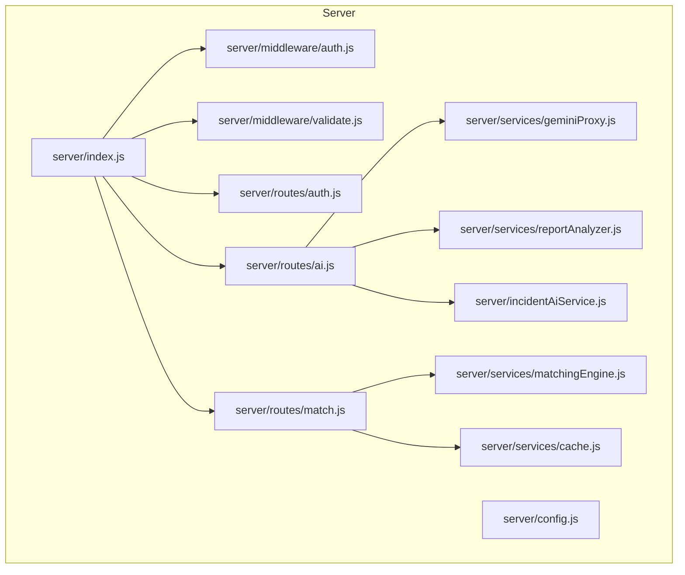
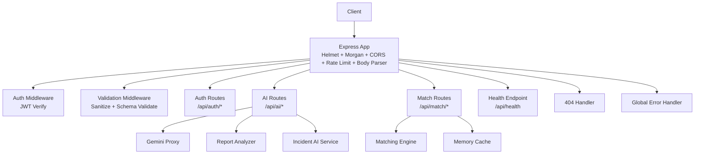
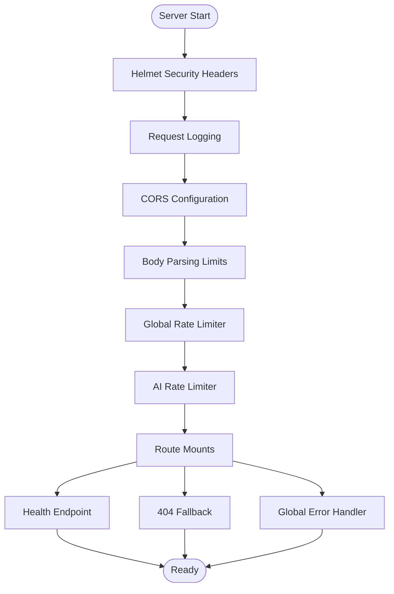
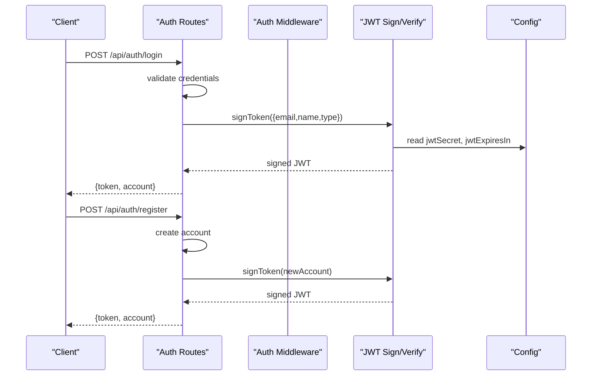
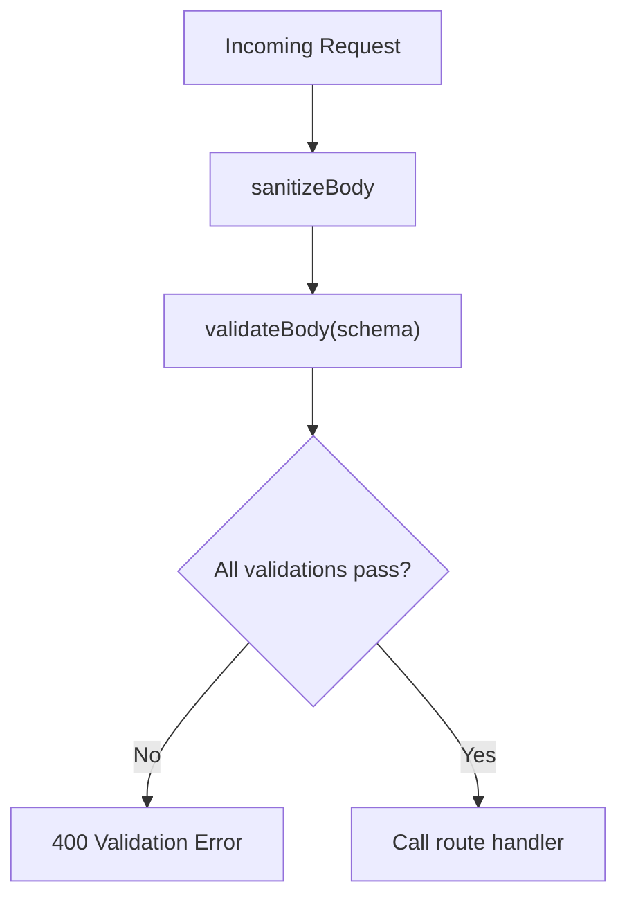
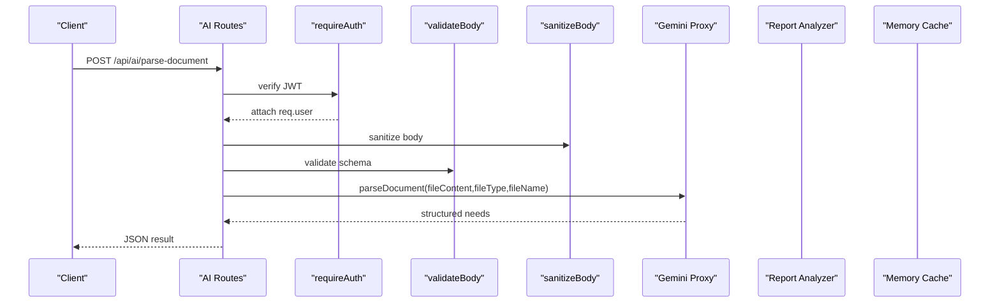
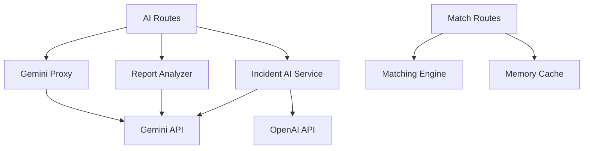
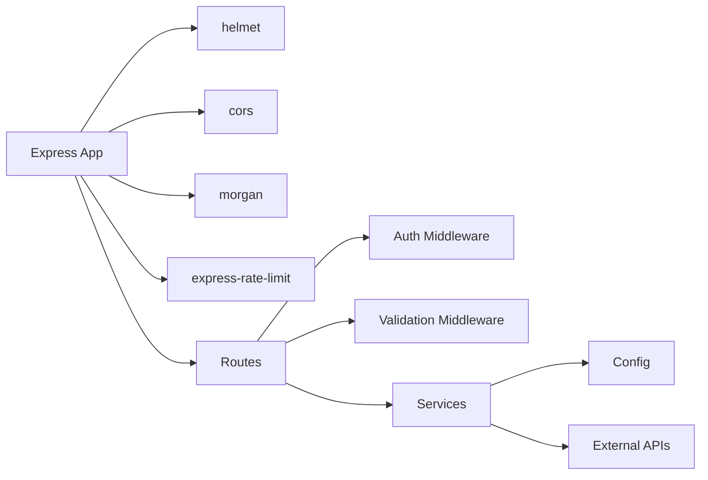

# Backend Architecture

<cite>
**Referenced Files in This Document**
- [server/index.js](file://server/index.js)
- [server/config.js](file://server/config.js)
- [server/middleware/auth.js](file://server/middleware/auth.js)
- [server/middleware/validate.js](file://server/middleware/validate.js)
- [server/routes/auth.js](file://server/routes/auth.js)
- [server/routes/ai.js](file://server/routes/ai.js)
- [server/routes/match.js](file://server/routes/match.js)
- [server/services/geminiProxy.js](file://server/services/geminiProxy.js)
- [server/services/matchingEngine.js](file://server/services/matchingEngine.js)
- [server/services/cache.js](file://server/services/cache.js)
- [server/services/reportAnalyzer.js](file://server/services/reportAnalyzer.js)
- [server/incidentAiService.js](file://server/incidentAiService.js)
- [server/package.json](file://server/package.json)
</cite>

## Table of Contents
1. [Introduction](#introduction)
2. [Project Structure](#project-structure)
3. [Core Components](#core-components)
4. [Architecture Overview](#architecture-overview)
5. [Detailed Component Analysis](#detailed-component-analysis)
6. [Dependency Analysis](#dependency-analysis)
7. [Performance Considerations](#performance-considerations)
8. [Troubleshooting Guide](#troubleshooting-guide)
9. [Conclusion](#conclusion)
10. [Appendices](#appendices)

## Introduction
This document describes the backend architecture of the Express.js server component for the NeedLink platform. It covers server setup, middleware stack configuration, security headers, API endpoint organization, authentication and authorization, validation and sanitization, error handling, routing structure, request/response patterns, external service integrations, configuration and environment management, deployment considerations, and performance optimization strategies.

## Project Structure
The server is organized around a modular Express application with clear separation of concerns:
- Entry point initializes middleware, routes, health checks, and error handling.
- Configuration centralizes environment-driven settings.
- Middleware provides authentication and input validation.
- Routes define API endpoints grouped by domain (/auth, /ai, /match).
- Services encapsulate business logic and external integrations.

**Diagram sources**
- [server/index.js:1-118](file://server/index.js#L1-L118)
- [server/config.js:1-35](file://server/config.js#L1-L35)
- [server/middleware/auth.js:1-49](file://server/middleware/auth.js#L1-L49)
- [server/middleware/validate.js:1-80](file://server/middleware/validate.js#L1-L80)
- [server/routes/auth.js:1-83](file://server/routes/auth.js#L1-L83)
- [server/routes/ai.js:1-348](file://server/routes/ai.js#L1-L348)
- [server/routes/match.js:1-120](file://server/routes/match.js#L1-L120)
- [server/services/geminiProxy.js:1-104](file://server/services/geminiProxy.js#L1-L104)
- [server/services/matchingEngine.js:1-212](file://server/services/matchingEngine.js#L1-L212)
- [server/services/cache.js:1-66](file://server/services/cache.js#L1-L66)
- [server/services/reportAnalyzer.js:1-450](file://server/services/reportAnalyzer.js#L1-L450)
- [server/incidentAiService.js:1-189](file://server/incidentAiService.js#L1-L189)

**Section sources**
- [server/index.js:1-118](file://server/index.js#L1-L118)
- [server/package.json:1-18](file://server/package.json#L1-L18)

## Core Components
- Server initialization and middleware stack: helmet, morgan, cors, body parsing, rate limiting, route registration, health endpoint, 404 fallback, and global error handler.
- Configuration module: reads environment variables for ports, AI providers, JWT, rate limits, CORS, and cache tuning.
- Authentication middleware: JWT verification and token signing.
- Validation middleware: automatic sanitization and schema-based validation.
- Route modules: authentication endpoints, AI endpoints (document parsing, incident analysis, chat, match explanation, report analysis), and matching endpoints.
- Service modules: Gemini proxy, matching engine, memory cache, report analyzer, and incident AI service.

**Section sources**
- [server/index.js:16-118](file://server/index.js#L16-L118)
- [server/config.js:8-35](file://server/config.js#L8-L35)
- [server/middleware/auth.js:14-49](file://server/middleware/auth.js#L14-L49)
- [server/middleware/validate.js:11-80](file://server/middleware/validate.js#L11-L80)
- [server/routes/auth.js:11-83](file://server/routes/auth.js#L11-L83)
- [server/routes/ai.js:21-348](file://server/routes/ai.js#L21-L348)
- [server/routes/match.js:11-120](file://server/routes/match.js#L11-L120)
- [server/services/geminiProxy.js:53-104](file://server/services/geminiProxy.js#L53-L104)
- [server/services/matchingEngine.js:166-212](file://server/services/matchingEngine.js#L166-L212)
- [server/services/cache.js:10-66](file://server/services/cache.js#L10-L66)
- [server/services/reportAnalyzer.js:380-450](file://server/services/reportAnalyzer.js#L380-L450)
- [server/incidentAiService.js:170-189](file://server/incidentAiService.js#L170-L189)

## Architecture Overview
The server follows a layered architecture:
- Transport layer: Express app with helmet, morgan, cors, rate limiter, and body parsers.
- Routing layer: Modular route handlers for auth, AI, and matching.
- Domain layer: Business logic in services for AI proxies, matching, caching, and report analysis.
- External integration layer: Calls to Gemini and OpenAI APIs with fallbacks.

**Diagram sources**
- [server/index.js:28-101](file://server/index.js#L28-L101)
- [server/routes/auth.js:1-83](file://server/routes/auth.js#L1-L83)
- [server/routes/ai.js:1-348](file://server/routes/ai.js#L1-L348)
- [server/routes/match.js:1-120](file://server/routes/match.js#L1-L120)
- [server/services/geminiProxy.js:53-104](file://server/services/geminiProxy.js#L53-L104)
- [server/services/reportAnalyzer.js:326-411](file://server/services/reportAnalyzer.js#L326-L411)
- [server/incidentAiService.js:170-189](file://server/incidentAiService.js#L170-L189)
- [server/services/matchingEngine.js:166-212](file://server/services/matchingEngine.js#L166-L212)
- [server/services/cache.js:10-66](file://server/services/cache.js#L10-L66)

## Detailed Component Analysis

### Server Initialization and Middleware Stack
- Security headers: helmet secures responses with multiple HTTP headers.
- Logging: morgan logs requests with method, path, status, and response time.
- CORS: configured with origin, credentials, and allowed methods/headers.
- Body parsing: global JSON limit; increased for AI routes to support base64 uploads.
- Rate limiting: global limiter and stricter limiter for AI endpoints; keyed by IP.
- Routes: mounted under /api/auth, /api/ai, /api/match.
- Health endpoint: returns status, uptime, timestamp, and Gemini configuration status.
- 404 fallback: responds with endpoint not found.
- Global error handler: logs fatal errors and returns standardized 500 responses.

**Diagram sources**
- [server/index.js:28-101](file://server/index.js#L28-L101)

**Section sources**
- [server/index.js:28-101](file://server/index.js#L28-L101)

### Configuration Management
- Reads environment variables for port, AI provider keys and models, JWT secret and expiry, rate limits, CORS origin, and cache TTL/max size.
- Ensures defaults for local development while preventing accidental exposure of secrets.

**Section sources**
- [server/config.js:8-35](file://server/config.js#L8-L35)

### Authentication System
- JWT-based authentication:
  - Verification middleware checks Authorization header for Bearer token and decodes payload.
  - Token signing produces signed JWT with email, name, and type claims.
  - Production note suggests Firebase Admin verification as an alternative.
- Account management:
  - Login validates credentials against in-memory accounts and returns a signed token.
  - Registration creates a new account and returns a token.

**Diagram sources**
- [server/routes/auth.js:34-80](file://server/routes/auth.js#L34-L80)
- [server/middleware/auth.js:14-48](file://server/middleware/auth.js#L14-L48)
- [server/config.js:17-20](file://server/config.js#L17-L20)

**Section sources**
- [server/middleware/auth.js:14-49](file://server/middleware/auth.js#L14-L49)
- [server/routes/auth.js:11-83](file://server/routes/auth.js#L11-L83)

### Request Validation and Security Protection
- Automatic sanitization:
  - Removes XSS vectors and control characters.
  - Trims strings and recursively sanitizes nested objects/arrays.
- Schema-based validation:
  - Factory returns middleware that validates fields against provided validators.
  - Validators include required, isString, isArray, isObject.
- Combined usage:
  - sanitizeBody runs before route handlers.
  - validateBody enforces schema-defined constraints.

**Diagram sources**
- [server/middleware/validate.js:36-62](file://server/middleware/validate.js#L36-L62)

**Section sources**
- [server/middleware/validate.js:11-80](file://server/middleware/validate.js#L11-L80)

### API Routing Structure and Request/Response Handling
- Auth endpoints:
  - POST /api/auth/login: returns token and account.
  - POST /api/auth/register: returns token and account.
- AI endpoints:
  - POST /api/ai/parse-document: secure proxy to Gemini for document parsing.
  - POST /api/ai/incident-analyze: analyzes incident reports with provider selection.
  - POST /api/ai/chat: structured chat with mode-specific instructions.
  - POST /api/ai/explain-match: human-readable explanation of match quality.
  - POST /api/ai/analyze-report: extracts structured needs from reports.
  - POST /api/ai/analyze-reports-batch: batch processing with validation and aggregation.
- Match endpoints:
  - POST /api/match: ranks volunteers for a task with caching.
  - POST /api/match/recommend: generates recommendations for multiple tasks.
  - GET /api/match/cache-stats: monitoring endpoint for cache performance.

**Diagram sources**
- [server/routes/ai.js:30-50](file://server/routes/ai.js#L30-L50)
- [server/services/geminiProxy.js:53-104](file://server/services/geminiProxy.js#L53-L104)

**Section sources**
- [server/routes/auth.js:28-83](file://server/routes/auth.js#L28-L83)
- [server/routes/ai.js:21-348](file://server/routes/ai.js#L21-L348)
- [server/routes/match.js:23-120](file://server/routes/match.js#L23-L120)

### External Service Integrations
- Gemini proxy:
  - Validates API key, constructs prompts, and parses JSON responses.
  - Supports text and image inputs with inline data.
- Report analyzer:
  - Attempts LLM extraction first; falls back to keyword-based extraction.
  - Provides confidence scores and reasoning metadata.
- Incident AI service:
  - Selects provider (Gemini/OpenAI/auto) with fallback to heuristic analysis.
  - Normalizes and validates results.
- Matching engine:
  - Computes weighted scores using Haversine distance, skill overlap, availability, experience, and performance.
  - Supports region filtering and returns detailed explanations.

**Diagram sources**
- [server/routes/ai.js:4-7](file://server/routes/ai.js#L4-L7)
- [server/services/geminiProxy.js:53-104](file://server/services/geminiProxy.js#L53-L104)
- [server/services/reportAnalyzer.js:326-411](file://server/services/reportAnalyzer.js#L326-L411)
- [server/incidentAiService.js:170-189](file://server/incidentAiService.js#L170-L189)
- [server/routes/match.js:4-7](file://server/routes/match.js#L4-L7)
- [server/services/matchingEngine.js:166-212](file://server/services/matchingEngine.js#L166-L212)
- [server/services/cache.js:10-66](file://server/services/cache.js#L10-L66)

**Section sources**
- [server/services/geminiProxy.js:53-104](file://server/services/geminiProxy.js#L53-L104)
- [server/services/reportAnalyzer.js:326-411](file://server/services/reportAnalyzer.js#L326-L411)
- [server/incidentAiService.js:170-189](file://server/incidentAiService.js#L170-L189)
- [server/services/matchingEngine.js:166-212](file://server/services/matchingEngine.js#L166-L212)
- [server/services/cache.js:10-66](file://server/services/cache.js#L10-L66)

### Error Handling and Monitoring
- Health endpoint: exposes uptime, timestamp, and Gemini configuration status.
- 404 fallback: standardized not-found response.
- Global error handler: logs fatal errors and returns 500 with stack in non-production environments.
- Route-level error handling: routes catch exceptions and return appropriate status codes with messages.

**Section sources**
- [server/index.js:78-101](file://server/index.js#L78-L101)
- [server/routes/ai.js:42-49](file://server/routes/ai.js#L42-L49)
- [server/routes/match.js:69-76](file://server/routes/match.js#L69-L76)

## Dependency Analysis
- Express app depends on helmet, cors, morgan, express-rate-limit, and internal modules.
- Routes depend on middleware and services.
- Services depend on configuration and external APIs.
- No circular dependencies observed among modules.

**Diagram sources**
- [server/package.json:9-16](file://server/package.json#L9-L16)
- [server/index.js:16-25](file://server/index.js#L16-L25)
- [server/routes/ai.js:2-7](file://server/routes/ai.js#L2-L7)
- [server/routes/match.js:2-7](file://server/routes/match.js#L2-L7)
- [server/services/reportAnalyzer.js:6](file://server/services/reportAnalyzer.js#L6)

**Section sources**
- [server/package.json:9-16](file://server/package.json#L9-L16)
- [server/index.js:16-25](file://server/index.js#L16-L25)

## Performance Considerations
- Rate limiting:
  - Global limiter protects all endpoints; stricter limiter for AI endpoints to control cost and latency.
  - Keyed by IP with configurable window and max requests.
- Body size limits:
  - Conservative default with increased limit for AI routes to support base64 uploads.
- Caching:
  - Memory cache with TTL and LRU eviction for match results.
  - Cache statistics exposed for monitoring.
- Algorithmic efficiency:
  - Region filtering reduces compute for large volunteer pools.
  - Weighted scoring with early exits and normalization.
- External API resilience:
  - Gemini/OpenAI fallbacks and heuristic analysis ensure continuity.
- Recommendations:
  - Auto-assignment and slot sizing optimize assignment density.

[No sources needed since this section provides general guidance]

## Troubleshooting Guide
- Authentication failures:
  - Ensure Authorization header includes a valid Bearer token.
  - Verify JWT secret and expiration settings.
- Validation errors:
  - Confirm request body matches schema; check required fields and types.
- Rate limit exceeded:
  - Reduce request frequency or adjust environment variables for limits.
- AI provider errors:
  - Verify GEMINI_API_KEY and model configuration.
  - Check external API responses for detailed error messages.
- Cache issues:
  - Monitor cache stats endpoint; adjust TTL and max size as needed.
- Health endpoint:
  - Use /api/health to confirm server status and provider configuration.

**Section sources**
- [server/middleware/auth.js:14-49](file://server/middleware/auth.js#L14-L49)
- [server/middleware/validate.js:48-62](file://server/middleware/validate.js#L48-L62)
- [server/index.js:49-71](file://server/index.js#L49-L71)
- [server/services/geminiProxy.js:53-104](file://server/services/geminiProxy.js#L53-L104)
- [server/routes/match.js:108-117](file://server/routes/match.js#L108-L117)
- [server/index.js:78-87](file://server/index.js#L78-L87)

## Conclusion
The backend architecture emphasizes security, modularity, and resilience. The Express server integrates robust middleware for security and validation, a flexible routing system, and service modules that encapsulate AI and matching logic. Configuration is environment-driven, enabling safe deployments across environments. Performance is addressed through rate limiting, caching, and efficient algorithms, while external integrations include fallback strategies for reliability.

[No sources needed since this section summarizes without analyzing specific files]

## Appendices

### Environment Variables and Defaults
- PORT: server port (default 8787)
- GEMINI_API_KEY: Gemini API key
- GEMINI_MODEL: Gemini model (default gemini-1.5-flash)
- OPENAI_API_KEY: OpenAI API key
- OPENAI_MODEL: OpenAI model (default gpt-4o-mini)
- JWT_SECRET: JWT signing secret (default for development)
- JWT_EXPIRES_IN: token expiry (default 8h)
- RATE_LIMIT_WINDOW_MS: rate limit window (default 15 minutes)
- RATE_LIMIT_MAX: global max requests
- AI_RATE_LIMIT_MAX: stricter AI max requests
- CORS_ORIGIN: allowed origin (default localhost:5173)
- MATCH_CACHE_TTL_MS: cache TTL (default 5 minutes)
- MATCH_CACHE_MAX_SIZE: cache capacity (default 500)

**Section sources**
- [server/config.js:8-35](file://server/config.js#L8-L35)

### Deployment Considerations
- Use environment variables for secrets and tunables.
- Configure CORS origin for production domains.
- Set appropriate rate limits for production traffic.
- Monitor health endpoint and cache stats.
- Scale horizontally with multiple instances behind a load balancer.
- For production at scale, replace in-memory cache with Redis.

**Section sources**
- [server/index.js:38-43](file://server/index.js#L38-L43)
- [server/index.js:50-71](file://server/index.js#L50-L71)
- [server/services/cache.js:7-9](file://server/services/cache.js#L7-L9)