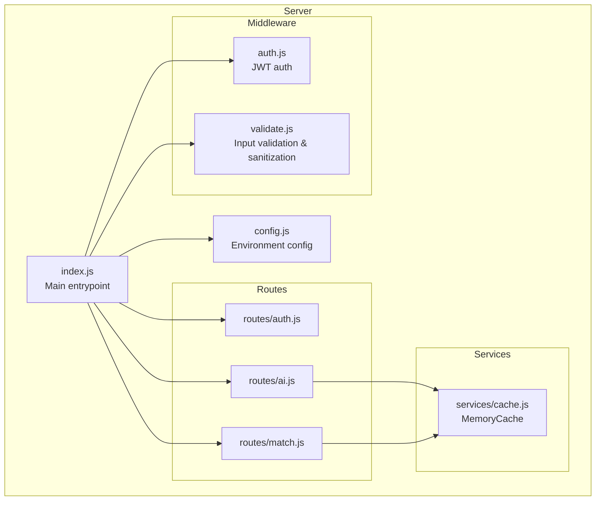
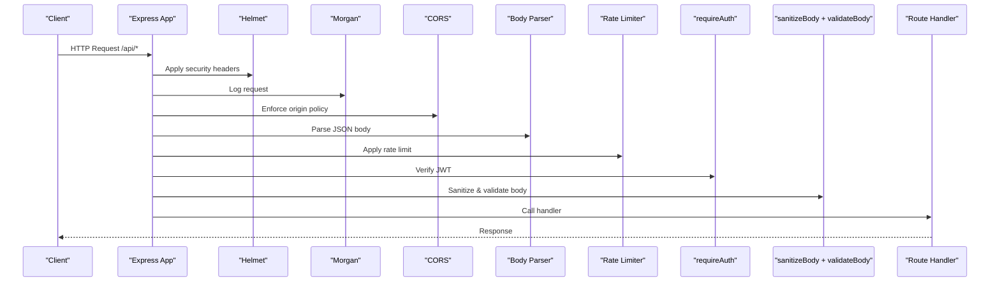
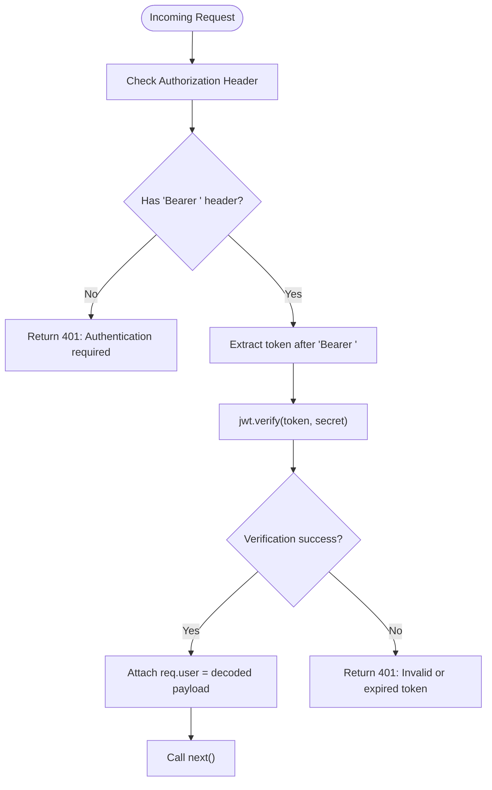
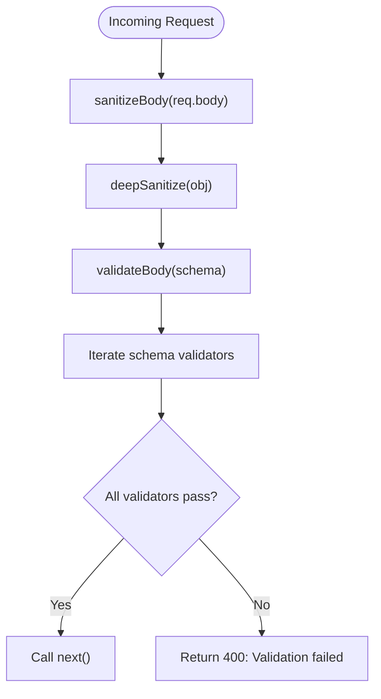
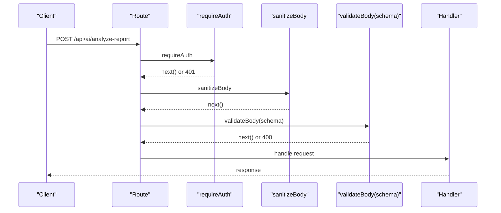
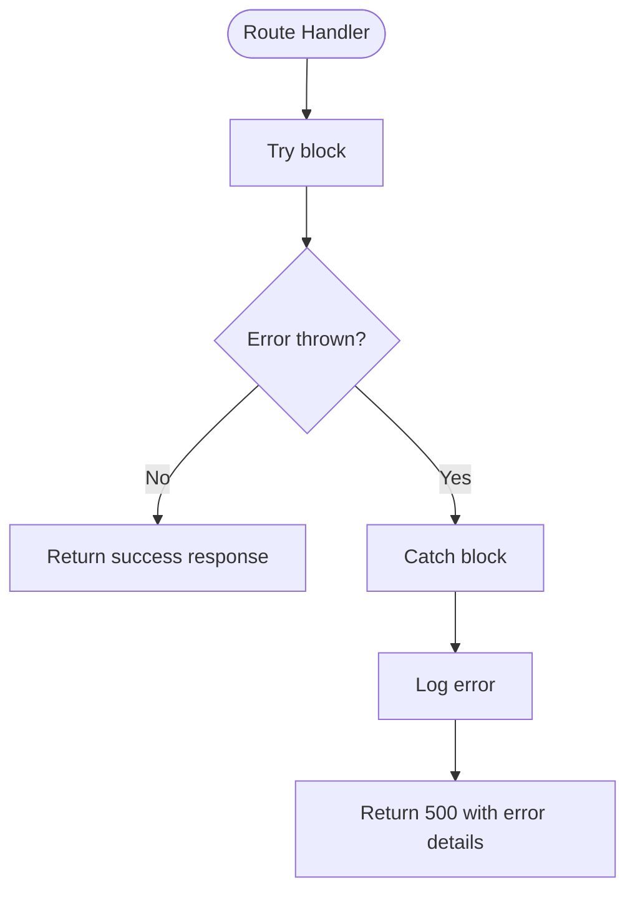
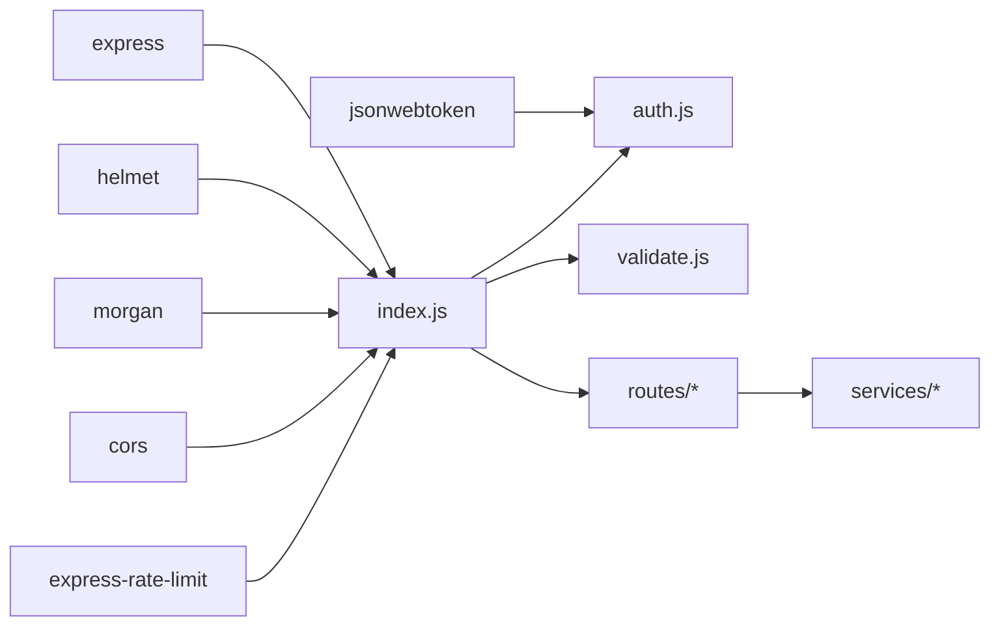

# Middleware Architecture

<cite>
**Referenced Files in This Document**
- [index.js](file://server/index.js)
- [auth.js](file://server/middleware/auth.js)
- [validate.js](file://server/middleware/validate.js)
- [config.js](file://server/config.js)
- [auth.js](file://server/routes/auth.js)
- [ai.js](file://server/routes/ai.js)
- [match.js](file://server/routes/match.js)
- [cache.js](file://server/services/cache.js)
- [quick-test.js](file://server/test/quick-test.js)
- [package.json](file://server/package.json)
</cite>

## Table of Contents
1. [Introduction](#introduction)
2. [Project Structure](#project-structure)
3. [Core Components](#core-components)
4. [Architecture Overview](#architecture-overview)
5. [Detailed Component Analysis](#detailed-component-analysis)
6. [Dependency Analysis](#dependency-analysis)
7. [Performance Considerations](#performance-considerations)
8. [Troubleshooting Guide](#troubleshooting-guide)
9. [Conclusion](#conclusion)

## Introduction
This document explains the middleware architecture and implementation patterns used in the backend API server. It covers the middleware stack configuration, execution order, dependency management, authentication middleware for JWT token validation and route protection, validation middleware for input sanitization and data validation, custom middleware development patterns, error propagation mechanisms, async/await handling in middleware chains, middleware composition and conditional execution, performance optimization techniques, testing strategies, debugging approaches, and common pitfalls.

## Project Structure
The server follows a layered architecture with middleware modules under server/middleware, route modules under server/routes, and shared services under server/services. The main entrypoint server/index.js configures the Express application and mounts middleware stacks and routes.

**Diagram sources**
- [index.js:1-118](file://server/index.js#L1-L118)
- [auth.js:1-49](file://server/middleware/auth.js#L1-L49)
- [validate.js:1-80](file://server/middleware/validate.js#L1-L80)
- [auth.js:1-83](file://server/routes/auth.js#L1-L83)
- [ai.js:1-348](file://server/routes/ai.js#L1-L348)
- [match.js:1-120](file://server/routes/match.js#L1-L120)
- [cache.js:1-66](file://server/services/cache.js#L1-L66)
- [config.js:1-35](file://server/config.js#L1-L35)

**Section sources**
- [index.js:1-118](file://server/index.js#L1-L118)
- [package.json:1-18](file://server/package.json#L1-L18)

## Core Components
- Authentication middleware: Validates JWT tokens from Authorization headers and attaches user metadata to requests.
- Validation middleware: Provides automatic input sanitization and schema-based validation with reusable validators.
- Route protection: Uses requireAuth to protect AI and matching endpoints.
- Rate limiting: Global and AI-specific rate limits configured at the application level.
- Body parsing: Configured with different limits for general and AI routes.
- CORS and security headers: Helmet and CORS configured centrally.
- Global error handling: Centralized error handler for uncaught exceptions.

**Section sources**
- [auth.js:14-48](file://server/middleware/auth.js#L14-L48)
- [validate.js:36-62](file://server/middleware/validate.js#L36-L62)
- [index.js:28-101](file://server/index.js#L28-L101)

## Architecture Overview
The middleware stack is configured in server/index.js and executed in a strict order for all /api/* routes. Authentication and validation middleware wrap route handlers, while global middleware like rate limiting and body parsing apply to all requests.

**Diagram sources**
- [index.js:28-76](file://server/index.js#L28-L76)
- [auth.js:14-37](file://server/middleware/auth.js#L14-L37)
- [validate.js:36-62](file://server/middleware/validate.js#L36-L62)

## Detailed Component Analysis

### Authentication Middleware
The authentication middleware validates JWT tokens from the Authorization header and attaches user metadata to the request object for downstream handlers.

Key behaviors:
- Expects Authorization: Bearer <token>
- Verifies token using the configured secret
- On success, attaches decoded payload (email, name, type) to req.user
- On failure, returns 401 with appropriate error messages

**Diagram sources**
- [auth.js:14-37](file://server/middleware/auth.js#L14-L37)

Implementation highlights:
- Uses jsonwebtoken library for verification
- Reads secret and expiration from environment-configured config
- Attaches user claims to req.user for route handlers

**Section sources**
- [auth.js:14-48](file://server/middleware/auth.js#L14-L48)
- [config.js:17-19](file://server/config.js#L17-L19)

### Validation Middleware
The validation middleware provides two complementary capabilities:
- Automatic input sanitization to remove XSS vectors and control characters
- Schema-based validation with reusable validator functions

**Diagram sources**
- [validate.js:36-62](file://server/middleware/validate.js#L36-L62)

Validator functions:
- required(label): Ensures non-empty string
- isString(label, maxLen): Validates string length
- isArray(label): Validates array type
- isObject(label): Validates object type

**Section sources**
- [validate.js:11-80](file://server/middleware/validate.js#L11-L80)

### Route Protection and Composition
Routes demonstrate middleware composition patterns:
- AI endpoints (/api/ai/*) use requireAuth, sanitizeBody, and validateBody
- Matching endpoints (/api/match/*) use requireAuth and sanitizeBody
- Authentication endpoints (/api/auth/*) are public (no auth middleware)

**Diagram sources**
- [ai.js:30-50](file://server/routes/ai.js#L30-L50)
- [match.js:33-77](file://server/routes/match.js#L33-L77)

**Section sources**
- [ai.js:1-348](file://server/routes/ai.js#L1-L348)
- [match.js:1-120](file://server/routes/match.js#L1-L120)

### Error Propagation and Global Error Handling
Error handling follows Express conventions:
- Validation middleware returns 400 with structured error details
- Authentication middleware returns 401 for missing/expired tokens
- Route handlers catch errors and return 500 with optional stack traces in non-production environments
- A centralized error handler catches unhandled exceptions and logs them

**Diagram sources**
- [ai.js:275-289](file://server/routes/ai.js#L275-L289)
- [match.js:69-76](file://server/routes/match.js#L69-L76)
- [index.js:95-101](file://server/index.js#L95-L101)

**Section sources**
- [ai.js:1-348](file://server/routes/ai.js#L1-L348)
- [match.js:1-120](file://server/routes/match.js#L1-L120)
- [index.js:95-101](file://server/index.js#L95-L101)

### Async/Await Handling in Middleware Chains
Async operations are handled consistently:
- Route handlers use async/await for external API calls and computations
- Middleware remains synchronous and delegates async work to route handlers
- Errors from async operations are caught in route try/catch blocks

Example patterns:
- AI endpoints await Gemini API calls and report analyzer services
- Matching endpoints compute rankings and cache results asynchronously

**Section sources**
- [ai.js:35-49](file://server/routes/ai.js#L35-L49)
- [ai.js:275-289](file://server/routes/ai.js#L275-L289)
- [match.js:38-77](file://server/routes/match.js#L38-L77)

### Conditional Execution and Performance Optimization
Conditional execution patterns:
- Route-level body size limits: 1MB for general routes, 10MB for AI routes
- Route-level rate limits: stricter limits for AI endpoints
- Cache-based optimization: MemoryCache stores computed match results with TTL and LRU eviction

Performance optimizations:
- MemoryCache tracks hits/misses and exposes hit rate metrics
- Pre-filtering by region reduces computation for large volunteer pools
- Weighted scoring algorithm optimized for readability and maintainability

**Section sources**
- [index.js:50-71](file://server/index.js#L50-L71)
- [cache.js:10-66](file://server/services/cache.js#L10-L66)
- [match.js:11-21](file://server/routes/match.js#L11-L21)
- [matchingEngine.js:166-182](file://server/services/matchingEngine.js#L166-L182)

## Dependency Analysis
The middleware stack depends on:
- Express for routing and middleware execution
- jsonwebtoken for JWT verification and signing
- helmet for security headers
- morgan for request logging
- cors for cross-origin policy
- express-rate-limit for rate limiting

**Diagram sources**
- [package.json:9-16](file://server/package.json#L9-L16)
- [index.js:16-25](file://server/index.js#L16-L25)
- [auth.js:1-2](file://server/middleware/auth.js#L1-L2)

**Section sources**
- [package.json:1-18](file://server/package.json#L1-L18)
- [index.js:16-25](file://server/index.js#L16-L25)

## Performance Considerations
- Middleware ordering matters: security headers and logging should precede body parsing and rate limiting
- Use route-specific body size limits to prevent memory pressure on expensive endpoints
- Implement caching for computationally intensive operations (matching engine)
- Monitor cache hit rates and tune TTL and max size based on workload
- Apply stricter rate limits to AI endpoints due to higher computational cost
- Keep validation middleware lightweight and deterministic

## Troubleshooting Guide
Common issues and resolutions:
- Authentication failures:
  - Ensure Authorization header includes "Bearer " prefix
  - Verify JWT_SECRET environment variable is set
  - Check token expiration and clock skew
- Validation errors:
  - Review 400 responses for field-specific error details
  - Confirm schema matches request payload structure
- Rate limiting:
  - Check IP-based rate limiting and adjust window/max values
  - Use separate limits for AI endpoints
- Cache performance:
  - Monitor cache stats endpoint for hit rates
  - Adjust TTL and max size based on usage patterns
- Testing:
  - Use quick-test.js to validate authentication and endpoint responses
  - Test error scenarios (missing fields, invalid tokens, empty payloads)

**Section sources**
- [quick-test.js:1-87](file://server/test/quick-test.js#L1-L87)
- [match.js:108-117](file://server/routes/match.js#L108-L117)

## Conclusion
The middleware architecture employs a clear, composable pattern with explicit separation of concerns. Authentication and validation middleware provide consistent security and data quality guarantees across all protected endpoints. The design emphasizes performance through selective rate limiting, caching, and route-specific configurations. Error handling is centralized and predictable, enabling robust debugging and maintenance. The modular structure supports easy extension and testing of new middleware components.