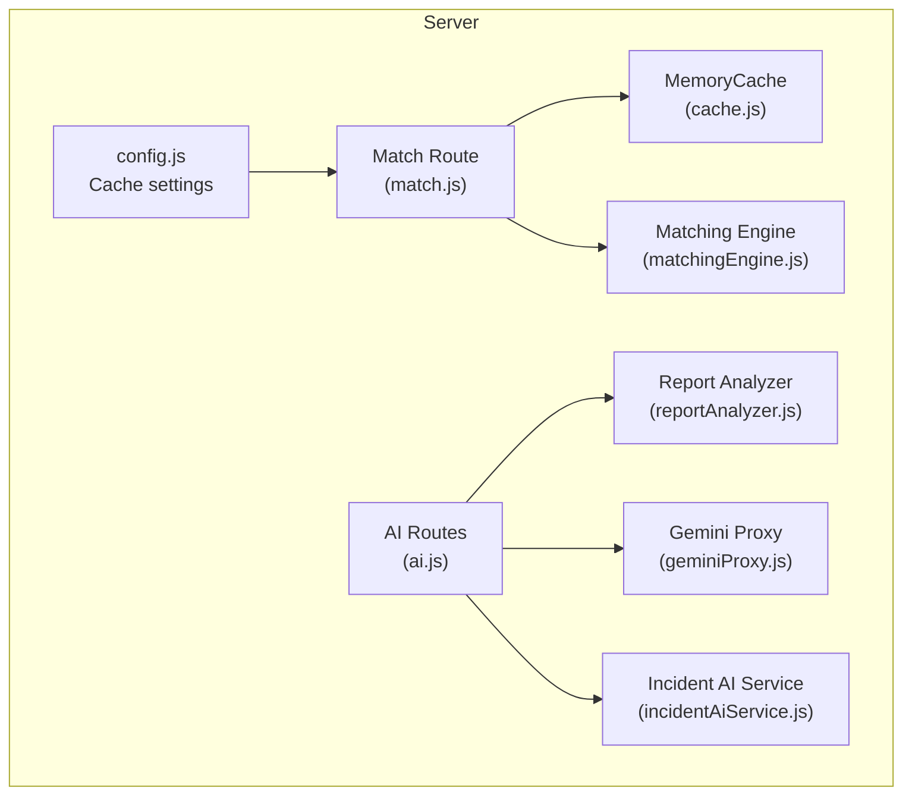
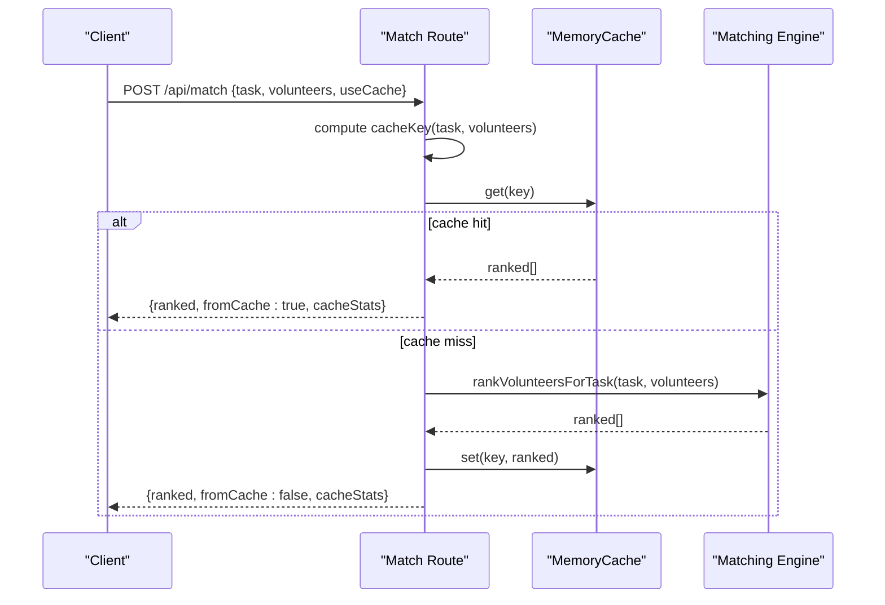
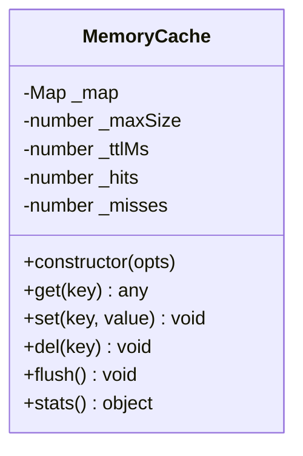
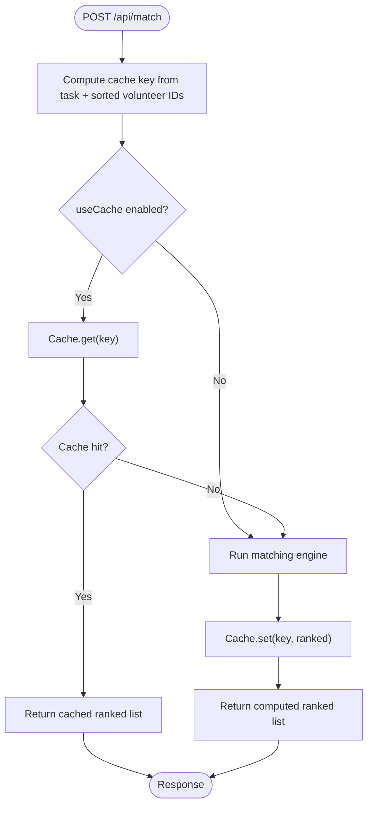
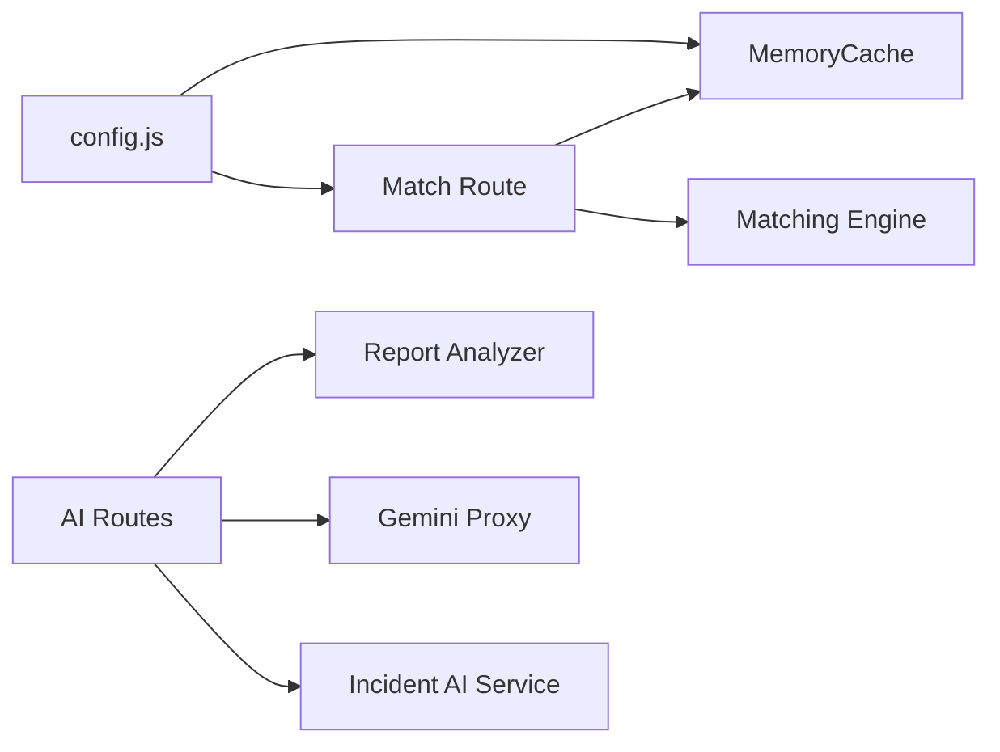

# Cache Management System

<cite>
**Referenced Files in This Document**
- [cache.js](file://server/services/cache.js)
- [config.js](file://server/config.js)
- [match.js](file://server/routes/match.js)
- [matchingEngine.js](file://server/services/matchingEngine.js)
- [ai.js](file://server/routes/ai.js)
- [reportAnalyzer.js](file://server/services/reportAnalyzer.js)
- [geminiProxy.js](file://server/services/geminiProxy.js)
- [incidentAiService.js](file://server/incidentAiService.js)
- [backendApi.js](file://src/services/backendApi.js)
- [api.js](file://src/services/api.js)
</cite>

## Table of Contents
1. [Introduction](#introduction)
2. [Project Structure](#project-structure)
3. [Core Components](#core-components)
4. [Architecture Overview](#architecture-overview)
5. [Detailed Component Analysis](#detailed-component-analysis)
6. [Dependency Analysis](#dependency-analysis)
7. [Performance Considerations](#performance-considerations)
8. [Troubleshooting Guide](#troubleshooting-guide)
9. [Conclusion](#conclusion)

## Introduction
This document describes the cache management system and performance optimization strategies implemented in the server. It focuses on the lightweight in-memory LRU cache with TTL eviction used for matching computations, along with configuration options, monitoring, and integration patterns. It also covers cache key strategies, performance monitoring, and operational guidance for cache warming, invalidation, and consistency.

## Project Structure
The cache system is centered around a small in-memory cache implementation and a dedicated route that integrates it with the matching engine. Supporting services include AI analysis and document parsing, which are configured to respect environment-driven limits and fallbacks.

**Diagram sources**
- [config.js:29-32](file://server/config.js#L29-L32)
- [cache.js:10-65](file://server/services/cache.js#L10-L65)
- [match.js:11-15](file://server/routes/match.js#L11-L15)
- [matchingEngine.js:166-182](file://server/services/matchingEngine.js#L166-L182)
- [ai.js:8](file://server/routes/ai.js#L8)](file://server/routes/ai.js#L8)
- [reportAnalyzer.js:576-607](file://server/services/reportAnalyzer.js#L576-L607)
- [geminiProxy.js:53-103](file://server/services/geminiProxy.js#L53-L103)
- [incidentAiService.js:170-188](file://server/incidentAiService.js#L170-L188)

**Section sources**
- [config.js:29-32](file://server/config.js#L29-L32)
- [cache.js:10-65](file://server/services/cache.js#L10-L65)
- [match.js:11-15](file://server/routes/match.js#L11-L15)
- [matchingEngine.js:166-182](file://server/services/matchingEngine.js#L166-L182)
- [ai.js:8](file://server/routes/ai.js#L8)
- [reportAnalyzer.js:576-607](file://server/services/reportAnalyzer.js#L576-L607)
- [geminiProxy.js:53-103](file://server/services/geminiProxy.js#L53-L103)
- [incidentAiService.js:170-188](file://server/incidentAiService.js#L170-L188)

## Core Components
- MemoryCache: An in-memory LRU cache with TTL eviction and hit/miss counters. It supports get/set/del/flush and exposes stats for monitoring.
- Match Route: Integrates MemoryCache with the matching engine to cache ranked volunteers for a given task and volunteer set.
- Configuration: Centralized cache settings (TTL and max size) exposed via environment variables.
- AI Services: Report analyzer and document parser services that can optionally fall back to keyword extraction when LLM is unavailable.

Key capabilities:
- Stable cache keys derived from task ID, category, and sorted volunteer IDs
- Configurable TTL and max size for cache entries
- Cache hit ratio monitoring via stats endpoint
- Optional cache bypass for debugging or forced recomputation

**Section sources**
- [cache.js:10-65](file://server/services/cache.js#L10-L65)
- [match.js:17-21](file://server/routes/match.js#L17-L21)
- [match.js:40-68](file://server/routes/match.js#L40-L68)
- [config.js:29-32](file://server/config.js#L29-L32)
- [reportAnalyzer.js:576-607](file://server/services/reportAnalyzer.js#L576-L607)

## Architecture Overview
The cache sits in front of the matching engine to avoid repeated computation for identical inputs. The AI services provide complementary caching opportunities at the application layer (client offline cache) and at the server LLM calls (fallback keyword extraction).

**Diagram sources**
- [match.js:33-76](file://server/routes/match.js#L33-L76)
- [cache.js:21-44](file://server/services/cache.js#L21-L44)
- [matchingEngine.js:166-182](file://server/services/matchingEngine.js#L166-L182)

## Detailed Component Analysis

### MemoryCache Implementation
MemoryCache provides:
- LRU eviction via insertion order tracking
- TTL-based expiration
- Hit/miss counters and hit rate calculation
- Stats endpoint for monitoring

**Diagram sources**
- [cache.js:10-65](file://server/services/cache.js#L10-L65)

**Section sources**
- [cache.js:10-65](file://server/services/cache.js#L10-L65)

### Match Route and Cache Integration
- Creates a MemoryCache instance using configuration-derived TTL and max size
- Generates a stable cache key from task and sorted volunteer IDs
- Supports opt-in caching via useCache flag
- Exposes cache-stats endpoint for monitoring

**Diagram sources**
- [match.js:17-21](file://server/routes/match.js#L17-L21)
- [match.js:40-68](file://server/routes/match.js#L40-L68)
- [cache.js:21-44](file://server/services/cache.js#L21-L44)

**Section sources**
- [match.js:11-15](file://server/routes/match.js#L11-L15)
- [match.js:17-21](file://server/routes/match.js#L17-L21)
- [match.js:40-68](file://server/routes/match.js#L40-L68)

### Cache Key Strategy
- Deterministic composition: task.id + task.category + sorted volunteer IDs
- Hashed to produce a stable, compact key
- Ensures cache coherency across runs and avoids collisions

Best practices:
- Always sort volunteer IDs to maintain determinism
- Include task metadata (id/category) to prevent cross-task collisions
- Consider hashing to keep key lengths bounded

**Section sources**
- [match.js:17-21](file://server/routes/match.js#L17-L21)

### Configuration Options
- matchCacheTtlMs: Controls TTL for match results (default 5 minutes)
- matchCacheMaxSize: Controls maximum number of cached entries
- Environment-driven tuning for production deployments

Operational guidance:
- Increase TTL for stable workloads with repetitive queries
- Increase max size for systems with many unique task/volunteer combinations
- Monitor hit rate to validate effectiveness

**Section sources**
- [config.js:29-32](file://server/config.js#L29-L32)

### Performance Monitoring
- Cache stats include size, max size, TTL, hits, misses, and hit rate
- Exposed via GET /api/match/cache-stats
- Client-side helper backendApi.getCacheStats() for convenience

Monitoring tips:
- Track hit rate over time; sustained low rates indicate misconfiguration or hot-spotting
- Watch cache size approaching max size; consider eviction tuning
- Correlate cache stats with latency improvements post-caching

**Section sources**
- [match.js:108-117](file://server/routes/match.js#L108-L117)
- [cache.js:52-64](file://server/services/cache.js#L52-L64)
- [backendApi.js:159-162](file://src/services/backendApi.js#L159-L162)

### Cache Warming and Preloading
- Not implemented in the current codebase
- Recommended approaches:
  - Warm hot task/volunteer combinations during startup or periodic maintenance windows
  - Pre-compute and set cache for frequently accessed tasks
  - Use batch recommendations endpoint to prime caches for upcoming shifts

[No sources needed since this section provides general guidance]

### Cache Invalidation Strategies
- Automatic TTL expiration removes stale entries
- Manual invalidation via del(key) or flush() supported
- Practical invalidation patterns:
  - Invalidate on task/volunteer updates affecting scoring
  - Invalidate on region or category filters changing
  - Periodic flush during maintenance windows

**Section sources**
- [cache.js:46-50](file://server/services/cache.js#L46-L50)

### Integration with AI Responses and Frequently Accessed Data
- AI services (report analyzer, document parsing, incident analysis) are configured to fall back to keyword extraction when LLM is unavailable. This reduces reliance on external APIs and improves resilience.
- Client-side offline cache (localStorage) stores snapshot and queue for offline actions, complementing server-side caching.

Operational benefits:
- Reduced external API dependency and improved SLA predictability
- Faster responses for common patterns via keyword extraction
- Offline-first UX with queued actions

**Section sources**
- [reportAnalyzer.js:576-607](file://server/services/reportAnalyzer.js#L576-L607)
- [geminiProxy.js:53-103](file://server/services/geminiProxy.js#L53-L103)
- [incidentAiService.js:170-188](file://server/incidentAiService.js#L170-L188)
- [api.js:13-24](file://src/services/api.js#L13-L24)

### Memory Management and Cleanup
- LRU eviction automatically removes least-recently-used entries when max size is exceeded
- TTL ensures stale entries are removed proactively
- Manual cleanup via del() and flush() for targeted maintenance

**Section sources**
- [cache.js:37-44](file://server/services/cache.js#L37-L44)
- [cache.js:21-34](file://server/services/cache.js#L21-L34)

### Distributed Caching Considerations
- The current implementation is in-process and not suitable for multi-instance deployments
- Production migration path:
  - Replace MemoryCache with a Redis-compatible client exposing the same API surface
  - Ensure consistent hashing and key normalization across instances
  - Consider cache-aside patterns with optimistic concurrency for distributed writes

[No sources needed since this section provides general guidance]

## Dependency Analysis
The cache system has minimal dependencies and is cleanly integrated into the matching pipeline. AI services depend on configuration for API keys and models, enabling graceful fallbacks.

**Diagram sources**
- [config.js:29-32](file://server/config.js#L29-L32)
- [cache.js:10-65](file://server/services/cache.js#L10-L65)
- [match.js:11-15](file://server/routes/match.js#L11-L15)
- [matchingEngine.js:166-182](file://server/services/matchingEngine.js#L166-L182)
- [ai.js:8](file://server/routes/ai.js#L8)
- [reportAnalyzer.js:576-607](file://server/services/reportAnalyzer.js#L576-L607)
- [geminiProxy.js:53-103](file://server/services/geminiProxy.js#L53-L103)
- [incidentAiService.js:170-188](file://server/incidentAiService.js#L170-L188)

**Section sources**
- [config.js:29-32](file://server/config.js#L29-L32)
- [cache.js:10-65](file://server/services/cache.js#L10-L65)
- [match.js:11-15](file://server/routes/match.js#L11-L15)
- [matchingEngine.js:166-182](file://server/services/matchingEngine.js#L166-L182)
- [ai.js:8](file://server/routes/ai.js#L8)
- [reportAnalyzer.js:576-607](file://server/services/reportAnalyzer.js#L576-L607)
- [geminiProxy.js:53-103](file://server/services/geminiProxy.js#L53-L103)
- [incidentAiService.js:170-188](file://server/incidentAiService.js#L170-L188)

## Performance Considerations
- Cache hit ratio: Monitor via stats endpoint; target high ratios for repetitive workloads
- TTL tuning: Balance freshness vs. performance; shorter TTLs reduce staleness but increase misses
- Max size tuning: Prevent memory pressure; adjust based on concurrent unique queries
- Region filtering: The matching engine pre-filters by region to reduce computation before scoring
- Client offline cache: Complement server caching with local storage snapshots and queues

[No sources needed since this section provides general guidance]

## Troubleshooting Guide
Common issues and resolutions:
- Low cache hit rate:
  - Verify cache key stability (ensure task and volunteer IDs are included)
  - Confirm useCache flag is enabled in requests
  - Check TTL is appropriate for workload patterns
- Stale results:
  - Force recomputation by disabling useCache or invalidating keys
  - Adjust TTL to balance freshness and performance
- High memory usage:
  - Reduce max size or TTL
  - Monitor cache stats and adjust accordingly
- AI service failures:
  - Confirm API keys are configured; fallback to keyword extraction is automatic
  - Validate request sizes and formats for LLM endpoints

**Section sources**
- [match.js:40-68](file://server/routes/match.js#L40-L68)
- [cache.js:52-64](file://server/services/cache.js#L52-L64)
- [reportAnalyzer.js:576-607](file://server/services/reportAnalyzer.js#L576-L607)

## Conclusion
The cache management system centers on a lightweight, in-memory LRU cache with TTL eviction, integrated tightly with the matching engine to deliver significant performance gains for repetitive computations. Configuration-driven tuning, robust monitoring, and clear invalidation strategies enable reliable operation. While the current implementation is single-instance, the modular design allows straightforward migration to distributed caching for production-scale deployments. Complementary AI fallbacks and client-side offline caching further enhance resilience and responsiveness.