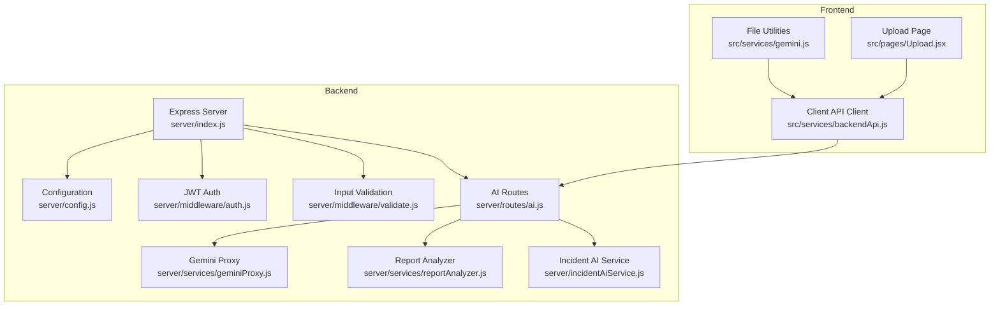
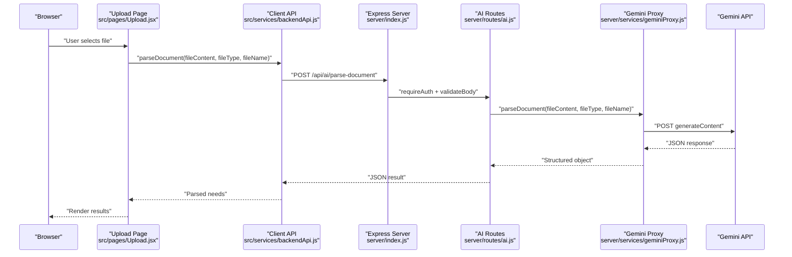
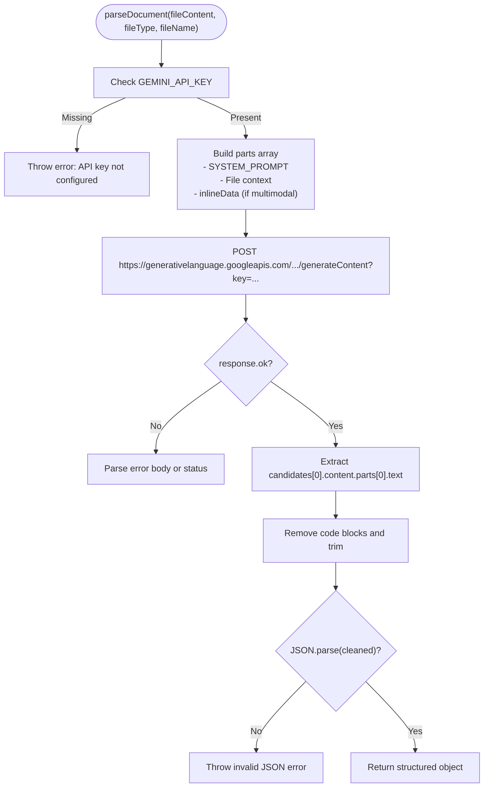
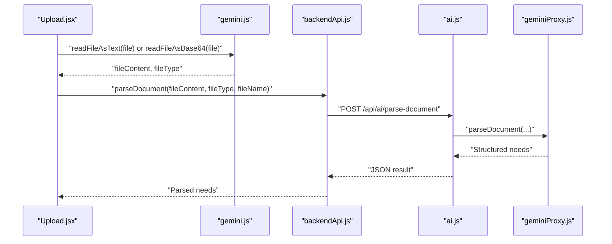
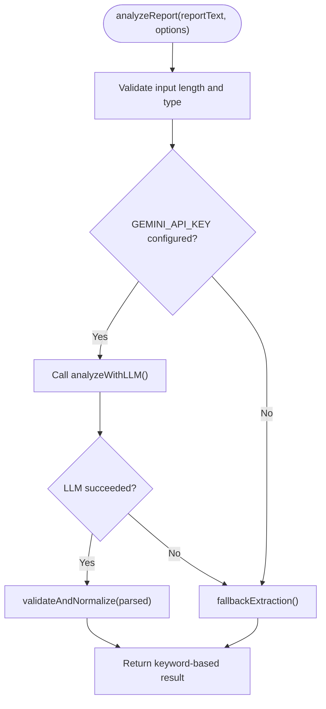
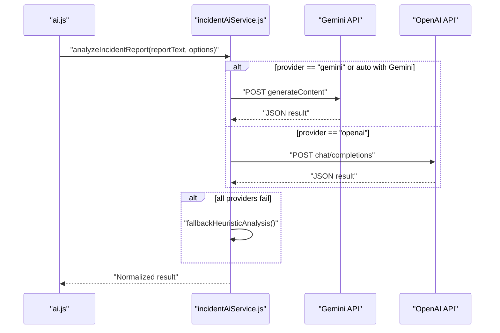
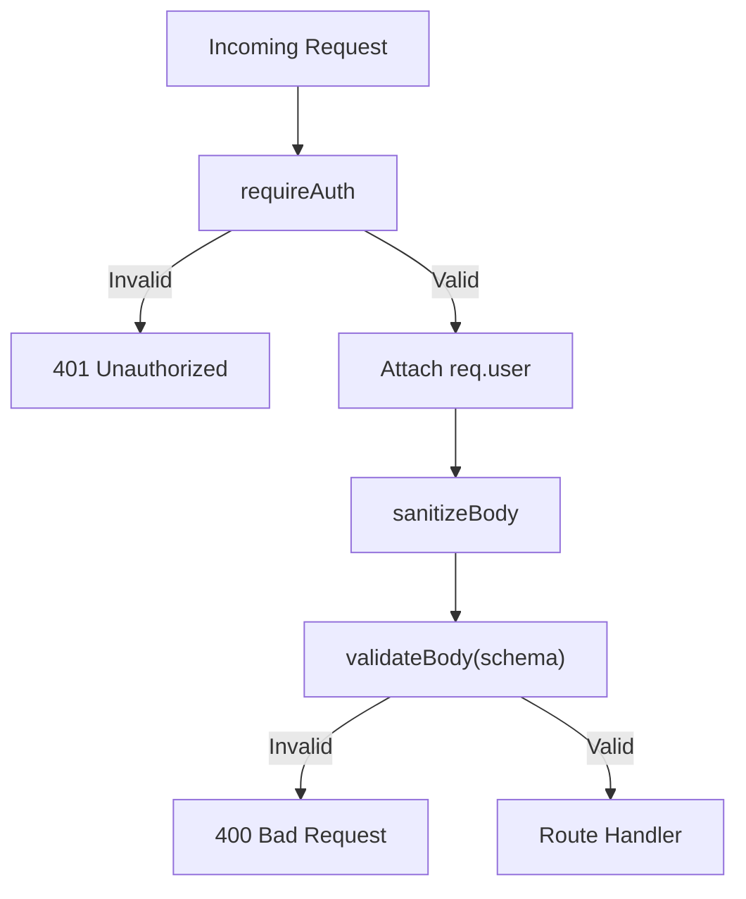
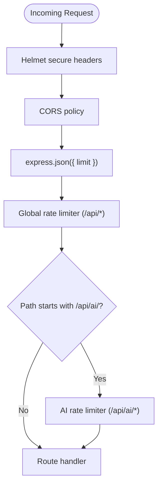
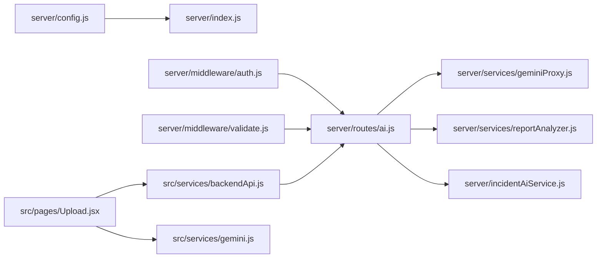

# Gemini AI Integration

<cite>
**Referenced Files in This Document**
- [server/index.js](file://server/index.js)
- [server/config.js](file://server/config.js)
- [server/middleware/auth.js](file://server/middleware/auth.js)
- [server/middleware/validate.js](file://server/middleware/validate.js)
- [server/routes/ai.js](file://server/routes/ai.js)
- [server/services/geminiProxy.js](file://server/services/geminiProxy.js)
- [server/services/reportAnalyzer.js](file://server/services/reportAnalyzer.js)
- [server/incidentAiService.js](file://server/incidentAiService.js)
- [src/services/backendApi.js](file://src/services/backendApi.js)
- [src/services/gemini.js](file://src/services/gemini.js)
- [src/pages/Upload.jsx](file://src/pages/Upload.jsx)
- [src/utils/aiLogic.js](file://src/utils/aiLogic.js)
</cite>

## Table of Contents
1. [Introduction](#introduction)
2. [Project Structure](#project-structure)
3. [Core Components](#core-components)
4. [Architecture Overview](#architecture-overview)
5. [Detailed Component Analysis](#detailed-component-analysis)
6. [Dependency Analysis](#dependency-analysis)
7. [Performance Considerations](#performance-considerations)
8. [Troubleshooting Guide](#troubleshooting-guide)
9. [Conclusion](#conclusion)

## Introduction
This document explains the Gemini AI integration patterns and secure API proxy implementation used by the system. It covers the Gemini proxy service architecture, system prompts, content parsing, structured JSON extraction, API key management, request/response handling, error management, document parsing workflows for text, PDF, and images, AI response processing, JSON cleaning mechanisms, validation procedures, security considerations, rate limiting strategies, fallback mechanisms, and troubleshooting guidance.

## Project Structure
The integration spans both frontend and backend layers:
- Frontend: file upload UI, client-side file reading utilities, and a thin HTTP client for backend APIs.
- Backend: Express server with secure headers, rate limiting, authentication, validation, and AI endpoints.
- AI services: Gemini proxy for document parsing, report analyzer with LLM and keyword fallback, and incident analysis service.

**Diagram sources**
- [server/index.js:16-120](file://server/index.js#L16-L120)
- [server/routes/ai.js:1-421](file://server/routes/ai.js#L1-L421)
- [server/services/geminiProxy.js:1-104](file://server/services/geminiProxy.js#L1-L104)
- [server/services/reportAnalyzer.js:1-646](file://server/services/reportAnalyzer.js#L1-L646)
- [server/incidentAiService.js:1-189](file://server/incidentAiService.js#L1-L189)
- [src/services/backendApi.js:1-164](file://src/services/backendApi.js#L1-L164)
- [src/services/gemini.js:1-38](file://src/services/gemini.js#L1-L38)
- [src/pages/Upload.jsx:1-438](file://src/pages/Upload.jsx#L1-L438)

**Section sources**
- [server/index.js:16-120](file://server/index.js#L16-L120)
- [server/config.js:1-35](file://server/config.js#L1-L35)
- [server/middleware/auth.js:1-49](file://server/middleware/auth.js#L1-L49)
- [server/middleware/validate.js:1-80](file://server/middleware/validate.js#L1-L80)
- [server/routes/ai.js:1-421](file://server/routes/ai.js#L1-L421)
- [server/services/geminiProxy.js:1-104](file://server/services/geminiProxy.js#L1-L104)
- [server/services/reportAnalyzer.js:1-646](file://server/services/reportAnalyzer.js#L1-L646)
- [server/incidentAiService.js:1-189](file://server/incidentAiService.js#L1-L189)
- [src/services/backendApi.js:1-164](file://src/services/backendApi.js#L1-L164)
- [src/services/gemini.js:1-38](file://src/services/gemini.js#L1-L38)
- [src/pages/Upload.jsx:1-438](file://src/pages/Upload.jsx#L1-L438)

## Core Components
- Secure Gemini Proxy: Validates configuration, constructs multimodal prompts, sends requests to Gemini, cleans JSON responses, and parses structured outputs.
- Report Analyzer: Uses Gemini LLM with JSON response constraints and falls back to keyword-based extraction when LLM is unavailable.
- Incident AI Service: Multi-provider incident analysis with JSON normalization and deterministic fallback heuristics.
- Frontend Client: Provides file reading utilities and a typed HTTP client to the backend AI endpoints.
- Authentication and Validation: JWT-based auth and input sanitization/validation middleware.
- Rate Limiting and Security: Helmet headers, CORS, global and AI-specific rate limits, and body size limits.

**Section sources**
- [server/services/geminiProxy.js:41-104](file://server/services/geminiProxy.js#L41-L104)
- [server/services/reportAnalyzer.js:400-607](file://server/services/reportAnalyzer.js#L400-L607)
- [server/incidentAiService.js:90-189](file://server/incidentAiService.js#L90-L189)
- [src/services/gemini.js:1-38](file://src/services/gemini.js#L1-L38)
- [src/services/backendApi.js:56-164](file://src/services/backendApi.js#L56-L164)
- [server/middleware/auth.js:14-49](file://server/middleware/auth.js#L14-L49)
- [server/middleware/validate.js:11-80](file://server/middleware/validate.js#L11-L80)
- [server/index.js:28-76](file://server/index.js#L28-L76)

## Architecture Overview
The system enforces a strict separation of concerns:
- Client-side never handles API keys; all Gemini calls go through backend routes.
- Backend routes apply authentication, validation, and rate limiting before invoking AI services.
- AI services encapsulate Gemini API interactions, JSON cleaning, and validation.
- Frontend uses a typed HTTP client to call backend endpoints.

**Diagram sources**
- [src/pages/Upload.jsx:25-81](file://src/pages/Upload.jsx#L25-L81)
- [src/services/backendApi.js:90-95](file://src/services/backendApi.js#L90-L95)
- [server/index.js:74-76](file://server/index.js#L74-L76)
- [server/routes/ai.js:31-51](file://server/routes/ai.js#L31-L51)
- [server/services/geminiProxy.js:53-103](file://server/services/geminiProxy.js#L53-L103)

## Detailed Component Analysis

### Secure Gemini Proxy
The proxy centralizes Gemini interactions with strong safeguards:
- System prompt enforces strict JSON output and extraction rules.
- MIME type mapping ensures correct inlineData format for images/PDF.
- JSON cleaning removes code blocks and trims whitespace.
- Response validation ensures structured output and throws descriptive errors.

**Diagram sources**
- [server/services/geminiProxy.js:53-103](file://server/services/geminiProxy.js#L53-L103)

**Section sources**
- [server/services/geminiProxy.js:9-39](file://server/services/geminiProxy.js#L9-L39)
- [server/services/geminiProxy.js:41-104](file://server/services/geminiProxy.js#L41-L104)

### Frontend File Parsing Pipeline
The frontend orchestrates file ingestion and delegates AI processing to the backend:
- Detects file type (text, image, PDF).
- Reads text or base64 encodes binary content.
- Calls backend via typed client.
- Renders results and provides fallback behavior when API key is missing.

**Diagram sources**
- [src/pages/Upload.jsx:25-81](file://src/pages/Upload.jsx#L25-L81)
- [src/services/gemini.js:15-31](file://src/services/gemini.js#L15-L31)
- [src/services/backendApi.js:90-95](file://src/services/backendApi.js#L90-L95)
- [server/routes/ai.js:31-51](file://server/routes/ai.js#L31-L51)
- [server/services/geminiProxy.js:53-103](file://server/services/geminiProxy.js#L53-L103)

**Section sources**
- [src/pages/Upload.jsx:25-81](file://src/pages/Upload.jsx#L25-L81)
- [src/services/gemini.js:15-31](file://src/services/gemini.js#L15-L31)
- [src/services/backendApi.js:90-95](file://src/services/backendApi.js#L90-L95)

### Report Analyzer Service
The analyzer provides robust extraction with LLM-first and keyword-fallback strategies:
- LLM extraction uses a strict JSON system prompt and validates/normalizes output.
- Keyword-based fallback extracts location, urgency, needs, and affected counts.
- Confidence scoring and reasoning metadata are included for transparency.

**Diagram sources**
- [server/services/reportAnalyzer.js:576-607](file://server/services/reportAnalyzer.js#L576-L607)
- [server/services/reportAnalyzer.js:522-565](file://server/services/reportAnalyzer.js#L522-L565)
- [server/services/reportAnalyzer.js:379-397](file://server/services/reportAnalyzer.js#L379-L397)

**Section sources**
- [server/services/reportAnalyzer.js:400-461](file://server/services/reportAnalyzer.js#L400-L461)
- [server/services/reportAnalyzer.js:466-517](file://server/services/reportAnalyzer.js#L466-L517)
- [server/services/reportAnalyzer.js:522-565](file://server/services/reportAnalyzer.js#L522-L565)
- [server/services/reportAnalyzer.js:379-397](file://server/services/reportAnalyzer.js#L379-L397)

### Incident AI Service
The incident service supports multiple providers with deterministic fallback:
- Builds a strict JSON system prompt.
- Calls Gemini or OpenAI depending on configuration.
- Normalizes results and falls back to heuristic extraction when providers fail.

**Diagram sources**
- [server/routes/ai.js:56-77](file://server/routes/ai.js#L56-L77)
- [server/incidentAiService.js:170-189](file://server/incidentAiService.js#L170-L189)
- [server/incidentAiService.js:117-141](file://server/incidentAiService.js#L117-L141)
- [server/incidentAiService.js:143-168](file://server/incidentAiService.js#L143-L168)
- [server/incidentAiService.js:46-88](file://server/incidentAiService.js#L46-L88)

**Section sources**
- [server/incidentAiService.js:90-115](file://server/incidentAiService.js#L90-L115)
- [server/incidentAiService.js:117-141](file://server/incidentAiService.js#L117-L141)
- [server/incidentAiService.js:143-168](file://server/incidentAiService.js#L143-L168)
- [server/incidentAiService.js:170-189](file://server/incidentAiService.js#L170-L189)

### Authentication and Input Validation
- JWT authentication middleware verifies bearer tokens and attaches user context.
- Input validation sanitizes bodies and enforces schema constraints.
- Both are applied to AI routes to protect sensitive endpoints.

**Diagram sources**
- [server/middleware/auth.js:14-37](file://server/middleware/auth.js#L14-L37)
- [server/middleware/validate.js:36-62](file://server/middleware/validate.js#L36-L62)
- [server/routes/ai.js:31-51](file://server/routes/ai.js#L31-L51)

**Section sources**
- [server/middleware/auth.js:14-37](file://server/middleware/auth.js#L14-L37)
- [server/middleware/validate.js:36-62](file://server/middleware/validate.js#L36-L62)
- [server/routes/ai.js:31-51](file://server/routes/ai.js#L31-L51)

### Rate Limiting and Security
- Helmet sets secure headers.
- CORS restricts origins and methods.
- Global rate limiter protects all endpoints.
- Stricter AI rate limiter protects expensive operations.
- Body size limits accommodate file uploads.

**Diagram sources**
- [server/index.js:28-76](file://server/index.js#L28-L76)

**Section sources**
- [server/index.js:28-76](file://server/index.js#L28-L76)
- [server/config.js:21-32](file://server/config.js#L21-L32)

## Dependency Analysis
The system exhibits clear separation of concerns with minimal coupling:
- Frontend depends on a typed HTTP client and file utilities.
- Backend routes depend on middleware and services.
- Services encapsulate external API interactions and data transformations.
- Configuration is centralized and environment-driven.

**Diagram sources**
- [server/config.js:1-35](file://server/config.js#L1-L35)
- [server/index.js:16-120](file://server/index.js#L16-L120)
- [server/middleware/auth.js:1-49](file://server/middleware/auth.js#L1-L49)
- [server/middleware/validate.js:1-80](file://server/middleware/validate.js#L1-L80)
- [server/routes/ai.js:1-421](file://server/routes/ai.js#L1-L421)
- [server/services/geminiProxy.js:1-104](file://server/services/geminiProxy.js#L1-L104)
- [server/services/reportAnalyzer.js:1-646](file://server/services/reportAnalyzer.js#L1-L646)
- [server/incidentAiService.js:1-189](file://server/incidentAiService.js#L1-L189)
- [src/services/backendApi.js:1-164](file://src/services/backendApi.js#L1-L164)
- [src/services/gemini.js:1-38](file://src/services/gemini.js#L1-L38)
- [src/pages/Upload.jsx:1-438](file://src/pages/Upload.jsx#L1-L438)

**Section sources**
- [server/config.js:1-35](file://server/config.js#L1-L35)
- [server/index.js:16-120](file://server/index.js#L16-L120)
- [server/routes/ai.js:1-421](file://server/routes/ai.js#L1-L421)

## Performance Considerations
- Rate limiting prevents abuse and protects expensive LLM calls.
- Strict JSON constraints reduce post-processing overhead.
- Body size limits prevent memory pressure from large uploads.
- Caching is implemented in the matching engine (not covered here).
- Consider adding response caching for repeated identical requests and connection pooling for Gemini.

[No sources needed since this section provides general guidance]

## Troubleshooting Guide
Common Gemini API errors and remedies:
- Missing API key: Ensure the server environment includes the Gemini key; the proxy checks for it and throws a descriptive error.
- Invalid JSON response: The proxy strips code blocks and validates JSON; if parsing fails, it logs the raw text and returns an error.
- Gemini request failures: The routes catch non-OK responses and return structured error payloads.
- Authentication failures: Verify JWT token presence and validity; the auth middleware returns 401 with hints.
- Input validation errors: The validation middleware returns 400 with field-specific details.

Operational checks:
- Health endpoint indicates Gemini configuration status.
- Request logs help diagnose latency and error patterns.
- Rate limit messages indicate throttling; adjust limits or retry timing.

**Section sources**
- [server/services/geminiProxy.js:54-56](file://server/services/geminiProxy.js#L54-L56)
- [server/services/geminiProxy.js:98-102](file://server/services/geminiProxy.js#L98-L102)
- [server/routes/ai.js:43-49](file://server/routes/ai.js#L43-L49)
- [server/middleware/auth.js:17-36](file://server/middleware/auth.js#L17-L36)
- [server/index.js:79-87](file://server/index.js#L79-L87)

## Conclusion
The Gemini AI integration follows a secure, layered architecture:
- API keys remain server-side via a dedicated proxy.
- Strict JSON constraints and validation ensure reliable outputs.
- Robust fallbacks (keyword extraction, heuristics) maintain resilience.
- Strong security and rate limiting protect the system.
- Clear separation of concerns enables maintainability and scalability.