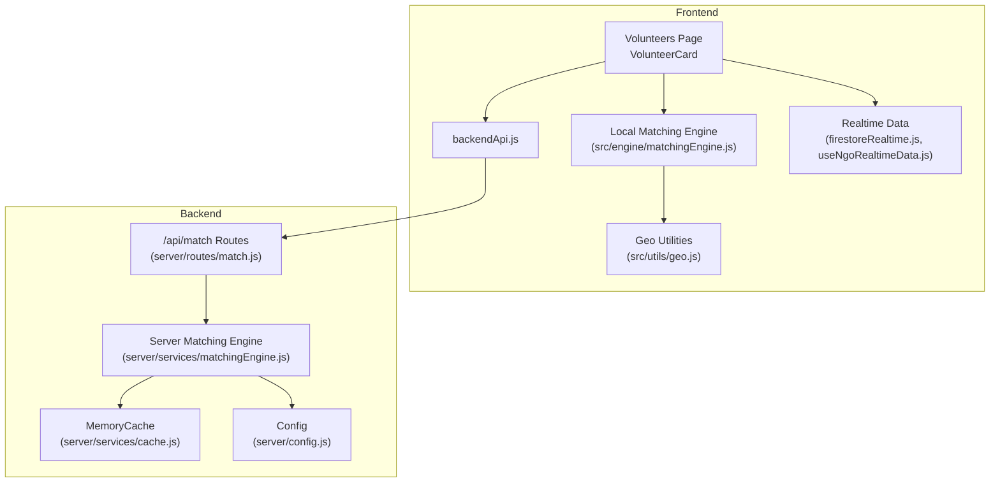
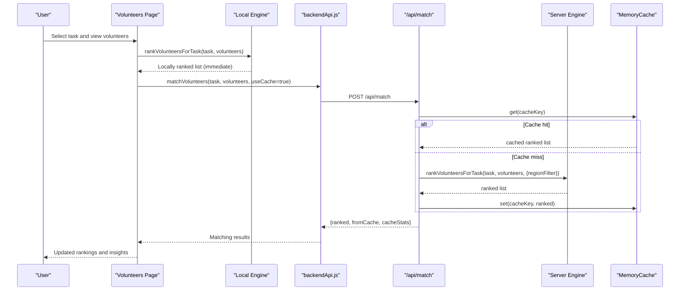
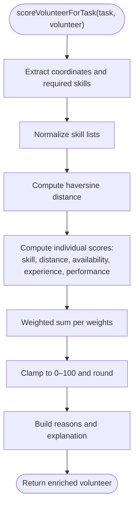
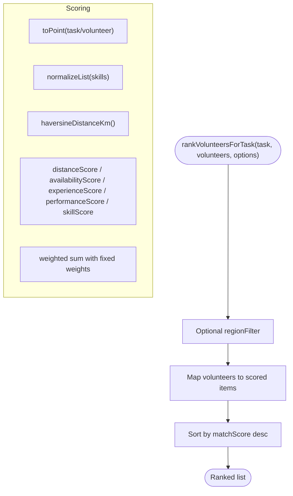
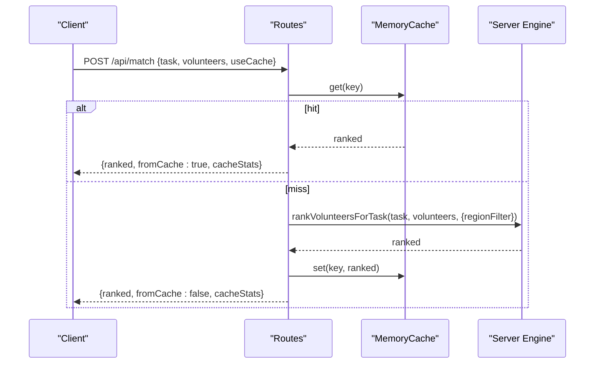
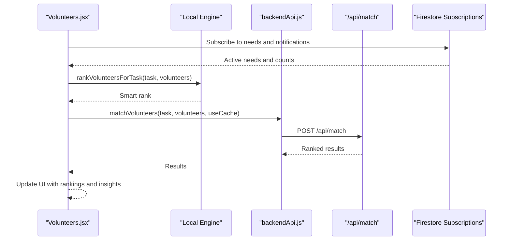
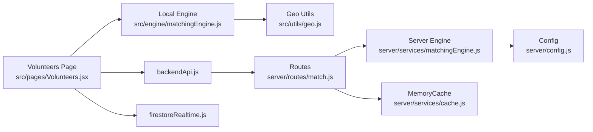

# Matching Engine Service

<cite>
**Referenced Files in This Document**
- [matchingEngine.js](file://src/engine/matchingEngine.js)
- [matchingEngine.js](file://server/services/matchingEngine.js)
- [matchingEngine.js](file://src/services/intelligence/matchingEngine.js)
- [match.js](file://server/routes/match.js)
- [geo.js](file://src/utils/geo.js)
- [cache.js](file://server/services/cache.js)
- [config.js](file://server/config.js)
- [backendApi.js](file://src/services/backendApi.js)
- [Volunteers.jsx](file://src/pages/Volunteers.jsx)
- [VolunteerCard.jsx](file://src/components/volunteers/VolunteerCard.jsx)
- [firestoreRealtime.js](file://src/services/firestoreRealtime.js)
- [useNgoRealtimeData.js](file://src/hooks/useNgoRealtimeData.js)
- [index.js](file://src/api/index.js)
</cite>

## Table of Contents
1. [Introduction](#introduction)
2. [Project Structure](#project-structure)
3. [Core Components](#core-components)
4. [Architecture Overview](#architecture-overview)
5. [Detailed Component Analysis](#detailed-component-analysis)
6. [Dependency Analysis](#dependency-analysis)
7. [Performance Considerations](#performance-considerations)
8. [Troubleshooting Guide](#troubleshooting-guide)
9. [Conclusion](#conclusion)
10. [Appendices](#appendices)

## Introduction
This document explains the volunteer matching engine service integration and algorithm coordination across the frontend and backend. It covers the matching algorithm implementation (proximity calculations, skill matching, availability checking), the scoring system for volunteer ranking, distance-based weighting, and priority-based assignment. It also documents integration patterns between the frontend and backend matching services, including real-time matching updates and conflict resolution. Performance optimization techniques, caching strategies, and scalability considerations are included, along with examples of matching scenarios, algorithm parameters, and troubleshooting guidance for matching conflicts. Finally, it addresses coordination between local and centralized matching engines.

## Project Structure
The matching engine spans three layers:
- Local client-side engine for quick UI ranking and immediate feedback
- Server-side engine for consistent, cached, and scalable batch recommendations
- Frontend integration for real-time updates and user actions

**Diagram sources**
- [Volunteers.jsx:1-328](file://src/pages/Volunteers.jsx#L1-328)
- [VolunteerCard.jsx:1-269](file://src/components/volunteers/VolunteerCard.jsx#L1-269)
- [backendApi.js:1-164](file://src/services/backendApi.js#L1-164)
- [match.js:1-120](file://server/routes/match.js#L1-120)
- [matchingEngine.js:1-212](file://server/services/matchingEngine.js#L1-212)
- [cache.js:1-66](file://server/services/cache.js#L1-66)
- [config.js:1-35](file://server/config.js#L1-35)
- [geo.js:1-37](file://src/utils/geo.js#L1-37)
- [firestoreRealtime.js:1-212](file://src/services/firestoreRealtime.js#L1-212)
- [useNgoRealtimeData.js:1-83](file://src/hooks/useNgoRealtimeData.js#L1-83)

**Section sources**
- [Volunteers.jsx:1-328](file://src/pages/Volunteers.jsx#L1-328)
- [backendApi.js:1-164](file://src/services/backendApi.js#L1-164)
- [match.js:1-120](file://server/routes/match.js#L1-120)
- [matchingEngine.js:1-212](file://server/services/matchingEngine.js#L1-212)
- [cache.js:1-66](file://server/services/cache.js#L1-66)
- [config.js:1-35](file://server/config.js#L1-35)
- [geo.js:1-37](file://src/utils/geo.js#L1-37)
- [firestoreRealtime.js:1-212](file://src/services/firestoreRealtime.js#L1-212)
- [useNgoRealtimeData.js:1-83](file://src/hooks/useNgoRealtimeData.js#L1-83)

## Core Components
- Local client-side matching engine: Implements proximity scoring, skill normalization, availability, experience, and performance scoring; produces matchScore and assignmentScore for UI ranking.
- Server-side matching engine: Reproduces the same scoring logic with an embedded Haversine implementation; supports region filtering and batch recommendations; caches results for performance.
- Backend route: Exposes /api/match and /api/match/recommend with authentication, sanitization, validation, and cache integration.
- Frontend integration: Uses local engine for live UI ranking and backend engine for authoritative, cached results; integrates with realtime data and user actions.
- Caching: In-memory cache with TTL and LRU eviction; exposed via a monitoring endpoint.
- Real-time data: Subscriptions to Firebase for needs, notifications, and counts; used to drive selection and updates.

**Section sources**
- [matchingEngine.js:1-174](file://src/engine/matchingEngine.js#L1-174)
- [matchingEngine.js:1-212](file://server/services/matchingEngine.js#L1-212)
- [match.js:1-120](file://server/routes/match.js#L1-120)
- [cache.js:1-66](file://server/services/cache.js#L1-66)
- [Volunteers.jsx:1-328](file://src/pages/Volunteers.jsx#L1-328)
- [VolunteerCard.jsx:1-269](file://src/components/volunteers/VolunteerCard.jsx#L1-269)
- [firestoreRealtime.js:1-212](file://src/services/firestoreRealtime.js#L1-212)
- [useNgoRealtimeData.js:1-83](file://src/hooks/useNgoRealtimeData.js#L1-83)

## Architecture Overview
The system coordinates two matching engines:
- Local engine runs in the browser for immediate UI feedback and lightweight ranking.
- Centralized engine runs on the server for consistent, cached, and scalable computations.

**Diagram sources**
- [Volunteers.jsx:140-157](file://src/pages/Volunteers.jsx#L140-157)
- [backendApi.js:134-139](file://src/services/backendApi.js#L134-139)
- [match.js:33-77](file://server/routes/match.js#L33-77)
- [matchingEngine.js:166-182](file://server/services/matchingEngine.js#L166-182)
- [cache.js:21-44](file://server/services/cache.js#L21-44)

## Detailed Component Analysis

### Local Matching Engine (Client-Side)
Implements proximity scoring using Haversine distance, skill matching with normalized tokens, availability, experience, and performance scoring. Produces:
- matchScore (0–100)
- assignmentScore (matchScore normalized to 0–1)
- skillScore (normalized for UI)
- distanceKm
- aiMatchLabel and aiMatchReasons
- explanation array for transparency

**Diagram sources**
- [matchingEngine.js:88-141](file://src/engine/matchingEngine.js#L88-141)

**Section sources**
- [matchingEngine.js:1-174](file://src/engine/matchingEngine.js#L1-174)
- [geo.js:15-29](file://src/utils/geo.js#L15-29)

### Server-Side Matching Engine
Replicates the client scoring logic with an embedded Haversine implementation and adds:
- Region-based pre-filtering to reduce computation on large datasets
- Batch recommendations with auto-assignment support
- Consistent weights and thresholds across environments

**Diagram sources**
- [matchingEngine.js:166-182](file://server/services/matchingEngine.js#L166-182)
- [matchingEngine.js:110-157](file://server/services/matchingEngine.js#L110-157)

**Section sources**
- [matchingEngine.js:1-212](file://server/services/matchingEngine.js#L1-212)

### Backend Routes and Caching
- POST /api/match: Ranks a single task against a list of volunteers; supports cache lookup and TTL eviction; returns cache metadata.
- POST /api/match/recommend: Generates recommendations for multiple tasks with optional auto-assignment.
- GET /api/match/cache-stats: Exposes cache hit rate and statistics for monitoring.

**Diagram sources**
- [match.js:33-77](file://server/routes/match.js#L33-77)
- [cache.js:21-44](file://server/services/cache.js#L21-44)
- [matchingEngine.js:166-182](file://server/services/matchingEngine.js#L166-182)

**Section sources**
- [match.js:1-120](file://server/routes/match.js#L1-120)
- [cache.js:1-66](file://server/services/cache.js#L1-66)
- [config.js:29-32](file://server/config.js#L29-32)

### Frontend Integration and Real-Time Updates
- Volunteers page loads needs and volunteers, computes a local ranking for immediate UI, and optionally calls the backend for authoritative results.
- Volunteer cards render assignmentScore, aiMatchReasons, and explanations; integrate with precise travel time calculations.
- Realtime subscriptions keep needs and notifications up to date; selection changes trigger recomputation.

**Diagram sources**
- [Volunteers.jsx:97-157](file://src/pages/Volunteers.jsx#L97-157)
- [VolunteerCard.jsx:31-35](file://src/components/volunteers/VolunteerCard.jsx#L31-35)
- [backendApi.js:134-139](file://src/services/backendApi.js#L134-139)
- [firestoreRealtime.js:61-73](file://src/services/firestoreRealtime.js#L61-73)

**Section sources**
- [Volunteers.jsx:1-328](file://src/pages/Volunteers.jsx#L1-328)
- [VolunteerCard.jsx:1-269](file://src/components/volunteers/VolunteerCard.jsx#L1-269)
- [backendApi.js:1-164](file://src/services/backendApi.js#L1-164)
- [firestoreRealtime.js:1-212](file://src/services/firestoreRealtime.js#L1-212)
- [useNgoRealtimeData.js:1-83](file://src/hooks/useNgoRealtimeData.js#L1-83)
- [index.js:1-11](file://src/api/index.js#L1-11)

### Alternative Intelligence Matching Engine
A simpler, legacy-style engine exists under src/services/intelligence/matchingEngine.js with ad-hoc scoring rules and distance penalties. While not used by default, it demonstrates an alternate approach to proximity and skill matching.

**Section sources**
- [matchingEngine.js:1-59](file://src/services/intelligence/matchingEngine.js#L1-59)

## Dependency Analysis
- Local engine depends on geo utilities for distance calculation.
- Server engine is self-contained with its own Haversine implementation and relies on configuration for cache tuning.
- Routes depend on the server engine and cache; they also depend on authentication and validation middleware.
- Frontend depends on backend APIs and realtime subscriptions; it also uses travel time utilities for precise distances.

**Diagram sources**
- [matchingEngine.js](file://src/engine/matchingEngine.js#L1)
- [matchingEngine.js](file://server/services/matchingEngine.js#L1)
- [match.js](file://server/routes/match.js#L1)
- [cache.js](file://server/services/cache.js#L1)
- [config.js](file://server/config.js#L1)
- [Volunteers.jsx](file://src/pages/Volunteers.jsx#L1)
- [backendApi.js](file://src/services/backendApi.js#L1)
- [firestoreRealtime.js](file://src/services/firestoreRealtime.js#L1)

**Section sources**
- [matchingEngine.js:1-174](file://src/engine/matchingEngine.js#L1-174)
- [matchingEngine.js:1-212](file://server/services/matchingEngine.js#L1-212)
- [match.js:1-120](file://server/routes/match.js#L1-120)
- [cache.js:1-66](file://server/services/cache.js#L1-66)
- [config.js:1-35](file://server/config.js#L1-35)
- [Volunteers.jsx:1-328](file://src/pages/Volunteers.jsx#L1-328)
- [backendApi.js:1-164](file://src/services/backendApi.js#L1-164)
- [firestoreRealtime.js:1-212](file://src/services/firestoreRealtime.js#L1-212)

## Performance Considerations
- Caching: The server caches match results keyed by task ID, category, and sorted volunteer IDs. Tunable via MATCH_CACHE_TTL_MS and MATCH_CACHE_MAX_SIZE.
- Region pre-filtering: The server engine filters volunteers by region before scoring to reduce compute on large datasets.
- Weighted scoring: Fixed weights ensure deterministic and fast aggregation of scores.
- Client-side caching: The frontend can rely on local ranking for immediate feedback; backend results override when authoritative results are needed.
- Travel time optimization: The frontend caches travel time lookups per volunteer-task pair to avoid repeated network calls.

Recommendations:
- Scale cache to Redis in production for distributed caching and persistence across instances.
- Monitor cache hit rate via /api/match/cache-stats and adjust TTL and max size based on workload.
- Consider indexing volunteers by region and availability to accelerate pre-filtering.
- Offload heavy analytics to background jobs and cache derived metrics.

**Section sources**
- [match.js:11-21](file://server/routes/match.js#L11-21)
- [config.js:29-32](file://server/config.js#L29-32)
- [matchingEngine.js:166-177](file://server/services/matchingEngine.js#L166-177)
- [cache.js:1-66](file://server/services/cache.js#L1-66)
- [Volunteers.jsx:38-138](file://src/pages/Volunteers.jsx#L38-138)

## Troubleshooting Guide
Common issues and resolutions:
- No volunteers returned:
  - Verify task and volunteer coordinates are valid; invalid coordinates yield Infinity distance and conservative scores.
  - Ensure requiredSkills or category is populated; missing skills reduce score significantly.
- Low match scores despite proximity:
  - Availability and experience/performance weights can downgrade scores; check volunteer.status and volunteer.available.
  - Skill normalization removes punctuation and whitespace; confirm skill tokens align with task category.
- Cache inconsistencies:
  - Clear cache via cache-stats endpoint monitoring and consider disabling useCache temporarily to force recomputation.
- Real-time conflicts:
  - When multiple users modify assignments concurrently, reconcile by re-fetching latest needs and volunteers and re-ranking.
  - Use optimistic UI updates with rollback on conflict.

Operational checks:
- Confirm backend health and authentication are working.
- Inspect cache stats to detect low hit rates indicating stale keys or frequent churn.
- Validate coordinate validity using geo utilities.

**Section sources**
- [geo.js:7-13](file://src/utils/geo.js#L7-13)
- [matchingEngine.js:64-79](file://src/engine/matchingEngine.js#L64-79)
- [match.js:69-76](file://server/routes/match.js#L69-76)
- [cache.js:52-64](file://server/services/cache.js#L52-64)

## Conclusion
The matching engine integrates a local client-side engine for responsive UI ranking and a centralized server-side engine for consistent, cached, and scalable computations. The algorithm balances proximity, skills, availability, experience, and performance using fixed weights, producing interpretable matchScore and assignmentScore values. Real-time data integration and caching strategies ensure responsiveness and reliability. With proper configuration and monitoring, the system scales to larger deployments while maintaining predictable performance.

## Appendices

### Scoring System and Weights
- Weights: skill (0.4), distance (0.25), availability (0.15), experience (0.1), performance (0.1)
- Distance scoring: Threshold-based buckets for km distance
- Availability scoring: Based on status and availability flag
- Experience scoring: Based on completed tasks
- Performance scoring: Based on rating normalized to 0–5

**Section sources**
- [matchingEngine.js:3-9](file://src/engine/matchingEngine.js#L3-9)
- [matchingEngine.js:37-62](file://src/engine/matchingEngine.js#L37-62)
- [matchingEngine.js:34-40](file://server/services/matchingEngine.js#L34-40)
- [matchingEngine.js:64-88](file://server/services/matchingEngine.js#L64-88)

### Example Matching Scenarios
- Scenario A: Task with category “water” and required skills; volunteer with matching skill token and nearby location receives high skillScore and distanceScore.
- Scenario B: Task in a specific region; server engine pre-filters volunteers by region to reduce computation.
- Scenario C: Multiple tasks with auto-assignment enabled; backend generates recommendations and assigns top candidates.

**Section sources**
- [matchingEngine.js:92-98](file://src/engine/matchingEngine.js#L92-98)
- [matchingEngine.js:114-116](file://server/services/matchingEngine.js#L114-116)
- [match.js:187-211](file://server/routes/match.js#L187-211)

### Conflict Resolution Patterns
- Real-time updates: Re-rank volunteers after receiving new needs or volunteer status changes.
- Optimistic updates: Temporarily mark volunteers as assigned in the UI; revert if backend rejects the assignment.
- Cache invalidation: Disable useCache or refresh cache key when task or volunteer sets change frequently.

**Section sources**
- [Volunteers.jsx:159-200](file://src/pages/Volunteers.jsx#L159-200)
- [firestoreRealtime.js:61-73](file://src/services/firestoreRealtime.js#L61-73)