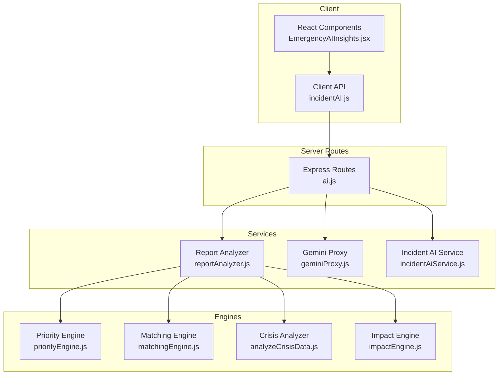
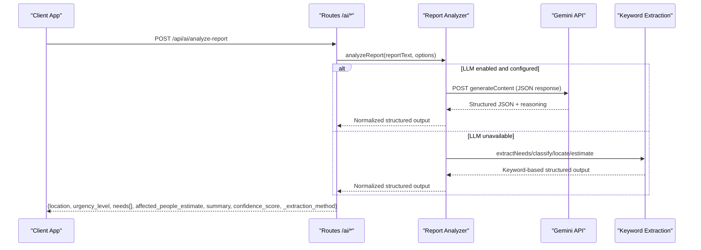
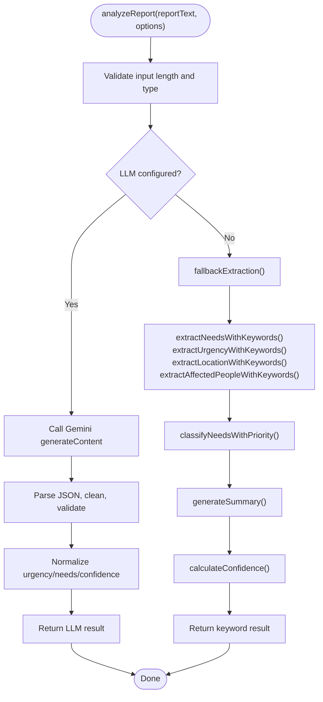
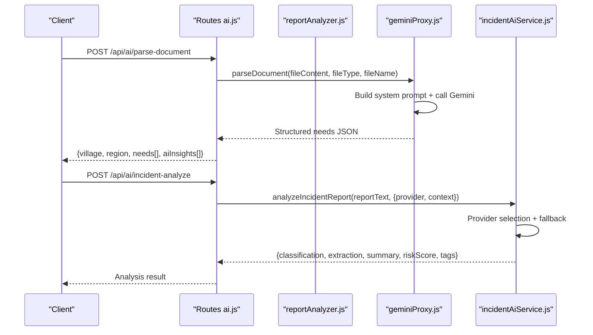
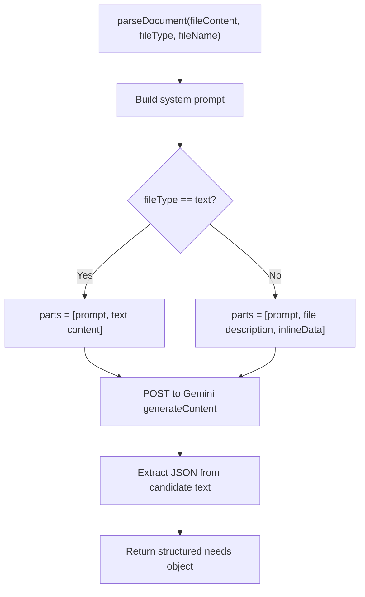
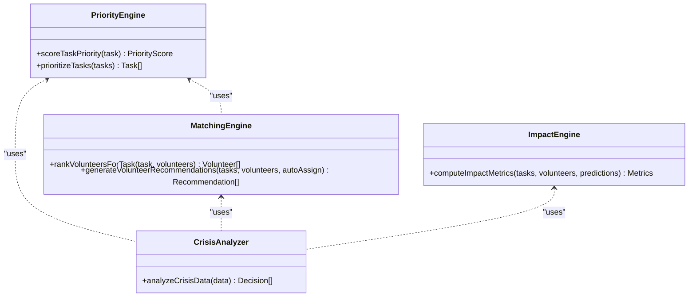
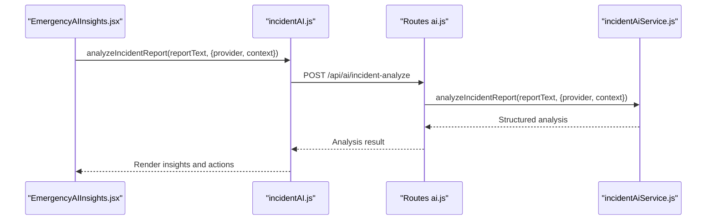
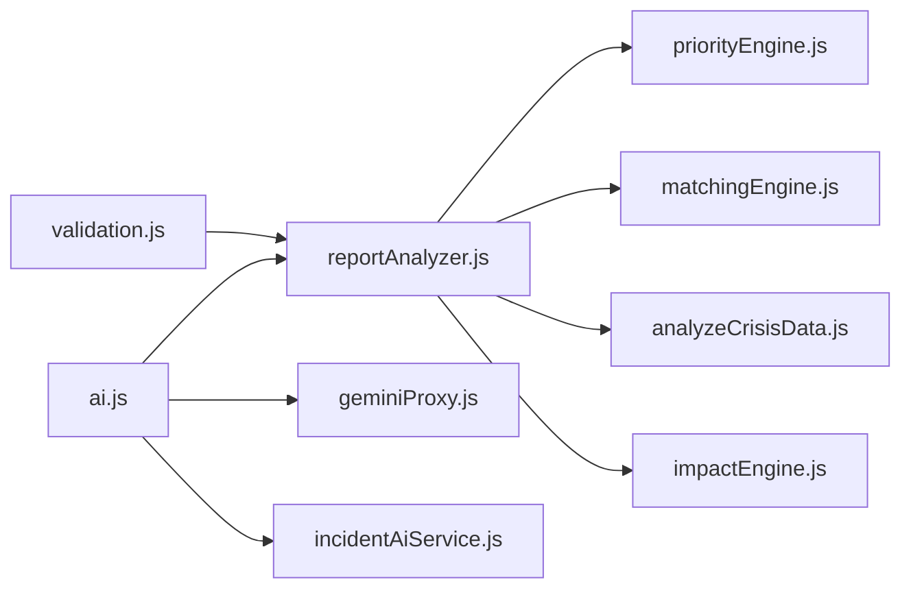

# Report Analysis Service

<cite>
**Referenced Files in This Document**
- [reportAnalyzer.js](file://server/services/reportAnalyzer.js)
- [ai.js](file://server/routes/ai.js)
- [incidentAiService.js](file://server/incidentAiService.js)
- [geminiProxy.js](file://server/services/geminiProxy.js)
- [validation.js](file://src/utils/validation.js)
- [analyzeCrisisData.js](file://src/engine/analyzeCrisisData.js)
- [matchingEngine.js](file://src/engine/matchingEngine.js)
- [priorityEngine.js](file://src/engine/priorityEngine.js)
- [impactEngine.js](file://src/engine/impactEngine.js)
- [incidentAI.js](file://src/services/incidentAI.js)
- [reportAnalyzer.test.js](file://server/test/reportAnalyzer.test.js)
</cite>

## Table of Contents
1. [Introduction](#introduction)
2. [Project Structure](#project-structure)
3. [Core Components](#core-components)
4. [Architecture Overview](#architecture-overview)
5. [Detailed Component Analysis](#detailed-component-analysis)
6. [Dependency Analysis](#dependency-analysis)
7. [Performance Considerations](#performance-considerations)
8. [Troubleshooting Guide](#troubleshooting-guide)
9. [Conclusion](#conclusion)

## Introduction
This document describes the report analysis service integration and data processing pipeline for extracting structured community needs from unstructured NGO reports and community surveys. It covers:
- Structured data extraction: need categorization, priority assignment, and volunteer requirement calculations
- Analysis algorithms: village/region identification, affected population estimation, and deadline estimation
- AI insights generation and structured output formatting
- Input validation, error handling, and data sanitization
- Examples of processed report outputs, analysis workflows, and integration patterns with the AI service
- Performance optimization for large datasets and batch processing

## Project Structure
The report analysis pipeline spans server-side services, routes, and client-side integrations:
- Server routes expose endpoints for report analysis, batch processing, and AI-powered insights
- Services implement keyword-based extraction, LLM-based analysis, and structured output normalization
- Engines provide downstream analytics for prioritization, matching, and impact metrics
- Validation utilities ensure input sanitization and correctness

**Diagram sources**
- [ai.js:263-346](file://server/routes/ai.js#L263-L346)
- [reportAnalyzer.js:576-640](file://server/services/reportAnalyzer.js#L576-L640)
- [geminiProxy.js:53-103](file://server/services/geminiProxy.js#L53-L103)
- [incidentAiService.js:170-188](file://server/incidentAiService.js#L170-L188)
- [priorityEngine.js:45-71](file://src/engine/priorityEngine.js#L45-L71)
- [matchingEngine.js:149-173](file://src/engine/matchingEngine.js#L149-L173)
- [analyzeCrisisData.js:87-160](file://src/engine/analyzeCrisisData.js#L87-L160)
- [impactEngine.js:24-57](file://src/engine/impactEngine.js#L24-L57)

**Section sources**
- [ai.js:1-421](file://server/routes/ai.js#L1-L421)
- [reportAnalyzer.js:1-646](file://server/services/reportAnalyzer.js#L1-L646)

## Core Components
- Report Analyzer: Implements keyword-based extraction and LLM-based analysis with fallback, structured output normalization, and batch processing
- AI Routes: Exposes endpoints for single report analysis, batch processing, document parsing, and priority scoring
- Incident AI Service: Provides multi-provider LLM analysis with heuristic fallback
- Gemini Proxy: Parses documents and extracts structured community needs with AI prompts
- Engines: Prioritization, matching, crisis analysis, and impact computation for downstream systems

**Section sources**
- [reportAnalyzer.js:576-640](file://server/services/reportAnalyzer.js#L576-L640)
- [ai.js:263-346](file://server/routes/ai.js#L263-L346)
- [incidentAiService.js:170-188](file://server/incidentAiService.js#L170-L188)
- [geminiProxy.js:53-103](file://server/services/geminiProxy.js#L53-L103)
- [priorityEngine.js:45-71](file://src/engine/priorityEngine.js#L45-L71)
- [matchingEngine.js:149-173](file://src/engine/matchingEngine.js#L149-L173)
- [analyzeCrisisData.js:87-160](file://src/engine/analyzeCrisisData.js#L87-L160)
- [impactEngine.js:24-57](file://src/engine/impactEngine.js#L24-L57)

## Architecture Overview
The system integrates three complementary analysis modes:
- Keyword-based extraction for robust fallback
- LLM-based analysis for structured JSON outputs and reasoning
- Multi-provider AI service with heuristic fallback for incident classification and risk scoring

**Diagram sources**
- [ai.js:271-291](file://server/routes/ai.js#L271-L291)
- [reportAnalyzer.js:522-607](file://server/services/reportAnalyzer.js#L522-L607)

## Detailed Component Analysis

### Report Analyzer Service
The analyzer performs:
- Text normalization and validation
- Keyword-based extraction for needs, urgency, location, and affected population
- Priority classification per need with confidence scoring
- Professional summary generation and reasoning metadata
- Structured output normalization and batch processing

**Diagram sources**
- [reportAnalyzer.js:576-607](file://server/services/reportAnalyzer.js#L576-L607)
- [reportAnalyzer.js:379-397](file://server/services/reportAnalyzer.js#L379-L397)
- [reportAnalyzer.js:84-180](file://server/services/reportAnalyzer.js#L84-L180)
- [reportAnalyzer.js:269-327](file://server/services/reportAnalyzer.js#L269-L327)

Key algorithms and outputs:
- Need categorization: keyword patterns mapped to categories (food, medical, shelter, water, etc.)
- Priority assignment: per-need classification using urgency indicators and context heuristics
- Urgency classification: high/medium/low using explicit keywords
- Location extraction: village/town/district patterns and Gujarat district names
- Population estimation: numeric patterns for affected, dead, injured, missing, and population
- Confidence scoring: based on explicitness, text quality, and signal strength
- Structured output: location, urgency_level, needs[], affected_people_estimate, summary, confidence_score, _extraction_method

**Section sources**
- [reportAnalyzer.js:8-21](file://server/services/reportAnalyzer.js#L8-L21)
- [reportAnalyzer.js:84-180](file://server/services/reportAnalyzer.js#L84-L180)
- [reportAnalyzer.js:269-327](file://server/services/reportAnalyzer.js#L269-L327)
- [reportAnalyzer.js:379-397](file://server/services/reportAnalyzer.js#L379-L397)
- [reportAnalyzer.js:576-607](file://server/services/reportAnalyzer.js#L576-L607)

### AI Routes and Integration
Endpoints:
- POST /api/ai/analyze-report: Single report analysis with LLM/baseline
- POST /api/ai/analyze-reports-batch: Batch processing up to 50 reports
- POST /api/ai/parse-document: Secure Gemini proxy for document parsing
- POST /api/ai/incident-analyze: Multi-provider LLM analysis with fallback

**Diagram sources**
- [ai.js:22-51](file://server/routes/ai.js#L22-L51)
- [ai.js:53-77](file://server/routes/ai.js#L53-L77)
- [ai.js:263-346](file://server/routes/ai.js#L263-L346)
- [geminiProxy.js:53-103](file://server/services/geminiProxy.js#L53-L103)
- [incidentAiService.js:170-188](file://server/incidentAiService.js#L170-L188)

**Section sources**
- [ai.js:22-77](file://server/routes/ai.js#L22-L77)
- [ai.js:263-346](file://server/routes/ai.js#L263-L346)
- [geminiProxy.js:53-103](file://server/services/geminiProxy.js#L53-L103)
- [incidentAiService.js:170-188](file://server/incidentAiService.js#L170-L188)

### Community Survey Parsing Pipeline
The Gemini proxy extracts structured community needs from survey data:
- System prompt defines required fields: village, region, totalRecords, needs[], aiInsights[]
- Priority assignment rules: urgent/medium/low based on keywords
- Volunteers needed: derived from severity context
- Deadlines: estimated 3–14 days from current date based on urgency

**Diagram sources**
- [geminiProxy.js:53-103](file://server/services/geminiProxy.js#L53-L103)

**Section sources**
- [geminiProxy.js:9-39](file://server/services/geminiProxy.js#L9-L39)
- [geminiProxy.js:53-103](file://server/services/geminiProxy.js#L53-L103)

### Downstream Processing and Volunteer Requirement Calculations
Downstream engines consume analyzed needs to compute:
- Priority scores: urgency, impact, severity, and resource gaps
- Matching: volunteer recommendations based on skills, distance, availability, experience, and performance
- Crisis analysis: risk scores, escalation probability, response time estimates, and confidence
- Impact metrics: people helped, active tasks, utilization, and geographic distribution

**Diagram sources**
- [priorityEngine.js:45-71](file://src/engine/priorityEngine.js#L45-L71)
- [matchingEngine.js:149-173](file://src/engine/matchingEngine.js#L149-L173)
- [analyzeCrisisData.js:87-160](file://src/engine/analyzeCrisisData.js#L87-L160)
- [impactEngine.js:24-57](file://src/engine/impactEngine.js#L24-L57)

**Section sources**
- [priorityEngine.js:1-72](file://src/engine/priorityEngine.js#L1-L72)
- [matchingEngine.js:1-174](file://src/engine/matchingEngine.js#L1-L174)
- [analyzeCrisisData.js:1-161](file://src/engine/analyzeCrisisData.js#L1-L161)
- [impactEngine.js:1-58](file://src/engine/impactEngine.js#L1-L58)

### Client Integration Patterns
Client-side integration:
- Frontend calls analyzeIncidentReport(reportText) to obtain structured insights
- UI components render AI summaries and emergency actions
- Backend routes enforce authentication and input validation

**Diagram sources**
- [incidentAI.js:1-24](file://src/services/incidentAI.js#L1-L24)
- [ai.js:56-77](file://server/routes/ai.js#L56-L77)
- [incidentAiService.js:170-188](file://server/incidentAiService.js#L170-L188)

**Section sources**
- [incidentAI.js:1-24](file://src/services/incidentAI.js#L1-L24)
- [ai.js:56-77](file://server/routes/ai.js#L56-L77)
- [incidentAiService.js:170-188](file://server/incidentAiService.js#L170-L188)

## Dependency Analysis
- Input validation: client-side validation utilities ensure sanitized and bounded inputs for needs and volunteers
- Route validation: server routes sanitize and validate bodies before invoking services
- Service composition: report analyzer orchestrates LLM and keyword fallback; downstream engines consume normalized outputs
- External dependencies: Gemini API for LLM inference; client-side file reading routed through backend proxy

**Diagram sources**
- [validation.js:30-80](file://src/utils/validation.js#L30-L80)
- [reportAnalyzer.js:576-640](file://server/services/reportAnalyzer.js#L576-L640)
- [ai.js:263-346](file://server/routes/ai.js#L263-L346)
- [geminiProxy.js:53-103](file://server/services/geminiProxy.js#L53-L103)
- [incidentAiService.js:170-188](file://server/incidentAiService.js#L170-L188)

**Section sources**
- [validation.js:1-123](file://src/utils/validation.js#L1-L123)
- [reportAnalyzer.js:476-517](file://server/services/reportAnalyzer.js#L476-L517)
- [ai.js:263-346](file://server/routes/ai.js#L263-L346)

## Performance Considerations
- Batch processing: analyze-reports-batch supports up to 50 reports per request with parallel Promise.all
- Input limits: maximum report length enforced at 50,000 characters
- Token limits: Gemini generationConfig sets maxOutputTokens and responseMimeType for JSON
- Confidence and reasoning: keyword fallback provides reliable baseline when LLM is unavailable
- Downstream scaling: prioritize by computed scores and limit top-N selections to reduce cognitive load

[No sources needed since this section provides general guidance]

## Troubleshooting Guide
Common issues and resolutions:
- LLM API errors: route catches and surfaces Gemini errors; analyzer falls back to keyword extraction
- Invalid JSON from LLM: analyzer validates and normalizes; throws descriptive errors on parse failures
- Missing API keys: routes check for GEMINI_API_KEY and return appropriate errors
- Input validation failures: routes sanitize and validate bodies; returns structured error messages
- Batch processing: route enforces array length limits and per-item validation

**Section sources**
- [reportAnalyzer.js:522-565](file://server/services/reportAnalyzer.js#L522-L565)
- [reportAnalyzer.js:590-607](file://server/services/reportAnalyzer.js#L590-L607)
- [ai.js:313-315](file://server/routes/ai.js#L313-L315)
- [ai.js:317-325](file://server/routes/ai.js#L317-L325)
- [ai.js:53-77](file://server/routes/ai.js#L53-L77)

## Conclusion
The report analysis service provides a robust, multi-layered pipeline for transforming unstructured community reports into structured, actionable insights. By combining keyword-based extraction with LLM-driven analysis and comprehensive downstream engines, the system supports rapid decision-making, volunteer matching, and impact measurement. The architecture emphasizes resilience through fallback mechanisms, strict input validation, and scalable batch processing.