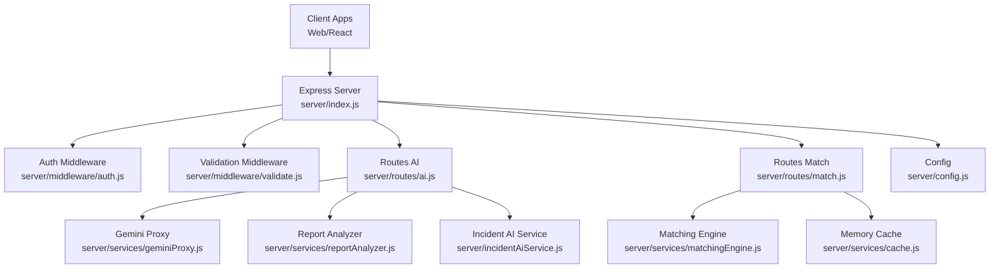
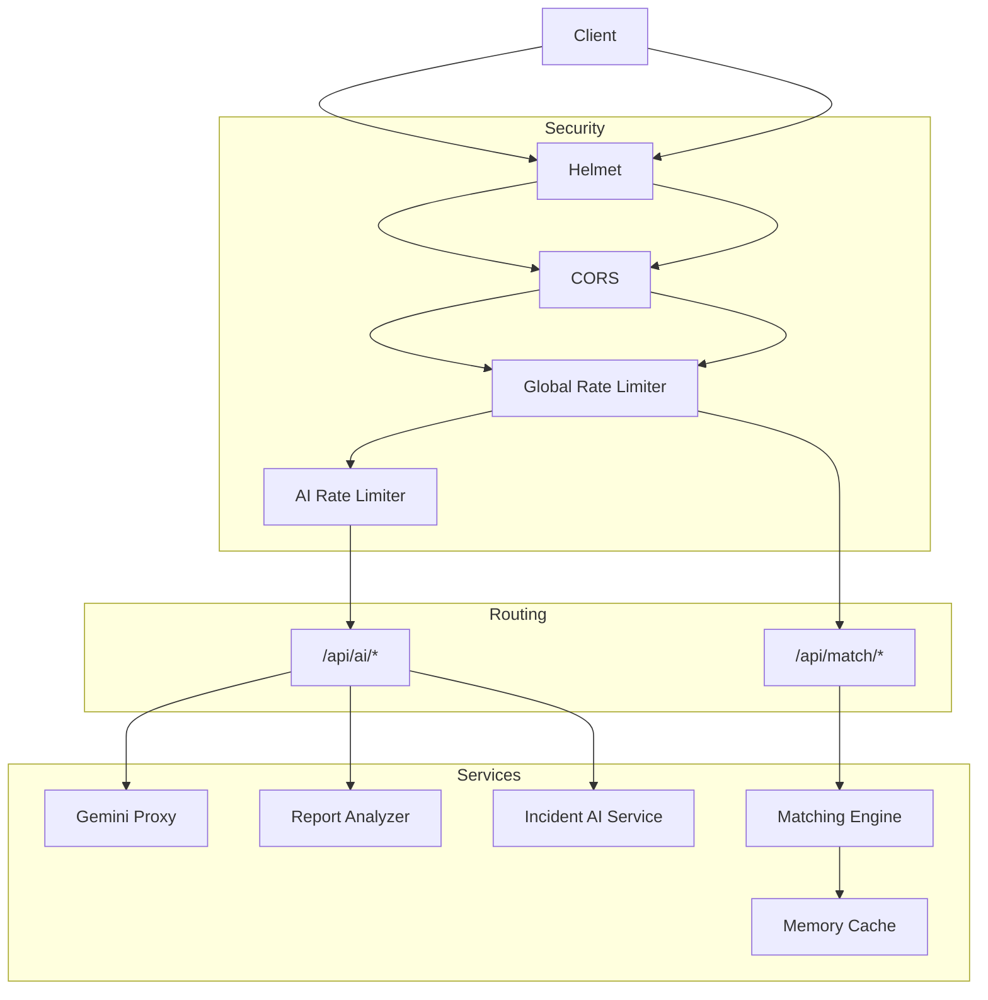
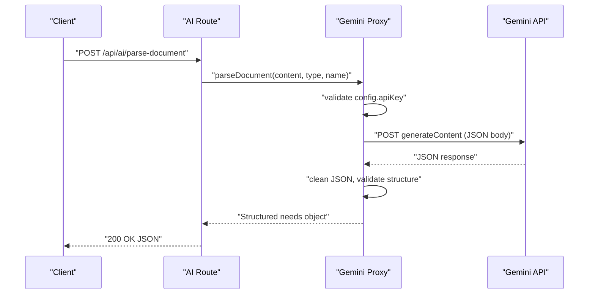
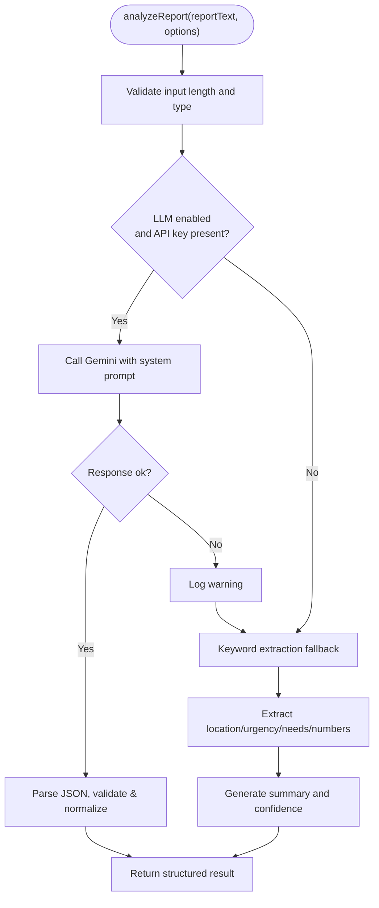
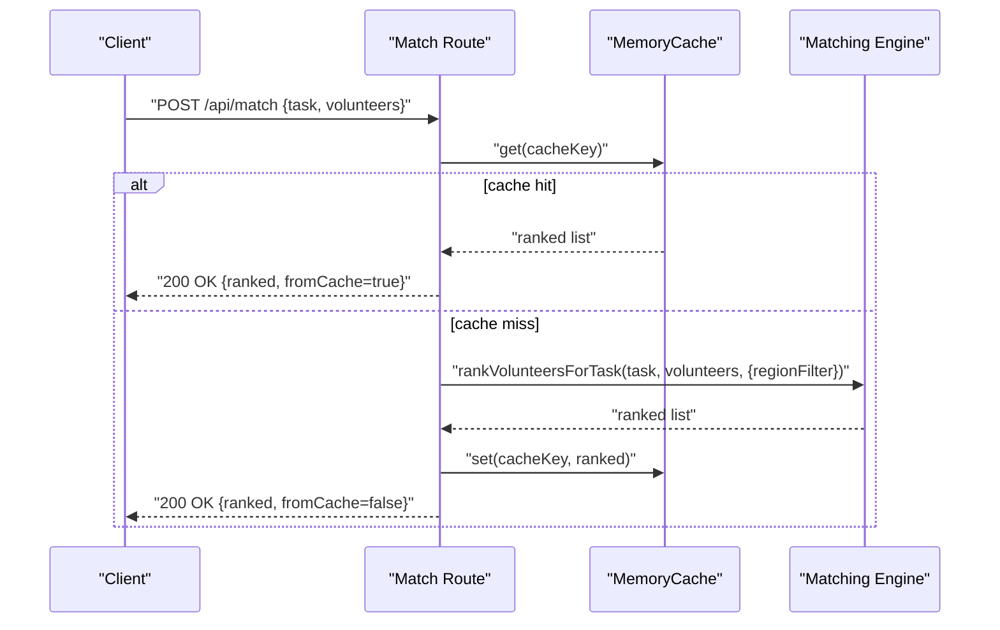
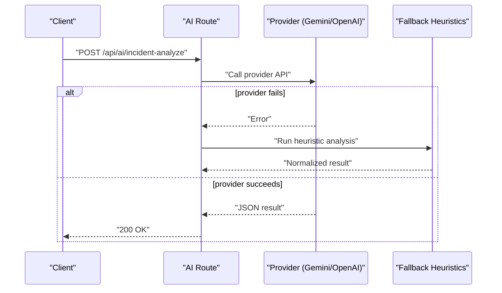
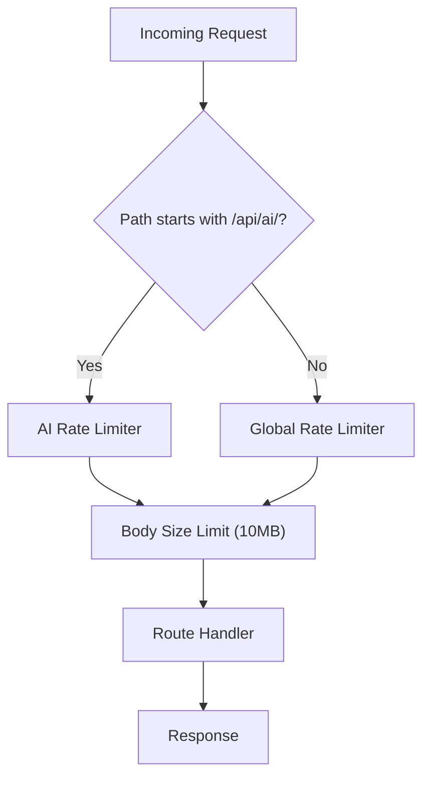
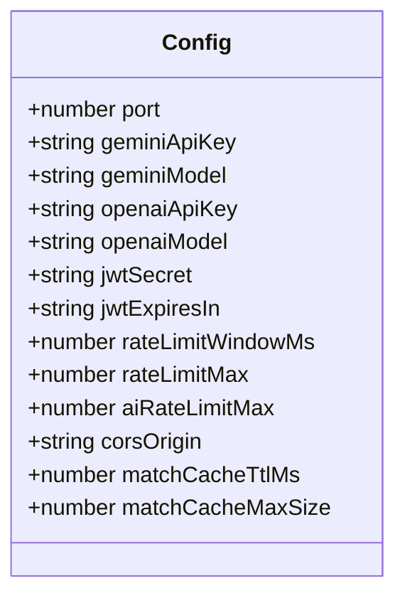
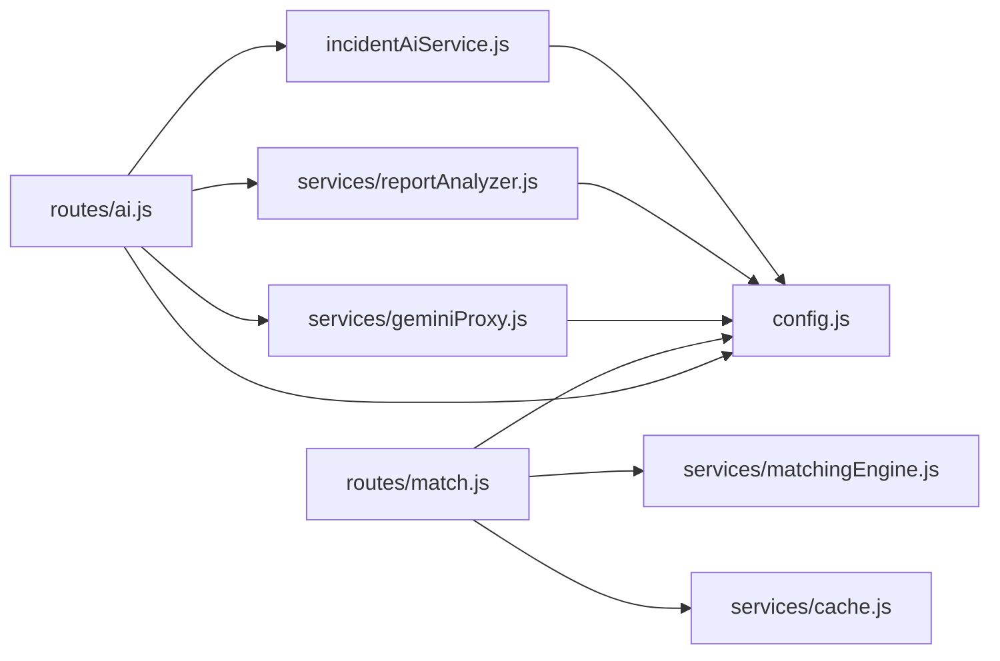

# Service Integration

<cite>
**Referenced Files in This Document**
- [index.js](file://server/index.js)
- [config.js](file://server/config.js)
- [auth.js](file://server/middleware/auth.js)
- [validate.js](file://server/middleware/validate.js)
- [ai.js](file://server/routes/ai.js)
- [match.js](file://server/routes/match.js)
- [geminiProxy.js](file://server/services/geminiProxy.js)
- [reportAnalyzer.js](file://server/services/reportAnalyzer.js)
- [matchingEngine.js](file://server/services/matchingEngine.js)
- [cache.js](file://server/services/cache.js)
- [incidentAiService.js](file://server/incidentAiService.js)
- [gemini.js](file://src/services/gemini.js)
- [intelligence_matchingEngine.js](file://src/services/intelligence/matchingEngine.js)
</cite>

## Table of Contents
1. [Introduction](#introduction)
2. [Project Structure](#project-structure)
3. [Core Components](#core-components)
4. [Architecture Overview](#architecture-overview)
5. [Detailed Component Analysis](#detailed-component-analysis)
6. [Dependency Analysis](#dependency-analysis)
7. [Performance Considerations](#performance-considerations)
8. [Troubleshooting Guide](#troubleshooting-guide)
9. [Conclusion](#conclusion)
10. [Appendices](#appendices)

## Introduction
This document explains the backend service integration patterns and external service connectivity for the NeedLink platform. It focuses on:
- Secure AI proxy integration with Gemini for document parsing and report analysis
- Report analysis service with LLM and keyword-fallback strategies
- Matching engine service integration with caching and performance optimization
- Service discovery, health checks, and fallback mechanisms
- External API integration patterns, rate limiting, and monitoring
- Service configuration, environment-specific settings, and deployment considerations

## Project Structure
The server exposes REST endpoints under /api with route modules delegating to service modules. Security middleware enforces authentication and input validation. Configuration is centralized and environment-driven. Caching is implemented in-process with an LRU cache and TTL eviction.

**Diagram sources**
- [index.js:1-118](file://server/index.js#L1-L118)
- [ai.js:1-348](file://server/routes/ai.js#L1-L348)
- [match.js:1-120](file://server/routes/match.js#L1-L120)
- [geminiProxy.js:1-104](file://server/services/geminiProxy.js#L1-L104)
- [reportAnalyzer.js:1-646](file://server/services/reportAnalyzer.js#L1-L646)
- [incidentAiService.js:1-189](file://server/incidentAiService.js#L1-L189)
- [matchingEngine.js:1-212](file://server/services/matchingEngine.js#L1-L212)
- [cache.js:1-66](file://server/services/cache.js#L1-L66)
- [config.js:1-35](file://server/config.js#L1-L35)

**Section sources**
- [index.js:1-118](file://server/index.js#L1-L118)
- [config.js:1-35](file://server/config.js#L1-L35)

## Core Components
- Authentication and Authorization: JWT verification middleware secures routes and attaches user context.
- Validation: Input sanitization and schema validation ensure robust request handling.
- AI Routes: Expose document parsing, incident analysis, chat, match explanations, and report analysis.
- Report Analyzer: LLM-based extraction with keyword-fallback and confidence scoring.
- Matching Engine: Distance-aware scoring with weights and region-based filtering.
- Cache: In-memory LRU cache with TTL for match results.
- Configuration: Environment-driven settings for AI keys, models, rate limits, CORS, and cache tuning.

**Section sources**
- [auth.js:1-49](file://server/middleware/auth.js#L1-L49)
- [validate.js:1-80](file://server/middleware/validate.js#L1-L80)
- [ai.js:1-348](file://server/routes/ai.js#L1-L348)
- [reportAnalyzer.js:1-646](file://server/services/reportAnalyzer.js#L1-L646)
- [matchingEngine.js:1-212](file://server/services/matchingEngine.js#L1-L212)
- [cache.js:1-66](file://server/services/cache.js#L1-L66)
- [config.js:1-35](file://server/config.js#L1-L35)

## Architecture Overview
The server enforces security headers, logs requests, applies CORS, and rate limits. AI endpoints are protected and optionally use stricter limits. Route handlers call service modules that integrate with external providers (Gemini/OpenAI) and internal engines. Matching results are cached to reduce recomputation.

**Diagram sources**
- [index.js:28-77](file://server/index.js#L28-L77)
- [ai.js:1-348](file://server/routes/ai.js#L1-L348)
- [match.js:1-120](file://server/routes/match.js#L1-L120)
- [geminiProxy.js:1-104](file://server/services/geminiProxy.js#L1-L104)
- [reportAnalyzer.js:1-646](file://server/services/reportAnalyzer.js#L1-L646)
- [incidentAiService.js:1-189](file://server/incidentAiService.js#L1-L189)
- [matchingEngine.js:1-212](file://server/services/matchingEngine.js#L1-L212)
- [cache.js:1-66](file://server/services/cache.js#L1-L66)

## Detailed Component Analysis

### Gemini AI Proxy
Purpose:
- Securely parse documents (text or images/PDF) via Gemini without exposing the API key to clients.
- Return structured community needs with a strict JSON schema.

Key behaviors:
- Validates presence of the Gemini API key from configuration.
- Builds a content payload with system prompt and file parts (inline data for non-text).
- Sends a POST request to the Gemini endpoint with generation controls.
- Parses and validates the response, cleaning JSON blocks and throwing descriptive errors on failures.

**Diagram sources**
- [ai.js:25-50](file://server/routes/ai.js#L25-L50)
- [geminiProxy.js:53-103](file://server/services/geminiProxy.js#L53-L103)

**Section sources**
- [geminiProxy.js:1-104](file://server/services/geminiProxy.js#L1-L104)
- [ai.js:21-50](file://server/routes/ai.js#L21-L50)

### Report Analysis Service Integration
Purpose:
- Extract structured needs from NGO reports using an LLM (Gemini) with a robust keyword-fallback pipeline.

Processing logic:
- LLM path: Sends a system prompt and report text to Gemini, parses JSON, validates structure, and normalizes fields.
- Fallback path: Keyword-based extraction for location, urgency, needs, and affected people estimates; generates summary and confidence.
- Batch processing: Processes multiple reports concurrently with per-item error handling.

**Diagram sources**
- [reportAnalyzer.js:576-607](file://server/services/reportAnalyzer.js#L576-L607)
- [reportAnalyzer.js:522-565](file://server/services/reportAnalyzer.js#L522-L565)
- [reportAnalyzer.js:379-397](file://server/services/reportAnalyzer.js#L379-L397)

**Section sources**
- [reportAnalyzer.js:1-646](file://server/services/reportAnalyzer.js#L1-L646)
- [ai.js:262-290](file://server/routes/ai.js#L262-L290)
- [ai.js:292-345](file://server/routes/ai.js#L292-L345)

### Matching Engine Service Integration
Purpose:
- Compute volunteer-task matching scores with distance, skills, availability, experience, and performance.
- Provide ranked lists and recommendations, with optional auto-assignment.

Key features:
- Embedded Haversine distance calculation.
- Weighted scoring across skill, distance, availability, experience, and performance.
- Region-based pre-filtering to reduce compute on large pools.
- Caching of match results keyed by task and volunteer IDs.

**Diagram sources**
- [match.js:33-77](file://server/routes/match.js#L33-L77)
- [cache.js:10-66](file://server/services/cache.js#L10-L66)
- [matchingEngine.js:166-182](file://server/services/matchingEngine.js#L166-L182)

**Section sources**
- [matchingEngine.js:1-212](file://server/services/matchingEngine.js#L1-L212)
- [match.js:1-120](file://server/routes/match.js#L1-L120)
- [cache.js:1-66](file://server/services/cache.js#L1-L66)

### External API Integration Patterns and Fallbacks
- Gemini/OpenAI integration: System prompts and JSON outputs are enforced; responses are parsed and validated.
- Fallback mechanisms:
  - Report analyzer falls back to keyword extraction when LLM fails.
  - Incident AI service attempts alternate providers and falls back to heuristic analysis.
- Client separation: Client-side code delegates all AI work to backend endpoints to keep API keys server-side.

**Diagram sources**
- [ai.js:55-76](file://server/routes/ai.js#L55-L76)
- [incidentAiService.js:170-188](file://server/incidentAiService.js#L170-L188)

**Section sources**
- [incidentAiService.js:1-189](file://server/incidentAiService.js#L1-L189)
- [gemini.js:1-38](file://src/services/gemini.js#L1-L38)

### Rate Limiting and Monitoring
- Global rate limiter protects all /api endpoints.
- Stricter AI rate limiter targets expensive operations.
- Body size limits: 1 MB default, 10 MB for AI routes.
- Health endpoint exposes liveness and configuration status.
- Logging includes request method, path, status, and response time.

**Diagram sources**
- [index.js:49-72](file://server/index.js#L49-L72)
- [ai.js:78-178](file://server/routes/ai.js#L78-L178)

**Section sources**
- [index.js:1-118](file://server/index.js#L1-L118)
- [config.js:21-24](file://server/config.js#L21-L24)

### Service Configuration and Environment Settings
- AI providers: Gemini and OpenAI keys and models.
- Auth: JWT secret and expiration.
- Rate limits: Window and thresholds for global and AI endpoints.
- CORS: Origin and credentials.
- Cache: TTL and max size for match results.

**Diagram sources**
- [config.js:8-32](file://server/config.js#L8-L32)

**Section sources**
- [config.js:1-35](file://server/config.js#L1-L35)

### Deployment Considerations
- Secrets: All sensitive configuration is read from environment variables.
- Health checks: Public /api/health endpoint for liveness probes.
- Scalability: In-memory cache is suitable for small deployments; production should replace with Redis-compatible cache maintaining the same API.
- Observability: Request logging, error handling, and cache stats endpoint for monitoring.

**Section sources**
- [index.js:78-87](file://server/index.js#L78-L87)
- [match.js:108-117](file://server/routes/match.js#L108-L117)
- [cache.js:52-64](file://server/services/cache.js#L52-L64)

## Dependency Analysis
- Route modules depend on service modules and configuration.
- Services depend on configuration for provider keys and models.
- Matching engine depends on cache for result reuse.
- Client-side code depends on backend APIs for AI operations.

**Diagram sources**
- [ai.js:1-348](file://server/routes/ai.js#L1-L348)
- [match.js:1-120](file://server/routes/match.js#L1-L120)
- [geminiProxy.js:1-104](file://server/services/geminiProxy.js#L1-L104)
- [reportAnalyzer.js:1-646](file://server/services/reportAnalyzer.js#L1-L646)
- [incidentAiService.js:1-189](file://server/incidentAiService.js#L1-L189)
- [matchingEngine.js:1-212](file://server/services/matchingEngine.js#L1-L212)
- [cache.js:1-66](file://server/services/cache.js#L1-L66)
- [config.js:1-35](file://server/config.js#L1-L35)

**Section sources**
- [ai.js:1-348](file://server/routes/ai.js#L1-L348)
- [match.js:1-120](file://server/routes/match.js#L1-L120)
- [geminiProxy.js:1-104](file://server/services/geminiProxy.js#L1-L104)
- [reportAnalyzer.js:1-646](file://server/services/reportAnalyzer.js#L1-L646)
- [incidentAiService.js:1-189](file://server/incidentAiService.js#L1-L189)
- [matchingEngine.js:1-212](file://server/services/matchingEngine.js#L1-L212)
- [cache.js:1-66](file://server/services/cache.js#L1-L66)
- [config.js:1-35](file://server/config.js#L1-L35)

## Performance Considerations
- Caching: Match results are cached with TTL and eviction to avoid repeated computations.
- Region pre-filtering: Reduces volunteer pool size for scoring when region is known.
- Weighted scoring: Balances multiple factors to produce a single score efficiently.
- Batch processing: Report analyzer supports batch requests to amortize overhead.
- Rate limiting: Prevents overload on AI providers and reduces latency spikes.

[No sources needed since this section provides general guidance]

## Troubleshooting Guide
Common issues and remedies:
- Authentication failures: Verify Authorization header and token validity.
- Validation errors: Ensure request bodies conform to schemas and sizes.
- AI provider errors: Confirm API keys and model names; check Gemini/OpenAI quotas and status.
- Cache anomalies: Monitor cache stats and adjust TTL/max size.
- Health probe failures: Confirm /api/health endpoint and environment configuration.

Operational endpoints:
- Health: GET /api/health
- Cache stats: GET /api/match/cache-stats

**Section sources**
- [auth.js:14-37](file://server/middleware/auth.js#L14-L37)
- [validate.js:48-62](file://server/middleware/validate.js#L48-L62)
- [index.js:78-101](file://server/index.js#L78-L101)
- [match.js:108-117](file://server/routes/match.js#L108-L117)

## Conclusion
The backend integrates external AI providers securely, implements robust fallbacks, and optimizes performance through caching and pre-filtering. Configuration is environment-driven, and observability is built-in via logging, health checks, and cache metrics. For production scaling, consider replacing the in-memory cache with a distributed cache and adding circuit breakers and retries for external services.

[No sources needed since this section summarizes without analyzing specific files]

## Appendices

### API Surface Summary
- AI endpoints:
  - POST /api/ai/parse-document
  - POST /api/ai/incident-analyze
  - POST /api/ai/chat
  - POST /api/ai/explain-match
  - POST /api/ai/analyze-report
  - POST /api/ai/analyze-reports-batch
- Match endpoints:
  - POST /api/match
  - POST /api/match/recommend
  - GET /api/match/cache-stats
- Auth endpoints:
  - POST /api/auth/login
  - POST /api/auth/register
- Health:
  - GET /api/health

**Section sources**
- [ai.js:21-345](file://server/routes/ai.js#L21-L345)
- [match.js:23-106](file://server/routes/match.js#L23-L106)
- [index.js:78-117](file://server/index.js#L78-L117)