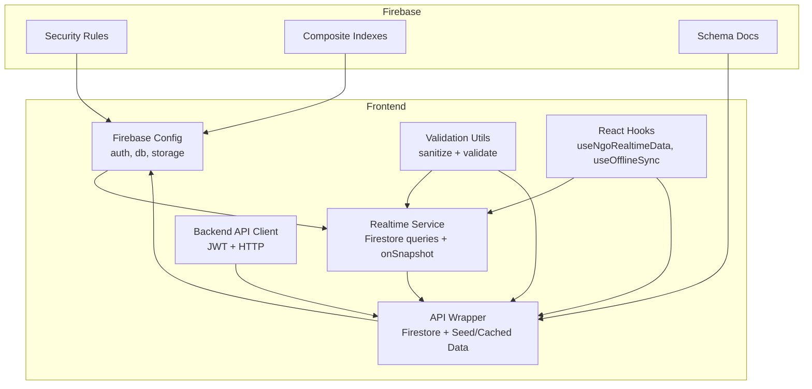
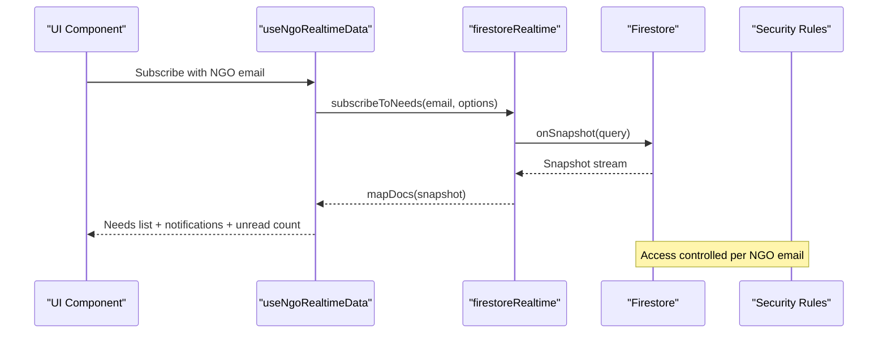
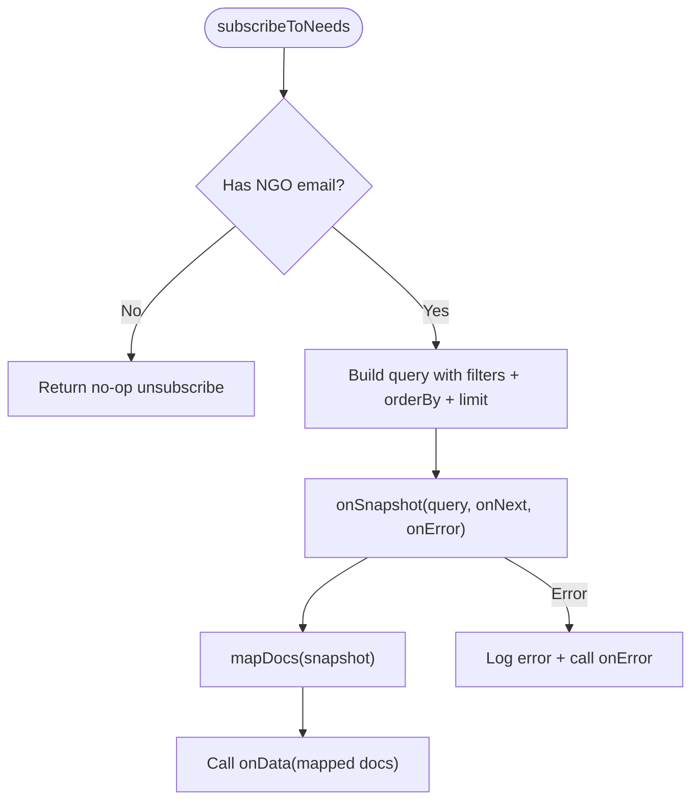
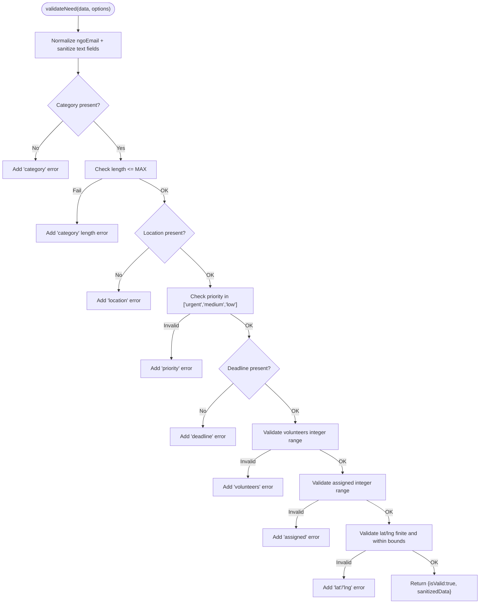
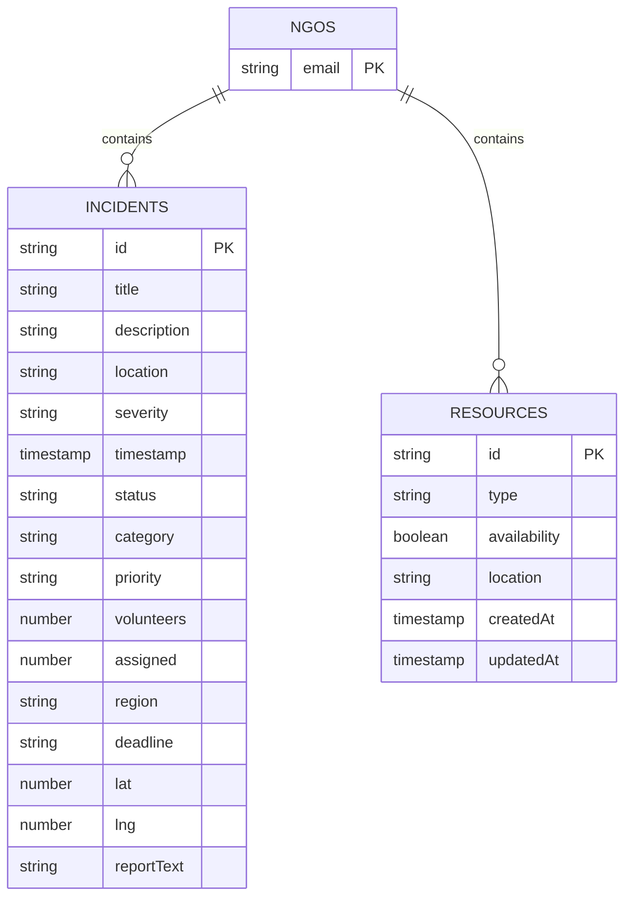
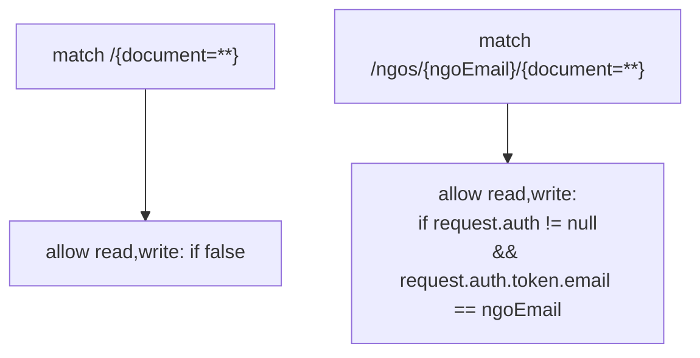
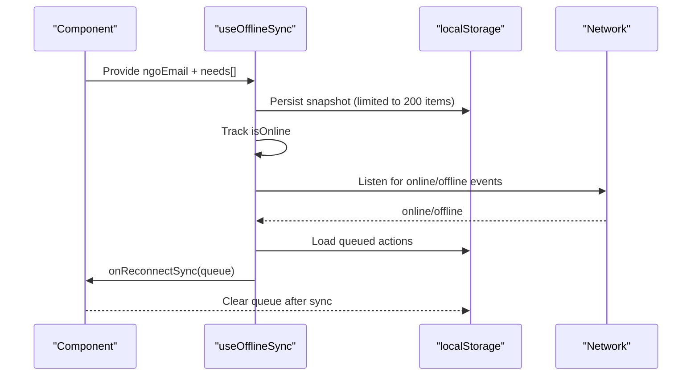
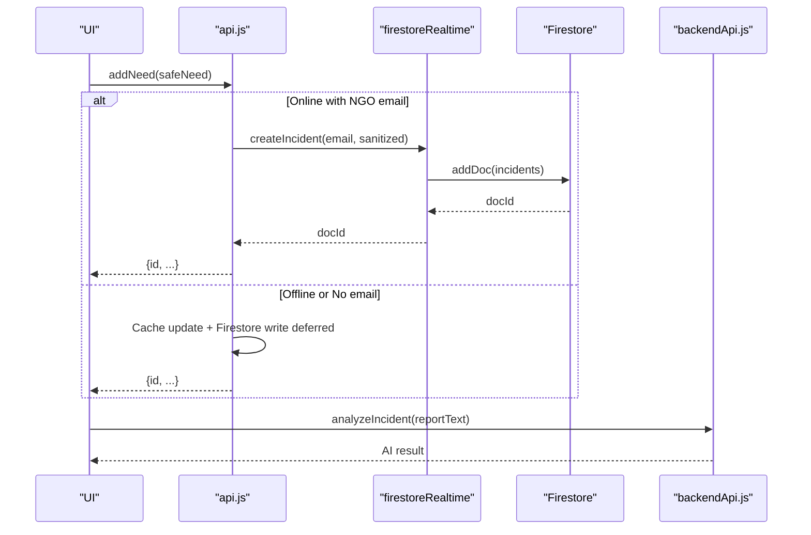
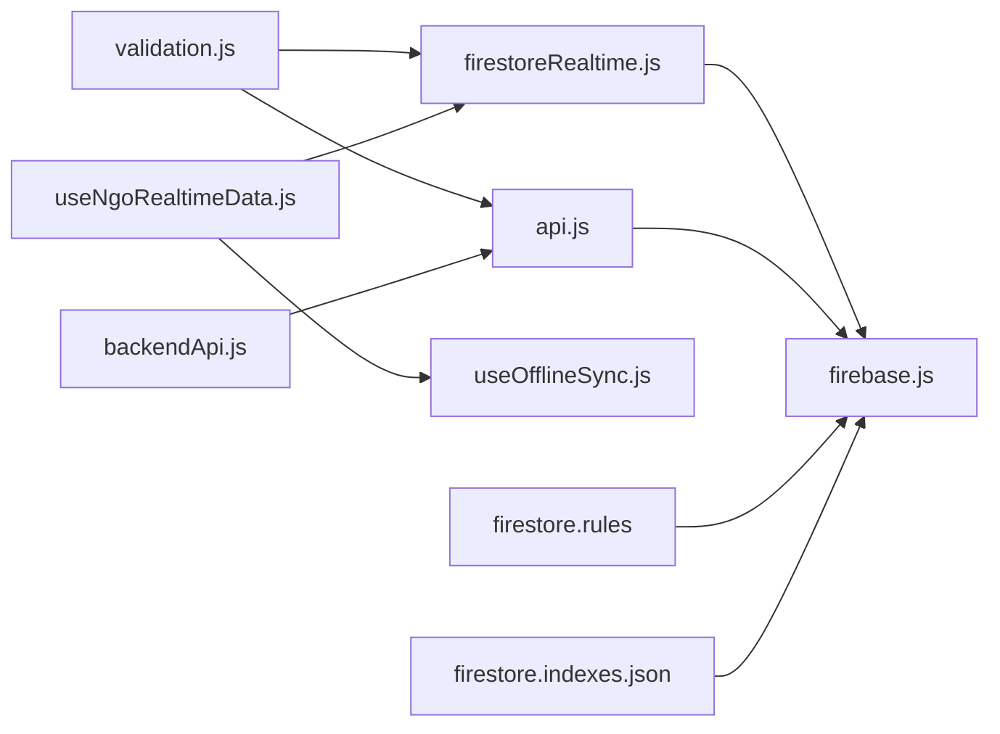

# Data Management

<cite>
**Referenced Files in This Document**
- [firebase.js](file://src/firebase.js)
- [firestoreRealtime.js](file://src/services/firestoreRealtime.js)
- [validation.js](file://src/utils/validation.js)
- [firestoreSchema.md](file://src/services/firestoreSchema.md)
- [firestore.rules](file://firestore.rules)
- [firestore.indexes.json](file://firestore.indexes.json)
- [useNgoRealtimeData.js](file://src/hooks/useNgoRealtimeData.js)
- [useOfflineSync.js](file://src/hooks/useOfflineSync.js)
- [api.js](file://src/services/api.js)
- [backendApi.js](file://src/services/backendApi.js)
- [implementation_plan.md](file://implementation_plan.md)
</cite>

## Table of Contents
1. [Introduction](#introduction)
2. [Project Structure](#project-structure)
3. [Core Components](#core-components)
4. [Architecture Overview](#architecture-overview)
5. [Detailed Component Analysis](#detailed-component-analysis)
6. [Dependency Analysis](#dependency-analysis)
7. [Performance Considerations](#performance-considerations)
8. [Troubleshooting Guide](#troubleshooting-guide)
9. [Conclusion](#conclusion)
10. [Appendices](#appendices)

## Introduction
This document describes the Firebase-based data layer for the application, focusing on database schema design, real-time synchronization, security rules, API service abstractions, real-time hooks, offline-first architecture, validation and sanitization, indexing and query optimization, caching strategies, and data lifecycle management. It synthesizes the frontend Firestore integration, client-side validation, and backend API layer to present a cohesive data management strategy.

## Project Structure
The data layer spans three primary areas:
- Firebase initialization and services (authentication, Firestore, storage)
- Real-time Firestore service and React hooks for live updates
- Validation utilities and schema documentation
- Security rules and composite indexes
- Backend API service for authenticated endpoints
- Offline-first caching and rehydration

**Diagram sources**
- [firebase.js:1-35](file://src/firebase.js#L1-L35)
- [firestoreRealtime.js:1-212](file://src/services/firestoreRealtime.js#L1-L212)
- [validation.js:1-123](file://src/utils/validation.js#L1-L123)
- [useNgoRealtimeData.js:1-83](file://src/hooks/useNgoRealtimeData.js#L1-L83)
- [useOfflineSync.js:1-72](file://src/hooks/useOfflineSync.js#L1-L72)
- [api.js:1-599](file://src/services/api.js#L1-L599)
- [backendApi.js:1-164](file://src/services/backendApi.js#L1-L164)
- [firestore.rules:1-19](file://firestore.rules#L1-L19)
- [firestore.indexes.json:1-46](file://firestore.indexes.json#L1-L46)
- [firestoreSchema.md:1-28](file://src/services/firestoreSchema.md#L1-L28)

**Section sources**
- [firebase.js:1-35](file://src/firebase.js#L1-L35)
- [firestoreRealtime.js:1-212](file://src/services/firestoreRealtime.js#L1-L212)
- [validation.js:1-123](file://src/utils/validation.js#L1-L123)
- [firestoreSchema.md:1-28](file://src/services/firestoreSchema.md#L1-L28)
- [firestore.rules:1-19](file://firestore.rules#L1-L19)
- [firestore.indexes.json:1-46](file://firestore.indexes.json#L1-L46)
- [useNgoRealtimeData.js:1-83](file://src/hooks/useNgoRealtimeData.js#L1-L83)
- [useOfflineSync.js:1-72](file://src/hooks/useOfflineSync.js#L1-L72)
- [api.js:1-599](file://src/services/api.js#L1-L599)
- [backendApi.js:1-164](file://src/services/backendApi.js#L1-L164)

## Core Components
- Firebase initialization and services: Provides auth, Firestore, and storage instances configured from environment variables.
- Realtime Firestore service: Encapsulates Firestore operations, building queries, subscribing to snapshots, and writing validated data.
- Validation utilities: Enforce field constraints, sanitize text, and normalize inputs to prevent malformed or unsafe data.
- Schema documentation: Defines tenant-scoped collections and document fields for incidents and resources.
- Security rules: Enforce per-NGO isolation and authenticated access.
- Composite indexes: Enable efficient multi-field queries on incidents and notifications.
- React hooks: Provide real-time subscriptions and offline-first caching.
- Backend API client: Manages JWT tokens and backend endpoints for AI and matching services.

**Section sources**
- [firebase.js:1-35](file://src/firebase.js#L1-L35)
- [firestoreRealtime.js:1-212](file://src/services/firestoreRealtime.js#L1-L212)
- [validation.js:1-123](file://src/utils/validation.js#L1-L123)
- [firestoreSchema.md:1-28](file://src/services/firestoreSchema.md#L1-L28)
- [firestore.rules:1-19](file://firestore.rules#L1-L19)
- [firestore.indexes.json:1-46](file://firestore.indexes.json#L1-L46)
- [useNgoRealtimeData.js:1-83](file://src/hooks/useNgoRealtimeData.js#L1-L83)
- [useOfflineSync.js:1-72](file://src/hooks/useOfflineSync.js#L1-L72)
- [backendApi.js:1-164](file://src/services/backendApi.js#L1-L164)

## Architecture Overview
The data layer follows an offline-first, real-time architecture:
- Frontend initializes Firebase and exposes Firestore collections scoped per NGO email.
- Real-time listeners subscribe to incidents, resources, and notifications.
- Validation runs at the data boundary to sanitize inputs before writes.
- Security rules enforce per-user access to NGO-specific data.
- Composite indexes optimize query performance for common filters.
- Offline hook caches recent data and queues actions when offline, syncing on reconnect.
- Backend API client handles authenticated requests for AI and matching services.

**Diagram sources**
- [useNgoRealtimeData.js:26-82](file://src/hooks/useNgoRealtimeData.js#L26-L82)
- [firestoreRealtime.js:61-116](file://src/services/firestoreRealtime.js#L61-L116)
- [firestore.rules:9-16](file://firestore.rules#L9-L16)

## Detailed Component Analysis

### Realtime Firestore Service
Responsibilities:
- Build typed queries for incidents, resources, and notifications.
- Subscribe to real-time updates via onSnapshot.
- Provide paginated retrieval for notifications.
- Write validated data with server timestamps and normalized fields.

Key behaviors:
- Query construction supports filtering and ordering for performance.
- Snapshot mapping preserves document IDs and data.
- Error handling logs failures and forwards errors to callers.

**Diagram sources**
- [firestoreRealtime.js:29-73](file://src/services/firestoreRealtime.js#L29-L73)
- [firestoreRealtime.js:23-27](file://src/services/firestoreRealtime.js#L23-L27)

**Section sources**
- [firestoreRealtime.js:19-116](file://src/services/firestoreRealtime.js#L19-L116)

### Validation and Sanitization
Responsibilities:
- Validate and sanitize incident and volunteer payloads.
- Enforce length limits, numeric ranges, and geographic bounds.
- Normalize email and trim text to reduce XSS risks.

Processing logic:
- Text sanitization trims whitespace and strips dangerous characters.
- Numeric fields validated for finite numbers and ranges.
- Priority values constrained to accepted enumerations.

**Diagram sources**
- [validation.js:30-80](file://src/utils/validation.js#L30-L80)

**Section sources**
- [validation.js:1-123](file://src/utils/validation.js#L1-L123)

### Schema Design and Tenant Isolation
Tenant model:
- Per-NGO collections: ngos/{ngoEmail}/incidents and ngos/{ngoEmail}/resources.
- Documents include compatibility fields for UI and normalized fields for analytics.

**Diagram sources**
- [firestoreSchema.md:5-27](file://src/services/firestoreSchema.md#L5-L27)

**Section sources**
- [firestoreSchema.md:1-28](file://src/services/firestoreSchema.md#L1-L28)

### Security Rules
Access control:
- All documents deny read/write by default.
- Allow read/write only for authenticated users whose email matches the NGO path.
- Prevent cross-NGO access.

**Diagram sources**
- [firestore.rules:3-16](file://firestore.rules#L3-L16)

**Section sources**
- [firestore.rules:1-19](file://firestore.rules#L1-L19)

### Indexing and Query Optimization
Indexes:
- Composite indexes for incidents on status + timestamp, priority + timestamp, region + timestamp.
- Composite indexes for notifications on read + createdAt.

Implications:
- Enables efficient filtered, sorted queries without full collection scans.
- Supports pagination and unread counts.

**Section sources**
- [firestore.indexes.json:1-46](file://firestore.indexes.json#L1-L46)

### Real-time Data Hooks
useNgoRealtimeData:
- Subscribes to needs, notifications, and unread count.
- Uses fingerprint comparison to avoid unnecessary renders.
- Returns memoized state for consumption.

useOfflineSync:
- Persists a snapshot of needs to localStorage keyed by NGO email.
- Queues offline actions and replays them on reconnect.
- Tracks online/offline state and exposes cached needs.

**Diagram sources**
- [useOfflineSync.js:13-71](file://src/hooks/useOfflineSync.js#L13-L71)

**Section sources**
- [useNgoRealtimeData.js:26-82](file://src/hooks/useNgoRealtimeData.js#L26-L82)
- [useOfflineSync.js:1-72](file://src/hooks/useOfflineSync.js#L1-L72)

### API Service Layer Abstraction
Firestore-backed API:
- Provides cached and seeded data per NGO email.
- Computes dynamic chart data and augments coordinates.
- Exposes mutation operations (resolve, delete, assign, add) with optimistic updates and persistence.

Backend API client:
- Thin HTTP client with JWT token management.
- Typed methods for AI parsing, incident analysis, chat, and matching.
- Token persisted in sessionStorage for session continuity.

**Diagram sources**
- [api.js:375-394](file://src/services/api.js#L375-L394)
- [firestoreRealtime.js:132-156](file://src/services/firestoreRealtime.js#L132-L156)
- [backendApi.js:84-126](file://src/services/backendApi.js#L84-L126)

**Section sources**
- [api.js:295-562](file://src/services/api.js#L295-L562)
- [backendApi.js:1-164](file://src/services/backendApi.js#L1-L164)

### Data Lifecycle Management
- Creation: Validation precedes writes; server timestamps recorded; compatibility fields preserved.
- Updates: Status updates and metadata changes use serverTimestamp for consistency.
- Deletion: Removes documents from tenant-scoped collections.
- Caching: Local snapshot and queued actions enable offline resilience.
- Cleanup: Unsubscribing from listeners and clearing queues on completion.

**Section sources**
- [firestoreRealtime.js:132-182](file://src/services/firestoreRealtime.js#L132-L182)
- [useOfflineSync.js:13-58](file://src/hooks/useOfflineSync.js#L13-L58)

## Dependency Analysis
- Realtime service depends on Firestore SDK and validation utilities.
- Hooks depend on realtime service and localStorage for offline caching.
- API service depends on Firestore, validation, and seed data.
- Backend API client depends on environment configuration and JWT storage.
- Security rules and indexes govern access and query performance.

**Diagram sources**
- [validation.js:1-123](file://src/utils/validation.js#L1-L123)
- [firestoreRealtime.js:1-212](file://src/services/firestoreRealtime.js#L1-L212)
- [api.js:1-599](file://src/services/api.js#L1-L599)
- [useNgoRealtimeData.js:1-83](file://src/hooks/useNgoRealtimeData.js#L1-L83)
- [useOfflineSync.js:1-72](file://src/hooks/useOfflineSync.js#L1-L72)
- [backendApi.js:1-164](file://src/services/backendApi.js#L1-L164)
- [firebase.js:1-35](file://src/firebase.js#L1-L35)
- [firestore.rules:1-19](file://firestore.rules#L1-L19)
- [firestore.indexes.json:1-46](file://firestore.indexes.json#L1-L46)

**Section sources**
- [implementation_plan.md:15-39](file://implementation_plan.md#L15-L39)

## Performance Considerations
- Composite indexes: Ensure queries on incidents and notifications leverage multi-field indexes to avoid full scans.
- Pagination: Use limit and startAfter for large datasets; the notifications retrieval supports pagination.
- Query scoping: Filter early with where clauses and order by indexed fields.
- Client caching: Use local snapshot and queue to minimize redundant network calls.
- Render optimization: Fingerprint comparisons in hooks prevent unnecessary re-renders.

**Section sources**
- [firestore.indexes.json:1-46](file://firestore.indexes.json#L1-L46)
- [firestoreRealtime.js:51-59](file://src/services/firestoreRealtime.js#L51-L59)
- [useNgoRealtimeData.js:8-24](file://src/hooks/useNgoRealtimeData.js#L8-L24)

## Troubleshooting Guide
Common issues and resolutions:
- Authentication failures: Verify JWT presence and validity in backend API client; ensure environment variables are set for production.
- Permission denied: Confirm NGO email matches the authenticated user’s email claim; check security rules enforcement.
- Query errors: Ensure composite indexes exist for the requested field combinations; validate query clauses align with index definitions.
- Offline sync failures: Inspect localStorage availability and queued action payloads; confirm onReconnectSync handler clears queues appropriately.
- Validation errors: Review sanitized fields and error messages returned by validation utilities; adjust input constraints accordingly.

**Section sources**
- [backendApi.js:19-54](file://src/services/backendApi.js#L19-L54)
- [firestore.rules:9-16](file://firestore.rules#L9-L16)
- [firestore.indexes.json:1-46](file://firestore.indexes.json#L1-L46)
- [useOfflineSync.js:26-58](file://src/hooks/useOfflineSync.js#L26-L58)
- [validation.js:26-80](file://src/utils/validation.js#L26-L80)

## Conclusion
The data layer integrates Firebase Firestore with robust validation, real-time subscriptions, and offline-first caching. Security rules and composite indexes ensure secure, performant access patterns. The API service layer abstracts Firestore operations and augments them with caching and seeded data, while the backend API client manages authenticated external services. Together, these components deliver a resilient, scalable, and maintainable data management foundation.

## Appendices

### Data Access Patterns
- Tenant scoping: All reads/writes target ngos/{ngoEmail}/{collection}.
- Real-time subscriptions: onSnapshot for continuous updates; unsubscribe on cleanup.
- Paginated reads: Notifications retrieval supports page size and cursors.
- Mutations: add/update/delete with server timestamps and sanitized inputs.

**Section sources**
- [firestoreRealtime.js:19-130](file://src/services/firestoreRealtime.js#L19-L130)
- [firestoreSchema.md:5-27](file://src/services/firestoreSchema.md#L5-L27)

### Caching Strategies
- Local snapshot: Persist recent needs to localStorage keyed by NGO email.
- Action queue: Queue offline actions and replay on reconnect.
- In-memory cache: API service maintains a per-NGO cache for fast reads.

**Section sources**
- [useOfflineSync.js:13-71](file://src/hooks/useOfflineSync.js#L13-L71)
- [api.js:214-293](file://src/services/api.js#L214-L293)

### Offline-first Architecture
- Detect online/offline state via global events.
- Persist snapshot and queue actions while offline.
- Rehydrate UI from cached data; sync queued actions upon reconnect.

**Section sources**
- [useOfflineSync.js:14-71](file://src/hooks/useOfflineSync.js#L14-L71)

### Data Migration and Integrity
- Migration: Use seed data to initialize new tenants; update documents to add missing fields as needed.
- Integrity: Enforce validation at the data boundary; use server timestamps for consistency; leverage security rules to prevent unauthorized access.

**Section sources**
- [api.js:18-202](file://src/services/api.js#L18-L202)
- [validation.js:30-122](file://src/utils/validation.js#L30-L122)
- [firestore.rules:9-16](file://firestore.rules#L9-L16)