# API Abstraction Layer

<cite>
**Referenced Files in This Document**
- [api.js](file://src/services/api.js)
- [index.js](file://src/api/index.js)
- [validation.js](file://src/utils/validation.js)
- [firestoreRealtime.js](file://src/services/firestoreRealtime.js)
- [gujaratPlaces.js](file://src/data/gujaratPlaces.js)
- [geo.js](file://src/utils/geo.js)
- [maps.js](file://src/services/maps.js)
- [useNgoRealtimeData.js](file://src/hooks/useNgoRealtimeData.js)
- [useOfflineSync.js](file://src/hooks/useOfflineSync.js)
- [Dashboard.jsx](file://src/pages/Dashboard.jsx)
- [AddTaskModal.jsx](file://src/components/AddTaskModal.jsx)
- [AddVolunteerModal.jsx](file://src/components/AddVolunteerModal.jsx)
- [auth.js](file://server/routes/auth.js)
- [match.js](file://server/routes/match.js)
- [matchingEngine.js](file://server/services/matchingEngine.js)
- [backendApi.js](file://src/services/backendApi.js)
</cite>

## Table of Contents
1. [Introduction](#introduction)
2. [Project Structure](#project-structure)
3. [Core Components](#core-components)
4. [Architecture Overview](#architecture-overview)
5. [Detailed Component Analysis](#detailed-component-analysis)
6. [Dependency Analysis](#dependency-analysis)
7. [Performance Considerations](#performance-considerations)
8. [Troubleshooting Guide](#troubleshooting-guide)
9. [Conclusion](#conclusion)
10. [Appendices](#appendices)

## Introduction
This document describes the API abstraction layer that provides unified data access patterns for the application. It focuses on the main api object exported from the API service, covering CRUD operations, emergency mode, account management, caching, validation, coordinate resolution, dynamic chart computation, fallback mechanisms, and hybrid real-time/local data strategies. Practical usage patterns, error handling, and performance optimization techniques are included to help developers integrate and extend the layer effectively.

## Project Structure
The API abstraction layer spans client-side services, utilities, and React hooks, with optional backend integration for advanced features like AI analysis and server-side matching.

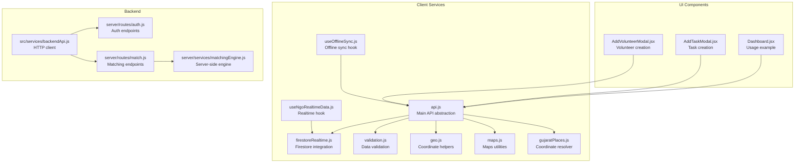

**Diagram sources**
- [api.js:1-599](file://src/services/api.js#L1-L599)
- [firestoreRealtime.js:1-212](file://src/services/firestoreRealtime.js#L1-L212)
- [validation.js:1-123](file://src/utils/validation.js#L1-L123)
- [geo.js:1-37](file://src/utils/geo.js#L1-L37)
- [maps.js:1-80](file://src/services/maps.js#L1-L80)
- [gujaratPlaces.js:1-116](file://src/data/gujaratPlaces.js#L1-L116)
- [useNgoRealtimeData.js:1-83](file://src/hooks/useNgoRealtimeData.js#L1-L83)
- [useOfflineSync.js:1-72](file://src/hooks/useOfflineSync.js#L1-L72)
- [Dashboard.jsx:1-530](file://src/pages/Dashboard.jsx#L1-L530)
- [AddTaskModal.jsx:1-590](file://src/components/AddTaskModal.jsx#L1-L590)
- [AddVolunteerModal.jsx:1-206](file://src/components/AddVolunteerModal.jsx#L1-L206)
- [auth.js:1-83](file://server/routes/auth.js#L1-L83)
- [match.js:1-120](file://server/routes/match.js#L1-L120)
- [matchingEngine.js:1-212](file://server/services/matchingEngine.js#L1-L212)
- [backendApi.js:1-164](file://src/services/backendApi.js#L1-L164)

**Section sources**
- [api.js:1-599](file://src/services/api.js#L1-L599)
- [index.js:1-11](file://src/api/index.js#L1-L11)

## Core Components
- Main API object: Provides unified access to stats, needs, volunteers, notifications, uploads, and chart data. Exposes CRUD operations and emergency mode.
- Caching: In-memory cache keyed by current account email.
- Validation: Client-side sanitization and validation for needs and volunteers.
- Coordinate resolution: Fallback resolution for missing coordinates using curated place lists and region centers.
- Dynamic chart computation: Aggregates and computes chart data from live needs.
- Real-time integration: Hybrid approach mixing Firestore snapshots with local cache.
- Account management: Demo accounts and persistence for dynamically added accounts.

**Section sources**
- [api.js:295-562](file://src/services/api.js#L295-L562)
- [api.js:214-293](file://src/services/api.js#L214-L293)
- [validation.js:30-122](file://src/utils/validation.js#L30-L122)
- [gujaratPlaces.js:92-115](file://src/data/gujaratPlaces.js#L92-L115)
- [firestoreRealtime.js:184-188](file://src/services/firestoreRealtime.js#L184-L188)

## Architecture Overview
The API abstraction layer orchestrates data access across local cache, Firestore, and optional backend services. It ensures consistent data shapes, validates inputs, resolves coordinates, and maintains dynamic analytics.

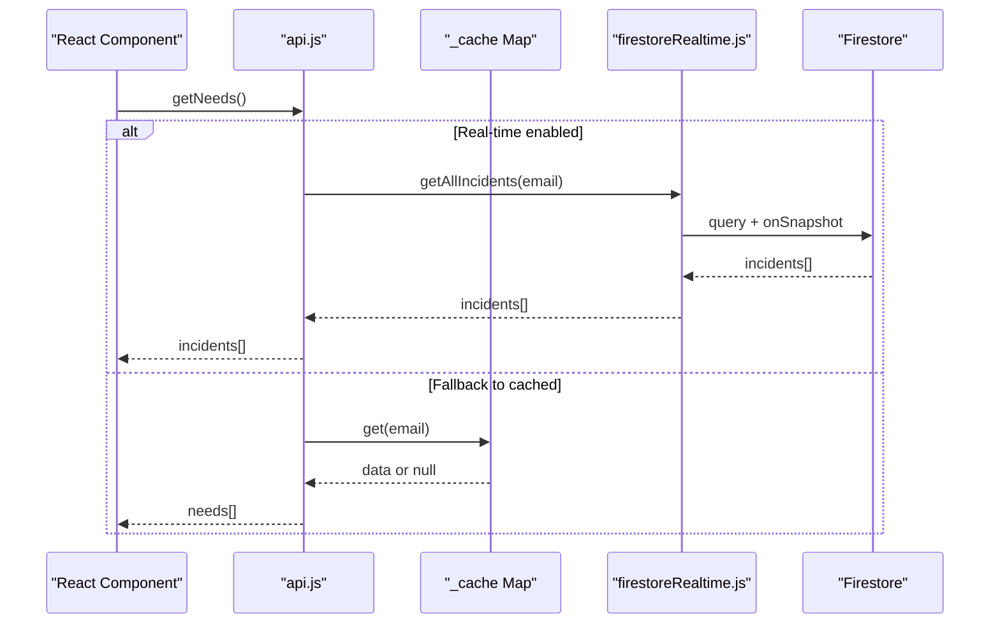

**Diagram sources**
- [api.js:299-310](file://src/services/api.js#L299-L310)
- [firestoreRealtime.js:184-188](file://src/services/firestoreRealtime.js#L184-L188)

## Detailed Component Analysis

### Main API Object (api.js)
Responsibilities:
- Account scoping: setAccount and cached state.
- Data retrieval: getStats, getNeeds, getVolunteers, getNotifications, getUploads, getChartData.
- Data mutation: addNeed, addVolunteer, assignVolunteer, resolveNeed, deleteNeed, saveUploadNeeds.
- Emergency mode: activateEmergencyMode.
- Simulations: simulateIncident.
- Account management: NGO_TYPES, DEMO_ACCOUNTS, getAccounts, addAccount, findAccount, emailExists.

Key mechanisms:
- Caching: _cache Map keyed by current email.
- Validation: validateNeed and validateVolunteer before writes.
- Coordinate resolution: resolveNeedCoordinates for missing lat/lng.
- Dynamic charts: computeDynamicChartData aggregates and normalizes metrics.
- Fallbacks: getNeeds falls back to Firestore incident service; resolveNeed coordinates fallbacks to curated locations.

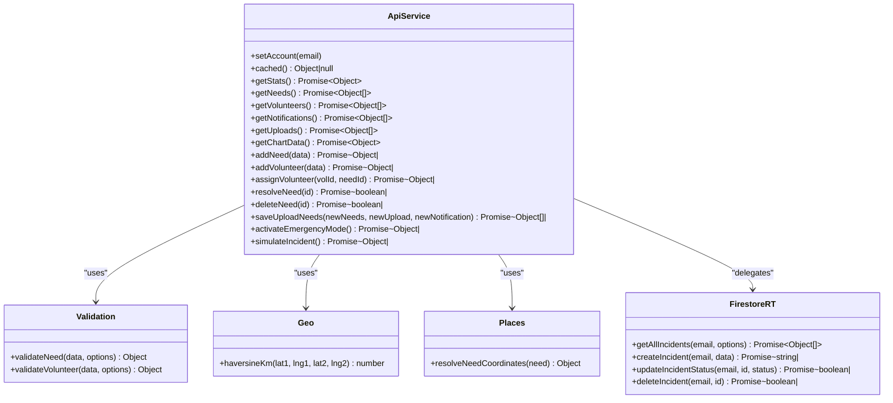

**Diagram sources**
- [api.js:295-562](file://src/services/api.js#L295-L562)
- [validation.js:30-122](file://src/utils/validation.js#L30-L122)
- [geo.js:31-36](file://src/utils/geo.js#L31-L36)
- [gujaratPlaces.js:92-115](file://src/data/gujaratPlaces.js#L92-L115)
- [firestoreRealtime.js:184-192](file://src/services/firestoreRealtime.js#L184-L192)

**Section sources**
- [api.js:295-562](file://src/services/api.js#L295-L562)

### Data Validation Patterns (validation.js)
Patterns:
- Text sanitization: trim, strip risky characters, enforce length limits.
- Email normalization: lowercase, length-constrained.
- Numeric validation: finite number checks, integer bounds.
- Priority normalization: maps arbitrary inputs to accepted values.
- Volunteer fields: phone regex validation, numeric fields enforcement.

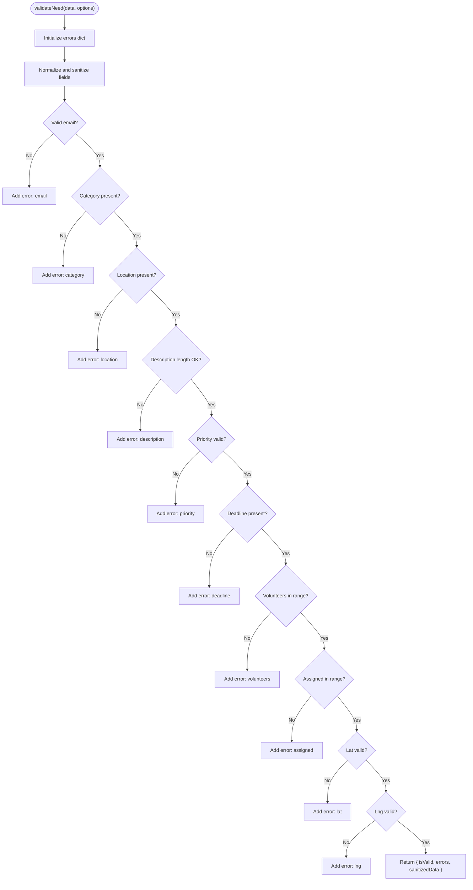

**Diagram sources**
- [validation.js:30-80](file://src/utils/validation.js#L30-L80)

**Section sources**
- [validation.js:30-122](file://src/utils/validation.js#L30-L122)

### Coordinate Resolution (gujaratPlaces.js)
Resolution logic:
- Explicit lat/lng on the need object takes precedence.
- Search curated place list for exact or partial matches.
- Fallback to region center if no match found.
- nearestRegion helper selects the closest region center for defaults.

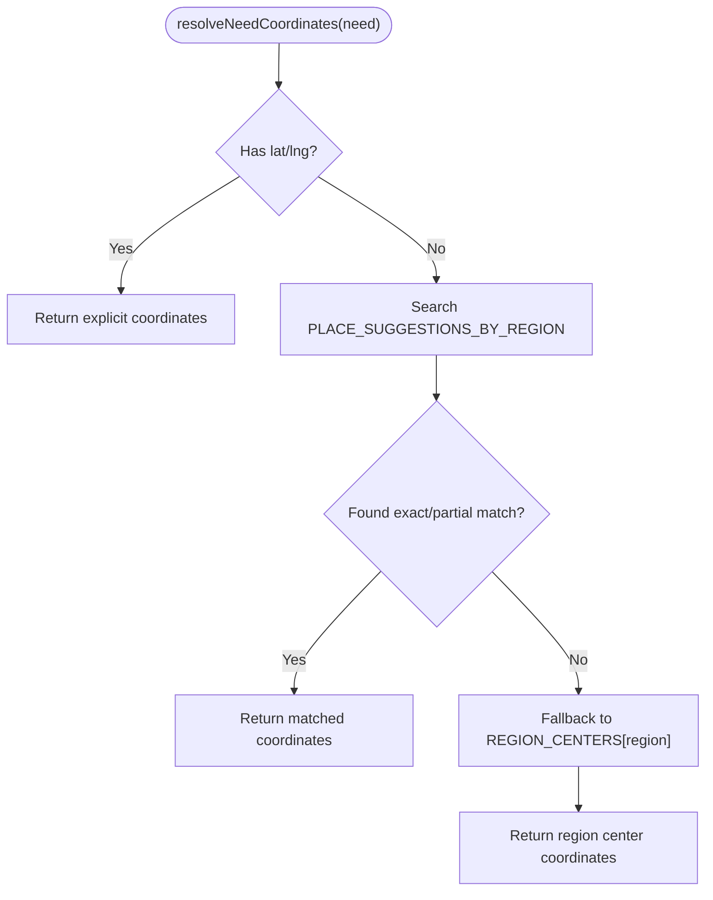

**Diagram sources**
- [gujaratPlaces.js:92-115](file://src/data/gujaratPlaces.js#L92-L115)

**Section sources**
- [gujaratPlaces.js:92-115](file://src/data/gujaratPlaces.js#L92-L115)

### Dynamic Chart Data Computation (api.js)
Aggregations:
- Categories: count by category, sort descending, cap colors.
- Regions: count by region, sort descending.
- Resolution: percentage of resolved tasks per category.

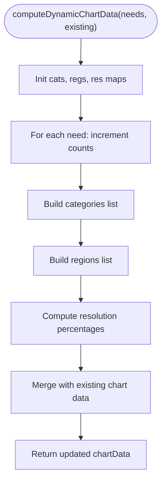

**Diagram sources**
- [api.js:218-238](file://src/services/api.js#L218-L238)

**Section sources**
- [api.js:218-238](file://src/services/api.js#L218-L238)

### Real-Time and Offline Integration
Hybrid approach:
- Real-time subscriptions via Firestore snapshots for needs and notifications.
- Fallback to cached data when network fails.
- Offline sync queues actions and replays on reconnect.

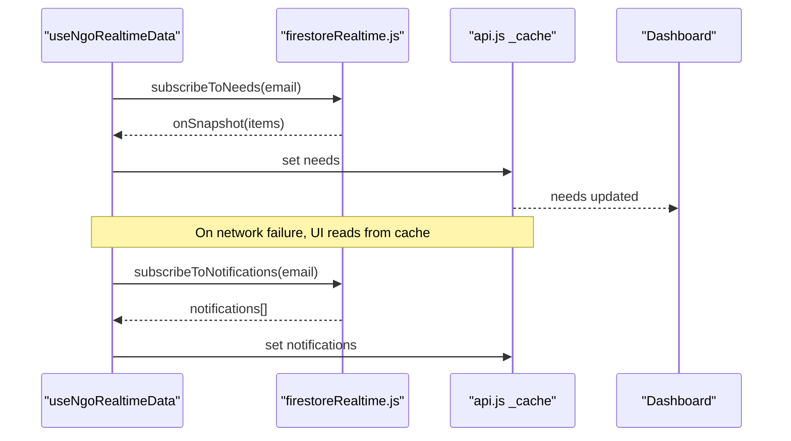

**Diagram sources**
- [useNgoRealtimeData.js:26-82](file://src/hooks/useNgoRealtimeData.js#L26-L82)
- [firestoreRealtime.js:61-103](file://src/services/firestoreRealtime.js#L61-L103)
- [api.js:299-310](file://src/services/api.js#L299-L310)

**Section sources**
- [useNgoRealtimeData.js:26-82](file://src/hooks/useNgoRealtimeData.js#L26-L82)
- [useOfflineSync.js:13-71](file://src/hooks/useOfflineSync.js#L13-L71)

### Emergency Mode Functionality
Activation process:
- Selects the highest-priority open need or first need as the target.
- Resolves coordinates from the selected need.
- Finds the nearest available volunteer using haversine distance.
- Updates needs, stats, notifications, and chart data atomically.
- Persists changes to Firestore.

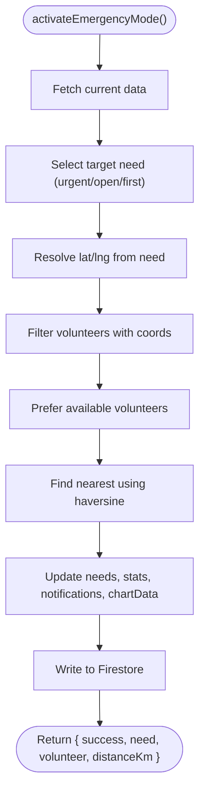

**Diagram sources**
- [api.js:428-517](file://src/services/api.js#L428-L517)
- [geo.js:31-36](file://src/utils/geo.js#L31-L36)

**Section sources**
- [api.js:428-517](file://src/services/api.js#L428-L517)

### Account Management
Features:
- NGO_TYPES enumeration.
- DEMO_ACCOUNTS seeded accounts.
- Local storage persistence for extra accounts.
- Authentication endpoints in backend mirror client-side accounts.

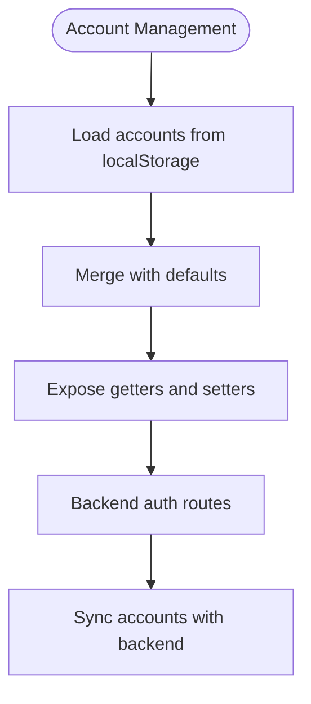

**Diagram sources**
- [api.js:565-599](file://src/services/api.js#L565-L599)
- [auth.js:11-26](file://server/routes/auth.js#L11-L26)

**Section sources**
- [api.js:565-599](file://src/services/api.js#L565-L599)
- [auth.js:11-26](file://server/routes/auth.js#L11-L26)

### Usage Examples and Patterns
Common patterns:
- Dashboard loads stats, needs, and chart data concurrently.
- Task creation validates input, resolves coordinates, and persists to Firestore.
- Volunteer creation validates profile, computes distance, and persists.

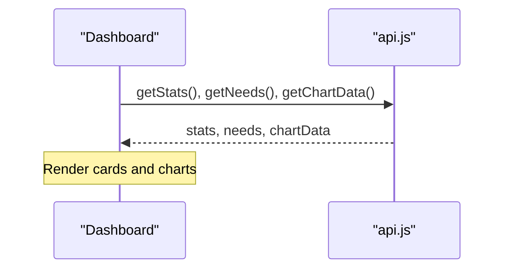

**Diagram sources**
- [Dashboard.jsx:64-83](file://src/pages/Dashboard.jsx#L64-L83)

**Section sources**
- [Dashboard.jsx:64-83](file://src/pages/Dashboard.jsx#L64-L83)
- [AddTaskModal.jsx:84-133](file://src/components/AddTaskModal.jsx#L84-L133)
- [AddVolunteerModal.jsx:51-90](file://src/components/AddVolunteerModal.jsx#L51-L90)

## Dependency Analysis
- api.js depends on:
  - firestoreRealtime.js for Firestore operations.
  - validation.js for data sanitization.
  - gujaratPlaces.js for coordinate resolution.
  - geo.js for distance computations.
  - maps.js for travel time estimation (separate module).
- React hooks depend on firestoreRealtime.js for subscriptions.
- Backend integration via backendApi.js for AI and matching.

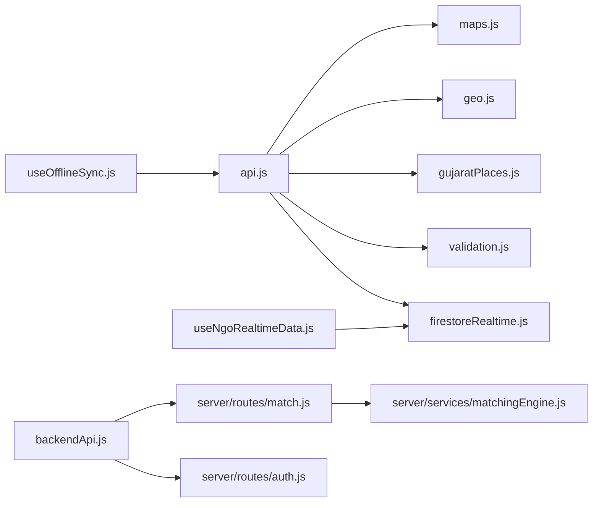

**Diagram sources**
- [api.js:1-11](file://src/services/api.js#L1-L11)
- [firestoreRealtime.js:1-16](file://src/services/firestoreRealtime.js#L1-L16)
- [validation.js:1-6](file://src/utils/validation.js#L1-L6)
- [gujaratPlaces.js:1-6](file://src/data/gujaratPlaces.js#L1-L6)
- [geo.js:1-2](file://src/utils/geo.js#L1-L2)
- [maps.js:1-3](file://src/services/maps.js#L1-L3)
- [useNgoRealtimeData.js:1-6](file://src/hooks/useNgoRealtimeData.js#L1-L6)
- [useOfflineSync.js:1-4](file://src/hooks/useOfflineSync.js#L1-L4)
- [backendApi.js:10-17](file://src/services/backendApi.js#L10-L17)
- [auth.js:1-4](file://server/routes/auth.js#L1-L4)
- [match.js:1-7](file://server/routes/match.js#L1-L7)
- [matchingEngine.js:1-12](file://server/services/matchingEngine.js#L1-L12)

**Section sources**
- [api.js:1-11](file://src/services/api.js#L1-L11)
- [firestoreRealtime.js:1-16](file://src/services/firestoreRealtime.js#L1-L16)
- [backendApi.js:10-17](file://src/services/backendApi.js#L10-L17)

## Performance Considerations
- Caching: Use _cache Map to avoid repeated Firestore reads; invalidate on mutations.
- Validation: Perform client-side validation to prevent invalid writes and reduce backend load.
- Coordinate resolution: Use curated place lists to minimize expensive lookups.
- Real-time updates: Subscribe to incremental changes; debounce UI updates to reduce re-renders.
- Distance computations: Cache results where appropriate (e.g., maps.js distance matrix cache).
- Batch operations: Group related updates to minimize write operations.

[No sources needed since this section provides general guidance]

## Troubleshooting Guide
Common issues and resolutions:
- Network failures during getNeeds: The API falls back to cached data. Verify cache presence and ensure setAccount was called.
- Invalid need/volunteer data: Validation errors surface as user-friendly messages; check sanitizedData and error keys.
- Missing coordinates: Ensure resolveNeedCoordinates finds a match or region center; otherwise, provide explicit lat/lng.
- Real-time subscription errors: Inspect onSnapshot error callbacks and ensure email is set before subscribing.
- Offline scenarios: Use useOfflineSync to queue actions; on reconnect, replay queue via onReconnectSync.

**Section sources**
- [api.js:300-310](file://src/services/api.js#L300-L310)
- [validation.js:26-28](file://src/utils/validation.js#L26-L28)
- [gujaratPlaces.js:92-115](file://src/data/gujaratPlaces.js#L92-L115)
- [firestoreRealtime.js:68-71](file://src/services/firestoreRealtime.js#L68-L71)
- [useOfflineSync.js:26-50](file://src/hooks/useOfflineSync.js#L26-L50)

## Conclusion
The API abstraction layer centralizes data access, enforces validation, resolves coordinates, and maintains dynamic analytics. Its hybrid real-time/local strategy ensures resilience and responsiveness. By leveraging caching, validation, and coordinate resolution, it provides a robust foundation for building scalable features while maintaining a consistent developer experience.

[No sources needed since this section summarizes without analyzing specific files]

## Appendices

### API Methods Reference
- getStats(): Retrieve aggregated stats.
- getNeeds(): Retrieve needs with real-time fallback.
- getVolunteers(): Retrieve volunteers.
- getNotifications(): Retrieve notifications.
- getUploads(): Retrieve upload records.
- getChartData(): Retrieve dynamic chart data.
- addNeed(data): Validate and persist a new need.
- addVolunteer(data): Validate and add a new volunteer.
- assignVolunteer(volId, needId): Update assignments and availability.
- resolveNeed(id): Mark a need as resolved and update stats.
- deleteNeed(id): Remove a need and recalculate stats.
- saveUploadNeeds(newNeeds, newUpload, newNotification): Bulk save and notify.
- activateEmergencyMode(): Auto-create urgent need and assign nearest volunteer.
- simulateIncident(): Generate a test incident for demos.

**Section sources**
- [api.js:299-562](file://src/services/api.js#L299-L562)