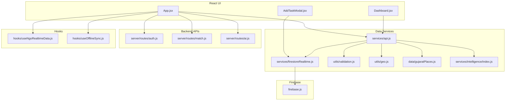
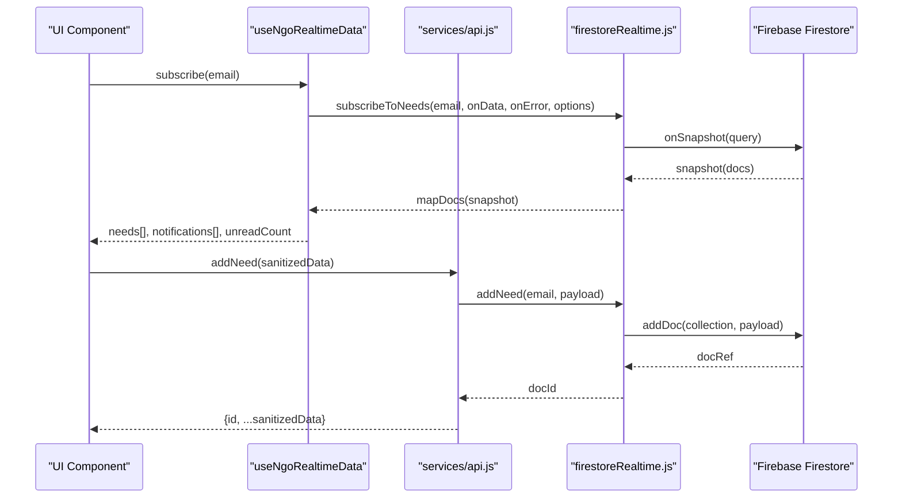
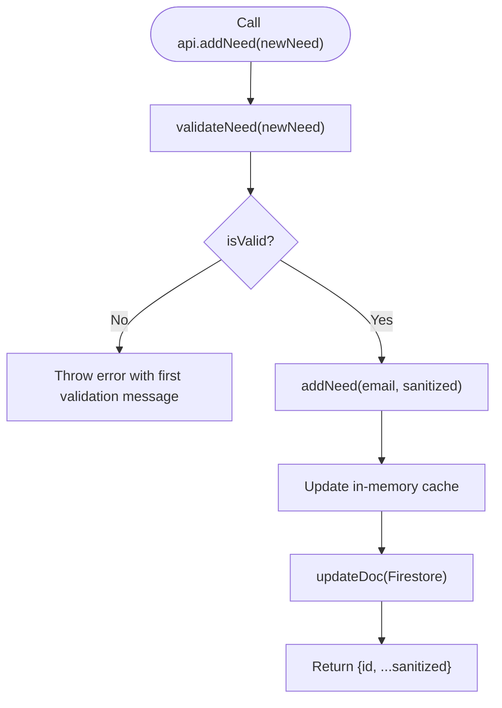
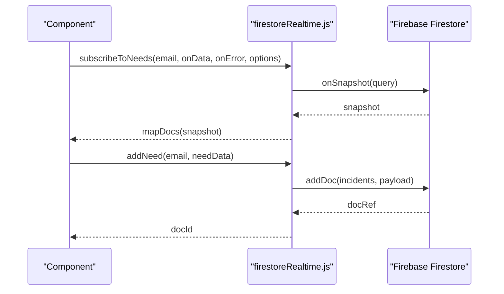
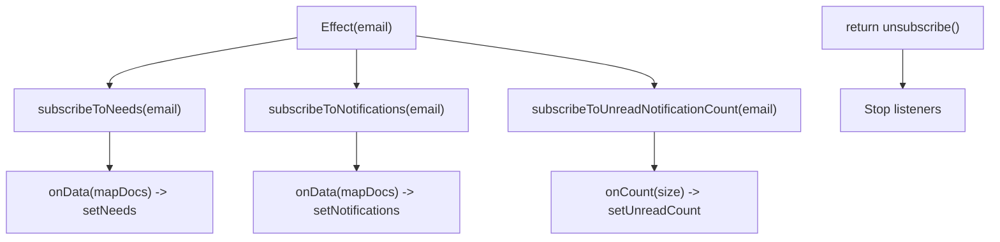
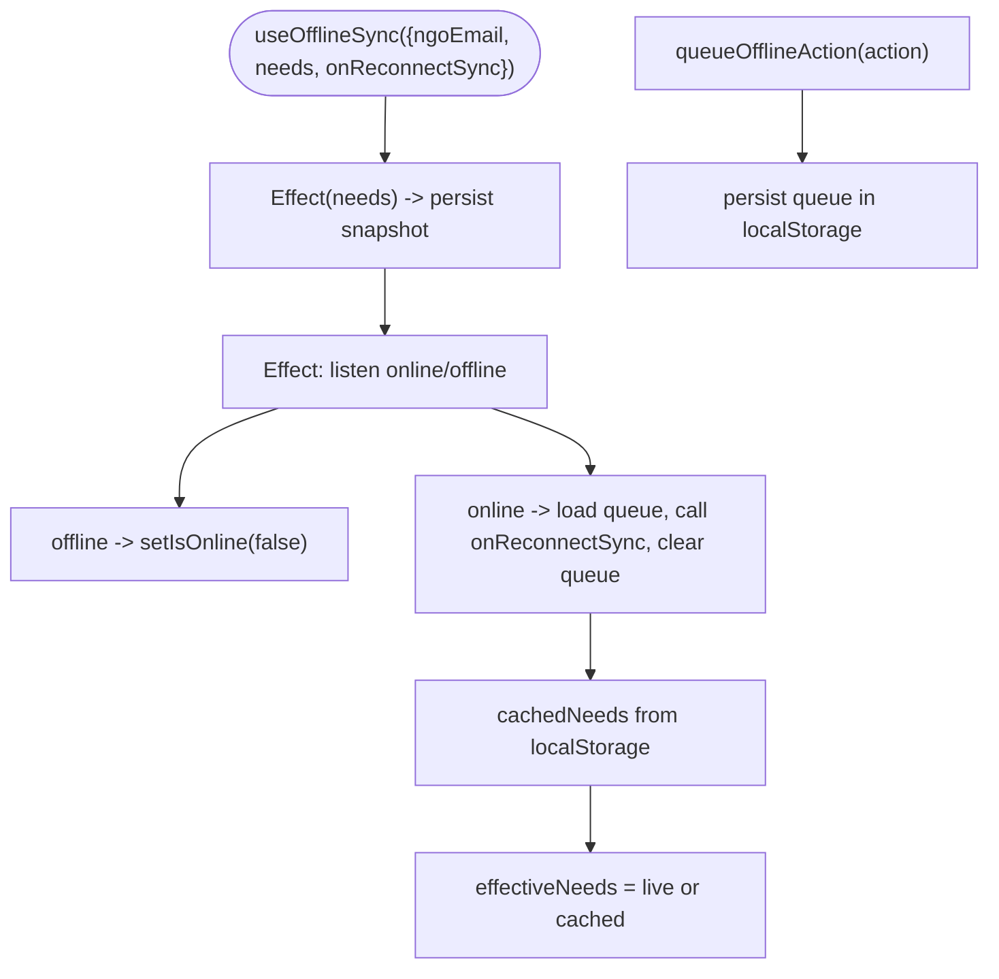
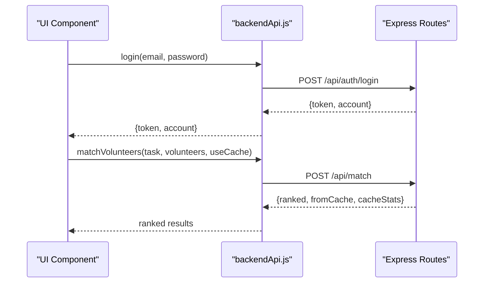
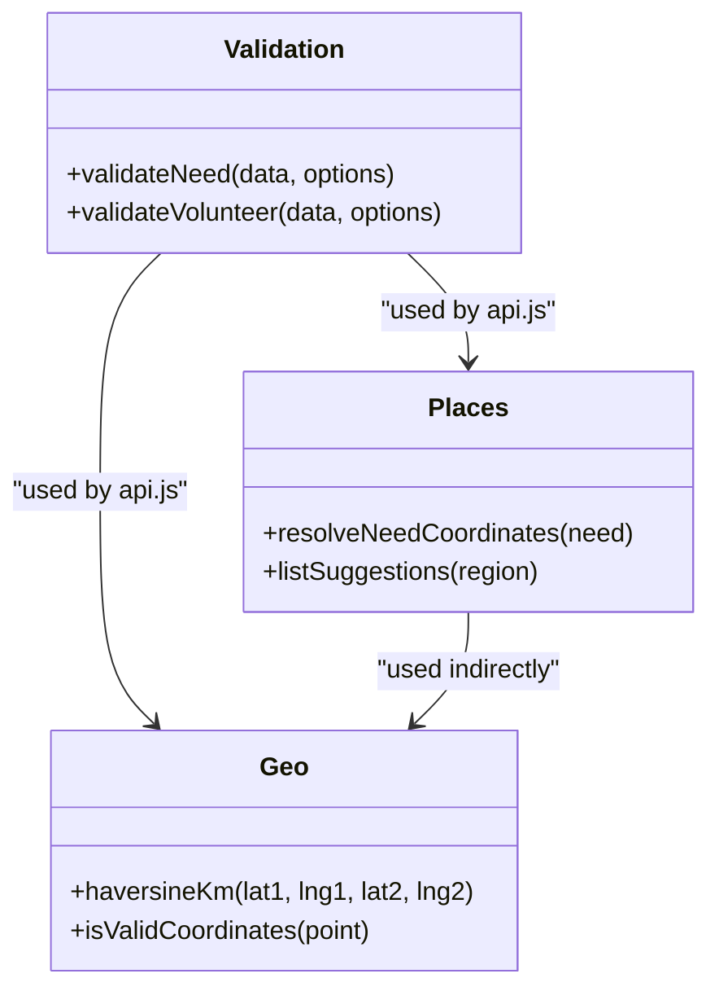
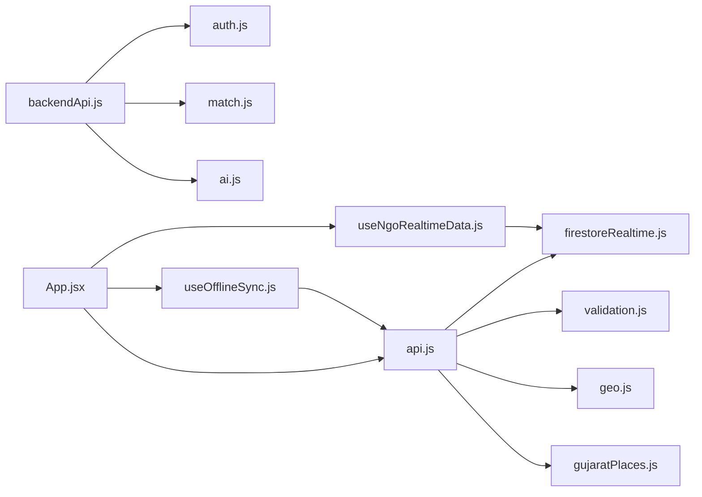

# Data Services

<cite>
**Referenced Files in This Document**
- [api.js](file://src/services/api.js)
- [backendApi.js](file://src/services/backendApi.js)
- [firestoreRealtime.js](file://src/services/firestoreRealtime.js)
- [useNgoRealtimeData.js](file://src/hooks/useNgoRealtimeData.js)
- [useOfflineSync.js](file://src/hooks/useOfflineSync.js)
- [firebase.js](file://src/firebase.js)
- [validation.js](file://src/utils/validation.js)
- [geo.js](file://src/utils/geo.js)
- [gujaratPlaces.js](file://src/data/gujaratPlaces.js)
- [index.js](file://src/services/intelligence/index.js)
- [App.jsx](file://src/App.jsx)
- [Dashboard.jsx](file://src/pages/Dashboard.jsx)
- [AddTaskModal.jsx](file://src/components/AddTaskModal.jsx)
- [auth.js](file://server/routes/auth.js)
- [match.js](file://server/routes/match.js)
- [ai.js](file://server/routes/ai.js)
</cite>

## Table of Contents
1. [Introduction](#introduction)
2. [Project Structure](#project-structure)
3. [Core Components](#core-components)
4. [Architecture Overview](#architecture-overview)
5. [Detailed Component Analysis](#detailed-component-analysis)
6. [Dependency Analysis](#dependency-analysis)
7. [Performance Considerations](#performance-considerations)
8. [Troubleshooting Guide](#troubleshooting-guide)
9. [Conclusion](#conclusion)
10. [Appendices](#appendices)

## Introduction
This document describes the data service layer that powers the application’s API communication, Firestore integration, real-time synchronization, offline capabilities, and backend authentication. It focuses on:
- API service abstractions for local and remote data access
- Real-time hooks for Firestore listeners
- Offline sync strategies and reconnection handling
- Practical patterns for CRUD, batch processing, and data transformation

## Project Structure
The data services span three layers:
- Local/Firestore layer: centralized in services/api.js and services/firestoreRealtime.js
- Backend HTTP layer: thin client in services/backendApi.js backed by Express routes
- React hooks: real-time subscriptions and offline persistence in hooks/useNgoRealtimeData.js and hooks/useOfflineSync.js

**Diagram sources**
- [App.jsx:1-200](file://src/App.jsx#L1-L200)
- [api.js:1-599](file://src/services/api.js#L1-L599)
- [firestoreRealtime.js:1-212](file://src/services/firestoreRealtime.js#L1-L212)
- [useNgoRealtimeData.js:1-83](file://src/hooks/useNgoRealtimeData.js#L1-L83)
- [useOfflineSync.js:1-72](file://src/hooks/useOfflineSync.js#L1-L72)
- [firebase.js:1-35](file://src/firebase.js#L1-L35)
- [validation.js:1-123](file://src/utils/validation.js#L1-L123)
- [geo.js:1-37](file://src/utils/geo.js#L1-L37)
- [gujaratPlaces.js:1-116](file://src/data/gujaratPlaces.js#L1-L116)
- [index.js:1-43](file://src/services/intelligence/index.js#L1-L43)
- [auth.js:1-83](file://server/routes/auth.js#L1-L83)
- [match.js:1-120](file://server/routes/match.js#L1-L120)
- [ai.js:1-348](file://server/routes/ai.js#L1-L348)

**Section sources**
- [api.js:1-599](file://src/services/api.js#L1-L599)
- [firestoreRealtime.js:1-212](file://src/services/firestoreRealtime.js#L1-L212)
- [backendApi.js:1-164](file://src/services/backendApi.js#L1-L164)
- [useNgoRealtimeData.js:1-83](file://src/hooks/useNgoRealtimeData.js#L1-L83)
- [useOfflineSync.js:1-72](file://src/hooks/useOfflineSync.js#L1-L72)
- [firebase.js:1-35](file://src/firebase.js#L1-L35)

## Core Components
- Central API facade: provides account-scoped data access, local caching, and Firestore-backed operations
- Firestore integration: typed queries, real-time listeners, and CRUD helpers
- Backend HTTP client: JWT-aware requests to authentication, AI, and matching endpoints
- Real-time hooks: subscription lifecycle, fingerprinting to avoid redundant renders, and unread counters
- Offline sync hook: localStorage-based snapshot and action queue with online/offline transitions

**Section sources**
- [api.js:295-562](file://src/services/api.js#L295-L562)
- [firestoreRealtime.js:61-212](file://src/services/firestoreRealtime.js#L61-L212)
- [backendApi.js:33-163](file://src/services/backendApi.js#L33-L163)
- [useNgoRealtimeData.js:26-82](file://src/hooks/useNgoRealtimeData.js#L26-L82)
- [useOfflineSync.js:13-71](file://src/hooks/useOfflineSync.js#L13-L71)

## Architecture Overview
The data layer integrates React hooks, a Firestore abstraction, and a backend HTTP client. UI components call the central API facade, which coordinates:
- Local/Firestore reads/writes
- Validation and transformation
- Real-time subscriptions
- Offline caching and re-sync
- Backend authentication and AI/matching services

**Diagram sources**
- [useNgoRealtimeData.js:33-72](file://src/hooks/useNgoRealtimeData.js#L33-L72)
- [firestoreRealtime.js:61-156](file://src/services/firestoreRealtime.js#L61-L156)
- [api.js:375-394](file://src/services/api.js#L375-L394)

**Section sources**
- [App.jsx:62-133](file://src/App.jsx#L62-L133)
- [Dashboard.jsx:64-83](file://src/pages/Dashboard.jsx#L64-L83)
- [AddTaskModal.jsx:84-133](file://src/components/AddTaskModal.jsx#L84-L133)

## Detailed Component Analysis

### API Service Abstractions (services/api.js)
Responsibilities:
- Account scoping and caching
- Local seed data initialization and fallback
- Coordinate Firestore-backed CRUD and analytics computation
- Data validation and sanitization before writes
- Emergency mode and incident simulation helpers

Key behaviors:
- Caching strategy: in-memory cache keyed by current NGO email
- Fallback to seeded data when Firestore is unavailable
- Validation pipeline ensures safe payloads for Firestore and UI
- Dynamic chart data recomputation based on needs

**Diagram sources**
- [api.js:375-394](file://src/services/api.js#L375-L394)
- [firestoreRealtime.js:132-156](file://src/services/firestoreRealtime.js#L132-L156)
- [validation.js:30-80](file://src/utils/validation.js#L30-L80)

**Section sources**
- [api.js:18-212](file://src/services/api.js#L18-L212)
- [api.js:295-562](file://src/services/api.js#L295-L562)
- [validation.js:30-123](file://src/utils/validation.js#L30-L123)

### Firestore Realtime Integration (services/firestoreRealtime.js)
Responsibilities:
- Build typed queries for needs, resources, and notifications
- Subscribe to real-time updates with error handling
- CRUD operations with server timestamps and validation
- Pagination helpers for notifications

Highlights:
- Query builders with optional filters and limits
- Snapshot mapping to plain objects with ids
- Dedicated helpers for incidents/resources and notification counts

**Diagram sources**
- [firestoreRealtime.js:61-156](file://src/services/firestoreRealtime.js#L61-L156)
- [firebase.js:1-35](file://src/firebase.js#L1-L35)

**Section sources**
- [firestoreRealtime.js:29-116](file://src/services/firestoreRealtime.js#L29-L116)
- [firestoreRealtime.js:132-212](file://src/services/firestoreRealtime.js#L132-L212)

### Real-Time Data Hooks (hooks/useNgoRealtimeData.js)
Responsibilities:
- Manage real-time subscriptions for needs and notifications
- Prevent unnecessary re-renders via fingerprint comparison
- Track unread notification counts
- Cleanup subscriptions on unmount

**Diagram sources**
- [useNgoRealtimeData.js:33-72](file://src/hooks/useNgoRealtimeData.js#L33-L72)
- [firestoreRealtime.js:61-116](file://src/services/firestoreRealtime.js#L61-L116)

**Section sources**
- [useNgoRealtimeData.js:8-24](file://src/hooks/useNgoRealtimeData.js#L8-L24)
- [useNgoRealtimeData.js:26-82](file://src/hooks/useNgoRealtimeData.js#L26-L82)

### Offline Sync (hooks/useOfflineSync.js)
Responsibilities:
- Persist a recent snapshot of needs to localStorage
- Queue actions while offline and replay on reconnect
- Expose online/offline status and cached needs
- Trigger re-evaluation on reconnect

**Diagram sources**
- [useOfflineSync.js:13-71](file://src/hooks/useOfflineSync.js#L13-L71)

**Section sources**
- [useOfflineSync.js:1-72](file://src/hooks/useOfflineSync.js#L1-L72)

### Backend API Client (services/backendApi.js)
Responsibilities:
- JWT token management in sessionStorage
- Typed HTTP methods for auth, AI, and matching
- Request wrapper handles errors and attaches Authorization header

**Diagram sources**
- [backendApi.js:33-163](file://src/services/backendApi.js#L33-L163)
- [auth.js:34-52](file://server/routes/auth.js#L34-L52)
- [match.js:33-77](file://server/routes/match.js#L33-L77)

**Section sources**
- [backendApi.js:1-164](file://src/services/backendApi.js#L1-L164)
- [auth.js:1-83](file://server/routes/auth.js#L1-L83)
- [match.js:1-120](file://server/routes/match.js#L1-L120)

### Data Transformation and Utilities
- Validation: robust sanitization and normalization for needs and volunteers
- Geospatial: coordinate validation and Haversine distance computation
- Place resolution: fallback coordinate resolution for needs without explicit lat/lng

**Diagram sources**
- [validation.js:30-123](file://src/utils/validation.js#L30-L123)
- [geo.js:15-37](file://src/utils/geo.js#L15-L37)
- [gujaratPlaces.js:92-116](file://src/data/gujaratPlaces.js#L92-L116)

**Section sources**
- [validation.js:1-123](file://src/utils/validation.js#L1-L123)
- [geo.js:1-37](file://src/utils/geo.js#L1-L37)
- [gujaratPlaces.js:1-116](file://src/data/gujaratPlaces.js#L1-L116)

### Practical Patterns and Examples

#### CRUD Operations
- Create: validated need creation via Firestore with server timestamps
- Read: paginated needs and notifications; cached fallback
- Update: incident status updates with server timestamps
- Delete: remove incidents by id

References:
- [firestoreRealtime.js:132-182](file://src/services/firestoreRealtime.js#L132-L182)
- [api.js:375-394](file://src/services/api.js#L375-L394)
- [api.js:342-354](file://src/services/api.js#L342-L354)
- [api.js:356-373](file://src/services/api.js#L356-L373)

#### Batch Processing
- Batch recommendations for multiple tasks via backend
- Batch report analysis via AI endpoints

References:
- [backendApi.js:144-149](file://src/services/backendApi.js#L144-L149)
- [match.js:82-105](file://server/routes/match.js#L82-L105)
- [ai.js:296-345](file://server/routes/ai.js#L296-L345)

#### Data Transformation Patterns
- Seed data injection and coordinate resolution
- Dynamic chart data aggregation
- Validation before write and sanitization

References:
- [api.js:18-212](file://src/services/api.js#L18-L212)
- [api.js:218-238](file://src/services/api.js#L218-L238)
- [validation.js:30-80](file://src/utils/validation.js#L30-L80)

## Dependency Analysis
- api.js depends on Firestore, validation, geospatial utilities, and place resolution
- firestoreRealtime.js depends on Firebase and exposes typed subscriptions and CRUD
- useNgoRealtimeData.js composes Firestore subscriptions and manages state
- useOfflineSync.js persists snapshots and queues actions to localStorage
- backendApi.js depends on server routes for auth, AI, and matching
- UI components depend on hooks and API facade for data orchestration

**Diagram sources**
- [api.js:1-12](file://src/services/api.js#L1-L12)
- [firestoreRealtime.js:1-17](file://src/services/firestoreRealtime.js#L1-L17)
- [useNgoRealtimeData.js:1-7](file://src/hooks/useNgoRealtimeData.js#L1-L7)
- [useOfflineSync.js:1-1](file://src/hooks/useOfflineSync.js#L1-L1)
- [backendApi.js:1-8](file://src/services/backendApi.js#L1-L8)
- [auth.js:1-5](file://server/routes/auth.js#L1-L5)
- [match.js:1-7](file://server/routes/match.js#L1-L7)
- [ai.js:1-7](file://server/routes/ai.js#L1-L7)

**Section sources**
- [App.jsx:1-28](file://src/App.jsx#L1-L28)
- [Dashboard.jsx:1-29](file://src/pages/Dashboard.jsx#L1-L29)
- [AddTaskModal.jsx:1-14](file://src/components/AddTaskModal.jsx#L1-L14)

## Performance Considerations
- Real-time listeners: use pagination and ordering to limit payload sizes
- Caching: in-memory cache in api.js reduces Firestore reads; ensure cache invalidation on mutations
- Offline queue: keep action payloads minimal; cap queue length and TTL
- Validation: run early to prevent wasted network calls and invalid writes
- Chart computations: memoize and throttle heavy aggregations

## Troubleshooting Guide
Common issues and resolutions:
- Authentication failures: confirm JWT token presence and validity; check backend auth route responses
- Real-time listener errors: inspect onSnapshot error callbacks and network connectivity
- Validation errors: ensure sanitized fields meet constraints before write attempts
- Offline reconnection: verify localStorage availability and queue replay logic

**Section sources**
- [backendApi.js:45-54](file://src/services/backendApi.js#L45-L54)
- [firestoreRealtime.js:68-115](file://src/services/firestoreRealtime.js#L68-L115)
- [validation.js:26-80](file://src/utils/validation.js#L26-L80)
- [useOfflineSync.js:26-50](file://src/hooks/useOfflineSync.js#L26-L50)

## Conclusion
The data service layer combines a robust Firestore abstraction, typed real-time subscriptions, offline-first strategies, and a JWT-enabled backend client. Together, they enable responsive UIs, reliable offline operation, and scalable integrations with AI and matching engines.

## Appendices

### API Surface Summary
- api.js: account-scoped getters, mutations, and emergency helpers
- firestoreRealtime.js: typed queries, subscriptions, and CRUD
- backendApi.js: auth, AI, and matching endpoints
- useNgoRealtimeData.js: real-time subscriptions and unread counts
- useOfflineSync.js: snapshot caching and action queueing

**Section sources**
- [api.js:295-562](file://src/services/api.js#L295-L562)
- [firestoreRealtime.js:61-212](file://src/services/firestoreRealtime.js#L61-L212)
- [backendApi.js:56-163](file://src/services/backendApi.js#L56-L163)
- [useNgoRealtimeData.js:26-82](file://src/hooks/useNgoRealtimeData.js#L26-L82)
- [useOfflineSync.js:13-71](file://src/hooks/useOfflineSync.js#L13-L71)