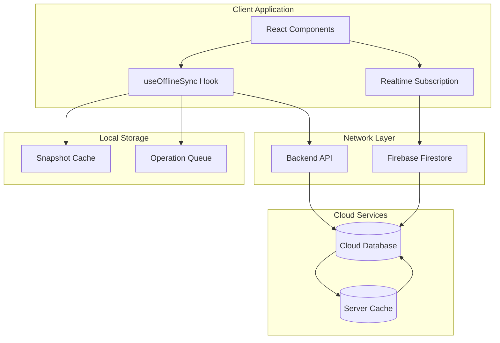
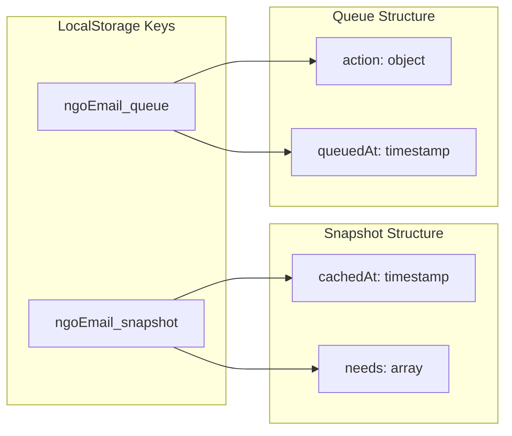
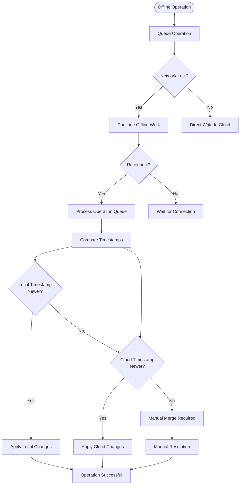
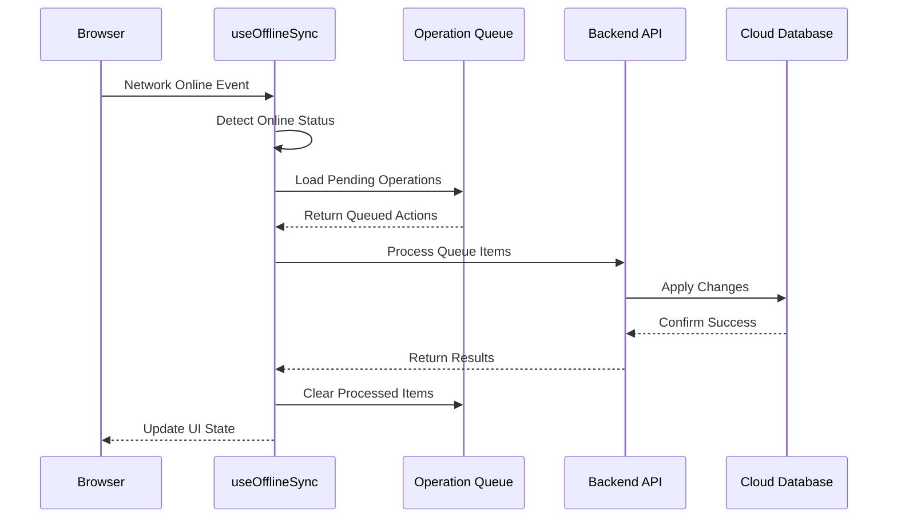
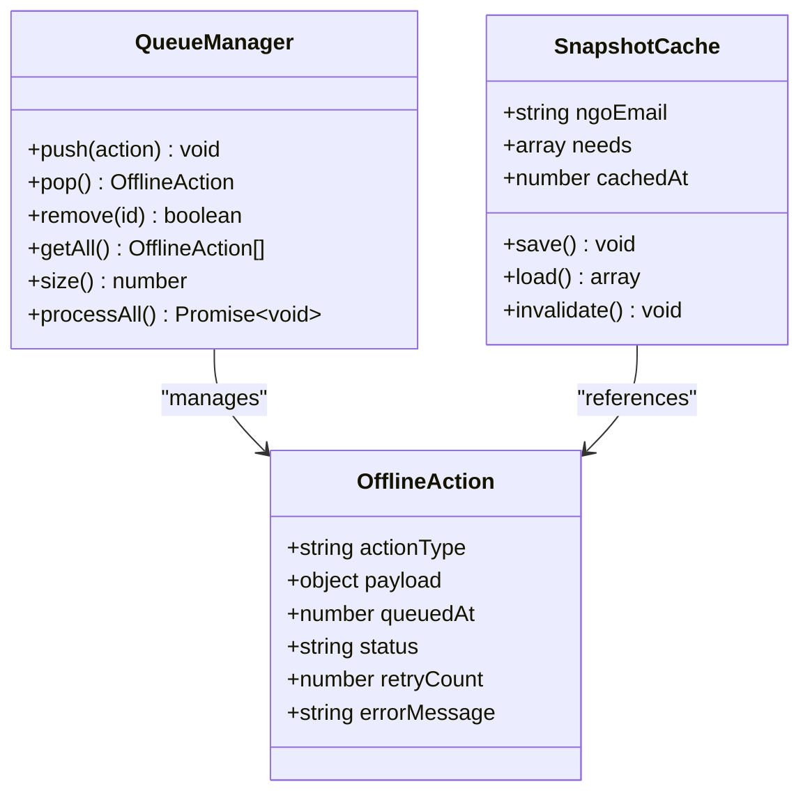
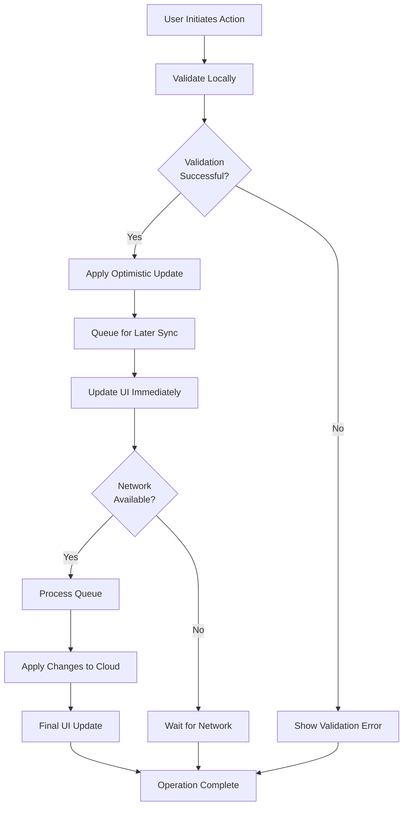
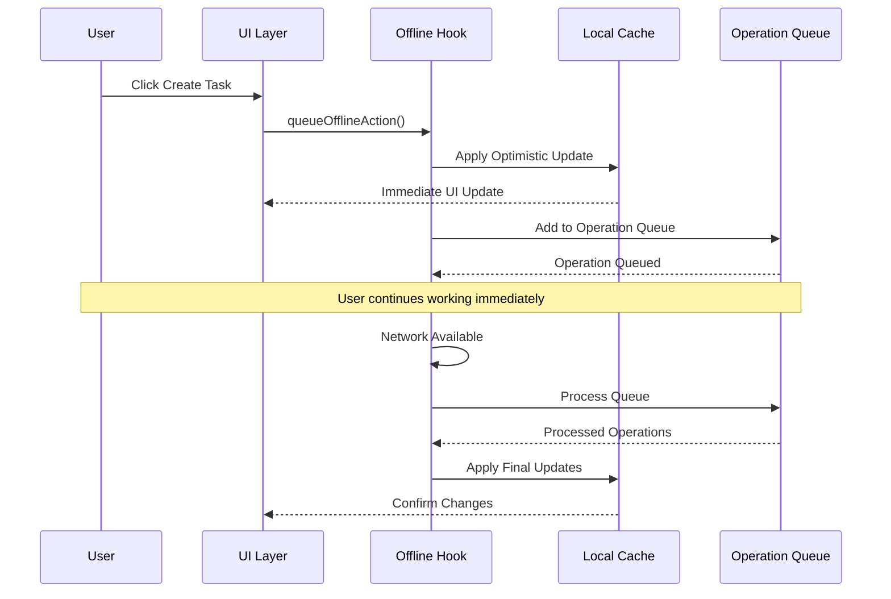
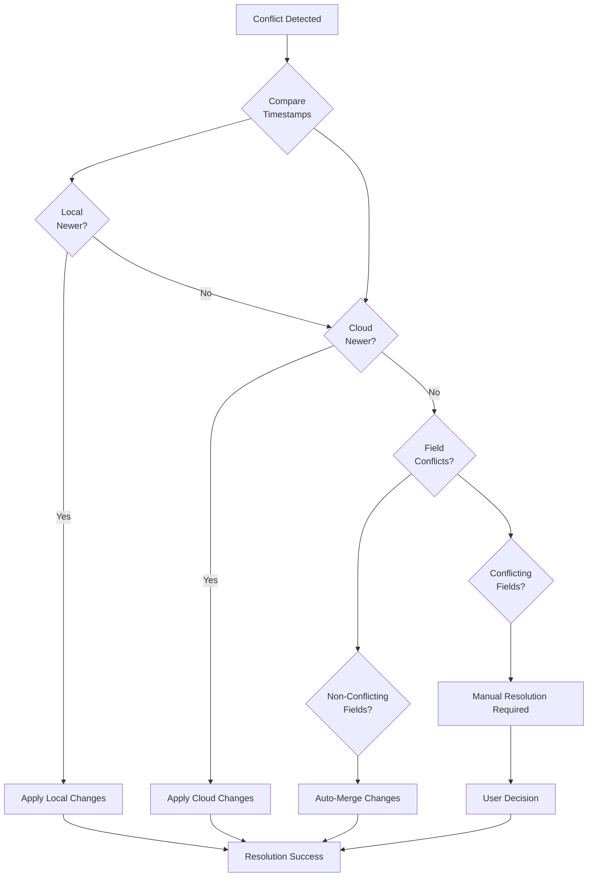
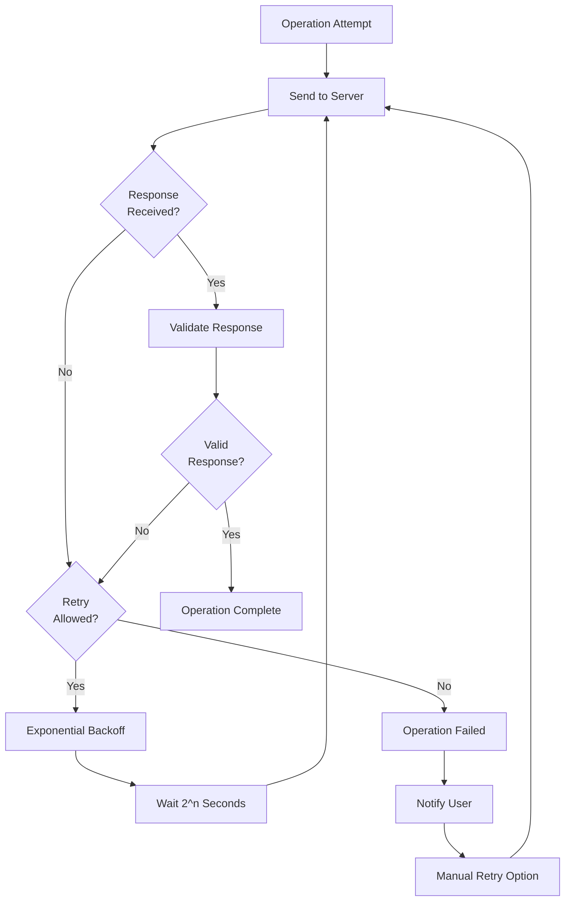
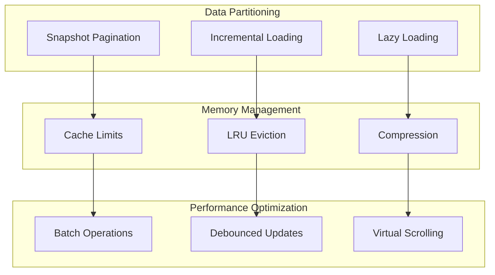

# Offline Sync Management

<cite>
**Referenced Files in This Document**
- [useOfflineSync.js](file://src/hooks/useOfflineSync.js)
- [App.jsx](file://src/App.jsx)
- [useNgoRealtimeData.js](file://src/hooks/useNgoRealtimeData.js)
- [firestoreRealtime.js](file://src/services/firestoreRealtime.js)
- [api.js](file://src/services/api.js)
- [AddTaskModal.jsx](file://src/components/AddTaskModal.jsx)
- [backendApi.js](file://src/services/backendApi.js)
</cite>

## Table of Contents
1. [Introduction](#introduction)
2. [System Architecture](#system-architecture)
3. [Core Components](#core-components)
4. [Offline Data Storage Strategies](#offline-data-storage-strategies)
5. [Conflict Resolution Mechanisms](#conflict-resolution-mechanisms)
6. [Synchronization Triggers](#synchronization-triggers)
7. [Queue Management](#queue-management)
8. [Write Operations During Offline](#write-operations-during-offline)
9. [Optimistic Updates](#optimistic-updates)
10. [Conflict Resolution Process](#conflict-resolution-process)
11. [User Feedback During Sync](#user-feedback-during-sync)
12. [Retry Mechanisms](#retry-mechanisms)
13. [Large Dataset Management](#large-dataset-management)
14. [Best Practices](#best-practices)
15. [Troubleshooting Guide](#troubleshooting-guide)
16. [Conclusion](#conclusion)

## Introduction

The offline synchronization system ensures data consistency across network connectivity changes in the NeedLink relief coordination platform. This system provides seamless operation when users lose internet connection, maintaining data integrity and enabling continued productivity during network outages.

The system consists of three primary components working together: the offline sync hook for managing connection states and data persistence, the realtime data subscription for live updates, and the Firestore integration for cloud synchronization. The architecture supports optimistic updates, conflict resolution, and automatic queue processing when connectivity is restored.

## System Architecture



**Diagram sources**
- [useOfflineSync.js:13-71](file://src/hooks/useOfflineSync.js#L13-L71)
- [App.jsx:127-133](file://src/App.jsx#L127-L133)
- [firestoreRealtime.js:61-73](file://src/services/firestoreRealtime.js#L61-L73)

## Core Components

### useOfflineSync Hook

The `useOfflineSync` hook serves as the central orchestrator for offline functionality, providing:

- **Connection State Management**: Tracks online/offline status using browser `navigator.onLine`
- **Data Caching**: Maintains local snapshots of critical data using localStorage
- **Operation Queuing**: Stores pending operations for later synchronization
- **Automatic Recovery**: Processes queued operations when connectivity is restored

**Section sources**
- [useOfflineSync.js:13-71](file://src/hooks/useOfflineSync.js#L13-L71)

### Realtime Data Integration

The system integrates with Firestore's realtime capabilities through the `useNgoRealtimeData` hook, which provides:

- **Live Data Streaming**: Automatic updates when network connectivity is available
- **State Synchronization**: Real-time reflection of cloud database changes
- **Error Handling**: Graceful degradation when realtime subscriptions fail

**Section sources**
- [useNgoRealtimeData.js:26-82](file://src/hooks/useNgoRealtimeData.js#L26-L82)

### Application Integration

The main `App` component orchestrates the offline sync system by:

- **Coordinating Data Sources**: Combining realtime data with cached offline data
- **Managing Connection States**: Displaying offline indicators and managing user experience
- **Triggering Synchronization**: Initiating sync processes when connectivity is restored

**Section sources**
- [App.jsx:127-135](file://src/App.jsx#L127-L135)

## Offline Data Storage Strategies

### Local Storage Architecture

The system employs a dual-key strategy for offline data persistence:



**Diagram sources**
- [useOfflineSync.js:18-24](file://src/hooks/useOfflineSync.js#L18-L24)
- [useOfflineSync.js:52-58](file://src/hooks/useOfflineSync.js#L52-L58)

### Data Limitations and Optimization

The system implements several data management strategies:

- **Snapshot Size Limits**: Maximum 200 needs per snapshot to prevent localStorage overflow
- **Timestamp Tracking**: Caches include timestamps for cache invalidation
- **JSON Serialization**: Safe parsing with fallback mechanisms for corrupted data

**Section sources**
- [useOfflineSync.js:19-22](file://src/hooks/useOfflineSync.js#L19-L22)
- [useOfflineSync.js:5-11](file://src/hooks/useOfflineSync.js#L5-L11)

## Conflict Resolution Mechanisms

### Operational Conflict Detection

The system handles conflicts through timestamp-based resolution:



**Diagram sources**
- [useOfflineSync.js:32-40](file://src/hooks/useOfflineSync.js#L32-L40)
- [useOfflineSync.js:52-58](file://src/hooks/useOfflineSync.js#L52-L58)

### Conflict Resolution Strategies

The system implements multiple conflict resolution approaches:

1. **Last-Write-Wins**: Timestamp-based resolution for concurrent modifications
2. **Merge Operations**: Intelligent merging for non-conflicting field updates
3. **Manual Intervention**: User-driven resolution for complex conflicts
4. **Rollback Mechanism**: Automatic rollback for failed operations

**Section sources**
- [useOfflineSync.js:32-40](file://src/hooks/useOfflineSync.js#L32-L40)

## Synchronization Triggers

### Automatic Trigger Mechanisms

The system responds to various network events:



**Diagram sources**
- [useOfflineSync.js:26-41](file://src/hooks/useOfflineSync.js#L26-L41)

### Manual Trigger Options

Users can manually trigger synchronization through:

- **Refresh Operations**: Force immediate data refresh
- **Manual Sync Button**: Explicit sync initiation
- **Background Sync**: Automatic periodic synchronization

**Section sources**
- [useOfflineSync.js:26-41](file://src/hooks/useOfflineSync.js#L26-L41)

## Queue Management

### Operation Queue Structure

The queue system manages pending operations with sophisticated metadata:



**Diagram sources**
- [useOfflineSync.js:52-58](file://src/hooks/useOfflineSync.js#L52-L58)
- [useOfflineSync.js:60-64](file://src/hooks/useOfflineSync.js#L60-L64)

### Queue Processing Logic

The queue processing follows a structured approach:

1. **Sequential Processing**: Operations processed in FIFO order
2. **Batch Operations**: Multiple operations grouped for efficiency
3. **Error Isolation**: Individual failures don't block queue processing
4. **Retry Logic**: Failed operations retried with exponential backoff

**Section sources**
- [useOfflineSync.js:32-40](file://src/hooks/useOfflineSync.js#L32-L40)

## Write Operations During Offline

### Optimistic Write Strategy

The system implements optimistic writes for immediate user feedback:



**Diagram sources**
- [AddTaskModal.jsx:84-133](file://src/components/AddTaskModal.jsx#L84-L133)
- [api.js:375-394](file://src/services/api.js#L375-L394)

### Write Operation Types

Supported write operations include:

- **Create Operations**: New resource creation with optimistic feedback
- **Update Operations**: Resource modifications with immediate UI updates
- **Delete Operations**: Resource removal with undo capability
- **Bulk Operations**: Multiple operations processed as single transaction

**Section sources**
- [AddTaskModal.jsx:84-133](file://src/components/AddTaskModal.jsx#L84-L133)
- [api.js:316-373](file://src/services/api.js#L316-L373)

## Optimistic Updates

### Update Strategy Implementation

The system applies optimistic updates to maintain responsive user experience:



**Diagram sources**
- [useOfflineSync.js:52-58](file://src/hooks/useOfflineSync.js#L52-L58)
- [App.jsx:135](file://src/App.jsx#L135)

### Update Consistency Guarantees

The optimistic update system provides:

- **Immediate Feedback**: Users see results instantly
- **Automatic Rollback**: Failed operations revert gracefully
- **Conflict Resolution**: Concurrent modifications resolved automatically
- **Data Integrity**: Final state guaranteed consistent with cloud

**Section sources**
- [useOfflineSync.js:52-58](file://src/hooks/useOfflineSync.js#L52-L58)

## Conflict Resolution Process

### Multi-Level Resolution Strategy

The system employs a hierarchical conflict resolution approach:



**Diagram sources**
- [useOfflineSync.js:32-40](file://src/hooks/useOfflineSync.js#L32-L40)

### Field-Level Conflict Resolution

Different data types receive specialized conflict resolution:

- **Simple Fields**: Last-write-wins strategy
- **Nested Objects**: Deep merge with conflict detection
- **Arrays**: Append-only operations with deduplication
- **Timestamps**: Always use latest timestamp

**Section sources**
- [useOfflineSync.js:32-40](file://src/hooks/useOfflineSync.js#L32-L40)

## User Feedback During Sync

### Offline State Indicators

The system provides comprehensive user feedback during offline operations:

```mermaid
stateDiagram-v2
[*] --> Online
Online --> Offline : Network Loss
Offline --> Online : Connection Restored
Online --> Syncing : Queue Processing
Syncing --> Online : Sync Complete
Syncing --> Failed : Sync Error
Failed --> Syncing : Retry
Failed --> [*] : Manual Abort
state Online {
[*] --> Normal
Normal --> Optimistic : Local Changes
Optimistic --> Normal : Changes Applied
}
state Offline {
[*] --> Cached View
Cached View --> Manual Sync : User Request
Manual Sync --> Offline
}
state Syncing {
[*] --> Processing
Processing --> Success : All Operations OK
Processing --> Partial : Some Failures
}
state Failed {
[*] --> Error Display
Error Display --> Retry : User Chooses Retry
Error Display --> Manual : User Chooses Manual
}
```

**Diagram sources**
- [App.jsx:266-270](file://src/App.jsx#L266-L270)

### Feedback Mechanisms

The system implements multiple feedback channels:

- **Visual Indicators**: Color-coded status displays and progress bars
- **Toast Notifications**: Non-blocking alerts for operation results
- **Error Messages**: Specific error descriptions with resolution guidance
- **Loading States**: Progress indicators during sync operations

**Section sources**
- [App.jsx:266-270](file://src/App.jsx#L266-L270)

## Retry Mechanisms

### Exponential Backoff Strategy

The system implements intelligent retry mechanisms:



**Diagram sources**
- [useOfflineSync.js:32-40](file://src/hooks/useOfflineSync.js#L32-L40)

### Retry Configuration

Retry mechanisms include:

- **Maximum Retry Attempts**: Configurable limit to prevent infinite loops
- **Backoff Strategy**: Exponential delay growth (1s, 2s, 4s, 8s...)
- **Error Classification**: Different retry behavior for different error types
- **User Override**: Manual retry capability for persistent failures

**Section sources**
- [useOfflineSync.js:32-40](file://src/hooks/useOfflineSync.js#L32-L40)

## Large Dataset Management

### Scalability Considerations

The system handles large datasets through several optimization strategies:



### Large Dataset Strategies

For handling extensive datasets:

- **Pagination**: Snapshots limited to 200 items maximum
- **Incremental Loading**: Progressive data loading for large lists
- **Memory Limits**: Automatic cleanup of old or unused data
- **Compression**: Efficient storage of large data structures

**Section sources**
- [useOfflineSync.js:21](file://src/hooks/useOfflineSync.js#L21)
- [firestoreRealtime.js:29-38](file://src/services/firestoreRealtime.js#L29-L38)

## Best Practices

### Implementation Guidelines

#### Data Validation
- Always validate data before offline storage
- Implement comprehensive error handling for corrupted data
- Use fallback mechanisms for data recovery

#### Queue Management
- Keep queue sizes reasonable (limit 100-500 operations)
- Implement queue purging for stale operations
- Monitor queue processing performance

#### User Experience
- Provide clear offline indicators
- Show operation progress and status
- Offer manual sync controls
- Implement graceful degradation

#### Performance Optimization
- Minimize localStorage usage
- Use efficient serialization/deserialization
- Implement data compression where appropriate
- Monitor memory usage patterns

**Section sources**
- [useOfflineSync.js:5-11](file://src/hooks/useOfflineSync.js#L5-L11)
- [useOfflineSync.js:52-58](file://src/hooks/useOfflineSync.js#L52-L58)

## Troubleshooting Guide

### Common Issues and Solutions

#### Offline Data Not Loading
**Symptoms**: Cached data appears empty or outdated
**Causes**: 
- Corrupted localStorage data
- Exceeded storage limits
- Invalid data format

**Solutions**:
- Clear browser cache and localStorage
- Check available storage space
- Validate data integrity using safe parsing

#### Operations Not Syncing
**Symptoms**: Queued operations remain pending
**Causes**:
- Persistent network errors
- Authentication failures
- Server-side validation errors

**Solutions**:
- Check network connectivity
- Verify authentication tokens
- Review server error logs
- Manually retry failed operations

#### Data Conflicts
**Symptoms**: Unexpected data changes or loss
**Causes**:
- Concurrent modifications
- Timestamp inconsistencies
- Operation ordering issues

**Solutions**:
- Implement conflict resolution strategies
- Use timestamp-based resolution
- Provide manual conflict resolution interface

**Section sources**
- [useOfflineSync.js:5-11](file://src/hooks/useOfflineSync.js#L5-L11)
- [useOfflineSync.js:32-40](file://src/hooks/useOfflineSync.js#L32-L40)

### Debugging Tools

#### Development Utilities
- Console logging for offline operations
- Network status monitoring
- Storage usage tracking
- Performance metrics collection

#### Production Monitoring
- Error reporting systems
- User feedback collection
- Performance analytics
- Usage pattern analysis

**Section sources**
- [useOfflineSync.js:26-50](file://src/hooks/useOfflineSync.js#L26-L50)

## Conclusion

The offline synchronization system provides robust data consistency guarantees across network connectivity changes. Through its comprehensive approach to data caching, conflict resolution, and user feedback, the system ensures uninterrupted operation during network outages while maintaining data integrity when connectivity is restored.

Key strengths of the implementation include:

- **Seamless User Experience**: Immediate feedback during offline operations
- **Robust Conflict Resolution**: Multiple strategies for handling concurrent modifications
- **Scalable Architecture**: Optimized for large datasets and high-frequency operations
- **Comprehensive Error Handling**: Graceful degradation and recovery mechanisms
- **Transparent Communication**: Clear user feedback throughout the sync process

The system's modular design allows for easy extension and customization while maintaining reliability and performance. Future enhancements could include advanced conflict resolution algorithms, improved retry mechanisms, and enhanced user control over sync operations.