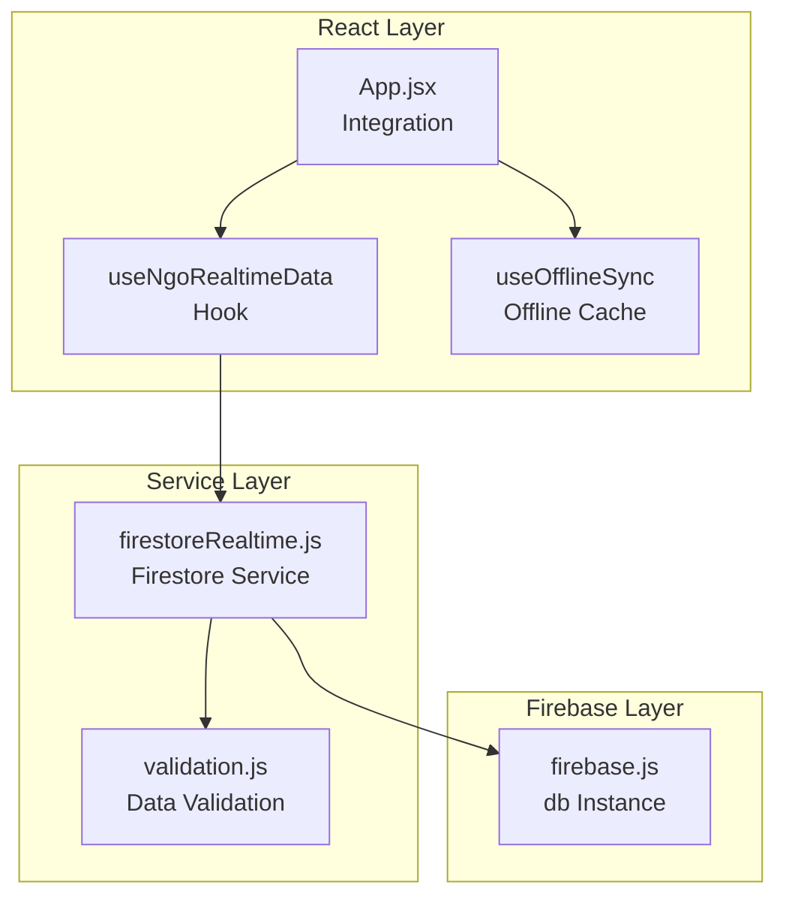
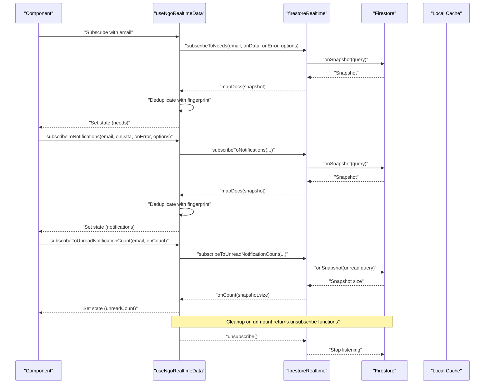
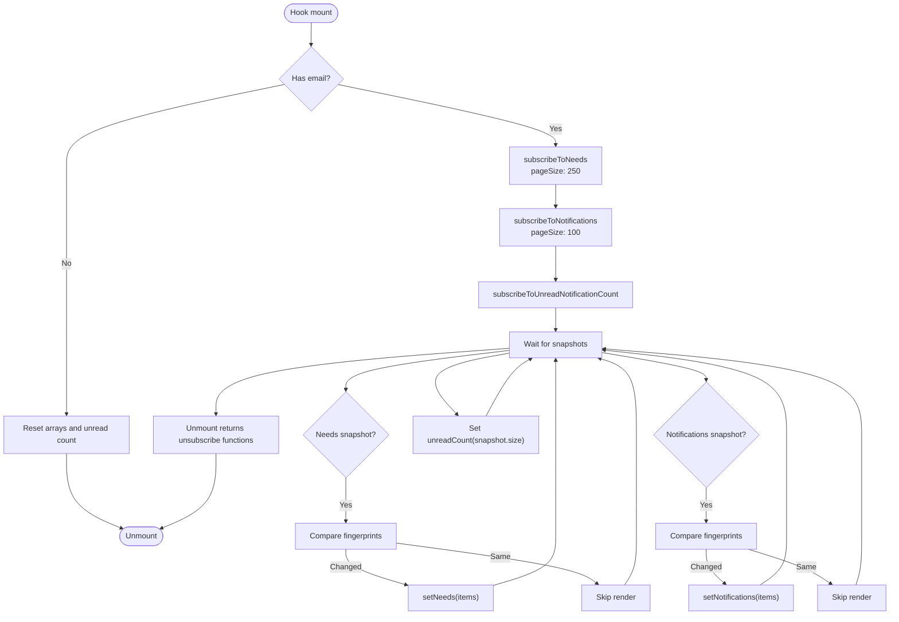
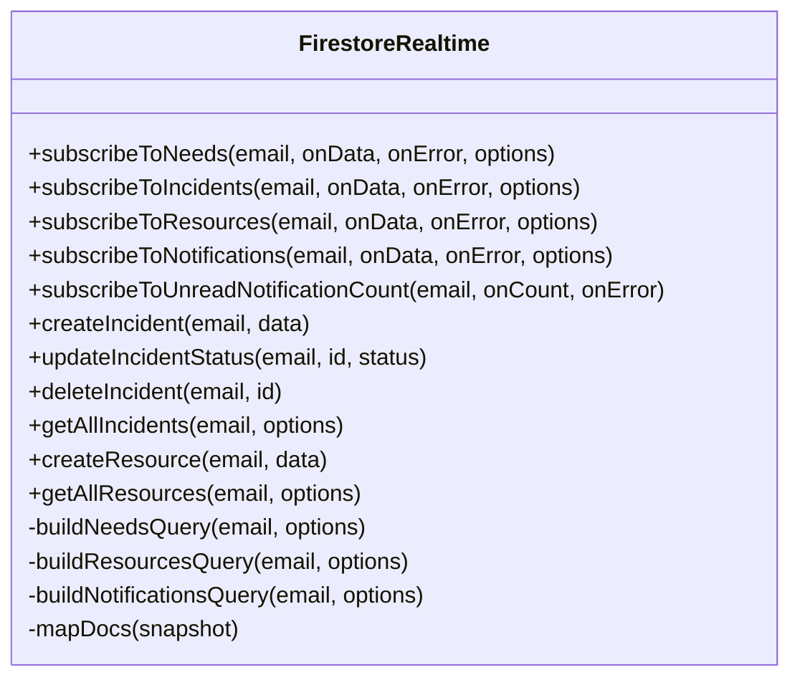
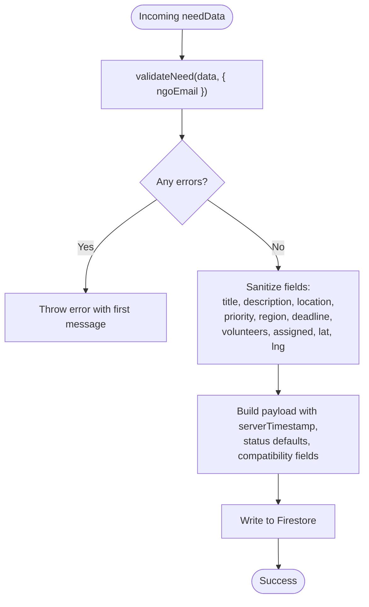
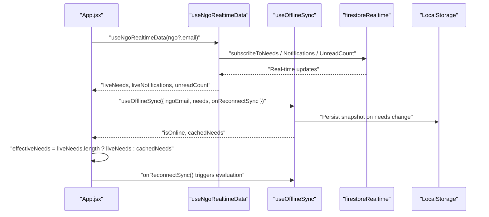
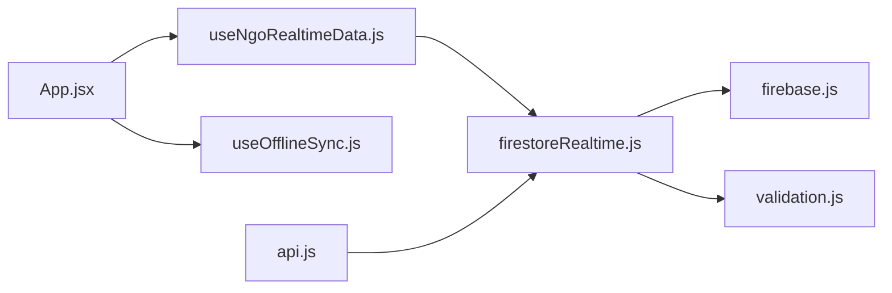

# Real-time Data Hooks

<cite>
**Referenced Files in This Document**
- [useNgoRealtimeData.js](file://src/hooks/useNgoRealtimeData.js)
- [firestoreRealtime.js](file://src/services/firestoreRealtime.js)
- [firebase.js](file://src/firebase.js)
- [validation.js](file://src/utils/validation.js)
- [App.jsx](file://src/App.jsx)
- [useOfflineSync.js](file://src/hooks/useOfflineSync.js)
- [api.js](file://src/services/api.js)
- [firestoreSchema.md](file://src/services/firestoreSchema.md)
</cite>

## Table of Contents
1. [Introduction](#introduction)
2. [Project Structure](#project-structure)
3. [Core Components](#core-components)
4. [Architecture Overview](#architecture-overview)
5. [Detailed Component Analysis](#detailed-component-analysis)
6. [Dependency Analysis](#dependency-analysis)
7. [Performance Considerations](#performance-considerations)
8. [Troubleshooting Guide](#troubleshooting-guide)
9. [Conclusion](#conclusion)

## Introduction
This document describes the real-time data synchronization system built with React hooks and Firestore listeners. It focuses on the `useNgoRealtimeData` hook and the `firestoreRealtime` service, explaining how Firestore collections are monitored, how automatic updates propagate to components, and how subscriptions are managed and cleaned up. It also covers the service functions for creating, updating, and deleting incidents, and how they integrate with the hook system. The document includes usage patterns, error handling strategies, performance considerations for multiple simultaneous listeners, and the relationship between real-time updates and the local cache system.

## Project Structure
The real-time synchronization spans several modules:
- Hook layer: `useNgoRealtimeData` manages Firestore listeners and state for needs, notifications, and unread counts.
- Service layer: `firestoreRealtime` encapsulates Firestore queries, snapshots, and CRUD operations.
- Validation: `validation.js` sanitizes and validates incident data before writes.
- App integration: `App.jsx` demonstrates how the hook integrates with the application and how offline caching is coordinated.
- Offline sync: `useOfflineSync.js` maintains a local cache and queues actions during offline periods.
- Backend API bridge: `api.js` exposes higher-level operations that delegate to Firestore service functions.

**Diagram sources**
- [useNgoRealtimeData.js:1-83](file://src/hooks/useNgoRealtimeData.js#L1-L83)
- [firestoreRealtime.js:1-212](file://src/services/firestoreRealtime.js#L1-L212)
- [firebase.js:1-35](file://src/firebase.js#L1-L35)
- [validation.js:1-123](file://src/utils/validation.js#L1-L123)
- [App.jsx:29-62](file://src/App.jsx#L29-L62)
- [useOfflineSync.js:1-72](file://src/hooks/useOfflineSync.js#L1-L72)

**Section sources**
- [useNgoRealtimeData.js:1-83](file://src/hooks/useNgoRealtimeData.js#L1-L83)
- [firestoreRealtime.js:1-212](file://src/services/firestoreRealtime.js#L1-L212)
- [firebase.js:1-35](file://src/firebase.js#L1-L35)
- [validation.js:1-123](file://src/utils/validation.js#L1-L123)
- [App.jsx:29-62](file://src/App.jsx#L29-L62)
- [useOfflineSync.js:1-72](file://src/hooks/useOfflineSync.js#L1-L72)

## Core Components
- useNgoRealtimeData: A React hook that subscribes to Firestore collections for needs, notifications, and unread counts. It manages subscription lifecycle, deduplicates updates, and exposes normalized data to consumers.
- firestoreRealtime: A service module providing Firestore listeners and CRUD operations for incidents and resources. It builds typed queries, maps snapshots to documents, and handles errors.
- validation: Validates and sanitizes incident data before writing to Firestore, preventing malformed payloads and stored XSS.
- App integration: Demonstrates how the hook is used to power the dashboard and other views, and how offline caching is coordinated.

**Section sources**
- [useNgoRealtimeData.js:26-82](file://src/hooks/useNgoRealtimeData.js#L26-L82)
- [firestoreRealtime.js:61-116](file://src/services/firestoreRealtime.js#L61-L116)
- [validation.js:30-80](file://src/utils/validation.js#L30-L80)
- [App.jsx:62](file://src/App.jsx#L62)

## Architecture Overview
The real-time system follows a layered architecture:
- React hooks orchestrate subscriptions and state.
- Service functions encapsulate Firestore operations and query construction.
- Validation ensures data integrity before writes.
- Offline sync maintains a local cache and replays actions upon reconnection.

**Diagram sources**
- [useNgoRealtimeData.js:33-72](file://src/hooks/useNgoRealtimeData.js#L33-L72)
- [firestoreRealtime.js:61-116](file://src/services/firestoreRealtime.js#L61-L116)

## Detailed Component Analysis

### useNgoRealtimeData Hook
The hook establishes three concurrent Firestore listeners:
- Needs: ordered by timestamp descending, paginated via options.
- Notifications: ordered by creation time descending, optionally filtered by unread flag and paginated.
- Unread notification count: a lightweight listener counting unread items.

It deduplicates updates using a fingerprint comparison to prevent unnecessary renders and state churn. On unmount, it returns unsubscribe functions to clean up all subscriptions.

**Diagram sources**
- [useNgoRealtimeData.js:33-72](file://src/hooks/useNgoRealtimeData.js#L33-L72)
- [useNgoRealtimeData.js:8-24](file://src/hooks/useNgoRealtimeData.js#L8-L24)

**Section sources**
- [useNgoRealtimeData.js:26-82](file://src/hooks/useNgoRealtimeData.js#L26-L82)

### firestoreRealtime Service Functions
The service provides:
- Listeners:
  - `subscribeToNeeds` / `subscribeToIncidents`: listens to incident documents with optional status filters and pagination.
  - `subscribeToResources`: listens to resource documents with availability filtering.
  - `subscribeToNotifications`: listens to notifications with optional unread filter and pagination.
  - `subscribeToUnreadNotificationCount`: lightweight listener for unread count.
- Queries:
  - Builds typed queries with ordering, limits, and optional cursors.
  - Maps Firestore snapshots to normalized documents.
- CRUD:
  - `createIncident` / `addNeed`: validates and writes incident data with timestamps and sanitized fields.
  - `updateIncidentStatus` / `updateNeedStatus`: updates status and updatedAt fields.
  - `deleteIncident` / `deleteNeed`: removes incident documents.
  - `getAllIncidents` / `getAllResources`: fetches full lists for non-realtime contexts.

**Diagram sources**
- [firestoreRealtime.js:61-211](file://src/services/firestoreRealtime.js#L61-L211)

**Section sources**
- [firestoreRealtime.js:61-116](file://src/services/firestoreRealtime.js#L61-L116)
- [firestoreRealtime.js:132-192](file://src/services/firestoreRealtime.js#L132-L192)
- [firestoreRealtime.js:184-211](file://src/services/firestoreRealtime.js#L184-L211)

### Data Validation and Sanitization
Before writing incident data, the service validates and sanitizes inputs:
- Trims and strips potentially dangerous characters from text fields.
- Normalizes email and priority values.
- Enforces numeric bounds for volunteers, assigned counts, and coordinates.
- Produces sanitized data suitable for Firestore storage.

**Diagram sources**
- [validation.js:30-80](file://src/utils/validation.js#L30-L80)
- [firestoreRealtime.js:132-156](file://src/services/firestoreRealtime.js#L132-L156)

**Section sources**
- [validation.js:30-80](file://src/utils/validation.js#L30-L80)
- [firestoreRealtime.js:132-156](file://src/services/firestoreRealtime.js#L132-L156)

### Integration with Application and Offline Cache
The App integrates the hook to power the dashboard and other views. It also coordinates with `useOfflineSync` to show cached data when offline and to replay queued actions upon reconnection.

**Diagram sources**
- [App.jsx:62](file://src/App.jsx#L62)
- [App.jsx:127-133](file://src/App.jsx#L127-L133)
- [useOfflineSync.js:13-71](file://src/hooks/useOfflineSync.js#L13-L71)

**Section sources**
- [App.jsx:62](file://src/App.jsx#L62)
- [App.jsx:127-133](file://src/App.jsx#L127-L133)
- [useOfflineSync.js:13-71](file://src/hooks/useOfflineSync.js#L13-L71)

## Dependency Analysis
The system exhibits clear separation of concerns:
- Hook depends on service functions for subscriptions and CRUD.
- Service depends on Firebase for Firestore operations and on validation for data integrity.
- App composes hooks and integrates with offline sync.
- Backend API bridge (`api.js`) delegates incident operations to the Firestore service.

**Diagram sources**
- [useNgoRealtimeData.js:1-6](file://src/hooks/useNgoRealtimeData.js#L1-L6)
- [firestoreRealtime.js:1-16](file://src/services/firestoreRealtime.js#L1-L16)
- [firebase.js:1-35](file://src/firebase.js#L1-L35)
- [App.jsx:6,7:6-7](file://src/App.jsx#L6-L7)
- [useOfflineSync.js:1-2](file://src/hooks/useOfflineSync.js#L1-L2)
- [api.js:1,7-11](file://src/services/api.js#L1,L7-L11)

**Section sources**
- [useNgoRealtimeData.js:1-6](file://src/hooks/useNgoRealtimeData.js#L1-L6)
- [firestoreRealtime.js:1-16](file://src/services/firestoreRealtime.js#L1-L16)
- [firebase.js:1-35](file://src/firebase.js#L1-L35)
- [App.jsx:6,7:6-7](file://src/App.jsx#L6-L7)
- [useOfflineSync.js:1-2](file://src/hooks/useOfflineSync.js#L1-L2)
- [api.js:1,7-11](file://src/services/api.js#L1,L7-L11)

## Performance Considerations
- Listener concurrency: The hook runs three listeners simultaneously. Each listener applies pagination and ordering to minimize payload sizes and improve responsiveness.
- Update deduplication: The fingerprint comparison prevents redundant renders when documents change minimally (e.g., status or read flags).
- Pagination: Options include explicit page sizes to control memory and bandwidth usage.
- Query building: Queries are constructed with ordering and limits to leverage Firestore indexing effectively.
- Offline caching: Local snapshot caching reduces perceived latency and provides continuity during network interruptions.

[No sources needed since this section provides general guidance]

## Troubleshooting Guide
Common issues and remedies:
- Connection failures: Listeners accept an `onError` callback. Errors are logged and forwarded to the caller for UI feedback.
- Empty or missing email: Subscriptions short-circuit to prevent invalid queries.
- Excessive renders: Deduplication logic compares previous and current lists by id/status/read/updatedAt to avoid unnecessary state updates.
- Offline scenarios: Use offline cache to display recent data and queue actions until reconnected.

**Section sources**
- [firestoreRealtime.js:68-71](file://src/services/firestoreRealtime.js#L68-L71)
- [firestoreRealtime.js:98-101](file://src/services/firestoreRealtime.js#L98-L101)
- [firestoreRealtime.js:112-114](file://src/services/firestoreRealtime.js#L112-L114)
- [useNgoRealtimeData.js:8-24](file://src/hooks/useNgoRealtimeData.js#L8-L24)

## Conclusion
The real-time data synchronization system combines React hooks with Firestore listeners to deliver responsive, up-to-date data to the application. The `useNgoRealtimeData` hook orchestrates multiple concurrent listeners with robust cleanup and deduplication. The `firestoreRealtime` service encapsulates query construction, snapshot mapping, and CRUD operations with strong validation. Together with offline caching, the system provides reliable real-time experiences across varying network conditions.