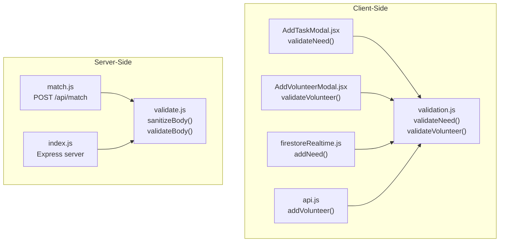
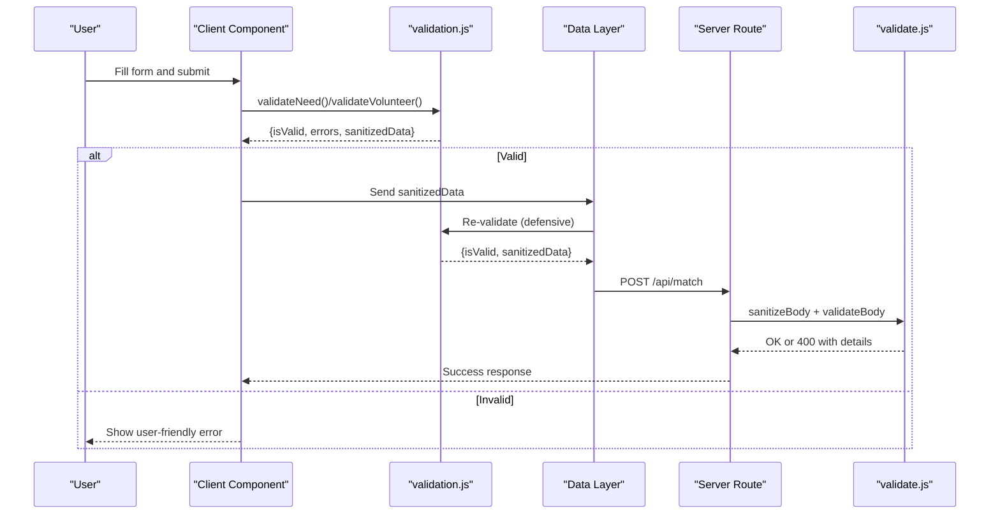
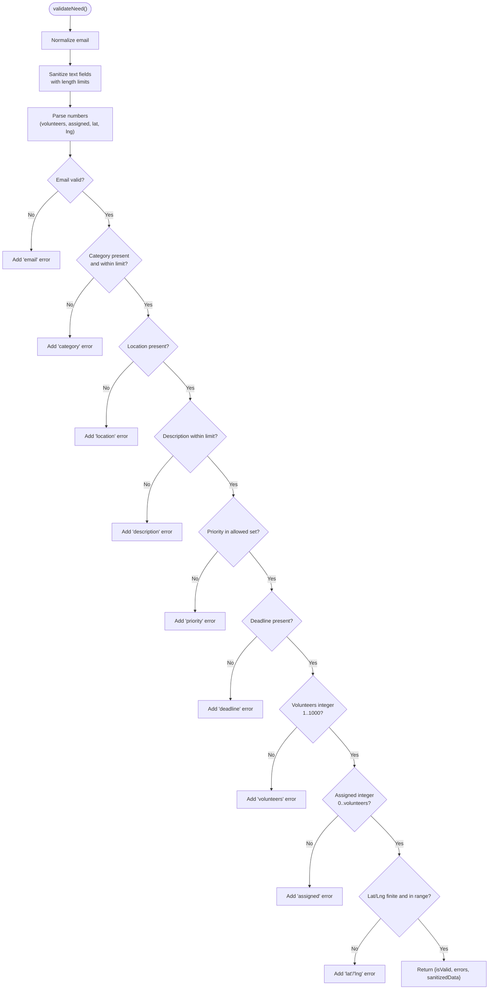
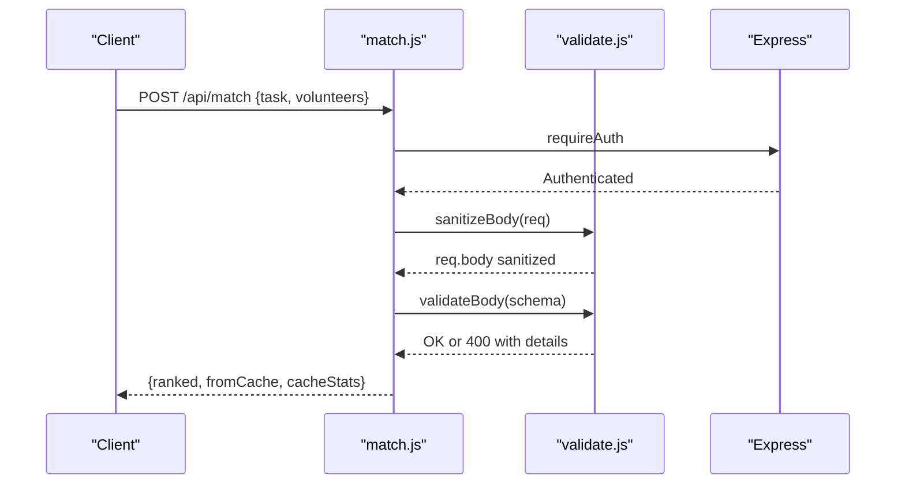
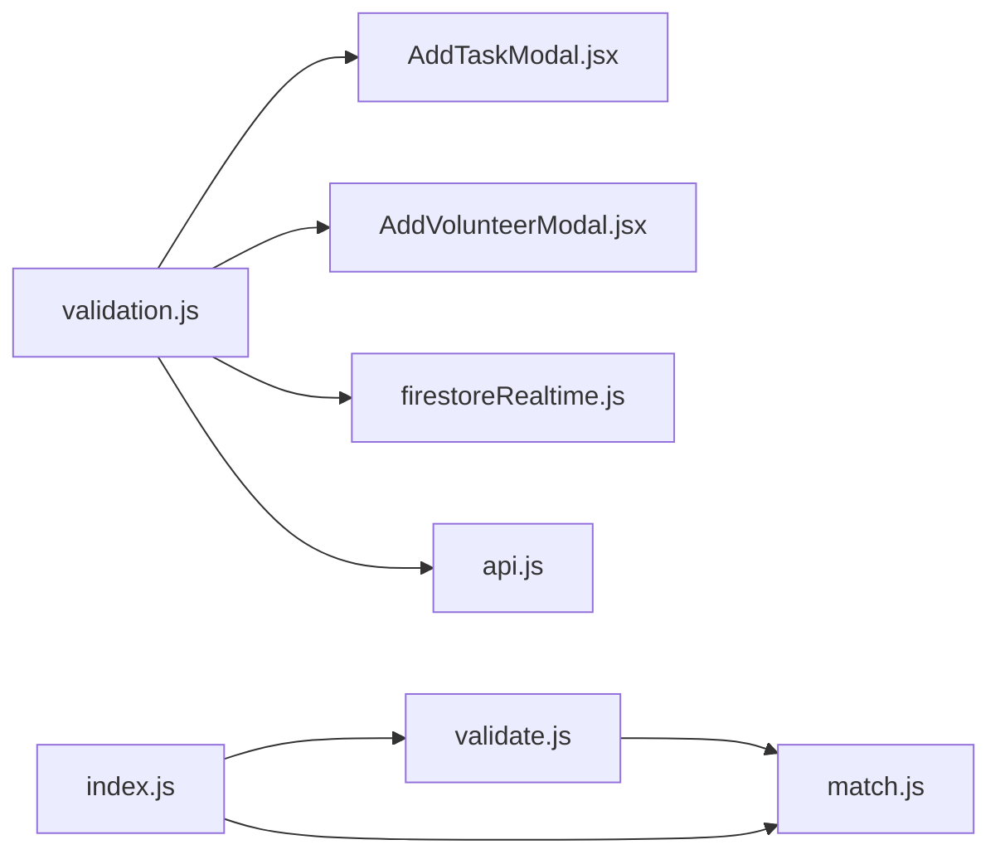

# Data Validation and Sanitization

<cite>
**Referenced Files in This Document**
- [validation.js](file://src/utils/validation.js)
- [validate.js](file://server/middleware/validate.js)
- [AddTaskModal.jsx](file://src/components/AddTaskModal.jsx)
- [AddVolunteerModal.jsx](file://src/components/AddVolunteerModal.jsx)
- [firestoreRealtime.js](file://src/services/firestoreRealtime.js)
- [api.js](file://src/services/api.js)
- [match.js](file://server/routes/match.js)
- [index.js](file://server/index.js)
</cite>

## Table of Contents
1. [Introduction](#introduction)
2. [Project Structure](#project-structure)
3. [Core Components](#core-components)
4. [Architecture Overview](#architecture-overview)
5. [Detailed Component Analysis](#detailed-component-analysis)
6. [Dependency Analysis](#dependency-analysis)
7. [Performance Considerations](#performance-considerations)
8. [Troubleshooting Guide](#troubleshooting-guide)
9. [Conclusion](#conclusion)

## Introduction
This document describes the comprehensive data validation and sanitization framework used throughout the Echo5 platform. It covers client-side validation utilities for form validation, input sanitization, and error handling patterns, as well as server-side validation middleware for request payload validation, parameter sanitization, and security checks against injection attacks. It also documents the integration between frontend and backend validation layers, including error propagation and user feedback mechanisms, and provides examples of validation rules for critical data types such as volunteer profiles, incident reports, and task assignments.

## Project Structure
The validation and sanitization logic is implemented across three layers:
- Client-side utilities: centralized validation functions for forms and data normalization
- Frontend components: form-level validation and user feedback
- Backend middleware and routes: request sanitization and schema validation

**Diagram sources**
- [validation.js:30-122](file://src/utils/validation.js#L30-L122)
- [AddTaskModal.jsx:120-126](file://src/components/AddTaskModal.jsx#L120-L126)
- [AddVolunteerModal.jsx:77-83](file://src/components/AddVolunteerModal.jsx#L77-L83)
- [firestoreRealtime.js:132-156](file://src/services/firestoreRealtime.js#L132-L156)
- [api.js:396-410](file://src/services/api.js#L396-L410)
- [validate.js:36-62](file://server/middleware/validate.js#L36-L62)
- [match.js:33-77](file://server/routes/match.js#L33-L77)
- [index.js:26-101](file://server/index.js#L26-L101)

**Section sources**
- [validation.js:1-122](file://src/utils/validation.js#L1-L122)
- [validate.js:1-80](file://server/middleware/validate.js#L1-L80)
- [AddTaskModal.jsx:1-133](file://src/components/AddTaskModal.jsx#L1-L133)
- [AddVolunteerModal.jsx:1-90](file://src/components/AddVolunteerModal.jsx#L1-L90)
- [firestoreRealtime.js:132-156](file://src/services/firestoreRealtime.js#L132-L156)
- [api.js:396-410](file://src/services/api.js#L396-L410)
- [match.js:28-77](file://server/routes/match.js#L28-L77)
- [index.js:26-101](file://server/index.js#L26-L101)

## Core Components
- Client-side validation utilities:
  - Text sanitization with length limits and XSS-prevention stripping
  - Email normalization and phone number validation via regex
  - Structured validators for needs and volunteers returning validity, errors, and sanitized data
- Frontend form components:
  - Pre-save client-side validation with user-friendly error messages
  - Integration with backend APIs using sanitized payloads
- Server-side validation middleware:
  - Automatic deep sanitization of request bodies
  - Schema-based validation with reusable validators
  - Consistent error responses for invalid payloads

**Section sources**
- [validation.js:8-28](file://src/utils/validation.js#L8-L28)
- [validation.js:30-122](file://src/utils/validation.js#L30-L122)
- [AddTaskModal.jsx:84-133](file://src/components/AddTaskModal.jsx#L84-L133)
- [AddVolunteerModal.jsx:51-90](file://src/components/AddVolunteerModal.jsx#L51-L90)
- [validate.js:11-62](file://server/middleware/validate.js#L11-L62)

## Architecture Overview
The validation pipeline ensures data integrity and security across the platform:
- Client-side: Forms validate and sanitize before submission
- Data layer: Additional validation prevents malformed records
- Server-side: Middleware sanitizes and validates payloads for API endpoints

**Diagram sources**
- [AddTaskModal.jsx:120-126](file://src/components/AddTaskModal.jsx#L120-L126)
- [AddVolunteerModal.jsx:77-83](file://src/components/AddVolunteerModal.jsx#L77-L83)
- [validation.js:30-122](file://src/utils/validation.js#L30-L122)
- [firestoreRealtime.js:132-156](file://src/services/firestoreRealtime.js#L132-L156)
- [api.js:396-410](file://src/services/api.js#L396-L410)
- [match.js:33-77](file://server/routes/match.js#L33-L77)
- [validate.js:36-62](file://server/middleware/validate.js#L36-L62)

## Detailed Component Analysis

### Client-Side Validation Utilities
The client-side validation module provides:
- Sanitization helpers for text, emails, and phone numbers
- Validators for needs and volunteers with strict rules and defaults
- Error aggregation and sanitized data construction

Key behaviors:
- Trims and strips potentially dangerous characters from text inputs
- Normalizes email to lowercase and enforces length limits
- Validates numeric ranges and geographic bounds
- Produces structured results with validity flag, errors map, and sanitized data

**Diagram sources**
- [validation.js:30-80](file://src/utils/validation.js#L30-L80)

**Section sources**
- [validation.js:8-28](file://src/utils/validation.js#L8-L28)
- [validation.js:30-80](file://src/utils/validation.js#L30-L80)
- [validation.js:82-122](file://src/utils/validation.js#L82-L122)

### Form-Level Validation in Components
- AddTaskModal:
  - Performs pre-save validation and user feedback
  - Calls client-side validator before writing to backend
- AddVolunteerModal:
  - Validates required fields and coordinates
  - Uses client-side validator to sanitize and validate before save

Integration points:
- Both components call the client-side validators and handle returned errors
- On success, sanitized data is sent to backend APIs

**Section sources**
- [AddTaskModal.jsx:84-133](file://src/components/AddTaskModal.jsx#L84-L133)
- [AddVolunteerModal.jsx:51-90](file://src/components/AddVolunteerModal.jsx#L51-L90)

### Data Layer Validation (Defensive Re-Validation)
- firestoreRealtime.addNeed:
  - Validates incoming data before writing to Firestore
  - Throws on validation failure with user-friendly messages
- api.addVolunteer:
  - Re-validates at the data layer to prevent bypassing UI checks

This ensures that even if client-side validation is circumvented, the data remains safe and valid.

**Section sources**
- [firestoreRealtime.js:132-156](file://src/services/firestoreRealtime.js#L132-L156)
- [api.js:396-410](file://src/services/api.js#L396-L410)

### Server-Side Validation Middleware
- sanitizeBody:
  - Recursively sanitizes strings, trims whitespace, removes control characters, and strips common XSS delimiters
  - Deep sanitizes nested objects and arrays
- validateBody:
  - Enforces schema-based validation using reusable validators
  - Returns structured 400 responses with error details

Reusable validators:
- required(label)
- isString(label, maxLen)
- isArray(label)
- isObject(label)

**Section sources**
- [validate.js:11-41](file://server/middleware/validate.js#L11-L41)
- [validate.js:48-62](file://server/middleware/validate.js#L48-L62)
- [validate.js:66-79](file://server/middleware/validate.js#L66-L79)

### API Route Integration Example
- POST /api/match:
  - Requires authentication
  - Applies sanitizeBody and validateBody with a schema ensuring task and volunteers presence
  - Returns ranked results or cache hits

**Diagram sources**
- [match.js:33-77](file://server/routes/match.js#L33-L77)
- [validate.js:36-62](file://server/middleware/validate.js#L36-L62)

**Section sources**
- [match.js:28-77](file://server/routes/match.js#L28-L77)
- [validate.js:48-62](file://server/middleware/validate.js#L48-L62)

## Dependency Analysis
The validation framework exhibits layered dependencies:
- Client-side components depend on validation utilities
- Data layer depends on client-side validators for defensive checks
- Server routes depend on middleware for sanitization and schema validation
- Express server applies global security middleware and rate limiting

**Diagram sources**
- [validation.js:30-122](file://src/utils/validation.js#L30-L122)
- [AddTaskModal.jsx:120-126](file://src/components/AddTaskModal.jsx#L120-L126)
- [AddVolunteerModal.jsx:77-83](file://src/components/AddVolunteerModal.jsx#L77-L83)
- [firestoreRealtime.js:132-156](file://src/services/firestoreRealtime.js#L132-L156)
- [api.js:396-410](file://src/services/api.js#L396-L410)
- [validate.js:36-62](file://server/middleware/validate.js#L36-L62)
- [match.js:33-77](file://server/routes/match.js#L33-L77)
- [index.js:26-101](file://server/index.js#L26-L101)

**Section sources**
- [index.js:26-101](file://server/index.js#L26-L101)
- [match.js:28-77](file://server/routes/match.js#L28-L77)
- [validate.js:11-62](file://server/middleware/validate.js#L11-L62)

## Performance Considerations
- Client-side validation reduces unnecessary network requests and improves UX
- Server-side sanitization prevents expensive database writes of malformed data
- Reusable validators minimize duplication and improve maintainability
- Defensive re-validation at the data layer adds safety without significant overhead

## Troubleshooting Guide
Common issues and resolutions:
- Validation fails on save:
  - Check component-level validation messages and correct invalid fields
  - Confirm client-side validator returns isValid: true
- Backend rejects request:
  - Review 400 error details for missing or invalid fields
  - Ensure request body matches expected schema and types
- Sanitized data differs from input:
  - Verify that trimming and character stripping are expected behavior
  - Confirm numeric ranges and geographic bounds meet requirements

**Section sources**
- [AddTaskModal.jsx:120-133](file://src/components/AddTaskModal.jsx#L120-L133)
- [AddVolunteerModal.jsx:77-83](file://src/components/AddVolunteerModal.jsx#L77-L83)
- [validate.js:57-62](file://server/middleware/validate.js#L57-L62)

## Conclusion
The Echo5 platform employs a robust, multi-layered validation and sanitization framework. Client-side validators enforce strong rules for critical data types, while frontend components provide immediate user feedback. The data layer performs defensive re-validation to prevent bypassing UI checks, and server-side middleware ensures secure and consistent request handling. Together, these layers deliver a secure, reliable, and user-friendly experience across the platform.