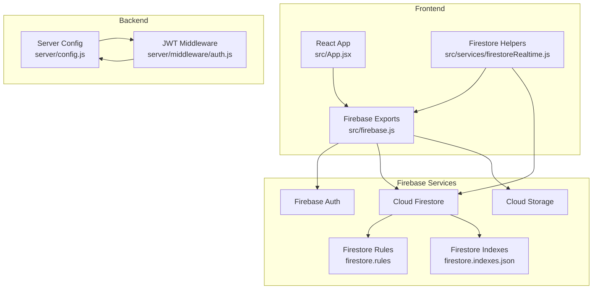
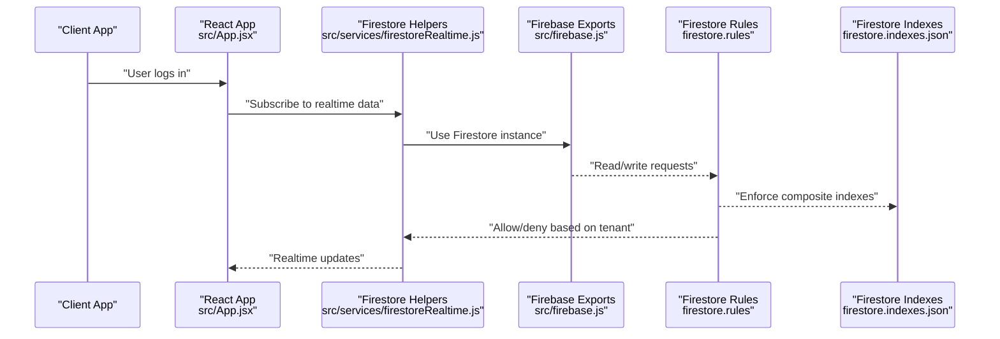
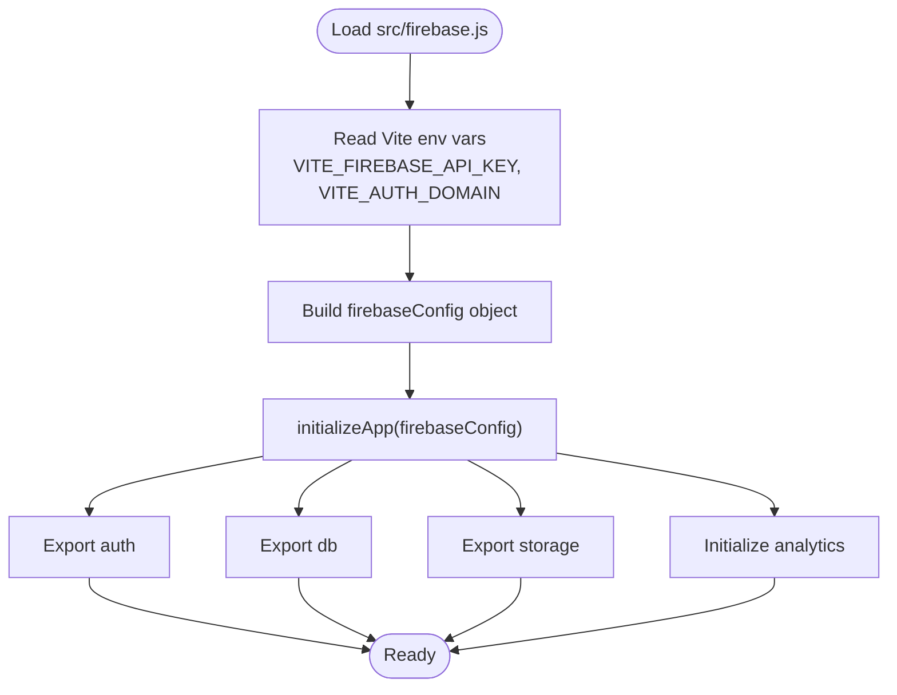
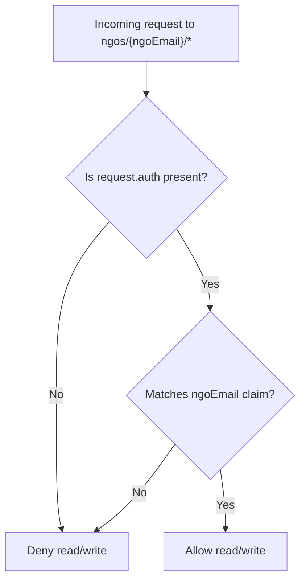
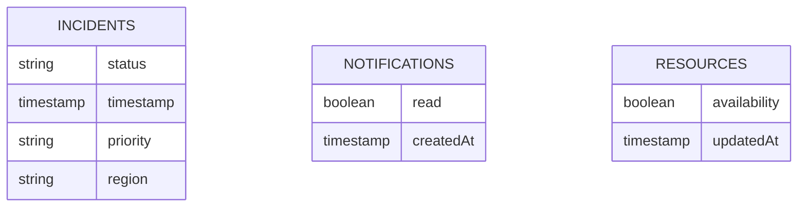
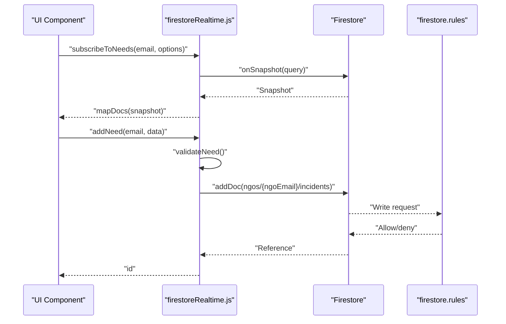
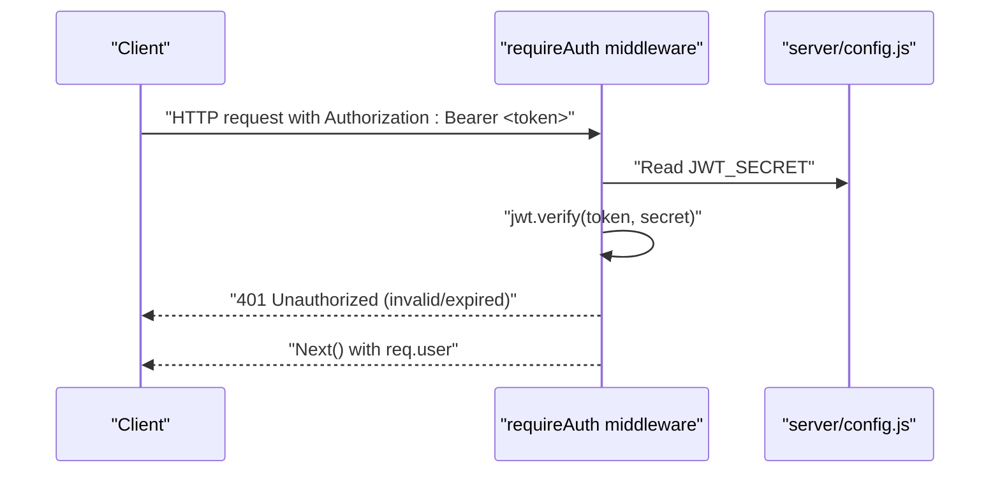
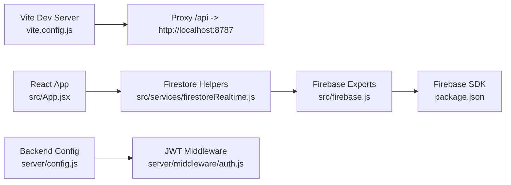

# Firebase Integration

<cite>
**Referenced Files in This Document**
- [src/firebase.js](file://src/firebase.js)
- [firestore.rules](file://firestore.rules)
- [firestore.indexes.json](file://firestore.indexes.json)
- [src/services/firestoreRealtime.js](file://src/services/firestoreRealtime.js)
- [src/services/firestoreSchema.md](file://src/services/firestoreSchema.md)
- [server/middleware/auth.js](file://server/middleware/auth.js)
- [server/config.js](file://server/config.js)
- [vite.config.js](file://vite.config.js)
- [package.json](file://package.json)
- [src/App.jsx](file://src/App.jsx)
- [src/utils/validation.js](file://src/utils/validation.js)
</cite>

## Table of Contents
1. [Introduction](#introduction)
2. [Project Structure](#project-structure)
3. [Core Components](#core-components)
4. [Architecture Overview](#architecture-overview)
5. [Detailed Component Analysis](#detailed-component-analysis)
6. [Dependency Analysis](#dependency-analysis)
7. [Performance Considerations](#performance-considerations)
8. [Troubleshooting Guide](#troubleshooting-guide)
9. [Conclusion](#conclusion)
10. [Appendices](#appendices)

## Introduction
This document explains the Firebase integration in the Echo5 platform. It covers Firebase initialization and configuration via environment variables, service exports for authentication, Firestore, and storage, and the security model enforced by Firestore rules. It also details the Firestore indexing strategy defined in the project’s index configuration and provides guidance for local development, production deployment, and security best practices for managing API keys and credentials.

## Project Structure
The Firebase integration spans the frontend and backend:

- Frontend initialization and exports: Firebase app, auth, Firestore, and storage are initialized and exported from a single module.
- Backend configuration and middleware: Environment-driven configuration and JWT-based authentication middleware.
- Realtime and CRUD operations: Firestore helpers encapsulate tenant-scoped collections and queries.
- Security: Firestore rules enforce strict tenant isolation and user-based access control.
- Indexing: Composite indexes are defined to optimize common queries.

**Diagram sources**
- [src/App.jsx:166-193](file://src/App.jsx#L166-L193)
- [src/services/firestoreRealtime.js:1-212](file://src/services/firestoreRealtime.js#L1-L212)
- [src/firebase.js:1-35](file://src/firebase.js#L1-L35)
- [server/config.js:1-35](file://server/config.js#L1-L35)
- [server/middleware/auth.js:1-49](file://server/middleware/auth.js#L1-L49)
- [firestore.rules:1-19](file://firestore.rules#L1-L19)
- [firestore.indexes.json:1-46](file://firestore.indexes.json#L1-L46)

**Section sources**
- [src/firebase.js:1-35](file://src/firebase.js#L1-L35)
- [server/config.js:1-35](file://server/config.js#L1-L35)
- [server/middleware/auth.js:1-49](file://server/middleware/auth.js#L1-L49)
- [firestore.rules:1-19](file://firestore.rules#L1-L19)
- [firestore.indexes.json:1-46](file://firestore.indexes.json#L1-L46)
- [src/services/firestoreRealtime.js:1-212](file://src/services/firestoreRealtime.js#L1-L212)
- [src/services/firestoreSchema.md:1-28](file://src/services/firestoreSchema.md#L1-L28)
- [vite.config.js:1-19](file://vite.config.js#L1-L19)
- [package.json:1-43](file://package.json#L1-L43)

## Core Components
- Firebase initialization and exports:
  - Initializes Firebase app with environment-driven configuration.
  - Exports auth, Firestore, and storage instances for use across the frontend.
  - Analytics is initialized alongside the app.
- Backend configuration and middleware:
  - Centralized server configuration reads from process.env.
  - JWT middleware validates Authorization headers and decodes tokens.
- Firestore helpers:
  - Tenant-scoped collections under ngos/{ngoEmail}.
  - Realtime listeners and CRUD operations for incidents, resources, and notifications.
  - Validation and sanitization before writes to prevent malformed data and XSS.
- Security rules:
  - Default-deny policy with explicit allow rules.
  - Tenant isolation using request.auth.token.email matching the document path.
- Indexing strategy:
  - Composite indexes for common query patterns on incidents, notifications, and resources.

**Section sources**
- [src/firebase.js:1-35](file://src/firebase.js#L1-L35)
- [server/config.js:1-35](file://server/config.js#L1-L35)
- [server/middleware/auth.js:1-49](file://server/middleware/auth.js#L1-L49)
- [src/services/firestoreRealtime.js:1-212](file://src/services/firestoreRealtime.js#L1-L212)
- [firestore.rules:1-19](file://firestore.rules#L1-L19)
- [firestore.indexes.json:1-46](file://firestore.indexes.json#L1-L46)
- [src/utils/validation.js:1-123](file://src/utils/validation.js#L1-L123)

## Architecture Overview
The platform uses Firebase for client-side authentication, Firestore for real-time data, and storage for media. The backend enforces authentication via JWT middleware and forwards requests to the frontend. Firestore rules ensure tenant isolation, and indexes optimize query performance.

**Diagram sources**
- [src/App.jsx:166-193](file://src/App.jsx#L166-L193)
- [src/services/firestoreRealtime.js:1-212](file://src/services/firestoreRealtime.js#L1-L212)
- [src/firebase.js:1-35](file://src/firebase.js#L1-L35)
- [firestore.rules:1-19](file://firestore.rules#L1-L19)
- [firestore.indexes.json:1-46](file://firestore.indexes.json#L1-L46)

## Detailed Component Analysis

### Firebase Initialization and Configuration
- Initialization:
  - Firebase app is initialized with a configuration object built from Vite environment variables.
  - Exports auth, Firestore, and storage instances for global use.
  - Analytics is initialized alongside the app.
- Environment variables:
  - Frontend reads VITE_FIREBASE_API_KEY and VITE_AUTH_DOMAIN from the build-time environment.
  - Backend reads secrets from process.env (e.g., JWT secret and AI provider keys).

**Diagram sources**
- [src/firebase.js:1-35](file://src/firebase.js#L1-L35)

**Section sources**
- [src/firebase.js:1-35](file://src/firebase.js#L1-L35)
- [vite.config.js:1-19](file://vite.config.js#L1-L19)
- [server/config.js:1-35](file://server/config.js#L1-L35)

### Security Rules Implementation
- Default-deny policy:
  - All paths are denied by default to prevent accidental exposure.
- Tenant isolation:
  - Access to ngos/{ngoEmail} is restricted to authenticated users whose email matches the document path.
- User-based access control:
  - Requests must include a valid Firebase auth token with an email claim equal to the NGO email in the path.

**Diagram sources**
- [firestore.rules:1-19](file://firestore.rules#L1-L19)

**Section sources**
- [firestore.rules:1-19](file://firestore.rules#L1-L19)

### Firestore Indexing Strategy
- Composite indexes defined for:
  - Incidents: status + timestamp (descending), priority + timestamp (descending), region + timestamp (descending).
  - Notifications: read + createdAt (descending).
  - Resources: availability + updatedAt (descending).
- Purpose:
  - Enable efficient queries on frequently accessed fields and improve read performance.

**Diagram sources**
- [firestore.indexes.json:1-46](file://firestore.indexes.json#L1-L46)

**Section sources**
- [firestore.indexes.json:1-46](file://firestore.indexes.json#L1-L46)

### Realtime and CRUD Operations
- Tenant scoping:
  - All collections are under ngos/{ngoEmail}, ensuring data isolation.
- Realtime subscriptions:
  - Subscribe to incidents, resources, and notifications with onSnapshot.
  - Support pagination and filtering (e.g., unread notifications).
- Write operations:
  - Validation and sanitization before writes to prevent XSS and malformed data.
  - Timestamps are set server-side for consistency.

**Diagram sources**
- [src/services/firestoreRealtime.js:1-212](file://src/services/firestoreRealtime.js#L1-L212)
- [firestore.rules:1-19](file://firestore.rules#L1-L19)
- [src/utils/validation.js:1-123](file://src/utils/validation.js#L1-L123)

**Section sources**
- [src/services/firestoreRealtime.js:1-212](file://src/services/firestoreRealtime.js#L1-L212)
- [src/services/firestoreSchema.md:1-28](file://src/services/firestoreSchema.md#L1-L28)
- [src/utils/validation.js:1-123](file://src/utils/validation.js#L1-L123)

### Authentication Middleware and Token Management
- JWT middleware:
  - Validates Authorization: Bearer <token>.
  - Decodes token using server-side secret and attaches user info to req.user.
- Token generation:
  - Utility to sign tokens with configurable expiry.
- Migration note:
  - The code comments indicate that in production, swapping to Firebase Admin verifyIdToken is recommended if migrating to Firebase Authentication.

**Diagram sources**
- [server/middleware/auth.js:1-49](file://server/middleware/auth.js#L1-L49)
- [server/config.js:1-35](file://server/config.js#L1-L35)

**Section sources**
- [server/middleware/auth.js:1-49](file://server/middleware/auth.js#L1-L49)
- [server/config.js:1-35](file://server/config.js#L1-L35)

## Dependency Analysis
- Frontend dependencies:
  - React app consumes Firestore helpers and Firebase exports.
  - Vite dev server proxies API calls to the backend during development.
- Backend dependencies:
  - Express-like server uses JWT middleware and reads configuration from environment variables.
- Firebase dependencies:
  - Frontend depends on Firebase SDK packages declared in package.json.

**Diagram sources**
- [vite.config.js:1-19](file://vite.config.js#L1-L19)
- [src/App.jsx:1-285](file://src/App.jsx#L1-L285)
- [src/services/firestoreRealtime.js:1-212](file://src/services/firestoreRealtime.js#L1-L212)
- [src/firebase.js:1-35](file://src/firebase.js#L1-L35)
- [package.json:1-43](file://package.json#L1-L43)
- [server/config.js:1-35](file://server/config.js#L1-L35)
- [server/middleware/auth.js:1-49](file://server/middleware/auth.js#L1-L49)

**Section sources**
- [vite.config.js:1-19](file://vite.config.js#L1-L19)
- [package.json:1-43](file://package.json#L1-L43)
- [server/config.js:1-35](file://server/config.js#L1-L35)
- [server/middleware/auth.js:1-49](file://server/middleware/auth.js#L1-L49)
- [src/services/firestoreRealtime.js:1-212](file://src/services/firestoreRealtime.js#L1-L212)
- [src/firebase.js:1-35](file://src/firebase.js#L1-L35)

## Performance Considerations
- Use composite indexes:
  - The project defines composite indexes for common query patterns on incidents, notifications, and resources to avoid expensive on-the-fly index creation.
- Pagination and limits:
  - Firestore helpers apply orderBy and limit to constrain query results and reduce load.
- Realtime listeners:
  - Prefer onSnapshot for incremental updates to minimize polling overhead.
- Validation and sanitization:
  - Pre-validate and sanitize data before writes to reduce storage and query costs.

[No sources needed since this section provides general guidance]

## Troubleshooting Guide
- Authentication failures:
  - Ensure Authorization header includes a valid Bearer token and that the JWT_SECRET matches the server configuration.
- Firestore permission errors:
  - Verify that the authenticated user’s email matches the NGO email in the document path; otherwise, requests will be denied by the rules.
- Index errors:
  - If queries fail due to missing indexes, review the composite index definitions and confirm they match the query fields and orders.
- Environment variables:
  - Confirm VITE_FIREBASE_API_KEY and VITE_AUTH_DOMAIN are set in the frontend build environment and process.env values are configured on the backend.

**Section sources**
- [server/middleware/auth.js:1-49](file://server/middleware/auth.js#L1-L49)
- [server/config.js:1-35](file://server/config.js#L1-L35)
- [firestore.rules:1-19](file://firestore.rules#L1-L19)
- [firestore.indexes.json:1-46](file://firestore.indexes.json#L1-L46)
- [src/firebase.js:1-35](file://src/firebase.js#L1-L35)

## Conclusion
The Echo5 platform integrates Firebase to provide secure, tenant-scoped data management with strong access controls and optimized query performance. The frontend initializes Firebase and exposes services for auth, Firestore, and storage, while the backend enforces authentication via JWT middleware. Firestore rules and composite indexes further strengthen security and performance. Following the setup and best practices outlined here will help maintain a robust and scalable Firebase integration.

[No sources needed since this section summarizes without analyzing specific files]

## Appendices

### Setup Instructions

- Local development
  - Set Vite environment variables for Firebase in the frontend build environment.
  - Start the frontend dev server; Vite proxies API calls to the backend server.
  - Ensure the backend server is running on the configured port and that JWT_SECRET is set.

- Production deployment
  - Configure environment variables for Firebase and backend secrets on the production host.
  - Deploy the frontend build artifacts and configure a reverse proxy if needed.
  - Apply Firestore indexes using the project’s index configuration.

- Security best practices
  - Store API keys and secrets in environment variables; never commit them to version control.
  - Rotate JWT_SECRET regularly and restrict CORS origins.
  - Enforce HTTPS and secure cookies in production environments.
  - Monitor and audit access logs for Firestore and authentication events.

**Section sources**
- [vite.config.js:1-19](file://vite.config.js#L1-L19)
- [server/config.js:1-35](file://server/config.js#L1-L35)
- [src/firebase.js:1-35](file://src/firebase.js#L1-L35)
- [firestore.indexes.json:1-46](file://firestore.indexes.json#L1-L46)