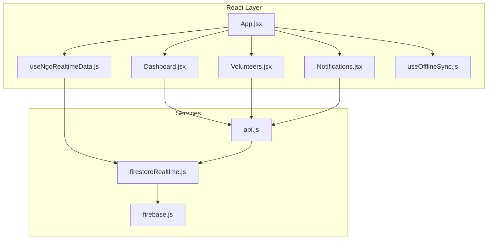
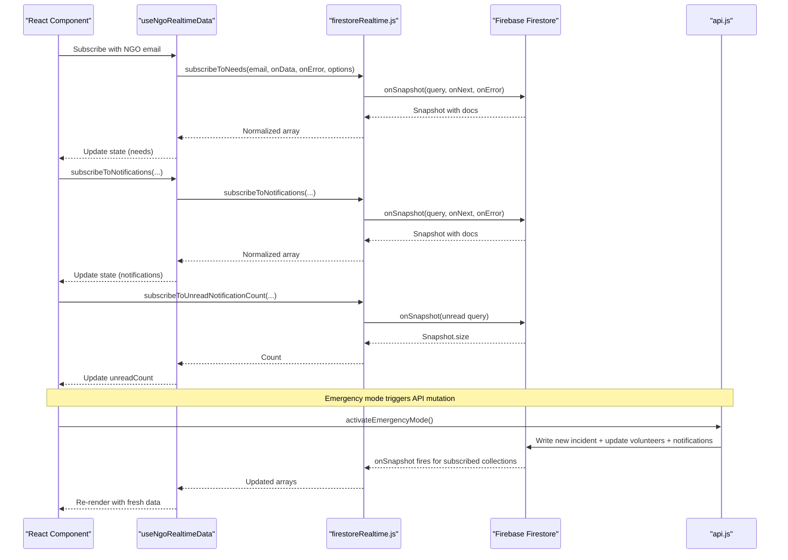
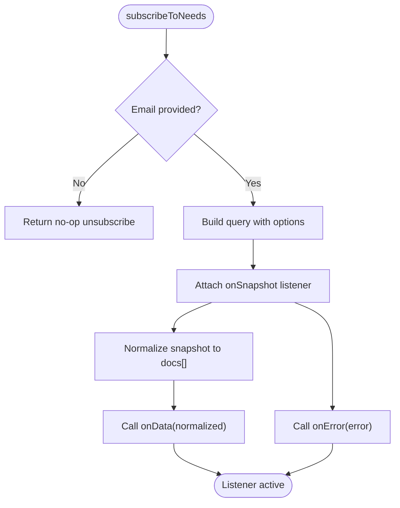
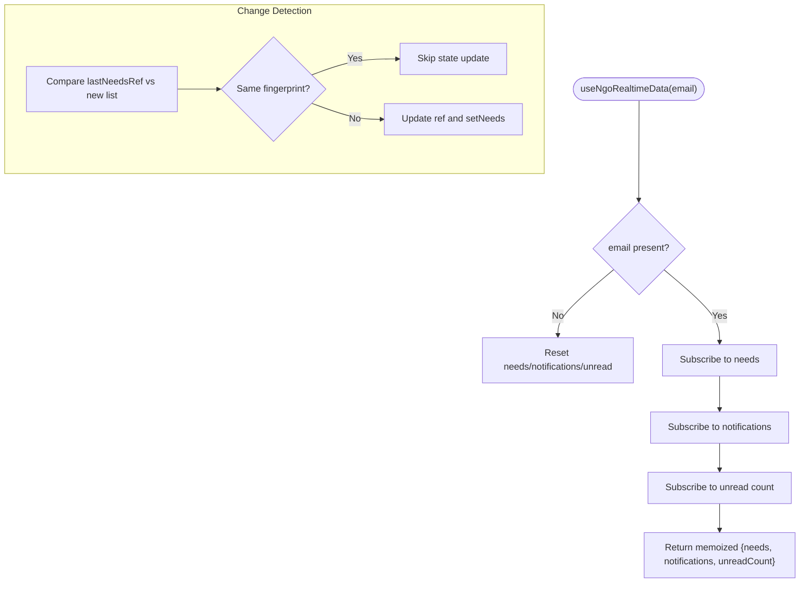
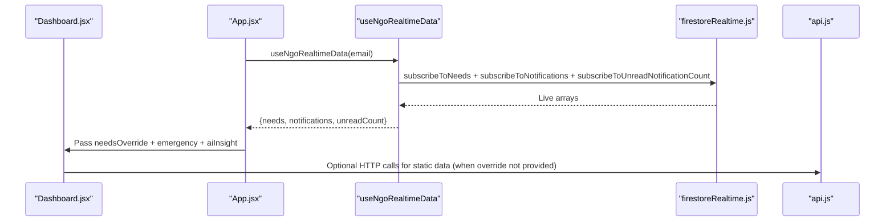
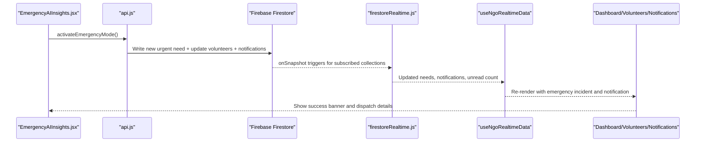
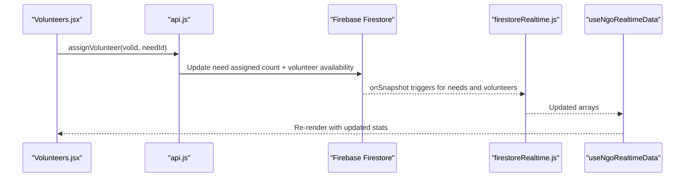
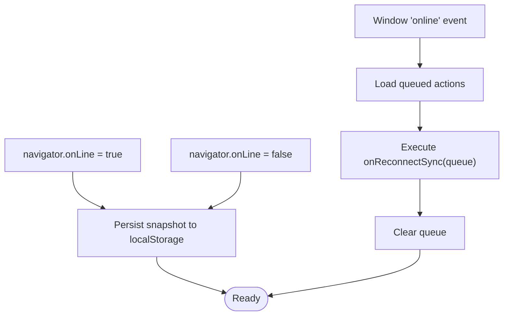
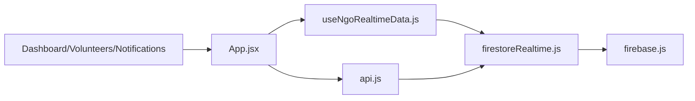

# Real-Time Synchronization

<cite>
**Referenced Files in This Document**
- [firestoreRealtime.js](file://src/services/firestoreRealtime.js)
- [useNgoRealtimeData.js](file://src/hooks/useNgoRealtimeData.js)
- [firebase.js](file://src/firebase.js)
- [api.js](file://src/services/api.js)
- [App.jsx](file://src/App.jsx)
- [Dashboard.jsx](file://src/pages/Dashboard.jsx)
- [Volunteers.jsx](file://src/pages/Volunteers.jsx)
- [Notifications.jsx](file://src/pages/Notifications.jsx)
- [EmergencyAIInsights.jsx](file://src/components/EmergencyAIInsights.jsx)
- [useOfflineSync.js](file://src/hooks/useOfflineSync.js)
</cite>

## Table of Contents
1. [Introduction](#introduction)
2. [Project Structure](#project-structure)
3. [Core Components](#core-components)
4. [Architecture Overview](#architecture-overview)
5. [Detailed Component Analysis](#detailed-component-analysis)
6. [Dependency Analysis](#dependency-analysis)
7. [Performance Considerations](#performance-considerations)
8. [Troubleshooting Guide](#troubleshooting-guide)
9. [Conclusion](#conclusion)

## Introduction
This document explains the real-time data synchronization mechanisms powering the Echo5 platform. It covers Firestore real-time listeners, subscription lifecycle management, automatic data updates, connection handling, and integration with React components through custom hooks. It also documents emergency mode real-time updates, volunteer assignment notifications, and collaborative coordination features, along with troubleshooting guidance for connection issues, data staleness, and performance optimization for large datasets.

## Project Structure
The real-time synchronization spans three primary areas:
- Firestore service layer: query builders, onSnapshot subscriptions, and CRUD helpers
- React hooks: subscription orchestration and state normalization
- Application integration: page components, emergency mode, and offline sync

**Diagram sources**
- [App.jsx:62](file://src/App.jsx#L62)
- [useNgoRealtimeData.js:26](file://src/hooks/useNgoRealtimeData.js#L26)
- [firestoreRealtime.js:61](file://src/services/firestoreRealtime.js#L61)
- [firebase.js:27](file://src/firebase.js#L27)
- [api.js:300](file://src/services/api.js#L300)

**Section sources**
- [firestoreRealtime.js:1-212](file://src/services/firestoreRealtime.js#L1-L212)
- [useNgoRealtimeData.js:1-83](file://src/hooks/useNgoRealtimeData.js#L1-L83)
- [firebase.js:1-35](file://src/firebase.js#L1-L35)
- [api.js:295-562](file://src/services/api.js#L295-L562)
- [App.jsx:29-285](file://src/App.jsx#L29-L285)

## Core Components
- Firestore real-time service: Provides typed subscription functions for needs/incidents, resources, and notifications, plus pagination and mutation helpers.
- React hook: Orchestrates subscriptions, normalizes lists, and prevents unnecessary re-renders.
- Application integration: Uses the hook to power dashboards, volunteer matching, and notifications; integrates offline caching and emergency mode triggers.

Key responsibilities:
- Subscription management: start/stop listeners, handle errors, and maintain stable references.
- Automatic updates: onSnapshot handlers push normalized arrays to React state.
- Connection handling: offline detection, local caching, and re-sync on reconnect.
- Emergency mode: creates urgent incidents, assigns nearest volunteers, and notifies stakeholders.

**Section sources**
- [firestoreRealtime.js:61-130](file://src/services/firestoreRealtime.js#L61-L130)
- [useNgoRealtimeData.js:26-82](file://src/hooks/useNgoRealtimeData.js#L26-L82)
- [useOfflineSync.js:13-71](file://src/hooks/useOfflineSync.js#L13-L71)
- [api.js:428-517](file://src/services/api.js#L428-L517)

## Architecture Overview
The real-time pipeline connects Firestore to React components via a clean service layer and a custom hook. Emergency mode and offline sync are layered on top for robustness and responsiveness.

**Diagram sources**
- [useNgoRealtimeData.js:41-71](file://src/hooks/useNgoRealtimeData.js#L41-L71)
- [firestoreRealtime.js:61-116](file://src/services/firestoreRealtime.js#L61-L116)
- [api.js:428-517](file://src/services/api.js#L428-L517)

## Detailed Component Analysis

### Firestore Real-Time Service
Responsibilities:
- Build typed queries for needs, resources, and notifications with optional filters and limits.
- Register onSnapshot listeners and normalize snapshots to arrays of documents.
- Expose pagination helpers and mutation operations for needs and resources.

Implementation highlights:
- Query builders compose where/orderBy/limit/startAfter clauses.
- onSnapshot callbacks map snapshots to normalized arrays and propagate errors.
- Unread notification count uses a size-based listener.

**Diagram sources**
- [firestoreRealtime.js:29-73](file://src/services/firestoreRealtime.js#L29-L73)

**Section sources**
- [firestoreRealtime.js:29-130](file://src/services/firestoreRealtime.js#L29-L130)

### React Hook: useNgoRealtimeData
Responsibilities:
- Manage subscriptions for needs, notifications, and unread counts.
- Prevent redundant renders by fingerprinting previous arrays.
- Clean up subscriptions on unmount or email change.

Implementation highlights:
- Fingerprint comparison compares id/status/read/updatedAt to detect meaningful changes.
- Subscriptions are started inside a useEffect keyed by email.
- Unsubscribes are returned in the effect cleanup.

**Diagram sources**
- [useNgoRealtimeData.js:8-24](file://src/hooks/useNgoRealtimeData.js#L8-L24)
- [useNgoRealtimeData.js:33-72](file://src/hooks/useNgoRealtimeData.js#L33-L72)

**Section sources**
- [useNgoRealtimeData.js:1-83](file://src/hooks/useNgoRealtimeData.js#L1-L83)

### Application Integration: Dashboard, Volunteers, Notifications
- Dashboard consumes live needs and builds derived stats and charts. It also displays emergency mode banner and AI insights.
- Volunteers page ranks and matches volunteers to selected tasks, with travel-time precomputation and smart assignment.
- Notifications page supports pagination and marking read via Firestore-backed API.

**Diagram sources**
- [App.jsx:62](file://src/App.jsx#L62)
- [Dashboard.jsx:58-83](file://src/pages/Dashboard.jsx#L58-L83)
- [useNgoRealtimeData.js:26-82](file://src/hooks/useNgoRealtimeData.js#L26-L82)
- [firestoreRealtime.js:61-116](file://src/services/firestoreRealtime.js#L61-L116)

**Section sources**
- [Dashboard.jsx:58-121](file://src/pages/Dashboard.jsx#L58-L121)
- [Volunteers.jsx:24-95](file://src/pages/Volunteers.jsx#L24-L95)
- [Notifications.jsx:18-84](file://src/pages/Notifications.jsx#L18-L84)

### Emergency Mode Real-Time Updates
Emergency mode creates an urgent incident, assigns the nearest available volunteer, and prepends a notification. The real-time listeners immediately reflect these changes across the UI.

**Diagram sources**
- [EmergencyAIInsights.jsx:67-87](file://src/components/EmergencyAIInsights.jsx#L67-L87)
- [api.js:428-517](file://src/services/api.js#L428-L517)
- [firestoreRealtime.js:61-116](file://src/services/firestoreRealtime.js#L61-L116)
- [useNgoRealtimeData.js:41-71](file://src/hooks/useNgoRealtimeData.js#L41-L71)

**Section sources**
- [EmergencyAIInsights.jsx:49-106](file://src/components/EmergencyAIInsights.jsx#L49-L106)
- [api.js:428-517](file://src/services/api.js#L428-L517)

### Volunteer Assignment Notifications and Collaborative Coordination
- Volunteer matching page computes travel times and ranks candidates; assignments update both needs and volunteers.
- Real-time listeners propagate these updates instantly to the dashboard and notifications.

**Diagram sources**
- [Volunteers.jsx:159-176](file://src/pages/Volunteers.jsx#L159-L176)
- [api.js:316-324](file://src/services/api.js#L316-L324)
- [firestoreRealtime.js:61-89](file://src/services/firestoreRealtime.js#L61-L89)
- [useNgoRealtimeData.js:41-71](file://src/hooks/useNgoRealtimeData.js#L41-L71)

**Section sources**
- [Volunteers.jsx:97-206](file://src/pages/Volunteers.jsx#L97-L206)
- [api.js:316-324](file://src/services/api.js#L316-L324)

### Offline Sync and Connection Handling
- Detects online/offline state and caches recent needs snapshot.
- Queues offline actions and replays them upon reconnect.

**Diagram sources**
- [useOfflineSync.js:16-50](file://src/hooks/useOfflineSync.js#L16-L50)

**Section sources**
- [useOfflineSync.js:1-72](file://src/hooks/useOfflineSync.js#L1-L72)
- [App.jsx:127-133](file://src/App.jsx#L127-L133)

## Dependency Analysis
- App.jsx orchestrates real-time data and emergency evaluation, passing live data to pages.
- useNgoRealtimeData depends on firestoreRealtime.js for subscriptions.
- api.js bridges Firestore mutations and HTTP APIs, integrating with real-time updates.
- firebase.js initializes Firestore used by all services.

**Diagram sources**
- [App.jsx:62](file://src/App.jsx#L62)
- [useNgoRealtimeData.js:26](file://src/hooks/useNgoRealtimeData.js#L26)
- [firestoreRealtime.js:61](file://src/services/firestoreRealtime.js#L61)
- [firebase.js:27](file://src/firebase.js#L27)
- [api.js:300](file://src/services/api.js#L300)

**Section sources**
- [App.jsx:29-285](file://src/App.jsx#L29-L285)
- [useNgoRealtimeData.js:1-83](file://src/hooks/useNgoRealtimeData.js#L1-L83)
- [firestoreRealtime.js:1-212](file://src/services/firestoreRealtime.js#L1-L212)
- [api.js:295-562](file://src/services/api.js#L295-L562)

## Performance Considerations
- Pagination and limits: Queries use limit and cursor-based pagination to cap document loads.
- Change detection: Fingerprint comparison avoids re-renders when only order or timestamps change.
- Offline caching: Local snapshot reduces latency and improves resilience.
- Memoization: Returned object from the hook prevents unnecessary prop updates.
- Large datasets: Prefer filtering by status/priority and paginate notifications.

[No sources needed since this section provides general guidance]

## Troubleshooting Guide
Common issues and resolutions:
- Connection failures
  - Symptoms: onSnapshot errors, missing updates.
  - Actions: Inspect error callbacks in subscriptions; verify Firebase initialization and network connectivity.
  - References: [firestoreRealtime.js:68-101](file://src/services/firestoreRealtime.js#L68-L101), [firebase.js:10-19](file://src/firebase.js#L10-L19)

- Data staleness
  - Symptoms: Out-of-date needs or notifications.
  - Actions: Confirm email is set and useEffect runs; check fingerprint logic to ensure legitimate changes trigger updates.
  - References: [useNgoRealtimeData.js:33-72](file://src/hooks/useNgoRealtimeData.js#L33-L72), [useNgoRealtimeData.js:8-24](file://src/hooks/useNgoRealtimeData.js#L8-L24)

- Memory leaks
  - Symptoms: Multiple overlapping listeners after navigation.
  - Actions: Ensure cleanup functions are returned and used; verify email-dependent subscriptions are torn down.
  - References: [useNgoRealtimeData.js:67-72](file://src/hooks/useNgoRealtimeData.js#L67-L72)

- Emergency mode not triggering notifications
  - Symptoms: No urgent notification after activation.
  - Actions: Verify Firestore writes succeeded and onSnapshot listeners are attached; confirm unread count subscription is active.
  - References: [api.js:428-517](file://src/services/api.js#L428-L517), [firestoreRealtime.js:105-116](file://src/services/firestoreRealtime.js#L105-L116)

- Offline sync not replaying actions
  - Symptoms: Actions not applied after reconnect.
  - Actions: Check queue persistence and onReconnectSync invocation; confirm online event handlers are attached.
  - References: [useOfflineSync.js:26-50](file://src/hooks/useOfflineSync.js#L26-L50), [useOfflineSync.js:52-58](file://src/hooks/useOfflineSync.js#L52-L58)

**Section sources**
- [firestoreRealtime.js:68-116](file://src/services/firestoreRealtime.js#L68-L116)
- [useNgoRealtimeData.js:33-72](file://src/hooks/useNgoRealtimeData.js#L33-L72)
- [api.js:428-517](file://src/services/api.js#L428-L517)
- [useOfflineSync.js:26-58](file://src/hooks/useOfflineSync.js#L26-L58)

## Conclusion
Echo5’s real-time synchronization combines Firestore onSnapshot listeners with a React-friendly hook to deliver responsive, accurate data across the platform. Emergency mode and offline sync further enhance reliability and operability. By leveraging pagination, change detection, and robust cleanup, the system remains performant and resilient under real-world conditions.