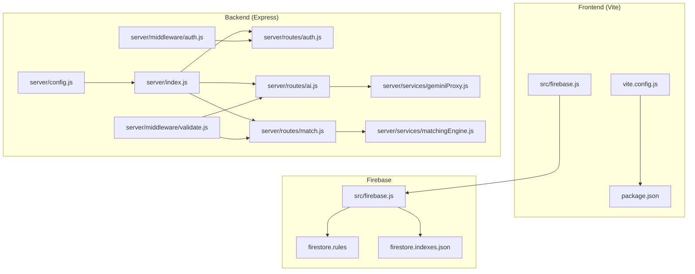
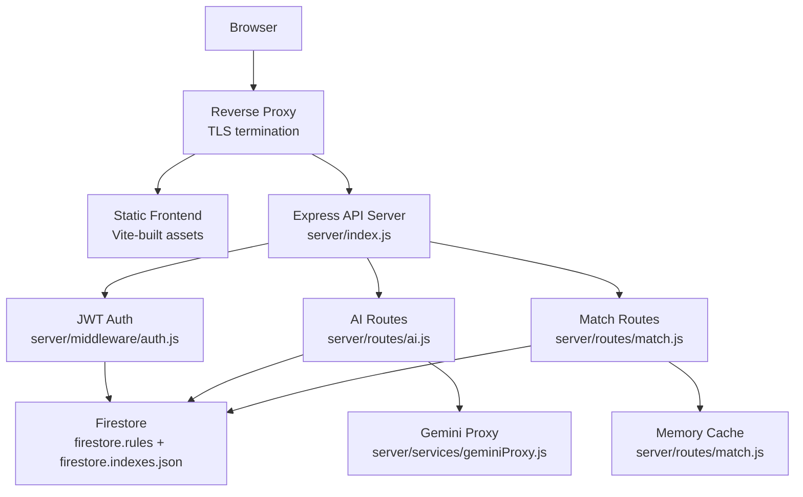
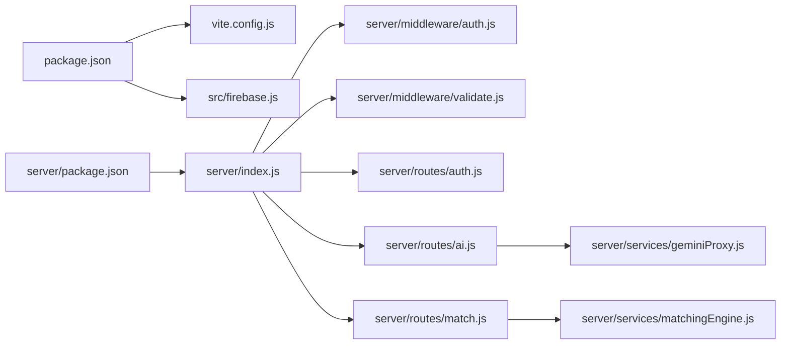

# Deployment Guide

<cite>
**Referenced Files in This Document**
- [package.json](file://package.json)
- [vite.config.js](file://vite.config.js)
- [README.md](file://README.md)
- [server/package.json](file://server/package.json)
- [server/index.js](file://server/index.js)
- [server/config.js](file://server/config.js)
- [server/middleware/auth.js](file://server/middleware/auth.js)
- [server/middleware/validate.js](file://server/middleware/validate.js)
- [server/routes/auth.js](file://server/routes/auth.js)
- [server/routes/ai.js](file://server/routes/ai.js)
- [server/routes/match.js](file://server/routes/match.js)
- [server/services/geminiProxy.js](file://server/services/geminiProxy.js)
- [server/services/matchingEngine.js](file://server/services/matchingEngine.js)
- [src/firebase.js](file://src/firebase.js)
- [firestore.rules](file://firestore.rules)
- [firestore.indexes.json](file://firestore.indexes.json)
</cite>

## Table of Contents
1. [Introduction](#introduction)
2. [Project Structure](#project-structure)
3. [Core Components](#core-components)
4. [Architecture Overview](#architecture-overview)
5. [Detailed Component Analysis](#detailed-component-analysis)
6. [Dependency Analysis](#dependency-analysis)
7. [Performance Considerations](#performance-considerations)
8. [Troubleshooting Guide](#troubleshooting-guide)
9. [Conclusion](#conclusion)
10. [Appendices](#appendices)

## Introduction
This guide provides a comprehensive deployment and DevOps procedure for the Echo5 platform. It covers frontend build configuration with Vite, environment variable management, asset optimization for production, server configuration, database migration and indexing, Firebase security rules and indexes, CI/CD automation, monitoring and alerting, scaling and load balancing, disaster recovery, and troubleshooting.

## Project Structure
Echo5 consists of:
- Frontend built with Vite and React, with environment variables injected at build time for Firebase configuration.
- Backend API server written in Express.js with middleware for security, rate limiting, and routing.
- Firebase integration for authentication, Firestore, and storage.
- Firestore security rules and composite indexes for efficient queries.

**Diagram sources**
- [vite.config.js:1-19](file://vite.config.js#L1-L19)
- [package.json:1-43](file://package.json#L1-L43)
- [src/firebase.js:1-35](file://src/firebase.js#L1-L35)
- [server/index.js:1-118](file://server/index.js#L1-L118)
- [server/config.js:1-35](file://server/config.js#L1-L35)
- [server/middleware/auth.js:1-49](file://server/middleware/auth.js#L1-L49)
- [server/middleware/validate.js:1-80](file://server/middleware/validate.js#L1-L80)
- [server/routes/auth.js:1-83](file://server/routes/auth.js#L1-L83)
- [server/routes/ai.js:1-348](file://server/routes/ai.js#L1-L348)
- [server/routes/match.js:1-120](file://server/routes/match.js#L1-L120)
- [server/services/geminiProxy.js:1-104](file://server/services/geminiProxy.js#L1-L104)
- [server/services/matchingEngine.js:1-212](file://server/services/matchingEngine.js#L1-L212)
- [firestore.rules:1-19](file://firestore.rules#L1-L19)
- [firestore.indexes.json:1-46](file://firestore.indexes.json#L1-L46)

**Section sources**
- [README.md:1-17](file://README.md#L1-L17)
- [package.json:1-43](file://package.json#L1-L43)
- [vite.config.js:1-19](file://vite.config.js#L1-L19)
- [src/firebase.js:1-35](file://src/firebase.js#L1-L35)
- [server/package.json:1-18](file://server/package.json#L1-L18)
- [server/index.js:1-118](file://server/index.js#L1-L118)

## Core Components
- Build and asset pipeline: Vite builds the React app with React plugin and TailwindCSS integration. Environment variables prefixed with VITE_ are injected at build time.
- Server runtime: Express server with Helmet for secure headers, Morgan for request logging, CORS with configurable origin, rate limits, JWT authentication, and modular routes.
- AI and matching services: Gemini proxy for document parsing and chat; matching engine for volunteer-task ranking with caching.
- Firebase integration: Client-side initialization with environment variables; Firestore security rules and composite indexes.

**Section sources**
- [package.json:6-11](file://package.json#L6-L11)
- [vite.config.js:1-19](file://vite.config.js#L1-L19)
- [server/index.js:16-101](file://server/index.js#L16-L101)
- [server/config.js:8-32](file://server/config.js#L8-L32)
- [server/middleware/auth.js:14-48](file://server/middleware/auth.js#L14-L48)
- [server/routes/ai.js:21-178](file://server/routes/ai.js#L21-L178)
- [server/routes/match.js:23-77](file://server/routes/match.js#L23-L77)
- [src/firebase.js:10-21](file://src/firebase.js#L10-L21)

## Architecture Overview
Production-grade deployment requires:
- Reverse proxy (nginx, Cloudflare, or platform gateway) to terminate TLS and forward /api to the Express server.
- Separate frontend hosting (static assets) and backend API server.
- Environment-specific configuration via process.env for server and VITE_* for client.
- Firebase project with deployed security rules and indexes.

**Diagram sources**
- [server/index.js:16-101](file://server/index.js#L16-L101)
- [server/middleware/auth.js:14-48](file://server/middleware/auth.js#L14-L48)
- [server/routes/ai.js:21-178](file://server/routes/ai.js#L21-L178)
- [server/routes/match.js:23-77](file://server/routes/match.js#L23-L77)
- [server/services/geminiProxy.js:53-103](file://server/services/geminiProxy.js#L53-L103)
- [firestore.rules:1-19](file://firestore.rules#L1-L19)
- [firestore.indexes.json:1-46](file://firestore.indexes.json#L1-L46)

## Detailed Component Analysis

### Build Configuration with Vite
- Plugins: React and TailwindCSS integrations.
- Development proxy: Forwards /api to the backend during local development; in production, rely on reverse proxy.
- Environment variables: Only VITE_* variables are injected at build time; keep secrets out of the frontend bundle.

Recommended production steps:
- Build static assets with the production script.
- Host the dist folder under a CDN or static host.
- Configure the reverse proxy to serve static assets and forward API calls to the backend.

**Section sources**
- [package.json:6-11](file://package.json#L6-L11)
- [vite.config.js:6-18](file://vite.config.js#L6-L18)

### Environment Variable Management
Server-side configuration is centralized and reads from process.env:
- PORT, GEMINI_API_KEY, GEMINI_MODEL, OPENAI_API_KEY, OPENAI_MODEL, JWT_SECRET, JWT_EXPIRES_IN, RATE_LIMIT_WINDOW_MS, RATE_LIMIT_MAX, AI_RATE_LIMIT_MAX, CORS_ORIGIN, MATCH_CACHE_TTL_MS, MATCH_CACHE_MAX_SIZE.

Client-side Firebase configuration uses VITE_* variables:
- VITE_FIREBASE_API_KEY, VITE_AUTH_DOMAIN, and other Firebase SDK keys are loaded from environment at runtime.

Security guidelines:
- Never commit secrets to version control.
- Use separate environment files per environment (dev/staging/prod).
- For containerized deployments, inject secrets via orchestration platform secrets management.

**Section sources**
- [server/config.js:8-32](file://server/config.js#L8-L32)
- [src/firebase.js:10-21](file://src/firebase.js#L10-L21)

### Asset Optimization for Production
- Use Vite’s production build to generate optimized static assets.
- Enable long-term caching and cache-busting via Vite’s default hashing strategy.
- Serve assets with gzip/brotli compression and appropriate cache-control headers via the reverse proxy or CDN.

**Section sources**
- [package.json:6-11](file://package.json#L6-L11)
- [vite.config.js:6-18](file://vite.config.js#L6-L18)

### Server Configuration
- Security: Helmet sets secure headers; Morgan logs requests; CORS allows configured origin with credentials; rate limiting applied globally and stricter for AI endpoints; body size limits differ for AI routes.
- Routes: /api/auth (login/register), /api/ai (document parsing, incident analysis, chat, explain-match, report analysis), /api/match (ranking and recommendations), plus health endpoint.
- Error handling: Centralized error handler logs fatal errors and returns structured responses.

Operational notes:
- Health endpoint exposes uptime, timestamp, and Gemini configuration status.
- Rate limits and body sizes are tuned for performance and cost control.

**Section sources**
- [server/index.js:28-101](file://server/index.js#L28-L101)
- [server/config.js:21-32](file://server/config.js#L21-L32)

### Database Migration Procedures (Firestore)
- Security rules: Deny all by default; allow read/write only for authenticated users whose email matches the document path; prevents cross-NGO access.
- Composite indexes: Define indexes for efficient queries on incidents and notifications collections; deploy using the Firebase CLI.

Deployment steps:
- Deploy rules: firebase deploy --only firestore:rules
- Deploy indexes: firebase deploy --only firestore:indexes

Monitoring:
- Use Firestore queries that match defined composite indexes to avoid “Collection scans” and reduce costs.

**Section sources**
- [firestore.rules:1-19](file://firestore.rules#L1-L19)
- [firestore.indexes.json:1-46](file://firestore.indexes.json#L1-L46)

### SSL/TLS Setup Requirements
- Terminate TLS at the reverse proxy (nginx, Cloudflare, or platform-managed ingress).
- Ensure the backend listens on an internal port and is not exposed publicly; only the reverse proxy should accept external connections.
- Enforce HTTPS redirects and modern cipher suites at the proxy layer.

**Section sources**
- [vite.config.js:10-16](file://vite.config.js#L10-L16)
- [server/index.js:104-106](file://server/index.js#L104-L106)

### Firebase Deployment Process
- Client SDK initialization: Load Firebase config from VITE_* environment variables.
- Authentication: Use Firebase Authentication or JWT depending on operational preference.
- Storage and Analytics: Initialized for client-side usage.

Guidance:
- Keep Firebase config in environment variables; do not hardcode keys.
- For production, prefer Firebase Authentication tokens verified server-side if migrating from JWT.

**Section sources**
- [src/firebase.js:10-33](file://src/firebase.js#L10-L33)

### Security Rule Deployment and Index Configuration
- Security rules: Enforce strict per-document access control based on authenticated user email.
- Indexes: Deploy composite indexes for frequently queried fields to optimize read performance.

**Section sources**
- [firestore.rules:9-16](file://firestore.rules#L9-L16)
- [firestore.indexes.json:2-44](file://firestore.indexes.json#L2-L44)

### CI/CD Pipeline Setup and Automated Deployment
Highly recommended pipeline stages:
- Build: Install dependencies and run Vite production build.
- Test: Run unit tests and lint checks.
- Deploy Frontend: Publish static assets to CDN/host.
- Deploy Backend: Containerize or deploy server artifacts to hosting platform.
- Deploy Firestore: Apply security rules and indexes.
- Post-deploy: Smoke tests against health endpoint and basic API endpoints.

Rollback procedures:
- Maintain artifact versions for frontend and backend.
- Canary releases: Roll out to a subset of users/regions.
- Automated rollback: Use blue/green or rolling updates with health checks.

Note: The repository does not include CI/CD configuration files; implement according to your platform (GitHub Actions, GitLab CI, Jenkins, etc.).

**Section sources**
- [package.json:6-11](file://package.json#L6-L11)
- [server/package.json:5-8](file://server/package.json#L5-L8)
- [server/index.js:78-87](file://server/index.js#L78-L87)

### Monitoring and Logging Configuration
- Request logging: Morgan logs method, URL, status, response time, and remote address.
- Health endpoint: Exposes status, uptime, timestamp, and Gemini configuration presence.
- Error handling: Centralized handler logs fatal errors and returns structured messages.

Recommendations:
- Stream logs to a centralized logging service (e.g., ELK, Cloud Logging).
- Add metrics for response latency, error rates, and rate-limit hits.
- Alert on sustained error rates, health endpoint failures, and cache miss spikes.

**Section sources**
- [server/index.js:35-35](file://server/index.js#L35-L35)
- [server/index.js:78-87](file://server/index.js#L78-L87)
- [server/index.js:94-101](file://server/index.js#L94-L101)

### Performance Monitoring and Alerting
- Monitor API latency and throughput; alert on p95/p99 latency increases.
- Track rate-limit hits to detect abuse or misconfiguration.
- Observe cache hit ratio from the match service for tuning TTL and size.

**Section sources**
- [server/routes/match.js:108-117](file://server/routes/match.js#L108-L117)
- [server/config.js:29-32](file://server/config.js#L29-L32)

### Scaling Considerations, Load Balancing, and Disaster Recovery
- Horizontal scaling: Run multiple backend instances behind a load balancer; ensure shared stateless design.
- Caching: Use memory cache for matching results; consider Redis for distributed caching in clustered environments.
- Disaster recovery: Back up Firestore regularly, maintain immutable artifacts, and automate failover testing.

**Section sources**
- [server/routes/match.js:11-21](file://server/routes/match.js#L11-L21)
- [server/config.js:29-32](file://server/config.js#L29-L32)

## Dependency Analysis
- Frontend depends on React, TailwindCSS, and Firebase client SDKs.
- Backend depends on Express, Helmet, CORS, rate-limit, Morgan, JWT, and internal route/services modules.
- AI endpoints depend on Gemini API; matching endpoints depend on internal scoring logic and cache.

**Diagram sources**
- [package.json:12-30](file://package.json#L12-L30)
- [server/package.json:9-16](file://server/package.json#L9-L16)
- [vite.config.js:1-3](file://vite.config.js#L1-L3)
- [src/firebase.js:3-7](file://src/firebase.js#L3-L7)
- [server/index.js:16-25](file://server/index.js#L16-L25)
- [server/middleware/auth.js:1-2](file://server/middleware/auth.js#L1-L2)
- [server/middleware/validate.js:1-2](file://server/middleware/validate.js#L1-L2)
- [server/routes/auth.js:1-4](file://server/routes/auth.js#L1-L4)
- [server/routes/ai.js:1-7](file://server/routes/ai.js#L1-L7)
- [server/routes/match.js:1-7](file://server/routes/match.js#L1-L7)
- [server/services/geminiProxy.js:1-7](file://server/services/geminiProxy.js#L1-L7)
- [server/services/matchingEngine.js:1-12](file://server/services/matchingEngine.js#L1-L12)

**Section sources**
- [package.json:12-30](file://package.json#L12-L30)
- [server/package.json:9-16](file://server/package.json#L9-L16)
- [server/index.js:16-25](file://server/index.js#L16-L25)

## Performance Considerations
- Rate limiting: Tune windows and limits per environment; stricter limits for AI endpoints.
- Body size limits: Increase for AI routes to support larger payloads.
- Caching: Adjust cache TTL and size based on workload; monitor cache stats endpoint.
- Network: Proxy Gemini requests through the backend to keep API keys server-side.

**Section sources**
- [server/index.js:49-71](file://server/index.js#L49-L71)
- [server/config.js:21-32](file://server/config.js#L21-L32)
- [server/routes/match.js:11-21](file://server/routes/match.js#L11-L21)
- [server/routes/match.js:108-117](file://server/routes/match.js#L108-L117)

## Troubleshooting Guide
Common issues and resolutions:
- Authentication failures: Verify Authorization header format and token validity; confirm JWT secret and expiration settings.
- Rate limit exceeded: Review global and AI-specific limits; adjust environment variables accordingly.
- AI endpoint errors: Confirm Gemini API key/model configuration; check Gemini API responses for errors.
- CORS errors: Ensure CORS origin matches the frontend domain and credentials are allowed.
- Health check failing: Inspect server logs and environment variables; verify port binding and reverse proxy forwarding.
- Cache performance: Use cache-stats endpoint to monitor hit ratio; tune TTL and max size.

**Section sources**
- [server/middleware/auth.js:14-37](file://server/middleware/auth.js#L14-L37)
- [server/index.js:49-71](file://server/index.js#L49-L71)
- [server/routes/ai.js:92-94](file://server/routes/ai.js#L92-L94)
- [server/index.js:37-43](file://server/index.js#L37-L43)
- [server/index.js:78-87](file://server/index.js#L78-L87)
- [server/routes/match.js:108-117](file://server/routes/match.js#L108-L117)

## Conclusion
This guide outlines a production-ready deployment strategy for Echo5, covering frontend build and environment management, backend security and routing, Firebase integration, Firestore rules and indexes, CI/CD automation, monitoring, scaling, and troubleshooting. Adopt the recommended practices to ensure a secure, performant, and resilient deployment.

## Appendices

### API Endpoints Reference
- Health: GET /api/health
- Auth: POST /api/auth/login, POST /api/auth/register
- AI: POST /api/ai/parse-document, POST /api/ai/incident-analyze, POST /api/ai/chat, POST /api/ai/explain-match, POST /api/ai/analyze-report, POST /api/ai/analyze-reports-batch
- Match: POST /api/match, POST /api/match/recommend, GET /api/match/cache-stats

**Section sources**
- [server/index.js:78-87](file://server/index.js#L78-L87)
- [server/routes/auth.js:34-80](file://server/routes/auth.js#L34-L80)
- [server/routes/ai.js:30-345](file://server/routes/ai.js#L30-L345)
- [server/routes/match.js:33-106](file://server/routes/match.js#L33-L106)