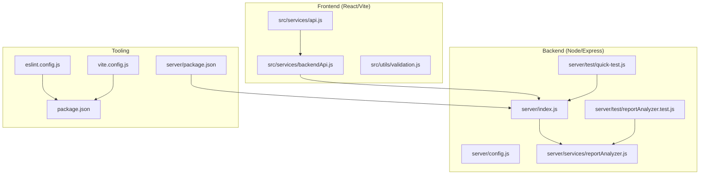
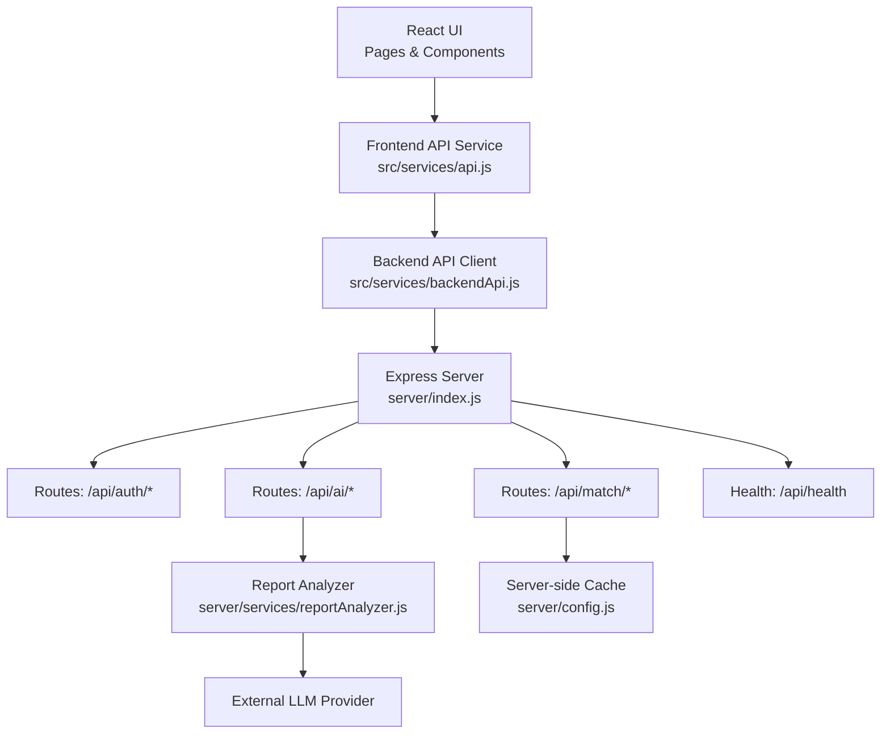
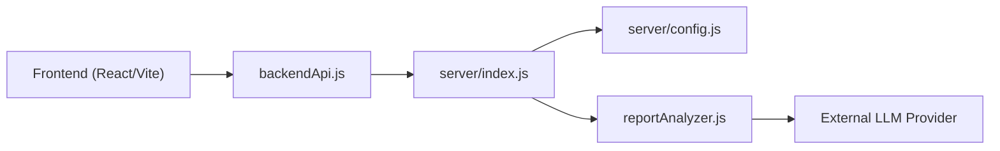
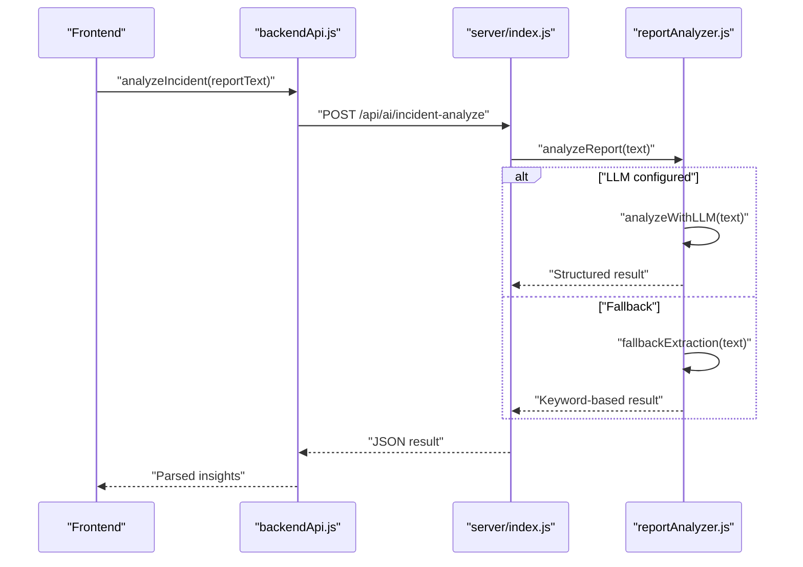

# Development Guidelines

<cite>
**Referenced Files in This Document**
- [README.md](file://README.md)
- [eslint.config.js](file://eslint.config.js)
- [package.json](file://package.json)
- [implementation_plan.md](file://implementation_plan.md)
- [vite.config.js](file://vite.config.js)
- [.gitignore](file://.gitignore)
- [server/package.json](file://server/package.json)
- [server/index.js](file://server/index.js)
- [server/config.js](file://server/config.js)
- [server/test/reportAnalyzer.test.js](file://server/test/reportAnalyzer.test.js)
- [server/test/quick-test.js](file://server/test/quick-test.js)
- [server/services/reportAnalyzer.js](file://server/services/reportAnalyzer.js)
- [src/services/api.js](file://src/services/api.js)
- [src/services/backendApi.js](file://src/services/backendApi.js)
- [src/utils/validation.js](file://src/utils/validation.js)
</cite>

## Table of Contents
1. [Introduction](#introduction)
2. [Project Structure](#project-structure)
3. [Core Components](#core-components)
4. [Architecture Overview](#architecture-overview)
5. [Detailed Component Analysis](#detailed-component-analysis)
6. [Dependency Analysis](#dependency-analysis)
7. [Performance Considerations](#performance-considerations)
8. [Troubleshooting Guide](#troubleshooting-guide)
9. [Conclusion](#conclusion)
10. [Appendices](#appendices)

## Introduction
This document defines comprehensive development guidelines for contributing to the Echo5 platform. It consolidates code standards, Git workflow, pull request and review expectations, testing and documentation requirements, quality gates, development environment setup, debugging procedures, local best practices, contribution and issue processes, governance and community guidelines, and onboarding and mentorship resources. The goal is to ensure consistent, secure, and maintainable contributions across the frontend (React/Vite), backend (Node/Express), and shared services.

## Project Structure
The repository is organized into:
- Frontend (React + Vite): UI components, pages, services, utilities, and assets
- Backend (Node/Express): API server, routes, middleware, services, and tests
- Shared configuration: ESLint, Vite, Firebase, and environment management
- Implementation plan and architecture upgrade guidance

**Diagram sources**
- [src/services/backendApi.js:1-164](file://src/services/backendApi.js#L1-L164)
- [src/services/api.js:1-599](file://src/services/api.js#L1-L599)
- [src/utils/validation.js:1-123](file://src/utils/validation.js#L1-L123)
- [server/index.js:1-118](file://server/index.js#L1-L118)
- [server/config.js:1-35](file://server/config.js#L1-L35)
- [server/services/reportAnalyzer.js:1-542](file://server/services/reportAnalyzer.js#L1-L542)
- [server/test/quick-test.js:1-87](file://server/test/quick-test.js#L1-L87)
- [server/test/reportAnalyzer.test.js:1-242](file://server/test/reportAnalyzer.test.js#L1-L242)
- [eslint.config.js:1-30](file://eslint.config.js#L1-L30)
- [vite.config.js:1-19](file://vite.config.js#L1-L19)
- [package.json:1-43](file://package.json#L1-L43)
- [server/package.json:1-18](file://server/package.json#L1-L18)

**Section sources**
- [README.md:1-17](file://README.md#L1-L17)
- [vite.config.js:1-19](file://vite.config.js#L1-L19)
- [package.json:1-43](file://package.json#L1-L43)
- [server/package.json:1-18](file://server/package.json#L1-L18)

## Core Components
- Code quality and linting: ESLint flat config with recommended rules for JS/JSX, React Hooks, and React Refresh
- Build and dev tooling: Vite with React plugin and Tailwind integration
- Backend API server: Express with Helmet, Morgan, CORS, rate limiting, and modular routes
- AI and analytics: Gemini-backed report analyzer with keyword fallback and batch processing
- Frontend services: Firebase integration, backend API client, and validation utilities
- Testing: Unit tests for report analyzer and quick smoke tests for backend endpoints

Key standards and configurations:
- ESLint configuration extends recommended rules and applies globals and plugin-specific configs
- Scripts include dev, build, lint, and preview
- Vite proxy forwards API calls to the backend during development
- Environment isolation via .env and centralized config module

**Section sources**
- [eslint.config.js:1-30](file://eslint.config.js#L1-L30)
- [package.json:6-11](file://package.json#L6-L11)
- [vite.config.js:8-18](file://vite.config.js#L8-L18)
- [server/index.js:28-101](file://server/index.js#L28-L101)
- [server/config.js:8-35](file://server/config.js#L8-L35)
- [server/services/reportAnalyzer.js:472-503](file://server/services/reportAnalyzer.js#L472-L503)
- [src/services/backendApi.js:33-54](file://src/services/backendApi.js#L33-L54)
- [src/utils/validation.js:30-80](file://src/utils/validation.js#L30-L80)
- [server/test/reportAnalyzer.test.js:93-241](file://server/test/reportAnalyzer.test.js#L93-L241)
- [server/test/quick-test.js:7-86](file://server/test/quick-test.js#L7-L86)

## Architecture Overview
The system follows a frontend-backend separation with secure AI processing on the server:
- Frontend (React/Vite) communicates with backend via a typed HTTP client
- Backend enforces security headers, logging, CORS, rate limits, and JWT-based authentication
- AI endpoints proxy external LLM calls and expose health checks
- Firestore is accessed via Firebase SDK with validation and caching layers

**Diagram sources**
- [src/services/backendApi.js:56-163](file://src/services/backendApi.js#L56-L163)
- [src/services/api.js:295-562](file://src/services/api.js#L295-L562)
- [server/index.js:74-117](file://server/index.js#L74-L117)
- [server/services/reportAnalyzer.js:418-461](file://server/services/reportAnalyzer.js#L418-L461)
- [server/config.js:29-32](file://server/config.js#L29-L32)

## Detailed Component Analysis

### Code Standards and Formatting
- ESLint configuration
  - Extends recommended JS and React/JSX rules
  - Enables React Hooks and React Refresh plugins
  - Applies browser globals and module parsing options
  - Ignores dist folder and sets no-unused-vars to error with var name exceptions
- Naming conventions
  - Prefer camelCase for variables and functions
  - Use PascalCase for React components
  - Keep filenames descriptive and aligned with component purpose
- Formatting and linting
  - Run lint via npm script
  - Use consistent indentation and spacing
  - Avoid unused variables; when intentional, use appropriate naming patterns

**Section sources**
- [eslint.config.js:7-29](file://eslint.config.js#L7-L29)
- [README.md:14-16](file://README.md#L14-L16)
- [package.json:9](file://package.json#L9)

### Git Workflow and Pull Requests
- Branching model
  - Feature branches per task; keep branches focused and short-lived
- Commit hygiene
  - Write clear, imperative commit messages
  - Reference related issues and PRs
- Pull requests
  - Target develop or main based on project policy
  - Include a summary, rationale, and testing steps
  - Ensure CI passes and reviews are approved
- Code review standards
  - Focus on correctness, readability, security, and performance
  - Verify adherence to lint rules and naming conventions
  - Confirm tests pass and documentation updates

[No sources needed since this section provides general guidance]

### Testing Requirements and Quality Gates
- Unit tests
  - Report analyzer tests validate structure, urgency classification, needs detection, and error handling
  - Batch processing tests assert success/failure counts
- Integration/smoke tests
  - Quick test script exercises auth login and AI endpoints with bearer tokens
- Quality gates
  - Lint must pass
  - All tests must pass locally before opening a PR
  - Backend health endpoint must be reachable and return expected fields

**Section sources**
- [server/test/reportAnalyzer.test.js:93-241](file://server/test/reportAnalyzer.test.js#L93-L241)
- [server/test/quick-test.js:7-86](file://server/test/quick-test.js#L7-L86)
- [server/index.js:79-87](file://server/index.js#L79-L87)

### Documentation Standards
- Inline documentation
  - Document exported functions, services, and complex logic with purpose and parameters
- Architectural notes
  - Use markdown files to capture plans and decisions (see implementation plan)
- API documentation
  - Maintain a list of endpoints, request/response shapes, and auth requirements

**Section sources**
- [implementation_plan.md:1-155](file://implementation_plan.md#L1-L155)
- [server/services/reportAnalyzer.js:286-346](file://server/services/reportAnalyzer.js#L286-L346)
- [src/services/backendApi.js:56-163](file://src/services/backendApi.js#L56-L163)

### Development Environment Setup
- Prerequisites
  - Node.js LTS and npm
- Install dependencies
  - Root and server directories have separate package manifests
- Environment variables
  - Backend reads secrets from process.env (e.g., API keys, JWT secret, rate limits)
  - Frontend uses Vite’s import.meta.env for runtime configuration
- Running locally
  - Start backend server and frontend dev server concurrently
  - Vite proxy forwards /api calls to backend
- Security
  - Never commit secrets; use .env files excluded by .gitignore

**Section sources**
- [server/package.json:5-8](file://server/package.json#L5-L8)
- [package.json:6-11](file://package.json#L6-L11)
- [vite.config.js:8-18](file://vite.config.js#L8-L18)
- [server/config.js:6-35](file://server/config.js#L6-L35)
- [.gitignore:14-16](file://.gitignore#L14-L16)

### Debugging Procedures and Best Practices
- Frontend debugging
  - Use browser devtools; verify API calls and token handling
  - Inspect sessionStorage for JWT token persistence
- Backend debugging
  - Check Morgan logs for request/response details
  - Use health endpoint to confirm server readiness
  - Validate rate limiter and CORS configurations
- AI and analytics
  - Monitor Gemini API key configuration and fallback behavior
  - Validate input lengths and error handling paths

**Section sources**
- [src/services/backendApi.js:19-30](file://src/services/backendApi.js#L19-L30)
- [server/index.js:35](file://server/index.js#L35)
- [server/index.js:79-87](file://server/index.js#L79-L87)
- [server/services/reportAnalyzer.js:472-503](file://server/services/reportAnalyzer.js#L472-L503)

### Contribution Guidelines, Issues, and Features
- Reporting issues
  - Provide reproducible steps, expected vs. actual behavior, and environment details
- Feature requests
  - Describe the problem statement, proposed solution, and acceptance criteria
- Onboarding and mentorship
  - New contributors should start with small, well-scoped tasks
  - Pair programming sessions and code walkthroughs are encouraged

[No sources needed since this section provides general guidance]

### Governance and Community Guidelines
- Decision-making
  - Major changes follow the documented upgrade plan and require stakeholder review
- Community
  - Respectful collaboration, inclusive communication, and constructive feedback

**Section sources**
- [implementation_plan.md:5-9](file://implementation_plan.md#L5-L9)

## Dependency Analysis
The frontend depends on backend APIs and Firebase, while the backend depends on configuration and external services.

**Diagram sources**
- [src/services/backendApi.js:56-163](file://src/services/backendApi.js#L56-L163)
- [server/index.js:21-25](file://server/index.js#L21-L25)
- [server/config.js:6-35](file://server/config.js#L6-L35)
- [server/services/reportAnalyzer.js:6](file://server/services/reportAnalyzer.js#L6)

**Section sources**
- [src/services/backendApi.js:56-163](file://src/services/backendApi.js#L56-L163)
- [server/index.js:21-25](file://server/index.js#L21-L25)
- [server/config.js:6-35](file://server/config.js#L6-L35)
- [server/services/reportAnalyzer.js:6](file://server/services/reportAnalyzer.js#L6)

## Performance Considerations
- Rate limiting
  - Global and stricter limits for AI endpoints to protect resources
- Caching
  - Server-side cache for matching engine results with TTL and size limits
- Pagination
  - Firestore pagination reduces payload sizes and improves scalability
- LLM fallback
  - Keyword-based extraction ensures resilience when external APIs are unavailable

**Section sources**
- [server/index.js:50-72](file://server/index.js#L50-L72)
- [server/config.js:29-32](file://server/config.js#L29-L32)
- [implementation_plan.md:110-143](file://implementation_plan.md#L110-L143)
- [server/services/reportAnalyzer.js:496-503](file://server/services/reportAnalyzer.js#L496-L503)

## Troubleshooting Guide
- Lint failures
  - Run the lint script and address reported issues
- Missing environment variables
  - Ensure backend config variables are set; health endpoint indicates configuration status
- API errors
  - Check backend logs, verify tokens, and confirm endpoint availability
- Report analyzer errors
  - Validate input length and structure; inspect fallback behavior

**Section sources**
- [package.json:9](file://package.json#L9)
- [server/index.js:95-101](file://server/index.js#L95-L101)
- [server/index.js:79-87](file://server/index.js#L79-L87)
- [server/services/reportAnalyzer.js:472-484](file://server/services/reportAnalyzer.js#L472-L484)

## Conclusion
These guidelines establish a consistent, secure, and scalable development process for Echo5. By adhering to code standards, following the Git workflow, maintaining robust tests, and applying the documented architecture and performance practices, contributors can deliver high-quality features and improvements efficiently.

## Appendices

### Appendix A: API Endpoint Reference
- Authentication
  - POST /api/auth/login
- AI
  - POST /api/ai/parse-document
  - POST /api/ai/incident-analyze
  - POST /api/ai/chat
  - POST /api/ai/explain-match
  - POST /api/ai/analyze-report
  - POST /api/ai/analyze-reports-batch
- Matching
  - POST /api/match
  - POST /api/match/recommend
  - GET /api/match/cache-stats
- Monitoring
  - GET /api/health

**Section sources**
- [server/index.js:104-117](file://server/index.js#L104-L117)
- [src/services/backendApi.js:56-163](file://src/services/backendApi.js#L56-L163)

### Appendix B: Example Flow — Report Analysis

**Diagram sources**
- [src/services/backendApi.js:100-105](file://src/services/backendApi.js#L100-L105)
- [server/index.js:74-76](file://server/index.js#L74-L76)
- [server/services/reportAnalyzer.js:472-503](file://server/services/reportAnalyzer.js#L472-L503)