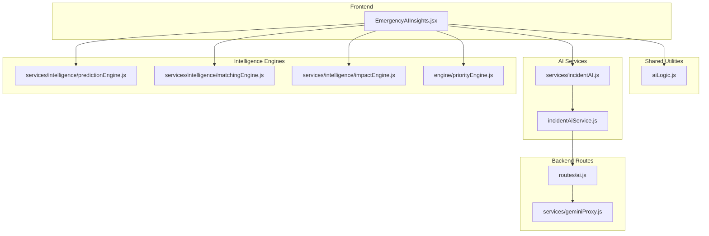
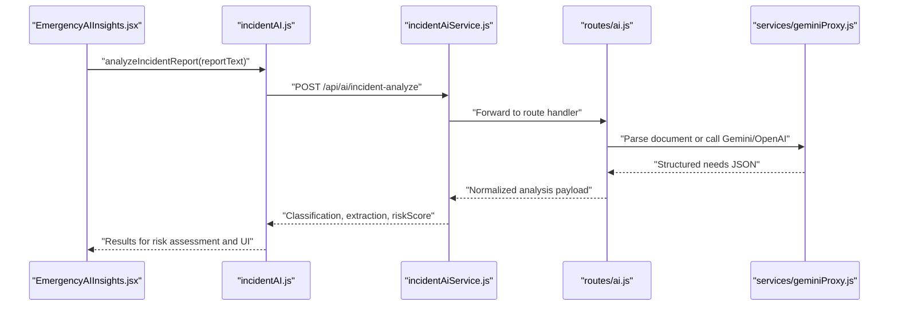
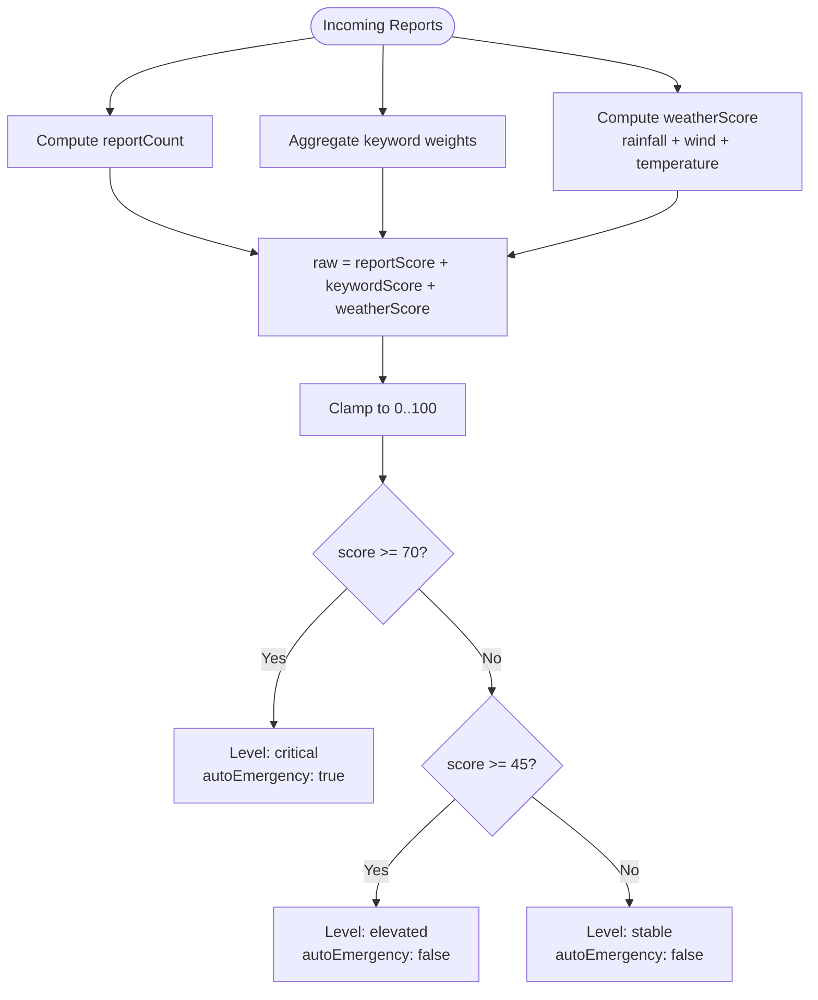
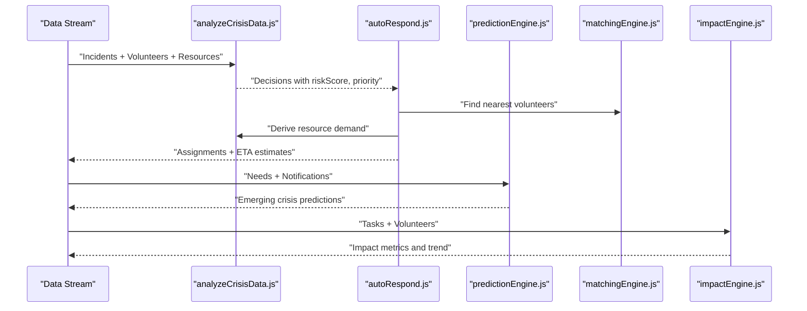
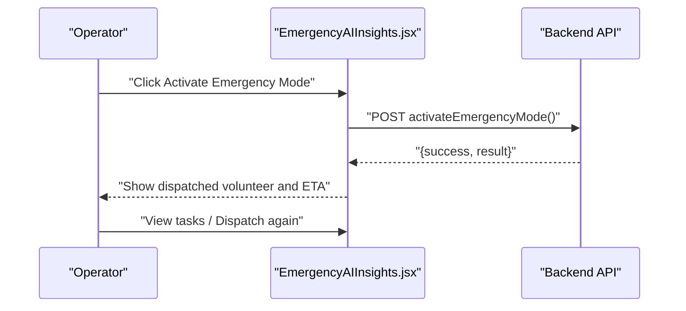
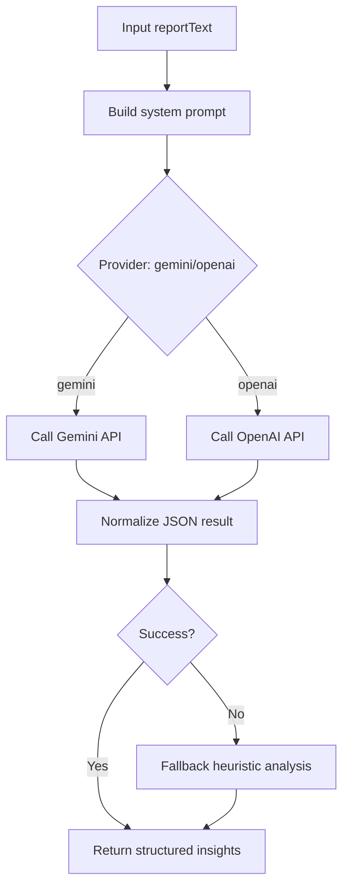
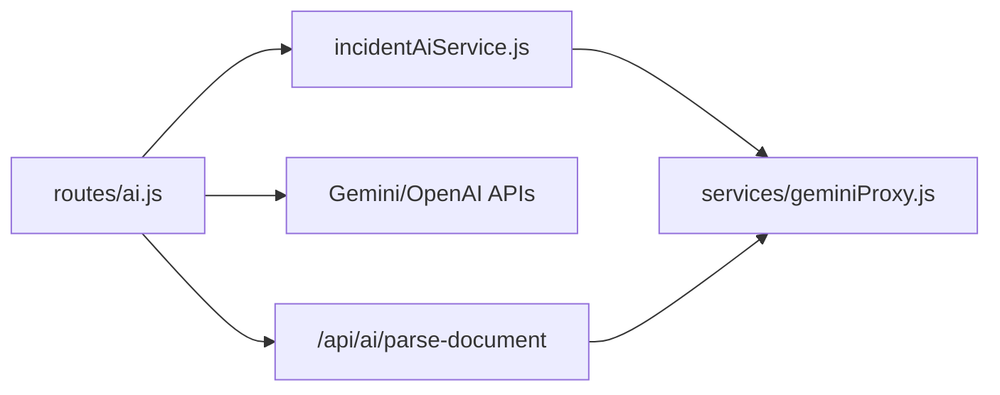
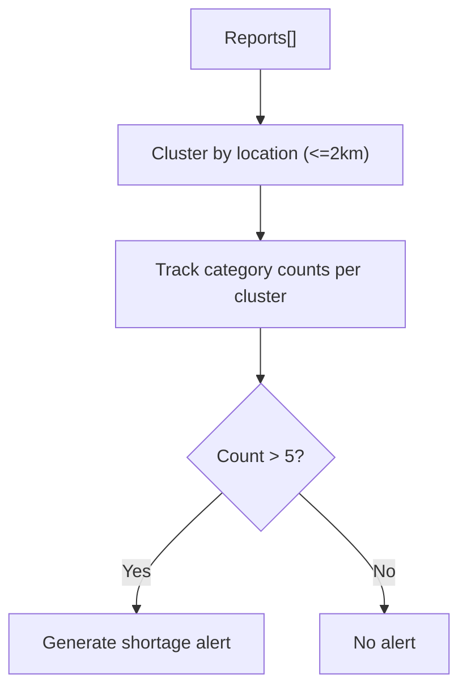
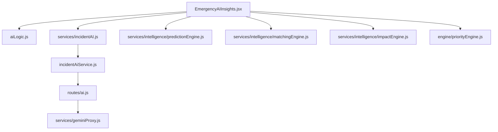

# Emergency Detection and Risk Assessment

<cite>
**Referenced Files in This Document**
- [analyzeCrisisData.js](file://src/engine/analyzeCrisisData.js)
- [autoRespond.js](file://src/engine/autoRespond.js)
- [aiLogic.js](file://src/utils/aiLogic.js)
- [ai.js](file://server/routes/ai.js)
- [geminiProxy.js](file://server/services/geminiProxy.js)
- [incidentAI.js](file://src/services/incidentAI.js)
- [incidentAiService.js](file://server/incidentAiService.js)
- [EmergencyAIInsights.jsx](file://src/components/EmergencyAIInsights.jsx)
- [predictionEngine.js](file://src/services/intelligence/predictionEngine.js)
- [matchingEngine.js](file://src/services/intelligence/matchingEngine.js)
- [impactEngine.js](file://src/services/intelligence/impactEngine.js)
- [priorityEngine.js](file://src/engine/priorityEngine.js)
- [matchingEngine.js](file://src/engine/matchingEngine.js)
- [impactEngine.js](file://src/engine/impactEngine.js)
</cite>

## Table of Contents
1. [Introduction](#introduction)
2. [Project Structure](#project-structure)
3. [Core Components](#core-components)
4. [Architecture Overview](#architecture-overview)
5. [Detailed Component Analysis](#detailed-component-analysis)
6. [Dependency Analysis](#dependency-analysis)
7. [Performance Considerations](#performance-considerations)
8. [Troubleshooting Guide](#troubleshooting-guide)
9. [Conclusion](#conclusion)

## Introduction
This document describes the Emergency Detection and Risk Assessment subsystem. It covers the automatic emergency detection algorithm that analyzes incoming crisis reports, keyword patterns, and environmental factors; the risk scoring mechanism that evaluates report volume, urgency keywords, and weather conditions; the real-time evaluation process that continuously monitors incoming data streams and triggers emergency mode activation; manual override controls, pause mechanisms, and escalation procedures; integration with external AI providers; the simulation framework for testing emergency responses; and AI-driven insights generation. It also addresses system reliability under high-stress conditions and fail-safe mechanisms.

## Project Structure
The subsystem spans frontend React components, shared utilities, backend routes, and AI services:
- Frontend: Emergency detection UI and insights rendering
- Shared utilities: Risk scoring and keyword analysis
- Backend: AI analysis routes and proxies; incident analysis service
- Intelligence engines: Emerging crisis detection, prioritization, matching, and impact metrics

**Diagram sources**
- [EmergencyAIInsights.jsx:1-600](file://src/components/EmergencyAIInsights.jsx#L1-L600)
- [aiLogic.js:1-128](file://src/utils/aiLogic.js#L1-L128)
- [ai.js:1-348](file://server/routes/ai.js#L1-L348)
- [geminiProxy.js:1-104](file://server/services/geminiProxy.js#L1-L104)
- [incidentAI.js:1-24](file://src/services/incidentAI.js#L1-L24)
- [incidentAiService.js:1-189](file://server/incidentAiService.js#L1-L189)
- [predictionEngine.js:1-66](file://src/services/intelligence/predictionEngine.js#L1-L66)
- [matchingEngine.js:1-59](file://src/services/intelligence/matchingEngine.js#L1-L59)
- [impactEngine.js:1-44](file://src/services/intelligence/impactEngine.js#L1-L44)
- [priorityEngine.js:1-72](file://src/engine/priorityEngine.js#L1-L72)

**Section sources**
- [EmergencyAIInsights.jsx:1-600](file://src/components/EmergencyAIInsights.jsx#L1-L600)
- [aiLogic.js:1-128](file://src/utils/aiLogic.js#L1-L128)
- [ai.js:1-348](file://server/routes/ai.js#L1-L348)
- [geminiProxy.js:1-104](file://server/services/geminiProxy.js#L1-L104)
- [incidentAI.js:1-24](file://src/services/incidentAI.js#L1-L24)
- [incidentAiService.js:1-189](file://server/incidentAiService.js#L1-L189)
- [predictionEngine.js:1-66](file://src/services/intelligence/predictionEngine.js#L1-L66)
- [matchingEngine.js:1-59](file://src/services/intelligence/matchingEngine.js#L1-L59)
- [impactEngine.js:1-44](file://src/services/intelligence/impactEngine.js#L1-L44)
- [priorityEngine.js:1-72](file://src/engine/priorityEngine.js#L1-L72)

## Core Components
- Automatic emergency detection and risk scoring:
  - Keyword-weighted risk scoring from incoming reports
  - Weather-condition modifiers
  - Threshold-based emergency classification
- Real-time evaluation pipeline:
  - Incoming report ingestion and AI classification
  - Emerging crisis detection across regions
  - Priority and assignment recommendations
- Manual controls and escalation:
  - Emergency mode activation UI
  - Pause and reset mechanisms
  - Escalation messaging and actions
- AI-driven insights:
  - Structured report analysis with categories, urgency, and resource needs
  - Confidence metrics and tag extraction
  - Fallback heuristic when LLM fails

**Section sources**
- [aiLogic.js:16-36](file://src/utils/aiLogic.js#L16-L36)
- [ai.js:52-76](file://server/routes/ai.js#L52-L76)
- [incidentAI.js:1-24](file://src/services/incidentAI.js#L1-L24)
- [incidentAiService.js:170-189](file://server/incidentAiService.js#L170-L189)
- [EmergencyAIInsights.jsx:67-93](file://src/components/EmergencyAIInsights.jsx#L67-L93)

## Architecture Overview
The system integrates frontend emergency controls with backend AI analysis and intelligence engines. Incoming reports are processed through AI classification, then combined with regional trends and resource availability to produce risk scores and recommendations.

**Diagram sources**
- [EmergencyAIInsights.jsx:1-600](file://src/components/EmergencyAIInsights.jsx#L1-L600)
- [incidentAI.js:1-24](file://src/services/incidentAI.js#L1-L24)
- [incidentAiService.js:170-189](file://server/incidentAiService.js#L170-L189)
- [ai.js:52-76](file://server/routes/ai.js#L52-L76)
- [geminiProxy.js:53-103](file://server/services/geminiProxy.js#L53-L103)

## Detailed Component Analysis

### Automatic Emergency Detection and Risk Scoring
The risk scoring module aggregates:
- Report volume contribution
- Keyword weights mapped to incident types
- Weather condition modifiers (rainfall, wind, temperature)
- Threshold-based emergency classification

**Diagram sources**
- [aiLogic.js:16-36](file://src/utils/aiLogic.js#L16-L36)

**Section sources**
- [aiLogic.js:16-36](file://src/utils/aiLogic.js#L16-L36)

### Real-Time Evaluation Pipeline
The pipeline processes incoming data streams to continuously evaluate risk and trigger emergency mode:
- Incoming reports are analyzed for category, urgency, and resource needs
- Emerging crisis detection identifies high-signal regions and types
- Priority and assignment recommendations are computed using volunteer matching and resource allocation

**Diagram sources**
- [analyzeCrisisData.js:87-160](file://src/engine/analyzeCrisisData.js#L87-L160)
- [autoRespond.js:146-202](file://src/engine/autoRespond.js#L146-L202)
- [predictionEngine.js:15-65](file://src/services/intelligence/predictionEngine.js#L15-L65)
- [matchingEngine.js:143-173](file://src/engine/matchingEngine.js#L143-L173)
- [impactEngine.js:24-57](file://src/engine/impactEngine.js#L24-L57)

**Section sources**
- [analyzeCrisisData.js:87-160](file://src/engine/analyzeCrisisData.js#L87-L160)
- [autoRespond.js:146-202](file://src/engine/autoRespond.js#L146-L202)
- [predictionEngine.js:15-65](file://src/services/intelligence/predictionEngine.js#L15-L65)
- [matchingEngine.js:143-173](file://src/engine/matchingEngine.js#L143-L173)
- [impactEngine.js:24-57](file://src/engine/impactEngine.js#L24-L57)

### Manual Override Controls and Escalation Procedures
The frontend component exposes an emergency activation button with:
- One-click activation flow
- Success and error states
- Dispatched volunteer and ETA display
- Navigation to tasks and re-dispatch capability

**Diagram sources**
- [EmergencyAIInsights.jsx:67-93](file://src/components/EmergencyAIInsights.jsx#L67-L93)

**Section sources**
- [EmergencyAIInsights.jsx:67-93](file://src/components/EmergencyAIInsights.jsx#L67-L93)

### AI-Driven Insights Generation
The AI analysis service performs:
- Structured classification (category, severity)
- Extraction (location, urgency, resource)
- Summary and tag generation
- Fallback heuristic when LLM calls fail

**Diagram sources**
- [incidentAiService.js:90-189](file://server/incidentAiService.js#L90-L189)
- [ai.js:117-177](file://server/routes/ai.js#L117-L177)
- [geminiProxy.js:53-103](file://server/services/geminiProxy.js#L53-L103)

**Section sources**
- [incidentAiService.js:90-189](file://server/incidentAiService.js#L90-L189)
- [ai.js:117-177](file://server/routes/ai.js#L117-L177)
- [geminiProxy.js:53-103](file://server/services/geminiProxy.js#L53-L103)

### Integration with External Data Sources
- AI providers: Gemini and OpenAI via secure backend routes
- Document parsing proxy for structured needs extraction
- Real-time data feeds for needs, notifications, and volunteer availability

**Diagram sources**
- [ai.js:1-348](file://server/routes/ai.js#L1-L348)
- [incidentAiService.js:1-189](file://server/incidentAiService.js#L1-L189)
- [geminiProxy.js:1-104](file://server/services/geminiProxy.js#L1-L104)

**Section sources**
- [ai.js:1-348](file://server/routes/ai.js#L1-L348)
- [geminiProxy.js:1-104](file://server/services/geminiProxy.js#L1-L104)

### Simulation Framework for Testing Emergency Responses
The system supports batch report analysis and clustering to simulate emergency scenarios:
- Batch processing of multiple reports
- Spatial clustering to detect high-density zones
- Predictive alerts for potential shortages

**Diagram sources**
- [aiLogic.js:74-127](file://src/utils/aiLogic.js#L74-L127)

**Section sources**
- [aiLogic.js:74-127](file://src/utils/aiLogic.js#L74-L127)

## Dependency Analysis
The subsystem exhibits layered dependencies:
- Frontend depends on shared utilities and AI services
- AI services depend on backend routes and external providers
- Intelligence engines depend on incoming data streams

**Diagram sources**
- [EmergencyAIInsights.jsx:1-600](file://src/components/EmergencyAIInsights.jsx#L1-L600)
- [aiLogic.js:1-128](file://src/utils/aiLogic.js#L1-L128)
- [incidentAI.js:1-24](file://src/services/incidentAI.js#L1-L24)
- [incidentAiService.js:1-189](file://server/incidentAiService.js#L1-L189)
- [ai.js:1-348](file://server/routes/ai.js#L1-L348)
- [geminiProxy.js:1-104](file://server/services/geminiProxy.js#L1-L104)
- [predictionEngine.js:1-66](file://src/services/intelligence/predictionEngine.js#L1-L66)
- [matchingEngine.js:1-59](file://src/services/intelligence/matchingEngine.js#L1-L59)
- [impactEngine.js:1-44](file://src/services/intelligence/impactEngine.js#L1-L44)
- [priorityEngine.js:1-72](file://src/engine/priorityEngine.js#L1-L72)

**Section sources**
- [EmergencyAIInsights.jsx:1-600](file://src/components/EmergencyAIInsights.jsx#L1-L600)
- [aiLogic.js:1-128](file://src/utils/aiLogic.js#L1-L128)
- [incidentAI.js:1-24](file://src/services/incidentAI.js#L1-L24)
- [incidentAiService.js:1-189](file://server/incidentAiService.js#L1-L189)
- [ai.js:1-348](file://server/routes/ai.js#L1-L348)
- [geminiProxy.js:1-104](file://server/services/geminiProxy.js#L1-L104)
- [predictionEngine.js:1-66](file://src/services/intelligence/predictionEngine.js#L1-L66)
- [matchingEngine.js:1-59](file://src/services/intelligence/matchingEngine.js#L1-L59)
- [impactEngine.js:1-44](file://src/services/intelligence/impactEngine.js#L1-L44)
- [priorityEngine.js:1-72](file://src/engine/priorityEngine.js#L1-L72)

## Performance Considerations
- Risk scoring and clustering operate in linear time relative to report counts and spatial clusters.
- Volunteer matching and resource allocation scale with incident count and candidate pools; batching reduces overhead.
- AI inference latency is bounded by external provider SLAs; fallback heuristics ensure minimum responsiveness.
- Frontend animations and state updates are optimized for smooth UX during high-frequency updates.

[No sources needed since this section provides general guidance]

## Troubleshooting Guide
- AI analysis failures:
  - Verify API keys and provider configuration
  - Inspect route-level error responses and logs
  - Confirm fallback heuristic activation when providers fail
- Emergency mode activation:
  - Check UI loading states and error messages
  - Validate backend route permissions and context
- Data validation:
  - Ensure reportText presence and non-empty strings
  - Normalize location and urgency fields before processing

**Section sources**
- [ai.js:52-76](file://server/routes/ai.js#L52-L76)
- [incidentAiService.js:170-189](file://server/incidentAiService.js#L170-L189)
- [EmergencyAIInsights.jsx:67-93](file://src/components/EmergencyAIInsights.jsx#L67-L93)

## Conclusion
The Emergency Detection and Risk Assessment subsystem combines robust risk scoring, real-time evaluation, and AI-driven insights to support rapid response decisions. It integrates securely with external AI providers, offers manual overrides and escalations, and maintains reliability through fallback mechanisms. The modular design enables continuous monitoring, adaptive prioritization, and scalable emergency response under stress.