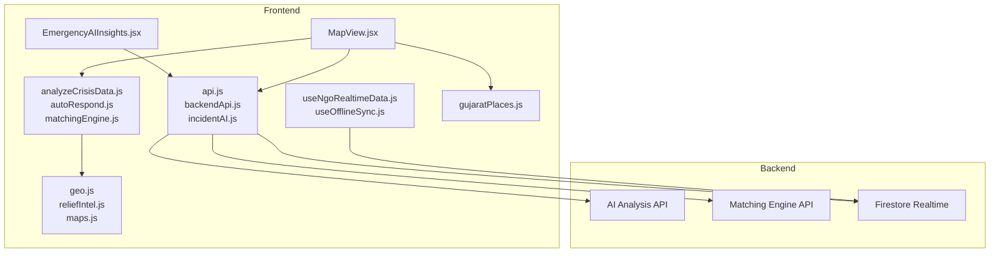
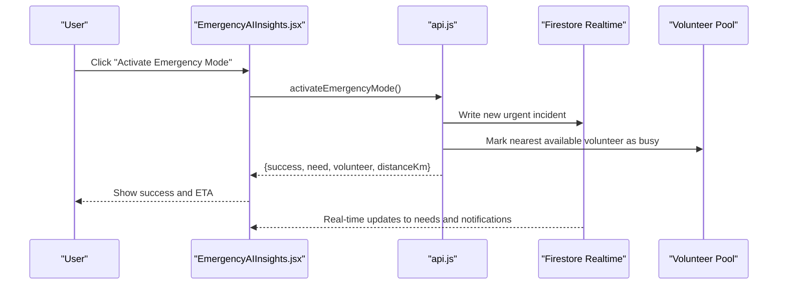
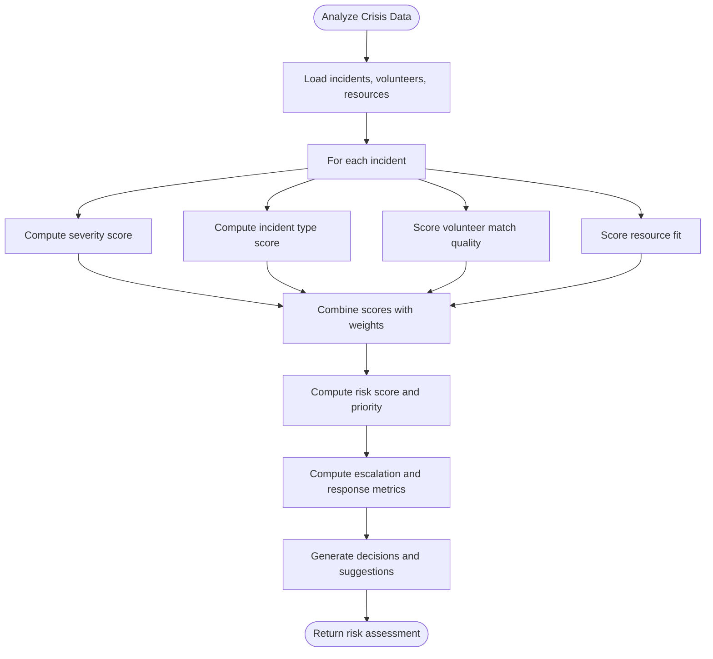
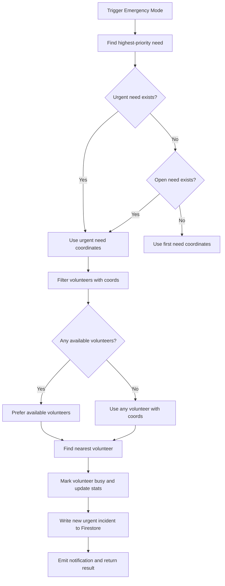
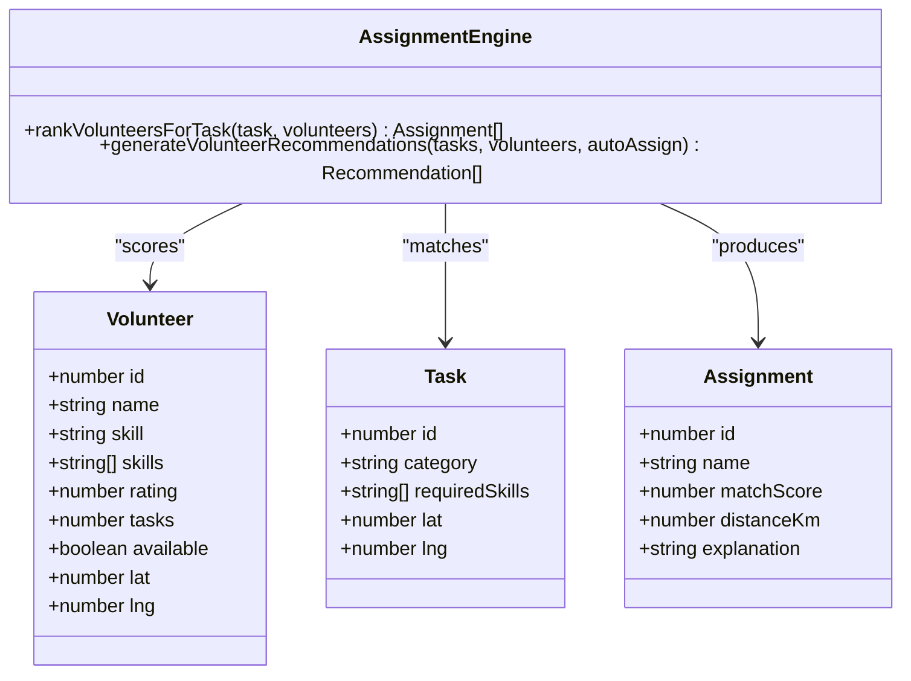
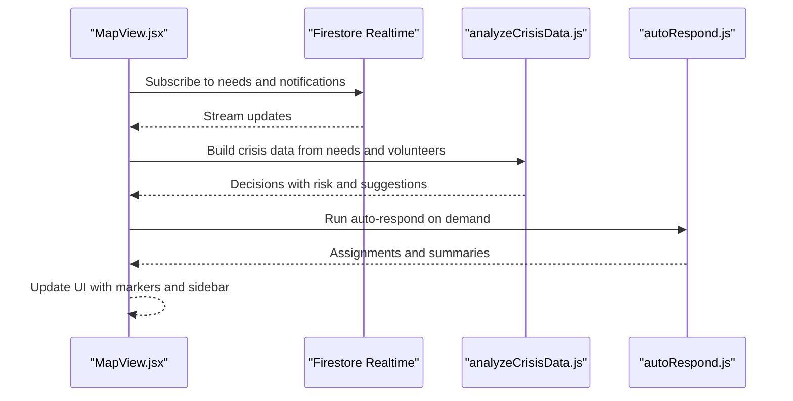
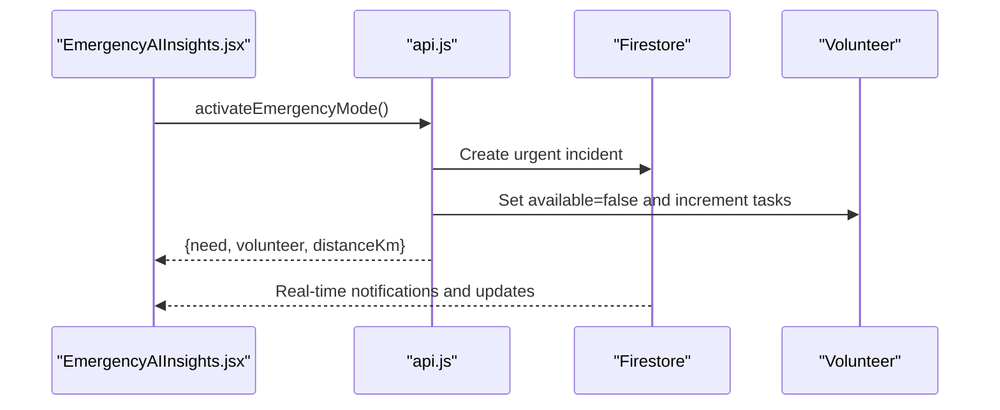
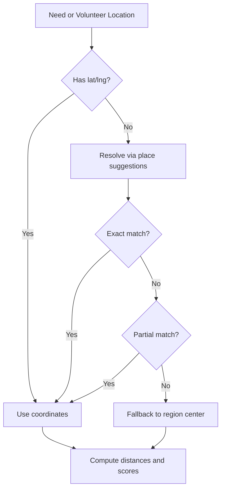
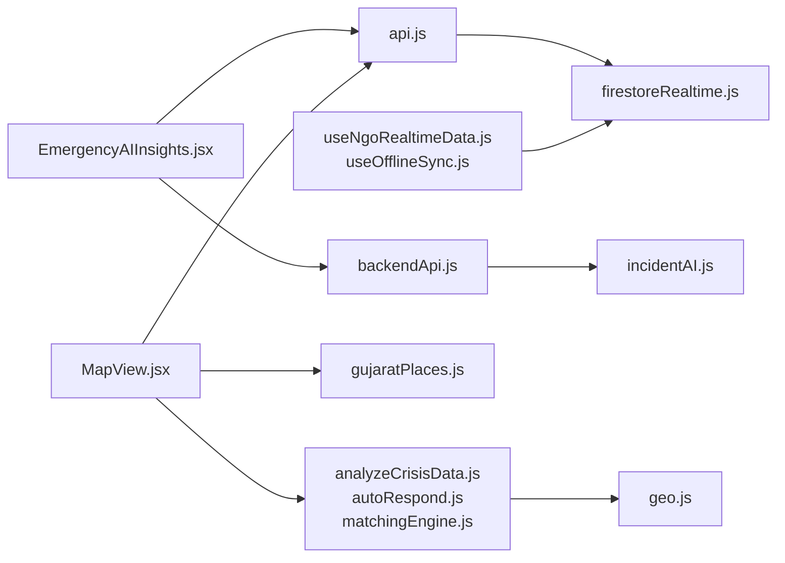

# Emergency Response System

<cite>
**Referenced Files in This Document**
- [README.md](file://README.md)
- [autoRespond.js](file://src/engine/autoRespond.js)
- [analyzeCrisisData.js](file://src/engine/analyzeCrisisData.js)
- [matchingEngine.js](file://src/engine/matchingEngine.js)
- [matchingEngine.js](file://src/services/intelligence/matchingEngine.js)
- [incidentAI.js](file://src/services/incidentAI.js)
- [EmergencyAIInsights.jsx](file://src/components/EmergencyAIInsights.jsx)
- [MapView.jsx](file://src/pages/MapView.jsx)
- [api.js](file://src/services/api.js)
- [backendApi.js](file://src/services/backendApi.js)
- [geo.js](file://src/utils/geo.js)
- [maps.js](file://src/services/maps.js)
- [firestoreRealtime.js](file://src/services/firestoreRealtime.js)
- [gujaratPlaces.js](file://src/data/gujaratPlaces.js)
- [reliefIntel.js](file://src/utils/reliefIntel.js)
- [useNgoRealtimeData.js](file://src/hooks/useNgoRealtimeData.js)
- [useOfflineSync.js](file://src/hooks/useOfflineSync.js)
</cite>

## Table of Contents
1. [Introduction](#introduction)
2. [Project Structure](#project-structure)
3. [Core Components](#core-components)
4. [Architecture Overview](#architecture-overview)
5. [Detailed Component Analysis](#detailed-component-analysis)
6. [Dependency Analysis](#dependency-analysis)
7. [Performance Considerations](#performance-considerations)
8. [Troubleshooting Guide](#troubleshooting-guide)
9. [Conclusion](#conclusion)

## Introduction
This document describes the emergency response system for the platform’s crisis management capabilities. It covers automatic emergency detection logic, risk assessment algorithms, threshold-based activation mechanisms, volunteer deployment and assignment, real-time coordination workflows, emergency mode activation, manual override controls, escalation procedures, location services integration, proximity matching, real-time status updates, user interface components for emergency scenarios, notification systems, collaborative response tools, reliability and fail-safe mechanisms, and performance characteristics under high-stress conditions.

## Project Structure
The emergency response system spans frontend React components, client-side engines, and backend services:
- Frontend pages and components orchestrate user actions and display real-time data.
- Client-side engines compute risk scores, prioritize incidents, and assign volunteers.
- Backend APIs provide AI analysis, secure document parsing, and matching services.
- Real-time synchronization ensures live updates across clients.
- Location services enable coordinate resolution and proximity calculations.

**Diagram sources**
- [EmergencyAIInsights.jsx:1-600](file://src/components/EmergencyAIInsights.jsx#L1-L600)
- [MapView.jsx:1-1709](file://src/pages/MapView.jsx#L1-L1709)
- [api.js:1-599](file://src/services/api.js#L1-L599)
- [backendApi.js:1-164](file://src/services/backendApi.js#L1-L164)
- [analyzeCrisisData.js:1-161](file://src/engine/analyzeCrisisData.js#L1-L161)
- [autoRespond.js:1-204](file://src/engine/autoRespond.js#L1-L204)
- [matchingEngine.js:1-174](file://src/engine/matchingEngine.js#L1-L174)
- [geo.js:1-37](file://src/utils/geo.js#L1-L37)
- [reliefIntel.js:1-47](file://src/utils/reliefIntel.js#L1-L47)
- [maps.js:1-80](file://src/services/maps.js#L1-L80)
- [gujaratPlaces.js:1-116](file://src/data/gujaratPlaces.js#L1-L116)
- [firestoreRealtime.js:1-212](file://src/services/firestoreRealtime.js#L1-L212)
- [useNgoRealtimeData.js:1-83](file://src/hooks/useNgoRealtimeData.js#L1-L83)
- [useOfflineSync.js:1-72](file://src/hooks/useOfflineSync.js#L1-L72)

**Section sources**
- [README.md:1-17](file://README.md#L1-L17)
- [MapView.jsx:272-520](file://src/pages/MapView.jsx#L272-L520)
- [EmergencyAIInsights.jsx:49-125](file://src/components/EmergencyAIInsights.jsx#L49-L125)

## Core Components
- Risk assessment engine: Computes risk scores per incident, prioritizes by severity and type, and estimates escalation probability and response time.
- Automatic assignment engine: Matches nearest available volunteers to incidents based on skills, proximity, availability, and performance.
- Emergency mode activation: Creates an urgent incident at the most critical location, assigns the nearest available volunteer, and notifies stakeholders.
- Real-time coordination: Live map view, incident list, volunteer pool, and status updates synchronized via Firestore.
- Location services: Coordinate resolution, region mapping, and proximity calculations using Haversine distance.
- Notification system: Real-time notifications for emergencies, assignments, and status changes.
- Offline resilience: Local caching and action queuing for offline operation with automatic re-sync upon reconnect.

**Section sources**
- [analyzeCrisisData.js:87-161](file://src/engine/analyzeCrisisData.js#L87-L161)
- [autoRespond.js:146-204](file://src/engine/autoRespond.js#L146-L204)
- [matchingEngine.js:143-174](file://src/engine/matchingEngine.js#L143-L174)
- [api.js:428-517](file://src/services/api.js#L428-L517)
- [MapView.jsx:272-520](file://src/pages/MapView.jsx#L272-L520)
- [geo.js:15-36](file://src/utils/geo.js#L15-L36)
- [gujaratPlaces.js:92-115](file://src/data/gujaratPlaces.js#L92-L115)
- [firestoreRealtime.js:61-116](file://src/services/firestoreRealtime.js#L61-L116)
- [useOfflineSync.js:13-71](file://src/hooks/useOfflineSync.js#L13-L71)

## Architecture Overview
The system integrates client-side computation with backend services for AI analysis and secure operations. Real-time updates flow through Firestore, while emergency actions trigger immediate backend writes and notifications.

**Diagram sources**
- [EmergencyAIInsights.jsx:67-87](file://src/components/EmergencyAIInsights.jsx#L67-L87)
- [api.js:428-517](file://src/services/api.js#L428-L517)
- [firestoreRealtime.js:61-116](file://src/services/firestoreRealtime.js#L61-L116)

## Detailed Component Analysis

### Risk Assessment and Automatic Detection
The risk assessment engine computes:
- Severity-weighted risk score combining severity and incident type.
- Volunteer match quality and nearby count to infer resource fit.
- Resource availability fit for required supplies.
- Escalation probability and expected response time.
- Priority levels derived from thresholds.

**Diagram sources**
- [analyzeCrisisData.js:87-161](file://src/engine/analyzeCrisisData.js#L87-L161)

**Section sources**
- [analyzeCrisisData.js:3-86](file://src/engine/analyzeCrisisData.js#L3-L86)
- [reliefIntel.js:8-26](file://src/utils/reliefIntel.js#L8-L26)

### Threshold-Based Activation Mechanisms
Activation thresholds:
- Emergency mode selects the most critical open or active urgent need, or falls back to the first need if none exist.
- Proximity threshold: nearest volunteer within calculated distance is auto-assigned.
- Availability threshold: prefers available volunteers; otherwise uses the nearest busy volunteer.

**Diagram sources**
- [api.js:428-517](file://src/services/api.js#L428-L517)

**Section sources**
- [api.js:428-517](file://src/services/api.js#L428-L517)

### Volunteer Deployment and Assignment
Assignment logic:
- Skills matching: Normalized skill tokens compared against required skills.
- Proximity scoring: Haversine distance mapped to proximity score.
- Availability and performance: Status and rating translated to scores.
- Weighted composite score: Final assignment score used to rank candidates.
- Recommendation: Top candidates recommended for manual or auto-assignment.

**Diagram sources**
- [matchingEngine.js:143-174](file://src/engine/matchingEngine.js#L143-L174)
- [matchingEngine.js:27-59](file://src/services/intelligence/matchingEngine.js#L27-L59)

**Section sources**
- [matchingEngine.js:1-174](file://src/engine/matchingEngine.js#L1-L174)
- [matchingEngine.js:1-59](file://src/services/intelligence/matchingEngine.js#L1-L59)
- [geo.js:15-36](file://src/utils/geo.js#L15-L36)

### Real-Time Coordination Workflows
Real-time updates:
- Firestore listeners for needs, resources, and notifications.
- Live map markers, filters, and sidebar details update instantly.
- Auto-respond button triggers AI-driven coordination and highlights assigned areas.

**Diagram sources**
- [MapView.jsx:294-501](file://src/pages/MapView.jsx#L294-L501)
- [firestoreRealtime.js:61-116](file://src/services/firestoreRealtime.js#L61-L116)
- [analyzeCrisisData.js:87-161](file://src/engine/analyzeCrisisData.js#L87-L161)
- [autoRespond.js:146-204](file://src/engine/autoRespond.js#L146-L204)

**Section sources**
- [MapView.jsx:272-520](file://src/pages/MapView.jsx#L272-L520)
- [firestoreRealtime.js:61-116](file://src/services/firestoreRealtime.js#L61-L116)

### Emergency Mode Activation and Manual Override Controls
Emergency mode:
- Creates an urgent incident at the chosen coordinates.
- Auto-assigns the nearest available volunteer and updates stats.
- Emits a notification and returns success with distance and ETA.

Manual overrides:
- Map view allows manual assignment, resolution, and task creation.
- Filters and priority badges guide manual triage.
- Smart assign provides AI-ranked matches with explanations.

**Diagram sources**
- [EmergencyAIInsights.jsx:67-87](file://src/components/EmergencyAIInsights.jsx#L67-L87)
- [api.js:428-517](file://src/services/api.js#L428-L517)

**Section sources**
- [EmergencyAIInsights.jsx:67-125](file://src/components/EmergencyAIInsights.jsx#L67-L125)
- [MapView.jsx:448-501](file://src/pages/MapView.jsx#L448-L501)

### Escalation Procedures
Escalation indicators:
- Risk score thresholds determine priority bands (high/medium/low).
- Escalation probability and expected response time inform decision-making.
- AI suggestions guide manual escalation actions.

**Section sources**
- [analyzeCrisisData.js:101-126](file://src/engine/analyzeCrisisData.js#L101-L126)
- [MapView.jsx:510-519](file://src/pages/MapView.jsx#L510-L519)

### Location Services Integration and Proximity Matching
Location services:
- Coordinate resolution for needs and volunteer locations.
- Region mapping and nearest-region calculation.
- Haversine distance for proximity scoring and ETA estimation.

**Diagram sources**
- [gujaratPlaces.js:92-115](file://src/data/gujaratPlaces.js#L92-L115)
- [geo.js:15-36](file://src/utils/geo.js#L15-L36)

**Section sources**
- [gujaratPlaces.js:1-116](file://src/data/gujaratPlaces.js#L1-L116)
- [geo.js:1-37](file://src/utils/geo.js#L1-L37)
- [maps.js:37-79](file://src/services/maps.js#L37-L79)

### Real-Time Status Updates and Notifications
Real-time updates:
- Firestore subscriptions for needs, notifications, and unread counts.
- Live map markers reflect status and priority.
- Notifications bubble up to the UI with read/unread states.

**Section sources**
- [firestoreRealtime.js:61-116](file://src/services/firestoreRealtime.js#L61-L116)
- [useNgoRealtimeData.js:26-82](file://src/hooks/useNgoRealtimeData.js#L26-L82)
- [MapView.jsx:614-643](file://src/pages/MapView.jsx#L614-L643)

### User Interface Components for Emergency Scenarios
UI components:
- Emergency activation card with animated feedback and success states.
- Map view with critical zone highlighting, filter chips, and toolbar actions.
- Smart assign panel with AI explanations and match scores.
- Sidebar with incident details, stats, and action buttons.

**Section sources**
- [EmergencyAIInsights.jsx:49-599](file://src/components/EmergencyAIInsights.jsx#L49-L599)
- [MapView.jsx:763-940](file://src/pages/MapView.jsx#L763-L940)
- [MapView.jsx:1359-1511](file://src/pages/MapView.jsx#L1359-L1511)

### Collaborative Response Tools
Collaborative tools:
- AI-powered explanations for volunteer-task matches.
- Batch recommendations and server-side matching engine.
- Chat and document parsing via backend AI endpoints.

**Section sources**
- [MapView.jsx:457-486](file://src/pages/MapView.jsx#L457-L486)
- [backendApi.js:121-126](file://src/services/backendApi.js#L121-L126)
- [incidentAI.js:1-24](file://src/services/incidentAI.js#L1-L24)

## Dependency Analysis
The system exhibits layered dependencies:
- UI components depend on services and engines.
- Engines depend on geographic utilities and data helpers.
- Services depend on Firestore and backend APIs.
- Real-time hooks depend on Firestore subscriptions.

**Diagram sources**
- [EmergencyAIInsights.jsx:1-600](file://src/components/EmergencyAIInsights.jsx#L1-L600)
- [MapView.jsx:1-1709](file://src/pages/MapView.jsx#L1-L1709)
- [api.js:1-599](file://src/services/api.js#L1-L599)
- [backendApi.js:1-164](file://src/services/backendApi.js#L1-L164)
- [analyzeCrisisData.js:1-161](file://src/engine/analyzeCrisisData.js#L1-L161)
- [autoRespond.js:1-204](file://src/engine/autoRespond.js#L1-L204)
- [matchingEngine.js:1-174](file://src/engine/matchingEngine.js#L1-L174)
- [geo.js:1-37](file://src/utils/geo.js#L1-L37)
- [gujaratPlaces.js:1-116](file://src/data/gujaratPlaces.js#L1-L116)
- [firestoreRealtime.js:1-212](file://src/services/firestoreRealtime.js#L1-L212)
- [useNgoRealtimeData.js:1-83](file://src/hooks/useNgoRealtimeData.js#L1-L83)
- [useOfflineSync.js:1-72](file://src/hooks/useOfflineSync.js#L1-L72)
- [incidentAI.js:1-24](file://src/services/incidentAI.js#L1-L24)

**Section sources**
- [MapView.jsx:1-1709](file://src/pages/MapView.jsx#L1-L1709)
- [api.js:1-599](file://src/services/api.js#L1-L599)

## Performance Considerations
- Risk assessment and assignment computations are client-side, reducing latency for small-to-medium datasets.
- Real-time updates leverage Firestore listeners to minimize polling overhead.
- Proximity scoring uses efficient Haversine distance calculations.
- Emergency mode performs a single nearest-neighbor search across available volunteers.
- Recommendations and explanations can be delegated to backend APIs for scalability.
- Offline sync caches recent data and queues actions to maintain responsiveness during connectivity loss.

[No sources needed since this section provides general guidance]

## Troubleshooting Guide
Common issues and resolutions:
- No volunteers with coordinates: Emergency activation requires lat/lng; ensure volunteer data includes coordinates.
- Map markers not updating: Verify Firestore subscriptions and NGO email context.
- Slow proximity calculations: Confirm coordinate validity and consider caching frequently accessed distances.
- Notification delivery delays: Check Firestore permissions and listener initialization.
- Offline operations: Ensure local storage keys exist and queue is processed on reconnect.

**Section sources**
- [api.js:458-475](file://src/services/api.js#L458-L475)
- [firestoreRealtime.js:61-116](file://src/services/firestoreRealtime.js#L61-L116)
- [useOfflineSync.js:26-50](file://src/hooks/useOfflineSync.js#L26-L50)

## Conclusion
The emergency response system combines robust risk assessment, proximity-aware assignment, and real-time coordination to support rapid crisis response. Emergency mode provides a streamlined activation path with immediate volunteer assignment and notifications. The architecture balances client-side efficiency with backend AI and secure operations, ensuring reliability and performance under stress while maintaining offline resilience and collaborative workflows.