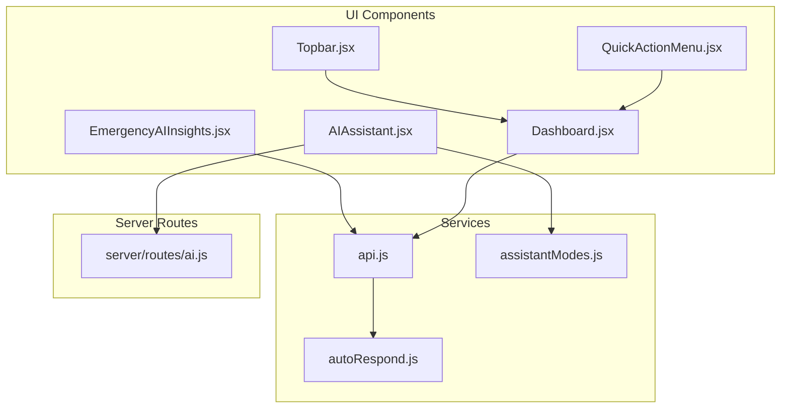
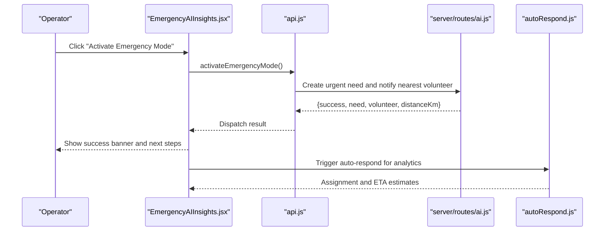
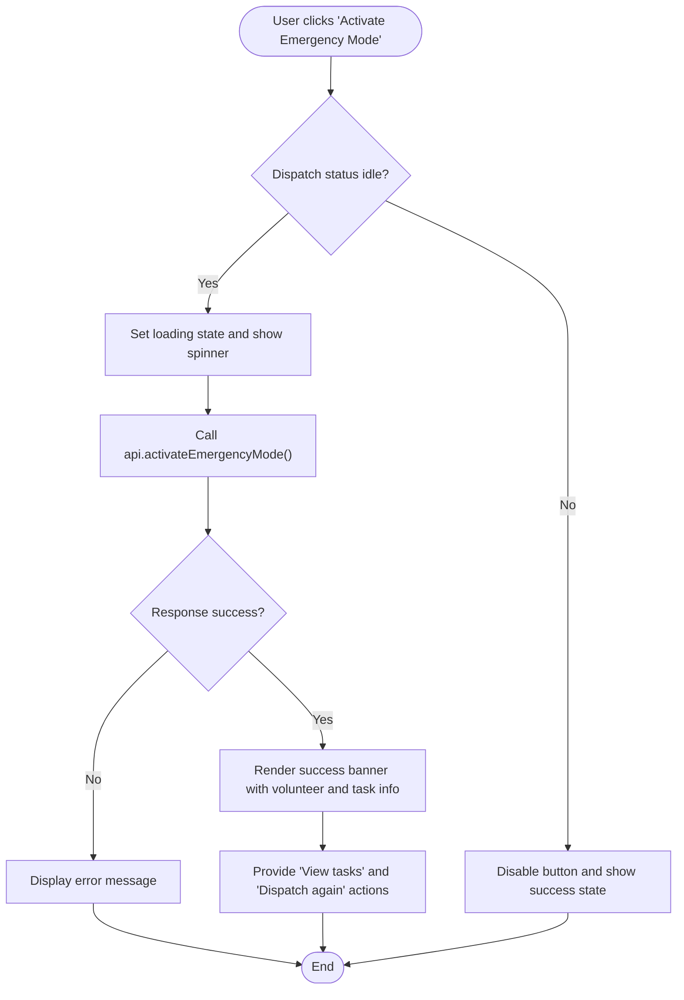
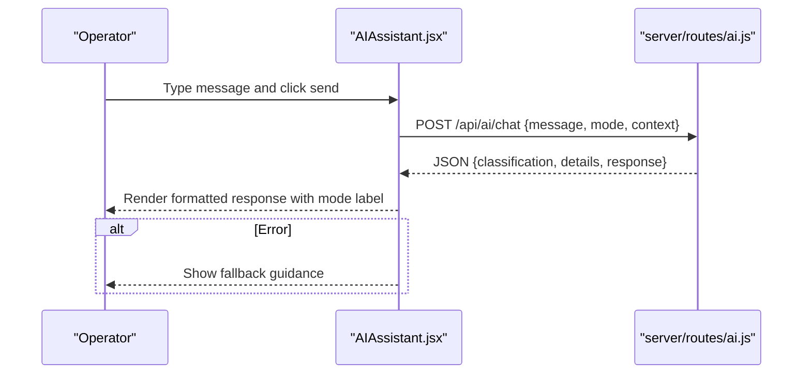
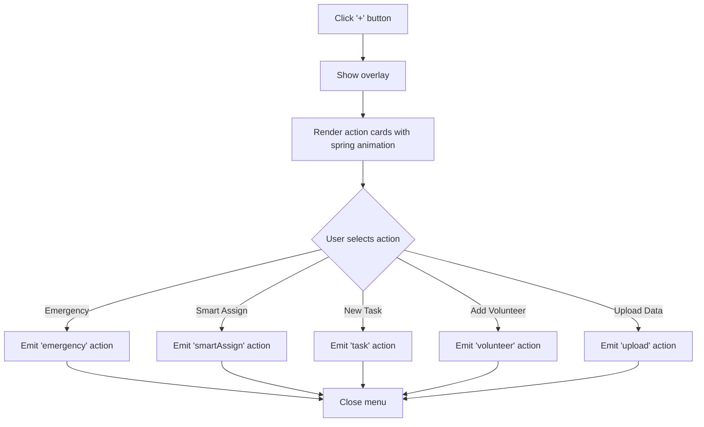
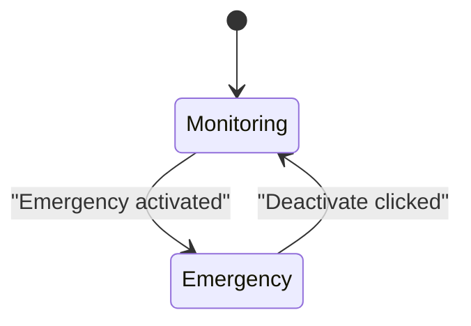
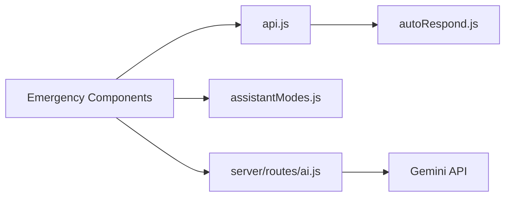

# Emergency User Interface and Controls

<cite>
**Referenced Files in This Document**
- [EmergencyAIInsights.jsx](file://src/components/EmergencyAIInsights.jsx)
- [QuickActionMenu.jsx](file://src/components/QuickActionMenu.jsx)
- [AIAssistant.jsx](file://src/components/AIAssistant.jsx)
- [assistantModes.js](file://src/services/assistantModes.js)
- [Dashboard.jsx](file://src/pages/Dashboard.jsx)
- [Topbar.jsx](file://src/components/ui/Topbar.jsx)
- [api.js](file://src/services/api.js)
- [ai.js](file://server/routes/ai.js)
- [autoRespond.js](file://src/engine/autoRespond.js)
- [incidentAI.js](file://src/services/incidentAI.js)
</cite>

## Table of Contents
1. [Introduction](#introduction)
2. [Project Structure](#project-structure)
3. [Core Components](#core-components)
4. [Architecture Overview](#architecture-overview)
5. [Detailed Component Analysis](#detailed-component-analysis)
6. [Dependency Analysis](#dependency-analysis)
7. [Performance Considerations](#performance-considerations)
8. [Troubleshooting Guide](#troubleshooting-guide)
9. [Conclusion](#conclusion)

## Introduction
This document details the emergency user interface components and control mechanisms designed for high-stress crisis situations. It covers the emergency mode activation interface, visual indicators, status displays, AI assistant integration, quick action menu, deactivation controls, visual design elements, notification systems, and navigation patterns optimized for emergency response workflows. The goal is to provide both technical and non-technical readers with a comprehensive understanding of how the system responds during crises and how operators can act quickly and confidently.

## Project Structure
The emergency-focused UI is composed of modular React components integrated with server-side AI services and local state management. Key areas include:
- Emergency activation and status panel
- AI-powered assistant with mode switching
- Quick-action menu for rapid operator actions
- Dashboard emergency banner and controls
- Topbar emergency toggle and notifications
- Backend AI routes for chat and analysis

**Diagram sources**
- [EmergencyAIInsights.jsx:1-600](file://src/components/EmergencyAIInsights.jsx#L1-L600)
- [QuickActionMenu.jsx:1-81](file://src/components/QuickActionMenu.jsx#L1-L81)
- [AIAssistant.jsx:1-311](file://src/components/AIAssistant.jsx#L1-L311)
- [assistantModes.js:1-36](file://src/services/assistantModes.js#L1-L36)
- [Dashboard.jsx:1-530](file://src/pages/Dashboard.jsx#L1-L530)
- [Topbar.jsx:1-33](file://src/components/ui/Topbar.jsx#L1-L33)
- [api.js:424-517](file://src/services/api.js#L424-L517)
- [ai.js:78-178](file://server/routes/ai.js#L78-L178)
- [autoRespond.js:146-202](file://src/engine/autoRespond.js#L146-L202)

**Section sources**
- [EmergencyAIInsights.jsx:1-600](file://src/components/EmergencyAIInsights.jsx#L1-L600)
- [QuickActionMenu.jsx:1-81](file://src/components/QuickActionMenu.jsx#L1-L81)
- [AIAssistant.jsx:1-311](file://src/components/AIAssistant.jsx#L1-L311)
- [assistantModes.js:1-36](file://src/services/assistantModes.js#L1-L36)
- [Dashboard.jsx:1-530](file://src/pages/Dashboard.jsx#L1-L530)
- [Topbar.jsx:1-33](file://src/components/ui/Topbar.jsx#L1-L33)
- [api.js:424-517](file://src/services/api.js#L424-L517)
- [ai.js:78-178](file://server/routes/ai.js#L78-L178)
- [autoRespond.js:146-202](file://src/engine/autoRespond.js#L146-L202)

## Core Components
- Emergency Activation Panel: Provides a prominent one-tap activation of emergency mode, immediate feedback, and next steps.
- AI Assistant: Real-time conversational AI with mode-aware guidance and live telemetry display.
- Quick Action Menu: Floating menu for rapid access to emergency mode, smart assignment, task creation, volunteer addition, and data upload.
- Dashboard Emergency Banner: Persistent emergency banner with status, critical map view, and deactivation control.
- Topbar Emergency Toggle: Immediate emergency mode switch with notifications and live status indicators.
- Server AI Routes: Secure chat and analysis endpoints that power the AI assistant and incident analysis.

**Section sources**
- [EmergencyAIInsights.jsx:67-87](file://src/components/EmergencyAIInsights.jsx#L67-L87)
- [AIAssistant.jsx:30-79](file://src/components/AIAssistant.jsx#L30-L79)
- [QuickActionMenu.jsx:10-16](file://src/components/QuickActionMenu.jsx#L10-L16)
- [Dashboard.jsx:213-290](file://src/pages/Dashboard.jsx#L213-L290)
- [Topbar.jsx:4-25](file://src/components/ui/Topbar.jsx#L4-L25)
- [ai.js:78-178](file://server/routes/ai.js#L78-L178)

## Architecture Overview
The emergency workflow integrates UI components with backend AI services and local state. Emergency activation triggers server-side logic to create an urgent need, select the nearest available volunteer, and update notifications. The AI assistant consumes live telemetry and context to provide mode-aware recommendations.

**Diagram sources**
- [EmergencyAIInsights.jsx:67-87](file://src/components/EmergencyAIInsights.jsx#L67-L87)
- [api.js:424-517](file://src/services/api.js#L424-L517)
- [ai.js:78-178](file://server/routes/ai.js#L78-L178)
- [autoRespond.js:146-202](file://src/engine/autoRespond.js#L146-L202)

## Detailed Component Analysis

### Emergency Activation Panel
- Purpose: Single-click activation of emergency mode with immediate visual feedback and actionable outcomes.
- Key Features:
  - Prominent activation button with loading and success states.
  - Copy-to-clipboard for emergency messaging.
  - Success banner with assigned volunteer, task location, and proximity.
  - Reset option to dispatch again.
  - Bullet list of emergency benefits (auto-prioritize, notify nearest, highlight zones).
- Visual Design:
  - Dark theme with orange/red accents for urgency.
  - Animated borders and glow effects on hover and success.
  - Motion animations for card reveals and typing indicators.

**Diagram sources**
- [EmergencyAIInsights.jsx:67-93](file://src/components/EmergencyAIInsights.jsx#L67-L93)

**Section sources**
- [EmergencyAIInsights.jsx:67-388](file://src/components/EmergencyAIInsights.jsx#L67-L388)

### AI Assistant Integration
- Purpose: Real-time conversational AI that understands context (emergency mode, risk score, snapshot) and provides mode-aware recommendations.
- Key Features:
  - Floating chat window with animated header and blur backdrop.
  - Live AI summary dashboard showing risk score and telemetry.
  - Mode selector: Responder, Coordinator, Citizen.
  - Typing indicators and suggestion prompts.
  - Fallback guidance when AI is unreachable.
- Server Integration:
  - POST /api/ai/chat with structured JSON payload and mode-aware instructions.
  - Strict JSON output enforced with classification, details, and response fields.

**Diagram sources**
- [AIAssistant.jsx:30-79](file://src/components/AIAssistant.jsx#L30-L79)
- [ai.js:78-178](file://server/routes/ai.js#L78-L178)

**Section sources**
- [AIAssistant.jsx:1-311](file://src/components/AIAssistant.jsx#L1-L311)
- [assistantModes.js:1-36](file://src/services/assistantModes.js#L1-L36)
- [ai.js:78-178](file://server/routes/ai.js#L78-L178)

### Quick Action Menu
- Purpose: Rapid access to emergency mode and common actions without navigating menus.
- Key Features:
  - Floating "+" button that toggles the menu.
  - Spring-loaded animations for action cards.
  - Color-coded action buttons with icons.
  - Overlay background to focus attention on actions.
- Actions:
  - Emergency Mode (red)
  - Smart Assign (amber)
  - New Task (blue)
  - Add Volunteer (green)
  - Upload Data (purple)

**Diagram sources**
- [QuickActionMenu.jsx:18-79](file://src/components/QuickActionMenu.jsx#L18-L79)

**Section sources**
- [QuickActionMenu.jsx:1-81](file://src/components/QuickActionMenu.jsx#L1-L81)

### Dashboard Emergency Banner
- Purpose: Persistent emergency banner with status, critical map view, and deactivation control.
- Key Features:
  - Animated pulsing ring and red gradient background.
  - Live status text indicating critical zones and notifications.
  - Buttons: View Critical Map and Deactivate Emergency.
  - Tag indicating Emergency vs Monitoring.

**Diagram sources**
- [Dashboard.jsx:213-290](file://src/pages/Dashboard.jsx#L213-L290)

**Section sources**
- [Dashboard.jsx:213-290](file://src/pages/Dashboard.jsx#L213-L290)

### Topbar Emergency Toggle
- Purpose: Immediate emergency mode switch with notifications and live status indicators.
- Key Features:
  - Emergency toggle button with variant styling when active.
  - Live indicator and optional realtime simulation badge.
  - Notification bell with unread count.

**Section sources**
- [Topbar.jsx:4-25](file://src/components/ui/Topbar.jsx#L4-L25)

### Server AI Services
- Chat Endpoint (/api/ai/chat):
  - Enforces strict JSON output with classification, details, and response.
  - Mode-aware instructions for responder, coordinator, or citizen.
  - Error handling with Gemini API failures.
- Document Parsing Proxy:
  - Secure proxy for document parsing to prevent exposing API keys client-side.
- Incident Analysis:
  - Route for analyzing incident reports with provider selection and context.

**Section sources**
- [ai.js:78-178](file://server/routes/ai.js#L78-L178)
- [incidentAI.js:1-24](file://src/services/incidentAI.js#L1-L24)

## Dependency Analysis
- UI depends on:
  - api.js for emergency activation and data operations.
  - assistantModes.js for mode-aware AI instructions.
  - server routes for chat and analysis.
- Server routes depend on:
  - Gemini API for LLM operations.
  - Validation middleware for request sanitization.
- Analytics engine:
  - autoRespond.js for automatic assignment and ETA estimation.

**Diagram sources**
- [EmergencyAIInsights.jsx:1-15](file://src/components/EmergencyAIInsights.jsx#L1-L15)
- [api.js:424-517](file://src/services/api.js#L424-L517)
- [assistantModes.js:1-36](file://src/services/assistantModes.js#L1-L36)
- [ai.js:1-348](file://server/routes/ai.js#L1-L348)
- [autoRespond.js:146-202](file://src/engine/autoRespond.js#L146-L202)

**Section sources**
- [EmergencyAIInsights.jsx:1-15](file://src/components/EmergencyAIInsights.jsx#L1-L15)
- [api.js:424-517](file://src/services/api.js#L424-L517)
- [assistantModes.js:1-36](file://src/services/assistantModes.js#L1-L36)
- [ai.js:1-348](file://server/routes/ai.js#L1-L348)
- [autoRespond.js:146-202](file://src/engine/autoRespond.js#L146-L202)

## Performance Considerations
- Minimize render work during emergency:
  - Use motion animations judiciously; disable where unnecessary.
  - Debounce frequent UI updates (e.g., live telemetry).
- Network resilience:
  - Implement retry logic for AI chat and emergency activation.
  - Provide fallback guidance when AI is unreachable.
- Data locality:
  - Cache recent emergency results to reduce repeated server calls.
- Accessibility:
  - Ensure keyboard navigation for floating menus and buttons.
  - Provide ARIA labels for animated status indicators.

## Troubleshooting Guide
- Emergency activation fails:
  - Verify server has GEMINI_API_KEY configured.
  - Check network connectivity and rate limits.
  - Review server logs for Gemini API errors.
- AI assistant shows fallback:
  - Confirm /api/ai/chat endpoint is reachable.
  - Validate request payload structure and mode values.
- Quick action menu not responding:
  - Inspect overlay click handler and animation state.
  - Ensure button event handlers are attached.
- Dashboard emergency banner not appearing:
  - Confirm emergency prop is passed from parent state.
  - Check conditional rendering logic for emergency state.

**Section sources**
- [ai.js:92-94](file://server/routes/ai.js#L92-L94)
- [AIAssistant.jsx:69-79](file://src/components/AIAssistant.jsx#L69-L79)
- [QuickActionMenu.jsx:21-29](file://src/components/QuickActionMenu.jsx#L21-L29)
- [Dashboard.jsx:213-218](file://src/pages/Dashboard.jsx#L213-L218)

## Conclusion
The emergency user interface integrates a robust activation panel, AI-driven assistant, quick-action menu, and persistent dashboard banner to streamline high-stakes response workflows. The system emphasizes clarity, speed, and resilience, with clear visual indicators, mode-aware AI guidance, and reliable backend services. Operators can confidently initiate emergency mode, receive real-time insights, and take rapid action—ensuring efficient and effective crisis response.