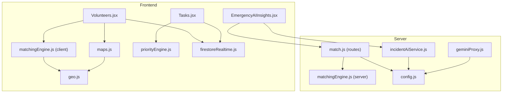
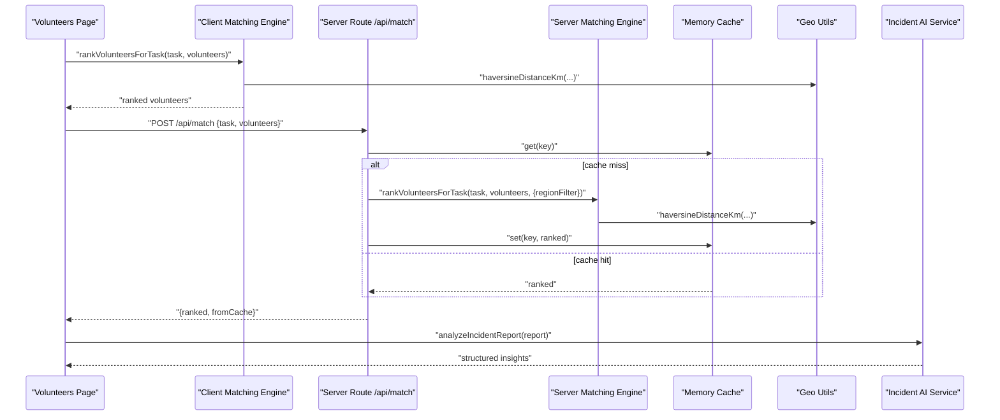
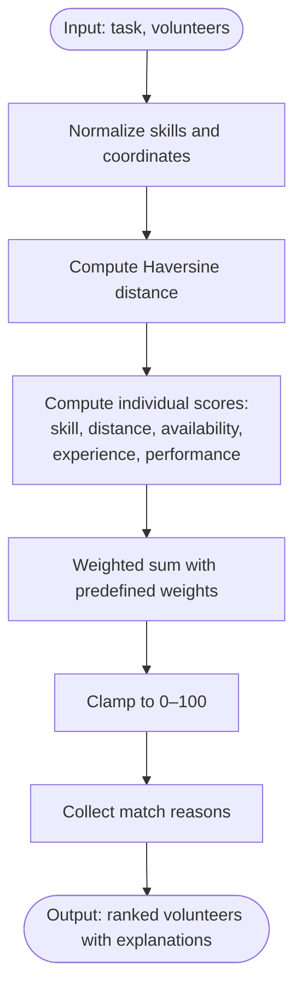
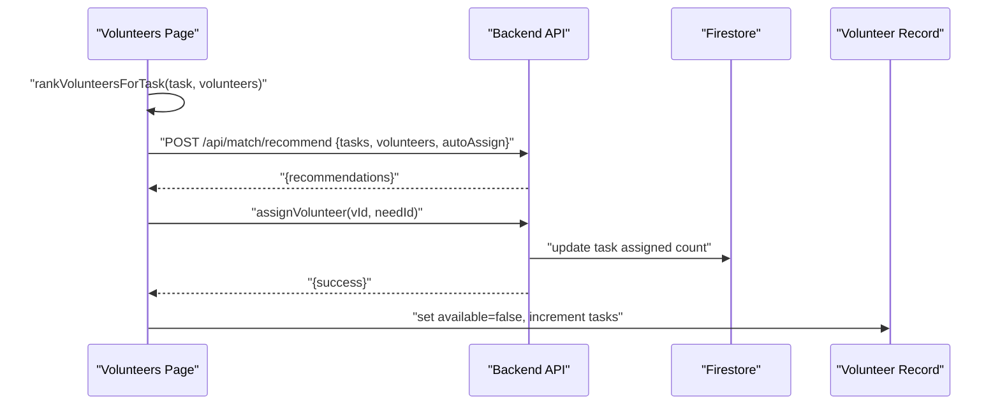
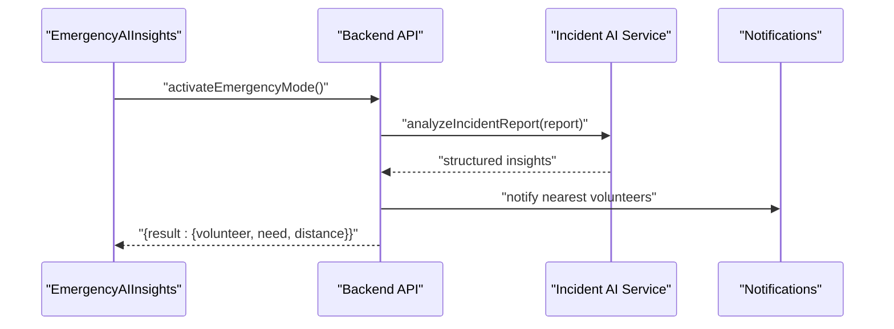
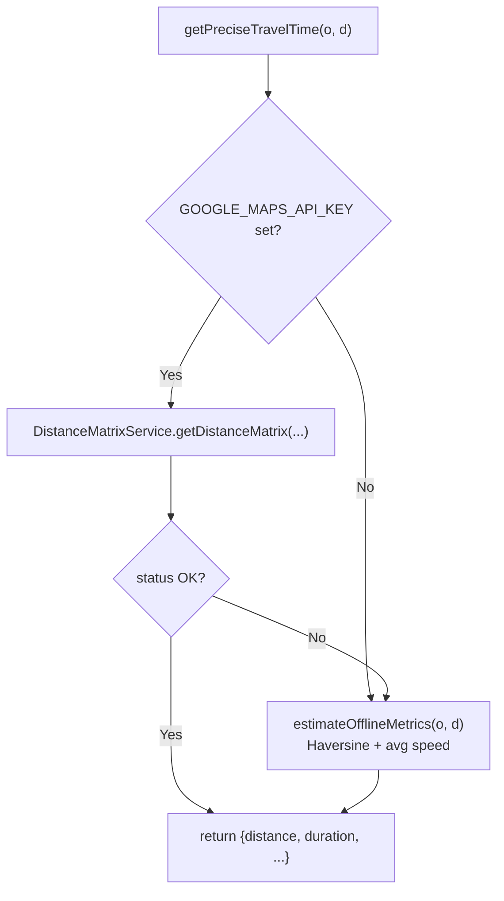
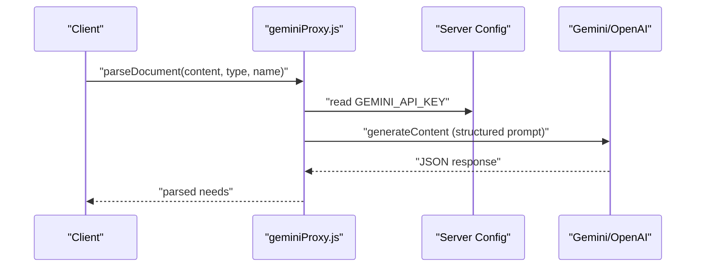
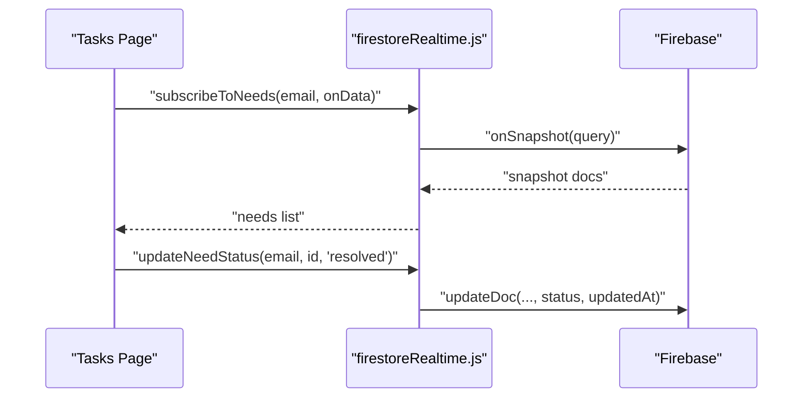
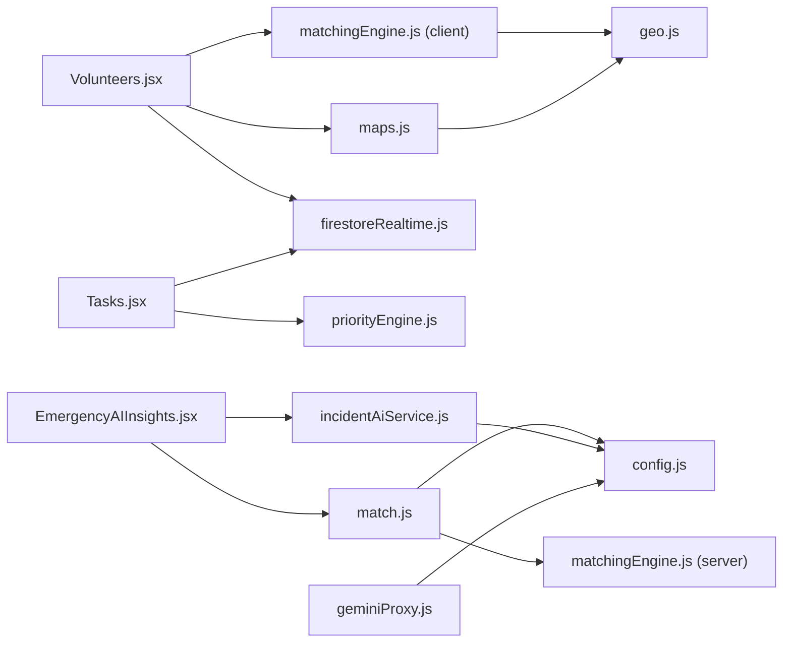

# Volunteer Deployment and Assignment

<cite>
**Referenced Files in This Document**
- [matchingEngine.js](file://src/engine/matchingEngine.js)
- [matchingEngine.js](file://server/services/matchingEngine.js)
- [match.js](file://server/routes/match.js)
- [geo.js](file://src/utils/geo.js)
- [maps.js](file://src/services/maps.js)
- [incidentAiService.js](file://server/incidentAiService.js)
- [incidentAI.js](file://src/services/incidentAI.js)
- [priorityEngine.js](file://src/engine/priorityEngine.js)
- [firestoreRealtime.js](file://src/services/firestoreRealtime.js)
- [Volunteers.jsx](file://src/pages/Volunteers.jsx)
- [Tasks.jsx](file://src/pages/Tasks.jsx)
- [EmergencyAIInsights.jsx](file://src/components/EmergencyAIInsights.jsx)
- [config.js](file://server/config.js)
- [geminiProxy.js](file://server/services/geminiProxy.js)
</cite>

## Table of Contents
1. [Introduction](#introduction)
2. [Project Structure](#project-structure)
3. [Core Components](#core-components)
4. [Architecture Overview](#architecture-overview)
5. [Detailed Component Analysis](#detailed-component-analysis)
6. [Dependency Analysis](#dependency-analysis)
7. [Performance Considerations](#performance-considerations)
8. [Troubleshooting Guide](#troubleshooting-guide)
9. [Conclusion](#conclusion)
10. [Appendices](#appendices)

## Introduction
This document describes the volunteer deployment and assignment system designed for emergency scenarios. It explains how the platform automatically matches volunteers to crisis tasks based on proximity, skills, availability, current workload, and performance history. It documents the real-time assignment workflow, the emergency deployment interface, volunteer status tracking, and coordination tools. It also covers integrations with location services, the matching engine’s scoring system, AI-powered deployment recommendations, manual assignment overrides, communication channels, and performance monitoring during emergency operations.

## Project Structure
The system comprises:
- Frontend React pages and components for task management, volunteer matching, and emergency insights
- Client-side and server-side matching engines with caching and region filtering
- Location utilities for proximity calculations and travel time estimation
- AI services for incident analysis and emergency recommendations
- Realtime Firestore integration for tasks and notifications
- Server configuration for AI providers, caching, and rate limits

**Diagram sources**
- [Volunteers.jsx:1-328](file://src/pages/Volunteers.jsx#L1-L328)
- [Tasks.jsx:1-367](file://src/pages/Tasks.jsx#L1-L367)
- [EmergencyAIInsights.jsx:1-600](file://src/components/EmergencyAIInsights.jsx#L1-L600)
- [matchingEngine.js:1-174](file://src/engine/matchingEngine.js#L1-L174)
- [geo.js:1-37](file://src/utils/geo.js#L1-L37)
- [maps.js:1-80](file://src/services/maps.js#L1-L80)
- [priorityEngine.js:1-72](file://src/engine/priorityEngine.js#L1-L72)
- [firestoreRealtime.js:1-212](file://src/services/firestoreRealtime.js#L1-L212)
- [match.js:1-120](file://server/routes/match.js#L1-L120)
- [matchingEngine.js:1-212](file://server/services/matchingEngine.js#L1-L212)
- [config.js:1-35](file://server/config.js#L1-L35)
- [incidentAiService.js:1-189](file://server/incidentAiService.js#L1-L189)
- [geminiProxy.js:1-104](file://server/services/geminiProxy.js#L1-L104)

**Section sources**
- [Volunteers.jsx:1-328](file://src/pages/Volunteers.jsx#L1-L328)
- [Tasks.jsx:1-367](file://src/pages/Tasks.jsx#L1-L367)
- [EmergencyAIInsights.jsx:1-600](file://src/components/EmergencyAIInsights.jsx#L1-L600)
- [matchingEngine.js:1-174](file://src/engine/matchingEngine.js#L1-L174)
- [geo.js:1-37](file://src/utils/geo.js#L1-L37)
- [maps.js:1-80](file://src/services/maps.js#L1-L80)
- [priorityEngine.js:1-72](file://src/engine/priorityEngine.js#L1-L72)
- [firestoreRealtime.js:1-212](file://src/services/firestoreRealtime.js#L1-L212)
- [match.js:1-120](file://server/routes/match.js#L1-L120)
- [matchingEngine.js:1-212](file://server/services/matchingEngine.js#L1-L212)
- [config.js:1-35](file://server/config.js#L1-L35)
- [incidentAiService.js:1-189](file://server/incidentAiService.js#L1-L189)
- [geminiProxy.js:1-104](file://server/services/geminiProxy.js#L1-L104)

## Core Components
- Automatic volunteer matching engine (client and server):
  - Consistent scoring across client and server
  - Proximity via Haversine distance
  - Skills normalization and matching
  - Availability, experience, and performance weights
  - Region-based pre-filtering and caching
- Real-time assignment workflow:
  - Manual assignment per volunteer
  - Auto-assignment by best available candidates
  - Status updates and progress tracking
- Emergency deployment interface:
  - One-click activation for urgent tasks
  - AI-driven recommendations and notifications
- Location services integration:
  - Haversine distance utilities
  - Travel time estimation with Google Maps fallback
- AI-powered deployment recommendations:
  - Incident analysis with structured outputs
  - Priority scoring for tasks
  - Document parsing proxy for survey data
- Volunteer status tracking and coordination:
  - Realtime Firestore subscriptions
  - Task registry with progress and status
  - Notification and unread counters

**Section sources**
- [matchingEngine.js:1-174](file://src/engine/matchingEngine.js#L1-L174)
- [matchingEngine.js:1-212](file://server/services/matchingEngine.js#L1-L212)
- [match.js:1-120](file://server/routes/match.js#L1-L120)
- [geo.js:1-37](file://src/utils/geo.js#L1-L37)
- [maps.js:1-80](file://src/services/maps.js#L1-L80)
- [incidentAiService.js:1-189](file://server/incidentAiService.js#L1-L189)
- [incidentAI.js:1-24](file://src/services/incidentAI.js#L1-L24)
- [priorityEngine.js:1-72](file://src/engine/priorityEngine.js#L1-L72)
- [firestoreRealtime.js:1-212](file://src/services/firestoreRealtime.js#L1-L212)
- [Volunteers.jsx:1-328](file://src/pages/Volunteers.jsx#L1-L328)
- [Tasks.jsx:1-367](file://src/pages/Tasks.jsx#L1-L367)
- [EmergencyAIInsights.jsx:1-600](file://src/components/EmergencyAIInsights.jsx#L1-L600)

## Architecture Overview
The system integrates frontend React pages with server APIs and AI services. The client-side matching engine mirrors server-side logic to maintain consistency. The server exposes endpoints for ranking and batch recommendations, with caching and region filters. Location utilities compute distances and estimate travel times. AI services analyze incident reports and provide structured insights. Realtime Firestore synchronizes tasks and notifications.

**Diagram sources**
- [Volunteers.jsx:1-328](file://src/pages/Volunteers.jsx#L1-L328)
- [matchingEngine.js:1-174](file://src/engine/matchingEngine.js#L1-L174)
- [match.js:1-120](file://server/routes/match.js#L1-L120)
- [matchingEngine.js:1-212](file://server/services/matchingEngine.js#L1-L212)
- [geo.js:1-37](file://src/utils/geo.js#L1-L37)
- [incidentAiService.js:1-189](file://server/incidentAiService.js#L1-L189)

## Detailed Component Analysis

### Automatic Volunteer Matching Engine
The matching engine computes a composite score for each volunteer given a task. It normalizes skills, calculates proximity using Haversine distance, and applies weights for skill fit, distance, availability, experience, and performance. The server-side engine adds region pre-filtering and caching for scalability.

**Diagram sources**
- [matchingEngine.js:88-141](file://src/engine/matchingEngine.js#L88-L141)
- [matchingEngine.js:110-157](file://server/services/matchingEngine.js#L110-L157)
- [geo.js:15-29](file://src/utils/geo.js#L15-L29)

**Section sources**
- [matchingEngine.js:1-174](file://src/engine/matchingEngine.js#L1-L174)
- [matchingEngine.js:1-212](file://server/services/matchingEngine.js#L1-L212)
- [geo.js:1-37](file://src/utils/geo.js#L1-L37)

### Real-Time Assignment Workflow
The assignment workflow supports both manual and automatic deployment:
- Manual assignment: select a volunteer and assign to the chosen task; updates availability and counts
- Auto-assignment: compute best available matches and deploy up to required capacity
- Progress tracking: updates assigned counts and displays success feedback

**Diagram sources**
- [Volunteers.jsx:159-200](file://src/pages/Volunteers.jsx#L159-L200)
- [match.js:79-106](file://server/routes/match.js#L79-L106)
- [firestoreRealtime.js:158-169](file://src/services/firestoreRealtime.js#L158-L169)

**Section sources**
- [Volunteers.jsx:1-328](file://src/pages/Volunteers.jsx#L1-L328)
- [match.js:1-120](file://server/routes/match.js#L1-L120)
- [firestoreRealtime.js:1-212](file://src/services/firestoreRealtime.js#L1-L212)

### Emergency Deployment Interface
The emergency interface provides a one-click activation that triggers AI-powered recommendations and notifications. It highlights critical actions and summarizes outcomes.

**Diagram sources**
- [EmergencyAIInsights.jsx:67-87](file://src/components/EmergencyAIInsights.jsx#L67-L87)
- [incidentAiService.js:170-189](file://server/incidentAiService.js#L170-L189)
- [incidentAI.js:1-24](file://src/services/incidentAI.js#L1-L24)

**Section sources**
- [EmergencyAIInsights.jsx:1-600](file://src/components/EmergencyAIInsights.jsx#L1-L600)
- [incidentAiService.js:1-189](file://server/incidentAiService.js#L1-L189)
- [incidentAI.js:1-24](file://src/services/incidentAI.js#L1-L24)

### Location Services Integration
Proximity calculations use Haversine distance. When Google Maps API is unavailable, the system estimates travel metrics using straight-line distance and average speeds.

**Diagram sources**
- [maps.js:37-79](file://src/services/maps.js#L37-L79)
- [geo.js:15-36](file://src/utils/geo.js#L15-L36)

**Section sources**
- [maps.js:1-80](file://src/services/maps.js#L1-L80)
- [geo.js:1-37](file://src/utils/geo.js#L1-L37)

### AI-Powered Deployment Recommendations
The system analyzes incident reports to extract structured insights and supports document parsing via a secure server proxy. It also ranks tasks by priority using a weighted formula.

**Diagram sources**
- [geminiProxy.js:53-103](file://server/services/geminiProxy.js#L53-L103)
- [config.js:11-16](file://server/config.js#L11-L16)

**Section sources**
- [geminiProxy.js:1-104](file://server/services/geminiProxy.js#L1-L104)
- [config.js:1-35](file://server/config.js#L1-L35)
- [incidentAiService.js:1-189](file://server/incidentAiService.js#L1-L189)
- [incidentAI.js:1-24](file://src/services/incidentAI.js#L1-L24)
- [priorityEngine.js:1-72](file://src/engine/priorityEngine.js#L1-L72)

### Volunteer Status Tracking and Coordination Tools
Realtime Firestore subscriptions keep tasks and notifications synchronized. The task registry displays progress, priority, and status, enabling coordinated operations.

**Diagram sources**
- [Tasks.jsx:18-34](file://src/pages/Tasks.jsx#L18-L34)
- [firestoreRealtime.js:61-73](file://src/services/firestoreRealtime.js#L61-L73)
- [firestoreRealtime.js:158-169](file://src/services/firestoreRealtime.js#L158-L169)

**Section sources**
- [Tasks.jsx:1-367](file://src/pages/Tasks.jsx#L1-L367)
- [firestoreRealtime.js:1-212](file://src/services/firestoreRealtime.js#L1-L212)

## Dependency Analysis
The system exhibits layered dependencies:
- Client pages depend on matching engines, location utilities, and Firestore services
- Server routes depend on the matching engine and configuration
- AI services depend on environment-configured provider keys
- Realtime services depend on Firebase SDK

**Diagram sources**
- [Volunteers.jsx:1-328](file://src/pages/Volunteers.jsx#L1-L328)
- [Tasks.jsx:1-367](file://src/pages/Tasks.jsx#L1-L367)
- [EmergencyAIInsights.jsx:1-600](file://src/components/EmergencyAIInsights.jsx#L1-L600)
- [matchingEngine.js:1-174](file://src/engine/matchingEngine.js#L1-L174)
- [matchingEngine.js:1-212](file://server/services/matchingEngine.js#L1-L212)
- [match.js:1-120](file://server/routes/match.js#L1-L120)
- [geo.js:1-37](file://src/utils/geo.js#L1-L37)
- [maps.js:1-80](file://src/services/maps.js#L1-L80)
- [incidentAiService.js:1-189](file://server/incidentAiService.js#L1-L189)
- [config.js:1-35](file://server/config.js#L1-L35)
- [geminiProxy.js:1-104](file://server/services/geminiProxy.js#L1-L104)
- [firestoreRealtime.js:1-212](file://src/services/firestoreRealtime.js#L1-L212)

**Section sources**
- [Volunteers.jsx:1-328](file://src/pages/Volunteers.jsx#L1-L328)
- [Tasks.jsx:1-367](file://src/pages/Tasks.jsx#L1-L367)
- [EmergencyAIInsights.jsx:1-600](file://src/components/EmergencyAIInsights.jsx#L1-L600)
- [matchingEngine.js:1-174](file://src/engine/matchingEngine.js#L1-L174)
- [matchingEngine.js:1-212](file://server/services/matchingEngine.js#L1-L212)
- [match.js:1-120](file://server/routes/match.js#L1-L120)
- [geo.js:1-37](file://src/utils/geo.js#L1-L37)
- [maps.js:1-80](file://src/services/maps.js#L1-L80)
- [incidentAiService.js:1-189](file://server/incidentAiService.js#L1-L189)
- [config.js:1-35](file://server/config.js#L1-L35)
- [geminiProxy.js:1-104](file://server/services/geminiProxy.js#L1-L104)
- [firestoreRealtime.js:1-212](file://src/services/firestoreRealtime.js#L1-L212)

## Performance Considerations
- Caching:
  - Server-side memory cache for matching results keyed by task and volunteer IDs
  - TTL and max size configurable via environment variables
- Region pre-filtering:
  - Reduces computation by limiting candidate pools to the same region as the task
- Client-side offline fallback:
  - Haversine-based travel time estimation when Google Maps API is unavailable
- Realtime synchronization:
  - Efficient listeners for tasks and notifications minimize redundant polling
- Recommendation batching:
  - Batch recommendations endpoint reduces repeated computations

**Section sources**
- [match.js:11-21](file://server/routes/match.js#L11-L21)
- [match.js:108-117](file://server/routes/match.js#L108-L117)
- [config.js:29-32](file://server/config.js#L29-L32)
- [matchingEngine.js:166-177](file://server/services/matchingEngine.js#L166-L177)
- [maps.js:41-79](file://src/services/maps.js#L41-L79)
- [firestoreRealtime.js:61-73](file://src/services/firestoreRealtime.js#L61-L73)

## Troubleshooting Guide
- Matching endpoint errors:
  - Validate input schema and ensure task and volunteers arrays are provided
  - Check cache stats and retry after clearing cache if stale results persist
- AI analysis failures:
  - Verify API keys are configured; the system falls back to heuristic analysis if provider calls fail
- Location services:
  - Confirm coordinates are valid and within acceptable ranges
  - When Google Maps API key is missing, expect offline estimations with reduced accuracy
- Realtime sync:
  - Ensure NGO email is present and Firestore permissions are configured
  - Inspect snapshot listeners for errors and re-subscribe if needed

**Section sources**
- [match.js:28-31](file://server/routes/match.js#L28-L31)
- [match.js:69-76](file://server/routes/match.js#L69-L76)
- [incidentAiService.js:170-189](file://server/incidentAiService.js#L170-L189)
- [config.js:11-16](file://server/config.js#L11-L16)
- [geo.js:7-13](file://src/utils/geo.js#L7-L13)
- [maps.js:41-46](file://src/services/maps.js#L41-L46)
- [firestoreRealtime.js:61-73](file://src/services/firestoreRealtime.js#L61-L73)

## Conclusion
The volunteer deployment and assignment system combines a robust matching engine, real-time coordination, and AI-powered insights to streamline emergency operations. By leveraging proximity calculations, skill normalization, availability checks, and performance metrics, it enables efficient and informed deployments. The emergency interface accelerates response times, while caching, offline fallbacks, and realtime synchronization ensure resilience and reliability under pressure.

## Appendices
- API endpoints:
  - POST /api/match: Rank volunteers for a single task
  - POST /api/match/recommend: Batch recommendations for multiple tasks
  - GET /api/match/cache-stats: Monitor cache performance
- Environment variables:
  - AI provider keys and models
  - JWT secret and expiration
  - Rate limits and CORS origin
  - Cache TTL and max size

**Section sources**
- [match.js:23-77](file://server/routes/match.js#L23-L77)
- [match.js:82-106](file://server/routes/match.js#L82-L106)
- [match.js:111-117](file://server/routes/match.js#L111-L117)
- [config.js:8-32](file://server/config.js#L8-L32)