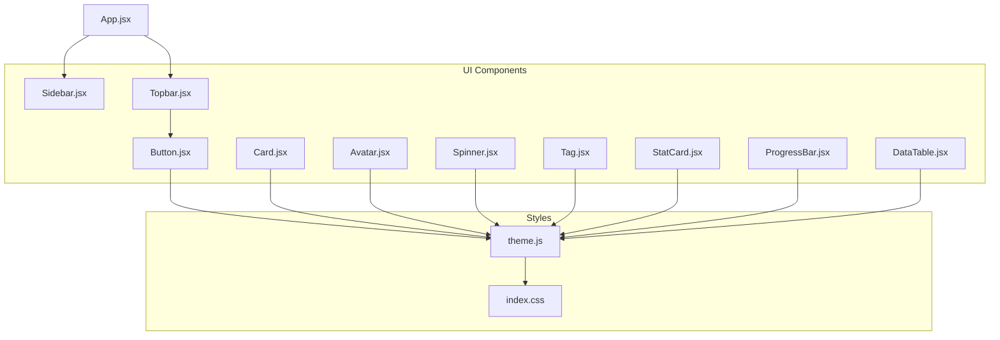
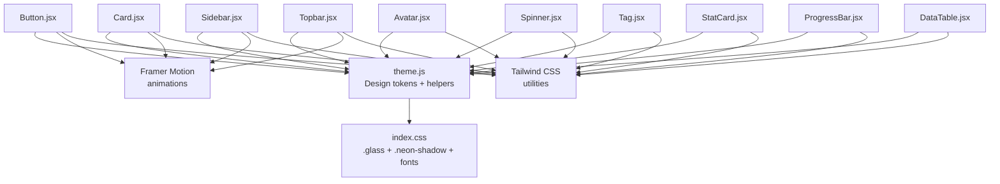
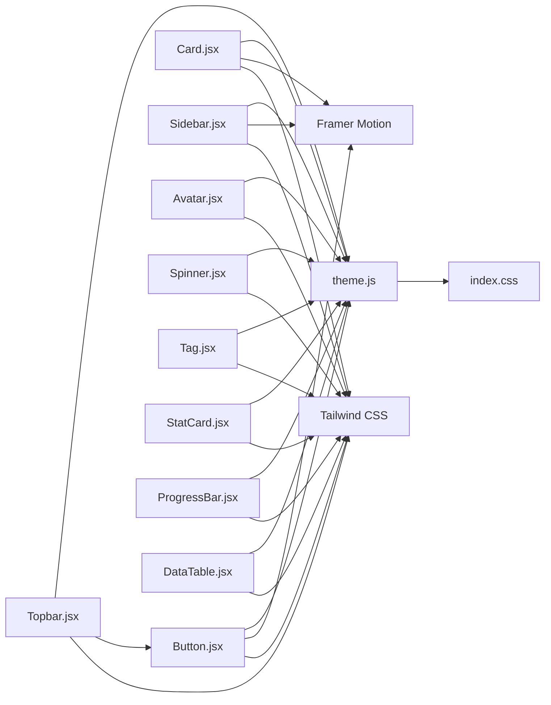

# Component Library

<cite>
**Referenced Files in This Document**
- [Button.jsx](file://src/components/ui/Button.jsx)
- [Card.jsx](file://src/components/ui/Card.jsx)
- [Sidebar.jsx](file://src/components/ui/Sidebar.jsx)
- [Topbar.jsx](file://src/components/ui/Topbar.jsx)
- [Avatar.jsx](file://src/components/Avatar.jsx)
- [Spinner.jsx](file://src/components/Spinner.jsx)
- [Tag.jsx](file://src/components/Tag.jsx)
- [StatCard.jsx](file://src/components/StatCard.jsx)
- [ProgressBar.jsx](file://src/components/ProgressBar.jsx)
- [DataTable.jsx](file://src/components/DataTable.jsx)
- [theme.js](file://src/styles/theme.js)
- [index.css](file://src/index.css)
- [App.jsx](file://src/App.jsx)
- [package.json](file://package.json)
</cite>

## Table of Contents
1. [Introduction](#introduction)
2. [Project Structure](#project-structure)
3. [Core Components](#core-components)
4. [Architecture Overview](#architecture-overview)
5. [Detailed Component Analysis](#detailed-component-analysis)
6. [Dependency Analysis](#dependency-analysis)
7. [Performance Considerations](#performance-considerations)
8. [Troubleshooting Guide](#troubleshooting-guide)
9. [Conclusion](#conclusion)

## Introduction
This document describes the reusable UI component library used across the application. It focuses on component purpose, props interface, styling approach, and usage patterns. It also explains the component hierarchy, shared styling system, responsive design implementation, theming integration, and component lifecycle management. Specific components covered include Button variants, Card layout patterns, Avatar display, and Spinner loading states, along with supporting components like Tag, StatCard, ProgressBar, and DataTable.

## Project Structure
The UI components are primarily located under src/components and src/components/ui. Shared design tokens and helpers are centralized in src/styles/theme.js. Global styles and Tailwind utilities are configured in src/index.css. The main application orchestrates navigation and integrates UI components.

**Diagram sources**
- [App.jsx](file://src/App.jsx)
- [Button.jsx](file://src/components/ui/Button.jsx)
- [Card.jsx](file://src/components/ui/Card.jsx)
- [Sidebar.jsx](file://src/components/ui/Sidebar.jsx)
- [Topbar.jsx](file://src/components/ui/Topbar.jsx)
- [Avatar.jsx](file://src/components/Avatar.jsx)
- [Spinner.jsx](file://src/components/Spinner.jsx)
- [Tag.jsx](file://src/components/Tag.jsx)
- [StatCard.jsx](file://src/components/StatCard.jsx)
- [ProgressBar.jsx](file://src/components/ProgressBar.jsx)
- [DataTable.jsx](file://src/components/DataTable.jsx)
- [theme.js](file://src/styles/theme.js)
- [index.css](file://src/index.css)

**Section sources**
- [App.jsx](file://src/App.jsx)
- [theme.js](file://src/styles/theme.js)
- [index.css](file://src/index.css)

## Core Components
This section documents the core reusable UI components and their roles.

- Button: A styled interactive button with motion effects and gradient backgrounds. Variants include primary, danger, and ghost.
- Card: A glass-like container with subtle elevation and hover animations.
- Avatar: A compact initials-based user avatar with configurable size and color.
- Spinner: A rotating loader using theme colors and a small inline animation.
- Supporting components: Tag, StatCard, ProgressBar, and DataTable provide specialized UI patterns.

**Section sources**
- [Button.jsx](file://src/components/ui/Button.jsx)
- [Card.jsx](file://src/components/ui/Card.jsx)
- [Avatar.jsx](file://src/components/Avatar.jsx)
- [Spinner.jsx](file://src/components/Spinner.jsx)
- [Tag.jsx](file://src/components/Tag.jsx)
- [StatCard.jsx](file://src/components/StatCard.jsx)
- [ProgressBar.jsx](file://src/components/ProgressBar.jsx)
- [DataTable.jsx](file://src/components/DataTable.jsx)

## Architecture Overview
The UI library follows a shared-styling architecture:
- Design tokens and helpers are exported from theme.js and consumed by components via direct property access and helper functions.
- Global styles define glass and neon-shadow utilities, enabling consistent visual effects across components.
- Motion is integrated via Framer Motion for interactive feedback.
- Tailwind utilities are imported and used alongside custom CSS for rapid prototyping and consistent spacing.

**Diagram sources**
- [theme.js](file://src/styles/theme.js)
- [index.css](file://src/index.css)
- [Button.jsx](file://src/components/ui/Button.jsx)
- [Card.jsx](file://src/components/ui/Card.jsx)
- [Sidebar.jsx](file://src/components/ui/Sidebar.jsx)
- [Topbar.jsx](file://src/components/ui/Topbar.jsx)
- [Avatar.jsx](file://src/components/Avatar.jsx)
- [Spinner.jsx](file://src/components/Spinner.jsx)
- [Tag.jsx](file://src/components/Tag.jsx)
- [StatCard.jsx](file://src/components/StatCard.jsx)
- [ProgressBar.jsx](file://src/components/ProgressBar.jsx)
- [DataTable.jsx](file://src/components/DataTable.jsx)

## Detailed Component Analysis

### Button
Purpose
- Provides a unified button with motion feedback and gradient styling. Supports primary, danger, and ghost variants.

Props interface
- children: React.ReactNode
- variant: "primary" | "danger" | "ghost"
- className: string (optional)
- Additional button attributes are forwarded via spread props.

Styling approach
- Gradient backgrounds and text colors are mapped per variant.
- Hover and tap animations are implemented with Framer Motion.
- Pseudo-element highlights enhance interactivity.

Usage patterns
- Compose with Topbar to toggle emergency mode.
- Use className to add spacing or alignment.

Accessibility
- Inherits native button semantics; ensure meaningful labels for screen readers.

Customization
- Extend variants by adding entries to the variants mapping.
- Adjust motion parameters for hover/tap feedback.

Lifecycle
- No internal state; relies on parent to manage click handlers.

**Section sources**
- [Button.jsx](file://src/components/ui/Button.jsx)
- [Topbar.jsx](file://src/components/ui/Topbar.jsx)

### Card
Purpose
- A glass-like container with soft shadows and subtle 3D hover effects for content grouping.

Props interface
- children: React.ReactNode
- className: string (optional)

Styling approach
- Uses glass and neon-shadow utilities.
- Framer Motion adds lift and rotation on hover with spring transitions.

Usage patterns
- Wrap content sections, dashboards, and stat cards.

Accessibility
- Ensure sufficient contrast against glass backgrounds; consider nested focusable elements.

Customization
- Modify rounded corners and padding via className.

Lifecycle
- Stateless; renders children inside animated wrapper.

**Section sources**
- [Card.jsx](file://src/components/ui/Card.jsx)
- [index.css](file://src/index.css)

### Avatar
Purpose
- Displays a user’s initials in a colored circle with consistent sizing.

Props interface
- initials: string
- color: string
- size: number (default 36)

Styling approach
- Inline styles define size, border radius, background, and typography.
- Flex centering ensures centered text.

Usage patterns
- Use in Topbar and user lists.

Accessibility
- Provide alt text or aria-labels when used outside of decorative contexts.

Customization
- Control size and color via props.

Lifecycle
- Stateless.

**Section sources**
- [Avatar.jsx](file://src/components/Avatar.jsx)

### Spinner
Purpose
- A minimal loader indicating asynchronous operations.

Props interface
- None

Styling approach
- Inline styles define border, color, radius, and animation.
- Theme colors are applied for border and animated top portion.

Usage patterns
- Render during data fetches and transitions.

Accessibility
- Include an aria-live region or label for assistive technologies.

Customization
- Adjust size and animation speed via inline styles.

Lifecycle
- Stateless.

**Section sources**
- [Spinner.jsx](file://src/components/Spinner.jsx)
- [theme.js](file://src/styles/theme.js)

### Tag
Purpose
- Lightweight status or category indicator with contextual colors.

Props interface
- type: "urgent" | "medium" | "low" | "active" | "resolved" | "processing" | "done" | "open"
- children: React.ReactNode

Styling approach
- Uses theme colors and helper css.tag to compute styles.

Usage patterns
- Display status badges in lists and tables.

Accessibility
- Ensure color is not the sole indicator; pair with text labels.

Customization
- Extend mapping for new types.

Lifecycle
- Stateless.

**Section sources**
- [Tag.jsx](file://src/components/Tag.jsx)
- [theme.js](file://src/styles/theme.js)

### StatCard
Purpose
- A visually rich metric card with accent line, background blobs, icon, label, value, and delta trend.

Props interface
- label: string
- value: string | number
- delta: string (optional)
- deltaColor: string (optional)
- accent: string
- icon: React.ReactNode

Styling approach
- Uses css.card and theme colors for gradients and borders.
- Decorative blobs and accent line provide depth.

Usage patterns
- Display KPIs and trends in dashboards.

Accessibility
- Ensure readable contrast and semantic structure.

Customization
- Adjust accent color and icon.

Lifecycle
- Stateless.

**Section sources**
- [StatCard.jsx](file://src/components/StatCard.jsx)
- [theme.js](file://src/styles/theme.js)

### ProgressBar
Purpose
- Visual progress indicator with label and numeric display.

Props interface
- label: string
- value: number
- max: number (default 100)
- color: string (default theme blue)

Styling approach
- Computes percentage and animates width change.
- Uses theme border and background for track.

Usage patterns
- Show completion percentages and progress.

Accessibility
- Provide numeric context via label and value.

Customization
- Change color via prop.

Lifecycle
- Stateless.

**Section sources**
- [ProgressBar.jsx](file://src/components/ProgressBar.jsx)
- [theme.js](file://src/styles/theme.js)

### DataTable
Purpose
- Interactive table with search, sorting, and row click support.

Props interface
- columns: Array of column descriptors with key, label, sortable, and optional render
- data: Array of row objects
- onRowClick: Function invoked with selected row
- searchPlaceholder: string (default "Search...")

Styling approach
- Uses theme border and background for table and inputs.
- Animated row transitions and hover effects.

Usage patterns
- Display tabular data with filtering and sorting.

Accessibility
- Ensure keyboard navigability and proper ARIA roles for sort controls.

Customization
- Customize column rendering via render callbacks.

Lifecycle
- Manages local state for search and sort configuration.

**Section sources**
- [DataTable.jsx](file://src/components/DataTable.jsx)
- [theme.js](file://src/styles/theme.js)

### Sidebar
Purpose
- Navigation sidebar with animated items and emergency highlighting.

Props interface
- active: string (current page id)
- onChange: Function invoked with clicked page id
- emergency: boolean (emergency mode flag)

Styling approach
- Glass background and blur effect.
- Motion-driven hover and selection states.

Usage patterns
- Integrate with App routing to switch views.

Accessibility
- Ensure keyboard focus and visible focus indicators.

Customization
- Extend navItems to add new pages.

Lifecycle
- Stateless; delegates navigation to parent.

**Section sources**
- [Sidebar.jsx](file://src/components/ui/Sidebar.jsx)
- [App.jsx](file://src/App.jsx)

### Topbar
Purpose
- Header bar with search, notifications, emergency toggle, and user actions.

Props interface
- emergency: boolean
- setEmergency: Function

Styling approach
- Glass header with rounded corners.
- Uses Button variant toggling based on emergency state.

Usage patterns
- Place at top of main content area.

Accessibility
- Ensure focus order and accessible labels.

Customization
- Add more actions or modify layout.

Lifecycle
- Stateless; manages emergency state via setter.

**Section sources**
- [Topbar.jsx](file://src/components/ui/Topbar.jsx)
- [Button.jsx](file://src/components/ui/Button.jsx)

## Dependency Analysis
The component library exhibits a clean dependency graph:
- Components depend on theme.js for design tokens and helpers.
- Global styles (index.css) provide shared utilities (.glass, .neon-shadow).
- Motion is used selectively for interactive feedback.
- Tailwind utilities are mixed with inline styles for rapid development.

**Diagram sources**
- [theme.js](file://src/styles/theme.js)
- [index.css](file://src/index.css)
- [Button.jsx](file://src/components/ui/Button.jsx)
- [Card.jsx](file://src/components/ui/Card.jsx)
- [Sidebar.jsx](file://src/components/ui/Sidebar.jsx)
- [Topbar.jsx](file://src/components/ui/Topbar.jsx)
- [Avatar.jsx](file://src/components/Avatar.jsx)
- [Spinner.jsx](file://src/components/Spinner.jsx)
- [Tag.jsx](file://src/components/Tag.jsx)
- [StatCard.jsx](file://src/components/StatCard.jsx)
- [ProgressBar.jsx](file://src/components/ProgressBar.jsx)
- [DataTable.jsx](file://src/components/DataTable.jsx)

**Section sources**
- [theme.js](file://src/styles/theme.js)
- [index.css](file://src/index.css)
- [package.json](file://package.json)

## Performance Considerations
- Prefer memoization for expensive computations in parent components (e.g., App uses useMemo for intelligence snapshots).
- Keep inline styles minimal; leverage Tailwind utilities for scalable, cache-friendly CSS.
- Use motion sparingly; disable animations on devices with reduced motion preferences.
- Virtualize large lists in DataTable to reduce DOM nodes.
- Defer heavy operations during transitions; use exit animations conservatively.

## Troubleshooting Guide
Common issues and resolutions:
- Motion conflicts: Ensure Framer Motion is installed and compatible with the current React version.
- Tailwind utilities missing: Verify Tailwind is imported and configured in index.css.
- Theme colors not applied: Confirm theme.js exports are used consistently across components.
- Accessibility regressions: Test keyboard navigation and screen reader announcements after adding new interactive elements.
- Responsive layout glitches: Use Tailwind breakpoints and avoid hardcoded widths; validate on multiple screen sizes.

**Section sources**
- [package.json](file://package.json)
- [index.css](file://src/index.css)
- [theme.js](file://src/styles/theme.js)

## Conclusion
The component library emphasizes a cohesive design system built on shared tokens, motion, and Tailwind utilities. Components are intentionally lightweight and composable, enabling rapid iteration while maintaining visual consistency. By adhering to the documented patterns and accessibility guidelines, teams can extend the library reliably and efficiently.