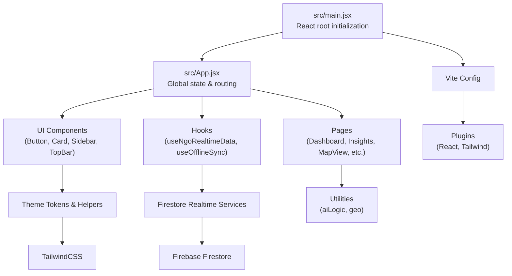
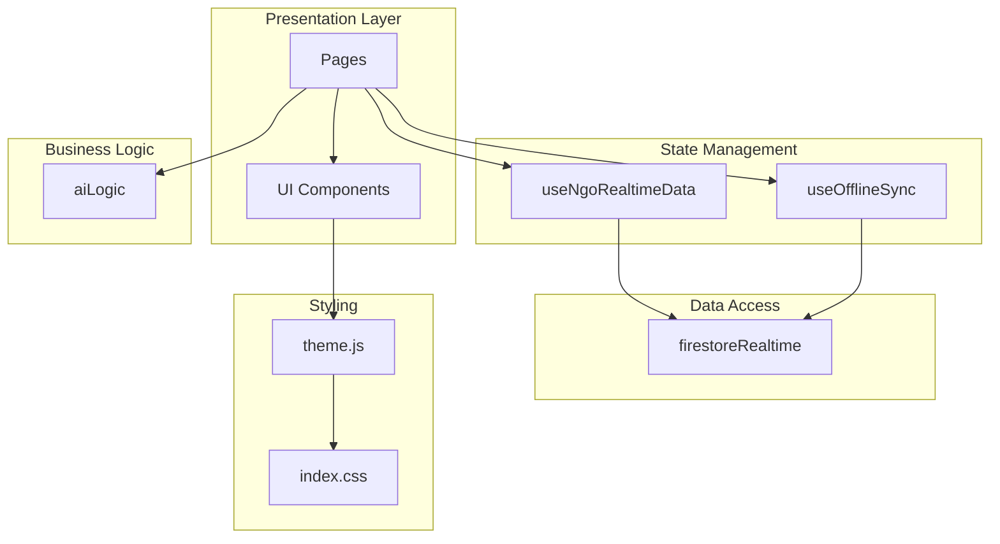
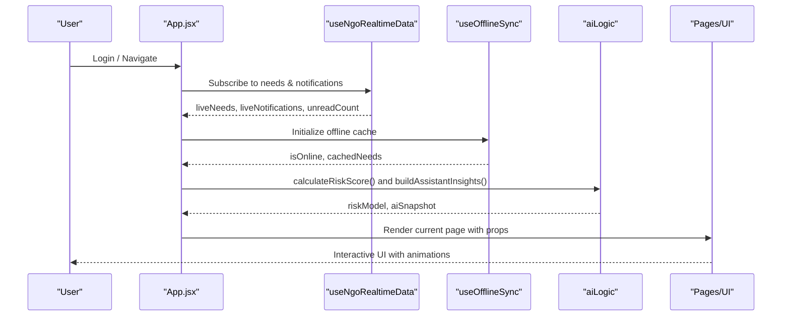
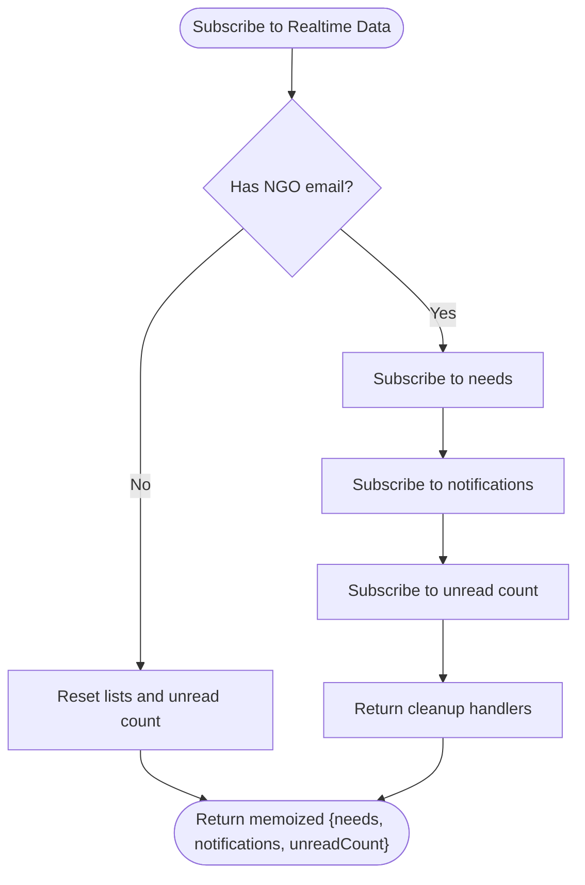
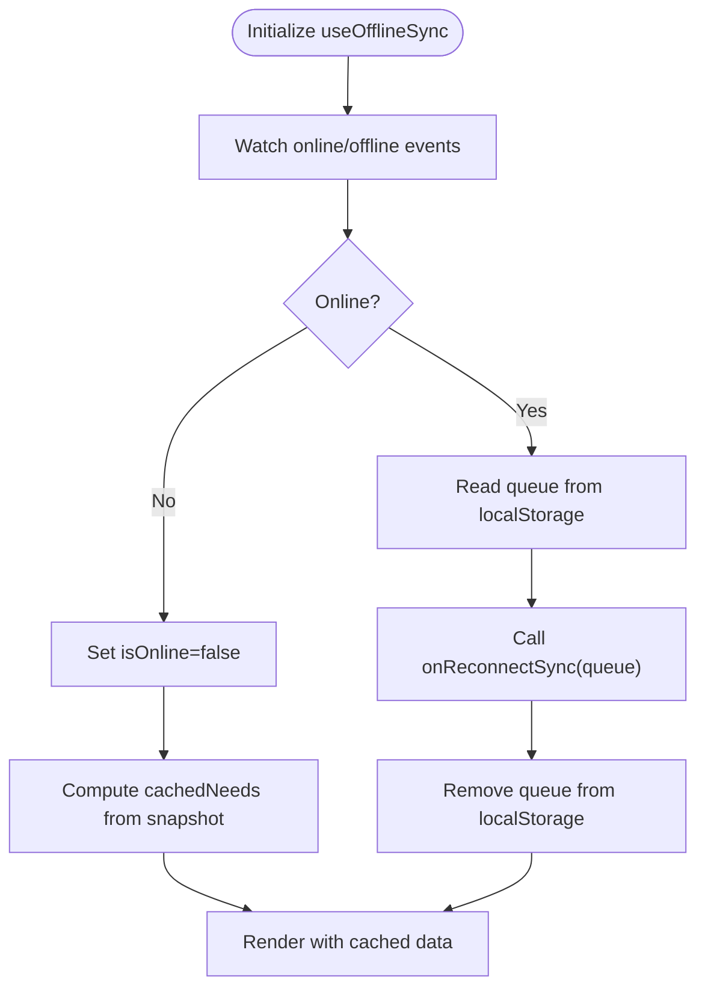
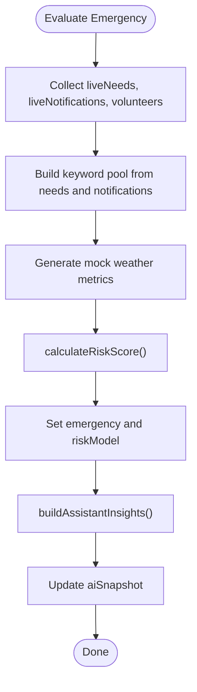
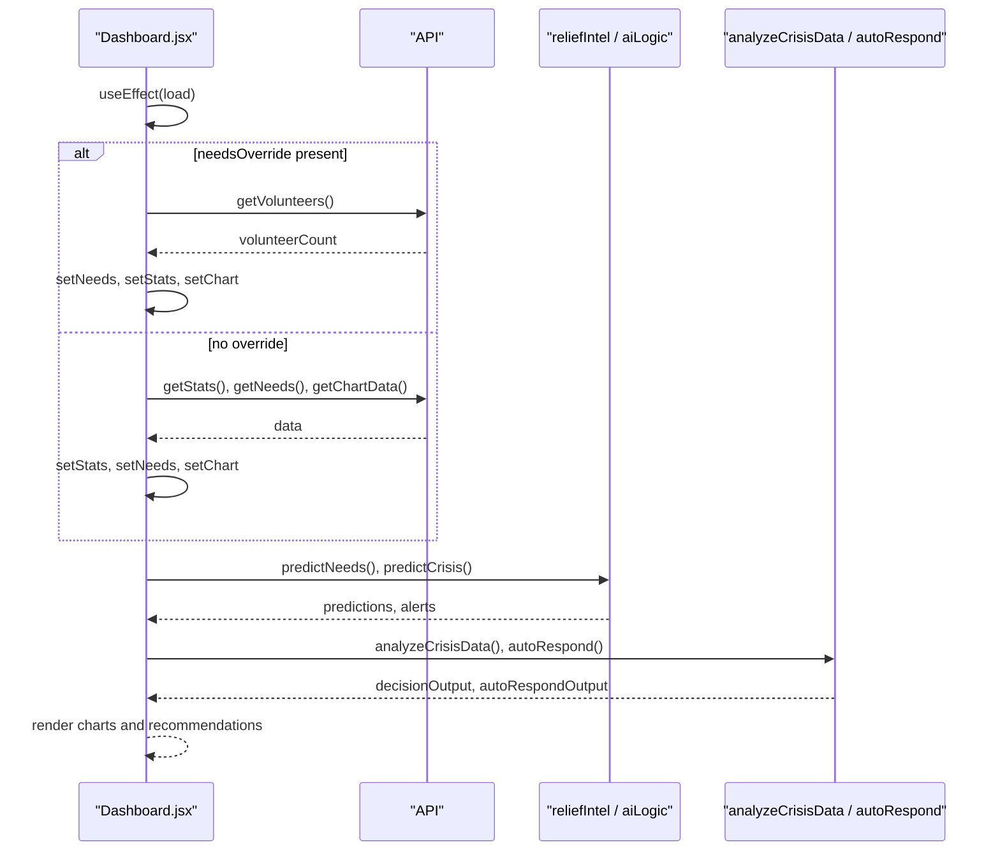
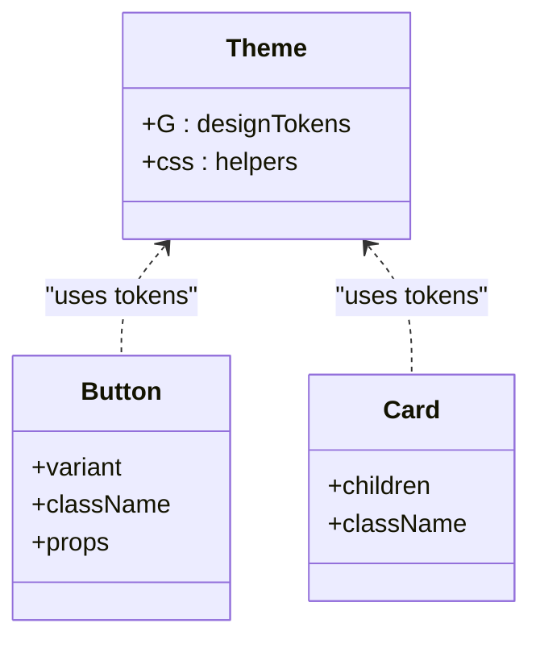
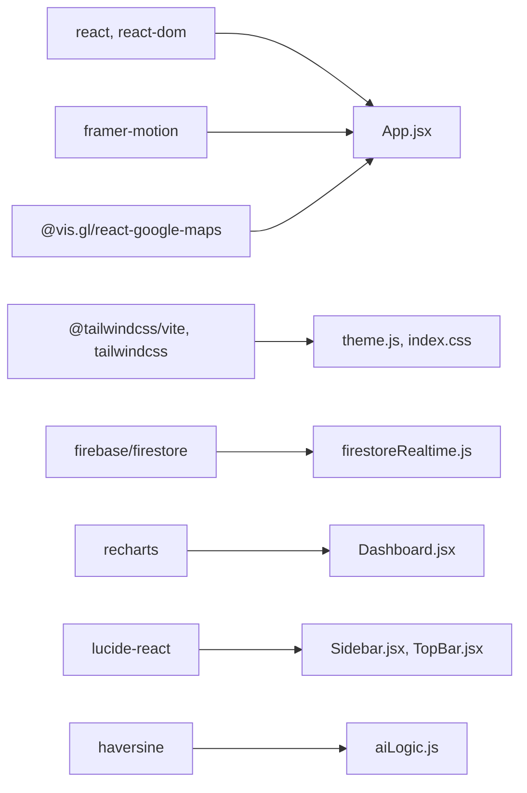

# Frontend Architecture

<cite>
**Referenced Files in This Document**
- [src/main.jsx](file://src/main.jsx)
- [src/App.jsx](file://src/App.jsx)
- [vite.config.js](file://vite.config.js)
- [package.json](file://package.json)
- [src/styles/theme.js](file://src/styles/theme.js)
- [src/hooks/useNgoRealtimeData.js](file://src/hooks/useNgoRealtimeData.js)
- [src/hooks/useOfflineSync.js](file://src/hooks/useOfflineSync.js)
- [src/components/ui/Button.jsx](file://src/components/ui/Button.jsx)
- [src/components/ui/Card.jsx](file://src/components/ui/Card.jsx)
- [src/components/Sidebar.jsx](file://src/components/Sidebar.jsx)
- [src/components/TopBar.jsx](file://src/components/TopBar.jsx)
- [src/pages/Dashboard.jsx](file://src/pages/Dashboard.jsx)
- [src/services/firestoreRealtime.js](file://src/services/firestoreRealtime.js)
- [src/utils/aiLogic.js](file://src/utils/aiLogic.js)
- [src/index.css](file://src/index.css)
</cite>

## Table of Contents
1. [Introduction](#introduction)
2. [Project Structure](#project-structure)
3. [Core Components](#core-components)
4. [Architecture Overview](#architecture-overview)
5. [Detailed Component Analysis](#detailed-component-analysis)
6. [Dependency Analysis](#dependency-analysis)
7. [Performance Considerations](#performance-considerations)
8. [Troubleshooting Guide](#troubleshooting-guide)
9. [Conclusion](#conclusion)
10. [Appendices](#appendices)

## Introduction
This document describes the frontend architecture of the React-based Echo5 application. It covers component hierarchy, state management with React hooks, routing configuration, styling and theming with TailwindCSS, modular component organization, reusable UI patterns, page-level business logic, real-time data integration, offline synchronization, and build configuration with Vite. The goal is to provide a clear understanding of how the system is structured and how developers can extend or maintain it effectively.

## Project Structure
The frontend is organized around a clear separation of concerns:
- Entry point initializes the React root and renders the top-level application shell.
- App orchestrates global state, real-time subscriptions, offline sync, and page routing.
- Pages represent route-level views with embedded business logic.
- Components encapsulate UI and reusable logic, including UI primitives and domain-specific widgets.
- Hooks abstract cross-cutting concerns like real-time data and offline synchronization.
- Services encapsulate Firebase Firestore subscriptions and CRUD operations.
- Utilities provide shared algorithms for AI logic and geolocation.
- Styles define a design token system and global Tailwind-based styling.

**Diagram sources**
- [src/main.jsx:1-55](file://src/main.jsx#L1-L55)
- [src/App.jsx:1-285](file://src/App.jsx#L1-L285)
- [src/styles/theme.js:1-57](file://src/styles/theme.js#L1-L57)
- [src/hooks/useNgoRealtimeData.js:1-83](file://src/hooks/useNgoRealtimeData.js#L1-L83)
- [src/hooks/useOfflineSync.js:1-72](file://src/hooks/useOfflineSync.js#L1-L72)
- [src/services/firestoreRealtime.js:1-212](file://src/services/firestoreRealtime.js#L1-L212)
- [src/utils/aiLogic.js:1-128](file://src/utils/aiLogic.js#L1-L128)
- [src/index.css:1-53](file://src/index.css#L1-L53)
- [vite.config.js:1-19](file://vite.config.js#L1-L19)

**Section sources**
- [src/main.jsx:1-55](file://src/main.jsx#L1-L55)
- [src/App.jsx:1-285](file://src/App.jsx#L1-L285)
- [vite.config.js:1-19](file://vite.config.js#L1-L19)
- [package.json:1-43](file://package.json#L1-L43)

## Core Components
This section outlines the primary building blocks of the frontend and their responsibilities.

- Global state and orchestration
  - App manages authentication state, navigation, emergency mode, smart mode, risk modeling, AI insights, and page selection. It also coordinates real-time data updates and offline synchronization.
  - See [src/App.jsx:29-285](file://src/App.jsx#L29-L285).

- Real-time data hook
  - useNgoRealtimeData subscribes to Firestore collections for needs, notifications, and unread counts, deduplicating updates via fingerprint comparison.
  - See [src/hooks/useNgoRealtimeData.js:26-82](file://src/hooks/useNgoRealtimeData.js#L26-L82).

- Offline synchronization hook
  - useOfflineSync persists snapshots and action queues to localStorage, handles online/offline transitions, and exposes cached data when offline.
  - See [src/hooks/useOfflineSync.js:13-71](file://src/hooks/useOfflineSync.js#L13-L71).

- UI primitives
  - Button and Card provide styled, animated base components for interactive elements and content containers.
  - See [src/components/ui/Button.jsx:9-21](file://src/components/ui/Button.jsx#L9-L21) and [src/components/ui/Card.jsx:3-14](file://src/components/ui/Card.jsx#L3-L14).

- Navigation and branding
  - Sidebar organizes navigation groups and badges, and displays user info and logout.
  - TopBar shows page metadata, live indicators, search affordances, simulation toggle, smart mode toggle, notifications, and avatar.
  - See [src/components/Sidebar.jsx:18-123](file://src/components/Sidebar.jsx#L18-L123) and [src/components/TopBar.jsx:5-140](file://src/components/TopBar.jsx#L5-L140).

- Page-level logic
  - Dashboard computes live statistics, charts, predictions, and auto-response suggestions from combined real-time and cached data.
  - See [src/pages/Dashboard.jsx:58-200](file://src/pages/Dashboard.jsx#L58-L200).

- Styling and theming
  - Theme defines design tokens and helper factories for consistent spacing, typography, shadows, gradients, and component styles.
  - Global index.css integrates Inter font and Tailwind, plus glass and neon effects.
  - See [src/styles/theme.js:3-56](file://src/styles/theme.js#L3-L56) and [src/index.css:1-53](file://src/index.css#L1-L53).

**Section sources**
- [src/App.jsx:29-285](file://src/App.jsx#L29-L285)
- [src/hooks/useNgoRealtimeData.js:26-82](file://src/hooks/useNgoRealtimeData.js#L26-L82)
- [src/hooks/useOfflineSync.js:13-71](file://src/hooks/useOfflineSync.js#L13-L71)
- [src/components/ui/Button.jsx:9-21](file://src/components/ui/Button.jsx#L9-L21)
- [src/components/ui/Card.jsx:3-14](file://src/components/ui/Card.jsx#L3-L14)
- [src/components/Sidebar.jsx:18-123](file://src/components/Sidebar.jsx#L18-L123)
- [src/components/TopBar.jsx:5-140](file://src/components/TopBar.jsx#L5-L140)
- [src/pages/Dashboard.jsx:58-200](file://src/pages/Dashboard.jsx#L58-L200)
- [src/styles/theme.js:3-56](file://src/styles/theme.js#L3-L56)
- [src/index.css:1-53](file://src/index.css#L1-L53)

## Architecture Overview
The frontend follows a layered architecture:
- Presentation layer: Pages and UI components render state and collect user actions.
- State management: React hooks centralize cross-page concerns (real-time subscriptions, offline sync).
- Business logic: Utilities encapsulate AI scoring, clustering, and prediction algorithms.
- Data access: Firestore service provides typed subscriptions and mutations.
- Styling: Theme tokens and Tailwind utilities ensure consistent visuals and responsive behavior.

**Diagram sources**
- [src/App.jsx:1-285](file://src/App.jsx#L1-L285)
- [src/hooks/useNgoRealtimeData.js:1-83](file://src/hooks/useNgoRealtimeData.js#L1-L83)
- [src/hooks/useOfflineSync.js:1-72](file://src/hooks/useOfflineSync.js#L1-L72)
- [src/utils/aiLogic.js:1-128](file://src/utils/aiLogic.js#L1-L128)
- [src/services/firestoreRealtime.js:1-212](file://src/services/firestoreRealtime.js#L1-L212)
- [src/styles/theme.js:1-57](file://src/styles/theme.js#L1-L57)
- [src/index.css:1-53](file://src/index.css#L1-L53)

## Detailed Component Analysis

### App Shell and Routing
The App component acts as the single-page application shell:
- Maintains global state: current page, navigation context, NGO identity, authentication view, emergency mode, smart mode, risk model, AI snapshot, and volunteer list.
- Subscribes to real-time data via useNgoRealtimeData and evaluates emergency conditions using aiLogic utilities.
- Coordinates offline synchronization via useOfflineSync and merges live and cached data.
- Renders a fixed layout with Sidebar, TopBar, and a page container that animates transitions using Framer Motion.
- Exposes navigation callbacks to child components and conditionally renders QuickActionMenu, AIAssistant, and walkthrough overlay.

**Diagram sources**
- [src/App.jsx:29-285](file://src/App.jsx#L29-L285)
- [src/hooks/useNgoRealtimeData.js:26-82](file://src/hooks/useNgoRealtimeData.js#L26-L82)
- [src/hooks/useOfflineSync.js:13-71](file://src/hooks/useOfflineSync.js#L13-L71)
- [src/utils/aiLogic.js:16-64](file://src/utils/aiLogic.js#L16-L64)

**Section sources**
- [src/App.jsx:29-285](file://src/App.jsx#L29-L285)

### Real-Time Data Integration
Real-time subscriptions are centralized in a dedicated hook:
- Subscribes to needs, notifications, and unread counts for a given NGO email.
- Uses a fingerprinting technique to avoid unnecessary re-renders when lists are unchanged.
- Returns memoized values for downstream consumption.

**Diagram sources**
- [src/hooks/useNgoRealtimeData.js:26-82](file://src/hooks/useNgoRealtimeData.js#L26-L82)
- [src/services/firestoreRealtime.js:61-116](file://src/services/firestoreRealtime.js#L61-L116)

**Section sources**
- [src/hooks/useNgoRealtimeData.js:26-82](file://src/hooks/useNgoRealtimeData.js#L26-L82)
- [src/services/firestoreRealtime.js:61-116](file://src/services/firestoreRealtime.js#L61-L116)

### Offline Sync and Rehydration
Offline synchronization persists data snapshots and queues actions locally:
- On data changes, writes a snapshot to localStorage keyed by NGO email.
- On reconnect, drains the action queue and triggers a reconciliation callback.
- Provides cachedNeeds for rendering when offline and a queueOfflineAction method for optimistic updates.

**Diagram sources**
- [src/hooks/useOfflineSync.js:13-71](file://src/hooks/useOfflineSync.js#L13-L71)

**Section sources**
- [src/hooks/useOfflineSync.js:13-71](file://src/hooks/useOfflineSync.js#L13-L71)

### AI Risk Modeling and Assistant Insights
The AI logic module computes risk scores and builds assistant insights:
- calculateRiskScore aggregates report count, keyword matches, and weather metrics into a bounded score with automatic emergency thresholds.
- buildAssistantInsights synthesizes actionable messages based on urgency, availability, and risk.

**Diagram sources**
- [src/App.jsx:64-91](file://src/App.jsx#L64-L91)
- [src/utils/aiLogic.js:16-64](file://src/utils/aiLogic.js#L16-L64)

**Section sources**
- [src/App.jsx:64-91](file://src/App.jsx#L64-L91)
- [src/utils/aiLogic.js:16-64](file://src/utils/aiLogic.js#L16-L64)

### Page-Level Business Logic: Dashboard
The Dashboard page composes live or cached data to compute statistics, charts, and AI-driven recommendations:
- Loads data from either needsOverride (cached/live) or API endpoints.
- Builds category and region distributions, resolution rates, and risk allocations.
- Computes predictions and auto-responses using specialized engines and utilities.

**Diagram sources**
- [src/pages/Dashboard.jsx:64-122](file://src/pages/Dashboard.jsx#L64-L122)
- [src/utils/aiLogic.js:74-127](file://src/utils/aiLogic.js#L74-L127)

**Section sources**
- [src/pages/Dashboard.jsx:58-200](file://src/pages/Dashboard.jsx#L58-L200)
- [src/utils/aiLogic.js:74-127](file://src/utils/aiLogic.js#L74-L127)

### Component Composition Patterns and Prop Drilling Prevention
- Props are passed down from App to Sidebar, TopBar, and pages, minimizing deep nesting.
- useNgoRealtimeData and useOfflineSync encapsulate subscription and caching logic, returning memoized values to reduce prop drilling.
- QuickActionMenu and AIAssistant receive concise callbacks, avoiding passing the entire App state tree.

**Section sources**
- [src/App.jsx:200-285](file://src/App.jsx#L200-L285)
- [src/hooks/useNgoRealtimeData.js:74-81](file://src/hooks/useNgoRealtimeData.js#L74-L81)
- [src/hooks/useOfflineSync.js:66-70](file://src/hooks/useOfflineSync.js#L66-L70)

### Styling System and Theme
- Theme tokens define primary colors, surfaces, text, and shadow values, enabling consistent design across components.
- Helper factories (css.flex, css.card, css.glassCard, css.tag, css.btn) generate reusable style objects.
- Global index.css imports Inter font and Tailwind, and defines glass and neon visual effects.
- UI components apply theme tokens and Tailwind utilities for responsive layouts and animations.

**Diagram sources**
- [src/styles/theme.js:3-56](file://src/styles/theme.js#L3-L56)
- [src/components/ui/Button.jsx:9-21](file://src/components/ui/Button.jsx#L9-L21)
- [src/components/ui/Card.jsx:3-14](file://src/components/ui/Card.jsx#L3-L14)

**Section sources**
- [src/styles/theme.js:3-56](file://src/styles/theme.js#L3-L56)
- [src/index.css:1-53](file://src/index.css#L1-L53)
- [src/components/ui/Button.jsx:9-21](file://src/components/ui/Button.jsx#L9-L21)
- [src/components/ui/Card.jsx:3-14](file://src/components/ui/Card.jsx#L3-L14)

## Dependency Analysis
The frontend relies on a small set of core libraries and a clear dependency graph:
- React and React DOM form the runtime.
- Framer Motion powers animations.
- TailwindCSS and @tailwindcss/vite enable utility-first styling.
- @vis.gl/react-google-maps integrates mapping.
- Firebase Firestore provides real-time subscriptions and persistence.
- Recharts and Lucide React support data visualization and icons.

**Diagram sources**
- [package.json:12-29](file://package.json#L12-L29)
- [src/App.jsx:1-16](file://src/App.jsx#L1-L16)
- [src/styles/theme.js:1-57](file://src/styles/theme.js#L1-L57)
- [src/services/firestoreRealtime.js:1-16](file://src/services/firestoreRealtime.js#L1-L16)
- [src/pages/Dashboard.jsx:16-27](file://src/pages/Dashboard.jsx#L16-L27)
- [src/utils/aiLogic.js:1-1](file://src/utils/aiLogic.js#L1-L1)

**Section sources**
- [package.json:12-29](file://package.json#L12-L29)
- [src/App.jsx:1-16](file://src/App.jsx#L1-L16)

## Performance Considerations
- Memoization and stable references
  - useMemo is used to prevent unnecessary recomputation of intelligence snapshots and derived datasets.
  - useCallback is used for navigation callbacks to avoid prop drift.
  - See [src/App.jsx:156-164](file://src/App.jsx#L156-L164) and [src/App.jsx:204](file://src/App.jsx#L204).

- Efficient real-time updates
  - useNgoRealtimeData fingerprints lists to suppress redundant renders.
  - See [src/hooks/useNgoRealtimeData.js:8-24](file://src/hooks/useNgoRealtimeData.js#L8-L24).

- Animation and layout stability
  - Framer Motion transitions are scoped to page changes and hover states to minimize layout thrashing.
  - See [src/App.jsx:243-247](file://src/App.jsx#L243-L247) and [src/components/ui/Card.jsx:5-13](file://src/components/ui/Card.jsx#L5-L13).

- Asset loading and bundling
  - Vite’s React plugin enables fast HMR and optimized builds.
  - See [vite.config.js:7](file://vite.config.js#L7).

[No sources needed since this section provides general guidance]

## Troubleshooting Guide
- Root element missing during bootstrap
  - The entry point validates the presence of the root element and logs a detailed diagnostic on failure.
  - See [src/main.jsx:14-18](file://src/main.jsx#L14-L18).

- Realtime subscription errors
  - Firestore listeners log errors to the console; ensure the NGO email is set and network connectivity is available.
  - See [src/services/firestoreRealtime.js:68-71](file://src/services/firestoreRealtime.js#L68-L71) and [src/services/firestoreRealtime.js:98-101](file://src/services/firestoreRealtime.js#L98-L101).

- Offline mode behavior
  - When offline, cachedNeeds is used and an indicator is shown. Verify localStorage keys and queue presence.
  - See [src/hooks/useOfflineSync.js:26-50](file://src/hooks/useOfflineSync.js#L26-L50) and [src/App.jsx:266-270](file://src/App.jsx#L266-L270).

- Emergency evaluation failures
  - If emergency evaluation throws, check liveNeeds, liveNotifications, and volunteers arrays.
  - See [src/App.jsx:93-96](file://src/App.jsx#L93-L96).

**Section sources**
- [src/main.jsx:14-18](file://src/main.jsx#L14-L18)
- [src/services/firestoreRealtime.js:68-101](file://src/services/firestoreRealtime.js#L68-L101)
- [src/hooks/useOfflineSync.js:26-50](file://src/hooks/useOfflineSync.js#L26-L50)
- [src/App.jsx:93-96](file://src/App.jsx#L93-L96)

## Conclusion
The Echo5 frontend is a modular, reactive system built around a clean separation of concerns. App orchestrates global state and integrates real-time data and offline capabilities. Hooks encapsulate cross-cutting concerns, while UI components and pages focus on presentation and domain logic. The theme and Tailwind-based styling ensure visual consistency and responsiveness. The Vite configuration supports efficient development and production builds. Together, these patterns enable scalable maintenance and extension of the platform.

[No sources needed since this section summarizes without analyzing specific files]

## Appendices

### Build Configuration with Vite
- Plugins: React and TailwindCSS integrations.
- Dev server proxy: Routes /api requests to the backend server for seamless development.
- Scripts: dev, build, lint, and preview commands.

**Section sources**
- [vite.config.js:1-19](file://vite.config.js#L1-L19)
- [package.json:6-11](file://package.json#L6-L11)

### Real-Time Data Integration Details
- Firestore subscriptions for needs, notifications, and unread counts.
- Validation and sanitization before writes to prevent malformed data and XSS.
- Pagination and ordering options for scalable queries.

**Section sources**
- [src/services/firestoreRealtime.js:61-130](file://src/services/firestoreRealtime.js#L61-L130)
- [src/services/firestoreRealtime.js:132-182](file://src/services/firestoreRealtime.js#L132-L182)