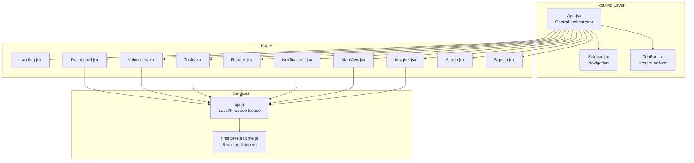
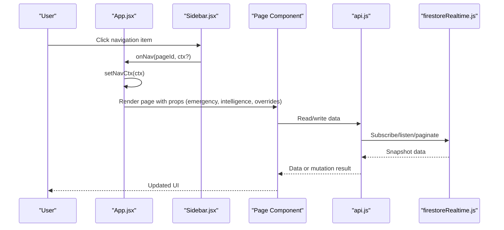
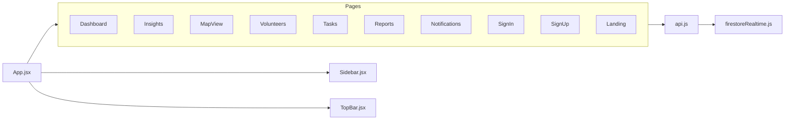

# Page Components

<cite>
**Referenced Files in This Document**
- [App.jsx](file://src/App.jsx)
- [Sidebar.jsx](file://src/components/ui/Sidebar.jsx)
- [TopBar.jsx](file://src/components/ui/TopBar.jsx)
- [Landing.jsx](file://src/pages/Landing.jsx)
- [Dashboard.jsx](file://src/pages/Dashboard.jsx)
- [Insights.jsx](file://src/pages/Insights.jsx)
- [MapView.jsx](file://src/pages/MapView.jsx)
- [Volunteers.jsx](file://src/pages/Volunteers.jsx)
- [Tasks.jsx](file://src/pages/Tasks.jsx)
- [Reports.jsx](file://src/pages/Reports.jsx)
- [Notifications.jsx](file://src/pages/Notifications.jsx)
- [SignIn.jsx](file://src/pages/SignIn.jsx)
- [SignUp.jsx](file://src/pages/SignUp.jsx)
- [api.js](file://src/services/api.js)
- [firestoreRealtime.js](file://src/services/firestoreRealtime.js)
</cite>

## Table of Contents
1. [Introduction](#introduction)
2. [Project Structure](#project-structure)
3. [Core Components](#core-components)
4. [Architecture Overview](#architecture-overview)
5. [Detailed Component Analysis](#detailed-component-analysis)
6. [Dependency Analysis](#dependency-analysis)
7. [Performance Considerations](#performance-considerations)
8. [Troubleshooting Guide](#troubleshooting-guide)
9. [Conclusion](#conclusion)

## Introduction
This document explains the page-level components and their business logic implementation across the NeedLink AI platform. It covers how each page serves its purpose, how routes and navigation work, what data they require, and how users interact with the system. It also documents analytics dashboards, geographic mapping, volunteer management, task assignment, reporting, insights, and notifications. Authentication pages (SignIn/SignUp) and the landing page are included, along with navigation context management, state handling, real-time data binding, and performance strategies.

## Project Structure
The application is a React single-page application with a central App container orchestrating pages, navigation, and global state. Pages are organized under src/pages and integrate with services for data access and Firebase Firestore for persistence and real-time updates. UI scaffolding includes a Sidebar and TopBar shared across most pages.

**Diagram sources**
- [App.jsx:29-285](file://src/App.jsx#L29-L285)
- [Sidebar.jsx:1-46](file://src/components/ui/Sidebar.jsx#L1-L46)
- [TopBar.jsx:1-33](file://src/components/ui/TopBar.jsx#L1-L33)
- [Landing.jsx:1-127](file://src/pages/Landing.jsx#L1-L127)
- [Dashboard.jsx:1-530](file://src/pages/Dashboard.jsx#L1-L530)
- [Insights.jsx:1-227](file://src/pages/Insights.jsx#L1-L227)
- [MapView.jsx:1-800](file://src/pages/MapView.jsx#L1-L800)
- [Volunteers.jsx:1-328](file://src/pages/Volunteers.jsx#L1-L328)
- [Tasks.jsx:1-367](file://src/pages/Tasks.jsx#L1-L367)
- [Reports.jsx:1-279](file://src/pages/Reports.jsx#L1-L279)
- [Notifications.jsx:1-194](file://src/pages/Notifications.jsx#L1-L194)
- [SignIn.jsx:1-178](file://src/pages/SignIn.jsx#L1-L178)
- [SignUp.jsx:1-194](file://src/pages/SignUp.jsx#L1-L194)
- [api.js:1-599](file://src/services/api.js#L1-L599)
- [firestoreRealtime.js:1-212](file://src/services/firestoreRealtime.js#L1-L212)

**Section sources**
- [App.jsx:29-285](file://src/App.jsx#L29-L285)
- [Sidebar.jsx:1-46](file://src/components/ui/Sidebar.jsx#L1-L46)
- [TopBar.jsx:1-33](file://src/components/ui/TopBar.jsx#L1-L33)

## Core Components
- Central orchestration: App.jsx manages authentication state, navigation context, emergency mode, AI intelligence snapshots, and renders the active page with proper props.
- Navigation: Sidebar and TopBar provide consistent navigation and header controls across pages.
- Data access: api.js wraps local seed data and Firebase operations, while firestoreRealtime.js provides real-time subscriptions and paginated queries.

**Section sources**
- [App.jsx:29-285](file://src/App.jsx#L29-L285)
- [Sidebar.jsx:1-46](file://src/components/ui/Sidebar.jsx#L1-L46)
- [TopBar.jsx:1-33](file://src/components/ui/TopBar.jsx#L1-L33)
- [api.js:295-599](file://src/services/api.js#L295-L599)
- [firestoreRealtime.js:1-212](file://src/services/firestoreRealtime.js#L1-L212)

## Architecture Overview
The system uses a centralized App container to:
- Track authentication and session state
- Compute emergency mode and AI insights
- Manage offline-first caching and realtime synchronization
- Pass navigation context and intelligence snapshots to pages

**Diagram sources**
- [App.jsx:200-225](file://src/App.jsx#L200-L225)
- [Sidebar.jsx:12-45](file://src/components/ui/Sidebar.jsx#L12-L45)
- [api.js:295-599](file://src/services/api.js#L295-L599)
- [firestoreRealtime.js:61-130](file://src/services/firestoreRealtime.js#L61-L130)

## Detailed Component Analysis

### Dashboard
Purpose: Central command center displaying analytics, live stats, charts, and quick actions. Integrates AI insights, emergency mode banner, and links to related views.

Key behaviors:
- Loads stats, needs, and chart data via api.js
- Builds live stats and charts from needs
- Computes AI-driven predictions and crisis alerts
- Supports emergency mode activation/deactivation
- Provides quick actions to upload, match volunteers, and view insights

Data requirements:
- Needs array (active/resolved)
- Volunteers count
- Chart data (categories, regions, resolution)

User interactions:
- Buttons to navigate to Upload, Volunteers, Insights
- Emergency deactivation button
- Links in urgent needs and table rows

Real-time and performance:
- Uses memoization for derived data
- Renders spinner during initial load
- Integrates with emergency and AI snapshots from App

**Section sources**
- [Dashboard.jsx:58-122](file://src/pages/Dashboard.jsx#L58-L122)
- [Dashboard.jsx:292-528](file://src/pages/Dashboard.jsx#L292-L528)
- [App.jsx:217-217](file://src/App.jsx#L217-L217)

### MapView
Purpose: Geographic visualization of needs with interactive markers, filtering, and smart assignment capabilities.

Key behaviors:
- Fetches needs via Firestore or override
- Resolves coordinates and filters by priority
- Computes stats and AI decisions for the current crisis context
- Supports pin creation, selection, resolution, and smart matching
- Renders heatmap overlay and animated markers

Data requirements:
- Needs with locations and priorities
- Volunteers with availability and skills
- Incident and resource context for AI decisions

User interactions:
- Click pins to select and pan
- Filter by priority
- Resolve selected incident
- Auto-respond to coordinate response
- Explain AI match rationale per volunteer

Real-time and performance:
- Uses useMemo for derived datasets
- Implements skeleton loading and empty state
- Efficiently updates selection and map bounds

**Section sources**
- [MapView.jsx:272-520](file://src/pages/MapView.jsx#L272-L520)
- [MapView.jsx:528-800](file://src/pages/MapView.jsx#L528-L800)
- [firestoreRealtime.js:184-192](file://src/services/firestoreRealtime.js#L184-L192)

### Volunteers
Purpose: Volunteer matching engine with smart ranking, travel time computation, and batch assignment.

Key behaviors:
- Loads volunteers and active needs
- Ranks volunteers for a selected task using proximity and skills
- Calculates precise travel times and caches results
- Supports manual and smart assignment with optimistic UI updates
- Integrates AI recommendations when available

Data requirements:
- Volunteers with location and attributes
- Needs with location and required skills
- Optional AI recommendations

User interactions:
- Select target task
- Toggle available/all filter
- Assign individual volunteers
- Trigger SmartAssign to deploy top matches

Real-time and performance:
- Debounces travel time requests
- Optimistic updates for immediate feedback
- Smart ranking recomputed on selection change

**Section sources**
- [Volunteers.jsx:24-206](file://src/pages/Volunteers.jsx#L24-L206)
- [Volunteers.jsx:213-327](file://src/pages/Volunteers.jsx#L213-L327)

### Tasks
Purpose: Task registry and management with filtering, resolution, deletion, and AI-enhanced prioritization.

Key behaviors:
- Lists all incidents for the logged-in NGO
- Filters by status and supports smart ordering by AI priority
- Resolves or deletes tasks with confirmation
- Opens modal to add new tasks with draft support

Data requirements:
- Needs list from Firestore
- AI prioritized tasks for smart ordering

User interactions:
- Filter by status
- Resolve/Delete tasks
- Navigate to Volunteers or Map from rows
- Open Add Task modal

Real-time and performance:
- Uses Firestore pagination for notifications
- Applies emergency highlighting for urgent tasks

**Section sources**
- [Tasks.jsx:8-96](file://src/pages/Tasks.jsx#L8-L96)
- [Tasks.jsx:98-366](file://src/pages/Tasks.jsx#L98-L366)
- [firestoreRealtime.js:118-130](file://src/services/firestoreRealtime.js#L118-L130)

### Reports
Purpose: Operational reporting with export capabilities and impact metrics.

Key behaviors:
- Generates PDF and CSV exports of needs, volunteers, and uploads
- Displays summary cards and charts for impact and trends
- Uses intelligence snapshot for live counters

Data requirements:
- Needs, volunteers, uploads, and computed chart data

User interactions:
- Download PDF
- Export CSV

Real-time and performance:
- Renders spinner until chart data loads
- Uses jspdf and autotable for PDF generation

**Section sources**
- [Reports.jsx:13-216](file://src/pages/Reports.jsx#L13-L216)
- [Reports.jsx:220-276](file://src/pages/Reports.jsx#L220-L276)

### Insights
Purpose: AI-generated analysis of needs, predicted alerts, hotspots, and recommendations.

Key behaviors:
- Loads needs and chart data
- Displays prediction dashboard and hotspots
- Shows priority cards and trend charts
- Integrates AI recommendations and smart mode indicator

Data requirements:
- Needs, chart data, and intelligence snapshot

User interactions:
- Filter by priority
- Navigate to Volunteers from urgent section
- Use Smart Mode toggle (via App)

Real-time and performance:
- Uses memoization for derived data
- Renders spinner during load

**Section sources**
- [Insights.jsx:14-71](file://src/pages/Insights.jsx#L14-L71)
- [Insights.jsx:72-226](file://src/pages/Insights.jsx#L72-L226)

### Notifications
Purpose: Notification inbox with pagination, read/unread filtering, and bulk actions.

Key behaviors:
- Loads notifications via Firestore with pagination
- Supports marking as read and bulk mark-all-read
- Deduplicates and merges pages

Data requirements:
- Notifications stream with read/unread state

User interactions:
- Filter by all/unread
- Mark individual notification read
- Load older notifications

Real-time and performance:
- Paginates with cursor-based continuation
- Maintains deduplicated list

**Section sources**
- [Notifications.jsx:18-90](file://src/pages/Notifications.jsx#L18-L90)
- [Notifications.jsx:91-194](file://src/pages/Notifications.jsx#L91-L194)
- [firestoreRealtime.js:118-130](file://src/services/firestoreRealtime.js#L118-L130)

### Authentication Pages (SignIn/SignUp)
Purpose: Secure sign-in and account registration flows.

Key behaviors:
- SignIn validates credentials against local accounts and logs in
- SignUp validates form, creates account, and redirects to dashboard
- Demo accounts available for quick access

Data requirements:
- Local accounts database and validation helpers

User interactions:
- Login with email/password
- Register new NGO account
- Demo account hints

Real-time and performance:
- Minimal runtime state; relies on App to persist session

**Section sources**
- [SignIn.jsx:6-22](file://src/pages/SignIn.jsx#L6-L22)
- [SignIn.jsx:24-178](file://src/pages/SignIn.jsx#L24-L178)
- [SignUp.jsx:5-44](file://src/pages/SignUp.jsx#L5-L44)
- [SignUp.jsx:78-194](file://src/pages/SignUp.jsx#L78-L194)
- [api.js:564-599](file://src/services/api.js#L564-L599)

### Landing
Purpose: Onboarding and feature showcase before entering the dashboard.

Key behaviors:
- Presents hero, stats, and feature cards
- Navigates to Dashboard or Insights

User interactions:
- Enter Dashboard
- View Live Insights

Real-time and performance:
- Static content with animations

**Section sources**
- [Landing.jsx:4-127](file://src/pages/Landing.jsx#L4-L127)

## Dependency Analysis
The App orchestrates page rendering and passes context. Pages depend on api.js for data and on firestoreRealtime.js for real-time updates. Sidebar and TopBar are presentational components wired to App’s navigation and emergency toggles.

**Diagram sources**
- [App.jsx:215-225](file://src/App.jsx#L215-L225)
- [Sidebar.jsx:1-46](file://src/components/ui/Sidebar.jsx#L1-L46)
- [TopBar.jsx:1-33](file://src/components/ui/TopBar.jsx#L1-L33)
- [api.js:295-599](file://src/services/api.js#L295-L599)
- [firestoreRealtime.js:1-212](file://src/services/firestoreRealtime.js#L1-L212)

**Section sources**
- [App.jsx:215-225](file://src/App.jsx#L215-L225)
- [api.js:295-599](file://src/services/api.js#L295-L599)
- [firestoreRealtime.js:1-212](file://src/services/firestoreRealtime.js#L1-L212)

## Performance Considerations
- Memoization: Pages compute derived data using useMemo to avoid unnecessary re-renders (e.g., MapView, Dashboard).
- Parallel loading: Pages use Promise.all to fetch multiple datasets concurrently (e.g., Dashboard, Insights).
- Caching: api.js maintains an in-memory cache keyed by NGO email to reduce redundant reads.
- Real-time updates: firestoreRealtime.js provides efficient onSnapshot listeners; App integrates unread counts and live needs.
- Pagination: Notifications uses cursor-based pagination to handle large lists.
- Rendering: Spinners and skeleton loaders improve perceived performance during initial loads.
- Offline-first: App tracks online/offline state and falls back to cached data when network is unavailable.

[No sources needed since this section provides general guidance]

## Troubleshooting Guide
Common issues and resolutions:
- Authentication failures: Verify credentials match entries in the local accounts database. Demo accounts are preloaded.
- Data not loading: Check NGO email in localStorage; ensure backend auth is reachable for AI features.
- Real-time not updating: Confirm Firebase listeners are attached and network connectivity is restored.
- Map pins missing coordinates: Needs without lat/lng fall back to resolved coordinates; ensure data includes location.
- Notification pagination errors: Ensure cursor is valid and NGO email is present.

**Section sources**
- [SignIn.jsx:14-22](file://src/pages/SignIn.jsx#L14-L22)
- [api.js:564-599](file://src/services/api.js#L564-L599)
- [firestoreRealtime.js:61-130](file://src/services/firestoreRealtime.js#L61-L130)
- [MapView.jsx:322-338](file://src/pages/MapView.jsx#L322-L338)

## Conclusion
The page components are cohesive, data-driven, and optimized for real-time collaboration. They leverage a central App container for navigation and state, a robust service layer for data access, and responsive UI patterns for efficient interaction. Emergency mode, AI insights, and geographic mapping are tightly integrated to support rapid response scenarios, while reporting and notifications keep stakeholders informed.

[No sources needed since this section summarizes without analyzing specific files]