# React Application Structure

<cite>
**Referenced Files in This Document**
- [main.jsx](file://src/main.jsx)
- [App.jsx](file://src/App.jsx)
- [index.html](file://index.html)
- [vite.config.js](file://vite.config.js)
- [package.json](file://package.json)
- [index.css](file://src/index.css)
- [App.css](file://src/App.css)
- [theme.js](file://src/styles/theme.js)
- [firebase.js](file://src/firebase.js)
- [Sidebar.jsx](file://src/components/Sidebar.jsx)
- [Dashboard.jsx](file://src/pages/Dashboard.jsx)
- [api.js](file://src/services/api.js)
- [backendApi.js](file://src/services/backendApi.js)
- [useNgoRealtimeData.js](file://src/hooks/useNgoRealtimeData.js)
- [aiLogic.js](file://src/utils/aiLogic.js)
- [intelligence/index.js](file://src/services/intelligence/index.js)
- [matchingEngine.js](file://src/engine/matchingEngine.js)
</cite>

## Table of Contents
1. [Introduction](#introduction)
2. [Project Structure](#project-structure)
3. [Core Components](#core-components)
4. [Architecture Overview](#architecture-overview)
5. [Detailed Component Analysis](#detailed-component-analysis)
6. [Dependency Analysis](#dependency-analysis)
7. [Performance Considerations](#performance-considerations)
8. [Troubleshooting Guide](#troubleshooting-guide)
9. [Conclusion](#conclusion)
10. [Appendices](#appendices)

## Introduction
This document describes the React application structure of Echo5, focusing on the root component architecture, component initialization, CSS styling foundation, Vite build configuration, environment setup, development server configuration, application entry point, provider wrappers, global state initialization, component composition patterns, routing setup, and performance optimization strategies. It also documents the modular file organization, import/export patterns, and build pipeline configuration.

## Project Structure
Echo5 follows a feature-based organization with clear separation between UI components, pages, services, engines, utilities, and styles. The application is bootstrapped via a minimal HTML shell and mounts the React root in main.jsx, which renders the App root component. Styling leverages Tailwind CSS and a custom theme module for design tokens and helper functions.

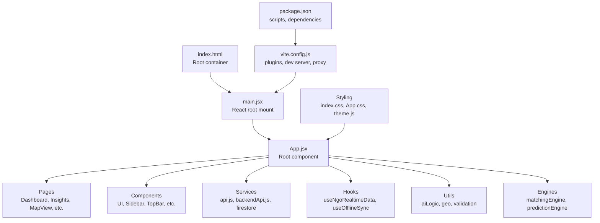

**Diagram sources**
- [index.html:1-14](file://index.html#L1-L14)
- [main.jsx:1-55](file://src/main.jsx#L1-L55)
- [App.jsx:1-285](file://src/App.jsx#L1-L285)
- [vite.config.js:1-19](file://vite.config.js#L1-L19)
- [package.json:1-43](file://package.json#L1-L43)

**Section sources**
- [index.html:1-14](file://index.html#L1-L14)
- [main.jsx:1-55](file://src/main.jsx#L1-L55)
- [vite.config.js:1-19](file://vite.config.js#L1-L19)
- [package.json:1-43](file://package.json#L1-L43)

## Core Components
- Root entry point: The application initializes in main.jsx by locating the DOM root element and rendering the App component inside React's StrictMode. It includes robust diagnostics and a fallback UI for startup failures.
- Root component: App.jsx orchestrates global state, integrates Firebase and backend APIs, manages navigation, and composes page-level views with shared UI components. It uses Google Maps API Provider for map-related functionality and Framer Motion for smooth transitions.
- Styling foundation: Tailwind CSS is imported globally in index.css, while App.css defines CSS custom properties and reusable component classes. theme.js centralizes design tokens and helper functions for consistent styling across components.

Key responsibilities:
- Global state: Authentication, navigation context, emergency mode, smart mode, offline simulation, and AI insights snapshot.
- Real-time data: Subscriptions to NGO needs, notifications, and unread counts via Firestore.
- Offline sync: Hook for caching and rehydration of needs data.
- AI and intelligence: Risk scoring, assistant insights, and intelligence snapshot building.

**Section sources**
- [main.jsx:1-55](file://src/main.jsx#L1-L55)
- [App.jsx:1-285](file://src/App.jsx#L1-L285)
- [index.css:1-53](file://src/index.css#L1-L53)
- [App.css:1-425](file://src/App.css#L1-L425)
- [theme.js:1-57](file://src/styles/theme.js#L1-L57)

## Architecture Overview
The application architecture emphasizes modularity and separation of concerns:
- Entry point: index.html provides the #root element; main.jsx creates the React root and renders App.
- Routing: App.jsx maintains an internal page state and conditionally renders page components, enabling single-page navigation without a dedicated router library.
- Providers: Google Maps API Provider wraps the app for map components; Firebase services are initialized centrally.
- Services: api.js abstracts Firebase Firestore operations and local caching; backendApi.js handles secure backend communication with JWT token management.
- Hooks: useNgoRealtimeData establishes real-time subscriptions to Firestore collections.
- Engines and utilities: AI logic, geolocation utilities, and matching engines compute insights and recommendations.

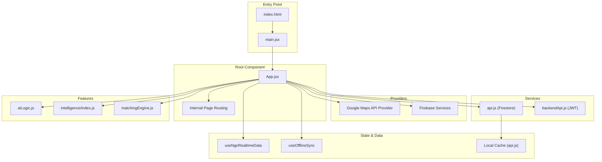

**Diagram sources**
- [index.html:1-14](file://index.html#L1-L14)
- [main.jsx:1-55](file://src/main.jsx#L1-L55)
- [App.jsx:1-285](file://src/App.jsx#L1-L285)
- [api.js:1-599](file://src/services/api.js#L1-L599)
- [backendApi.js:1-164](file://src/services/backendApi.js#L1-L164)
- [useNgoRealtimeData.js:1-83](file://src/hooks/useNgoRealtimeData.js#L1-L83)
- [aiLogic.js:1-128](file://src/utils/aiLogic.js#L1-L128)
- [intelligence/index.js:1-43](file://src/services/intelligence/index.js#L1-L43)
- [matchingEngine.js:1-174](file://src/engine/matchingEngine.js#L1-L174)

## Detailed Component Analysis

### Root Component Architecture (App.jsx)
App.jsx serves as the application shell, managing:
- Authentication state and navigation flow (SignIn/SignUp → Dashboard/Insights/etc.)
- Real-time data subscriptions and offline synchronization
- Emergency mode evaluation and AI insights generation
- Smart mode toggling and risk modeling
- Page composition with Sidebar, TopBar, and animated page transitions

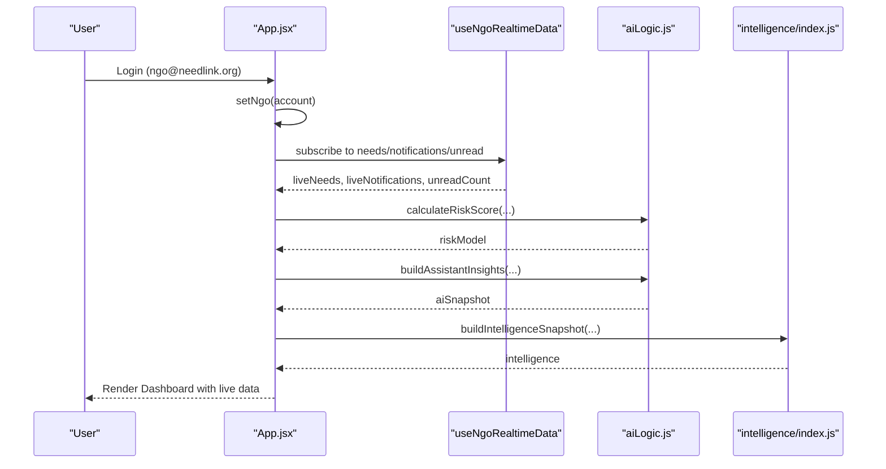

**Diagram sources**
- [App.jsx:64-164](file://src/App.jsx#L64-L164)
- [useNgoRealtimeData.js:26-82](file://src/hooks/useNgoRealtimeData.js#L26-L82)
- [aiLogic.js:16-64](file://src/utils/aiLogic.js#L16-L64)
- [intelligence/index.js:6-42](file://src/services/intelligence/index.js#L6-L42)

**Section sources**
- [App.jsx:1-285](file://src/App.jsx#L1-L285)
- [useNgoRealtimeData.js:1-83](file://src/hooks/useNgoRealtimeData.js#L1-L83)
- [aiLogic.js:1-128](file://src/utils/aiLogic.js#L1-L128)
- [intelligence/index.js:1-43](file://src/services/intelligence/index.js#L1-L43)

### Component Composition Patterns
- Shared UI: Sidebar and TopBar are composed within App.jsx, receiving props for navigation and state.
- Page composition: App.jsx maintains a pages object keyed by route identifiers, enabling animated transitions via Framer Motion.
- Conditional overlays: Emergency mode, walkthrough overlay, and offline indicator are rendered conditionally based on state.

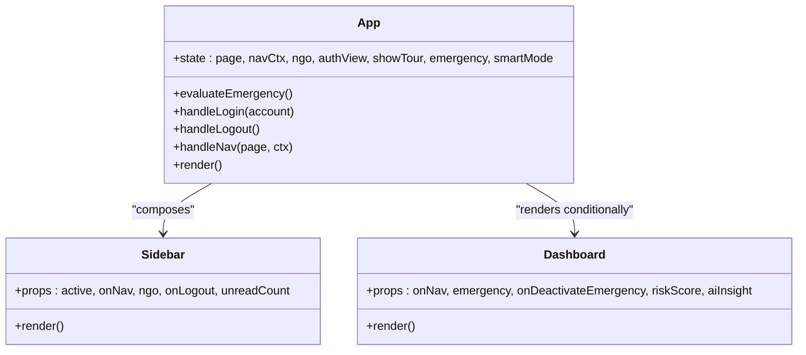

**Diagram sources**
- [App.jsx:18-285](file://src/App.jsx#L18-L285)
- [Sidebar.jsx:1-124](file://src/components/Sidebar.jsx#L1-L124)
- [Dashboard.jsx:1-530](file://src/pages/Dashboard.jsx#L1-L530)

**Section sources**
- [App.jsx:210-285](file://src/App.jsx#L210-L285)
- [Sidebar.jsx:1-124](file://src/components/Sidebar.jsx#L1-L124)
- [Dashboard.jsx:1-530](file://src/pages/Dashboard.jsx#L1-L530)

### Routing Setup
The application uses an internal routing mechanism:
- A page state variable determines which page component to render.
- Navigation handlers update the page state and optional context.
- Animated transitions wrap page content using Framer Motion.

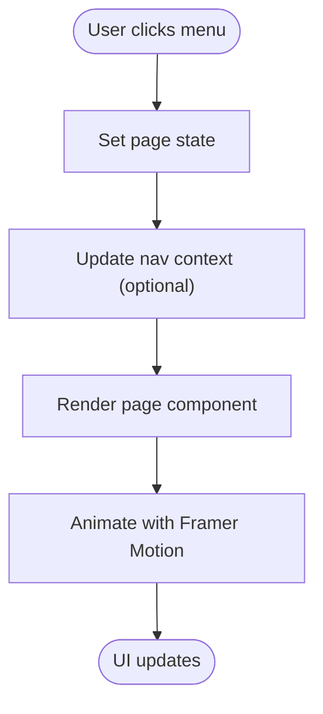

**Diagram sources**
- [App.jsx:200-247](file://src/App.jsx#L200-L247)

**Section sources**
- [App.jsx:200-247](file://src/App.jsx#L200-L247)

### Provider Wrappers and Global State Initialization
- Google Maps Provider: App.jsx wraps the application with APIProvider, enabling map components to use Google Maps features.
- Firebase initialization: firebase.js initializes Firebase app, auth, Firestore, storage, and analytics using environment variables.
- Backend API: backendApi.js manages JWT tokens via sessionStorage and exposes typed methods for authentication, AI analysis, and matching.

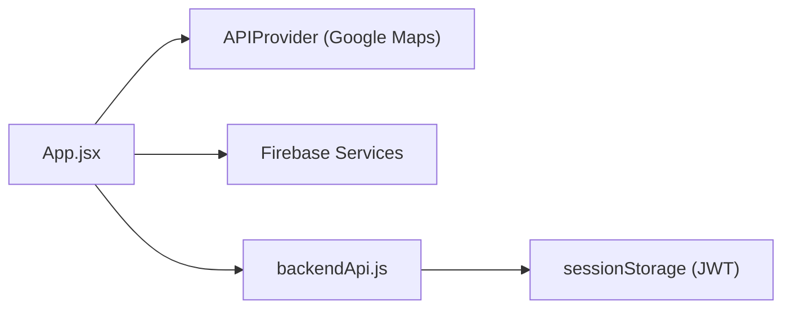

**Diagram sources**
- [App.jsx:228-284](file://src/App.jsx#L228-L284)
- [firebase.js:1-35](file://src/firebase.js#L1-L35)
- [backendApi.js:1-164](file://src/services/backendApi.js#L1-L164)

**Section sources**
- [App.jsx:2-16](file://src/App.jsx#L2-L16)
- [firebase.js:1-35](file://src/firebase.js#L1-L35)
- [backendApi.js:1-164](file://src/services/backendApi.js#L1-L164)

### CSS Styling Foundation
- Global styles: index.css imports Inter font and Tailwind, sets base typography and scrollbar styles, and defines utility classes (.glass, .neon-shadow, .text-glow).
- Component-specific styles: App.css defines CSS custom properties, ambient glows, stepper components, form elements, buttons, spinners, skeleton loaders, metrics grids, and responsive breakpoints.
- Theme tokens: theme.js exports design tokens and helper functions for consistent spacing, shadows, and component styling.

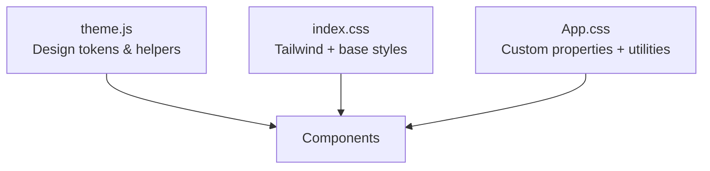

**Diagram sources**
- [theme.js:1-57](file://src/styles/theme.js#L1-L57)
- [index.css:1-53](file://src/index.css#L1-L53)
- [App.css:1-425](file://src/App.css#L1-L425)

**Section sources**
- [index.css:1-53](file://src/index.css#L1-L53)
- [App.css:1-425](file://src/App.css#L1-L425)
- [theme.js:1-57](file://src/styles/theme.js#L1-L57)

### Vite Build Configuration and Environment Setup
- Plugins: Vite uses @vitejs/plugin-react for JSX transforms and @tailwindcss/vite for Tailwind integration.
- Development server: Proxies API calls from /api to http://localhost:8787 during development.
- Scripts: dev, build, lint, and preview commands are defined in package.json.

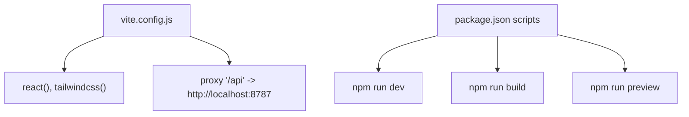

**Diagram sources**
- [vite.config.js:1-19](file://vite.config.js#L1-L19)
- [package.json:6-11](file://package.json#L6-L11)

**Section sources**
- [vite.config.js:1-19](file://vite.config.js#L1-L19)
- [package.json:1-43](file://package.json#L1-L43)

### Data Services and Real-Time Integration
- Firestore abstraction: api.js encapsulates Firebase operations, including seeding per-account datasets, caching, coordinate resolution, and dynamic chart data computation.
- Real-time subscriptions: useNgoRealtimeData subscribes to needs, notifications, and unread counts, deduplicating updates via fingerprint comparison.
- Backend integration: backendApi.js provides typed methods for authentication, AI analysis, and matching, with automatic JWT inclusion in requests.

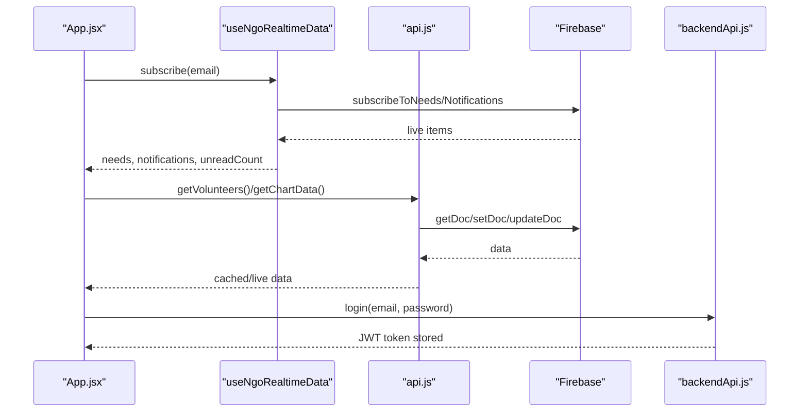

**Diagram sources**
- [App.jsx:62-133](file://src/App.jsx#L62-L133)
- [useNgoRealtimeData.js:26-82](file://src/hooks/useNgoRealtimeData.js#L26-L82)
- [api.js:242-293](file://src/services/api.js#L242-L293)
- [backendApi.js:63-77](file://src/services/backendApi.js#L63-L77)

**Section sources**
- [api.js:1-599](file://src/services/api.js#L1-L599)
- [useNgoRealtimeData.js:1-83](file://src/hooks/useNgoRealtimeData.js#L1-L83)
- [backendApi.js:1-164](file://src/services/backendApi.js#L1-L164)

### AI and Intelligence Engines
- Risk scoring and insights: aiLogic.js computes risk scores from reports, keywords, and weather conditions and builds assistant insights.
- Intelligence snapshot: intelligence/index.js aggregates predictions, prioritized tasks, recommendations, hotspots, and impact metrics.
- Matching engine: matchingEngine.js ranks volunteers for tasks considering skills, distance, availability, experience, and performance.

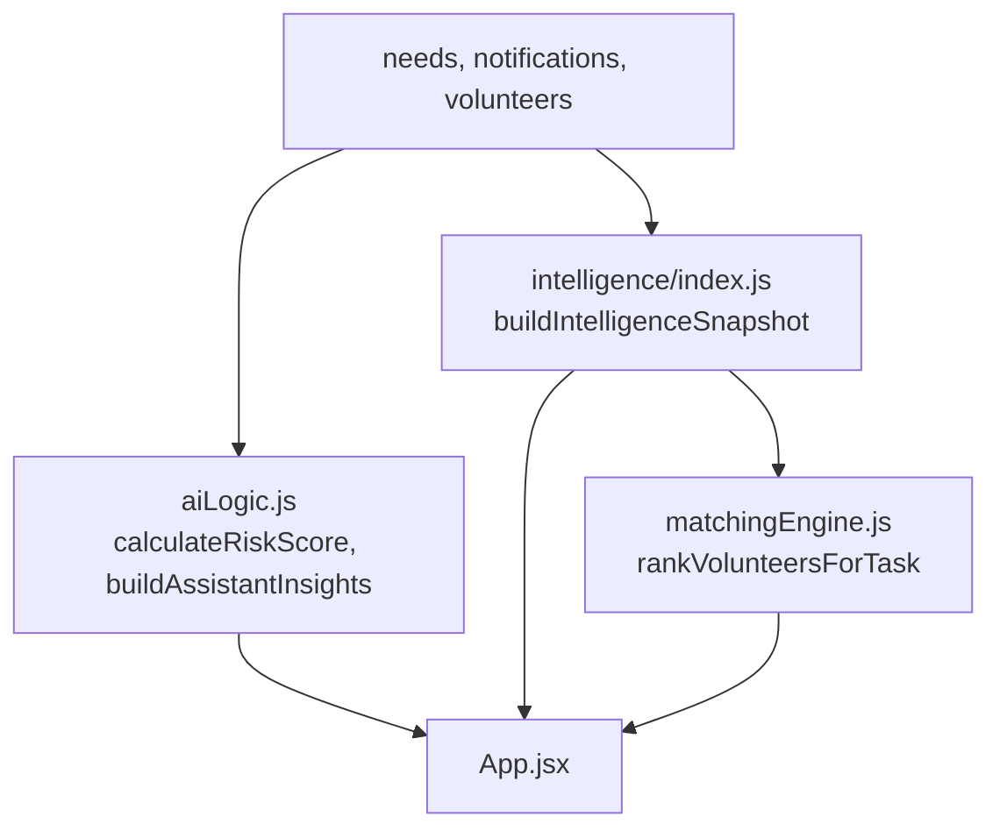

**Diagram sources**
- [aiLogic.js:16-64](file://src/utils/aiLogic.js#L16-L64)
- [intelligence/index.js:6-42](file://src/services/intelligence/index.js#L6-L42)
- [matchingEngine.js:149-174](file://src/engine/matchingEngine.js#L149-L174)

**Section sources**
- [aiLogic.js:1-128](file://src/utils/aiLogic.js#L1-L128)
- [intelligence/index.js:1-43](file://src/services/intelligence/index.js#L1-L43)
- [matchingEngine.js:1-174](file://src/engine/matchingEngine.js#L1-L174)

## Dependency Analysis
The application exhibits low coupling and high cohesion:
- App.jsx depends on services, hooks, and utilities but delegates concerns to specialized modules.
- Components import shared theme tokens and helpers from theme.js.
- Vite configuration centralizes plugin and proxy setup.

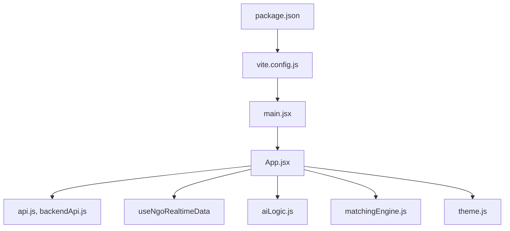

**Diagram sources**
- [main.jsx:1-5](file://src/main.jsx#L1-L5)
- [App.jsx:1-16](file://src/App.jsx#L1-L16)
- [api.js:1-11](file://src/services/api.js#L1-L11)
- [backendApi.js:1-8](file://src/services/backendApi.js#L1-L8)
- [useNgoRealtimeData.js:1-6](file://src/hooks/useNgoRealtimeData.js#L1-L6)
- [aiLogic.js:1-1](file://src/utils/aiLogic.js#L1-L1)
- [matchingEngine.js:1-1](file://src/engine/matchingEngine.js#L1-L1)
- [theme.js:1-1](file://src/styles/theme.js#L1-L1)
- [vite.config.js:1-7](file://vite.config.js#L1-L7)
- [package.json:1-41](file://package.json#L1-L41)

**Section sources**
- [main.jsx:1-5](file://src/main.jsx#L1-L5)
- [App.jsx:1-16](file://src/App.jsx#L1-L16)
- [vite.config.js:1-19](file://vite.config.js#L1-L19)
- [package.json:1-43](file://package.json#L1-L43)

## Performance Considerations
- Memoization: App.jsx uses useMemo for intelligence snapshots to prevent unnecessary recomputation when dependencies are unchanged.
- Real-time deduplication: useNgoRealtimeData compares previous and current lists to avoid redundant renders.
- Caching: api.js caches per-NGO datasets and coordinates computed from seeds to reduce repeated work.
- Lazy loading: Consider code-splitting page components for larger views to reduce initial bundle size.
- Animation optimization: Framer Motion animations are scoped to page transitions; keep animation complexity proportional to screen area.
- Network efficiency: backendApi.js stores JWT in sessionStorage to avoid re-authentication across reloads; batch Firestore writes where possible.

[No sources needed since this section provides general guidance]

## Troubleshooting Guide
- Startup diagnostics: main.jsx includes console diagnostics and a fallback UI for rendering stack exceptions, aiding early detection of root element or render issues.
- Real-time subscription cleanup: useNgoRealtimeData returns unsubscribe functions to prevent memory leaks; ensure proper cleanup on unmount.
- Backend token persistence: backendApi.js stores JWT in sessionStorage; verify token presence and validity when backend features are unavailable.
- Firebase connectivity: api.js falls back to cached data if incident fetch fails; monitor console warnings for graceful degradation.

**Section sources**
- [main.jsx:12-54](file://src/main.jsx#L12-L54)
- [useNgoRealtimeData.js:67-72](file://src/hooks/useNgoRealtimeData.js#L67-L72)
- [backendApi.js:19-30](file://src/services/backendApi.js#L19-L30)
- [api.js:303-307](file://src/services/api.js#L303-L307)

## Conclusion
Echo5 demonstrates a clean, modular React architecture with strong separation of concerns. The root component orchestrates global state, real-time data, and AI-driven insights while maintaining a responsive UI through provider wrappers and optimized rendering. The Vite configuration supports efficient development with Tailwind integration and API proxying. By leveraging memoization, caching, and real-time subscriptions, the application balances performance and user experience.

[No sources needed since this section summarizes without analyzing specific files]

## Appendices

### Environment Variables
- Firebase configuration: VITE_FIREBASE_API_KEY, VITE_AUTH_DOMAIN are loaded from environment variables.
- Backend base URL: VITE_API_URL controls the API base path in development and production.

**Section sources**
- [firebase.js:10-19](file://src/firebase.js#L10-L19)
- [backendApi.js:17-17](file://src/services/backendApi.js#L17-L17)

### Import/Export Patterns
- Feature-based grouping: components, pages, services, hooks, engines, and utils are organized by domain.
- Centralized exports: theme.js exports design tokens and helpers; intelligence/index.js aggregates engine outputs.
- Service boundaries: api.js and backendApi.js isolate data access concerns.

**Section sources**
- [theme.js:1-57](file://src/styles/theme.js#L1-L57)
- [intelligence/index.js:1-43](file://src/services/intelligence/index.js#L1-L43)
- [api.js:295-562](file://src/services/api.js#L295-L562)
- [backendApi.js:56-163](file://src/services/backendApi.js#L56-L163)