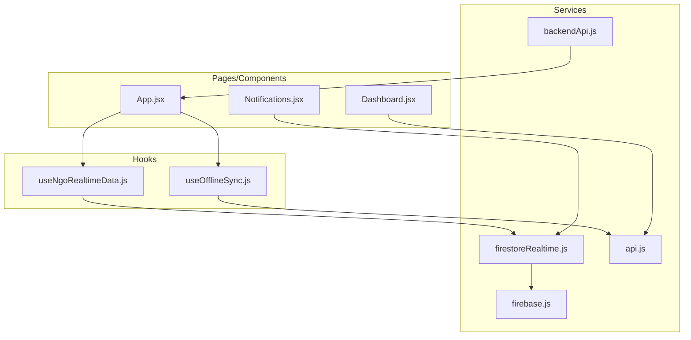
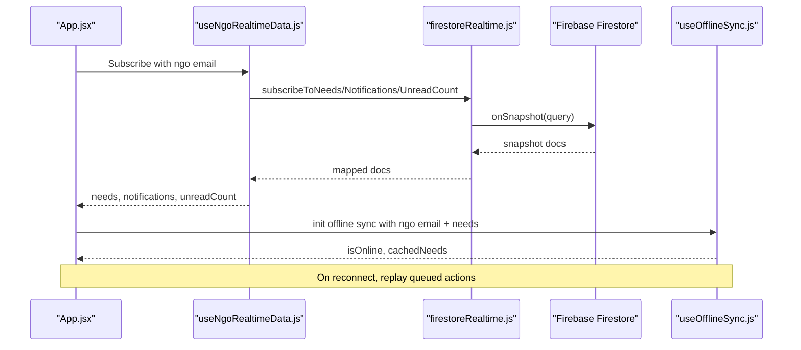
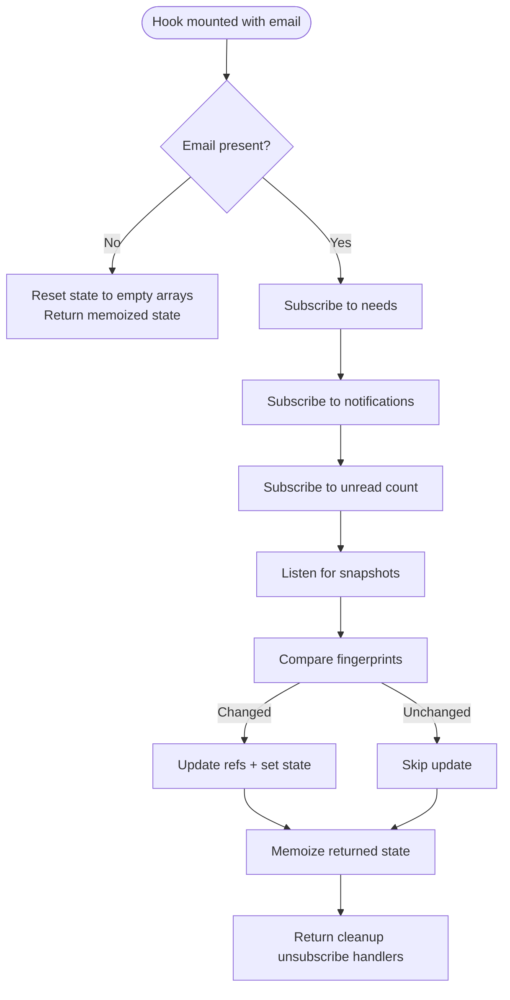
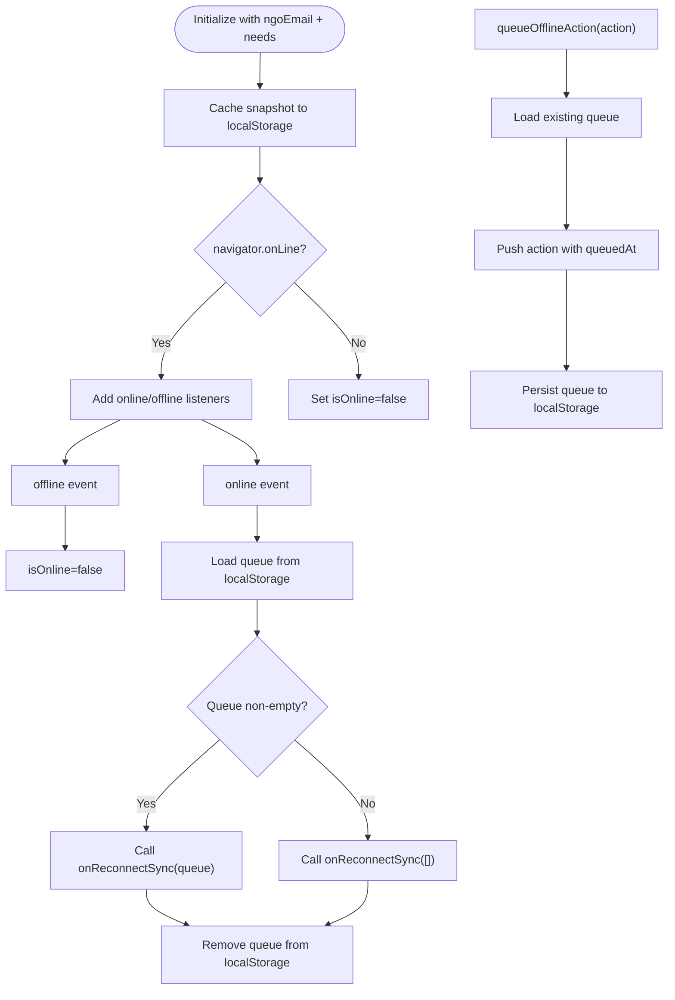
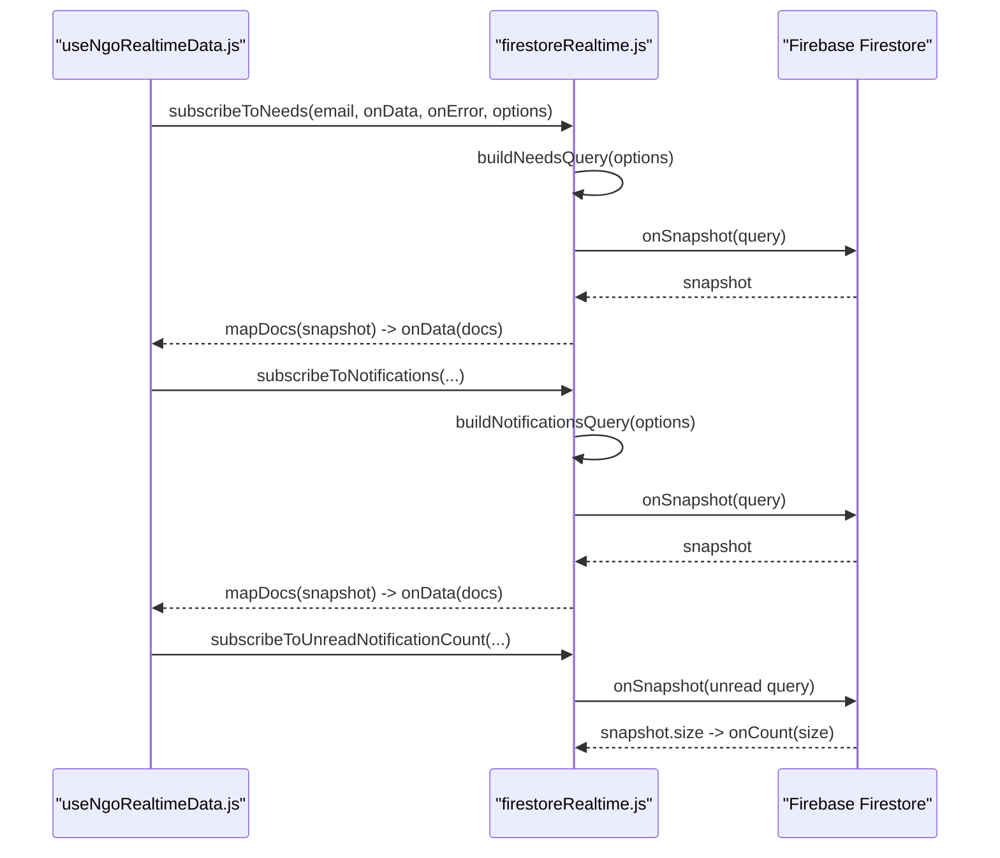
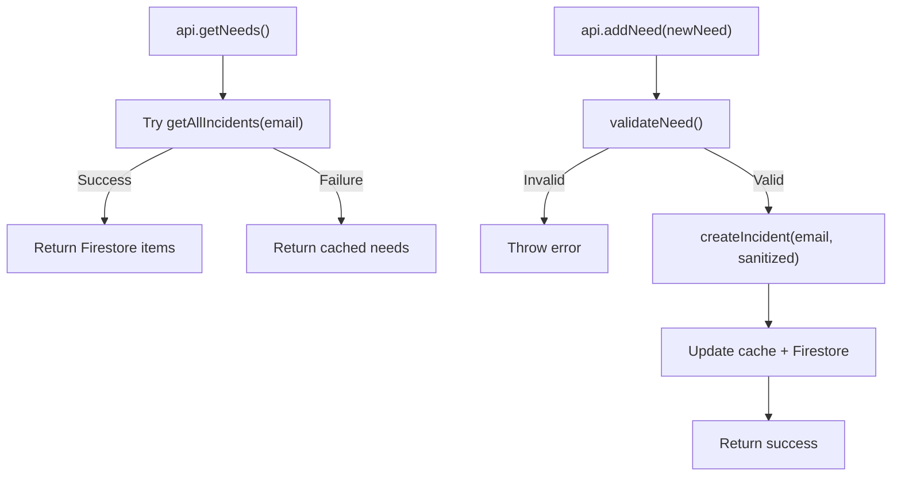
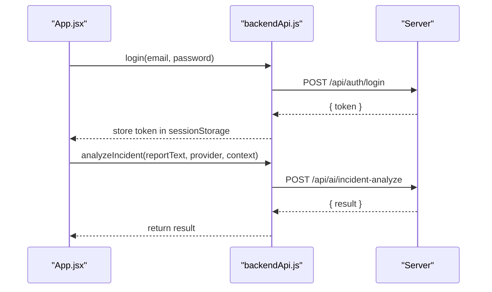
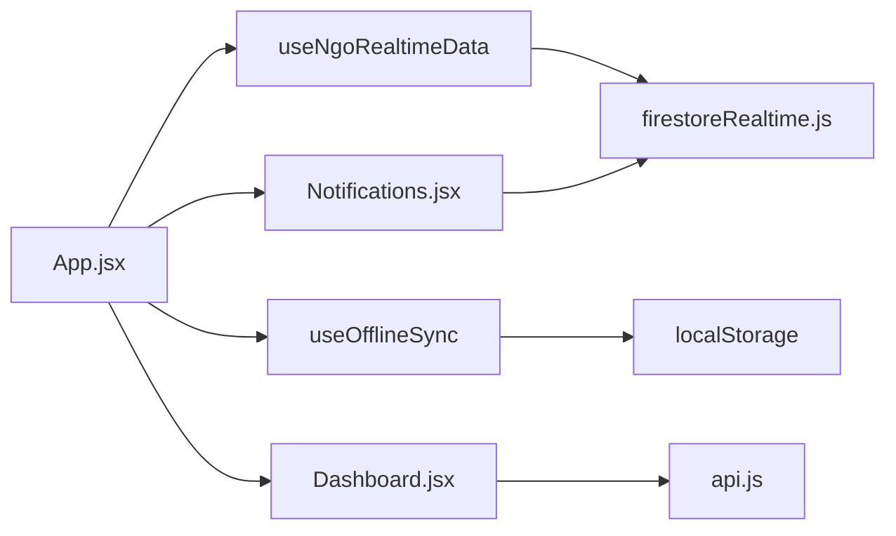
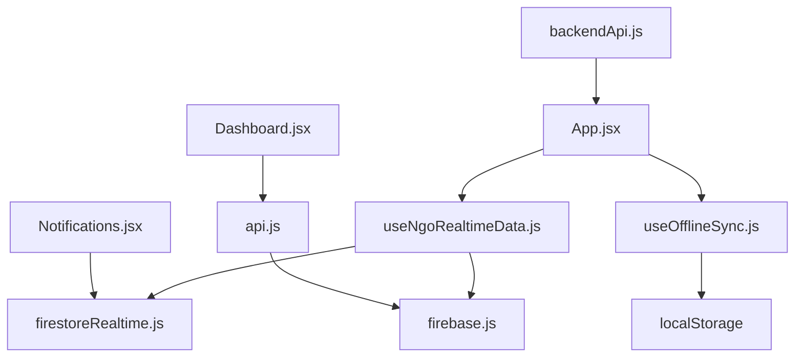

# State Management

<cite>
**Referenced Files in This Document**
- [useNgoRealtimeData.js](file://src/hooks/useNgoRealtimeData.js)
- [useOfflineSync.js](file://src/hooks/useOfflineSync.js)
- [firestoreRealtime.js](file://src/services/firestoreRealtime.js)
- [firebase.js](file://src/firebase.js)
- [backendApi.js](file://src/services/backendApi.js)
- [api.js](file://src/services/api.js)
- [App.jsx](file://src/App.jsx)
- [Dashboard.jsx](file://src/pages/Dashboard.jsx)
- [Notifications.jsx](file://src/pages/Notifications.jsx)
- [validation.js](file://src/utils/validation.js)
- [aiLogic.js](file://src/utils/aiLogic.js)
- [matchingEngine.js](file://src/engine/matchingEngine.js)
- [server matchingEngine.js](file://server/services/matchingEngine.js)
</cite>

## Table of Contents
1. [Introduction](#introduction)
2. [Project Structure](#project-structure)
3. [Core Components](#core-components)
4. [Architecture Overview](#architecture-overview)
5. [Detailed Component Analysis](#detailed-component-analysis)
6. [Dependency Analysis](#dependency-analysis)
7. [Performance Considerations](#performance-considerations)
8. [Troubleshooting Guide](#troubleshooting-guide)
9. [Conclusion](#conclusion)

## Introduction
This document explains the state management patterns and data flow architecture used by the application. It focuses on:
- Real-time synchronization with Firebase Firestore using custom hooks
- Offline-first capabilities with local persistence and reconnection sync
- Backend API service layer for secure operations and AI features
- Real-time subscriptions, local state persistence, and conflict resolution strategies
- State synchronization across components and performance/memory optimizations
- Integration with Firebase Firestore for real-time updates and offline-first behavior

## Project Structure
The state management spans three primary layers:
- Hooks layer: Custom React hooks for real-time subscriptions and offline sync
- Services layer: Firestore integration and backend API clients
- Pages/components layer: UI components consuming state and orchestrating actions

**Diagram sources**
- [useNgoRealtimeData.js:1-83](file://src/hooks/useNgoRealtimeData.js#L1-L83)
- [useOfflineSync.js:1-72](file://src/hooks/useOfflineSync.js#L1-L72)
- [firestoreRealtime.js:1-212](file://src/services/firestoreRealtime.js#L1-L212)
- [backendApi.js:1-164](file://src/services/backendApi.js#L1-L164)
- [api.js:1-599](file://src/services/api.js#L1-L599)
- [firebase.js:1-35](file://src/firebase.js#L1-L35)
- [App.jsx:1-285](file://src/App.jsx#L1-L285)
- [Dashboard.jsx:1-530](file://src/pages/Dashboard.jsx#L1-L530)
- [Notifications.jsx:1-194](file://src/pages/Notifications.jsx#L1-L194)

**Section sources**
- [App.jsx:62-62](file://src/App.jsx#L62-L62)
- [App.jsx:127-133](file://src/App.jsx#L127-L133)
- [Dashboard.jsx:58-83](file://src/pages/Dashboard.jsx#L58-L83)
- [Notifications.jsx:18-31](file://src/pages/Notifications.jsx#L18-L31)

## Core Components
- Real-time hook: Subscribes to Firestore collections and normalizes data for consumption
- Offline sync hook: Persists snapshots and queues actions while offline, replays on reconnect
- Firestore service: Provides typed listeners, queries, and mutations
- Backend API client: Manages JWT tokens and exposes secure endpoints
- Local API facade: Wraps Firestore and caches data for offline-first UX
- Validation utilities: Sanitize and validate inputs before persistence
- AI/state builders: Compute risk, insights, and intelligence snapshots

**Section sources**
- [useNgoRealtimeData.js:26-82](file://src/hooks/useNgoRealtimeData.js#L26-L82)
- [useOfflineSync.js:13-71](file://src/hooks/useOfflineSync.js#L13-L71)
- [firestoreRealtime.js:61-116](file://src/services/firestoreRealtime.js#L61-L116)
- [backendApi.js:56-163](file://src/services/backendApi.js#L56-L163)
- [api.js:295-562](file://src/services/api.js#L295-L562)
- [validation.js:30-80](file://src/utils/validation.js#L30-L80)
- [aiLogic.js:16-64](file://src/utils/aiLogic.js#L16-L64)

## Architecture Overview
The system integrates real-time Firestore updates with a local offline-first strategy and a backend API layer for secure operations.

**Diagram sources**
- [App.jsx:62-62](file://src/App.jsx#L62-L62)
- [App.jsx:127-133](file://src/App.jsx#L127-L133)
- [useNgoRealtimeData.js:33-72](file://src/hooks/useNgoRealtimeData.js#L33-L72)
- [firestoreRealtime.js:61-116](file://src/services/firestoreRealtime.js#L61-L116)
- [useOfflineSync.js:16-50](file://src/hooks/useOfflineSync.js#L16-L50)

## Detailed Component Analysis

### Real-Time Data Hook: useNgoRealtimeData
- Responsibilities:
  - Establish Firestore listeners for needs, notifications, and unread counts
  - Normalize lists with a fingerprint comparator to avoid unnecessary renders
  - Expose memoized state for downstream consumers
- Key behaviors:
  - Subscriptions are created when email is present and torn down on unmount
  - Fingerprint comparison short-circuits updates when items are unchanged
  - Page size limits applied per collection to control payload sizes

**Diagram sources**
- [useNgoRealtimeData.js:26-82](file://src/hooks/useNgoRealtimeData.js#L26-L82)
- [firestoreRealtime.js:61-116](file://src/services/firestoreRealtime.js#L61-L116)

**Section sources**
- [useNgoRealtimeData.js:8-24](file://src/hooks/useNgoRealtimeData.js#L8-L24)
- [useNgoRealtimeData.js:33-72](file://src/hooks/useNgoRealtimeData.js#L33-L72)
- [firestoreRealtime.js:29-59](file://src/services/firestoreRealtime.js#L29-L59)

### Offline Sync Hook: useOfflineSync
- Responsibilities:
  - Persist a recent snapshot to localStorage keyed by NGO email
  - Queue actions while offline and replay them on reconnect
  - Expose online/offline status and cached data
- Key behaviors:
  - Snapshot caching capped to a small number of items
  - Queue stored as JSON with timestamps
  - Reconnect handler invokes a callback to reconcile state

**Diagram sources**
- [useOfflineSync.js:13-71](file://src/hooks/useOfflineSync.js#L13-L71)

**Section sources**
- [useOfflineSync.js:16-50](file://src/hooks/useOfflineSync.js#L16-L50)
- [useOfflineSync.js:52-64](file://src/hooks/useOfflineSync.js#L52-L64)

### Firestore Integration: Real-Time Subscriptions and Mutations
- Subscriptions:
  - Needs: paginated by timestamp desc, optional status filters
  - Resources: paginated by updatedAt desc, optional availability filter
  - Notifications: paginated by createdAt desc, optional unread filter and cursor-based pagination
  - Unread count: derived via a size listener on unread documents
- Mutations:
  - Add/update/delete incidents with server timestamps and validation
  - Create resources with sanitized fields
- Error handling:
  - Listeners pass errors to caller-provided onError callbacks
  - Mutations log and rethrow for upstream handling

**Diagram sources**
- [useNgoRealtimeData.js:41-65](file://src/hooks/useNgoRealtimeData.js#L41-L65)
- [firestoreRealtime.js:29-59](file://src/services/firestoreRealtime.js#L29-L59)
- [firestoreRealtime.js:61-116](file://src/services/firestoreRealtime.js#L61-L116)

**Section sources**
- [firestoreRealtime.js:23-27](file://src/services/firestoreRealtime.js#L23-L27)
- [firestoreRealtime.js:29-59](file://src/services/firestoreRealtime.js#L29-L59)
- [firestoreRealtime.js:105-116](file://src/services/firestoreRealtime.js#L105-L116)
- [firestoreRealtime.js:118-130](file://src/services/firestoreRealtime.js#L118-L130)
- [firestoreRealtime.js:132-182](file://src/services/firestoreRealtime.js#L132-L182)

### Local API Facade: Offline-First Data Access
- Purpose:
  - Provide a unified interface to needs, volunteers, notifications, and charts
  - Fall back to cached data when Firestore reads fail
  - Write changes to Firestore and update local cache atomically
- Offline-first strategy:
  - On read failures, return cached data and continue operating
  - On successful writes, update cache and persist to Firestore
- Validation:
  - Inputs are sanitized and validated before persistence to prevent malformed data

**Diagram sources**
- [api.js:299-310](file://src/services/api.js#L299-L310)
- [api.js:375-394](file://src/services/api.js#L375-L394)
- [validation.js:30-80](file://src/utils/validation.js#L30-L80)
- [firestoreRealtime.js:132-156](file://src/services/firestoreRealtime.js#L132-L156)

**Section sources**
- [api.js:295-562](file://src/services/api.js#L295-L562)
- [validation.js:30-80](file://src/utils/validation.js#L30-L80)

### Backend API Service Layer
- Token management:
  - Stores JWT in session storage; clears on logout
  - Automatically attaches Authorization header to requests
- Endpoints:
  - Auth: login (obtain token)
  - AI: document parsing, incident analysis, chat, match explanation
  - Matching: rank volunteers, batch recommendations
  - Monitoring: health check, cache stats
- Request/response:
  - Non-OK responses parse JSON bodies and surface details
  - Errors carry status and details for UI handling

**Diagram sources**
- [backendApi.js:56-82](file://src/services/backendApi.js#L56-L82)
- [backendApi.js:90-105](file://src/services/backendApi.js#L90-L105)

**Section sources**
- [backendApi.js:19-54](file://src/services/backendApi.js#L19-L54)
- [backendApi.js:56-163](file://src/services/backendApi.js#L56-L163)

### State Synchronization Across Components
- App orchestrates:
  - Real-time data via useNgoRealtimeData
  - Offline sync via useOfflineSync
  - Intelligence computations from live and cached data
  - Navigation and emergency mode toggles
- Dashboard and Notifications consume:
  - Live needs from real-time hook
  - Live notifications from Firestore
  - Offline fallback via cached needs

**Diagram sources**
- [App.jsx:62-62](file://src/App.jsx#L62-L62)
- [App.jsx:127-133](file://src/App.jsx#L127-L133)
- [Dashboard.jsx:58-83](file://src/pages/Dashboard.jsx#L58-L83)
- [Notifications.jsx:18-31](file://src/pages/Notifications.jsx#L18-L31)

**Section sources**
- [App.jsx:127-135](file://src/App.jsx#L127-L135)
- [Dashboard.jsx:58-83](file://src/pages/Dashboard.jsx#L58-L83)
- [Notifications.jsx:18-31](file://src/pages/Notifications.jsx#L18-L31)

### Conflict Resolution Strategies
- Real-time updates:
  - Fingerprint comparison prevents redundant renders
  - Cursor-based pagination for notifications avoids duplicates
- Offline-first writes:
  - Local cache updated immediately; Firestore writes are best-effort
  - On reconnect, queued actions are replayed; UI remains responsive
- Validation:
  - Inputs sanitized and validated before persistence to prevent inconsistent states

**Section sources**
- [useNgoRealtimeData.js:8-24](file://src/hooks/useNgoRealtimeData.js#L8-L24)
- [useOfflineSync.js:26-40](file://src/hooks/useOfflineSync.js#L26-L40)
- [api.js:375-394](file://src/services/api.js#L375-L394)
- [validation.js:30-80](file://src/utils/validation.js#L30-L80)

### Performance and Memory Optimizations
- Efficient updates:
  - Fingerprint-based equality reduces re-renders
  - Pagination limits minimize payload sizes
- Caching:
  - Local snapshot caching for offline resilience
  - Session-scoped token caching for backend API
- Computation:
  - Memoized intelligence snapshots and derived stats
  - Client/server matching engines aligned to keep scoring consistent

**Section sources**
- [useNgoRealtimeData.js:74-81](file://src/hooks/useNgoRealtimeData.js#L74-L81)
- [firestoreRealtime.js:29-59](file://src/services/firestoreRealtime.js#L29-L59)
- [useOfflineSync.js:60-64](file://src/hooks/useOfflineSync.js#L60-L64)
- [backendApi.js:19-29](file://src/services/backendApi.js#L19-L29)
- [App.jsx:156-164](file://src/App.jsx#L156-L164)
- [matchingEngine.js:143-173](file://src/engine/matchingEngine.js#L143-L173)
- [server matchingEngine.js:166-182](file://server/services/matchingEngine.js#L166-L182)

## Dependency Analysis
- Hooks depend on Firestore service for subscriptions and mutations
- App composes hooks and passes state to pages
- Pages depend on local API facade and Firestore service
- Backend API client depends on environment variables for base URL and token storage

**Diagram sources**
- [useNgoRealtimeData.js:1-6](file://src/hooks/useNgoRealtimeData.js#L1-L6)
- [firestoreRealtime.js:1-16](file://src/services/firestoreRealtime.js#L1-L16)
- [firebase.js:1-35](file://src/firebase.js#L1-L35)
- [useOfflineSync.js:1-11](file://src/hooks/useOfflineSync.js#L1-L11)
- [App.jsx:6-8](file://src/App.jsx#L6-L8)
- [Dashboard.jsx:5-5](file://src/pages/Dashboard.jsx#L5-L5)
- [Notifications.jsx:4-5](file://src/pages/Notifications.jsx#L4-L5)
- [api.js:1-11](file://src/services/api.js#L1-L11)
- [backendApi.js:17-29](file://src/services/backendApi.js#L17-L29)

**Section sources**
- [App.jsx:6-8](file://src/App.jsx#L6-L8)
- [Dashboard.jsx:5-5](file://src/pages/Dashboard.jsx#L5-L5)
- [Notifications.jsx:4-5](file://src/pages/Notifications.jsx#L4-L5)
- [backendApi.js:17-29](file://src/services/backendApi.js#L17-L29)

## Performance Considerations
- Prefer cursor-based pagination for notifications to avoid duplicates and manage large lists
- Limit page sizes for real-time lists to reduce bandwidth and render pressure
- Use memoization for derived data (e.g., intelligence snapshots) to avoid recomputation
- Cache frequently accessed data locally to minimize network round trips
- Validate and sanitize inputs early to prevent expensive retries or UI thrashing

## Troubleshooting Guide
- Real-time listener errors:
  - Inspect error callbacks from Firestore listeners and surface actionable messages to users
- Offline sync issues:
  - Verify localStorage availability and queue persistence
  - Confirm onReconnectSync callback handles empty queues gracefully
- Backend API errors:
  - Check token presence and validity; ensure VITE_API_URL is configured
  - Log non-OK responses to capture details for debugging
- Validation failures:
  - Review sanitized data and error messages from validation utilities

**Section sources**
- [firestoreRealtime.js:68-71](file://src/services/firestoreRealtime.js#L68-L71)
- [firestoreRealtime.js:84-87](file://src/services/firestoreRealtime.js#L84-L87)
- [firestoreRealtime.js:98-101](file://src/services/firestoreRealtime.js#L98-L101)
- [useOfflineSync.js:33-37](file://src/hooks/useOfflineSync.js#L33-L37)
- [backendApi.js:45-51](file://src/services/backendApi.js#L45-L51)
- [validation.js:26-28](file://src/utils/validation.js#L26-L28)

## Conclusion
The application employs a layered state management strategy:
- Real-time subscriptions powered by Firestore ensure live updates
- Offline-first persistence with local caching and queued actions guarantees resilience
- A backend API client secures sensitive operations and AI features
- Validation and memoization optimize correctness and performance
- Clear separation of concerns enables maintainable, scalable state flows across components