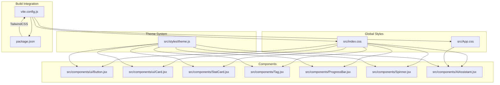
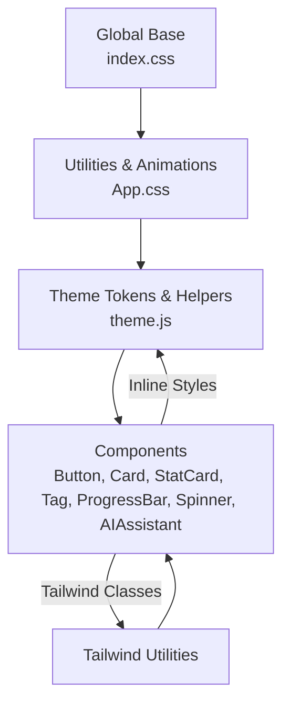
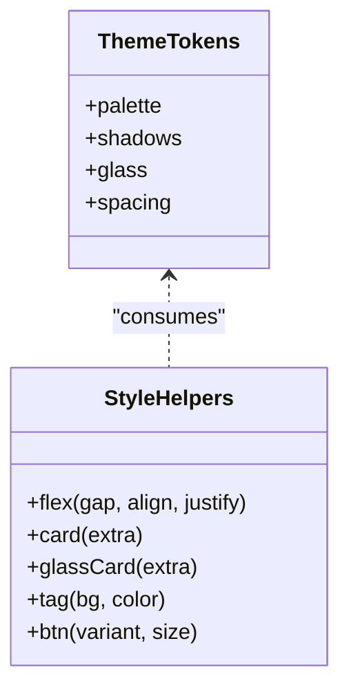
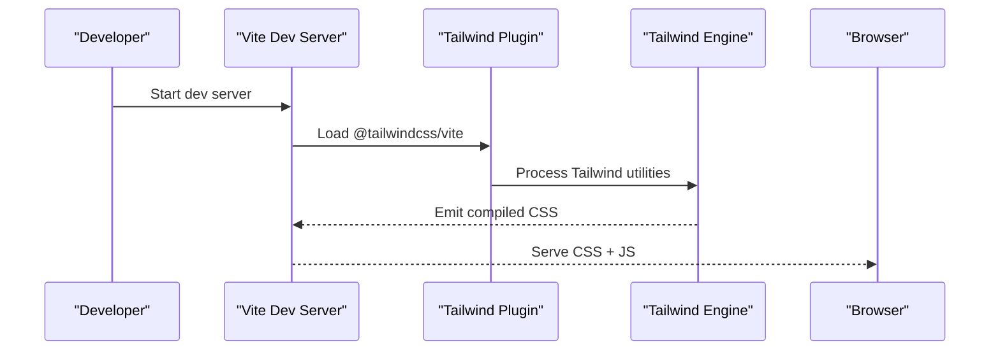
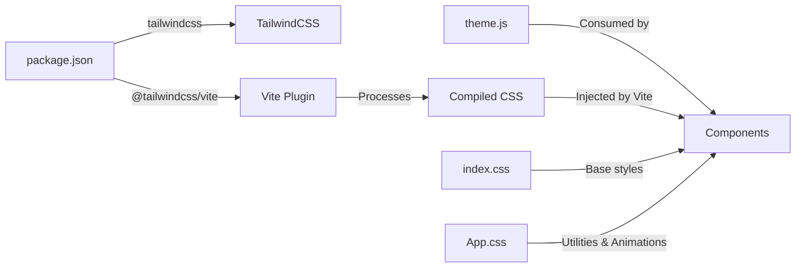

# Styling and Theming

<cite>
**Referenced Files in This Document**
- [theme.js](file://src/styles/theme.js)
- [App.css](file://src/App.css)
- [index.css](file://src/index.css)
- [vite.config.js](file://vite.config.js)
- [package.json](file://package.json)
- [Button.jsx](file://src/components/ui/Button.jsx)
- [Card.jsx](file://src/components/ui/Card.jsx)
- [AIAssistant.jsx](file://src/components/AIAssistant.jsx)
- [StatCard.jsx](file://src/components/StatCard.jsx)
- [Tag.jsx](file://src/components/Tag.jsx)
- [ProgressBar.jsx](file://src/components/ProgressBar.jsx)
- [Spinner.jsx](file://src/components/Spinner.jsx)
</cite>

## Table of Contents
1. [Introduction](#introduction)
2. [Project Structure](#project-structure)
3. [Core Components](#core-components)
4. [Architecture Overview](#architecture-overview)
5. [Detailed Component Analysis](#detailed-component-analysis)
6. [Dependency Analysis](#dependency-analysis)
7. [Performance Considerations](#performance-considerations)
8. [Troubleshooting Guide](#troubleshooting-guide)
9. [Conclusion](#conclusion)

## Introduction
This document explains the styling and theming system used across the project. It covers the design tokens and helpers, the TailwindCSS integration, the custom theme definitions, the color palette, responsive design patterns, component styling approaches, and the CSS-in-JS patterns used. It also documents the global CSS structure, component-level styling isolation, and cross-browser compatibility strategies.

## Project Structure
The styling system is composed of:
- Global CSS files that define base styles, design tokens via CSS variables, and reusable layout utilities.
- A JavaScript-based theme module that exports design tokens and helper factories for consistent component styling.
- TailwindCSS integration via Vite and the Tailwind plugin to enable utility-first CSS alongside custom styles.
- Component-level styles that either use Tailwind utilities, the theme helpers, or inline styles with theme tokens.

**Diagram sources**
- [index.css:1-53](file://src/index.css#L1-L53)
- [App.css:1-425](file://src/App.css#L1-L425)
- [theme.js:1-57](file://src/styles/theme.js#L1-L57)
- [vite.config.js:1-19](file://vite.config.js#L1-L19)
- [package.json:1-43](file://package.json#L1-L43)
- [Button.jsx:1-22](file://src/components/ui/Button.jsx#L1-L22)
- [Card.jsx:1-15](file://src/components/ui/Card.jsx#L1-L15)
- [StatCard.jsx:1-50](file://src/components/StatCard.jsx#L1-L50)
- [Tag.jsx:1-13](file://src/components/Tag.jsx#L1-L13)
- [ProgressBar.jsx:1-17](file://src/components/ProgressBar.jsx#L1-L17)
- [Spinner.jsx:1-11](file://src/components/Spinner.jsx#L1-L11)
- [AIAssistant.jsx:1-311](file://src/components/AIAssistant.jsx#L1-L311)

**Section sources**
- [index.css:1-53](file://src/index.css#L1-L53)
- [App.css:1-425](file://src/App.css#L1-L425)
- [theme.js:1-57](file://src/styles/theme.js#L1-L57)
- [vite.config.js:1-19](file://vite.config.js#L1-L19)
- [package.json:1-43](file://package.json#L1-L43)

## Core Components
- Design tokens and helpers: Centralized palette, shadows, and reusable style factories for buttons, cards, tags, and spacing.
- Global CSS: Base typography, layout utilities, animations, and responsive breakpoints.
- TailwindCSS integration: Utility-first CSS enabled via Vite and the Tailwind plugin.
- Component styling patterns: Mix of Tailwind utilities, theme helpers, and inline styles with tokens.

Key implementation references:
- Theme tokens and helpers: [theme.js:1-57](file://src/styles/theme.js#L1-L57)
- Global base styles and utilities: [index.css:1-53](file://src/index.css#L1-L53), [App.css:1-425](file://src/App.css#L1-L425)
- Tailwind integration: [vite.config.js:1-19](file://vite.config.js#L1-L19), [package.json:12-29](file://package.json#L12-L29)

**Section sources**
- [theme.js:1-57](file://src/styles/theme.js#L1-L57)
- [index.css:1-53](file://src/index.css#L1-L53)
- [App.css:1-425](file://src/App.css#L1-L425)
- [vite.config.js:1-19](file://vite.config.js#L1-L19)
- [package.json:12-29](file://package.json#L12-L29)

## Architecture Overview
The styling architecture blends three layers:
- Global baseline: Fonts, base element resets, and global utilities.
- Theme layer: JavaScript tokens and helper factories for consistent component styling.
- Component layer: Tailwind utilities, theme helpers, and inline styles with tokens.

**Diagram sources**
- [index.css:1-53](file://src/index.css#L1-L53)
- [App.css:1-425](file://src/App.css#L1-L425)
- [theme.js:1-57](file://src/styles/theme.js#L1-L57)
- [Button.jsx:1-22](file://src/components/ui/Button.jsx#L1-L22)
- [Card.jsx:1-15](file://src/components/ui/Card.jsx#L1-L15)
- [StatCard.jsx:1-50](file://src/components/StatCard.jsx#L1-L50)
- [Tag.jsx:1-13](file://src/components/Tag.jsx#L1-L13)
- [ProgressBar.jsx:1-17](file://src/components/ProgressBar.jsx#L1-L17)
- [Spinner.jsx:1-11](file://src/components/Spinner.jsx#L1-L11)
- [AIAssistant.jsx:1-311](file://src/components/AIAssistant.jsx#L1-L311)

## Detailed Component Analysis

### Theme System and Color Palette
The theme system defines:
- A palette of semantic colors (primary, success, danger, warning, accents) and surfaces (background, surface, borders, text).
- Shadow presets for layered, elevated UI.
- Glassmorphism tokens for frosted effects.
- Helper factories for consistent button, card, tag, and flex layouts.

**Diagram sources**
- [theme.js:1-57](file://src/styles/theme.js#L1-L57)

**Section sources**
- [theme.js:1-57](file://src/styles/theme.js#L1-L57)

### Global CSS Structure and Responsive Design
Global CSS establishes:
- CSS variables for design tokens and spacing.
- Layout utilities (grid, flex, stepper, metrics).
- Responsive media queries for tablet and mobile breakpoints.
- Animations (spin, pulse, fadeSlideIn) used across components.

Responsive patterns:
- Breakpoints at 900px and 640px adjust grid layouts and paddings.
- Typography scales using clamp for fluid headings.

**Section sources**
- [App.css:1-425](file://src/App.css#L1-L425)
- [index.css:1-53](file://src/index.css#L1-L53)

### TailwindCSS Integration
Tailwind is integrated via Vite and the Tailwind plugin. The project depends on Tailwind v4 and the Vite plugin to process utilities during development and build.

**Diagram sources**
- [vite.config.js:1-19](file://vite.config.js#L1-L19)
- [package.json:12-29](file://package.json#L12-L29)

**Section sources**
- [vite.config.js:1-19](file://vite.config.js#L1-L19)
- [package.json:12-29](file://package.json#L12-L29)

### Component Styling Patterns
- Utility-first with Tailwind: Many components use Tailwind classes for layout, colors, and spacing.
- Theme helpers: Components consume the theme module for consistent tokens and helper-generated styles.
- Inline styles with tokens: Some components apply inline styles using theme tokens for dynamic effects (e.g., gradients, shadows).
- Motion integration: Framer Motion is used for micro-interactions and animated transitions.

Examples:
- Button: Uses Tailwind gradient classes and theme tokens for hover/active states.
- Card: Uses theme helper for glass and neon effects.
- StatCard: Uses theme helper for card styles and gradient accents.
- Tag: Uses theme helper for tag styles with mapped semantic colors.
- ProgressBar: Uses theme tokens for track and fill colors.
- Spinner: Uses theme tokens for spinner colors and keyframe animation.
- AIAssistant: Uses theme tokens for backgrounds, gradients, and interactive states.

**Section sources**
- [Button.jsx:1-22](file://src/components/ui/Button.jsx#L1-L22)
- [Card.jsx:1-15](file://src/components/ui/Card.jsx#L1-L15)
- [StatCard.jsx:1-50](file://src/components/StatCard.jsx#L1-L50)
- [Tag.jsx:1-13](file://src/components/Tag.jsx#L1-L13)
- [ProgressBar.jsx:1-17](file://src/components/ProgressBar.jsx#L1-L17)
- [Spinner.jsx:1-11](file://src/components/Spinner.jsx#L1-L11)
- [AIAssistant.jsx:1-311](file://src/components/AIAssistant.jsx#L1-L311)
- [theme.js:1-57](file://src/styles/theme.js#L1-L57)

### Dark/Light Mode Support
- The project uses CSS variables for design tokens, enabling easy switching between dark/light themes by updating variable values at runtime or via a class on the root element.
- Global base styles define a dark theme background and text colors; semantic tokens can be overridden to switch palettes.

Recommendations:
- Toggle a class on the root element to switch themes.
- Maintain separate variable sets for light and dark modes.
- Use CSS custom properties for colors, shadows, and backgrounds to minimize reflows.

**Section sources**
- [index.css:15-22](file://src/index.css#L15-L22)
- [App.css:1-15](file://src/App.css#L1-L15)

### Accessibility Considerations
- Focus states: Ensure focus-visible outlines for interactive elements.
- Contrast: Verify sufficient contrast between foreground and background colors using theme tokens.
- Motion preferences: Respect reduced motion settings; avoid persistent animations.
- Semantic HTML: Combine Tailwind utilities with semantic elements for screen reader support.

[No sources needed since this section provides general guidance]

### Cross-Browser Compatibility Strategies
- Normalize base styles and typography using global CSS.
- Prefer modern CSS features (CSS variables, clamp, backdrop-filter) with appropriate fallbacks.
- Test animations and transforms across browsers; provide degraded experiences when needed.
- Use vendor-prefixed properties sparingly; rely on Tailwind and PostCSS for compatibility.

**Section sources**
- [index.css:1-53](file://src/index.css#L1-L53)
- [App.css:1-425](file://src/App.css#L1-L425)

## Dependency Analysis
The styling stack depends on TailwindCSS and the Vite plugin. The theme module is consumed by components and global CSS.

**Diagram sources**
- [package.json:12-29](file://package.json#L12-L29)
- [vite.config.js:1-19](file://vite.config.js#L1-L19)
- [theme.js:1-57](file://src/styles/theme.js#L1-L57)
- [index.css:1-53](file://src/index.css#L1-L53)
- [App.css:1-425](file://src/App.css#L1-L425)

**Section sources**
- [package.json:12-29](file://package.json#L12-L29)
- [vite.config.js:1-19](file://vite.config.js#L1-L19)
- [theme.js:1-57](file://src/styles/theme.js#L1-L57)
- [index.css:1-53](file://src/index.css#L1-L53)
- [App.css:1-425](file://src/App.css#L1-L425)

## Performance Considerations
- Minimize inline styles: Prefer Tailwind utilities and theme helpers to reduce style recalculation.
- Use CSS variables for shared values to reduce bundle size and improve maintainability.
- Limit heavy animations and backdrop filters on lower-powered devices.
- Scope global styles carefully to avoid unnecessary repaints and reflows.

[No sources needed since this section provides general guidance]

## Troubleshooting Guide
Common styling issues and resolutions:
- Tailwind utilities not applied: Ensure the Tailwind plugin is configured in Vite and Tailwind is imported in the global CSS.
- Theme tokens not resolving: Verify the theme module is imported and tokens are used consistently across components.
- Animation glitches: Reduce motion or disable problematic animations for users with motion sensitivity.
- Responsive layout shifts: Use clamp for fluid typography and ensure media queries are defined in global CSS.

**Section sources**
- [vite.config.js:1-19](file://vite.config.js#L1-L19)
- [package.json:12-29](file://package.json#L12-L29)
- [theme.js:1-57](file://src/styles/theme.js#L1-L57)
- [index.css:1-53](file://src/index.css#L1-L53)
- [App.css:1-425](file://src/App.css#L1-L425)

## Conclusion
The project employs a hybrid styling approach combining Tailwind utilities, a centralized theme module, and global CSS. This enables consistent design, scalable component styling, and flexible customization. By leveraging CSS variables, helper factories, and responsive utilities, the system supports both dark/light modes and cross-browser compatibility while maintaining performance and accessibility.