# Geographic Information System

<cite>
**Referenced Files in This Document**
- [maps.js](file://src/services/maps.js)
- [MapLocationPicker.jsx](file://src/components/MapLocationPicker.jsx)
- [geo.js](file://src/utils/geo.js)
- [gujaratPlaces.js](file://src/data/gujaratPlaces.js)
- [MapView.jsx](file://src/pages/MapView.jsx)
- [matchingEngine.js](file://src/engine/matchingEngine.js)
- [analyzeCrisisData.js](file://src/engine/analyzeCrisisData.js)
- [autoRespond.js](file://src/engine/autoRespond.js)
- [reliefIntel.js](file://src/utils/reliefIntel.js)
- [firestoreRealtime.js](file://src/services/firestoreRealtime.js)
- [AddTaskModal.jsx](file://src/components/AddTaskModal.jsx)
- [useOfflineSync.js](file://src/hooks/useOfflineSync.js)
- [backendApi.js](file://src/services/backendApi.js)
- [incidentAI.js](file://src/services/incidentAI.js)
- [validation.js](file://src/utils/validation.js)
</cite>

## Table of Contents
1. [Introduction](#introduction)
2. [Project Structure](#project-structure)
3. [Core Components](#core-components)
4. [Architecture Overview](#architecture-overview)
5. [Detailed Component Analysis](#detailed-component-analysis)
6. [Dependency Analysis](#dependency-analysis)
7. [Performance Considerations](#performance-considerations)
8. [Troubleshooting Guide](#troubleshooting-guide)
9. [Conclusion](#conclusion)
10. [Appendices](#appendices)

## Introduction
This document describes the Geographic Information System (GIS) capabilities of the platform, focusing on geographic data processing, mapping, and spatial analytics. It covers Google Maps integration, the location picker interface, spatial analysis algorithms, geographic clustering and proximity analysis, regional hotspot detection, distance calculation methods, route optimization, coordinate processing workflows, integration with location services and map visualization, geographic data sources, spatial indexing strategies, performance optimization for large datasets, offline map capabilities, and regional data management for Gujarat with expansion possibilities.

## Project Structure
The GIS functionality spans several layers:
- Data layer: Regional place data and coordinate resolution for Gujarat
- Services layer: Distance matrix integration, Firestore real-time synchronization, backend AI APIs
- Engine layer: Spatial matching, crisis analysis, and automated response
- UI layer: Map visualization, location picker, and task creation forms
- Utilities: Coordinate math and validation helpers

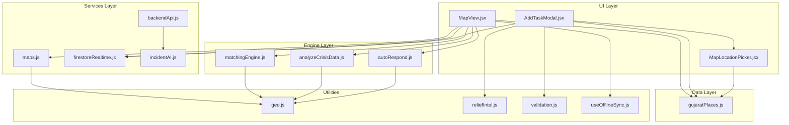

**Diagram sources**
- [MapView.jsx](file://src/pages/MapView.jsx)
- [MapLocationPicker.jsx](file://src/components/MapLocationPicker.jsx)
- [AddTaskModal.jsx](file://src/components/AddTaskModal.jsx)
- [maps.js](file://src/services/maps.js)
- [firestoreRealtime.js](file://src/services/firestoreRealtime.js)
- [backendApi.js](file://src/services/backendApi.js)
- [incidentAI.js](file://src/services/incidentAI.js)
- [matchingEngine.js](file://src/engine/matchingEngine.js)
- [analyzeCrisisData.js](file://src/engine/analyzeCrisisData.js)
- [autoRespond.js](file://src/engine/autoRespond.js)
- [gujaratPlaces.js](file://src/data/gujaratPlaces.js)
- [geo.js](file://src/utils/geo.js)
- [reliefIntel.js](file://src/utils/reliefIntel.js)
- [validation.js](file://src/utils/validation.js)
- [useOfflineSync.js](file://src/hooks/useOfflineSync.js)

**Section sources**
- [MapView.jsx](file://src/pages/MapView.jsx)
- [MapLocationPicker.jsx](file://src/components/MapLocationPicker.jsx)
- [AddTaskModal.jsx](file://src/components/AddTaskModal.jsx)
- [maps.js](file://src/services/maps.js)
- [firestoreRealtime.js](file://src/services/firestoreRealtime.js)
- [backendApi.js](file://src/services/backendApi.js)
- [incidentAI.js](file://src/services/incidentAI.js)
- [matchingEngine.js](file://src/engine/matchingEngine.js)
- [analyzeCrisisData.js](file://src/engine/analyzeCrisisData.js)
- [autoRespond.js](file://src/engine/autoRespond.js)
- [gujaratPlaces.js](file://src/data/gujaratPlaces.js)
- [geo.js](file://src/utils/geo.js)
- [reliefIntel.js](file://src/utils/reliefIntel.js)
- [validation.js](file://src/utils/validation.js)
- [useOfflineSync.js](file://src/hooks/useOfflineSync.js)

## Core Components
- Google Maps Distance Matrix integration with caching and offline fallback
- Leaflet-based map visualization with custom markers and heatmap overlay
- Location picker with region-aware suggestions and coordinate fallback
- Spatial matching engine scoring volunteers by skill, distance, availability, experience, and performance
- Crisis analysis engine computing risk scores and recommending actions
- Automated response orchestrating volunteer allocation and ETA estimation
- Real-time Firestore integration for live updates and offline-first persistence
- Coordinate utilities implementing Haversine distance and validation
- Regional data management for Gujarat with region centers and place suggestions

**Section sources**
- [maps.js](file://src/services/maps.js)
- [MapView.jsx](file://src/pages/MapView.jsx)
- [MapLocationPicker.jsx](file://src/components/MapLocationPicker.jsx)
- [matchingEngine.js](file://src/engine/matchingEngine.js)
- [analyzeCrisisData.js](file://src/engine/analyzeCrisisData.js)
- [autoRespond.js](file://src/engine/autoRespond.js)
- [firestoreRealtime.js](file://src/services/firestoreRealtime.js)
- [geo.js](file://src/utils/geo.js)
- [gujaratPlaces.js](file://src/data/gujaratPlaces.js)

## Architecture Overview
The GIS architecture integrates client-side mapping, spatial analytics, and backend services:
- Map rendering and user interaction handled by React Leaflet
- Distance metrics powered by Google Maps Distance Matrix with local fallback
- Spatial scoring and risk analysis computed locally with optional backend acceleration
- Real-time data synchronized via Firestore with offline queueing
- AI-assisted incident analysis and task prioritization

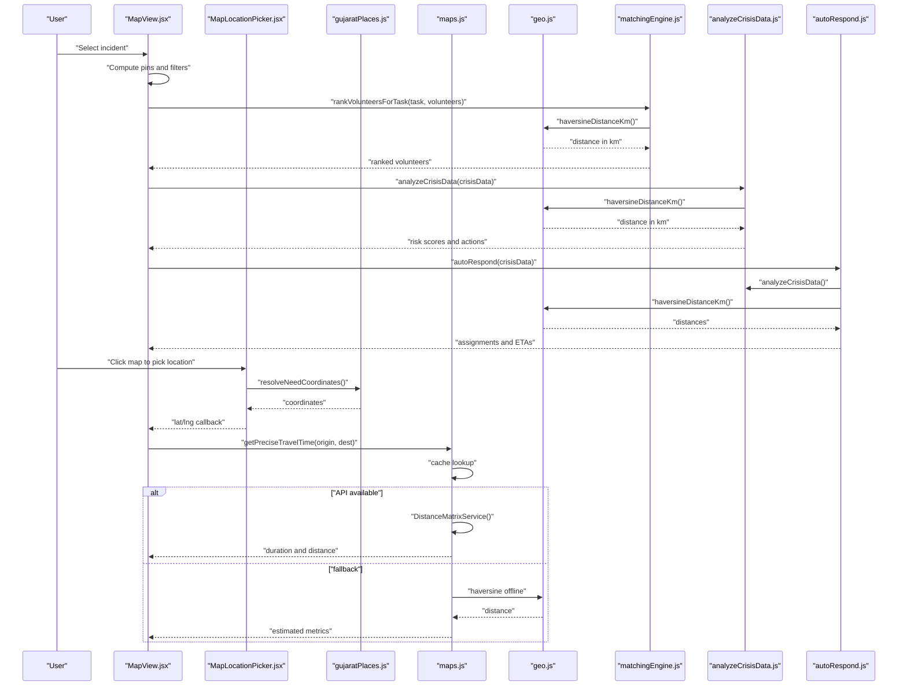

**Diagram sources**
- [MapView.jsx](file://src/pages/MapView.jsx)
- [MapLocationPicker.jsx](file://src/components/MapLocationPicker.jsx)
- [gujaratPlaces.js](file://src/data/gujaratPlaces.js)
- [maps.js](file://src/services/maps.js)
- [geo.js](file://src/utils/geo.js)
- [matchingEngine.js](file://src/engine/matchingEngine.js)
- [analyzeCrisisData.js](file://src/engine/analyzeCrisisData.js)
- [autoRespond.js](file://src/engine/autoRespond.js)

## Detailed Component Analysis

### Google Maps Integration and Offline Fallback
The system integrates with the Google Maps Distance Matrix API for precise travel time and distance. A local cache avoids repeated network calls. When the API key is missing or the API fails, a Haversine-based offline estimator approximates duration and distance using a constant speed model plus overhead.

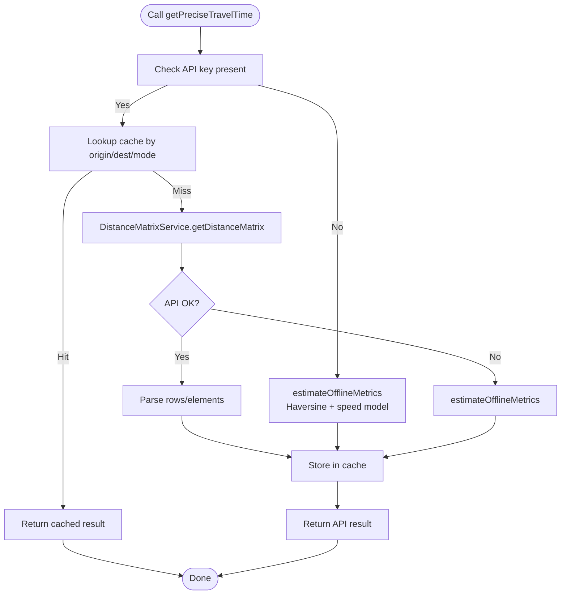

**Diagram sources**
- [maps.js](file://src/services/maps.js)
- [geo.js](file://src/utils/geo.js)

**Section sources**
- [maps.js](file://src/services/maps.js)
- [geo.js](file://src/utils/geo.js)

### Location Picker Interface
The location picker is a compact, region-aware map allowing users to click to set coordinates. It centers on the selected region and shows a marker when coordinates are set. It integrates with Gujarat region centers and supports coordinate fallback.

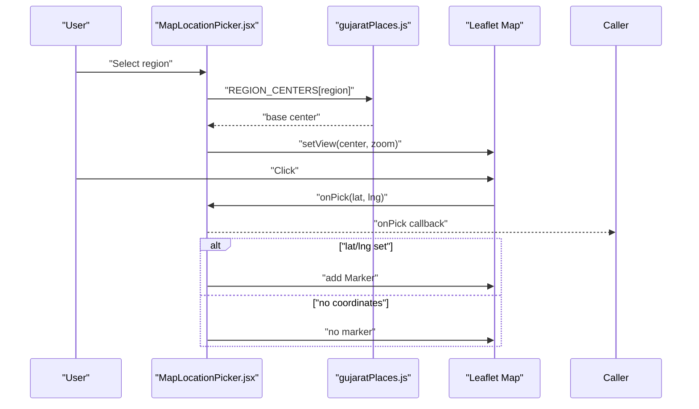

**Diagram sources**
- [MapLocationPicker.jsx](file://src/components/MapLocationPicker.jsx)
- [gujaratPlaces.js](file://src/data/gujaratPlaces.js)

**Section sources**
- [MapLocationPicker.jsx](file://src/components/MapLocationPicker.jsx)
- [gujaratPlaces.js](file://src/data/gujaratPlaces.js)

### Spatial Analysis Algorithms
Spatial analysis combines:
- Haversine distance computation for accurate great-circle distances
- Proximity scoring for volunteer-task matching
- Risk scoring for incident prioritization
- Resource allocation heuristics

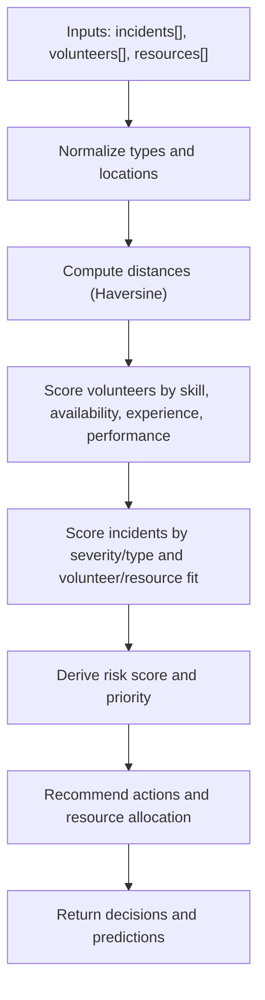

**Diagram sources**
- [analyzeCrisisData.js](file://src/engine/analyzeCrisisData.js)
- [matchingEngine.js](file://src/engine/matchingEngine.js)
- [geo.js](file://src/utils/geo.js)

**Section sources**
- [analyzeCrisisData.js](file://src/engine/analyzeCrisisData.js)
- [matchingEngine.js](file://src/engine/matchingEngine.js)
- [geo.js](file://src/utils/geo.js)

### Geographic Clustering and Proximity Analysis
Proximity analysis ranks volunteers based on:
- Skill overlap with required skills
- Distance using Haversine formula
- Availability and performance metrics

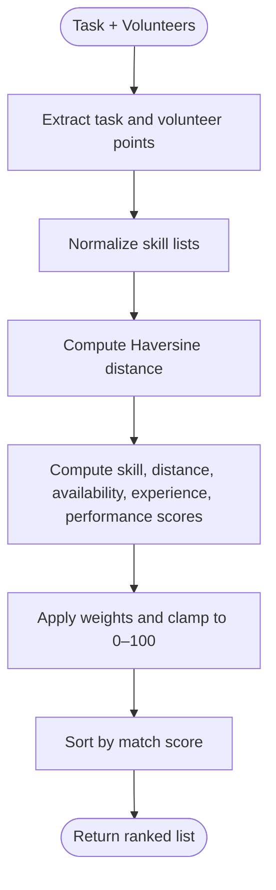

**Diagram sources**
- [matchingEngine.js](file://src/engine/matchingEngine.js)
- [geo.js](file://src/utils/geo.js)

**Section sources**
- [matchingEngine.js](file://src/engine/matchingEngine.js)
- [geo.js](file://src/utils/geo.js)

### Regional Hotspot Detection
Hotspot detection identifies high-risk zones by aggregating incident signals and computing risk scores. The system groups reports by rounded lat/lng buckets and flags potential shortages when counts exceed thresholds.

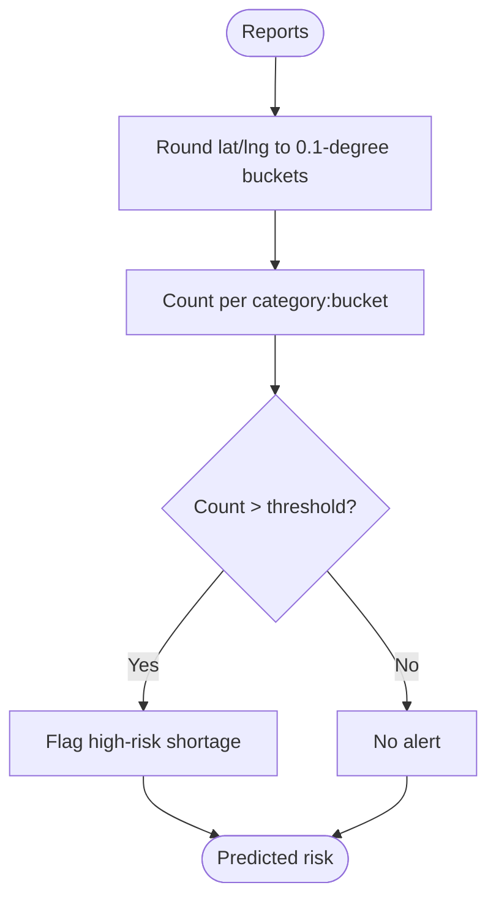

**Diagram sources**
- [reliefIntel.js](file://src/utils/reliefIntel.js)

**Section sources**
- [reliefIntel.js](file://src/utils/reliefIntel.js)

### Distance Calculation Methods
Two primary methods are used:
- Haversine formula for precise great-circle distances
- Google Maps Distance Matrix for real-world routing metrics with caching and fallback

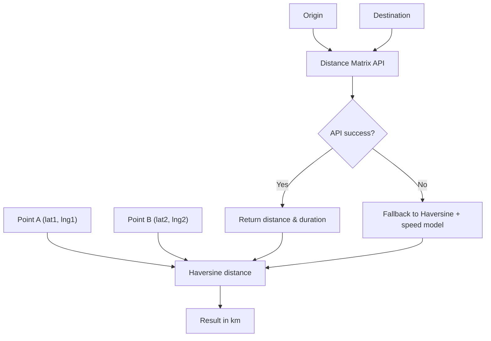

**Diagram sources**
- [geo.js](file://src/utils/geo.js)
- [maps.js](file://src/services/maps.js)

**Section sources**
- [geo.js](file://src/utils/geo.js)
- [maps.js](file://src/services/maps.js)

### Route Optimization Algorithms
Route optimization is implemented as:
- Volunteer selection by proximity and skill fit
- Automated response sequencing by priority and escalation probability
- ETA estimation based on average volunteer distances

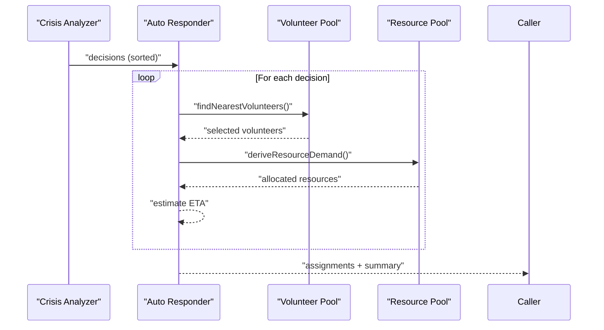

**Diagram sources**
- [analyzeCrisisData.js](file://src/engine/analyzeCrisisData.js)
- [autoRespond.js](file://src/engine/autoRespond.js)

**Section sources**
- [analyzeCrisisData.js](file://src/engine/analyzeCrisisData.js)
- [autoRespond.js](file://src/engine/autoRespond.js)

### Coordinate Processing Workflows
Coordinate processing resolves missing coordinates using:
- Explicit lat/lng fields
- Place name matching within region suggestions
- Region center fallback

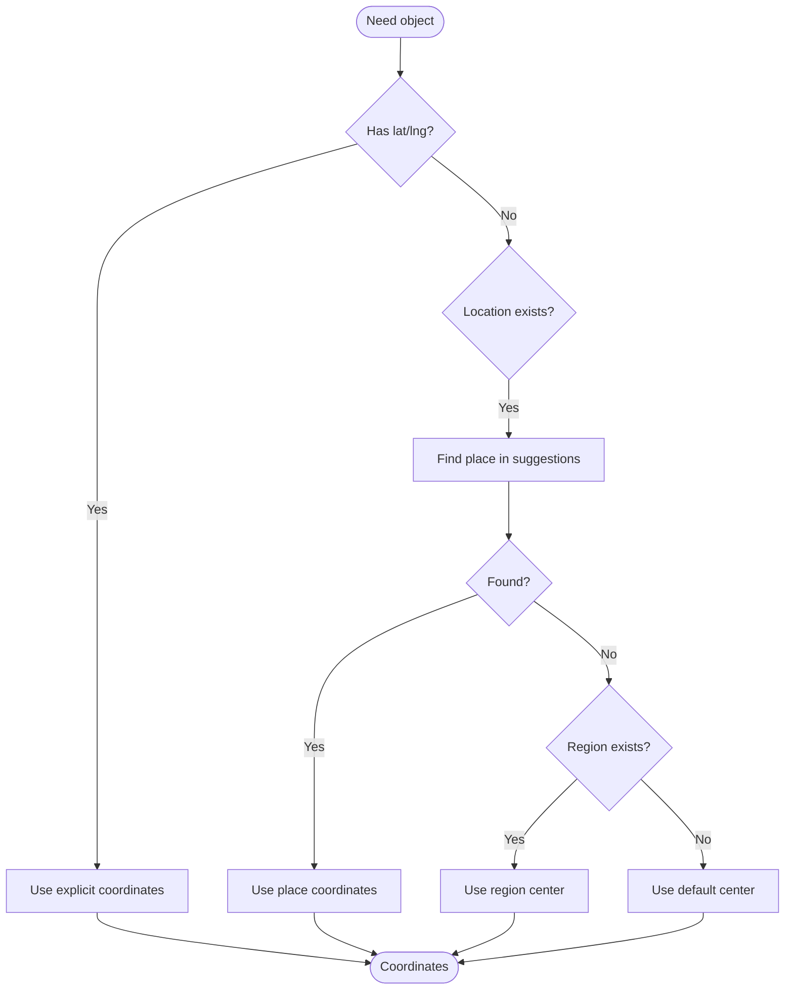

**Diagram sources**
- [gujaratPlaces.js](file://src/data/gujaratPlaces.js)

**Section sources**
- [gujaratPlaces.js](file://src/data/gujaratPlaces.js)

### Integration with Location Services and Map Visualization
- Map visualization built with React Leaflet and custom SVG markers
- Heatmap overlay using canvas for performance
- Real-time updates via Firestore listeners
- Responsive sidebar and filter controls

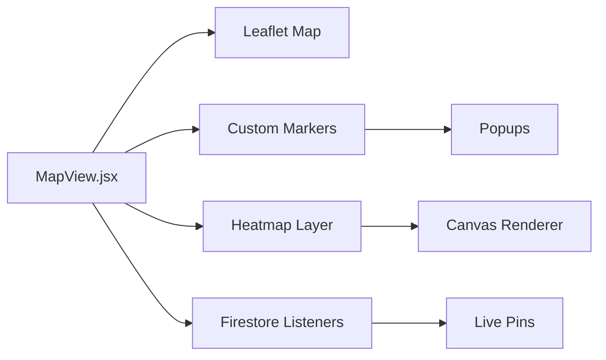

**Diagram sources**
- [MapView.jsx](file://src/pages/MapView.jsx)

**Section sources**
- [MapView.jsx](file://src/pages/MapView.jsx)

### Geographic Data Sources
- Regional centers and curated place lists for Gujarat
- Firestore collections for incidents, resources, and notifications
- Backend AI endpoints for incident analysis and matching explanations

**Section sources**
- [gujaratPlaces.js](file://src/data/gujaratPlaces.js)
- [firestoreRealtime.js](file://src/services/firestoreRealtime.js)
- [backendApi.js](file://src/services/backendApi.js)

### Spatial Indexing Strategies
- In-memory caches for distance metrics and matching results
- Local storage snapshots and offline queues for resilience
- Efficient filtering and sorting of pins and volunteers

**Section sources**
- [maps.js](file://src/services/maps.js)
- [useOfflineSync.js](file://src/hooks/useOfflineSync.js)

### Performance Optimization for Large Datasets
- Caching of distance matrix results
- Canvas-based heatmap rendering
- Client-side ranking and filtering
- Debounced map re-centering and bounds fitting

**Section sources**
- [maps.js](file://src/services/maps.js)
- [MapView.jsx](file://src/pages/MapView.jsx)
- [useOfflineSync.js](file://src/hooks/useOfflineSync.js)

### Offline Map Capabilities
- Offline-first data persistence using local storage
- Online/offline event handling and queueing
- Snapshot caching for quick startup

**Section sources**
- [useOfflineSync.js](file://src/hooks/useOfflineSync.js)

### Regional Data Management for Gujarat and Expansion
- Gujarat-specific region centers and place suggestions
- Extensible region order and center definitions
- Placeholder for additional regions

**Section sources**
- [gujaratPlaces.js](file://src/data/gujaratPlaces.js)

## Dependency Analysis
The GIS subsystem exhibits layered dependencies with clear separation of concerns:
- UI depends on services and engines
- Services depend on utilities and external APIs
- Engines depend on geometry utilities
- Data and hooks provide foundational geographic data and offline persistence

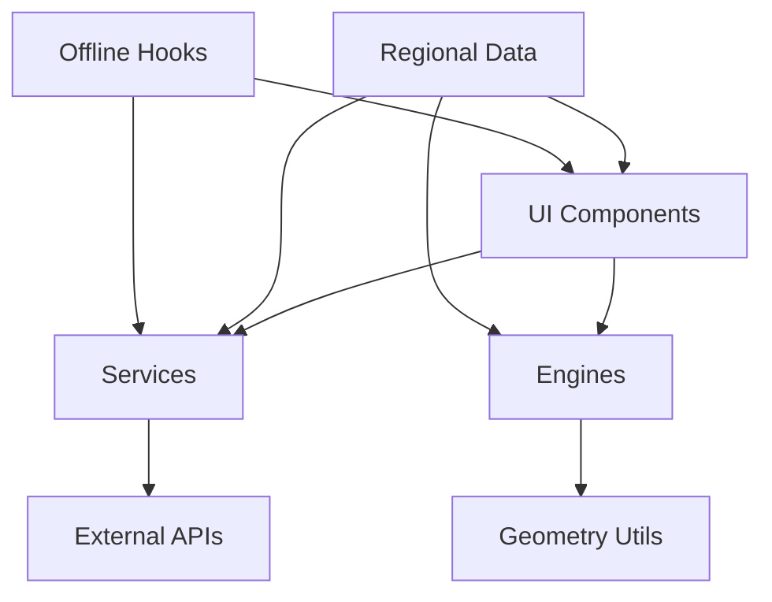

**Diagram sources**
- [MapView.jsx](file://src/pages/MapView.jsx)
- [MapLocationPicker.jsx](file://src/components/MapLocationPicker.jsx)
- [AddTaskModal.jsx](file://src/components/AddTaskModal.jsx)
- [maps.js](file://src/services/maps.js)
- [firestoreRealtime.js](file://src/services/firestoreRealtime.js)
- [backendApi.js](file://src/services/backendApi.js)
- [incidentAI.js](file://src/services/incidentAI.js)
- [matchingEngine.js](file://src/engine/matchingEngine.js)
- [analyzeCrisisData.js](file://src/engine/analyzeCrisisData.js)
- [autoRespond.js](file://src/engine/autoRespond.js)
- [gujaratPlaces.js](file://src/data/gujaratPlaces.js)
- [geo.js](file://src/utils/geo.js)
- [reliefIntel.js](file://src/utils/reliefIntel.js)
- [validation.js](file://src/utils/validation.js)
- [useOfflineSync.js](file://src/hooks/useOfflineSync.js)

**Section sources**
- [MapView.jsx](file://src/pages/MapView.jsx)
- [MapLocationPicker.jsx](file://src/components/MapLocationPicker.jsx)
- [AddTaskModal.jsx](file://src/components/AddTaskModal.jsx)
- [maps.js](file://src/services/maps.js)
- [firestoreRealtime.js](file://src/services/firestoreRealtime.js)
- [backendApi.js](file://src/services/backendApi.js)
- [incidentAI.js](file://src/services/incidentAI.js)
- [matchingEngine.js](file://src/engine/matchingEngine.js)
- [analyzeCrisisData.js](file://src/engine/analyzeCrisisData.js)
- [autoRespond.js](file://src/engine/autoRespond.js)
- [gujaratPlaces.js](file://src/data/gujaratPlaces.js)
- [geo.js](file://src/utils/geo.js)
- [reliefIntel.js](file://src/utils/reliefIntel.js)
- [validation.js](file://src/utils/validation.js)
- [useOfflineSync.js](file://src/hooks/useOfflineSync.js)

## Performance Considerations
- Prefer caching for expensive operations (distance matrix, matching)
- Use canvas-based overlays for large datasets
- Limit concurrent API calls and batch updates
- Optimize rendering by virtualizing long lists and deferring heavy computations
- Leverage offline persistence to reduce network latency

## Troubleshooting Guide
Common issues and resolutions:
- Missing Google Maps API key: Falls back to Haversine-based estimates
- Distance Matrix API failures: Logs warning and continues with offline metrics
- Invalid coordinates: Validation prevents out-of-range values
- Real-time sync failures: Uses offline queue and retries on reconnect
- Map markers not appearing: Verify region selection and coordinate resolution

**Section sources**
- [maps.js](file://src/services/maps.js)
- [validation.js](file://src/utils/validation.js)
- [useOfflineSync.js](file://src/hooks/useOfflineSync.js)

## Conclusion
The GIS system provides robust geographic capabilities with strong offline support, efficient spatial analytics, and seamless integration with mapping and real-time data services. The modular design enables easy extension to additional regions and advanced spatial features.

## Appendices
- API endpoints for AI and matching are exposed via the backend API client
- Task creation modal integrates location picking, AI analysis, and validation
- Crisis analysis and automated response provide actionable insights for emergency operations