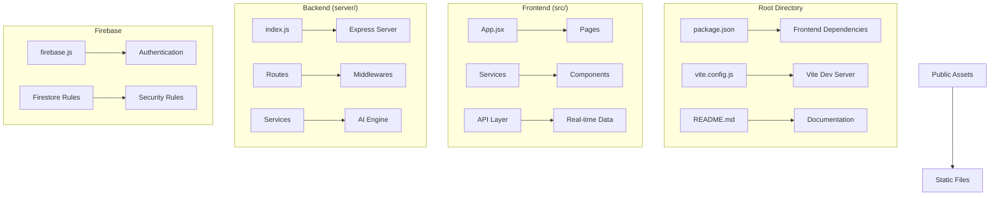
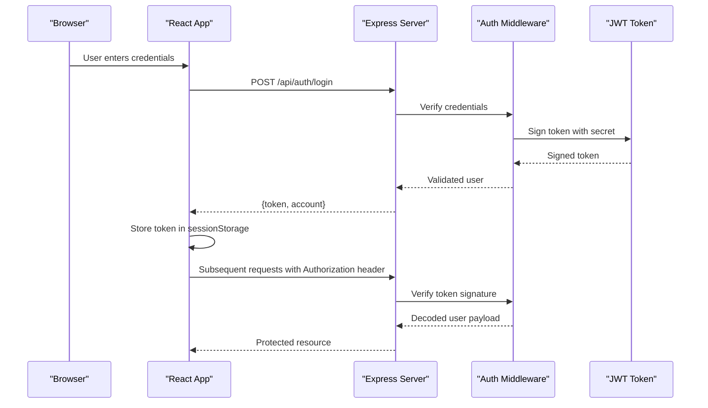
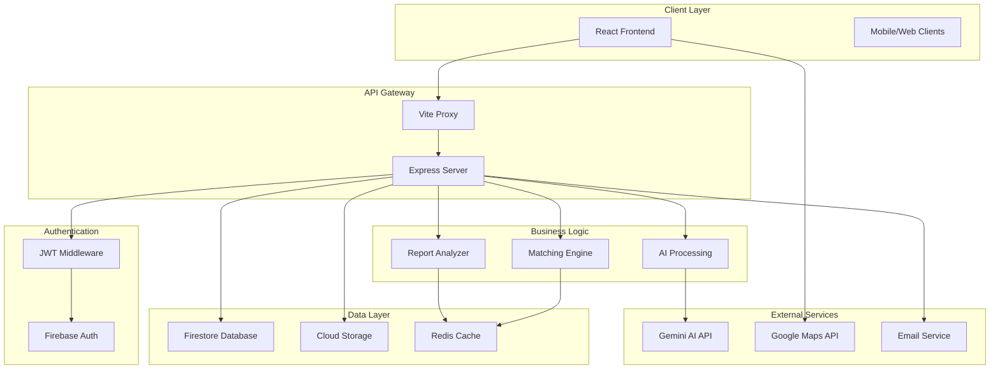

# Getting Started

<cite>
**Referenced Files in This Document**
- [README.md](file://README.md)
- [package.json](file://package.json)
- [server/package.json](file://server/package.json)
- [vite.config.js](file://vite.config.js)
- [server/index.js](file://server/index.js)
- [server/config.js](file://server/config.js)
- [server/routes/auth.js](file://server/routes/auth.js)
- [server/middleware/auth.js](file://server/middleware/auth.js)
- [src/firebase.js](file://src/firebase.js)
- [src/services/backendApi.js](file://src/services/backendApi.js)
- [src/App.jsx](file://src/App.jsx)
- [src/pages/SignIn.jsx](file://src/pages/SignIn.jsx)
- [src/pages/SignUp.jsx](file://src/pages/SignUp.jsx)
- [firestore.rules](file://firestore.rules)
</cite>

## Table of Contents
1. [Introduction](#introduction)
2. [Prerequisites](#prerequisites)
3. [Project Structure](#project-structure)
4. [Environment Setup](#environment-setup)
5. [Installation](#installation)
6. [Local Development](#local-development)
7. [First Run and Initial Setup](#first-run-and-initial-setup)
8. [Basic Authentication Flow](#basic-authentication-flow)
9. [Initial NGO Registration](#initial-ngo-registration)
10. [Architecture Overview](#architecture-overview)
11. [Verification Checklist](#verification-checklist)
12. [Troubleshooting Guide](#troubleshooting-guide)
13. [Conclusion](#conclusion)

## Introduction
Echo5 is a React-based crisis coordination platform with an integrated AI layer and volunteer matching engine. The platform consists of:
- Frontend: React application with Vite for fast development
- Backend: Node.js/Express API server with authentication, AI proxy, and matching engine
- Firebase: Real-time database integration for NGO data
- AI Services: Gemini-powered document analysis and incident insights

The platform emphasizes security with JWT authentication, rate limiting, and strict Firebase security rules.

## Prerequisites
Before installing Echo5, ensure you have the following:

### Software Requirements
- Node.js 18.x or higher (LTS recommended)
- npm 8.x or higher
- Git for version control

### Development Tools
- Modern code editor (VS Code recommended)
- Browser with developer tools
- Postman or curl for API testing

### Firebase Setup
- Firebase project with:
  - Authentication enabled (Email/Password)
  - Firestore database
  - Cloud Storage (optional)
- Firebase Admin credentials for production (not required for local development)

### AI Services (Optional)
- Gemini API key for advanced AI features
- OpenAI API key (alternative AI provider)

**Section sources**
- [package.json:12-30](file://package.json#L12-L30)
- [server/package.json:9-16](file://server/package.json#L9-L16)

## Project Structure
The Echo5 project follows a clear separation of concerns:



**Diagram sources**
- [package.json:1-43](file://package.json#L1-L43)
- [server/package.json:1-18](file://server/package.json#L1-L18)
- [src/App.jsx:1-285](file://src/App.jsx#L1-L285)
- [server/index.js:1-118](file://server/index.js#L1-L118)

### Key Directories and Files
- **src/**: React frontend application
- **server/**: Node.js backend API
- **public/**: Static assets and HTML template
- **vite.config.js**: Development server configuration
- **firestore.rules**: Firebase security rules
- **firestore.indexes.json**: Firestore indexing configuration

**Section sources**
- [README.md:1-17](file://README.md#L1-L17)
- [package.json:1-43](file://package.json#L1-L43)

## Environment Setup
Configure your environment variables for both frontend and backend components.

### Frontend Environment Variables (.env)
Create a `.env` file in the project root with the following variables:

```bash
# Firebase Configuration
VITE_FIREBASE_API_KEY=your_firebase_api_key
VITE_AUTH_DOMAIN=your_project.firebaseapp.com
VITE_PROJECT_ID=your_project_id
VITE_STORAGE_BUCKET=your_project.appspot.com
VITE_MESSAGING_SENDER_ID=123456789
VITE_APP_ID=1:123456789:web:abc123

# Backend API Configuration
VITE_API_URL=http://localhost:8787

# Google Maps (optional)
VITE_GOOGLE_MAPS_API_KEY=your_google_maps_key
```

### Backend Environment Variables (.env)
Create a `.env` file in the `server/` directory:

```bash
# Server Configuration
PORT=8787
NODE_ENV=development

# Authentication
JWT_SECRET=your_super_secret_jwt_key_change_in_production
JWT_EXPIRES_IN=8h

# Rate Limiting
RATE_LIMIT_WINDOW_MS=900000
RATE_LIMIT_MAX=100
AI_RATE_LIMIT_MAX=20

# CORS Configuration
CORS_ORIGIN=http://localhost:5173

# Cache Settings
MATCH_CACHE_TTL_MS=300000
MATCH_CACHE_MAX_SIZE=500

# AI Providers (optional)
GEMINI_API_KEY=your_gemini_api_key
GEMINI_MODEL=gemini-1.5-flash
OPENAI_API_KEY=your_openai_api_key
OPENAI_MODEL=gpt-4o-mini
```

**Section sources**
- [src/firebase.js:10-19](file://src/firebase.js#L10-L19)
- [server/config.js:8-32](file://server/config.js#L8-L32)
- [vite.config.js:8-17](file://vite.config.js#L8-L17)

## Installation
Follow these step-by-step instructions to install and configure Echo5.

### Step 1: Clone and Install Dependencies
```bash
# Clone the repository
git clone <repository-url>
cd echo5

# Install frontend dependencies
npm install

# Navigate to server directory and install backend dependencies
cd server
npm install
cd ..
```

### Step 2: Configure Firebase
1. Create a Firebase project at [console.firebase.google.com](https://console.firebase.google.com)
2. Enable Email/Password Authentication
3. Set up Firestore database
4. Copy your Firebase configuration from Project Settings > General > Your apps
5. Add the configuration to your frontend `.env` file

### Step 3: Configure Backend Secrets
1. Navigate to `server/.env`
2. Set your JWT secret (change this for production!)
3. Configure rate limiting parameters based on your needs
4. Set CORS origin to match your frontend URL

### Step 4: Verify Dependencies
Check that all required packages are installed:
- React 19.x
- Express 4.x
- Firebase SDK 12.x
- Vite 8.x

**Section sources**
- [package.json:12-30](file://package.json#L12-L30)
- [server/package.json:9-16](file://server/package.json#L9-L16)

## Local Development
Start both frontend and backend servers for local development.

### Starting the Backend Server
```bash
# Navigate to server directory
cd server

# Start in development mode with auto-reload
npm run dev
```

The backend will start on port 8787 with the following endpoints:
- `GET /api/health` - Health check
- `POST /api/auth/login` - User authentication
- `POST /api/auth/register` - User registration
- `POST /api/ai/*` - AI processing endpoints
- `POST /api/match` - Volunteer matching engine

### Starting the Frontend Development Server
```bash
# From project root
cd ..

# Start Vite development server
npm run dev
```

The frontend will start on port 5173 with hot module replacement.

### Development Proxy Configuration
Vite automatically proxies API calls from `/api` to the backend server, eliminating CORS issues during development.

**Section sources**
- [server/index.js:104-117](file://server/index.js#L104-L117)
- [vite.config.js:8-17](file://vite.config.js#L8-L17)

## First Run and Initial Setup
Complete the initial setup for your Echo5 instance.

### Step 1: Access the Application
Open your browser and navigate to `http://localhost:5173`. You should see the login screen.

### Step 2: Login with Demo Credentials
The system includes demo accounts for testing:

| Email | Password | Organization | Type |
|-------|----------|--------------|------|
| `ngo@needlink.org` | `ngo123` | NeedLink Foundation | Relief NGO |
| `care@gujarat.org` | `care123` | Gujarat Care Society | Health NGO |
| `flood@aid.org` | `flood123` | Flood Aid Gujarat | Disaster Relief |
| `admin@needlink.org` | `admin123` | NeedLink Admin | Super Admin |

### Step 3: Complete Initial Configuration
After login, the system will:
1. Initialize Firebase authentication
2. Load NGO-specific data from Firestore
3. Set up real-time data synchronization
4. Display the main dashboard interface

**Section sources**
- [src/pages/SignIn.jsx:14-22](file://src/pages/SignIn.jsx#L14-L22)
- [server/routes/auth.js:11-16](file://server/routes/auth.js#L11-L16)

## Basic Authentication Flow
The authentication system uses JWT tokens for secure communication between frontend and backend.



**Diagram sources**
- [src/services/backendApi.js:63-71](file://src/services/backendApi.js#L63-L71)
- [server/routes/auth.js:34-52](file://server/routes/auth.js#L34-L52)
- [server/middleware/auth.js:14-37](file://server/middleware/auth.js#L14-L37)

### Authentication Security Features
- JWT tokens with configurable expiration
- Secret key rotation for production
- Rate limiting on authentication endpoints
- HTTPS enforcement in production

**Section sources**
- [server/middleware/auth.js:42-48](file://server/middleware/auth.js#L42-L48)
- [server/config.js:17-19](file://server/config.js#L17-L19)

## Initial NGO Registration
New organizations can register through the frontend interface.

### Registration Process
```mermaid
flowchart TD
A[User clicks "Create Account"] --> B[User fills registration form]
B --> C[Form validation]
C --> D{Validation Passes?}
D --> |No| E[Show validation errors]
D --> |Yes| F[Submit registration request]
F --> G[Backend validates uniqueness]
G --> H{Email exists?}
H --> |Yes| I[Return conflict error]
H --> |No| J[Create new account]
J --> K[Generate JWT token]
K --> L[Store token locally]
L --> M[Redirect to dashboard]
style E fill:#fee
style I fill:#fee
style M fill:#cfc
```

**Diagram sources**
- [src/pages/SignUp.jsx:26-44](file://src/pages/SignUp.jsx#L26-L44)
- [server/routes/auth.js:60-80](file://server/routes/auth.js#L60-L80)

### Registration Requirements
- Full name (required)
- Organization name (required)
- Organization type (dropdown selection)
- Work email (unique, required)
- Password (minimum 6 characters)

### Firebase Security Integration
The system enforces strict Firebase security rules:
- All data access requires authentication
- Users can only access their own NGO's data
- No public or anonymous access allowed

**Section sources**
- [firestore.rules:9-16](file://firestore.rules#L9-L16)
- [src/pages/SignUp.jsx:15-24](file://src/pages/SignUp.jsx#L15-L24)

## Architecture Overview
Echo5 follows a modern microservices architecture with clear separation between frontend, backend, and data layers.



**Diagram sources**
- [server/index.js:1-118](file://server/index.js#L1-L118)
- [src/App.jsx:1-285](file://src/App.jsx#L1-L285)
- [src/firebase.js:1-35](file://src/firebase.js#L1-L35)

### Key Architectural Principles
- **Separation of Concerns**: Clear boundaries between frontend, backend, and data
- **Security by Design**: Authentication, authorization, and data protection built-in
- **Scalability**: Modular design allows independent scaling of components
- **Resilience**: Error handling and offline capabilities
- **Performance**: Caching, rate limiting, and optimized data flows

## Verification Checklist
Ensure your Echo5 installation is working correctly.

### Backend Verification
1. **Server Status**: `http://localhost:8787/api/health` should return status "ok"
2. **Authentication**: Test login endpoint responds without errors
3. **Rate Limits**: Exceeding limits should return appropriate error messages
4. **CORS**: Cross-origin requests should be properly handled

### Frontend Verification
1. **Development Server**: `http://localhost:5173` loads without errors
2. **Firebase Connection**: Real-time data synchronization works
3. **Navigation**: All menu items are accessible
4. **Authentication Flow**: Login/logout cycles work correctly

### Database Verification
1. **Firebase Rules**: Test that unauthorized access is blocked
2. **Data Structure**: NGO data loads correctly after authentication
3. **Real-time Updates**: Changes sync across sessions

### AI Services Verification
1. **Gemini Integration**: AI endpoints respond when API key is configured
2. **Fallback Behavior**: System continues working without AI features
3. **Error Handling**: AI failures don't break core functionality

**Section sources**
- [server/index.js:79-87](file://server/index.js#L79-L87)
- [src/services/backendApi.js:154-157](file://src/services/backendApi.js#L154-L157)

## Troubleshooting Guide

### Common Installation Issues

#### Node.js Version Compatibility
**Problem**: Installation fails with Node.js version errors
**Solution**: Ensure you're using Node.js 18.x or higher
```bash
node --version
npm --version
```

#### Port Conflicts
**Problem**: Ports 5173 or 8787 are already in use
**Solution**: Change ports in configuration files or stop conflicting applications
```bash
# Check what's using the ports
lsof -i :5173
lsof -i :8787
```

#### Firebase Configuration Errors
**Problem**: Application fails to connect to Firebase
**Solution**: Verify all Firebase environment variables are correct
```bash
# Check if environment variables are loaded
echo $VITE_FIREBASE_API_KEY
```

#### CORS Issues
**Problem**: API requests fail with CORS errors
**Solution**: Ensure CORS origin matches your frontend URL
```javascript
// Check in server/config.js
corsOrigin: env.CORS_ORIGIN || 'http://localhost:5173'
```

#### Authentication Problems
**Problem**: Login attempts fail or tokens expire immediately
**Solution**: Verify JWT secret and expiration settings
```bash
# Check JWT configuration
echo $JWT_SECRET
echo $JWT_EXPIRES_IN
```

### Debugging Tips
1. **Enable Detailed Logging**: Set `NODE_ENV=development` for verbose logs
2. **Check Network Requests**: Use browser developer tools to inspect API calls
3. **Verify Environment Files**: Ensure `.env` files are properly formatted
4. **Test Endpoints Individually**: Use curl or Postman to test specific APIs

### Performance Issues
1. **Memory Leaks**: Monitor memory usage in development tools
2. **Slow API Responses**: Check rate limiting configuration
3. **Large Data Loads**: Implement pagination for extensive datasets

**Section sources**
- [server/config.js:22-24](file://server/config.js#L22-L24)
- [server/index.js:49-68](file://server/index.js#L49-L68)

## Conclusion
Echo5 provides a robust foundation for crisis coordination and disaster response management. By following this guide, you've successfully installed, configured, and verified the platform components. The modular architecture ensures scalability and maintainability, while the security-first approach protects sensitive NGO data and communications.

Key takeaways:
- Firebase provides secure, real-time data synchronization
- JWT authentication ensures protected access to sensitive features
- The AI layer enhances operational efficiency without compromising security
- Comprehensive error handling and offline capabilities improve reliability
- Clear separation of concerns enables independent scaling and maintenance

For production deployment, focus on:
- Securing environment variables and API keys
- Configuring proper SSL certificates
- Setting up monitoring and alerting
- Implementing backup and disaster recovery procedures
- Establishing proper CI/CD pipelines

The platform is designed to grow with your organization's needs while maintaining security, performance, and usability standards.