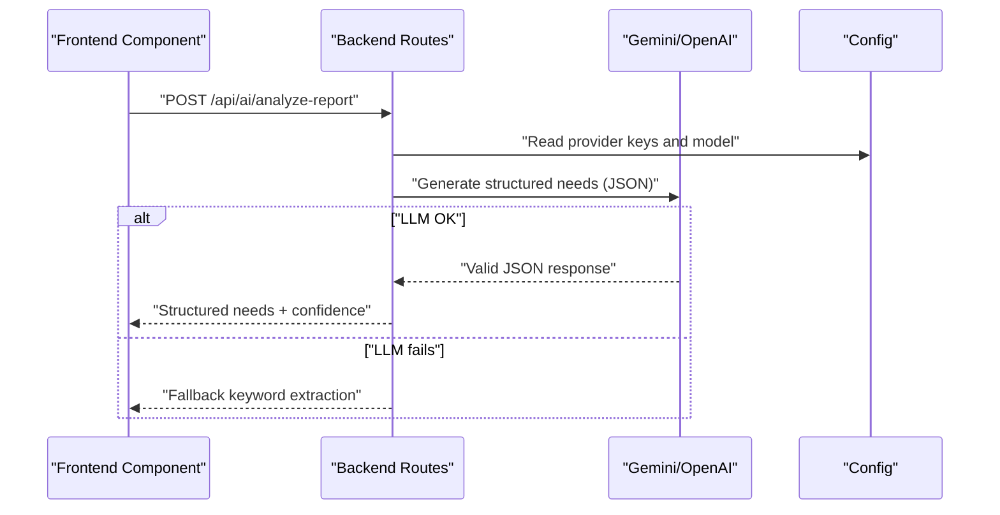
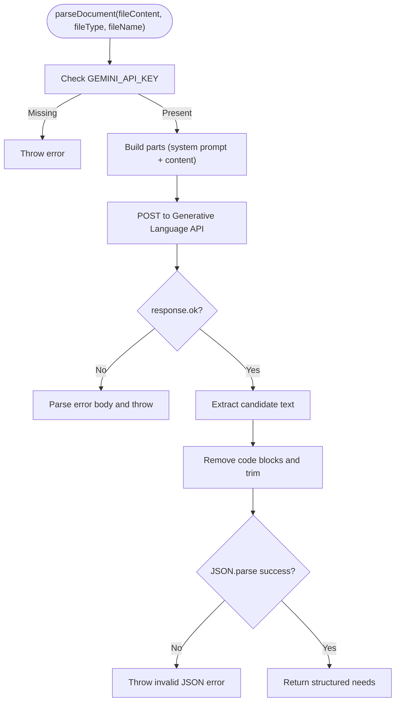
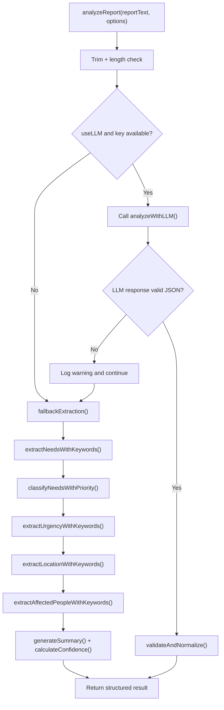
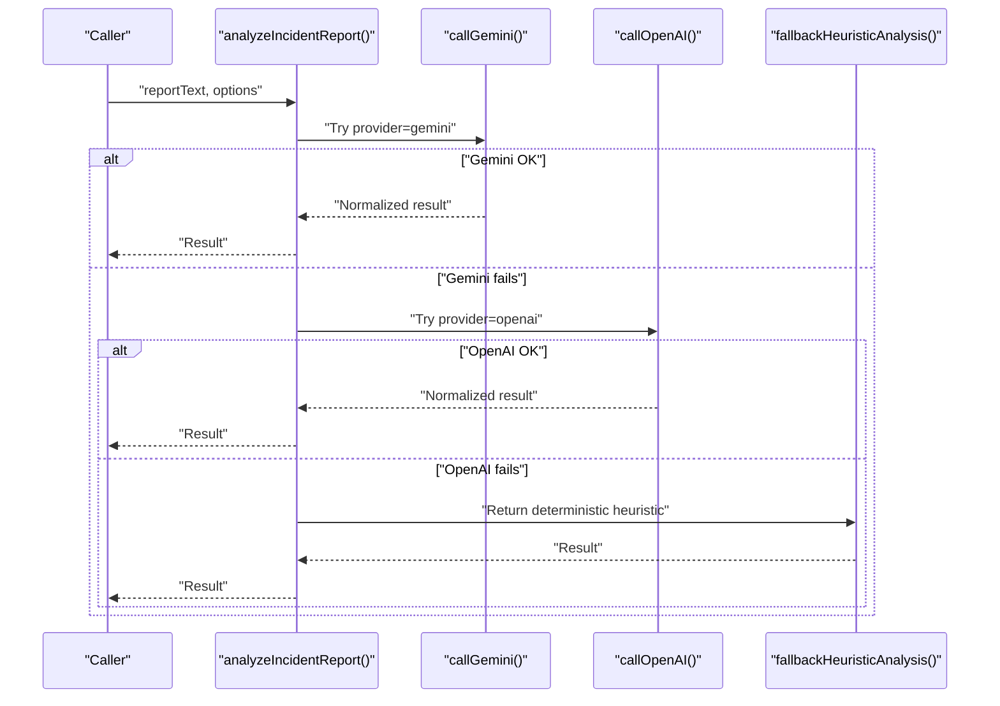
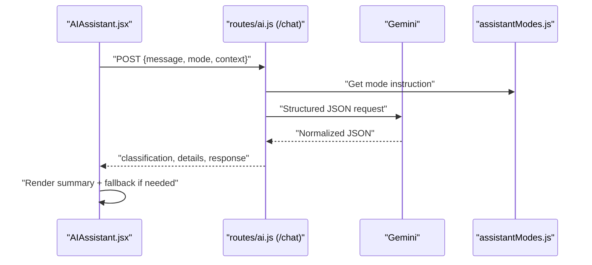
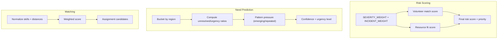
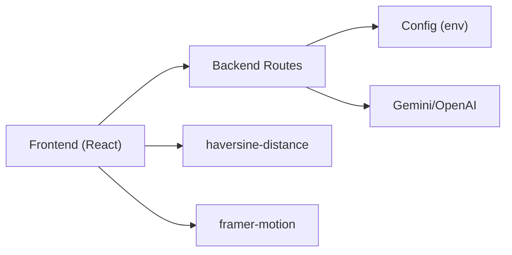

# AI Integration Logic

<cite>
**Referenced Files in This Document**
- [geminiProxy.js](file://server/services/geminiProxy.js)
- [incidentAiService.js](file://server/incidentAiService.js)
- [ai.js](file://server/routes/ai.js)
- [config.js](file://server/config.js)
- [gemini.js](file://src/services/gemini.js)
- [incidentAI.js](file://src/services/incidentAI.js)
- [reportAnalyzer.js](file://server/services/reportAnalyzer.js)
- [aiLogic.js](file://src/utils/aiLogic.js)
- [predictionEngine.js](file://src/engine/predictionEngine.js)
- [matchingEngine.js](file://src/engine/matchingEngine.js)
- [analyzeCrisisData.js](file://src/engine/analyzeCrisisData.js)
- [AIAssistant.jsx](file://src/components/AIAssistant.jsx)
- [EmergencyAIInsights.jsx](file://src/components/EmergencyAIInsights.jsx)
- [assistantModes.js](file://src/services/assistantModes.js)
- [package.json](file://package.json)
</cite>

## Table of Contents
1. [Introduction](#introduction)
2. [Project Structure](#project-structure)
3. [Core Components](#core-components)
4. [Architecture Overview](#architecture-overview)
5. [Detailed Component Analysis](#detailed-component-analysis)
6. [Dependency Analysis](#dependency-analysis)
7. [Performance Considerations](#performance-considerations)
8. [Troubleshooting Guide](#troubleshooting-guide)
9. [Conclusion](#conclusion)
10. [Appendices](#appendices)

## Introduction
This document explains the AI-powered analytical logic and natural language processing integration in the project. It covers the Gemini AI service integration, document parsing workflows, automated content analysis, NLP pipelines, sentiment-aware keyword extraction, automated categorization, recommendation algorithms, contextual understanding, decision support systems, and integration patterns with external AI services. It also documents rate limiting, error handling, fallback mechanisms, model selection criteria, performance optimizations, and ethical considerations.

## Project Structure
The AI logic spans both the frontend and backend:
- Backend routes expose secure AI endpoints and proxy document parsing to Gemini.
- Backend services encapsulate LLM calls, keyword-based fallbacks, and structured extraction.
- Frontend components integrate AI insights, assistant modes, and emergency decision dashboards.
- Engine modules implement risk scoring, prediction, and volunteer-task matching.

```mermaid
graph TB
subgraph "Frontend"
A["AIAssistant.jsx"]
B["EmergencyAIInsights.jsx"]
C["incidentAI.js"]
D["gemini.js"]
end
subgraph "Backend"
E["routes/ai.js"]
F["services/geminiProxy.js"]
G["services/reportAnalyzer.js"]
H["incidentAiService.js"]
I["config.js"]
end
A --> C
B --> C
C --> E
D --> F
E --> F
E --> G
E --> H
E --> I
```



**Diagram sources**
- [ai.js:1-348](file://server/routes/ai.js#L1-L348)
- [geminiProxy.js:1-104](file://server/services/geminiProxy.js#L1-L104)
- [reportAnalyzer.js:1-646](file://server/services/reportAnalyzer.js#L1-L646)
- [incidentAiService.js:1-189](file://server/incidentAiService.js#L1-L189)
- [config.js:1-35](file://server/config.js#L1-L35)
- [gemini.js:1-38](file://src/services/gemini.js#L1-L38)
- [incidentAI.js:1-24](file://src/services/incidentAI.js#L1-L24)
- [AIAssistant.jsx:1-311](file://src/components/AIAssistant.jsx#L1-L311)
- [EmergencyAIInsights.jsx:1-600](file://src/components/EmergencyAIInsights.jsx#L1-L600)

**Section sources**
- [ai.js:1-348](file://server/routes/ai.js#L1-L348)
- [config.js:1-35](file://server/config.js#L1-L35)

## Core Components
- Gemini Proxy: Secure document parsing via Gemini with strict JSON output constraints and robust error handling.
- Report Analyzer: Hybrid LLM + keyword extraction pipeline with confidence scoring and structured outputs.
- Incident AI Service: Multi-provider incident analysis with deterministic fallback heuristics.
- Assistant Modes: Mode-aware prompts and fallback guidance for field responders, coordinators, and citizens.
- Prediction and Matching Engines: Risk scoring, need forecasting, and volunteer-task matching with explainability.
- Frontend AI Assistant and Emergency Insights: Human-in-the-loop dashboards with emergency activation and AI summaries.

**Section sources**
- [geminiProxy.js:1-104](file://server/services/geminiProxy.js#L1-L104)
- [reportAnalyzer.js:1-646](file://server/services/reportAnalyzer.js#L1-L646)
- [incidentAiService.js:1-189](file://server/incidentAiService.js#L1-L189)
- [assistantModes.js:1-36](file://src/services/assistantModes.js#L1-L36)
- [predictionEngine.js:1-98](file://src/engine/predictionEngine.js#L1-L98)
- [matchingEngine.js:1-174](file://src/engine/matchingEngine.js#L1-L174)
- [AIAssistant.jsx:1-311](file://src/components/AIAssistant.jsx#L1-L311)
- [EmergencyAIInsights.jsx:1-600](file://src/components/EmergencyAIInsights.jsx#L1-L600)

## Architecture Overview
The system integrates external AI services behind secure backend endpoints. Client-side components call backend APIs, which enforce authentication, rate limits, and provider selection. LLM responses are normalized and validated, with deterministic fallbacks when providers fail.



**Diagram sources**
- [ai.js:262-290](file://server/routes/ai.js#L262-L290)
- [reportAnalyzer.js:522-565](file://server/services/reportAnalyzer.js#L522-L565)
- [config.js:11-15](file://server/config.js#L11-L15)

**Section sources**
- [ai.js:1-348](file://server/routes/ai.js#L1-L348)
- [reportAnalyzer.js:566-607](file://server/services/reportAnalyzer.js#L566-L607)
- [config.js:1-35](file://server/config.js#L1-L35)

## Detailed Component Analysis

### Gemini Proxy: Secure Document Parsing
- Purpose: Accepts raw text or base64-encoded files and returns structured community needs via Gemini.
- Constraints: Enforces strict JSON schema, temperature and token limits, and cleans non-JSON outputs.
- Security: API key and model configured server-side; never exposed to client.



**Diagram sources**
- [geminiProxy.js:53-103](file://server/services/geminiProxy.js#L53-L103)

**Section sources**
- [geminiProxy.js:1-104](file://server/services/geminiProxy.js#L1-L104)

### Report Analyzer: NLP Pipelines and Structured Extraction
- Hybrid approach: LLM-first with keyword-based fallback.
- Extraction patterns: Needs categories, urgency, location, affected people.
- Confidence scoring: Based on explicitness, number clarity, and text quality.
- Validation: Normalizes and sanitizes outputs, supports legacy LLM output formats.



**Diagram sources**
- [reportAnalyzer.js:576-607](file://server/services/reportAnalyzer.js#L576-L607)
- [reportAnalyzer.js:522-565](file://server/services/reportAnalyzer.js#L522-L565)
- [reportAnalyzer.js:379-397](file://server/services/reportAnalyzer.js#L379-L397)

**Section sources**
- [reportAnalyzer.js:1-646](file://server/services/reportAnalyzer.js#L1-L646)

### Incident AI Service: Multi-Provider Analysis and Fallback Heuristics
- Provider selection: Supports Gemini and OpenAI; auto-fallback when one fails.
- Deterministic heuristic: Regex-based extraction for location, urgency, category, and risk.
- Normalization: Clamps scores, normalizes strings, and enforces arrays.



**Diagram sources**
- [incidentAiService.js:170-188](file://server/incidentAiService.js#L170-L188)
- [incidentAiService.js:117-141](file://server/incidentAiService.js#L117-L141)
- [incidentAiService.js:143-168](file://server/incidentAiService.js#L143-L168)
- [incidentAiService.js:46-88](file://server/incidentAiService.js#L46-L88)

**Section sources**
- [incidentAiService.js:1-189](file://server/incidentAiService.js#L1-L189)

### Assistant Modes and Chat Integration
- Modes: Responder, Coordinator, Citizen with tailored instructions and fallback guidance.
- Chat endpoint: Structured decision payload with classification, details, and response.
- Frontend assistant: Live telemetry display, mode switching, and fallback handling.



**Diagram sources**
- [AIAssistant.jsx:30-79](file://src/components/AIAssistant.jsx#L30-L79)
- [ai.js:78-178](file://server/routes/ai.js#L78-L178)
- [assistantModes.js:1-36](file://src/services/assistantModes.js#L1-L36)

**Section sources**
- [AIAssistant.jsx:1-311](file://src/components/AIAssistant.jsx#L1-L311)
- [assistantModes.js:1-36](file://src/services/assistantModes.js#L1-L36)
- [ai.js:78-178](file://server/routes/ai.js#L78-L178)

### Prediction and Matching Engines
- Risk scoring: Combines severity, type weights, volunteer fit, and resource fit.
- Need prediction: Detects emerging crises and repeated demands using temporal and categorical signals.
- Matching: Weighted composite score for skills, distance, availability, experience, and performance.



**Diagram sources**
- [analyzeCrisisData.js:87-160](file://src/engine/analyzeCrisisData.js#L87-L160)
- [predictionEngine.js:55-97](file://src/engine/predictionEngine.js#L55-L97)
- [matchingEngine.js:88-141](file://src/engine/matchingEngine.js#L88-L141)

**Section sources**
- [analyzeCrisisData.js:1-161](file://src/engine/analyzeCrisisData.js#L1-L161)
- [predictionEngine.js:1-98](file://src/engine/predictionEngine.js#L1-L98)
- [matchingEngine.js:1-174](file://src/engine/matchingEngine.js#L1-L174)

### Frontend AI Assistant and Emergency Insights
- AIAssistant: Real-time chat with structured outputs, mode awareness, and fallback guidance.
- EmergencyAIInsights: Emergency activation button, live telemetry, and actionable summaries.

```mermaid
classDiagram
class AIAssistant {
+useState()
+fetch("/api/chat")
+render(mode, messages, typing)
}
class EmergencyAIInsights {
+useState()
+activateEmergency()
+render(summary, telemetry)
}
AIAssistant --> "uses" assistantModes.js
EmergencyAIInsights --> "calls" api.activateEmergencyMode()
```

**Diagram sources**
- [AIAssistant.jsx:1-311](file://src/components/AIAssistant.jsx#L1-L311)
- [EmergencyAIInsights.jsx:1-600](file://src/components/EmergencyAIInsights.jsx#L1-L600)
- [assistantModes.js:1-36](file://src/services/assistantModes.js#L1-L36)

**Section sources**
- [AIAssistant.jsx:1-311](file://src/components/AIAssistant.jsx#L1-L311)
- [EmergencyAIInsights.jsx:1-600](file://src/components/EmergencyAIInsights.jsx#L1-L600)

## Dependency Analysis
- External dependencies include React, Framer Motion, Tailwind, and haversine utilities for geodesic calculations.
- Backend depends on environment-configured AI provider keys and models.
- Frontend communicates with backend via secure endpoints; client-side Gemini wrapper proxies all file processing.



**Diagram sources**
- [package.json:12-29](file://package.json#L12-L29)
- [config.js:1-35](file://server/config.js#L1-L35)

**Section sources**
- [package.json:1-43](file://package.json#L1-L43)
- [config.js:1-35](file://server/config.js#L1-L35)

## Performance Considerations
- Token and temperature tuning: Lower temperature and controlled maxOutputTokens reduce variability and cost.
- Batch processing: Report analyzer supports batch requests with per-request validation and error aggregation.
- Caching: Match cache TTL and size configurable to balance freshness and latency.
- Rate limiting: Separate AI rate limit window and cap to protect provider quotas and stability.
- Fallback strategies: Keyword extraction ensures minimal latency and availability when LLMs are down.

[No sources needed since this section provides general guidance]

## Troubleshooting Guide
- Authentication and provider keys: Ensure GEMINI_API_KEY and provider-specific keys are set; otherwise routes return 5xx with clear messages.
- JSON parsing errors: Gemini responses are cleaned and validated; invalid JSON triggers structured error messages.
- Fallback behavior: When LLMs fail, keyword extraction or deterministic heuristics are used; verify logs for fallback triggers.
- Chat endpoint failures: Non-JSON responses or provider errors are caught and surfaced with details.

**Section sources**
- [ai.js:42-48](file://server/routes/ai.js#L42-L48)
- [ai.js:69-74](file://server/routes/ai.js#L69-L74)
- [ai.js:155-158](file://server/routes/ai.js#L155-L158)
- [reportAnalyzer.js:550-553](file://server/services/reportAnalyzer.js#L550-L553)
- [incidentAiService.js:179-187](file://server/incidentAiService.js#L179-L187)

## Conclusion
The system integrates secure, provider-agnostic AI services with robust fallbacks, structured extraction, and explainable decision-making. It balances accuracy with resilience, performance with ethics, and automation with human oversight through assistant modes and emergency dashboards.

[No sources needed since this section summarizes without analyzing specific files]

## Appendices

### API Definitions
- POST /api/ai/parse-document
  - Body: fileContent, fileType, fileName
  - Response: Structured community needs
  - Errors: 502 with details on parsing failures

- POST /api/ai/incident-analyze
  - Body: reportText, provider, context
  - Response: Classification, extraction, summary, risk score, tags

- POST /api/ai/chat
  - Body: message, mode, context
  - Response: classification, details, response

- POST /api/ai/explain-match
  - Body: volunteer, task
  - Response: Natural language explanation of match quality

- POST /api/ai/analyze-report
  - Body: reportText, useLLM
  - Response: Structured needs with confidence

- POST /api/ai/analyze-reports-batch
  - Body: reports[]
  - Response: Aggregated results with counts

**Section sources**
- [ai.js:21-50](file://server/routes/ai.js#L21-L50)
- [ai.js:52-76](file://server/routes/ai.js#L52-L76)
- [ai.js:78-178](file://server/routes/ai.js#L78-L178)
- [ai.js:180-260](file://server/routes/ai.js#L180-L260)
- [ai.js:262-290](file://server/routes/ai.js#L262-L290)
- [ai.js:292-345](file://server/routes/ai.js#L292-L345)

### Model Selection Criteria and Provider Fallback
- Provider selection: Configurable via environment; auto-fallback when primary provider key is absent or request fails.
- Deterministic heuristics: Regex-based extraction ensures minimum functionality when LLMs are unavailable.

**Section sources**
- [incidentAiService.js:170-188](file://server/incidentAiService.js#L170-L188)
- [config.js:11-15](file://server/config.js#L11-L15)

### Ethical AI, Bias Mitigation, and Transparency
- Structured outputs: Strict JSON schemas reduce ambiguity and hallucinations.
- Confidence scoring: Provides transparency on extraction reliability.
- Fallbacks: Deterministic heuristics ensure consistent behavior when LLMs fail.
- Explainability: Match explanations enumerate contributing factors (skills, distance, availability).
- Mode-aware guidance: Tailored instructions mitigate misuse across roles.

**Section sources**
- [reportAnalyzer.js:400-461](file://server/services/reportAnalyzer.js#L400-L461)
- [reportAnalyzer.js:269-327](file://server/services/reportAnalyzer.js#L269-L327)
- [matchingEngine.js:122-139](file://src/engine/matchingEngine.js#L122-L139)
- [assistantModes.js:27-35](file://src/services/assistantModes.js#L27-L35)