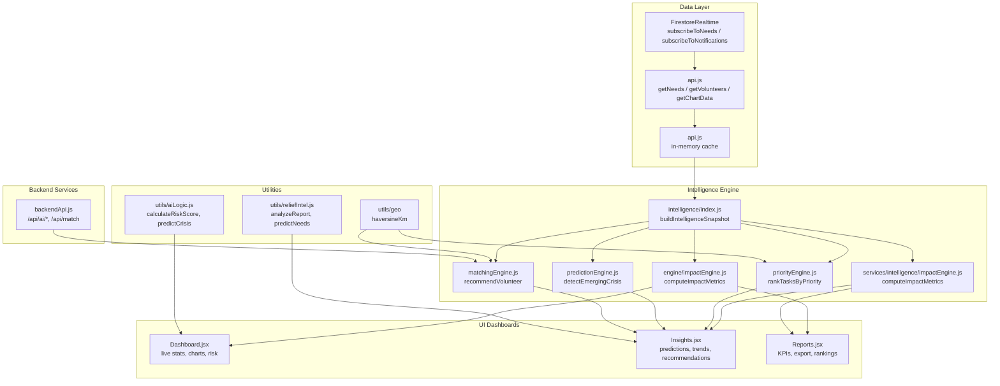
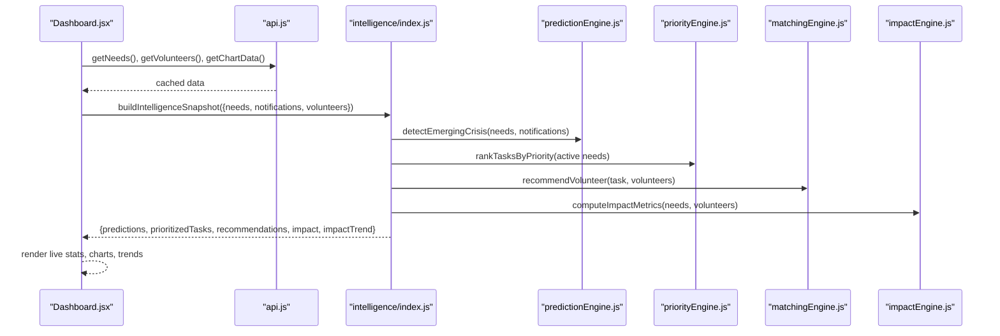
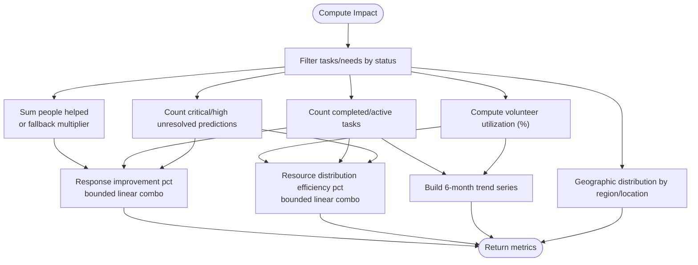
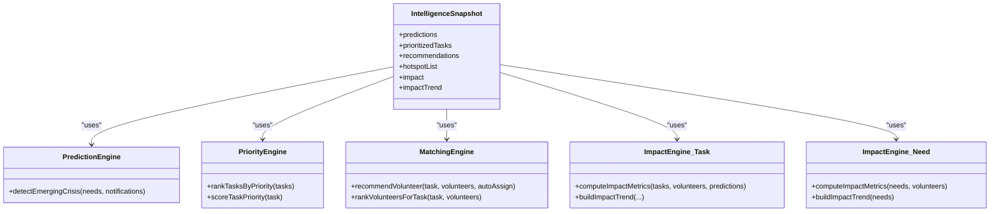
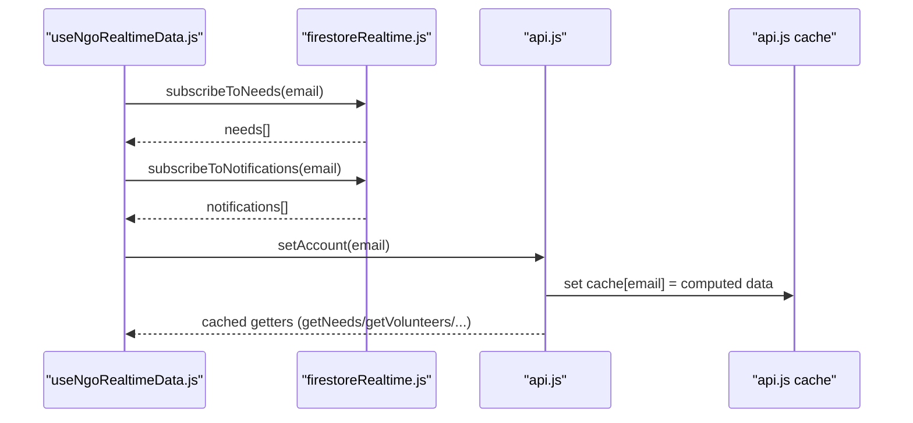
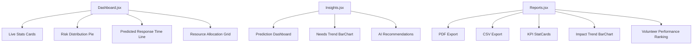
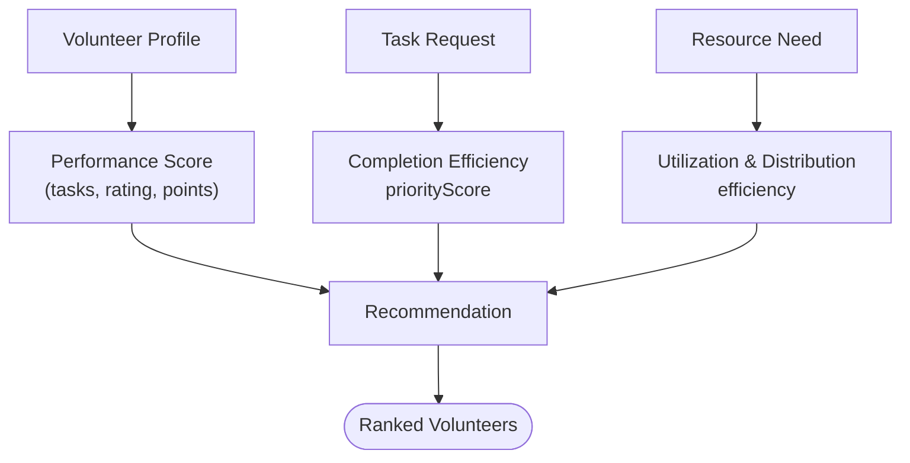
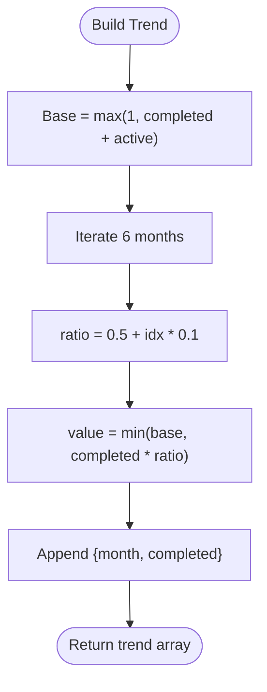
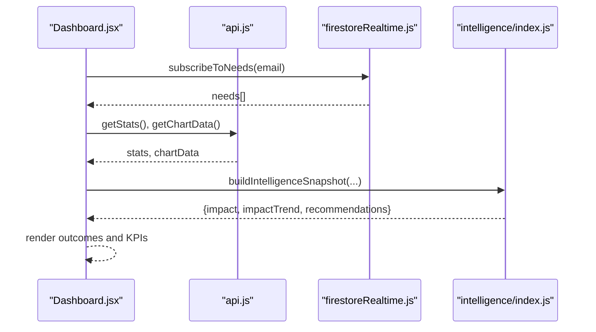
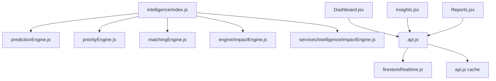

# Impact Engine

<cite>
**Referenced Files in This Document**
- [impactEngine.js](file://src/engine/impactEngine.js)
- [impactEngine.js](file://src/services/intelligence/impactEngine.js)
- [index.js](file://src/services/intelligence/index.js)
- [Dashboard.jsx](file://src/pages/Dashboard.jsx)
- [Insights.jsx](file://src/pages/Insights.jsx)
- [Reports.jsx](file://src/pages/Reports.jsx)
- [api.js](file://src/services/api.js)
- [firestoreRealtime.js](file://src/services/firestoreRealtime.js)
- [useNgoRealtimeData.js](file://src/hooks/useNgoRealtimeData.js)
- [predictionEngine.js](file://src/services/intelligence/predictionEngine.js)
- [priorityEngine.js](file://src/services/intelligence/priorityEngine.js)
- [matchingEngine.js](file://src/services/intelligence/matchingEngine.js)
- [reliefIntel.js](file://src/utils/reliefIntel.js)
- [aiLogic.js](file://src/utils/aiLogic.js)
- [backendApi.js](file://src/services/backendApi.js)
</cite>

## Table of Contents
1. [Introduction](#introduction)
2. [Project Structure](#project-structure)
3. [Core Components](#core-components)
4. [Architecture Overview](#architecture-overview)
5. [Detailed Component Analysis](#detailed-component-analysis)
6. [Dependency Analysis](#dependency-analysis)
7. [Performance Considerations](#performance-considerations)
8. [Troubleshooting Guide](#troubleshooting-guide)
9. [Conclusion](#conclusion)
10. [Appendices](#appendices)

## Introduction
This document describes the Impact Engine that measures operational effectiveness and humanitarian impact across tasks, volunteers, and outcomes. It documents the calculation methodologies for volunteer performance scores, task completion efficiency, and resource utilization metrics; explains the impact scoring algorithms, trend analysis, and benchmarking against historical data; and details real-time dashboards, KPI tracking, automated reporting, integrations with task/volunteer systems, and outcome measurement frameworks. It also covers data visualization components, impact storytelling features, and stakeholder reporting mechanisms.

## Project Structure
The Impact Engine spans several layers:
- Data ingestion and caching: Firebase Firestore integration and local caching
- Intelligence pipeline: Prediction, prioritization, matching, and impact computation
- UI dashboards: Live dashboards, insights, and reporting
- Utilities: Risk scoring, geolocation, and AI assistance logic
- Backend services: Authentication, AI parsing, and recommendation APIs

**Diagram sources**
- [firestoreRealtime.js:61-116](file://src/services/firestoreRealtime.js#L61-L116)
- [api.js:295-562](file://src/services/api.js#L295-L562)
- [index.js:6-42](file://src/services/intelligence/index.js#L6-L42)
- [predictionEngine.js:15-65](file://src/services/intelligence/predictionEngine.js#L15-L65)
- [priorityEngine.js:47-51](file://src/services/intelligence/priorityEngine.js#L47-L51)
- [matchingEngine.js:51-58](file://src/services/intelligence/matchingEngine.js#L51-L58)
- [impactEngine.js:24-57](file://src/engine/impactEngine.js#L24-L57)
- [impactEngine.js:3-31](file://src/services/intelligence/impactEngine.js#L3-L31)
- [Dashboard.jsx:58-141](file://src/pages/Dashboard.jsx#L58-L141)
- [Insights.jsx:14-80](file://src/pages/Insights.jsx#L14-L80)
- [Reports.jsx:13-279](file://src/pages/Reports.jsx#L13-L279)
- [reliefIntel.js:29-46](file://src/utils/reliefIntel.js#L29-L46)
- [aiLogic.js:16-36](file://src/utils/aiLogic.js#L16-L36)
- [backendApi.js:134-149](file://src/services/backendApi.js#L134-L149)

**Section sources**
- [api.js:214-293](file://src/services/api.js#L214-L293)
- [firestoreRealtime.js:61-116](file://src/services/firestoreRealtime.js#L61-L116)
- [index.js:6-42](file://src/services/intelligence/index.js#L6-L42)

## Core Components
- Impact Metrics Computation
  - Two implementations compute impact metrics:
    - Task-centric: counts people helped, tasks completed, active tasks, response improvement, resource efficiency, volunteer utilization, and geographic distribution
    - Need-centric: counts people helped, tasks completed, active tasks, response improvement, distribution efficiency, and volunteer utilization
  - Trend building: generates six-month trend series for completed and active tasks
- Intelligence Snapshot
  - Aggregates predictions, prioritized tasks, recommendations, hotspots, and impact metrics/trends
- Real-time Data Access
  - Firestore subscriptions and cached API endpoints for needs, volunteers, notifications, and charts
- Visualization and Reporting
  - Live dashboards, trend charts, and automated PDF/CSV exports

**Section sources**
- [impactEngine.js:24-57](file://src/engine/impactEngine.js#L24-L57)
- [impactEngine.js:3-31](file://src/services/intelligence/impactEngine.js#L3-L31)
- [index.js:6-42](file://src/services/intelligence/index.js#L6-L42)
- [api.js:295-314](file://src/services/api.js#L295-L314)
- [firestoreRealtime.js:61-116](file://src/services/firestoreRealtime.js#L61-L116)

## Architecture Overview
The Impact Engine orchestrates data ingestion, intelligence computation, and visualization:
- Data ingestion: Firestore subscriptions and cached API endpoints
- Intelligence pipeline: prediction, prioritization, matching, and impact computation
- Visualization: dashboards and reports consume computed metrics and trends
- Integrations: backend AI APIs for document parsing and matching recommendations

**Diagram sources**
- [Dashboard.jsx:58-141](file://src/pages/Dashboard.jsx#L58-L141)
- [api.js:295-314](file://src/services/api.js#L295-L314)
- [index.js:6-42](file://src/services/intelligence/index.js#L6-L42)
- [predictionEngine.js:15-65](file://src/services/intelligence/predictionEngine.js#L15-L65)
- [priorityEngine.js:47-51](file://src/services/intelligence/priorityEngine.js#L47-L51)
- [matchingEngine.js:51-58](file://src/services/intelligence/matchingEngine.js#L51-L58)
- [impactEngine.js:24-57](file://src/engine/impactEngine.js#L24-L57)

## Detailed Component Analysis

### Impact Metrics Computation
- Task-centric metrics (engine):
  - People helped: sum of affected people per task; fallback to assigned volunteers × 12 when affected people unavailable
  - Tasks completed and active: counts by status
  - Response time improvement: capped linear combination of completed tasks minus unresolved critical/high predictions
  - Resource distribution efficiency: capped linear combination of volunteer utilization and completed tasks minus unresolved predictions
  - Volunteer utilization: percentage of non-available volunteers
  - Geographic distribution: counts per region/location
  - Trend: six-month series built from completed/active totals
- Need-centric metrics (intelligence service):
  - People helped: sum over completed needs using a multiplier per need
  - Response improvement: capped linear combination of completed needs and available volunteers
  - Distribution efficiency: average assigned ratio across active needs
  - Volunteer utilization: percentage of non-available volunteers
- Trend building:
  - Month labels derived from current month backward
  - Values scaled proportionally across months

**Diagram sources**
- [impactEngine.js:24-57](file://src/engine/impactEngine.js#L24-L57)
- [impactEngine.js:3-31](file://src/services/intelligence/impactEngine.js#L3-L31)

**Section sources**
- [impactEngine.js:24-57](file://src/engine/impactEngine.js#L24-L57)
- [impactEngine.js:3-31](file://src/services/intelligence/impactEngine.js#L3-L31)

### Intelligence Snapshot and Recommendations
- Builds a comprehensive snapshot:
  - Predictions: detects emerging crises from active needs and recent notifications
  - Prioritized tasks: ranks tasks by priority score considering urgency, impact, severity, resource need, and deadline
  - Recommendations: top-ranked tasks with recommended volunteers and ranked candidates
  - Hotspots: region-level aggregation of task priority scores
  - Impact metrics and trend: computed via dedicated impact engines
- Uses:
  - Prediction engine for urgency levels and confidence scores
  - Prioritization engine for priority scores and labels
  - Matching engine for volunteer recommendations
  - Impact engines for metrics and trends

**Diagram sources**
- [index.js:6-42](file://src/services/intelligence/index.js#L6-L42)
- [predictionEngine.js:15-65](file://src/services/intelligence/predictionEngine.js#L15-L65)
- [priorityEngine.js:32-51](file://src/services/intelligence/priorityEngine.js#L32-L51)
- [matchingEngine.js:51-58](file://src/services/intelligence/matchingEngine.js#L51-L58)
- [impactEngine.js:24-57](file://src/engine/impactEngine.js#L24-L57)
- [impactEngine.js:3-31](file://src/services/intelligence/impactEngine.js#L3-L31)

**Section sources**
- [index.js:6-42](file://src/services/intelligence/index.js#L6-L42)
- [predictionEngine.js:15-65](file://src/services/intelligence/predictionEngine.js#L15-L65)
- [priorityEngine.js:32-51](file://src/services/intelligence/priorityEngine.js#L32-L51)
- [matchingEngine.js:51-58](file://src/services/intelligence/matchingEngine.js#L51-L58)
- [impactEngine.js:24-57](file://src/engine/impactEngine.js#L24-L57)
- [impactEngine.js:3-31](file://src/services/intelligence/impactEngine.js#L3-L31)

### Real-time Data Access and Caching
- Firestore subscriptions:
  - Subscribe to needs, resources, and notifications with pagination and ordering
  - Unread notification count subscription
- Cached API endpoints:
  - In-memory cache keyed by NGO email
  - Dynamic chart data computation from needs
  - Fallback to seeded datasets for demo accounts
- Real-time hook:
  - React hook to subscribe to needs and notifications with fingerprint comparison to avoid redundant renders

**Diagram sources**
- [useNgoRealtimeData.js:26-82](file://src/hooks/useNgoRealtimeData.js#L26-L82)
- [firestoreRealtime.js:61-116](file://src/services/firestoreRealtime.js#L61-L116)
- [api.js:242-293](file://src/services/api.js#L242-L293)

**Section sources**
- [firestoreRealtime.js:61-116](file://src/services/firestoreRealtime.js#L61-L116)
- [api.js:242-293](file://src/services/api.js#L242-L293)
- [useNgoRealtimeData.js:26-82](file://src/hooks/useNgoRealtimeData.js#L26-L82)

### UI Dashboards and Reporting
- Dashboard:
  - Live stats cards, risk distribution pie, predicted response time line, resource allocation grid
  - Integration with AI insights and crisis prediction/crisis alert utilities
- Insights:
  - Prediction dashboard, priority cards, trend chart, AI recommendations
- Reports:
  - Automated PDF export with executive summary, registry table, roster, upload history, priority breakdown
  - CSV export capability
  - Impact trend and volunteer ranking visualization

**Diagram sources**
- [Dashboard.jsx:300-361](file://src/pages/Dashboard.jsx#L300-L361)
- [Insights.jsx:73-115](file://src/pages/Insights.jsx#L73-L115)
- [Reports.jsx:18-279](file://src/pages/Reports.jsx#L18-L279)

**Section sources**
- [Dashboard.jsx:300-361](file://src/pages/Dashboard.jsx#L300-L361)
- [Insights.jsx:73-115](file://src/pages/Insights.jsx#L73-L115)
- [Reports.jsx:18-279](file://src/pages/Reports.jsx#L18-L279)

### Volunteer Performance Scoring and Task Completion Efficiency
- Volunteer performance:
  - Derived from task assignments, ratings, and completion history in seed data
  - Used for ranking and recommendations
- Task completion efficiency:
  - Calculated via prioritization engine using urgency, impact, severity, resource need, and deadline
  - Provides priority labels (Critical, High, Medium, Low) and scores
- Resource utilization:
  - Volunteer utilization percentage
  - Distribution efficiency based on assigned-to-needed ratios

**Diagram sources**
- [priorityEngine.js:32-45](file://src/services/intelligence/priorityEngine.js#L32-L45)
- [matchingEngine.js:27-49](file://src/services/intelligence/matchingEngine.js#L27-L49)
- [Reports.jsx:256-273](file://src/pages/Reports.jsx#L256-L273)

**Section sources**
- [priorityEngine.js:32-45](file://src/services/intelligence/priorityEngine.js#L32-L45)
- [matchingEngine.js:27-49](file://src/services/intelligence/matchingEngine.js#L27-L49)
- [Reports.jsx:256-273](file://src/pages/Reports.jsx#L256-L273)

### Trend Analysis and Benchmarking
- Trend construction:
  - Six-month monthly series for completed and active tasks
  - Values proportional to cumulative progress over time
- Benchmarking:
  - Baseline response improvement and distribution efficiency percentages
  - Comparison against historical trends and regional hotspots

**Diagram sources**
- [impactEngine.js:12-22](file://src/engine/impactEngine.js#L12-L22)

**Section sources**
- [impactEngine.js:12-22](file://src/engine/impactEngine.js#L12-L22)

### Integration with Task Management and Outcome Measurement
- Task management integration:
  - Real-time Firestore subscriptions for needs and notifications
  - Cached API endpoints for stats, needs, volunteers, and charts
  - Emergency mode activation and auto-assignment
- Outcome measurement:
  - Resolution rates by category
  - People helped counters
  - Volunteer performance rankings

**Diagram sources**
- [Dashboard.jsx:58-83](file://src/pages/Dashboard.jsx#L58-L83)
- [api.js:295-314](file://src/services/api.js#L295-L314)
- [firestoreRealtime.js:61-73](file://src/services/firestoreRealtime.js#L61-L73)
- [index.js:6-42](file://src/services/intelligence/index.js#L6-L42)

**Section sources**
- [api.js:295-314](file://src/services/api.js#L295-L314)
- [firestoreRealtime.js:61-73](file://src/services/firestoreRealtime.js#L61-L73)
- [index.js:6-42](file://src/services/intelligence/index.js#L6-L42)

### Data Visualization and Impact Storytelling
- Visualization components:
  - Bar charts, pie charts, line charts, progress bars, stat cards
- Storytelling features:
  - AI-generated insights and recommendations
  - Prediction alerts and crisis alerts
  - Executive summaries and narrative sections in reports

**Section sources**
- [Dashboard.jsx:300-361](file://src/pages/Dashboard.jsx#L300-L361)
- [Insights.jsx:73-115](file://src/pages/Insights.jsx#L73-L115)
- [Reports.jsx:64-198](file://src/pages/Reports.jsx#L64-L198)

### Automated Reporting and Stakeholder Mechanisms
- PDF generation:
  - Executive summary, needs registry, volunteer roster, upload history, priority breakdown
- CSV export:
  - Structured data export for stakeholders
- Narrative and KPI presentation:
  - Live dashboards and static reports for internal and external stakeholders

**Section sources**
- [Reports.jsx:18-279](file://src/pages/Reports.jsx#L18-L279)

## Dependency Analysis
- Coupling:
  - Intelligence snapshot depends on prediction, prioritization, matching, and impact engines
  - UI dashboards depend on cached API endpoints and intelligence snapshots
- Cohesion:
  - Impact engines encapsulate metric computations; prediction and prioritization engines encapsulate domain logic
- External dependencies:
  - Firebase Firestore for real-time data
  - jspdf and jspdf-autotable for PDF generation
  - Recharts for visualization

**Diagram sources**
- [index.js:6-42](file://src/services/intelligence/index.js#L6-L42)
- [predictionEngine.js:15-65](file://src/services/intelligence/predictionEngine.js#L15-L65)
- [priorityEngine.js:47-51](file://src/services/intelligence/priorityEngine.js#L47-L51)
- [matchingEngine.js:51-58](file://src/services/intelligence/matchingEngine.js#L51-L58)
- [impactEngine.js:24-57](file://src/engine/impactEngine.js#L24-L57)
- [impactEngine.js:3-31](file://src/services/intelligence/impactEngine.js#L3-L31)
- [Dashboard.jsx:58-83](file://src/pages/Dashboard.jsx#L58-L83)
- [Insights.jsx:14-23](file://src/pages/Insights.jsx#L14-L23)
- [Reports.jsx:13-16](file://src/pages/Reports.jsx#L13-L16)
- [api.js:295-314](file://src/services/api.js#L295-L314)
- [firestoreRealtime.js:61-73](file://src/services/firestoreRealtime.js#L61-L73)

**Section sources**
- [index.js:6-42](file://src/services/intelligence/index.js#L6-L42)
- [api.js:295-314](file://src/services/api.js#L295-L314)

## Performance Considerations
- Real-time updates:
  - Firestore onSnapshot listeners minimize latency; fingerprint comparisons prevent unnecessary re-renders
- Caching:
  - In-memory cache reduces repeated reads and recomputation
- Computation bounds:
  - Metrics and trends use bounded linear combinations to maintain stability and interpretability
- Visualization efficiency:
  - Responsive charts and memoized computations reduce rendering overhead

[No sources needed since this section provides general guidance]

## Troubleshooting Guide
- Real-time data not updating:
  - Verify Firestore subscriptions and email context
  - Check unread count and notification subscriptions
- Empty or stale metrics:
  - Confirm cached data initialization and chart data computation
  - Validate need coordinates resolution and volunteer location overrides
- Reporting issues:
  - Ensure PDF/CSV generation dependencies are loaded
  - Verify data availability before exporting

**Section sources**
- [firestoreRealtime.js:61-116](file://src/services/firestoreRealtime.js#L61-L116)
- [api.js:242-293](file://src/services/api.js#L242-L293)
- [Reports.jsx:18-279](file://src/pages/Reports.jsx#L18-L279)

## Conclusion
The Impact Engine integrates real-time data, predictive analytics, prioritization, and matching to deliver actionable insights and robust performance metrics. Its modular design supports trend analysis, benchmarking, and automated reporting, enabling stakeholders to monitor humanitarian impact effectively and drive continuous improvement.

[No sources needed since this section summarizes without analyzing specific files]

## Appendices
- Backend AI and matching APIs:
  - Secure endpoints for document parsing, incident analysis, chat, and volunteer matching
- Risk scoring and AI logic:
  - Keyword-weighted risk scoring and spatial clustering for crisis prediction

**Section sources**
- [backendApi.js:84-162](file://src/services/backendApi.js#L84-L162)
- [aiLogic.js:16-36](file://src/utils/aiLogic.js#L16-L36)
- [reliefIntel.js:8-26](file://src/utils/reliefIntel.js#L8-L26)