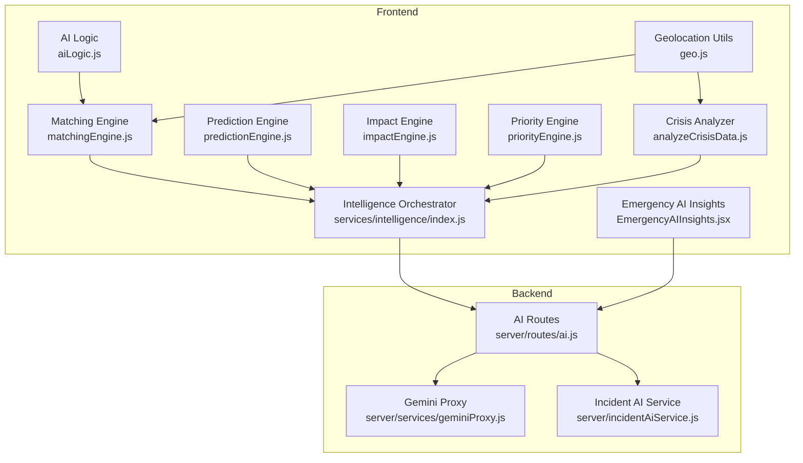
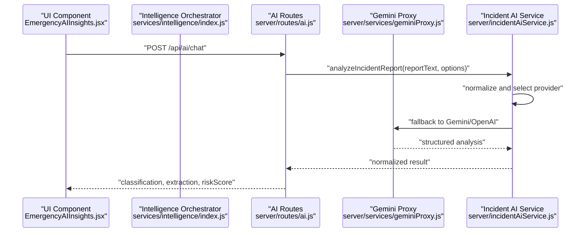
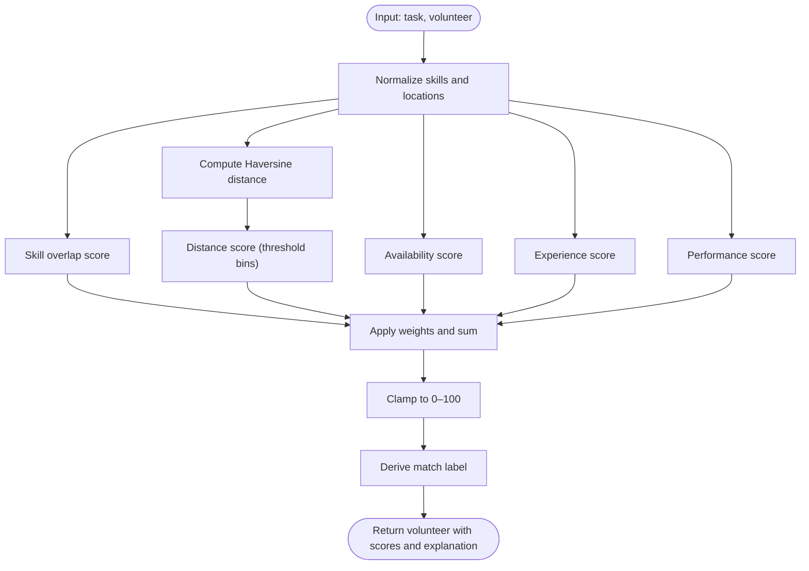
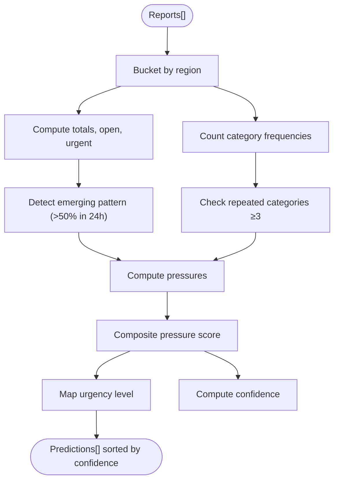
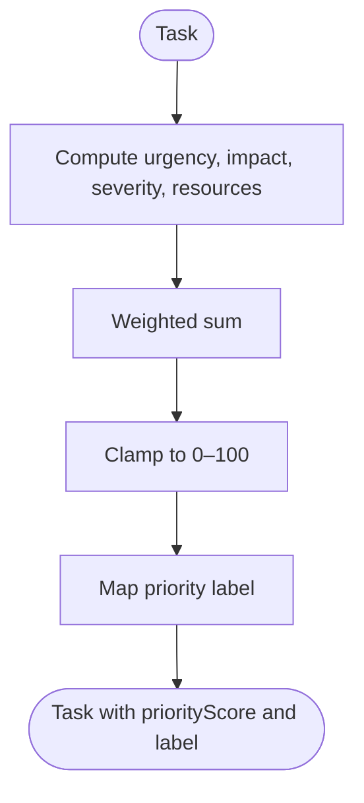
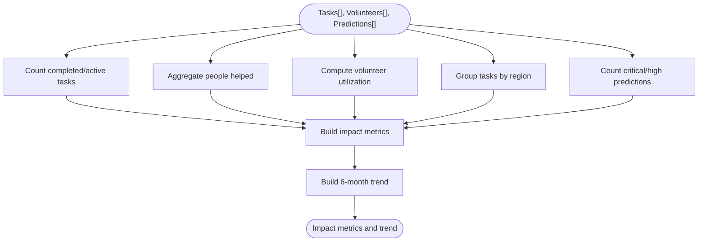
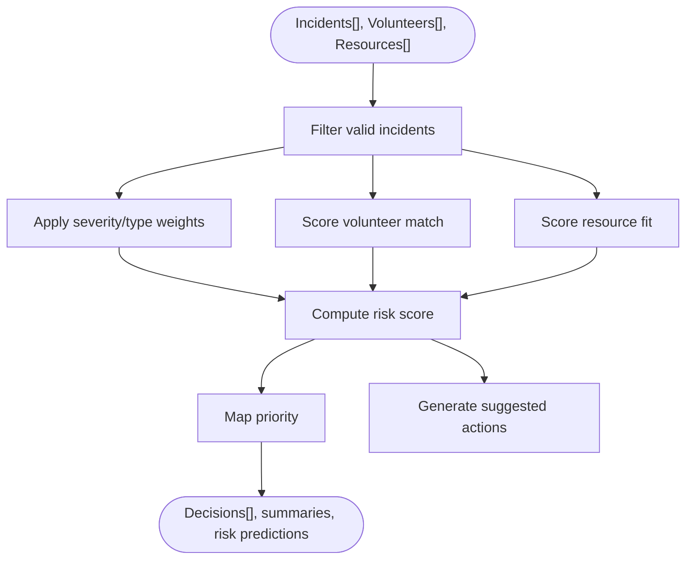
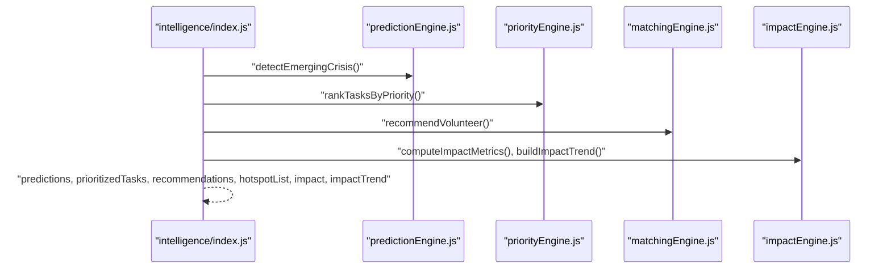
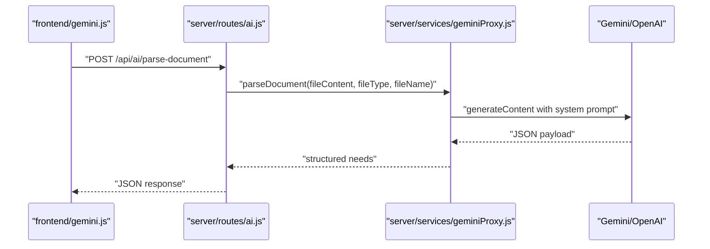
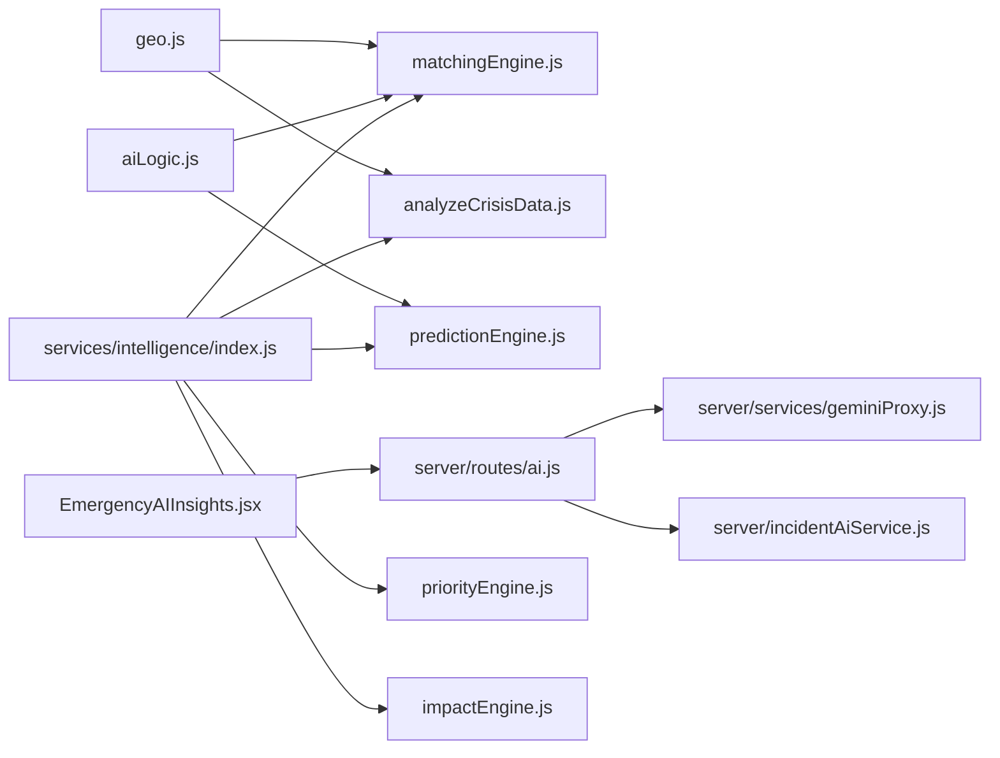

# Intelligence Engine

<cite>
**Referenced Files in This Document**
- [matchingEngine.js](file://src/engine/matchingEngine.js)
- [predictionEngine.js](file://src/engine/predictionEngine.js)
- [impactEngine.js](file://src/engine/impactEngine.js)
- [priorityEngine.js](file://src/engine/priorityEngine.js)
- [analyzeCrisisData.js](file://src/engine/analyzeCrisisData.js)
- [index.js](file://src/services/intelligence/index.js)
- [gemini.js](file://src/services/gemini.js)
- [aiLogic.js](file://src/utils/aiLogic.js)
- [geo.js](file://src/utils/geo.js)
- [incidentAI.js](file://src/services/incidentAI.js)
- [ai.js](file://server/routes/ai.js)
- [geminiProxy.js](file://server/services/geminiProxy.js)
- [incidentAiService.js](file://server/incidentAiService.js)
- [EmergencyAIInsights.jsx](file://src/components/EmergencyAIInsights.jsx)
</cite>

## Table of Contents
1. [Introduction](#introduction)
2. [Project Structure](#project-structure)
3. [Core Components](#core-components)
4. [Architecture Overview](#architecture-overview)
5. [Detailed Component Analysis](#detailed-component-analysis)
6. [Dependency Analysis](#dependency-analysis)
7. [Performance Considerations](#performance-considerations)
8. [Troubleshooting Guide](#troubleshooting-guide)
9. [Conclusion](#conclusion)
10. [Appendices](#appendices)

## Introduction
This document describes the intelligence engine powering AI-driven analytics for emergency and relief operations. It covers the volunteer matching algorithm, prediction models for crisis situations, and impact assessment engines. It also explains machine learning integration, scoring and ranking systems, real-time decision-making, geolocation-based proximity calculations, performance metrics computation, trend analysis, integration with Gemini AI services, natural language processing workflows, and automated recommendation systems. Finally, it documents algorithmic approaches, threshold configurations, optimization strategies, and the collaborative relationships among intelligence modules.

## Project Structure
The intelligence engine spans frontend and backend layers:
- Frontend engines and utilities:
  - Matching, prediction, priority, impact, and crisis analysis engines
  - AI logic utilities and geolocation helpers
  - Service orchestrators and UI components
- Backend AI services and routes:
  - Secure Gemini proxy for document parsing
  - Incident analysis service with fallback heuristics
  - Express routes exposing AI APIs for chat, explanations, and report analysis

**Diagram sources**
- [aiLogic.js:1-128](file://src/utils/aiLogic.js#L1-L128)
- [geo.js:1-37](file://src/utils/geo.js#L1-L37)
- [matchingEngine.js:1-174](file://src/engine/matchingEngine.js#L1-L174)
- [predictionEngine.js:1-98](file://src/engine/predictionEngine.js#L1-L98)
- [impactEngine.js:1-58](file://src/engine/impactEngine.js#L1-L58)
- [priorityEngine.js:1-72](file://src/engine/priorityEngine.js#L1-L72)
- [analyzeCrisisData.js:1-161](file://src/engine/analyzeCrisisData.js#L1-L161)
- [index.js:1-43](file://src/services/intelligence/index.js#L1-L43)
- [ai.js:1-348](file://server/routes/ai.js#L1-L348)
- [geminiProxy.js:1-104](file://server/services/geminiProxy.js#L1-L104)
- [incidentAiService.js:1-189](file://server/incidentAiService.js#L1-L189)
- [EmergencyAIInsights.jsx:1-600](file://src/components/EmergencyAIInsights.jsx#L1-L600)

**Section sources**
- [index.js:1-43](file://src/services/intelligence/index.js#L1-L43)
- [ai.js:1-348](file://server/routes/ai.js#L1-L348)

## Core Components
- Volunteer Matching Engine: Computes composite scores for assigning volunteers to tasks using skill fit, proximity, availability, experience, and performance.
- Prediction Engine: Infers predicted needs by region from incoming reports, computing urgency and confidence.
- Priority Engine: Scores tasks by urgency, impact, severity, and resource gaps to drive triage.
- Impact Engine: Computes operational metrics and trends to assess program effectiveness.
- Crisis Analyzer: Produces risk scores, priority zones, and actionable recommendations for incidents.
- AI Orchestration: Aggregates outputs from engines into a unified intelligence snapshot for dashboards and actions.
- AI Services and Routes: Provide secure, authenticated endpoints for NLP, document parsing, explanations, and batch analysis powered by Gemini/OpenAI.

**Section sources**
- [matchingEngine.js:1-174](file://src/engine/matchingEngine.js#L1-L174)
- [predictionEngine.js:1-98](file://src/engine/predictionEngine.js#L1-L98)
- [priorityEngine.js:1-72](file://src/engine/priorityEngine.js#L1-L72)
- [impactEngine.js:1-58](file://src/engine/impactEngine.js#L1-L58)
- [analyzeCrisisData.js:1-161](file://src/engine/analyzeCrisisData.js#L1-L161)
- [index.js:1-43](file://src/services/intelligence/index.js#L1-L43)
- [ai.js:1-348](file://server/routes/ai.js#L1-L348)

## Architecture Overview
The intelligence engine integrates frontend engines with backend AI services. Frontend engines produce local insights and rankings. The orchestration service compiles predictions, priorities, recommendations, and impact metrics. Backend routes expose secure AI endpoints for document parsing, incident analysis, chat, and explanations. The UI consumes these services to present actionable insights and enable emergency dispatch.

**Diagram sources**
- [EmergencyAIInsights.jsx:1-600](file://src/components/EmergencyAIInsights.jsx#L1-L600)
- [index.js:1-43](file://src/services/intelligence/index.js#L1-L43)
- [ai.js:1-348](file://server/routes/ai.js#L1-L348)
- [geminiProxy.js:1-104](file://server/services/geminiProxy.js#L1-L104)
- [incidentAiService.js:1-189](file://server/incidentAiService.js#L1-L189)

## Detailed Component Analysis

### Volunteer Matching Engine
The matching engine computes a weighted composite score for each volunteer-task pair:
- Features:
  - Skill fit: normalized token overlap between required and volunteer skills
  - Distance: Haversine-based km with discrete distance score thresholds
  - Availability: status and explicit availability flag
  - Experience: completed tasks threshold bins
  - Performance: rating normalized to 0–100
- Scoring:
  - Weighted sum with predefined coefficients
  - Clamped to 0–100 for match and assignment scores
  - Match label derived from thresholds
- Ranking:
  - Returns volunteers sorted by match score
  - Generates recommendations with top candidates and explanations

**Diagram sources**
- [matchingEngine.js:1-174](file://src/engine/matchingEngine.js#L1-L174)
- [geo.js:1-37](file://src/utils/geo.js#L1-L37)

**Section sources**
- [matchingEngine.js:1-174](file://src/engine/matchingEngine.js#L1-L174)
- [geo.js:1-37](file://src/utils/geo.js#L1-L37)

### Prediction Engine (Crisis Needs)
The prediction engine infers predicted needs by region from incoming reports:
- Region bucketing: groups reports by region/location
- Emerging pattern detection: identifies rapid increases in report volume over 24 hours
- Repeated category detection: detects recurring categories indicating potential shortages
- Pressure calculation: combines unresolved pressure, urgency pressure, and pattern pressure into a composite score
- Outputs:
  - Predicted need type inferred from report content
  - Urgency level mapped from pressure score
  - Confidence score and trend signal
  - Report counts and unresolved counts

**Diagram sources**
- [predictionEngine.js:1-98](file://src/engine/predictionEngine.js#L1-L98)

**Section sources**
- [predictionEngine.js:1-98](file://src/engine/predictionEngine.js#L1-L98)

### Priority Engine (Task Prioritization)
The priority engine assigns priority scores to tasks based on:
- Urgency: priority level and recency
- Impact: affected people and volunteers needed
- Severity: category-based severity weights
- Resource requirement: gap between required and assigned volunteers
- Weighted score: normalized to 0–100 with label mapping

**Diagram sources**
- [priorityEngine.js:1-72](file://src/engine/priorityEngine.js#L1-L72)

**Section sources**
- [priorityEngine.js:1-72](file://src/engine/priorityEngine.js#L1-L72)

### Impact Engine (Metrics and Trends)
The impact engine computes:
- Impact metrics: people helped, tasks completed/active, volunteer utilization, active volunteers, geographic distribution
- Trend: six-month rolling completion trend
- Derived metrics: response time improvement and resource distribution efficiency percentages

**Diagram sources**
- [impactEngine.js:1-58](file://src/engine/impactEngine.js#L1-L58)

**Section sources**
- [impactEngine.js:1-58](file://src/engine/impactEngine.js#L1-L58)

### Crisis Analyzer (Incident Risk and Actions)
The crisis analyzer evaluates incidents and recommends actions:
- Severity and type weights
- Volunteer match scoring: skill hits, availability, distance, and selection of top candidates
- Resource fit scoring: medical and vehicle availability
- Risk score: composite of severity, type, volunteer mismatch, and resource mismatch
- Priority labeling and suggested actions
- Predictions: escalation probability, expected response time, confidence

**Diagram sources**
- [analyzeCrisisData.js:1-161](file://src/engine/analyzeCrisisData.js#L1-L161)
- [geo.js:1-37](file://src/utils/geo.js#L1-L37)

**Section sources**
- [analyzeCrisisData.js:1-161](file://src/engine/analyzeCrisisData.js#L1-L161)
- [geo.js:1-37](file://src/utils/geo.js#L1-L37)

### AI Orchestration and Recommendations
The intelligence orchestrator builds a unified snapshot:
- Detects emerging crises from needs and notifications
- Ranks tasks by priority
- Generates volunteer recommendations for top tasks
- Builds hotspot regions by aggregated priority scores
- Computes impact metrics and trend

**Diagram sources**
- [index.js:1-43](file://src/services/intelligence/index.js#L1-L43)
- [predictionEngine.js:1-98](file://src/engine/predictionEngine.js#L1-L98)
- [priorityEngine.js:1-72](file://src/engine/priorityEngine.js#L1-L72)
- [matchingEngine.js:1-174](file://src/engine/matchingEngine.js#L1-L174)
- [impactEngine.js:1-58](file://src/engine/impactEngine.js#L1-L58)

**Section sources**
- [index.js:1-43](file://src/services/intelligence/index.js#L1-L43)

### Natural Language Processing and AI Services
- Secure Gemini proxy for document parsing:
  - Enforces server-side API key usage
  - Accepts text or image/pdf inputs
  - Returns structured community needs
- Incident analysis service:
  - Structured JSON extraction for classification, urgency, and resource needs
  - Fallback heuristic when LLM calls fail
  - Provider selection with auto-fallback
- Frontend integration:
  - Client-side file reading utilities
  - UI component for emergency insights and dispatch

**Diagram sources**
- [gemini.js:1-38](file://src/services/gemini.js#L1-L38)
- [ai.js:1-348](file://server/routes/ai.js#L1-L348)
- [geminiProxy.js:1-104](file://server/services/geminiProxy.js#L1-L104)

**Section sources**
- [gemini.js:1-38](file://src/services/gemini.js#L1-L38)
- [ai.js:1-348](file://server/routes/ai.js#L1-L348)
- [geminiProxy.js:1-104](file://server/services/geminiProxy.js#L1-L104)
- [incidentAiService.js:1-189](file://server/incidentAiService.js#L1-L189)
- [incidentAI.js:1-24](file://src/services/incidentAI.js#L1-L24)
- [EmergencyAIInsights.jsx:1-600](file://src/components/EmergencyAIInsights.jsx#L1-L600)

## Dependency Analysis
- Frontend engines depend on:
  - Geolocation utilities for distance computations
  - AI logic utilities for risk scoring and clustering
- Backend routes depend on:
  - Gemini proxy for document parsing
  - Incident AI service for report analysis
- UI depends on:
  - Frontend AI services and backend routes for emergency insights and dispatch

**Diagram sources**
- [geo.js:1-37](file://src/utils/geo.js#L1-L37)
- [aiLogic.js:1-128](file://src/utils/aiLogic.js#L1-L128)
- [matchingEngine.js:1-174](file://src/engine/matchingEngine.js#L1-L174)
- [predictionEngine.js:1-98](file://src/engine/predictionEngine.js#L1-L98)
- [priorityEngine.js:1-72](file://src/engine/priorityEngine.js#L1-L72)
- [impactEngine.js:1-58](file://src/engine/impactEngine.js#L1-L58)
- [analyzeCrisisData.js:1-161](file://src/engine/analyzeCrisisData.js#L1-L161)
- [index.js:1-43](file://src/services/intelligence/index.js#L1-L43)
- [ai.js:1-348](file://server/routes/ai.js#L1-L348)
- [geminiProxy.js:1-104](file://server/services/geminiProxy.js#L1-L104)
- [incidentAiService.js:1-189](file://server/incidentAiService.js#L1-L189)
- [EmergencyAIInsights.jsx:1-600](file://src/components/EmergencyAIInsights.jsx#L1-L600)

**Section sources**
- [index.js:1-43](file://src/services/intelligence/index.js#L1-L43)
- [ai.js:1-348](file://server/routes/ai.js#L1-L348)

## Performance Considerations
- Distance computations:
  - Use vectorized Haversine utilities to minimize redundant calculations.
  - Pre-filter volunteers by bounding boxes to reduce distance checks.
- Scoring and ranking:
  - Apply early exits for zero-length arrays and trivial cases.
  - Cache normalized skill sets and precompute category maps for repeated lookups.
- Prediction engine:
  - Limit region buckets to active areas and cap report windows to recent periods.
  - Use streaming aggregations for large batches.
- Impact engine:
  - Compute rolling trends incrementally and update deltas rather than re-aggregating.
- AI services:
  - Batch requests where possible and enforce rate limits.
  - Cache provider responses when appropriate and safe.

[No sources needed since this section provides general guidance]

## Troubleshooting Guide
- Missing API keys:
  - Ensure backend Gemini/OpenAI keys are configured; otherwise routes return server errors.
- Invalid inputs:
  - Routes validate presence and types of request bodies; malformed payloads return 4xx errors.
- LLM parsing failures:
  - Incident AI service falls back to heuristic extraction; verify logs for provider errors.
- Proximity issues:
  - Verify coordinate validity and handle Infinity distances gracefully.
- UI dispatch failures:
  - Check network connectivity and backend route availability; UI surfaces user-friendly errors.

**Section sources**
- [ai.js:1-348](file://server/routes/ai.js#L1-L348)
- [incidentAiService.js:1-189](file://server/incidentAiService.js#L1-L189)
- [geminiProxy.js:1-104](file://server/services/geminiProxy.js#L1-L104)
- [EmergencyAIInsights.jsx:1-600](file://src/components/EmergencyAIInsights.jsx#L1-L600)

## Conclusion
The intelligence engine integrates modular engines for matching, prediction, prioritization, and impact assessment with secure AI services for NLP and document parsing. Its collaborative design enables real-time decision-making, automated recommendations, and robust trend analysis, all while maintaining strong separation of concerns and secure AI workflows.

[No sources needed since this section summarizes without analyzing specific files]

## Appendices

### Threshold Configurations and Scoring Keys
- Matching engine weights and thresholds:
  - Weights: skill, distance, availability, experience, performance
  - Distance score bins: thresholds for km ranges
  - Availability bins: busy, soon, available
  - Experience bins: thresholds for completed tasks
  - Performance normalization: rating clamped to 0–5
- Prediction engine:
  - Pattern detection: recent report ratio and minimum count
  - Pressure weights: unresolved, urgency, pattern
  - Confidence composition: base plus report count and pressure terms
- Priority engine:
  - Severity weights by category
  - Resource gap ratio normalization
  - Weighted score coefficients and label thresholds
- Impact engine:
  - Utilization and efficiency formulas
  - Trend generation with monthly labels
- Crisis analyzer:
  - Severity and incident weights
  - Volunteer match and resource fit scoring
  - Risk score composition and priority mapping

**Section sources**
- [matchingEngine.js:1-174](file://src/engine/matchingEngine.js#L1-L174)
- [predictionEngine.js:1-98](file://src/engine/predictionEngine.js#L1-L98)
- [priorityEngine.js:1-72](file://src/engine/priorityEngine.js#L1-L72)
- [impactEngine.js:1-58](file://src/engine/impactEngine.js#L1-L58)
- [analyzeCrisisData.js:1-161](file://src/engine/analyzeCrisisData.js#L1-L161)