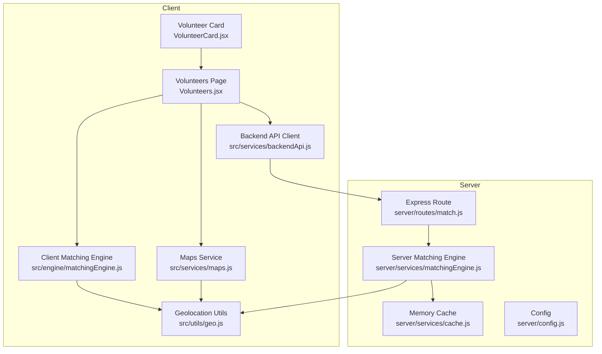
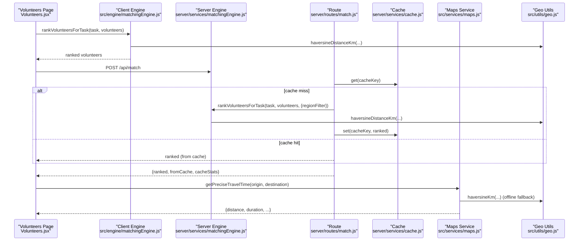
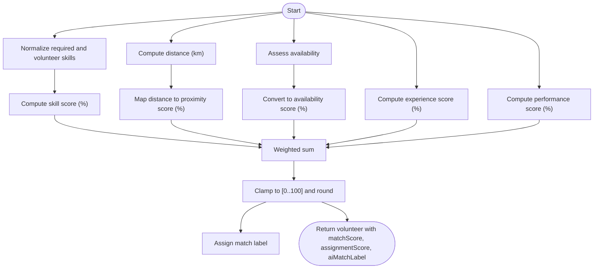
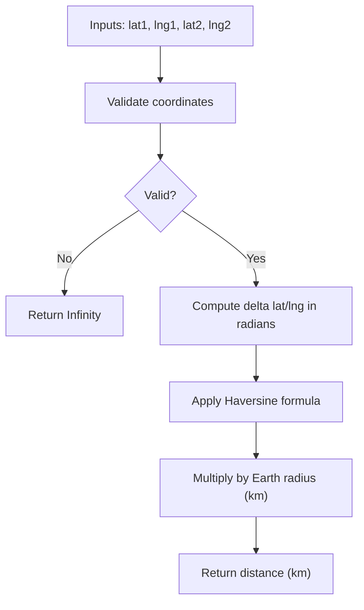
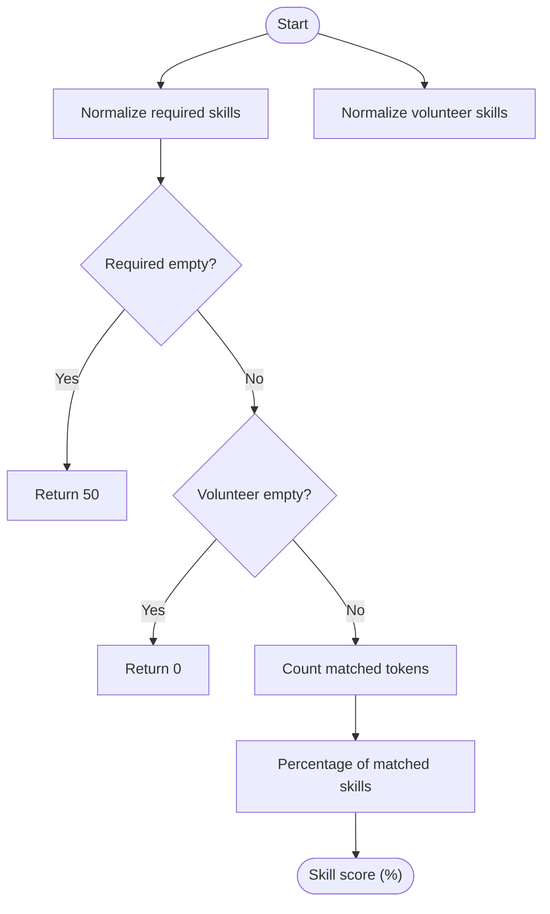
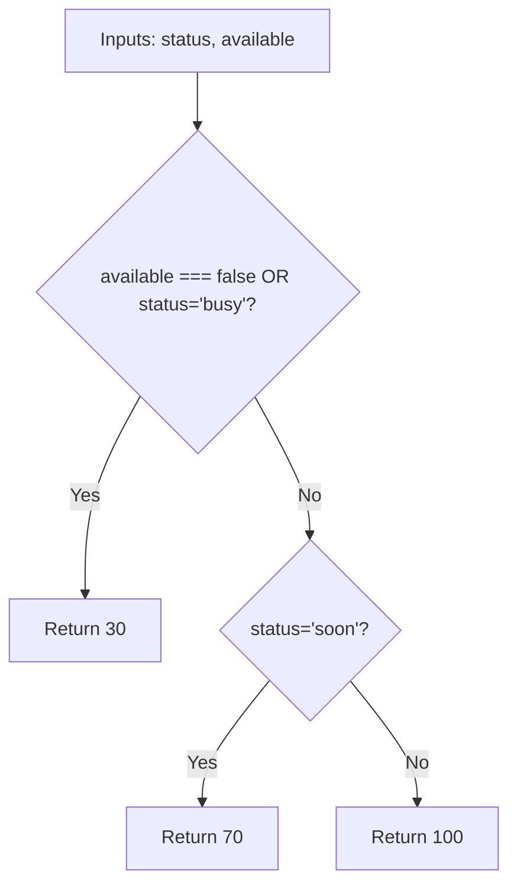
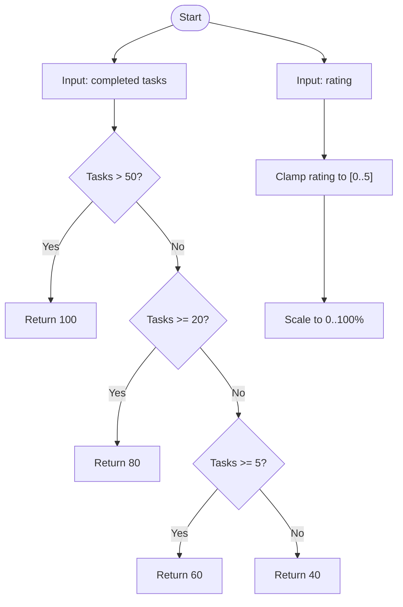
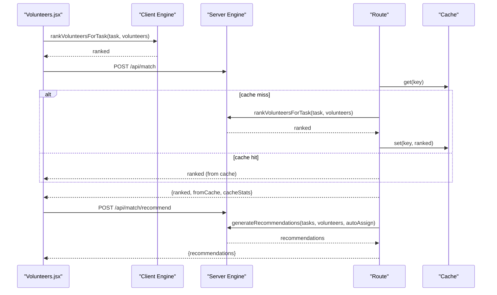
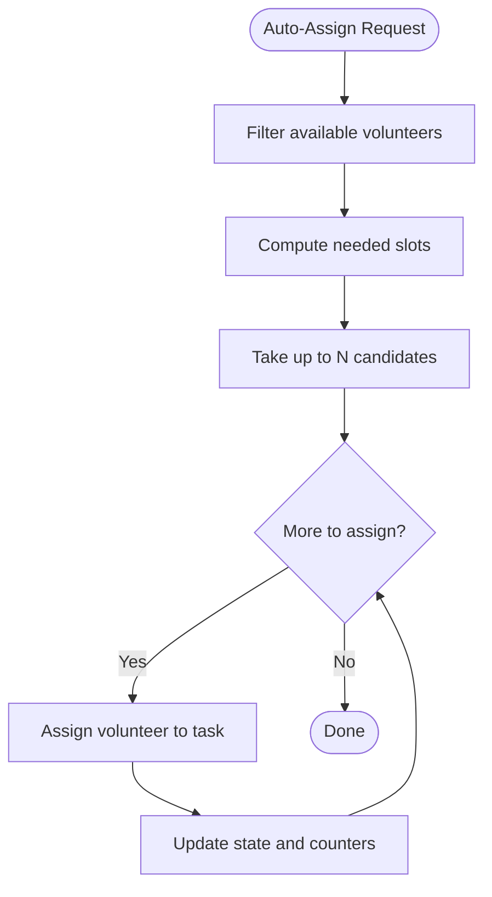
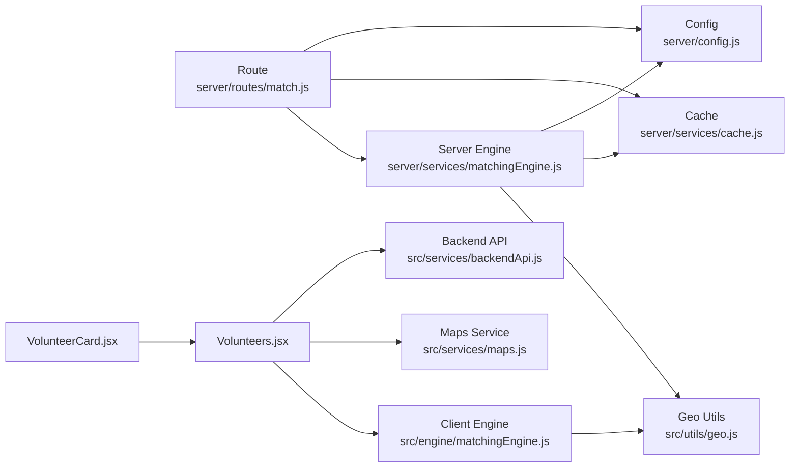

# Matching Engine

<cite>
**Referenced Files in This Document**
- [matchingEngine.js](file://src/engine/matchingEngine.js)
- [matchingEngine.js](file://server/services/matchingEngine.js)
- [geo.js](file://src/utils/geo.js)
- [maps.js](file://src/services/maps.js)
- [match.js](file://server/routes/match.js)
- [config.js](file://server/config.js)
- [cache.js](file://server/services/cache.js)
- [backendApi.js](file://src/services/backendApi.js)
- [VolunteerCard.jsx](file://src/components/volunteers/VolunteerCard.jsx)
- [Volunteers.jsx](file://src/pages/Volunteers.jsx)
- [Tasks.jsx](file://src/pages/Tasks.jsx)
</cite>

## Table of Contents
1. [Introduction](#introduction)
2. [Project Structure](#project-structure)
3. [Core Components](#core-components)
4. [Architecture Overview](#architecture-overview)
5. [Detailed Component Analysis](#detailed-component-analysis)
6. [Dependency Analysis](#dependency-analysis)
7. [Performance Considerations](#performance-considerations)
8. [Troubleshooting Guide](#troubleshooting-guide)
9. [Conclusion](#conclusion)

## Introduction
This document describes the volunteer matching engine that evaluates volunteers against tasks using a weighted scoring system. It covers the scoring factors (skill alignment, distance proximity, availability status, experience level, and performance ratings), the distance calculation using the Haversine formula, skill matching via token normalization and fuzzy matching, availability assessment logic, ranking and recommendation generation, automatic assignment capabilities, match labeling, and integration with geolocation services. It also explains how explanations for match decisions are generated.

## Project Structure
The matching engine is implemented in two places:
- Client-side engine for local UI ranking and immediate feedback
- Server-side engine for scalable batch recommendations and caching

Key supporting modules:
- Geolocation utilities for precise distance calculation
- Maps service for Google Distance Matrix integration and offline fallback
- Express route for server-side matching and caching
- Cache service for performance optimization
- Frontend pages and components that consume the engine

**Diagram sources**
- [Volunteers.jsx](file://src/pages/Volunteers.jsx)
- [VolunteerCard.jsx](file://src/components/volunteers/VolunteerCard.jsx)
- [matchingEngine.js](file://src/engine/matchingEngine.js)
- [geo.js](file://src/utils/geo.js)
- [maps.js](file://src/services/maps.js)
- [match.js](file://server/routes/match.js)
- [matchingEngine.js](file://server/services/matchingEngine.js)
- [cache.js](file://server/services/cache.js)
- [config.js](file://server/config.js)
- [backendApi.js](file://src/services/backendApi.js)

**Section sources**
- [Volunteers.jsx:1-328](file://src/pages/Volunteers.jsx#L1-L328)
- [VolunteerCard.jsx:1-269](file://src/components/volunteers/VolunteerCard.jsx#L1-L269)
- [matchingEngine.js:1-174](file://src/engine/matchingEngine.js#L1-L174)
- [geo.js:1-37](file://src/utils/geo.js#L1-L37)
- [maps.js:1-80](file://src/services/maps.js#L1-L80)
- [match.js:1-120](file://server/routes/match.js#L1-L120)
- [matchingEngine.js:1-212](file://server/services/matchingEngine.js#L1-L212)
- [cache.js:1-66](file://server/services/cache.js#L1-L66)
- [config.js:1-35](file://server/config.js#L1-L35)
- [backendApi.js:1-164](file://src/services/backendApi.js#L1-L164)

## Core Components
- Weighted scoring system with configurable weights for skill, distance, availability, experience, and performance
- Distance calculation using the Haversine formula
- Skill matching via normalized tokens and fuzzy containment checks
- Availability assessment based on status and availability flag
- Experience and performance scoring derived from completed tasks and rating
- Ranking and recommendation generation with optional automatic assignment
- Match labeling (Perfect, Strong, Moderate, Low Match)
- Explanation generation for match decisions
- Integration with geolocation services and offline fallback

**Section sources**
- [matchingEngine.js:3-11](file://src/engine/matchingEngine.js#L3-L11)
- [matchingEngine.js:34-40](file://server/services/matchingEngine.js#L34-L40)
- [geo.js:15-29](file://src/utils/geo.js#L15-L29)
- [matchingEngine.js:64-79](file://src/engine/matchingEngine.js#L64-L79)
- [matchingEngine.js:90-99](file://server/services/matchingEngine.js#L90-L99)
- [matchingEngine.js:45-62](file://src/engine/matchingEngine.js#L45-L62)
- [matchingEngine.js:72-88](file://server/services/matchingEngine.js#L72-L88)
- [matchingEngine.js:143-173](file://src/engine/matchingEngine.js#L143-L173)
- [matchingEngine.js:166-211](file://server/services/matchingEngine.js#L166-L211)
- [matchingEngine.js:81-86](file://src/engine/matchingEngine.js#L81-L86)
- [matchingEngine.js:101-106](file://server/services/matchingEngine.js#L101-L106)
- [matchingEngine.js:122-129](file://src/engine/matchingEngine.js#L122-L129)
- [matchingEngine.js:148-155](file://server/services/matchingEngine.js#L148-L155)

## Architecture Overview
The matching engine runs on both client and server:
- Client engine powers immediate UI ranking and card rendering
- Server engine handles batch recommendations, caching, and scalability
- Geolocation utilities provide Haversine distance calculation
- Maps service integrates with Google Distance Matrix or falls back to offline estimation
- Routes expose endpoints for single-task ranking and batch recommendations
- Cache stores computed rankings keyed by task and volunteer IDs

**Diagram sources**
- [Volunteers.jsx:140-157](file://src/pages/Volunteers.jsx#L140-L157)
- [matchingEngine.js:143-147](file://src/engine/matchingEngine.js#L143-L147)
- [matchingEngine.js:166-182](file://server/services/matchingEngine.js#L166-L182)
- [match.js:33-77](file://server/routes/match.js#L33-L77)
- [cache.js:21-44](file://server/services/cache.js#L21-L44)
- [maps.js:37-79](file://src/services/maps.js#L37-L79)
- [geo.js:15-29](file://src/utils/geo.js#L15-L29)

## Detailed Component Analysis

### Weighted Scoring System
The engine computes a composite score by weighting individual scores:
- Weights: skill, distance, availability, experience, performance
- Each factor is scored independently and then combined using the weights
- Final score is clamped to [0, 100] and normalized for UI presentation

**Diagram sources**
- [matchingEngine.js:3-9](file://src/engine/matchingEngine.js#L3-L9)
- [matchingEngine.js:64-79](file://src/engine/matchingEngine.js#L64-L79)
- [matchingEngine.js:37-43](file://src/engine/matchingEngine.js#L37-L43)
- [matchingEngine.js:45-49](file://src/engine/matchingEngine.js#L45-L49)
- [matchingEngine.js:51-57](file://src/engine/matchingEngine.js#L51-L57)
- [matchingEngine.js:59-62](file://src/engine/matchingEngine.js#L59-L62)
- [matchingEngine.js:105-114](file://src/engine/matchingEngine.js#L105-L114)
- [matchingEngine.js:81-86](file://src/engine/matchingEngine.js#L81-L86)

**Section sources**
- [matchingEngine.js:3-11](file://src/engine/matchingEngine.js#L3-L11)
- [matchingEngine.js:34-40](file://server/services/matchingEngine.js#L34-L40)
- [matchingEngine.js:105-114](file://src/engine/matchingEngine.js#L105-L114)
- [matchingEngine.js:125-132](file://server/services/matchingEngine.js#L125-L132)

### Distance Calculation Using Haversine Formula
- Uses the Haversine formula to compute great-circle distance between two latitude/longitude points
- Provides a self-contained implementation in both client and server engines
- Offline fallback uses straight-line distance estimation when Google Maps API is unavailable

**Diagram sources**
- [geo.js:15-29](file://src/utils/geo.js#L15-L29)
- [matchingEngine.js:20-30](file://server/services/matchingEngine.js#L20-L30)
- [maps.js:11-35](file://src/services/maps.js#L11-L35)

**Section sources**
- [geo.js:1-37](file://src/utils/geo.js#L1-L37)
- [matchingEngine.js:14-30](file://server/services/matchingEngine.js#L14-L30)
- [maps.js:11-35](file://src/services/maps.js#L11-L35)

### Skill Matching Through Token Normalization and Fuzzy Matching
- Normalizes skill tokens by trimming, lowercasing, removing punctuation, and collapsing whitespace
- Builds sets of normalized tokens for required and volunteer skills
- Uses fuzzy matching by checking equality or containment (substring inclusion) between tokens
- Returns a percentage of matched required skills

**Diagram sources**
- [matchingEngine.js:18-28](file://src/engine/matchingEngine.js#L18-L28)
- [matchingEngine.js:64-79](file://src/engine/matchingEngine.js#L64-L79)
- [matchingEngine.js:47-53](file://server/services/matchingEngine.js#L47-L53)
- [matchingEngine.js:90-99](file://server/services/matchingEngine.js#L90-L99)

**Section sources**
- [matchingEngine.js:18-28](file://src/engine/matchingEngine.js#L18-L28)
- [matchingEngine.js:64-79](file://src/engine/matchingEngine.js#L64-L79)
- [matchingEngine.js:47-53](file://server/services/matchingEngine.js#L47-L53)
- [matchingEngine.js:90-99](file://server/services/matchingEngine.js#L90-L99)

### Availability Assessment Logic
- Converts availability flag and status string to a score
- Busy status yields the lowest score; “soon” yields a moderate score; otherwise highest
- Used to penalize or reward candidates based on readiness

**Diagram sources**
- [matchingEngine.js:45-49](file://src/engine/matchingEngine.js#L45-L49)
- [matchingEngine.js:72-76](file://server/services/matchingEngine.js#L72-L76)

**Section sources**
- [matchingEngine.js:45-49](file://src/engine/matchingEngine.js#L45-L49)
- [matchingEngine.js:72-76](file://server/services/matchingEngine.js#L72-L76)

### Experience and Performance Scoring
- Experience score increases with completed tasks, capped at higher tiers
- Performance score scales linearly with rating (clamped to [0, 5])

**Diagram sources**
- [matchingEngine.js:51-57](file://src/engine/matchingEngine.js#L51-L57)
- [matchingEngine.js:59-62](file://src/engine/matchingEngine.js#L59-L62)
- [matchingEngine.js:78-84](file://server/services/matchingEngine.js#L78-L84)
- [matchingEngine.js:86-88](file://server/services/matchingEngine.js#L86-L88)

**Section sources**
- [matchingEngine.js:51-62](file://src/engine/matchingEngine.js#L51-L62)
- [matchingEngine.js:78-88](file://server/services/matchingEngine.js#L78-L88)

### Ranking Mechanism and Recommendation Generation
- Ranks volunteers by matchScore descending
- Generates recommendations for multiple tasks with optional automatic assignment
- Selects top candidates considering availability and required slots

**Diagram sources**
- [Volunteers.jsx:140-157](file://src/pages/Volunteers.jsx#L140-L157)
- [matchingEngine.js:143-147](file://src/engine/matchingEngine.js#L143-L147)
- [match.js:33-77](file://server/routes/match.js#L33-L77)
- [matchingEngine.js:166-182](file://server/services/matchingEngine.js#L166-L182)
- [match.js:82-106](file://server/routes/match.js#L82-L106)
- [matchingEngine.js:187-211](file://server/services/matchingEngine.js#L187-L211)

**Section sources**
- [matchingEngine.js:143-147](file://src/engine/matchingEngine.js#L143-L147)
- [matchingEngine.js:166-182](file://server/services/matchingEngine.js#L166-L182)
- [match.js:33-77](file://server/routes/match.js#L33-L77)
- [matchingEngine.js:187-211](file://server/services/matchingEngine.js#L187-L211)
- [match.js:82-106](file://server/routes/match.js#L82-L106)

### Automatic Assignment Capabilities
- Automatic assignment selects the top candidate if available and requested
- Updates volunteer availability and task assignment counts
- Provides immediate UI feedback and success messages

**Diagram sources**
- [Volunteers.jsx:180-200](file://src/pages/Volunteers.jsx#L180-L200)

**Section sources**
- [Volunteers.jsx:180-200](file://src/pages/Volunteers.jsx#L180-L200)

### Match Labeling System
- Labels are derived from the final matchScore:
  - Perfect Match: ≥ 90
  - Strong Match: ≥ 70
  - Moderate Match: ≥ 50
  - Low Match: < 50

**Section sources**
- [matchingEngine.js:81-86](file://src/engine/matchingEngine.js#L81-L86)
- [matchingEngine.js:101-106](file://server/services/matchingEngine.js#L101-L106)

### Explanation Generation for Match Decisions
- Explanations summarize skill fit, distance, availability, and performance
- AI reasons enumerate contributing factors (e.g., too far, missing skills, low availability, low experience)
- Frontend cards render explanations and reasoning for transparency

**Section sources**
- [matchingEngine.js:122-129](file://src/engine/matchingEngine.js#L122-L129)
- [matchingEngine.js:148-155](file://server/services/matchingEngine.js#L148-L155)
- [VolunteerCard.jsx:140-151](file://src/components/volunteers/VolunteerCard.jsx#L140-L151)

### Integration with Geolocation Services
- Client-side maps service integrates with Google Distance Matrix API
- Offline fallback uses Haversine-based estimates when API key is not configured
- Travel time and distance are cached to improve performance

**Section sources**
- [maps.js:37-79](file://src/services/maps.js#L37-L79)
- [backendApi.js:134-149](file://src/services/backendApi.js#L134-L149)

## Dependency Analysis
- Client engine depends on geolocation utilities for distance calculation
- Server engine embeds its own Haversine implementation and depends on cache and config
- Routes depend on server engine and cache, and expose monitoring endpoints
- Frontend pages depend on client engine and maps service for live travel metrics

**Diagram sources**
- [matchingEngine.js:1-1](file://src/engine/matchingEngine.js#L1-L1)
- [geo.js:1-37](file://src/utils/geo.js#L1-L37)
- [matchingEngine.js:1-30](file://server/services/matchingEngine.js#L1-L30)
- [cache.js:1-66](file://server/services/cache.js#L1-L66)
- [config.js:1-35](file://server/config.js#L1-L35)
- [match.js:1-120](file://server/routes/match.js#L1-L120)
- [Volunteers.jsx:1-328](file://src/pages/Volunteers.jsx#L1-L328)
- [maps.js:1-80](file://src/services/maps.js#L1-L80)
- [backendApi.js:1-164](file://src/services/backendApi.js#L1-L164)
- [VolunteerCard.jsx:1-269](file://src/components/volunteers/VolunteerCard.jsx#L1-L269)

**Section sources**
- [matchingEngine.js:1-1](file://src/engine/matchingEngine.js#L1-L1)
- [matchingEngine.js:1-30](file://server/services/matchingEngine.js#L1-L30)
- [match.js:1-120](file://server/routes/match.js#L1-L120)
- [Volunteers.jsx:1-328](file://src/pages/Volunteers.jsx#L1-L328)
- [VolunteerCard.jsx:1-269](file://src/components/volunteers/VolunteerCard.jsx#L1-L269)

## Performance Considerations
- Caching: Server-side cache reduces recomputation for identical task+volunteer sets
- Region filtering: Server engine pre-filters by region to limit scoring scope
- LRU eviction and TTL: Cache maintains hit rate and memory footprint
- Offline fallback: Maps service avoids network latency by estimating metrics when API is unavailable
- Client-side ranking: Immediate feedback for small datasets; server-side batching for larger ones

**Section sources**
- [match.js:11-21](file://server/routes/match.js#L11-L21)
- [matchingEngine.js:166-177](file://server/services/matchingEngine.js#L166-L177)
- [cache.js:10-66](file://server/services/cache.js#L10-L66)
- [config.js:29-32](file://server/config.js#L29-L32)
- [maps.js:37-79](file://src/services/maps.js#L37-L79)

## Troubleshooting Guide
- No volunteers shown: Verify coordinates are present and valid; ensure required skills are populated
- Poor distances: Confirm lat/lng fields are numeric and finite; check geolocation utilities
- Cache not used: Ensure cache keys are stable and useCache is enabled; monitor cache stats endpoint
- API errors: Check backend health endpoint and route error responses; review server logs
- Missing explanations: Ensure explanation fields are populated in ranked results

**Section sources**
- [geo.js:7-13](file://src/utils/geo.js#L7-L13)
- [match.js:45-52](file://server/routes/match.js#L45-L52)
- [match.js:108-117](file://server/routes/match.js#L108-L117)
- [backendApi.js:154-162](file://src/services/backendApi.js#L154-L162)

## Conclusion
The matching engine provides a robust, configurable, and scalable solution for volunteer-task matching. It balances multiple criteria using weighted scores, ensures accurate distance computation, and offers transparent explanations. The dual client-server architecture enables responsive UI interactions and efficient batch processing, while caching and offline fallbacks enhance reliability and performance.