# Prediction Engine

<cite>
**Referenced Files in This Document**
- [predictionEngine.js](file://src/engine/predictionEngine.js)
- [predictionEngine.js](file://src/services/intelligence/predictionEngine.js)
- [analyzeCrisisData.js](file://src/engine/analyzeCrisisData.js)
- [index.js](file://src/services/intelligence/index.js)
- [aiLogic.js](file://src/utils/aiLogic.js)
- [geo.js](file://src/utils/geo.js)
- [matchingEngine.js](file://src/services/intelligence/matchingEngine.js)
- [impactEngine.js](file://src/services/intelligence/impactEngine.js)
- [priorityEngine.js](file://src/services/intelligence/priorityEngine.js)
- [PredictionDashboard.jsx](file://src/components/PredictionDashboard.jsx)
- [incidentAI.js](file://src/services/incidentAI.js)
- [ai.js](file://server/routes/ai.js)
- [incidentAiService.js](file://server/incidentAiService.js)
- [gujaratPlaces.js](file://src/data/gujaratPlaces.js)
</cite>

## Table of Contents
1. [Introduction](#introduction)
2. [Project Structure](#project-structure)
3. [Core Components](#core-components)
4. [Architecture Overview](#architecture-overview)
5. [Detailed Component Analysis](#detailed-component-analysis)
6. [Dependency Analysis](#dependency-analysis)
7. [Performance Considerations](#performance-considerations)
8. [Troubleshooting Guide](#troubleshooting-guide)
9. [Conclusion](#conclusion)
10. [Appendices](#appendices)

## Introduction
This document describes the crisis prediction and forecasting engine powering automated risk assessment, demand forecasting, and hotspot identification for disaster response operations. It covers the prediction models, data preprocessing, feature engineering, training workflows, integration with historical and situational data, alert thresholds, uncertainty quantification, and real-time update mechanisms. The system blends rule-based heuristics, weighted scoring, clustering, and geospatial analytics to produce actionable insights and drive emergency response protocols.

## Project Structure
The prediction engine spans client-side UI components, service-layer intelligence modules, and server-side AI integrations:
- Client-side prediction dashboard and visualization
- Intelligence services for emerging crisis detection, task prioritization, matching, and impact metrics
- Geospatial utilities for distance calculations and coordinate resolution
- Server-side AI pipeline for report parsing and structured extraction

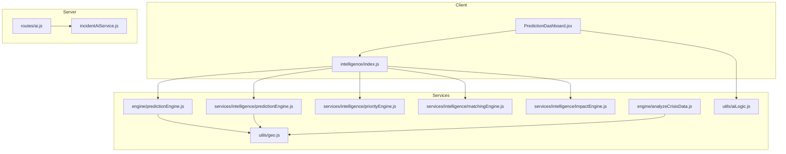

**Diagram sources**
- [PredictionDashboard.jsx:1-134](file://src/components/PredictionDashboard.jsx#L1-L134)
- [index.js:1-43](file://src/services/intelligence/index.js#L1-L43)
- [predictionEngine.js:1-98](file://src/engine/predictionEngine.js#L1-L98)
- [predictionEngine.js:1-66](file://src/services/intelligence/predictionEngine.js#L1-L66)
- [priorityEngine.js:1-52](file://src/services/intelligence/priorityEngine.js#L1-L52)
- [matchingEngine.js:1-59](file://src/services/intelligence/matchingEngine.js#L1-L59)
- [impactEngine.js:1-44](file://src/services/intelligence/impactEngine.js#L1-L44)
- [analyzeCrisisData.js:1-161](file://src/engine/analyzeCrisisData.js#L1-L161)
- [aiLogic.js:1-128](file://src/utils/aiLogic.js#L1-L128)
- [geo.js:1-37](file://src/utils/geo.js#L1-L37)
- [ai.js:1-348](file://server/routes/ai.js#L1-L348)
- [incidentAiService.js:1-189](file://server/incidentAiService.js#L1-L189)

**Section sources**
- [PredictionDashboard.jsx:1-134](file://src/components/PredictionDashboard.jsx#L1-L134)
- [index.js:1-43](file://src/services/intelligence/index.js#L1-L43)
- [ai.js:1-348](file://server/routes/ai.js#L1-L348)

## Core Components
- Emerging Crisis Detection: Identifies spikes in incident reports and keyword-driven signals to flag potential escalations.
- Risk and Need Forecasting: Computes urgency, confidence, and predicted need types by region and location.
- Task Prioritization: Scores and ranks tasks by urgency, severity, deadline, and resource gaps.
- Matching Engine: Recommends suitable volunteers for tasks considering proximity, skills, availability, and performance.
- Impact Metrics and Trends: Tracks completion rates, distribution efficiency, and utilization trends.
- Geospatial Analytics: Clusters reports, computes distances, and resolves coordinates for mapping.
- AI-Powered Report Analysis: Structured extraction of categories, urgency, locations, and risk scores from free-text reports.

**Section sources**
- [predictionEngine.js:15-65](file://src/services/intelligence/predictionEngine.js#L15-L65)
- [predictionEngine.js:55-97](file://src/engine/predictionEngine.js#L55-L97)
- [priorityEngine.js:32-51](file://src/services/intelligence/priorityEngine.js#L32-L51)
- [matchingEngine.js:27-58](file://src/services/intelligence/matchingEngine.js#L27-L58)
- [impactEngine.js:3-43](file://src/services/intelligence/impactEngine.js#L3-L43)
- [aiLogic.js:74-127](file://src/utils/aiLogic.js#L74-L127)
- [ai.js:262-345](file://server/routes/ai.js#L262-L345)
- [incidentAiService.js:170-188](file://server/incidentAiService.js#L170-L188)

## Architecture Overview
The system integrates real-time and historical data streams to generate predictions and recommendations:
- Data ingestion via AI report analysis and internal needs/tasks
- Feature engineering using categorical counts, urgency flags, keyword matches, and geospatial clustering
- Scoring functions for confidence, urgency, and risk
- Aggregation into region-level hotspots and task rankings
- Visualization and alerting through the dashboard

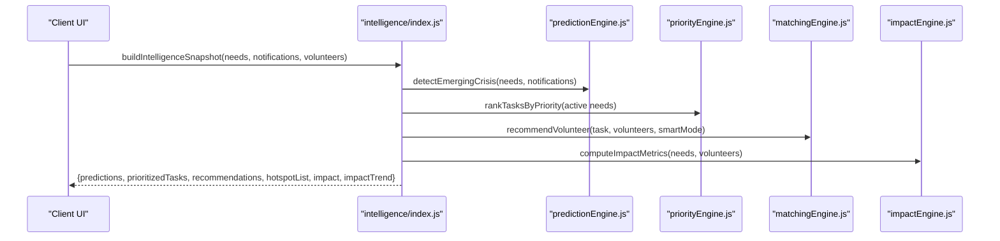

**Diagram sources**
- [index.js:6-42](file://src/services/intelligence/index.js#L6-L42)
- [predictionEngine.js:15-65](file://src/services/intelligence/predictionEngine.js#L15-L65)
- [priorityEngine.js:47-51](file://src/services/intelligence/priorityEngine.js#L47-L51)
- [matchingEngine.js:51-58](file://src/services/intelligence/matchingEngine.js#L51-L58)
- [impactEngine.js:3-43](file://src/services/intelligence/impactEngine.js#L3-L43)

## Detailed Component Analysis

### Emerging Crisis Detection
- Purpose: Detect emerging hotspots and escalation signals from incident reports and keyword patterns.
- Inputs: Needs (active), notifications (title/body), optional severity keywords.
- Outputs: Region/task-level predictions with urgency, confidence, and reasons.
- Methodology:
  - Bucket needs by region/location key.
  - Compute counts, urgent counts, and resource mentions.
  - Score signals from keywords in notifications.
  - Combine into a composite confidence score and filter by minimum threshold.

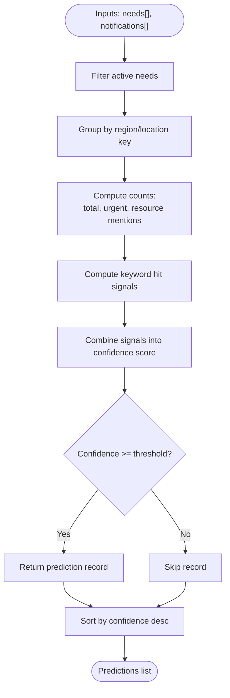

**Diagram sources**
- [predictionEngine.js:15-65](file://src/services/intelligence/predictionEngine.js#L15-L65)

**Section sources**
- [predictionEngine.js:15-65](file://src/services/intelligence/predictionEngine.js#L15-L65)

### Region-Level Need Forecasting
- Purpose: Predict need types, urgency, and confidence per region based on report patterns.
- Inputs: List of reports with region/location/status/category/priority.
- Outputs: Region-level predictions with confidence, trend signal, and reasoning.
- Methodology:
  - Bucket reports by region.
  - Compute unresolved pressure, urgency pressure, and pattern pressure.
  - Weighted combination yields a pressure score mapped to urgency and confidence.

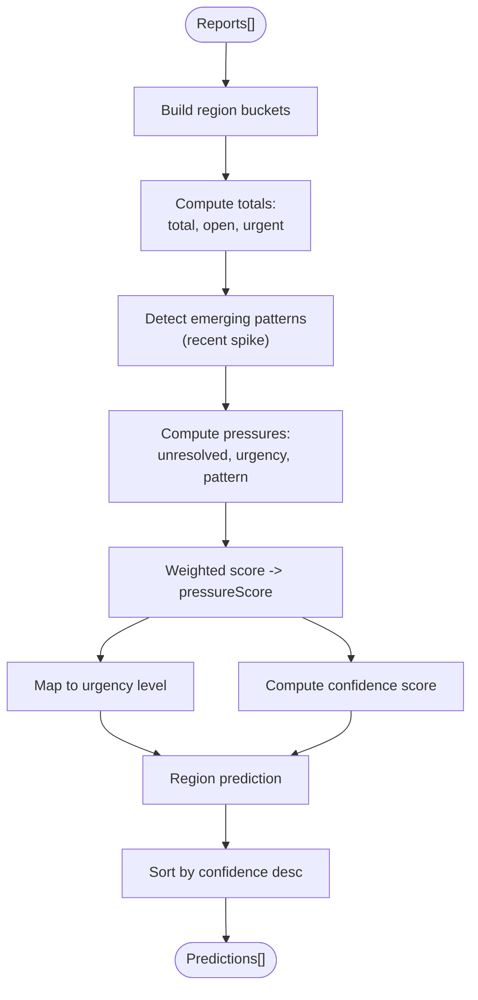

**Diagram sources**
- [predictionEngine.js:55-97](file://src/engine/predictionEngine.js#L55-L97)

**Section sources**
- [predictionEngine.js:55-97](file://src/engine/predictionEngine.js#L55-L97)

### Risk Assessment and Escalation Prediction
- Purpose: Compute risk scores, priority labels, and predictive indicators for incidents.
- Inputs: Incidents with severity/type, volunteers/resources, and locations.
- Outputs: Risk score, priority, suggested actions, and prediction metrics.
- Methodology:
  - Weighted aggregation of severity/type and inverse of volunteer/resource fit.
  - Predictive metrics include escalation probability and expected response time.
  - Confidence derived from volunteer match quality and resource fit.

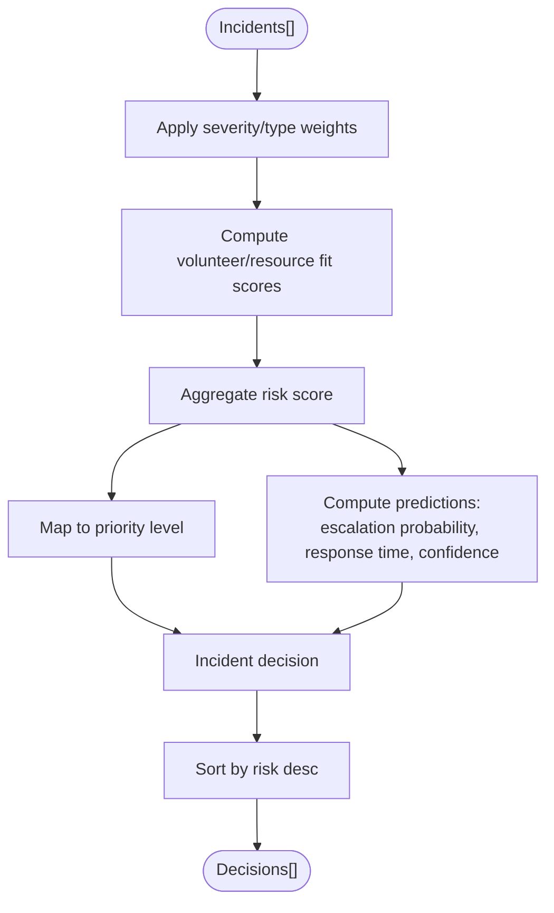

**Diagram sources**
- [analyzeCrisisData.js:87-160](file://src/engine/analyzeCrisisData.js#L87-L160)

**Section sources**
- [analyzeCrisisData.js:87-160](file://src/engine/analyzeCrisisData.js#L87-L160)

### Task Prioritization
- Purpose: Rank tasks by priority score combining urgency, severity, deadline, and resource gaps.
- Inputs: Tasks with priority, status, deadline, and resource needs.
- Outputs: Ranked tasks with priority label and score.
- Methodology:
  - Score components computed from task attributes.
  - Threshold-based labeling for priority bands.

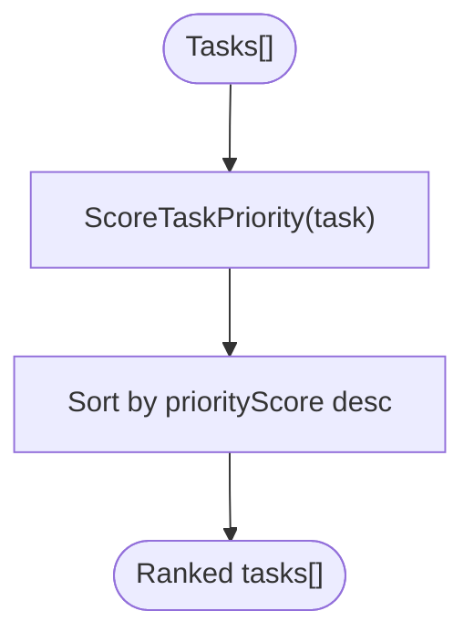

**Diagram sources**
- [priorityEngine.js:32-51](file://src/services/intelligence/priorityEngine.js#L32-L51)

**Section sources**
- [priorityEngine.js:32-51](file://src/services/intelligence/priorityEngine.js#L32-L51)

### Volunteer Matching
- Purpose: Recommend suitable volunteers for tasks considering proximity, skills, availability, and performance.
- Inputs: Task and volunteers with locations, skills, ratings, and availability.
- Outputs: Ranked volunteers and recommended assignment.
- Methodology:
  - Distance-based proximity score.
  - Skill match evaluation against task keywords.
  - Availability and performance multipliers.

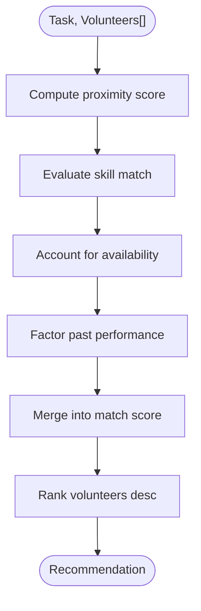

**Diagram sources**
- [matchingEngine.js:27-58](file://src/services/intelligence/matchingEngine.js#L27-L58)

**Section sources**
- [matchingEngine.js:27-58](file://src/services/intelligence/matchingEngine.js#L27-L58)

### Impact Metrics and Trends
- Purpose: Measure operational effectiveness and track progress over time.
- Inputs: Needs and volunteers.
- Outputs: People helped, completion ratios, distribution efficiency, utilization, and monthly trends.
- Methodology:
  - Aggregates counts and averages across active/completed needs.
  - Builds synthetic monthly trend series for visualization.

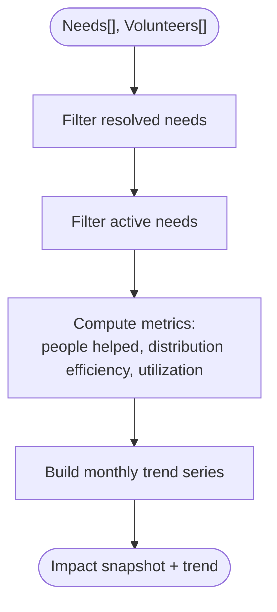

**Diagram sources**
- [impactEngine.js:3-43](file://src/services/intelligence/impactEngine.js#L3-L43)

**Section sources**
- [impactEngine.js:3-43](file://src/services/intelligence/impactEngine.js#L3-L43)

### Geospatial Analytics and Coordinate Resolution
- Purpose: Cluster reports, compute distances, and resolve coordinates for mapping.
- Inputs: Reports with locations; region/place datasets.
- Outputs: Clustered alerts, distances, and resolved coordinates.
- Methodology:
  - Haversine distance for proximity and clustering.
  - Coordinate fallback and nearest-region lookup.

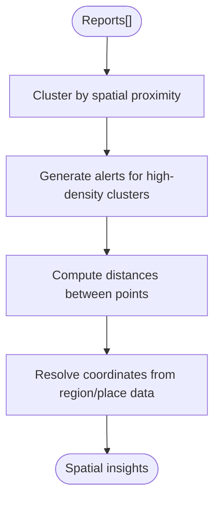

**Diagram sources**
- [aiLogic.js:74-127](file://src/utils/aiLogic.js#L74-L127)
- [geo.js:15-29](file://src/utils/geo.js#L15-L29)
- [gujaratPlaces.js:92-115](file://src/data/gujaratPlaces.js#L92-L115)

**Section sources**
- [aiLogic.js:74-127](file://src/utils/aiLogic.js#L74-L127)
- [geo.js:15-29](file://src/utils/geo.js#L15-L29)
- [gujaratPlaces.js:92-115](file://src/data/gujaratPlaces.js#L92-L115)

### AI-Powered Report Analysis Pipeline
- Purpose: Extract structured data from free-text incident reports for downstream prediction.
- Inputs: Report text, provider selection, context.
- Outputs: Classification, extraction, risk score, tags, and summary.
- Methodology:
  - LLM-based extraction with strict JSON schema.
  - Fallback heuristic when LLMs fail.
  - Client-side wrapper to call server endpoints.

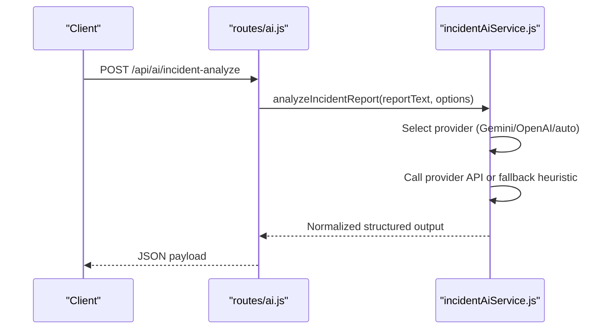

**Diagram sources**
- [ai.js:52-76](file://server/routes/ai.js#L52-L76)
- [incidentAiService.js:170-188](file://server/incidentAiService.js#L170-L188)

**Section sources**
- [ai.js:52-76](file://server/routes/ai.js#L52-L76)
- [incidentAiService.js:170-188](file://server/incidentAiService.js#L170-L188)
- [incidentAI.js:1-24](file://src/services/incidentAI.js#L1-L24)

### Prediction Dashboard
- Purpose: Visualize predictions, urgency mix, and top hotspots; trigger navigation to priority tasks.
- Inputs: Predictions, hotspots, smart mode toggle.
- Outputs: Dashboard cards with summary statistics and actionable buttons.
- Methodology:
  - Aggregates confidence and urgency distributions.
  - Highlights leading signals and top regions.

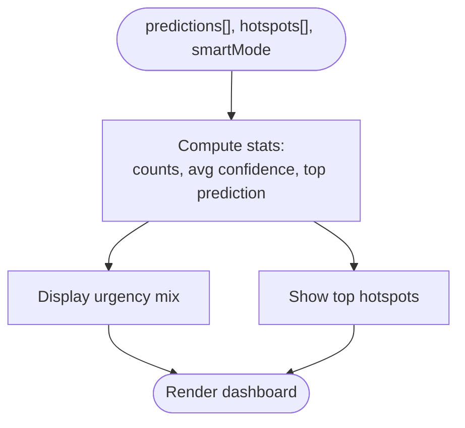

**Diagram sources**
- [PredictionDashboard.jsx:11-133](file://src/components/PredictionDashboard.jsx#L11-L133)

**Section sources**
- [PredictionDashboard.jsx:11-133](file://src/components/PredictionDashboard.jsx#L11-L133)

## Dependency Analysis
- Cohesion: Each module encapsulates a distinct prediction or analytics function with clear inputs/outputs.
- Coupling:
  - Intelligence index orchestrates multiple engines and aggregates outputs.
  - Geospatial utilities are shared across prediction and matching engines.
  - AI report analysis is decoupled via server routes and client service.
- External Integrations:
  - LLM providers (Gemini/OpenAI) for structured extraction.
  - Firestore-backed needs/tasks for runtime data.

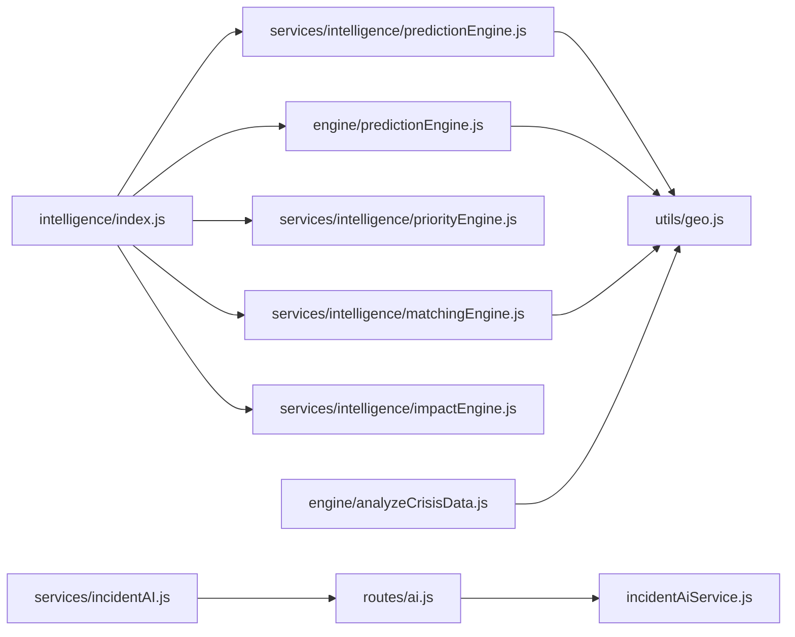

**Diagram sources**
- [index.js:1-43](file://src/services/intelligence/index.js#L1-L43)
- [predictionEngine.js:1-66](file://src/services/intelligence/predictionEngine.js#L1-L66)
- [predictionEngine.js:1-98](file://src/engine/predictionEngine.js#L1-L98)
- [priorityEngine.js:1-52](file://src/services/intelligence/priorityEngine.js#L1-L52)
- [matchingEngine.js:1-59](file://src/services/intelligence/matchingEngine.js#L1-L59)
- [impactEngine.js:1-44](file://src/services/intelligence/impactEngine.js#L1-L44)
- [geo.js:1-37](file://src/utils/geo.js#L1-L37)
- [ai.js:1-348](file://server/routes/ai.js#L1-L348)
- [incidentAiService.js:1-189](file://server/incidentAiService.js#L1-L189)
- [incidentAI.js:1-24](file://src/services/incidentAI.js#L1-L24)

**Section sources**
- [index.js:1-43](file://src/services/intelligence/index.js#L1-L43)
- [ai.js:1-348](file://server/routes/ai.js#L1-L348)

## Performance Considerations
- Complexity:
  - Region bucketing scales linearly with report count.
  - Clustering and spatial scoring scale with O(n^2) in worst-case; consider spatial indexing for large datasets.
  - Sorting dominates cost in ranking and dashboard rendering.
- Caching:
  - Store recent predictions and hotspots to avoid recomputation on minor updates.
  - Cache LLM extractions keyed by report hash to reduce latency.
- Parallelization:
  - Batch processing of reports and tasks to leverage concurrency.
- Approximations:
  - Use approximate nearest-region lookup for coordinate resolution to minimize distance computations.

## Troubleshooting Guide
- Low confidence scores:
  - Verify report counts, urgency flags, and pattern signals.
  - Ensure keyword sets and notification texts are populated.
- Incorrect geolocation:
  - Confirm presence of valid lat/lng; otherwise rely on coordinate resolution logic.
- Empty or stale predictions:
  - Check active needs filtering and bucket keys.
  - Validate provider credentials for AI analysis.
- Matching quality issues:
  - Review skill keywords and proximity thresholds.
  - Ensure availability and performance fields are present.

**Section sources**
- [predictionEngine.js:15-65](file://src/services/intelligence/predictionEngine.js#L15-L65)
- [aiLogic.js:74-127](file://src/utils/aiLogic.js#L74-L127)
- [gujaratPlaces.js:92-115](file://src/data/gujaratPlaces.js#L92-L115)
- [ai.js:92-94](file://server/routes/ai.js#L92-L94)
- [matchingEngine.js:27-58](file://src/services/intelligence/matchingEngine.js#L27-L58)

## Conclusion
The prediction engine combines rule-based heuristics, spatial clustering, and weighted scoring to deliver timely forecasts and actionable insights. It integrates seamlessly with task prioritization, volunteer matching, and impact tracking to support emergency response workflows. Extending the system with probabilistic models, external weather/geospatial feeds, and continuous learning from outcomes would further enhance accuracy and reliability.

## Appendices

### Prediction Scoring Methodology
- Emerging Crisis Detection:
  - Composite score from trend spike, urgency, resource mentions, and keyword hits.
  - Threshold filtering and urgency labeling.
- Region-Level Forecasting:
  - Pressure score from unresolved rate, urgency rate, and pattern signals.
  - Confidence derived from report volume and pressure.
- Risk Assessment:
  - Risk score from severity/type weights and inverse fit penalties.
  - Predictions include escalation probability and response time estimates.
- Confidence Intervals and Uncertainty:
  - Current implementation uses deterministic scoring; uncertainty quantification can be introduced via Monte Carlo sampling of weights or Bayesian modeling.

**Section sources**
- [predictionEngine.js:36-62](file://src/services/intelligence/predictionEngine.js#L36-L62)
- [predictionEngine.js:70-96](file://src/engine/predictionEngine.js#L70-L96)
- [analyzeCrisisData.js:101-126](file://src/engine/analyzeCrisisData.js#L101-L126)

### Real-Time Updates and Alert Generation
- Real-time:
  - Dashboard re-renders on new intelligence snapshots.
  - AI analysis endpoints enable batch processing of reports.
- Thresholds:
  - Minimum confidence thresholds in prediction engines.
  - Urgency thresholds for automatic emergency triggers in assistant insights.
- Emergency Response Protocols:
  - Assistant insights provide deployment guidance and confidence levels.
  - Priority tasks feed matching and dispatch workflows.

**Section sources**
- [PredictionDashboard.jsx:11-133](file://src/components/PredictionDashboard.jsx#L11-L133)
- [aiLogic.js:39-64](file://src/utils/aiLogic.js#L39-L64)
- [ai.js:262-345](file://server/routes/ai.js#L262-L345)

### Continuous Learning Mechanisms
- Feedback loop:
  - Track actual outcomes vs. predictions to refine weights and thresholds.
  - Incorporate post-action reviews into impact metrics and trend analysis.
- Model evolution:
  - Replace rule-based scorers with trained classifiers/regressors using labeled datasets.
  - Integrate external datasets (weather, population density) to improve feature representation.

[No sources needed since this section provides general guidance]