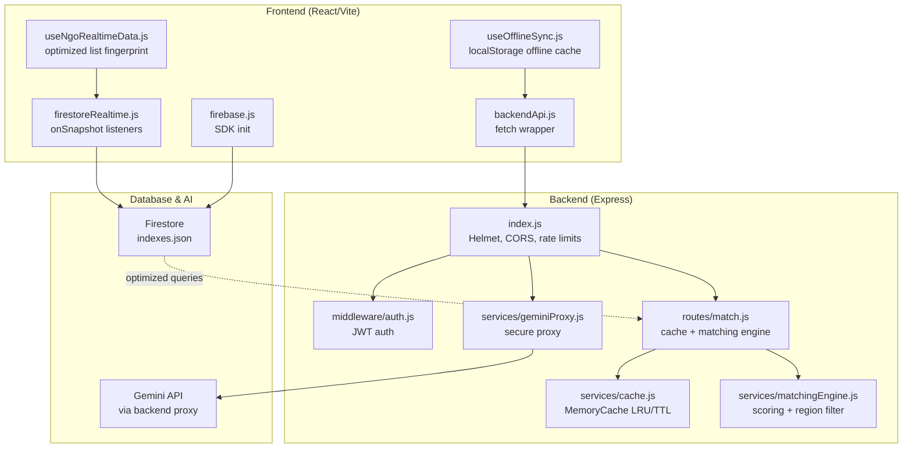
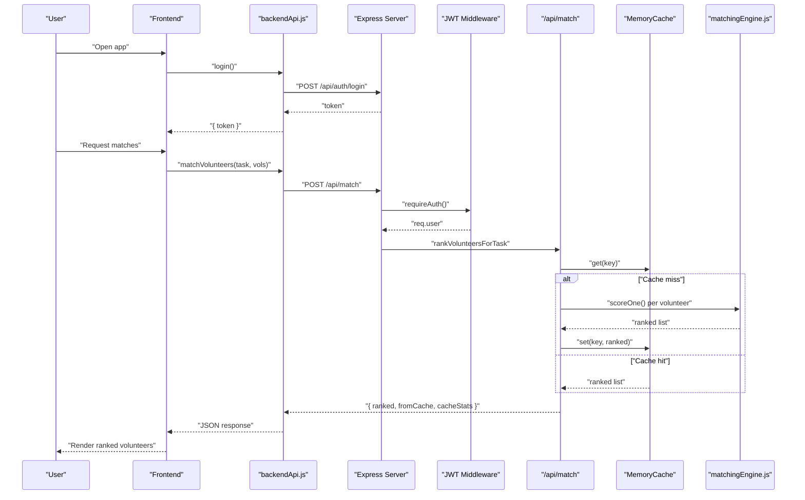
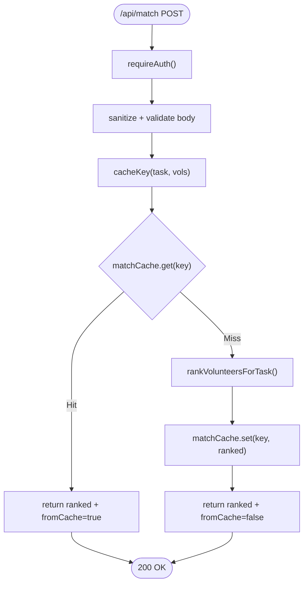
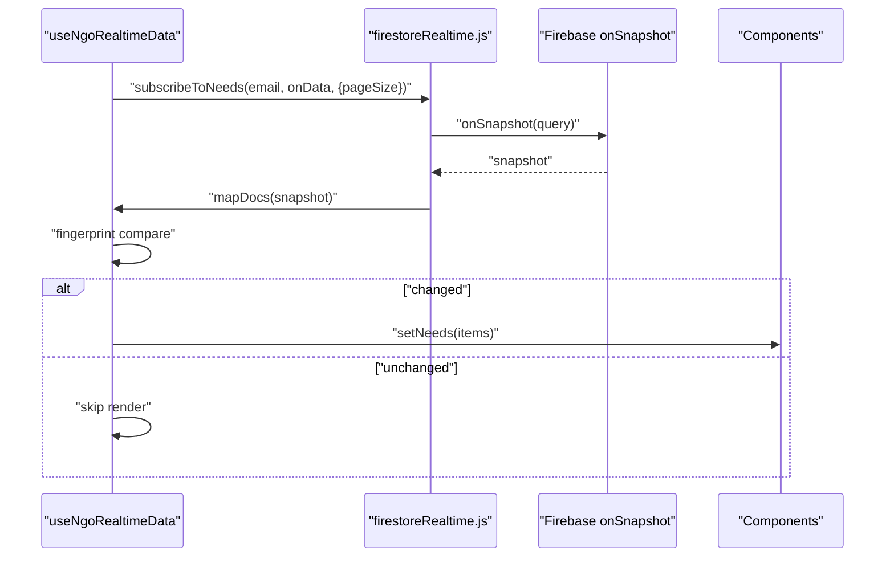
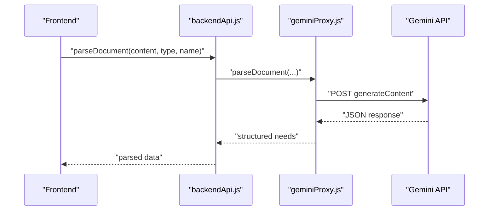
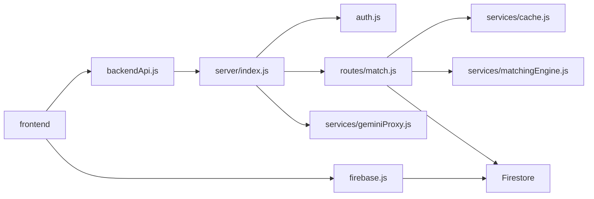

# Performance Optimization

<cite>
**Referenced Files in This Document**
- [package.json](file://package.json)
- [vite.config.js](file://vite.config.js)
- [server/package.json](file://server/package.json)
- [server/index.js](file://server/index.js)
- [server/config.js](file://server/config.js)
- [server/middleware/auth.js](file://server/middleware/auth.js)
- [server/routes/match.js](file://server/routes/match.js)
- [server/services/cache.js](file://server/services/cache.js)
- [server/services/matchingEngine.js](file://server/services/matchingEngine.js)
- [server/services/geminiProxy.js](file://server/services/geminiProxy.js)
- [firestore.indexes.json](file://firestore.indexes.json)
- [src/services/backendApi.js](file://src/services/backendApi.js)
- [src/services/gemini.js](file://src/services/gemini.js)
- [src/services/firestoreRealtime.js](file://src/services/firestoreRealtime.js)
- [src/hooks/useNgoRealtimeData.js](file://src/hooks/useNgoRealtimeData.js)
- [src/hooks/useOfflineSync.js](file://src/hooks/useOfflineSync.js)
- [src/firebase.js](file://src/firebase.js)
</cite>

## Table of Contents
1. [Introduction](#introduction)
2. [Project Structure](#project-structure)
3. [Core Components](#core-components)
4. [Architecture Overview](#architecture-overview)
5. [Detailed Component Analysis](#detailed-component-analysis)
6. [Dependency Analysis](#dependency-analysis)
7. [Performance Considerations](#performance-considerations)
8. [Troubleshooting Guide](#troubleshooting-guide)
9. [Conclusion](#conclusion)
10. [Appendices](#appendices)

## Introduction
This document provides a comprehensive performance optimization guide for the Echo5 platform. It covers frontend bundling and caching, backend API optimization and rate limiting, real-time data synchronization with Firestore, AI service proxying and caching, monitoring and profiling, deployment and scalability, and performance testing validation. The goal is to improve speed, responsiveness, and throughput while maintaining reliability and security.

## Project Structure
The project follows a clear separation of concerns:
- Frontend built with Vite and React, with environment-driven configuration and proxying to the backend during development.
- Backend server built with Express, secured with Helmet, CORS, and rate limiting; routes for authentication, AI proxy, and matching engine.
- Real-time data via Firebase Firestore with efficient listeners and pagination.
- AI services proxied through the backend to keep API keys client-safe.

**Diagram sources**
- [vite.config.js:1-19](file://vite.config.js#L1-L19)
- [server/index.js:16-118](file://server/index.js#L16-L118)
- [server/routes/match.js:1-120](file://server/routes/match.js#L1-L120)
- [server/services/cache.js:1-66](file://server/services/cache.js#L1-L66)
- [server/services/matchingEngine.js:1-212](file://server/services/matchingEngine.js#L1-L212)
- [server/services/geminiProxy.js:1-104](file://server/services/geminiProxy.js#L1-L104)
- [src/services/backendApi.js:1-164](file://src/services/backendApi.js#L1-L164)
- [src/services/firestoreRealtime.js:1-212](file://src/services/firestoreRealtime.js#L1-L212)
- [src/hooks/useNgoRealtimeData.js:1-83](file://src/hooks/useNgoRealtimeData.js#L1-L83)
- [src/hooks/useOfflineSync.js:1-72](file://src/hooks/useOfflineSync.js#L1-L72)
- [src/firebase.js:1-35](file://src/firebase.js#L1-L35)
- [firestore.indexes.json:1-46](file://firestore.indexes.json#L1-L46)

**Section sources**
- [package.json:1-43](file://package.json#L1-L43)
- [vite.config.js:1-19](file://vite.config.js#L1-L19)
- [server/package.json:1-18](file://server/package.json#L1-L18)
- [server/index.js:16-118](file://server/index.js#L16-L118)

## Core Components
- Frontend HTTP client with token persistence and environment-driven base URL.
- Real-time subscriptions with de-duplication and pagination.
- Offline-first caching with localStorage queueing.
- Backend security middleware, rate limiting, and route protection.
- Matching engine with server-side caching and region filtering.
- Gemini proxy to avoid exposing API keys on the client.
- Firestore indexes aligned with query patterns.

**Section sources**
- [src/services/backendApi.js:17-54](file://src/services/backendApi.js#L17-L54)
- [src/services/firestoreRealtime.js:29-59](file://src/services/firestoreRealtime.js#L29-L59)
- [src/hooks/useNgoRealtimeData.js:8-24](file://src/hooks/useNgoRealtimeData.js#L8-L24)
- [src/hooks/useOfflineSync.js:13-58](file://src/hooks/useOfflineSync.js#L13-L58)
- [server/index.js:28-101](file://server/index.js#L28-L101)
- [server/routes/match.js:11-77](file://server/routes/match.js#L11-L77)
- [server/services/cache.js:10-65](file://server/services/cache.js#L10-L65)
- [server/services/matchingEngine.js:166-182](file://server/services/matchingEngine.js#L166-L182)
- [server/services/geminiProxy.js:53-103](file://server/services/geminiProxy.js#L53-L103)
- [firestore.indexes.json:1-46](file://firestore.indexes.json#L1-L46)

## Architecture Overview
The platform employs a thin frontend that delegates compute-intensive work to the backend and uses Firebase for real-time updates. Security is enforced at the gateway level, and performance is optimized through caching, pagination, and efficient queries.

**Diagram sources**
- [src/services/backendApi.js:63-82](file://src/services/backendApi.js#L63-L82)
- [src/services/backendApi.js:134-139](file://src/services/backendApi.js#L134-L139)
- [server/index.js:74-76](file://server/index.js#L74-L76)
- [server/middleware/auth.js:14-37](file://server/middleware/auth.js#L14-L37)
- [server/routes/match.js:33-77](file://server/routes/match.js#L33-L77)
- [server/services/cache.js:21-44](file://server/services/cache.js#L21-L44)
- [server/services/matchingEngine.js:166-182](file://server/services/matchingEngine.js#L166-L182)

## Detailed Component Analysis

### Frontend Optimization Strategies
- Bundle optimization and dev/prod proxying:
  - Vite plugin stack and proxy configuration enable fast local iteration and seamless backend routing during development.
  - Environment variable controls the API base URL for production deployments.
- Lazy loading:
  - Route-level code splitting is implicit through dynamic imports in pages; consider explicit React.lazy boundaries around heavy components to defer rendering until needed.
- Caching strategies:
  - Token persistence in session storage avoids repeated login prompts.
  - Offline-first hooks cache recent data snapshots and queue actions when offline, reducing redundant network calls and improving resilience.

**Section sources**
- [vite.config.js:6-18](file://vite.config.js#L6-L18)
- [src/services/backendApi.js:17-29](file://src/services/backendApi.js#L17-L29)
- [src/hooks/useOfflineSync.js:13-58](file://src/hooks/useOfflineSync.js#L13-L58)

### Backend Performance Enhancements
- Security and request handling:
  - Helmet hardens headers; Morgan logs requests; CORS whitelists origins; body size limits differentiate general and AI routes.
- Rate limiting:
  - Global and AI-specific rate limits protect expensive operations; configurable windows and thresholds.
- API optimization:
  - JWT middleware enforces auth; route handlers validate bodies and sanitize inputs.
- Matching engine caching:
  - Stable cache keys derived from task and volunteer IDs; LRU eviction and TTL; cache stats exposed for monitoring.

**Diagram sources**
- [server/routes/match.js:33-77](file://server/routes/match.js#L33-L77)
- [server/services/cache.js:21-44](file://server/services/cache.js#L21-L44)
- [server/services/matchingEngine.js:166-182](file://server/services/matchingEngine.js#L166-L182)

**Section sources**
- [server/index.js:28-101](file://server/index.js#L28-L101)
- [server/middleware/auth.js:14-37](file://server/middleware/auth.js#L14-L37)
- [server/routes/match.js:11-77](file://server/routes/match.js#L11-L77)
- [server/services/cache.js:10-65](file://server/services/cache.js#L10-L65)

### Real-Time Data Synchronization Optimizations
- Efficient listeners:
  - onSnapshot subscriptions with pagination and ordering minimize payload sizes.
  - Unread notification counts use targeted queries to reduce bandwidth.
- De-duplication:
  - Fingerprint comparison prevents unnecessary renders when data lists are unchanged.
- Pagination:
  - Page size limits applied to notifications and needs reduce initial load and memory footprint.

**Diagram sources**
- [src/hooks/useNgoRealtimeData.js:33-72](file://src/hooks/useNgoRealtimeData.js#L33-L72)
- [src/services/firestoreRealtime.js:61-103](file://src/services/firestoreRealtime.js#L61-L103)

**Section sources**
- [src/services/firestoreRealtime.js:29-59](file://src/services/firestoreRealtime.js#L29-L59)
- [src/hooks/useNgoRealtimeData.js:8-24](file://src/hooks/useNgoRealtimeData.js#L8-L24)

### Firebase Performance Tuning
- Indexes:
  - Composite indexes for incidents, notifications, and resources align with query filters and sort orders, reducing server-side processing and latency.
- Client initialization:
  - Environment variables keep secrets out of the client bundle; analytics initialized conditionally.

**Section sources**
- [firestore.indexes.json:1-46](file://firestore.indexes.json#L1-L46)
- [src/firebase.js:10-19](file://src/firebase.js#L10-L19)

### AI Service Caching Mechanisms
- Secure proxy:
  - Gemini parsing is routed through the backend to keep API keys client-safe.
- Client-side file handling:
  - FileReader utilities convert files to text or base64; all processing is delegated to the backend.
- Recommendation pipeline:
  - Server-side matching engine computes scores and explanations; caching reduces repeated computations.

**Diagram sources**
- [src/services/gemini.js:11-13](file://src/services/gemini.js#L11-L13)
- [src/services/backendApi.js:90-95](file://src/services/backendApi.js#L90-L95)
- [server/services/geminiProxy.js:53-103](file://server/services/geminiProxy.js#L53-L103)

**Section sources**
- [src/services/gemini.js:15-31](file://src/services/gemini.js#L15-L31)
- [src/services/backendApi.js:84-105](file://src/services/backendApi.js#L84-L105)
- [server/services/geminiProxy.js:53-103](file://server/services/geminiProxy.js#L53-L103)

## Dependency Analysis
- Frontend depends on:
  - Environment-driven base URL for API calls.
  - Firebase SDK for real-time and storage.
  - Local storage for offline caching.
- Backend depends on:
  - JWT for authentication.
  - Rate limiting for protection.
  - Matching engine and cache for performance.
  - Gemini proxy for AI processing.

**Diagram sources**
- [src/services/backendApi.js:17-54](file://src/services/backendApi.js#L17-L54)
- [src/firebase.js:10-34](file://src/firebase.js#L10-L34)
- [server/index.js:16-118](file://server/index.js#L16-L118)
- [server/middleware/auth.js:14-37](file://server/middleware/auth.js#L14-L37)
- [server/routes/match.js:11-77](file://server/routes/match.js#L11-L77)
- [server/services/cache.js:10-65](file://server/services/cache.js#L10-L65)
- [server/services/matchingEngine.js:166-182](file://server/services/matchingEngine.js#L166-L182)
- [server/services/geminiProxy.js:53-103](file://server/services/geminiProxy.js#L53-L103)

**Section sources**
- [package.json:12-29](file://package.json#L12-L29)
- [server/package.json:9-16](file://server/package.json#L9-L16)

## Performance Considerations
- Frontend
  - Enable production builds and code splitting for large components.
  - Use React.lazy and Suspense for route-level chunks.
  - Minimize re-renders by leveraging memoization and stable references.
- Backend
  - Tune cache size and TTL based on workload; monitor hit rates.
  - Consider Redis for distributed caching in production.
  - Optimize AI request sizes and timeouts.
- Real-time
  - Keep page sizes reasonable; implement virtualized lists for long feeds.
  - Debounce frequent writes to reduce churn.
- AI
  - Batch processing for reports; cache parsed results.
  - Use streaming where supported to improve perceived latency.
- Monitoring
  - Track cache hit rate, response times, and error rates.
  - Log slow queries and cache misses.
- Deployment
  - Use CDN for static assets; enable compression and caching headers.
  - Scale horizontally; use health checks and readiness probes.
- Testing
  - Load tests with realistic concurrency; measure p95/p99 latency.
  - Validate cache effectiveness and offline behavior.

[No sources needed since this section provides general guidance]

## Troubleshooting Guide
- Authentication failures
  - Verify Authorization header format and token validity; check JWT secret and expiration.
- Rate limit exceeded
  - Review global and AI-specific limits; adjust thresholds or implement client-side retry with backoff.
- Cache performance
  - Monitor cache stats; increase size or TTL if hit rate is low; consider Redis for horizontal scaling.
- Real-time sync issues
  - Confirm query filters and ordering match indexes; verify pagination and unsubscribe handlers.
- AI proxy errors
  - Ensure Gemini API key is configured; validate request payload and content type.

**Section sources**
- [server/middleware/auth.js:14-37](file://server/middleware/auth.js#L14-L37)
- [server/index.js:50-72](file://server/index.js#L50-L72)
- [server/routes/match.js:108-117](file://server/routes/match.js#L108-L117)
- [firestore.indexes.json:1-46](file://firestore.indexes.json#L1-L46)
- [server/services/geminiProxy.js:54-56](file://server/services/geminiProxy.js#L54-L56)

## Conclusion
Echo5’s performance relies on a secure, layered approach: frontend caching and lazy loading, backend rate limiting and caching, efficient Firestore queries, and a secure AI proxy. By tuning cache parameters, optimizing real-time listeners, and implementing robust monitoring, the platform can achieve significant improvements in speed and scalability.

[No sources needed since this section summarizes without analyzing specific files]

## Appendices

### Monitoring and Profiling Tools
- Backend
  - Morgan logs for request telemetry; integrate structured logging and metrics collection.
  - Expose cache stats and health endpoints for dashboards.
- Frontend
  - Measure bundle sizes and chunking; track CLS, FID, and LCP.
  - Use DevTools performance panel and React DevTools profiling.

[No sources needed since this section provides general guidance]

### Performance Metrics Collection
- Backend
  - Response time percentiles, error rates, cache hit ratio, and rate limit counters.
- Frontend
  - Navigation timing, first paint, and interaction delays.
- Real-time
  - Listener attach/detach costs, update frequency, and dedupe effectiveness.

[No sources needed since this section provides general guidance]

### Bottleneck Identification Techniques
- Backend
  - CPU and memory profiling; identify slow routes and cache misses.
- Frontend
  - Bundle analyzer; identify oversized components and excessive re-renders.
- Real-time
  - Observe listener churn and query cost; adjust page sizes and indexes.

[No sources needed since this section provides general guidance]

### Deployment Optimization Strategies
- Static assets
  - CDN distribution; long-lived cache headers; gzip/brotli compression.
- Reverse proxy
  - Use Nginx or cloud CDN to terminate TLS and forward to Node.js.
- Scaling
  - Horizontal pod autoscaling; health checks; blue/green deployments.

[No sources needed since this section provides general guidance]

### Performance Testing Procedures
- Load testing
  - Simulate concurrent users; measure throughput and latency under stress.
- Validation
  - Compare cache hit rates pre/post; verify offline sync correctness; confirm real-time responsiveness.

[No sources needed since this section provides general guidance]